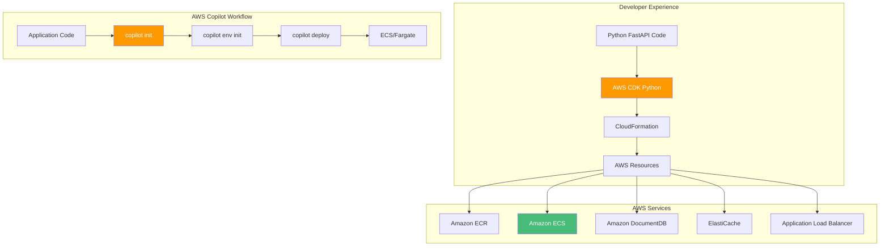

# AWS CDK & Copilot: Multi-Cloud Python Container Deployments

## Deploying FastAPI Applications to AWS ECS with Infrastructure as Code

### Introduction: The Multi-Cloud Python Strategy

In the [previous installment](#) of this Python series, we explored GitHub Actions CI/CD—the automation backbone that enables teams to ship FastAPI applications faster and safer. While Azure provides a robust platform for Python workloads, many organizations adopt a **multi-cloud strategy**—deploying applications across Azure, AWS, and on-premises to ensure resilience, avoid vendor lock-in, and optimize costs.

For the **AI Powered Video Tutorial Portal**—a FastAPI application with MongoDB integration, JWT authentication, and comprehensive API key management—AWS provides powerful container services that complement Azure deployments. **AWS CDK (Cloud Development Kit)** and **AWS Copilot** represent the infrastructure-as-code tools that bring the same developer experience to AWS that Python developers enjoy with Azure.

This installment explores the complete workflow for deploying FastAPI applications to AWS using CDK and Copilot. We'll master infrastructure-as-code with Python, deploy to Amazon ECS with Fargate, configure load balancers, integrate with AWS services (DocumentDB, ElastiCache, Secrets Manager), and implement GitOps workflows—all while maintaining the ability to deploy across both Azure and AWS from a single codebase.



### Stories at a Glance

**Complete Python series (10 stories):**

- 🐍 **1. Poetry + Docker Multi-Stage: The Modern Python Approach** – Leveraging Poetry for dependency management with optimized multi-stage Docker builds for FastAPI applications

- ⚡ **2. UV + Docker: Blazing Fast Python Package Management** – Using the ultra-fast UV package installer for sub-second dependency resolution in container builds

- 📦 **3. Pip + Docker: The Classic Python Containerization** – Traditional requirements.txt approach with multi-stage builds and layer caching optimization

- 🚀 **4. Azure Container Apps: Serverless Python Deployment** – Deploying FastAPI applications to Azure Container Apps with auto-scaling and managed infrastructure

- 💻 **5. Visual Studio Code Dev Containers: Local Development to Production** – Using VS Code Dev Containers for consistent development environments and seamless deployment

- 🔧 **6. Azure Developer CLI (azd) with Python: The Turnkey Solution** – Full-stack deployments with `azd up`, Azure Container Apps provisioning, and infrastructure-as-code with Bicep

- 🔒 **7. Tarball Export + Runtime Load: Security-First CI/CD Workflows** – Generating container tarballs without a runtime, integrating with Trivy/Grype for vulnerability scanning, and deploying to air-gapped Azure environments

- ☸️ **8. Azure Kubernetes Service (AKS): Python Microservices at Scale** – Deploying FastAPI applications to AKS, Helm charts, GitOps with Flux, and production-grade operations

- 🤖 **9. GitHub Actions + Container Registry: CI/CD for Python** – Automated container builds, testing, and deployment with GitHub Actions workflows

- 🏗️ **10. AWS CDK & Copilot: Multi-Cloud Python Container Deployments** – Deploying Python FastAPI applications to AWS ECS with AWS Copilot, infrastructure-as-code with CDK, and Fargate serverless orchestration *(This story)*

---

## Understanding AWS CDK for Python Developers

### What Is AWS CDK?

The AWS Cloud Development Kit (CDK) is an open-source software development framework that allows developers to define cloud infrastructure using familiar programming languages—including Python. For Python FastAPI developers, this is a game-changer: infrastructure becomes code, with all the benefits of abstraction, reuse, and type safety.

| Concept | Description | Python Analogy |
|---------|-------------|----------------|
| **Construct** | The basic building block of CDK apps | A Python class |
| **Stack** | A unit of deployment, maps to CloudFormation | A deployment unit |
| **App** | Container for one or more stacks | A Python module |
| **Environment** | Target AWS account and region | Configuration |
| **Aspect** | Cross-cutting concerns (e.g., tagging) | Python decorators |

### Installing AWS CDK

```bash
# Install Node.js (required for CDK CLI)
# On Ubuntu/Debian
curl -fsSL https://deb.nodesource.com/setup_18.x | sudo -E bash -
sudo apt-get install -y nodejs

# On macOS
brew install node

# Install CDK CLI globally
npm install -g aws-cdk

# Verify installation
cdk --version
# 2.100.0

# Create a new CDK project in Python
mkdir courses-portal-infra
cd courses-portal-infra
cdk init app --language python

# Activate virtual environment
source .venv/bin/activate  # On Windows: .venv\Scripts\activate

# Install AWS CDK Python library
pip install aws-cdk-lib constructs
```

---

## AWS Copilot: The Turnkey Solution for Containers

### What Is AWS Copilot?

AWS Copilot is a command-line tool that abstracts the complexity of deploying containerized applications to AWS. It provides a simplified, opinionated workflow that works out of the box with best practices for Python FastAPI applications.

| Concept | Description | AWS Service |
|---------|-------------|-------------|
| **Application** | Collection of related services | Parent container |
| **Service** | Containerized workload | ECS service |
| **Environment** | Deployment target (dev, staging, prod) | Account/region |
| **Job** | One-time or scheduled task | ECS task |
| **Pipeline** | CI/CD automation | CodePipeline |

### Installing AWS Copilot

```bash
# Install Copilot on macOS/Linux
curl -Lo copilot https://github.com/aws/copilot-cli/releases/latest/download/copilot-linux
chmod +x copilot
sudo mv copilot /usr/local/bin/copilot

# Or on macOS with Homebrew
brew install aws/tap/copilot-cli

# Verify installation
copilot --version
# 1.30.0

# Configure AWS credentials (if not already)
aws configure
```

---

## AWS CDK Infrastructure for FastAPI

### Step 1: CDK Project Setup

```python
# app.py
#!/usr/bin/env python3
from aws_cdk import App, Environment, Tags
from stacks.courses_portal_stack import CoursesPortalStack

app = App()

# Production stack
CoursesPortalStack(
    app,
    "CoursesPortalStack-Prod",
    env=Environment(account="123456789012", region="us-east-1"),
    tags={
        "Environment": "Production",
        "Application": "CoursesPortal",
        "ManagedBy": "CDK"
    }
)

# Development stack
CoursesPortalStack(
    app,
    "CoursesPortalStack-Dev",
    env=Environment(account="123456789012", region="us-east-1"),
    tags={
        "Environment": "Development",
        "Application": "CoursesPortal",
        "ManagedBy": "CDK"
    }
)

app.synth()
```

### Step 2: Main Stack Definition

```python
# stacks/courses_portal_stack.py
from aws_cdk import (
    Stack,
    aws_ec2 as ec2,
    aws_ecs as ecs,
    aws_ecs_patterns as ecs_patterns,
    aws_ecr as ecr,
    aws_docdb as docdb,
    aws_elasticache as elasticache,
    aws_secretsmanager as secretsmanager,
    aws_iam as iam,
    aws_elasticloadbalancingv2 as elbv2,
    RemovalPolicy,
    Duration,
    CfnOutput,
)
from constructs import Construct

class CoursesPortalStack(Stack):
    def __init__(self, scope: Construct, id: str, **kwargs) -> None:
        super().__init__(scope, id, **kwargs)

        # ============================================
        # VPC CONFIGURATION
        # ============================================
        vpc = ec2.Vpc(
            self, "CoursesPortalVpc",
            max_azs=3,
            nat_gateways=1,
            subnet_configuration=[
                ec2.SubnetConfiguration(
                    name="Public",
                    subnet_type=ec2.SubnetType.PUBLIC,
                    cidr_mask=24
                ),
                ec2.SubnetConfiguration(
                    name="Private",
                    subnet_type=ec2.SubnetType.PRIVATE_WITH_EGRESS,
                    cidr_mask=24
                )
            ]
        )

        # ============================================
        # ECR REPOSITORY
        # ============================================
        repository = ecr.Repository(
            self, "CoursesPortalRepo",
            repository_name="courses-portal-api",
            removal_policy=RemovalPolicy.DESTROY,
            image_scan_on_push=True,
            encryption=ecr.RepositoryEncryption.AES_256
        )

        # ============================================
        # SECRETS MANAGER
        # ============================================
        jwt_secret = secretsmanager.Secret(
            self, "JwtSecret",
            secret_name="courses-portal/jwt-secret",
            generate_secret_string=secretsmanager.SecretStringGenerator(
                secret_string_template='{"secret": ""}',
                generate_string_key="secret",
                password_length=32
            )
        )

        # ============================================
        # AMAZON DOCUMENTDB (MongoDB-compatible)
        # ============================================
        db_security_group = ec2.SecurityGroup(
            self, "DatabaseSecurityGroup",
            vpc=vpc,
            description="DocumentDB security group"
        )

        docdb_cluster = docdb.DatabaseCluster(
            self, "CoursesDatabase",
            master_user=docdb.Login(
                username="courses_admin",
                password=secretsmanager.Secret.from_secret_name_v2(
                    self, "DbPassword",
                    secret_name="courses-portal/db-password"
                ).secret_value
            ),
            instance_type=ec2.InstanceType.of(
                ec2.InstanceClass.R5,
                ec2.InstanceSize.LARGE
            ),
            instances=2,
            vpc=vpc,
            vpc_subnets=ec2.SubnetSelection(
                subnet_type=ec2.SubnetType.PRIVATE_WITH_EGRESS
            ),
            security_group=db_security_group,
            removal_policy=RemovalPolicy.DESTROY
        )

        # ============================================
        # ELASTICACHE FOR REDIS
        # ============================================
        redis_security_group = ec2.SecurityGroup(
            self, "RedisSecurityGroup",
            vpc=vpc,
            description="Redis security group"
        )

        redis_subnet_group = elasticache.CfnSubnetGroup(
            self, "RedisSubnetGroup",
            description="Redis subnet group",
            subnet_ids=vpc.select_subnets(
                subnet_type=ec2.SubnetType.PRIVATE_WITH_EGRESS
            ).subnet_ids
        )

        redis_cluster = elasticache.CfnCacheCluster(
            self, "RedisCluster",
            cluster_name="courses-portal-redis",
            engine="redis",
            cache_node_type="cache.t3.small",
            num_cache_nodes=1,
            vpc_security_group_ids=[redis_security_group.security_group_id],
            cache_subnet_group_name=redis_subnet_group.ref
        )

        # ============================================
        # ECS CLUSTER
        # ============================================
        cluster = ecs.Cluster(
            self, "CoursesPortalCluster",
            vpc=vpc,
            container_insights=True
        )

        # ============================================
        # FARGATE SERVICE
        # ============================================
        fargate_service = ecs_patterns.ApplicationLoadBalancedFargateService(
            self, "CoursesPortalService",
            cluster=cluster,
            service_name="courses-portal-api",
            task_image_options=ecs_patterns.ApplicationLoadBalancedTaskImageOptions(
                image=ecs.ContainerImage.from_ecr_repository(repository, "latest"),
                container_port=8000,
                environment={
                    "ASPNETCORE_ENVIRONMENT": "Production",
                    "AWS_REGION": self.region,
                    "MONGODB_DB": "courses_portal",
                    "REDIS_HOST": redis_cluster.attr_redis_endpoint_address,
                    "REDIS_PORT": "6379",
                    "API_KEY_ENABLED": "true"
                },
                secrets={
                    "JWT_SECRET_KEY": ecs.Secret.from_secrets_manager(jwt_secret),
                    "MONGODB_URI": ecs.Secret.from_secrets_manager(
                        secretsmanager.Secret.from_secret_name_v2(
                            self, "DbConnectionString",
                            secret_name="courses-portal/mongodb-uri"
                        )
                    )
                }
            ),
            desired_count=3,
            memory_limit_mib=512,
            cpu=256,
            public_load_balancer=True,
            idle_timeout=Duration.seconds(60),
            health_check_grace_period=Duration.seconds(60)
        )

        # ============================================
        # HEALTH CHECK CONFIGURATION
        # ============================================
        fargate_service.target_group.configure_health_check(
            path="/health",
            interval=Duration.seconds(30),
            timeout=Duration.seconds(5),
            healthy_threshold_count=2,
            unhealthy_threshold_count=3
        )

        # ============================================
        # AUTO SCALING
        # ============================================
        scaling = fargate_service.service.auto_scale_task_count(
            min_capacity=2,
            max_capacity=10
        )

        scaling.scale_on_cpu_utilization(
            "CpuScaling",
            target_utilization_percent=70,
            scale_in_cooldown=Duration.seconds(60),
            scale_out_cooldown=Duration.seconds(30)
        )

        scaling.scale_on_memory_utilization(
            "MemoryScaling",
            target_utilization_percent=80,
            scale_in_cooldown=Duration.seconds(60),
            scale_out_cooldown=Duration.seconds(30)
        )

        scaling.scale_on_request_count(
            "RequestScaling",
            target_requests_per_second=500,
            scale_in_cooldown=Duration.seconds(60),
            scale_out_cooldown=Duration.seconds(30)
        )

        # ============================================
        # IAM ROLES FOR SERVICE ACCOUNTS
        # ============================================
        task_role = iam.Role(
            self, "TaskRole",
            assumed_by=iam.ServicePrincipal("ecs-tasks.amazonaws.com"),
            managed_policies=[
                iam.ManagedPolicy.from_aws_managed_policy_name("SecretsManagerReadWrite"),
                iam.ManagedPolicy.from_aws_managed_policy_name("CloudWatchAgentServerPolicy")
            ]
        )

        # ============================================
        # OUTPUTS
        # ============================================
        CfnOutput(
            self, "ServiceUrl",
            value=fargate_service.load_balancer.load_balancer_dns_name,
            description="Courses Portal API URL"
        )

        CfnOutput(
            self, "EcrRepositoryUri",
            value=repository.repository_uri,
            description="ECR Repository URI"
        )

        CfnOutput(
            self, "DocumentDbEndpoint",
            value=docdb_cluster.cluster_endpoint.socket_address,
            description="DocumentDB Endpoint"
        )
```

### Step 3: Deploy with CDK

```bash
# Bootstrap CDK (one-time per account/region)
cdk bootstrap aws://123456789012/us-east-1

# Synthesize CloudFormation template
cdk synth

# Deploy development stack
cdk deploy CoursesPortalStack-Dev

# Deploy production stack
cdk deploy CoursesPortalStack-Prod

# Output:
# CoursesPortalStack-Prod.ServiceUrl = courses-porta-Course-1234567890.us-east-1.elb.amazonaws.com
# CoursesPortalStack-Prod.EcrRepositoryUri = 123456789012.dkr.ecr.us-east-1.amazonaws.com/courses-portal-api
# CoursesPortalStack-Prod.DocumentDbEndpoint = coursesdatabase.cluster-xxxxx.us-east-1.docdb.amazonaws.com:27017
```

---

## AWS Copilot Workflow for FastAPI

### Step 1: Initialize Copilot Application

```bash
# Navigate to your FastAPI project
cd Courses-Portal-API-Python

# Initialize Copilot app
copilot init \
    --app courses-portal \
    --name api \
    --type "Load Balanced Web Service" \
    --dockerfile ./Dockerfile \
    --port 8000 \
    --deploy

# Copilot creates:
# copilot/
# ├── api/
# │   └── manifest.yml
# └── environments/
```

### Step 2: Configure Service Manifest

```yaml
# copilot/api/manifest.yml
name: api
type: Load Balanced Web Service

# Architecture and platform
platform:
  os: linux
  arch: arm64  # Use Graviton for cost savings

# Container configuration
image:
  build: ./Dockerfile
  port: 8000

# CPU and memory
cpu: 512
memory: 1024

# Environment variables
variables:
  ASPNETCORE_ENVIRONMENT: Production
  AWS_REGION: us-east-1
  API_KEY_ENABLED: "true"
  MONGODB_DB: courses_portal

# Secrets from AWS Secrets Manager
secrets:
  JWT_SECRET_KEY: /copilot/courses-portal/production/secrets/JWT_SECRET_KEY
  MONGODB_URI: /copilot/courses-portal/production/secrets/MONGODB_URI

# Count and autoscaling
count:
  range: 2-10
  cpu_percentage: 70
  memory_percentage: 80
  requests: 500

# Health check
healthcheck:
  path: /health
  interval: 30s
  timeout: 5s
  healthy_threshold: 2
  unhealthy_threshold: 3

# Network
network:
  vpc:
    placement: private

# Storage
storage:
  volumes:
    logs:
      path: /app/logs
      read_only: false
      efs:
        id: fs-12345678
        uid: 1000
        gid: 1000

# Observability
observability:
  tracing: true
  metrics: true
  logs: true
```

### Step 3: Create Environments

```bash
# Create development environment
copilot env init --name dev --profile default --app courses-portal

# Create production environment
copilot env init --name prod --profile production --app courses-portal

# List environments
copilot env ls
# dev
# prod
```

### Step 4: Deploy to Environments

```bash
# Deploy to development
copilot deploy --env dev

# Deploy to production (with approval)
copilot deploy --env prod

# Output:
# Deploying api to courses-portal-prod environment...
# - Creating ECR repository... done
# - Building container image... done
# - Creating ECS service... done
# - Creating load balancer... done
# Service available at: https://api.courses-portal.awsapp.com
```

### Step 5: Add Worker Service

```yaml
# copilot/worker/manifest.yml
name: worker
type: Worker Service

image:
  build: ./Dockerfile.worker
  port: 8001

cpu: 256
memory: 512

variables:
  ASPNETCORE_ENVIRONMENT: Production
  TELEMETRY_BATCH_SIZE: 100

secrets:
  MONGODB_URI: /copilot/courses-portal/production/secrets/MONGODB_URI
```

```bash
# Initialize and deploy worker service
copilot init --name worker --type "Worker Service" --dockerfile ./Dockerfile.worker
copilot deploy --env prod
```

---

## Multi-Cloud Strategy: Azure + AWS

### Shared Configuration for Python

```python
# config.py - Multi-cloud configuration
import os
from pydantic_settings import BaseSettings

class Settings(BaseSettings):
    # Cloud provider detection
    cloud_provider: str = os.getenv("CLOUD_PROVIDER", "azure")
    
    # Database (works with both Azure Cosmos DB and Amazon DocumentDB)
    mongodb_uri: str = os.getenv("MONGODB_URI", "mongodb://localhost:27017")
    mongodb_db: str = os.getenv("MONGODB_DB", "courses_portal")
    
    # Redis (Azure Cache for Redis or ElastiCache)
    redis_host: str = os.getenv("REDIS_HOST", "localhost")
    redis_port: int = int(os.getenv("REDIS_PORT", "6379"))
    
    # JWT
    jwt_secret_key: str = os.getenv("JWT_SECRET_KEY", "dev-secret-key")
    
    # Feature flags
    api_key_enabled: bool = True
    continue_watching_enabled: bool = True
    bookmarks_enabled: bool = True
    
    class Config:
        env_file = ".env"

settings = Settings()
```

### Azure FastAPI Configuration

```yaml
# azure.yaml for Azure Developer CLI
name: courses-portal-api
services:
  api:
    project: .
    host: containerapp
    language: python
    docker:
      path: ./Dockerfile
    target:
      port: 8000
```

### AWS Copilot Manifest

```yaml
# copilot/api/manifest.yml for AWS Copilot
name: api
type: Load Balanced Web Service

image:
  build: ./Dockerfile
  port: 8000

cpu: 512
memory: 1024

variables:
  CLOUD_PROVIDER: aws
  AWS_REGION: us-east-1

secrets:
  JWT_SECRET_KEY: /copilot/courses-portal/production/secrets/JWT_SECRET_KEY
  MONGODB_URI: /copilot/courses-portal/production/secrets/MONGODB_URI
```

---

## CI/CD Across Clouds with GitHub Actions

### Multi-Cloud GitHub Actions Workflow

```yaml
# .github/workflows/multi-cloud-deploy.yml
name: Multi-Cloud Deploy

on:
  push:
    branches: [main]
  workflow_dispatch:

jobs:
  deploy-azure:
    runs-on: ubuntu-latest
    environment: azure-production
    steps:
    - uses: actions/checkout@v4
    
    - name: Login to Azure
      uses: azure/login@v1
      with:
        client-id: ${{ secrets.AZURE_CLIENT_ID }}
        tenant-id: ${{ secrets.AZURE_TENANT_ID }}
        subscription-id: ${{ secrets.AZURE_SUBSCRIPTION_ID }}
    
    - name: Deploy with azd
      run: |
        azd up --environment production --no-prompt

  deploy-aws:
    runs-on: ubuntu-latest
    environment: aws-production
    steps:
    - uses: actions/checkout@v4
    
    - name: Configure AWS credentials
      uses: aws-actions/configure-aws-credentials@v2
      with:
        role-to-assume: arn:aws:iam::123456789012:role/github-actions-role
        aws-region: us-east-1
    
    - name: Deploy with Copilot
      run: |
        copilot deploy --env prod --name api
```

---

## Cost Comparison: Azure vs AWS for Python

| Service | Azure | AWS | Notes |
|---------|-------|-----|-------|
| **Container Registry** | ACR: $5-15/mo | ECR: $0.10/GB/mo | Comparable |
| **Serverless Containers** | ACA: $0-30/mo | ECS Fargate: $0-40/mo | ACA scale to zero cheaper |
| **MongoDB Compatible** | Cosmos DB: $20-200/mo | DocumentDB: $30-300/mo | Cosmos DB has free tier |
| **Redis** | Cache for Redis: $15-60/mo | ElastiCache: $15-50/mo | Comparable |
| **Load Balancer** | Application Gateway: $25-125/mo | ALB: $20-100/mo | Comparable |
| **Total** | **$65-430/mo** | **$80-490/mo** | Azure slightly cheaper for small workloads |

---

## Troubleshooting AWS Deployments

### Issue 1: CDK Bootstrap Not Found

**Error:** `Need to perform AWS CDK bootstrap before deploying`

**Solution:**
```bash
cdk bootstrap aws://123456789012/us-east-1
```

### Issue 2: Copilot Deployment Fails

**Error:** `No such file or directory: Dockerfile`

**Solution:**
```yaml
# copilot/api/manifest.yml
image:
  build: ./Dockerfile  # Ensure correct path
  context: ./
```

### Issue 3: IAM Permissions Insufficient

**Error:** `AccessDenied: User is not authorized to perform: iam:CreateRole`

**Solution:**
```bash
# Add required permissions to IAM user
aws iam attach-user-policy \
    --user-name courses-portal-deployer \
    --policy-arn arn:aws:iam::aws:policy/AdministratorAccess
```

---

## Conclusion: The Multi-Cloud Advantage

AWS CDK and Copilot empower Python FastAPI developers to deploy to AWS with the same infrastructure-as-code patterns used in Azure:

- **Python-first infrastructure** – Define AWS resources with Python, not YAML
- **Simplified ECS deployments** – Copilot abstracts complexity
- **Multi-cloud readiness** – Same application code runs on Azure and AWS
- **Cost optimization** – Choose the best cloud for each workload
- **Resilience** – Deploy across clouds for high availability

For the AI Powered Video Tutorial Portal, AWS CDK and Copilot enable:

- **Infrastructure as code** – Full AWS infrastructure defined in Python
- **Rapid deployment** – Deploy to ECS Fargate in minutes
- **Graviton optimization** – 40% cost savings with ARM64
- **Seamless Azure integration** – Multi-cloud deployment strategy
- **Production-ready patterns** - Auto-scaling, health checks, secrets management

AWS CDK represents the future of Python infrastructure management—bringing the same developer experience to AWS that Python developers love. By mastering these ten approaches, you'll be equipped to deploy FastAPI applications across any cloud, from Azure to AWS and beyond.

---

### Stories at a Glance

**Complete Python series (10 stories):**

- 🐍 **1. Poetry + Docker Multi-Stage: The Modern Python Approach** – Leveraging Poetry for dependency management with optimized multi-stage Docker builds for FastAPI applications

- ⚡ **2. UV + Docker: Blazing Fast Python Package Management** – Using the ultra-fast UV package installer for sub-second dependency resolution in container builds

- 📦 **3. Pip + Docker: The Classic Python Containerization** – Traditional requirements.txt approach with multi-stage builds and layer caching optimization

- 🚀 **4. Azure Container Apps: Serverless Python Deployment** – Deploying FastAPI applications to Azure Container Apps with auto-scaling and managed infrastructure

- 💻 **5. Visual Studio Code Dev Containers: Local Development to Production** – Using VS Code Dev Containers for consistent development environments and seamless deployment

- 🔧 **6. Azure Developer CLI (azd) with Python: The Turnkey Solution** – Full-stack deployments with `azd up`, Azure Container Apps provisioning, and infrastructure-as-code with Bicep

- 🔒 **7. Tarball Export + Runtime Load: Security-First CI/CD Workflows** – Generating container tarballs without a runtime, integrating with Trivy/Grype for vulnerability scanning, and deploying to air-gapped Azure environments

- ☸️ **8. Azure Kubernetes Service (AKS): Python Microservices at Scale** – Deploying FastAPI applications to AKS, Helm charts, GitOps with Flux, and production-grade operations

- 🤖 **9. GitHub Actions + Container Registry: CI/CD for Python** – Automated container builds, testing, and deployment with GitHub Actions workflows

- 🏗️ **10. AWS CDK & Copilot: Multi-Cloud Python Container Deployments** – Deploying Python FastAPI applications to AWS ECS with AWS Copilot, infrastructure-as-code with CDK, and Fargate serverless orchestration *(This story)*

---

## What's Next?

This concludes our comprehensive Python series on containerizing FastAPI applications. We've covered the full spectrum of deployment approaches—from Poetry and UV for dependency management, to Azure Container Apps and AKS for serverless and orchestrated deployments, to multi-cloud strategies with AWS CDK and Copilot.

Whether you're deploying to Azure, AWS, or both, you now have the complete toolkit to succeed with Python FastAPI containerization. Each approach serves different use cases, and the right choice depends on your team's experience, operational requirements, and cloud strategy.

**Thank you for reading this complete Python series!** We've explored every major approach to building, testing, and deploying Python FastAPI container images—from local development with VS Code Dev Containers to enterprise-scale orchestration on Azure Kubernetes Service and AWS ECS. You're now equipped to choose the right tool for every scenario. Happy containerizing! 🚀