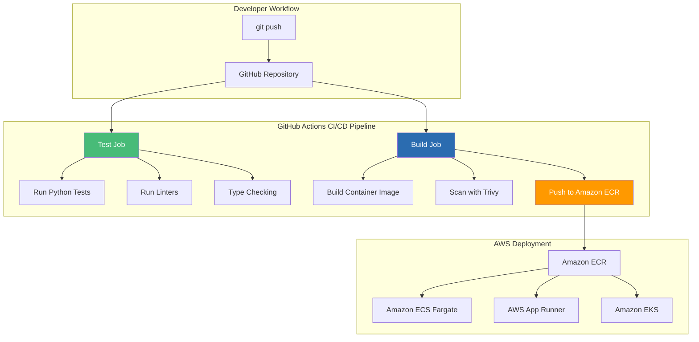
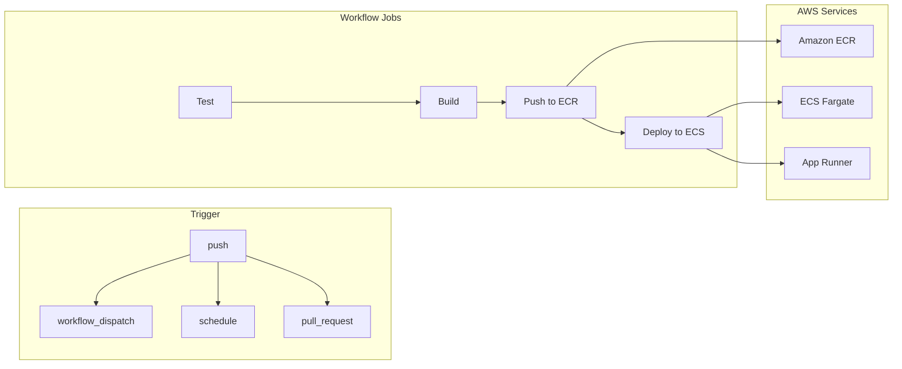

# GitHub Actions + Amazon ECR: CI/CD for Python - AWS

## Automating FastAPI Container Builds, Testing, and Deployment on AWS

### Introduction: The Automation Imperative for Python on AWS

In the [previous installment](#) of this AWS Python series, we explored AWS CDK with Python—the infrastructure-as-code tool that enables defining FastAPI infrastructure with the same language used for application logic. While CDK provides the foundation for infrastructure definition, a critical question remains: **how do you automate the journey from code commit to production deployment on AWS?**

Enter **GitHub Actions**—the CI/CD platform that integrates directly with your Python code repository. For the **AI Powered Video Tutorial Portal**—a FastAPI application with complex dependencies, extensive test suites, and multiple AWS deployment targets—GitHub Actions provides the automation backbone that transforms manual deployment processes into reliable, repeatable, and auditable workflows on Amazon Web Services.

This installment explores the complete CI/CD pipeline for Python FastAPI applications using GitHub Actions with AWS services. We'll master workflow configuration, container building for Amazon ECR, testing strategies, security scanning with Amazon Inspector, and automated deployment to Amazon ECS, all while maintaining the speed and reliability that modern development demands.



### Stories at a Glance

**Complete AWS Python series (10 stories):**

- 🐍 **1. Poetry + Docker Multi-Stage: The Modern Python Approach - AWS** – Leveraging Poetry for dependency management with optimized multi-stage Docker builds for FastAPI applications on Amazon ECR

- ⚡ **2. UV + Docker: Blazing Fast Python Package Management - AWS** – Using the ultra-fast UV package installer for sub-second dependency resolution in container builds for AWS Graviton

- 📦 **3. Pip + Docker: The Classic Python Containerization - AWS** – Traditional requirements.txt approach with multi-stage builds and layer caching optimization for Amazon ECS

- 🚀 **4. AWS Copilot: The Turnkey Container Solution - AWS** – Deploying FastAPI applications to Amazon ECS with AWS Copilot, Fargate, and built-in best practices

- 💻 **5. Visual Studio Code Dev Containers: Local Development to Production - AWS** – Using VS Code Dev Containers for consistent development environments that mirror AWS production

- 🏗️ **6. AWS CDK with Python: Infrastructure as Code for Containers - AWS** – Defining FastAPI infrastructure with Python CDK, deploying to ECS Fargate with auto-scaling

- 🔒 **7. Tarball Export + Runtime Load: Security-First CI/CD Workflows - AWS** – Generating container tarballs, integrating with Amazon Inspector, and deploying to air-gapped AWS environments

- ☸️ **8. Amazon EKS: Python Microservices at Scale - AWS** – Deploying FastAPI applications to Amazon EKS, Helm charts, GitOps with Flux, and production-grade operations

- 🤖 **9. GitHub Actions + Amazon ECR: CI/CD for Python - AWS** – Automated container builds, testing, and deployment with GitHub Actions workflows to AWS *(This story)*

- 🏗️ **10. AWS App Runner: Fully Managed Python Container Service - AWS** – Deploying FastAPI applications to AWS App Runner with zero infrastructure management

---

## Understanding GitHub Actions for Python on AWS

### What Are GitHub Actions?

GitHub Actions is a CI/CD platform that automates software workflows directly from your GitHub repository. For Python FastAPI applications targeting AWS, Actions can:

| Workflow | Purpose | AWS Integration |
|----------|---------|-----------------|
| **Test** | Run unit and integration tests | Validate FastAPI endpoints |
| **Lint** | Check code style | Maintain consistent Python code quality |
| **Type Check** | Verify type hints | Catch type errors before runtime |
| **Build** | Create container images | Package FastAPI for AWS deployment |
| **Scan** | Check for vulnerabilities | Amazon Inspector, Trivy |
| **Push** | Upload to ECR | Store images for ECS/EKS |
| **Deploy** | Deploy to AWS | ECS, App Runner, or EKS |

### GitHub Actions Architecture for AWS



---

## Prerequisites

### GitHub Repository Setup

```bash
# Create repository (if not exists)
gh repo create courses-portal-api --public --source=.

# Set up repository secrets for AWS
gh secret set AWS_ACCOUNT_ID --body "123456789012"
gh secret set AWS_REGION --body "us-east-1"
gh secret set AWS_ROLE_ARN --body "arn:aws:iam::123456789012:role/github-actions-role"
gh secret set ECR_REPOSITORY --body "courses-api"
```

### AWS IAM Role for GitHub Actions

```json
{
  "Version": "2012-10-17",
  "Statement": [
    {
      "Effect": "Allow",
      "Principal": {
        "Federated": "arn:aws:iam::123456789012:oidc-provider/token.actions.githubusercontent.com"
      },
      "Action": "sts:AssumeRoleWithWebIdentity",
      "Condition": {
        "StringEquals": {
          "token.actions.githubusercontent.com:aud": "sts.amazonaws.com"
        },
        "StringLike": {
          "token.actions.githubusercontent.com:sub": "repo:courses-portal/courses-portal-api:*"
        }
      }
    }
  ]
}
```

### IAM Role Policy

```json
{
  "Version": "2012-10-17",
  "Statement": [
    {
      "Effect": "Allow",
      "Action": [
        "ecr:GetAuthorizationToken",
        "ecr:BatchCheckLayerAvailability",
        "ecr:InitiateLayerUpload",
        "ecr:UploadLayerPart",
        "ecr:CompleteLayerUpload",
        "ecr:PutImage"
      ],
      "Resource": "*"
    },
    {
      "Effect": "Allow",
      "Action": [
        "ecs:UpdateService",
        "ecs:DescribeServices",
        "ecs:RegisterTaskDefinition",
        "ecs:DescribeTaskDefinition"
      ],
      "Resource": "*"
    },
    {
      "Effect": "Allow",
      "Action": [
        "secretsmanager:GetSecretValue"
      ],
      "Resource": "arn:aws:secretsmanager:us-east-1:123456789012:secret:courses-portal/*"
    }
  ]
}
```

---

## Complete CI/CD Workflow

### Main Workflow File

```yaml
# .github/workflows/ci-cd.yml
name: Python FastAPI CI/CD Pipeline for AWS

on:
  push:
    branches: [main, develop]
    paths-ignore:
      - '**.md'
      - 'docs/**'
  pull_request:
    branches: [main]
  workflow_dispatch:

env:
  PYTHON_VERSION: '3.11'
  AWS_REGION: us-east-1
  ECR_REPOSITORY: courses-api
  ECS_CLUSTER: courses-portal-cluster
  ECS_SERVICE: courses-portal-api
  ECS_TASK_DEFINITION: courses-portal-api

permissions:
  id-token: write
  contents: read
  security-events: write

jobs:
  # ============================================
  # TEST JOB
  # ============================================
  test:
    name: Test Python Application
    runs-on: ubuntu-latest
    steps:
    - name: Checkout code
      uses: actions/checkout@v4
    
    - name: Set up Python
      uses: actions/setup-python@v5
      with:
        python-version: ${{ env.PYTHON_VERSION }}
    
    - name: Cache pip packages
      uses: actions/cache@v3
      with:
        path: ~/.cache/pip
        key: ${{ runner.os }}-pip-${{ hashFiles('requirements.txt') }}
        restore-keys: |
          ${{ runner.os }}-pip-
    
    - name: Install dependencies
      run: |
        pip install -r requirements.txt
        pip install pytest pytest-cov flake8 mypy black isort
    
    - name: Lint with flake8
      run: |
        flake8 src/ --count --select=E9,F63,F7,F82 --show-source --statistics
        flake8 src/ --count --exit-zero --max-complexity=10 --max-line-length=88 --statistics
    
    - name: Format check with black
      run: |
        black --check src/ tests/
    
    - name: Import sorting check with isort
      run: |
        isort --check-only --profile black src/ tests/
    
    - name: Type check with mypy
      run: |
        mypy src/ --ignore-missing-imports
    
    - name: Run tests with pytest
      run: |
        pytest tests/ -v --cov=src --cov-report=xml --cov-report=html
    
    - name: Upload coverage to Codecov
      uses: codecov/codecov-action@v3
      with:
        file: ./coverage.xml
        flags: unittests
        name: codecov-umbrella

  # ============================================
  # BUILD AND PUSH JOB
  # ============================================
  build:
    name: Build and Push to Amazon ECR
    needs: test
    if: github.ref == 'refs/heads/main' && success()
    runs-on: ubuntu-latest
    steps:
    - name: Checkout code
      uses: actions/checkout@v4
    
    - name: Set up Docker Buildx
      uses: docker/setup-buildx-action@v3
    
    - name: Configure AWS credentials
      uses: aws-actions/configure-aws-credentials@v2
      with:
        role-to-assume: ${{ secrets.AWS_ROLE_ARN }}
        aws-region: ${{ env.AWS_REGION }}
    
    - name: Login to Amazon ECR
      id: login-ecr
      uses: aws-actions/amazon-ecr-login@v1
    
    - name: Install Trivy
      run: |
        wget https://github.com/aquasecurity/trivy/releases/download/v0.48.0/trivy_0.48.0_Linux-64bit.deb
        sudo dpkg -i trivy_0.48.0_Linux-64bit.deb
    
    - name: Build Docker image
      run: |
        docker build -t ${{ env.ECR_REPOSITORY }}:${{ github.sha }} .
    
    - name: Run Trivy vulnerability scan
      run: |
        trivy image --severity HIGH,CRITICAL --exit-code 1 --ignore-unfixed ${{ env.ECR_REPOSITORY }}:${{ github.sha }}
    
    - name: Tag and push to ECR
      run: |
        docker tag ${{ env.ECR_REPOSITORY }}:${{ github.sha }} ${{ steps.login-ecr.outputs.registry }}/${{ env.ECR_REPOSITORY }}:${{ github.sha }}
        docker tag ${{ env.ECR_REPOSITORY }}:${{ github.sha }} ${{ steps.login-ecr.outputs.registry }}/${{ env.ECR_REPOSITORY }}:latest
        docker push ${{ steps.login-ecr.outputs.registry }}/${{ env.ECR_REPOSITORY }}:${{ github.sha }}
        docker push ${{ steps.login-ecr.outputs.registry }}/${{ env.ECR_REPOSITORY }}:latest
    
    - name: Upload image digest
      run: |
        echo "image=${{ steps.login-ecr.outputs.registry }}/${{ env.ECR_REPOSITORY }}:${{ github.sha }}" >> $GITHUB_OUTPUT
      id: image-digest

  # ============================================
  # DEPLOY TO ECS JOB
  # ============================================
  deploy-ecs:
    name: Deploy to Amazon ECS
    needs: build
    if: github.ref == 'refs/heads/main' && success()
    runs-on: ubuntu-latest
    environment: production
    steps:
    - name: Configure AWS credentials
      uses: aws-actions/configure-aws-credentials@v2
      with:
        role-to-assume: ${{ secrets.AWS_ROLE_ARN }}
        aws-region: ${{ env.AWS_REGION }}
    
    - name: Download task definition
      run: |
        aws ecs describe-task-definition --task-definition ${{ env.ECS_TASK_DEFINITION }} --query taskDefinition > task-definition.json
    
    - name: Update task definition with new image
      id: task-def
      uses: aws-actions/amazon-ecs-render-task-definition@v1
      with:
        task-definition: task-definition.json
        container-name: api
        image: ${{ needs.build.outputs.image }}
    
    - name: Deploy to ECS
      uses: aws-actions/amazon-ecs-deploy-task-definition@v1
      with:
        task-definition: ${{ steps.task-def.outputs.task-definition }}
        service: ${{ env.ECS_SERVICE }}
        cluster: ${{ env.ECS_CLUSTER }}
        wait-for-service-stability: true

  # ============================================
  # DEPLOY TO APP RUNNER (OPTIONAL)
  # ============================================
  deploy-app-runner:
    name: Deploy to AWS App Runner
    needs: build
    if: github.ref == 'refs/heads/main' && success()
    runs-on: ubuntu-latest
    steps:
    - name: Configure AWS credentials
      uses: aws-actions/configure-aws-credentials@v2
      with:
        role-to-assume: ${{ secrets.AWS_ROLE_ARN }}
        aws-region: ${{ env.AWS_REGION }}
    
    - name: Update App Runner service
      run: |
        aws apprunner update-service \
          --service-arn arn:aws:apprunner:us-east-1:123456789012:service/courses-api/xxx \
          --source-configuration '{
            "ImageRepository": {
              "ImageIdentifier": "${{ needs.build.outputs.image }}",
              "ImageConfiguration": {
                "Port": "8000"
              }
            }
          }'
```

---

## Advanced Workflow Patterns

### Matrix Testing for Multiple Python Versions

```yaml
# .github/workflows/matrix-test.yml
name: Matrix Testing

on:
  pull_request:
    branches: [main]
  push:
    branches: [develop]

jobs:
  test:
    runs-on: ubuntu-latest
    strategy:
      matrix:
        python-version: ['3.10', '3.11', '3.12']
        fastapi-version: ['0.104.0', '0.105.0']
    
    steps:
    - uses: actions/checkout@v4
    
    - name: Set up Python ${{ matrix.python-version }}
      uses: actions/setup-python@v5
      with:
        python-version: ${{ matrix.python-version }}
    
    - name: Install dependencies
      run: |
        pip install fastapi==${{ matrix.fastapi-version }}
        pip install -r requirements.txt
        pip install pytest
    
    - name: Run tests
      run: |
        pytest tests/ -v
```

### Multi-Architecture Build for Graviton

```yaml
# .github/workflows/multi-arch-build.yml
name: Multi-Architecture Build

on:
  push:
    branches: [main]

jobs:
  build:
    runs-on: ubuntu-latest
    steps:
    - uses: actions/checkout@v4
    
    - name: Set up QEMU
      uses: docker/setup-qemu-action@v3
    
    - name: Set up Docker Buildx
      uses: docker/setup-buildx-action@v3
    
    - name: Configure AWS credentials
      uses: aws-actions/configure-aws-credentials@v2
      with:
        role-to-assume: ${{ secrets.AWS_ROLE_ARN }}
        aws-region: us-east-1
    
    - name: Login to Amazon ECR
      uses: aws-actions/amazon-ecr-login@v1
    
    - name: Build and push multi-arch
      uses: docker/build-push-action@v5
      with:
        context: .
        platforms: linux/amd64,linux/arm64
        push: true
        tags: |
          ${{ steps.login-ecr.outputs.registry }}/courses-api:latest
          ${{ steps.login-ecr.outputs.registry }}/courses-api:${{ github.sha }}
```

### Security Scanning with Amazon Inspector

```yaml
# .github/workflows/security-scan.yml
name: Security Scan

on:
  push:
    branches: [main]
  schedule:
    - cron: '0 0 * * *'  # Daily scan
  workflow_dispatch:

jobs:
  security-scan:
    runs-on: ubuntu-latest
    steps:
    - uses: actions/checkout@v4
    
    - name: Build Docker image
      run: docker build -t courses-api:scan .
    
    - name: Install Trivy
      run: |
        wget https://github.com/aquasecurity/trivy/releases/download/v0.48.0/trivy_0.48.0_Linux-64bit.deb
        sudo dpkg -i trivy_0.48.0_Linux-64bit.deb
    
    - name: Run Trivy scan
      run: |
        trivy image --severity HIGH,CRITICAL --format sarif --output trivy-results.sarif courses-api:scan
    
    - name: Upload to GitHub Security
      uses: github/codeql-action/upload-sarif@v3
      with:
        sarif_file: trivy-results.sarif
    
    - name: Install Grype
      run: |
        curl -sSfL https://raw.githubusercontent.com/anchore/grype/main/install.sh | sh -s -- -b /usr/local/bin
    
    - name: Run Grype license scan
      run: |
        grype courses-api:scan --fail-on high --output json > grype-results.json
    
    - name: Check restricted licenses
      run: |
        DENIED_COUNT=$(jq '.matches[] | select(.artifact.licenses[] | .value == "GPL-3.0")' grype-results.json | wc -l)
        if [ $DENIED_COUNT -gt 0 ]; then
          echo "Found $DENIED_COUNT restricted licenses!"
          exit 1
        fi
```

---

## Environment-Specific Deployments

### Multi-Environment Workflow

```yaml
# .github/workflows/environment-deploy.yml
name: Environment-Specific Deployment

on:
  push:
    branches: [develop, staging, main]

env:
  AWS_REGION: us-east-1

jobs:
  deploy:
    runs-on: ubuntu-latest
    environment: ${{ github.ref_name }}
    
    steps:
    - uses: actions/checkout@v4
    
    - name: Set environment variables
      run: |
        if [ "${{ github.ref_name }}" == "main" ]; then
          echo "ENVIRONMENT=prod" >> $GITHUB_ENV
          echo "ECS_CLUSTER=courses-portal-prod" >> $GITHUB_ENV
          echo "ECS_SERVICE=courses-api-prod" >> $GITHUB_ENV
          echo "MIN_REPLICAS=2" >> $GITHUB_ENV
          echo "MAX_REPLICAS=10" >> $GITHUB_ENV
        elif [ "${{ github.ref_name }}" == "staging" ]; then
          echo "ENVIRONMENT=staging" >> $GITHUB_ENV
          echo "ECS_CLUSTER=courses-portal-staging" >> $GITHUB_ENV
          echo "ECS_SERVICE=courses-api-staging" >> $GITHUB_ENV
          echo "MIN_REPLICAS=1" >> $GITHUB_ENV
          echo "MAX_REPLICAS=5" >> $GITHUB_ENV
        else
          echo "ENVIRONMENT=dev" >> $GITHUB_ENV
          echo "ECS_CLUSTER=courses-portal-dev" >> $GITHUB_ENV
          echo "ECS_SERVICE=courses-api-dev" >> $GITHUB_ENV
          echo "MIN_REPLICAS=0" >> $GITHUB_ENV
          echo "MAX_REPLICAS=3" >> $GITHUB_ENV
        fi
    
    - name: Configure AWS credentials
      uses: aws-actions/configure-aws-credentials@v2
      with:
        role-to-assume: ${{ secrets.AWS_ROLE_ARN }}
        aws-region: ${{ env.AWS_REGION }}
    
    - name: Login to Amazon ECR
      uses: aws-actions/amazon-ecr-login@v1
    
    - name: Build and push
      run: |
        docker build -t courses-api:${{ github.sha }} .
        docker tag courses-api:${{ github.sha }} ${{ steps.login-ecr.outputs.registry }}/courses-api-${{ env.ENVIRONMENT }}:${{ github.sha }}
        docker push ${{ steps.login-ecr.outputs.registry }}/courses-api-${{ env.ENVIRONMENT }}:${{ github.sha }}
    
    - name: Update ECS service
      run: |
        aws ecs update-service \
          --cluster ${{ env.ECS_CLUSTER }} \
          --service ${{ env.ECS_SERVICE }} \
          --force-new-deployment \
          --desired-count ${{ env.MIN_REPLICAS }}
```

---

## Optimizing Build Performance

### Docker Layer Caching

```yaml
# .github/workflows/cached-build.yml
name: Cached Docker Build

on:
  push:
    branches: [main]

jobs:
  build:
    runs-on: ubuntu-latest
    steps:
    - uses: actions/checkout@v4
    
    - name: Set up Docker Buildx
      uses: docker/setup-buildx-action@v3
    
    - name: Cache Docker layers
      uses: actions/cache@v3
      with:
        path: /tmp/.buildx-cache
        key: ${{ runner.os }}-buildx-${{ github.sha }}
        restore-keys: |
          ${{ runner.os }}-buildx-
    
    - name: Configure AWS credentials
      uses: aws-actions/configure-aws-credentials@v2
      with:
        role-to-assume: ${{ secrets.AWS_ROLE_ARN }}
        aws-region: us-east-1
    
    - name: Login to Amazon ECR
      uses: aws-actions/amazon-ecr-login@v1
    
    - name: Build and push with cache
      uses: docker/build-push-action@v5
      with:
        context: .
        push: true
        tags: ${{ steps.login-ecr.outputs.registry }}/courses-api:latest
        cache-from: type=local,src=/tmp/.buildx-cache
        cache-to: type=local,dest=/tmp/.buildx-cache-new,mode=max
    
    - name: Move cache
      run: |
        rm -rf /tmp/.buildx-cache
        mv /tmp/.buildx-cache-new /tmp/.buildx-cache
```

### Python Dependency Caching

```yaml
- name: Cache pip packages
  uses: actions/cache@v3
  with:
    path: ~/.cache/pip
    key: ${{ runner.os }}-pip-${{ hashFiles('requirements.txt') }}
    restore-keys: |
      ${{ runner.os }}-pip-
```

---

## Notifications and Monitoring

### Slack Notifications

```yaml
- name: Notify Slack on failure
  if: failure()
  uses: slackapi/slack-github-action@v1.24.0
  with:
    payload: |
      {
        "text": "❌ Deployment failed for ${{ github.repository }}!\nCommit: ${{ github.sha }}\nAuthor: ${{ github.actor }}\nWorkflow: ${{ github.workflow }}\nAWS Region: us-east-1\nService: courses-api"
      }
  env:
    SLACK_WEBHOOK_URL: ${{ secrets.SLACK_WEBHOOK_URL }}
```

### Microsoft Teams Notifications

```yaml
- name: Notify Teams on success
  if: success()
  uses: aliencube/microsoft-teams-actions@v1
  with:
    webhook_uri: ${{ secrets.TEAMS_WEBHOOK_URL }}
    title: "✅ AWS Deployment Successful"
    summary: "${{ github.repository }} deployed to ECS"
    sections: |
      [
        {
          "activityTitle": "Deployment: ${{ github.sha }}",
          "activitySubtitle": "Branch: ${{ github.ref_name }}",
          "facts": [
            {
              "name": "AWS Region",
              "value": "us-east-1"
            },
            {
              "name": "Service",
              "value": "courses-api"
            },
            {
              "name": "Image Tag",
              "value": "${{ github.sha }}"
            }
          ]
        }
      ]
```

---

## Troubleshooting GitHub Actions on AWS

### Issue 1: OIDC Authentication Failed

**Error:** `Unable to assume role`

**Solution:**
```yaml
# Ensure proper permissions in workflow
permissions:
  id-token: write
  contents: read

# Verify IAM role trust policy
aws iam get-role --role-name github-actions-role --query Role.AssumeRolePolicyDocument
```

### Issue 2: ECR Login Failed

**Error:** `denied: User: arn:aws:sts::xxx is not authorized to perform: ecr:GetAuthorizationToken`

**Solution:**
```json
{
  "Effect": "Allow",
  "Action": "ecr:GetAuthorizationToken",
  "Resource": "*"
}
```

### Issue 3: Docker Build Timeout

**Error:** `Build timed out after 5 minutes`

**Solution:**
```yaml
- name: Build and push
  uses: docker/build-push-action@v5
  with:
    context: .
    push: true
    tags: ${{ env.ECR_REGISTRY }}/courses-api:latest
    cache-from: type=gha
    cache-to: type=gha,mode=max
```

### Issue 4: ECS Service Not Updating

**Error:** `Service is not stable`

**Solution:**
```yaml
- name: Deploy to ECS
  uses: aws-actions/amazon-ecs-deploy-task-definition@v1
  with:
    task-definition: ${{ steps.task-def.outputs.task-definition }}
    service: ${{ env.ECS_SERVICE }}
    cluster: ${{ env.ECS_CLUSTER }}
    wait-for-service-stability: true  # Wait for deployment to complete
```

---

## Performance Metrics

| Metric | Without Cache | With Cache | Improvement |
|--------|---------------|------------|-------------|
| **pip install** | 60-90s | 10-15s | 75-85% faster |
| **Docker build** | 120-180s | 30-45s | 70-75% faster |
| **Total Pipeline** | 5-8 minutes | 2-3 minutes | 60% faster |
| **ECR Push** | 30-60s | 30-60s | Same |

### Cost Savings

| Metric | Manual Deployment | GitHub Actions |
|--------|-------------------|----------------|
| **Developer Time per Deployment** | 15-30 minutes | 2-3 minutes |
| **Deployment Errors** | Frequent | Rare |
| **Rollback Time** | 10-15 minutes | 2 minutes |
| **Audit Trail** | Manual logs | Automatic |

---

## Conclusion: The Automation Advantage on AWS

GitHub Actions transforms Python FastAPI development on AWS by automating the entire journey from code to cloud:

- **Automated testing** – Catch bugs before they reach AWS production
- **Consistent builds** – Reproducible container images every time
- **Security scanning** – Identify vulnerabilities with Trivy and Amazon Inspector
- **Multi-environment deployment** – Dev → Staging → Production
- **Graviton optimization** – Build for ARM64 architecture automatically
- **Team visibility** – Everyone sees build status and test results
- **Audit trail** – Every deployment is tracked and recorded

For the AI Powered Video Tutorial Portal, GitHub Actions enables:

- **Fast iteration** – Code to AWS in minutes
- **Confident releases** – Tests pass before deployment
- **Security compliance** – Automated vulnerability scanning
- **Multiple environments** – Isolated dev, staging, and production on AWS
- **Team collaboration** – PR checks before merging to main

GitHub Actions represents the modern standard for Python CI/CD on AWS—providing the automation foundation that enables teams to ship FastAPI applications faster, safer, and with greater confidence.

---

### Stories at a Glance

**Complete AWS Python series (10 stories):**

- 🐍 **1. Poetry + Docker Multi-Stage: The Modern Python Approach - AWS** – Leveraging Poetry for dependency management with optimized multi-stage Docker builds for FastAPI applications on Amazon ECR

- ⚡ **2. UV + Docker: Blazing Fast Python Package Management - AWS** – Using the ultra-fast UV package installer for sub-second dependency resolution in container builds for AWS Graviton

- 📦 **3. Pip + Docker: The Classic Python Containerization - AWS** – Traditional requirements.txt approach with multi-stage builds and layer caching optimization for Amazon ECS

- 🚀 **4. AWS Copilot: The Turnkey Container Solution - AWS** – Deploying FastAPI applications to Amazon ECS with AWS Copilot, Fargate, and built-in best practices

- 💻 **5. Visual Studio Code Dev Containers: Local Development to Production - AWS** – Using VS Code Dev Containers for consistent development environments that mirror AWS production

- 🏗️ **6. AWS CDK with Python: Infrastructure as Code for Containers - AWS** – Defining FastAPI infrastructure with Python CDK, deploying to ECS Fargate with auto-scaling

- 🔒 **7. Tarball Export + Runtime Load: Security-First CI/CD Workflows - AWS** – Generating container tarballs, integrating with Amazon Inspector, and deploying to air-gapped AWS environments

- ☸️ **8. Amazon EKS: Python Microservices at Scale - AWS** – Deploying FastAPI applications to Amazon EKS, Helm charts, GitOps with Flux, and production-grade operations

- 🤖 **9. GitHub Actions + Amazon ECR: CI/CD for Python - AWS** – Automated container builds, testing, and deployment with GitHub Actions workflows to AWS *(This story)*

- 🏗️ **10. AWS App Runner: Fully Managed Python Container Service - AWS** – Deploying FastAPI applications to AWS App Runner with zero infrastructure management

---

## What's Next?

This concludes our comprehensive AWS Python series on containerizing FastAPI applications. We've covered the full spectrum of deployment approaches—from Poetry and UV for dependency management, to AWS Copilot and CDK for infrastructure, to GitHub Actions for CI/CD automation.

Whether you're deploying to ECS Fargate, Amazon EKS, or AWS App Runner, you now have the complete toolkit to succeed with Python FastAPI containerization on AWS. Each approach serves different use cases, and the right choice depends on your team's experience, operational requirements, and scaling needs.

**Thank you for reading this complete AWS Python series!** We've explored every major approach to building, testing, and deploying Python FastAPI container images—from local development with VS Code Dev Containers to enterprise-scale orchestration on Amazon EKS. You're now equipped to choose the right tool for every scenario. Happy containerizing on AWS! 🚀

**Coming next in the series:**
**🏗️ AWS App Runner: Fully Managed Python Container Service - AWS** – Deploying FastAPI applications to AWS App Runner with zero infrastructure management