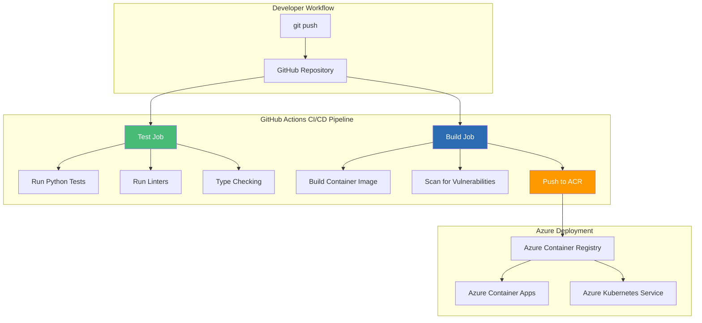
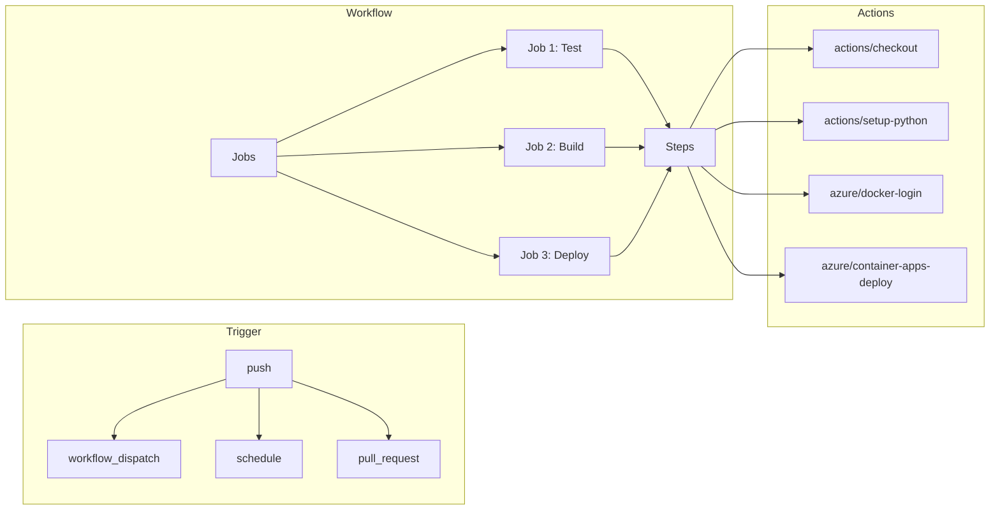

# GitHub Actions + Container Registry: CI/CD for Python

## Automating FastAPI Container Builds, Testing, and Deployment on Azure

### Introduction: The Automation Imperative for Python

In the [previous installment](#) of this Python series, we explored Azure Kubernetes Service (AKS)—the enterprise-grade orchestration platform that enables running FastAPI applications at scale. While AKS provides the runtime infrastructure for production workloads, a critical question remains: **how do you automate the journey from code commit to production deployment?**

Enter **GitHub Actions**—the CI/CD platform that integrates directly with your Python code repository. For the **AI Powered Video Tutorial Portal**—a FastAPI application with complex dependencies, extensive test suites, and multiple deployment targets—GitHub Actions provides the automation backbone that transforms manual deployment processes into reliable, repeatable, and auditable workflows.

This installment explores the complete CI/CD pipeline for Python FastAPI applications using GitHub Actions. We'll master workflow configuration, container building, testing strategies, security scanning, and automated deployment to Azure Container Registry and Azure Container Apps—all while maintaining the speed and reliability that modern development demands.



### Stories at a Glance

**Complete Python series (10 stories):**

- 🐍 **1. Poetry + Docker Multi-Stage: The Modern Python Approach** – Leveraging Poetry for dependency management with optimized multi-stage Docker builds for FastAPI applications

- ⚡ **2. UV + Docker: Blazing Fast Python Package Management** – Using the ultra-fast UV package installer for sub-second dependency resolution in container builds

- 📦 **3. Pip + Docker: The Classic Python Containerization** – Traditional requirements.txt approach with multi-stage builds and layer caching optimization

- 🚀 **4. Azure Container Apps: Serverless Python Deployment** – Deploying FastAPI applications to Azure Container Apps with auto-scaling and managed infrastructure

- 💻 **5. Visual Studio Code Dev Containers: Local Development to Production** – Using VS Code Dev Containers for consistent development environments and seamless deployment

- 🔧 **6. Azure Developer CLI (azd) with Python: The Turnkey Solution** – Full-stack deployments with `azd up`, Azure Container Apps provisioning, and infrastructure-as-code with Bicep

- 🔒 **7. Tarball Export + Runtime Load: Security-First CI/CD Workflows** – Generating container tarballs without a runtime, integrating with Trivy/Grype for vulnerability scanning, and deploying to air-gapped Azure environments

- ☸️ **8. Azure Kubernetes Service (AKS): Python Microservices at Scale** – Deploying FastAPI applications to AKS, Helm charts, GitOps with Flux, and production-grade operations

- 🤖 **9. GitHub Actions + Container Registry: CI/CD for Python** – Automated container builds, testing, and deployment with GitHub Actions workflows *(This story)*

- 🏗️ **10. AWS CDK & Copilot: Multi-Cloud Python Container Deployments** – Deploying Python FastAPI applications to AWS ECS with AWS Copilot, infrastructure-as-code with CDK, and Fargate serverless orchestration

---

## Understanding GitHub Actions for Python

### What Are GitHub Actions?

GitHub Actions is a CI/CD platform that automates software workflows directly from your GitHub repository. For Python FastAPI applications, Actions can:

| Workflow | Purpose | Python Benefit |
|----------|---------|----------------|
| **Test** | Run unit and integration tests | Ensure FastAPI endpoints work correctly |
| **Lint** | Check code style | Maintain consistent Python code quality |
| **Type Check** | Verify type hints | Catch type errors before runtime |
| **Build** | Create container images | Package FastAPI for deployment |
| **Scan** | Check for vulnerabilities | Secure Python dependencies |
| **Deploy** | Push to Azure | Automate release process |

### GitHub Actions Architecture



---

## Prerequisites

### GitHub Repository Setup

```bash
# Create repository (if not exists)
gh repo create courses-portal-api --public --source=.

# Set up repository secrets
gh secret set AZURE_CLIENT_ID --body "$(az ad sp create-for-rbac --name courses-api-sp --role contributor --scopes /subscriptions/$(az account show --query id -o tsv) --sdk-auth | jq -r .clientId)"
gh secret set AZURE_TENANT_ID --body "$(az account show --query tenantId -o tsv)"
gh secret set AZURE_SUBSCRIPTION_ID --body "$(az account show --query id -o tsv)"
gh secret set ACR_USERNAME --body "$(az acr credential show --name coursestutorials --query username -o tsv)"
gh secret set ACR_PASSWORD --body "$(az acr credential show --name coursestutorials --query passwords[0].value -o tsv)"
```

### Azure Resources

```bash
# Create Azure Container Registry
az acr create \
    --resource-group rg-courses-portal \
    --name coursestutorials \
    --sku Standard \
    --admin-enabled true

# Create Azure Container Apps Environment (if not exists)
az containerapp env create \
    --name env-courses-portal \
    --resource-group rg-courses-portal \
    --location eastus
```

---

## Basic CI/CD Workflow

### Complete Workflow File

```yaml
# .github/workflows/ci-cd.yml
name: Python FastAPI CI/CD Pipeline

on:
  push:
    branches: [main, develop]
    paths-ignore:
      - '**.md'
      - 'docs/**'
  pull_request:
    branches: [main]
  workflow_dispatch:

env:
  PYTHON_VERSION: '3.11'
  ACR_NAME: coursestutorials
  IMAGE_NAME: courses-api
  ACA_ENVIRONMENT: env-courses-portal
  ACA_APP_NAME: courses-api

jobs:
  test:
    name: Test Python Application
    runs-on: ubuntu-latest
    
    steps:
    - name: Checkout code
      uses: actions/checkout@v4
    
    - name: Set up Python
      uses: actions/setup-python@v5
      with:
        python-version: ${{ env.PYTHON_VERSION }}
    
    - name: Cache pip packages
      uses: actions/cache@v3
      with:
        path: ~/.cache/pip
        key: ${{ runner.os }}-pip-${{ hashFiles('requirements.txt') }}
        restore-keys: |
          ${{ runner.os }}-pip-
    
    - name: Install dependencies
      run: |
        pip install -r requirements.txt
        pip install pytest pytest-cov flake8 mypy black isort
    
    - name: Lint with flake8
      run: |
        flake8 src/ --count --select=E9,F63,F7,F82 --show-source --statistics
        flake8 src/ --count --exit-zero --max-complexity=10 --max-line-length=88 --statistics
    
    - name: Format check with black
      run: |
        black --check src/ tests/
    
    - name: Import sorting check with isort
      run: |
        isort --check-only --profile black src/ tests/
    
    - name: Type check with mypy
      run: |
        mypy src/ --ignore-missing-imports
    
    - name: Run tests with pytest
      run: |
        pytest tests/ -v --cov=src --cov-report=xml --cov-report=html
    
    - name: Upload coverage to Codecov
      uses: codecov/codecov-action@v3
      with:
        file: ./coverage.xml
        flags: unittests
        name: codecov-umbrella
        fail_ci_if_error: false

  build:
    name: Build and Push Container
    needs: test
    if: github.ref == 'refs/heads/main' && success()
    runs-on: ubuntu-latest
    
    steps:
    - name: Checkout code
      uses: actions/checkout@v4
    
    - name: Set up Docker Buildx
      uses: docker/setup-buildx-action@v3
    
    - name: Login to Azure Container Registry
      uses: azure/docker-login@v1
      with:
        login-server: ${{ env.ACR_NAME }}.azurecr.io
        username: ${{ secrets.ACR_USERNAME }}
        password: ${{ secrets.ACR_PASSWORD }}
    
    - name: Build and push container
      uses: docker/build-push-action@v5
      with:
        context: .
        file: ./Dockerfile
        push: true
        tags: |
          ${{ env.ACR_NAME }}.azurecr.io/${{ env.IMAGE_NAME }}:${{ github.sha }}
          ${{ env.ACR_NAME }}.azurecr.io/${{ env.IMAGE_NAME }}:latest
        cache-from: type=gha
        cache-to: type=gha,mode=max
        labels: |
          org.opencontainers.image.source=${{ github.server_url }}/${{ github.repository }}
          org.opencontainers.image.revision=${{ github.sha }}
          org.opencontainers.image.created=${{ github.event.head_commit.timestamp }}

  deploy:
    name: Deploy to Azure Container Apps
    needs: build
    if: github.ref == 'refs/heads/main' && success()
    runs-on: ubuntu-latest
    environment: production
    
    steps:
    - name: Login to Azure
      uses: azure/login@v1
      with:
        client-id: ${{ secrets.AZURE_CLIENT_ID }}
        tenant-id: ${{ secrets.AZURE_TENANT_ID }}
        subscription-id: ${{ secrets.AZURE_SUBSCRIPTION_ID }}
    
    - name: Deploy to Azure Container Apps
      run: |
        az containerapp update \
          --name ${{ env.ACA_APP_NAME }} \
          --resource-group rg-courses-portal \
          --image ${{ env.ACR_NAME }}.azurecr.io/${{ env.IMAGE_NAME }}:${{ github.sha }} \
          --revision-suffix ${{ github.sha }}
```

---

## Advanced CI/CD Patterns

### Security Scanning Workflow

```yaml
# .github/workflows/security-scan.yml
name: Security Scan

on:
  push:
    branches: [main]
  schedule:
    - cron: '0 0 * * *'  # Daily scan
  workflow_dispatch:

jobs:
  security-scan:
    runs-on: ubuntu-latest
    
    steps:
    - uses: actions/checkout@v4
    
    - name: Build Docker image
      run: |
        docker build -t courses-api:scan .
        docker save courses-api:scan -o image.tar
    
    - name: Install Trivy
      run: |
        wget https://github.com/aquasecurity/trivy/releases/download/v0.48.0/trivy_0.48.0_Linux-64bit.deb
        sudo dpkg -i trivy_0.48.0_Linux-64bit.deb
    
    - name: Run Trivy vulnerability scan
      run: |
        trivy image --input image.tar --severity HIGH,CRITICAL --format sarif --output trivy-results.sarif
    
    - name: Upload Trivy results to GitHub Security
      uses: github/codeql-action/upload-sarif@v3
      with:
        sarif_file: trivy-results.sarif
    
    - name: Install Grype
      run: |
        curl -sSfL https://raw.githubusercontent.com/anchore/grype/main/install.sh | sh -s -- -b /usr/local/bin
    
    - name: Run Grype license scan
      run: |
        grype image.tar --fail-on high --output json > grype-results.json
    
    - name: Check for restricted licenses
      run: |
        DENIED_COUNT=$(jq '.matches[] | select(.artifact.licenses[] | .value == "GPL-3.0")' grype-results.json | wc -l)
        if [ $DENIED_COUNT -gt 0 ]; then
          echo "Found $DENIED_COUNT restricted licenses!"
          exit 1
        fi
```

### Matrix Testing for Multiple Python Versions

```yaml
# .github/workflows/matrix-test.yml
name: Matrix Testing

on:
  pull_request:
    branches: [main]
  push:
    branches: [develop]

jobs:
  test:
    runs-on: ubuntu-latest
    strategy:
      matrix:
        python-version: ['3.10', '3.11', '3.12']
        fastapi-version: ['0.104.0', '0.105.0']
    
    steps:
    - uses: actions/checkout@v4
    
    - name: Set up Python ${{ matrix.python-version }}
      uses: actions/setup-python@v5
      with:
        python-version: ${{ matrix.python-version }}
    
    - name: Install dependencies
      run: |
        pip install fastapi==${{ matrix.fastapi-version }}
        pip install -r requirements.txt
        pip install pytest
    
    - name: Run tests
      run: |
        pytest tests/ -v
```

### Deployment to Multiple Environments

```yaml
# .github/workflows/environment-deploy.yml
name: Environment-Specific Deployment

on:
  push:
    branches: [develop, staging, main]

jobs:
  deploy:
    runs-on: ubuntu-latest
    environment: ${{ github.ref_name }}
    
    steps:
    - uses: actions/checkout@v4
    
    - name: Set environment variables
      run: |
        if [ "${{ github.ref_name }}" == "main" ]; then
          echo "ENVIRONMENT=production" >> $GITHUB_ENV
          echo "ACA_APP_NAME=courses-api-prod" >> $GITHUB_ENV
          echo "MIN_REPLICAS=2" >> $GITHUB_ENV
          echo "MAX_REPLICAS=10" >> $GITHUB_ENV
        elif [ "${{ github.ref_name }}" == "staging" ]; then
          echo "ENVIRONMENT=staging" >> $GITHUB_ENV
          echo "ACA_APP_NAME=courses-api-staging" >> $GITHUB_ENV
          echo "MIN_REPLICAS=1" >> $GITHUB_ENV
          echo "MAX_REPLICAS=5" >> $GITHUB_ENV
        else
          echo "ENVIRONMENT=development" >> $GITHUB_ENV
          echo "ACA_APP_NAME=courses-api-dev" >> $GITHUB_ENV
          echo "MIN_REPLICAS=0" >> $GITHUB_ENV
          echo "MAX_REPLICAS=3" >> $GITHUB_ENV
        fi
    
    - name: Login to Azure
      uses: azure/login@v1
      with:
        client-id: ${{ secrets.AZURE_CLIENT_ID }}
        tenant-id: ${{ secrets.AZURE_TENANT_ID }}
        subscription-id: ${{ secrets.AZURE_SUBSCRIPTION_ID }}
    
    - name: Build and push container
      run: |
        docker build -t coursestutorials.azurecr.io/courses-api:${{ github.sha }} .
        docker push coursestutorials.azurecr.io/courses-api:${{ github.sha }}
    
    - name: Deploy to Container App
      run: |
        az containerapp update \
          --name ${{ env.ACA_APP_NAME }} \
          --resource-group rg-courses-portal \
          --image coursestutorials.azurecr.io/courses-api:${{ github.sha }} \
          --min-replicas ${{ env.MIN_REPLICAS }} \
          --max-replicas ${{ env.MAX_REPLICAS }}
```

---

## Optimizing Build Performance

### Dependency Caching

```yaml
# Caching pip packages
- name: Cache pip packages
  uses: actions/cache@v3
  with:
    path: ~/.cache/pip
    key: ${{ runner.os }}-pip-${{ hashFiles('requirements.txt') }}
    restore-keys: |
      ${{ runner.os }}-pip-

# Caching Docker layers
- name: Cache Docker layers
  uses: actions/cache@v3
  with:
    path: /tmp/.buildx-cache
    key: ${{ runner.os }}-buildx-${{ github.sha }}
    restore-keys: |
      ${{ runner.os }}-buildx-
```

### Conditional Job Execution

```yaml
# Only run specific jobs for certain branches
jobs:
  test:
    runs-on: ubuntu-latest
    
  build:
    runs-on: ubuntu-latest
    needs: test
    if: github.ref == 'refs/heads/main' && success()
  
  deploy-prod:
    runs-on: ubuntu-latest
    needs: build
    if: github.ref == 'refs/heads/main' && success()
  
  deploy-dev:
    runs-on: ubuntu-latest
    needs: test
    if: github.ref == 'refs/heads/develop' && success()
```

### Parallel Job Execution

```yaml
# Parallel jobs run simultaneously
jobs:
  lint:
    runs-on: ubuntu-latest
    
  type-check:
    runs-on: ubuntu-latest
    
  test:
    runs-on: ubuntu-latest
    
  build:
    needs: [lint, type-check, test]  # Wait for all to complete
```

---

## Container Registry Integration

### Azure Container Registry

```yaml
- name: Login to ACR
  uses: azure/docker-login@v1
  with:
    login-server: coursestutorials.azurecr.io
    username: ${{ secrets.ACR_USERNAME }}
    password: ${{ secrets.ACR_PASSWORD }}

- name: Build and push
  uses: docker/build-push-action@v5
  with:
    push: true
    tags: |
      coursestutorials.azurecr.io/courses-api:${{ github.sha }}
      coursestutorials.azurecr.io/courses-api:latest
```

### Docker Hub

```yaml
- name: Login to Docker Hub
  uses: docker/login-action@v3
  with:
    username: ${{ secrets.DOCKER_USERNAME }}
    password: ${{ secrets.DOCKER_PASSWORD }}

- name: Build and push
  uses: docker/build-push-action@v5
  with:
    push: true
    tags: |
      coursesportal/courses-api:${{ github.sha }}
      coursesportal/courses-api:latest
```

### GitHub Container Registry

```yaml
- name: Login to GHCR
  uses: docker/login-action@v3
  with:
    registry: ghcr.io
    username: ${{ github.repository_owner }}
    password: ${{ secrets.GITHUB_TOKEN }}

- name: Build and push
  uses: docker/build-push-action@v5
  with:
    push: true
    tags: |
      ghcr.io/${{ github.repository }}/courses-api:${{ github.sha }}
      ghcr.io/${{ github.repository }}/courses-api:latest
```

---

## Testing Strategies

### Unit Tests with Coverage

```yaml
- name: Run unit tests
  run: |
    pytest tests/unit -v --cov=src --cov-report=xml --cov-report=html

- name: Upload coverage
  uses: codecov/codecov-action@v3
  with:
    file: ./coverage.xml
    flags: unittests
```

### Integration Tests with Docker Compose

```yaml
- name: Start test environment
  run: |
    docker-compose -f docker-compose.test.yml up -d mongodb redis
    sleep 10

- name: Run integration tests
  run: |
    pytest tests/integration -v

- name: Stop test environment
  run: |
    docker-compose -f docker-compose.test.yml down
```

### End-to-End Tests

```yaml
- name: Deploy to test environment
  run: |
    az containerapp update \
      --name courses-api-test \
      --image coursestutorials.azurecr.io/courses-api:${{ github.sha }}

- name: Wait for deployment
  run: |
    sleep 30

- name: Run E2E tests
  run: |
    pytest tests/e2e -v --base-url=https://courses-api-test.eastus.azurecontainerapps.io

- name: Clean up test deployment
  if: always()
  run: |
    az containerapp update \
      --name courses-api-test \
      --image coursestutorials.azurecr.io/courses-api:latest
```

---

## Monitoring and Notifications

### Slack Notifications

```yaml
- name: Notify Slack on failure
  if: failure()
  uses: slackapi/slack-github-action@v1.24.0
  with:
    payload: |
      {
        "text": "❌ Deployment failed for ${{ github.repository }}!\nCommit: ${{ github.sha }}\nAuthor: ${{ github.actor }}\nWorkflow: ${{ github.workflow }}"
      }
  env:
    SLACK_WEBHOOK_URL: ${{ secrets.SLACK_WEBHOOK_URL }}
```

### Microsoft Teams Notifications

```yaml
- name: Notify Teams on success
  if: success()
  uses: aliencube/microsoft-teams-actions@v1
  with:
    webhook_uri: ${{ secrets.TEAMS_WEBHOOK_URL }}
    title: "✅ Deployment Successful"
    summary: "${{ github.repository }} deployed successfully"
    sections: |
      [
        {
          "activityTitle": "Deployment: ${{ github.sha }}",
          "activitySubtitle": "Branch: ${{ github.ref_name }}",
          "facts": [
            {
              "name": "Environment",
              "value": "${{ github.ref_name }}"
            },
            {
              "name": "Image Tag",
              "value": "${{ github.sha }}"
            }
          ]
        }
      ]
```

### Email Notifications

```yaml
- name: Send email on failure
  if: failure()
  uses: dawidd6/action-send-mail@v3
  with:
    server_address: smtp.gmail.com
    server_port: 465
    username: ${{ secrets.MAIL_USERNAME }}
    password: ${{ secrets.MAIL_PASSWORD }}
    subject: "CI/CD Pipeline Failed - ${{ github.repository }}"
    to: devops@coursesportal.com
    from: CI/CD Pipeline <cicd@coursesportal.com>
    body: |
      The CI/CD pipeline for ${{ github.repository }} has failed.
      Commit: ${{ github.sha }}
      Author: ${{ github.actor }}
      Workflow: ${{ github.workflow }}
      Run: ${{ github.server_url }}/${{ github.repository }}/actions/runs/${{ github.run_id }}
```

---

## Troubleshooting GitHub Actions

### Issue 1: Cache Misses

**Problem:** Cache keys not matching, causing full rebuilds

**Solution:**
```yaml
# Use hash of requirements.txt for precise cache keys
- name: Cache pip packages
  uses: actions/cache@v3
  with:
    path: ~/.cache/pip
    key: ${{ runner.os }}-pip-${{ hashFiles('requirements.txt') }}
    restore-keys: |
      ${{ runner.os }}-pip-
```

### Issue 2: Docker Build Timeout

**Problem:** Docker builds taking too long

**Solution:**
```yaml
# Use buildx with cache
- name: Set up Docker Buildx
  uses: docker/setup-buildx-action@v3
  with:
    driver-opts: network=host

- name: Build and push
  uses: docker/build-push-action@v5
  with:
    cache-from: type=gha
    cache-to: type=gha,mode=max
```

### Issue 3: Secrets Not Available

**Problem:** Environment variables not accessible in workflow

**Solution:**
```yaml
# Ensure secrets are properly configured
jobs:
  deploy:
    runs-on: ubuntu-latest
    environment: production  # Links to environment secrets
    
    steps:
    - name: Use secret
      run: echo ${{ secrets.AZURE_CLIENT_ID }}
```

### Issue 4: Parallel Job Dependencies

**Problem:** Jobs run out of order

**Solution:**
```yaml
jobs:
  test:
    runs-on: ubuntu-latest
    
  build:
    needs: test  # Wait for test to complete
    runs-on: ubuntu-latest
    
  deploy:
    needs: build  # Wait for build to complete
    runs-on: ubuntu-latest
```

---

## Performance Metrics

| Metric | Without Cache | With Cache | Improvement |
|--------|---------------|------------|-------------|
| **pip install** | 60-90s | 10-15s | 75-85% faster |
| **Docker build** | 120-180s | 30-45s | 70-75% faster |
| **Total Pipeline** | 3-5 minutes | 1-2 minutes | 50-60% faster |

---

## Conclusion: The Automation Advantage

GitHub Actions transforms Python FastAPI development by automating the entire journey from code to cloud:

- **Automated testing** – Catch bugs before they reach production
- **Consistent builds** – Reproducible container images every time
- **Security scanning** – Identify vulnerabilities automatically
- **Multi-environment deployment** – Dev → Staging → Production
- **Team visibility** – Everyone sees build status and test results
- **Audit trail** – Every deployment is tracked and recorded

For the AI Powered Video Tutorial Portal, GitHub Actions enables:

- **Fast iteration** – Code to production in minutes
- **Confident releases** – Tests pass before deployment
- **Security compliance** – Automated vulnerability scanning
- **Multiple environments** – Isolated dev, staging, and production
- **Team collaboration** – PR checks before merging

GitHub Actions represents the modern standard for Python CI/CD—providing the automation foundation that enables teams to ship FastAPI applications faster, safer, and with greater confidence.

---

### Stories at a Glance

**Complete Python series (10 stories):**

- 🐍 **1. Poetry + Docker Multi-Stage: The Modern Python Approach** – Leveraging Poetry for dependency management with optimized multi-stage Docker builds for FastAPI applications

- ⚡ **2. UV + Docker: Blazing Fast Python Package Management** – Using the ultra-fast UV package installer for sub-second dependency resolution in container builds

- 📦 **3. Pip + Docker: The Classic Python Containerization** – Traditional requirements.txt approach with multi-stage builds and layer caching optimization

- 🚀 **4. Azure Container Apps: Serverless Python Deployment** – Deploying FastAPI applications to Azure Container Apps with auto-scaling and managed infrastructure

- 💻 **5. Visual Studio Code Dev Containers: Local Development to Production** – Using VS Code Dev Containers for consistent development environments and seamless deployment

- 🔧 **6. Azure Developer CLI (azd) with Python: The Turnkey Solution** – Full-stack deployments with `azd up`, Azure Container Apps provisioning, and infrastructure-as-code with Bicep

- 🔒 **7. Tarball Export + Runtime Load: Security-First CI/CD Workflows** – Generating container tarballs without a runtime, integrating with Trivy/Grype for vulnerability scanning, and deploying to air-gapped Azure environments

- ☸️ **8. Azure Kubernetes Service (AKS): Python Microservices at Scale** – Deploying FastAPI applications to AKS, Helm charts, GitOps with Flux, and production-grade operations

- 🤖 **9. GitHub Actions + Container Registry: CI/CD for Python** – Automated container builds, testing, and deployment with GitHub Actions workflows *(This story)*

- 🏗️ **10. AWS CDK & Copilot: Multi-Cloud Python Container Deployments** – Deploying Python FastAPI applications to AWS ECS with AWS Copilot, infrastructure-as-code with CDK, and Fargate serverless orchestration

---

## What's Next?

Over the coming weeks, each approach in this Python series will be explored in exhaustive detail. We'll examine real-world Azure deployment scenarios for the AI Powered Video Tutorial Portal, benchmark performance across methods, and provide production-ready patterns for CI/CD pipelines. Whether you're a startup deploying your first FastAPI application or an enterprise migrating Python workloads to Azure Kubernetes Service, you'll find practical guidance tailored to your infrastructure requirements.

GitHub Actions represents the automation backbone for modern Python development—enabling teams to ship FastAPI applications faster, safer, and with greater confidence. By mastering these ten approaches, you'll be equipped to choose the right tool for every scenario—from rapid prototyping to mission-critical production deployments on Azure Kubernetes Service.

**Coming next in the series:**
**🏗️ AWS CDK & Copilot: Multi-Cloud Python Container Deployments** – Deploying Python FastAPI applications to AWS ECS with AWS Copilot, infrastructure-as-code with CDK, and Fargate serverless orchestration