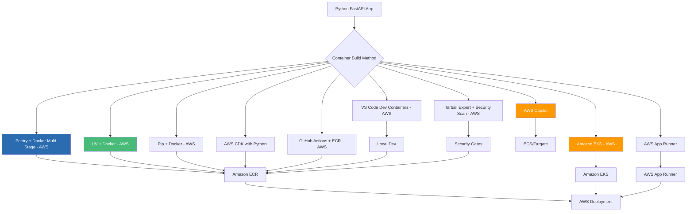

# Publishing Python FastAPI Apps as Container Images: A Complete Guide to 10 Deployment Approaches - AWS

## AWS Edition: From Development to Production on Amazon Web Services

### Introduction: The Python Containerization Journey on AWS

In our previous series, we explored the complete landscape of containerizing .NET 10 applications across Azure and AWS, covering nine distinct approaches for Azure and ten for AWS. That comprehensive guide demonstrated how modern .NET developers have unprecedented flexibility in choosing their container deployment strategy. Now, we turn our attention to the Python ecosystem—specifically FastAPI applications—and adapt those proven patterns for **Amazon Web Services (AWS)**.

Python powers some of the most innovative applications today, particularly in the AI and machine learning space. The **AI Powered Video Tutorial Portal**—a FastAPI-based platform for managing course videos, content, and user engagement with MongoDB—represents exactly the kind of modern Python application that benefits from robust containerization strategies on AWS.

This series adapts the proven patterns from our .NET containerization guide to the Python ecosystem, focusing on AWS deployment with Visual Studio Code as the primary development environment. Whether you're deploying a FastAPI backend, a machine learning service, or a data processing pipeline to AWS, you'll find battle-tested patterns for containerizing Python applications at scale—from Graviton-optimized builds to ECS Fargate and EKS orchestration.



### Stories at a Glance

**Companion stories in this AWS series:**

- 🐍 **1. Poetry + Docker Multi-Stage: The Modern Python Approach - AWS** – Leveraging Poetry for dependency management with optimized multi-stage Docker builds for FastAPI applications on Amazon ECR

- ⚡ **2. UV + Docker: Blazing Fast Python Package Management - AWS** – Using the ultra-fast UV package installer for sub-second dependency resolution in container builds for AWS Graviton

- 📦 **3. Pip + Docker: The Classic Python Containerization - AWS** – Traditional requirements.txt approach with multi-stage builds and layer caching optimization for Amazon ECS

- 🚀 **4. AWS Copilot: The Turnkey Container Solution - AWS** – Deploying FastAPI applications to Amazon ECS with AWS Copilot, Fargate, and built-in best practices

- 💻 **5. Visual Studio Code Dev Containers: Local Development to Production - AWS** – Using VS Code Dev Containers for consistent development environments that mirror AWS production

- 🏗️ **6. AWS CDK with Python: Infrastructure as Code for Containers - AWS** – Defining FastAPI infrastructure with Python CDK, deploying to ECS Fargate with auto-scaling

- 🔒 **7. Tarball Export + Runtime Load: Security-First CI/CD Workflows - AWS** – Generating container tarballs, integrating with Amazon Inspector, and deploying to air-gapped AWS environments

- ☸️ **8. Amazon EKS: Python Microservices at Scale - AWS** – Deploying FastAPI applications to Amazon EKS, Helm charts, GitOps with Flux, and production-grade operations

- 🤖 **9. GitHub Actions + Amazon ECR: CI/CD for Python - AWS** – Automated container builds, testing, and deployment with GitHub Actions workflows to AWS

- 🏗️ **10. AWS App Runner: Fully Managed Python Container Service - AWS** – Deploying FastAPI applications to AWS App Runner with zero infrastructure management

---

## 1. 🐍 Poetry + Docker Multi-Stage: The Modern Python Approach - AWS

### Introduction to Poetry for AWS Containerization

Poetry has emerged as the modern standard for Python dependency management, offering deterministic builds, virtual environment isolation, and lockfile-based reproducibility. For the AI Powered Video Tutorial Portal—a FastAPI application with dependencies like FastAPI, Motor (MongoDB async driver), PyJWT, and Python-multipart—Poetry ensures that container builds are reproducible across AWS environments.

### The Poetry-Optimized Dockerfile for AWS

```dockerfile
# ============================================
# AI Powered Video Tutorial Portal - Poetry Build for AWS
# ============================================
# Optimized for Amazon ECR and ECS Fargate deployment

# Stage 1: Builder with Poetry
FROM python:3.11-slim AS builder

# Install Poetry
RUN pip install poetry==1.7.1

WORKDIR /app

# Copy dependency files first for layer caching
COPY pyproject.toml poetry.lock ./

# Configure Poetry to not create virtual environment in container
RUN poetry config virtualenvs.create false

# Install production dependencies only
RUN poetry install --no-interaction --no-ansi --no-dev

# Stage 2: Runtime
FROM python:3.11-slim AS runtime

# Install runtime dependencies
RUN apt-get update && apt-get install -y \
    curl \
    ca-certificates \
    && rm -rf /var/lib/apt/lists/*

# Create non-root user
RUN useradd --create-home --shell /bin/bash appuser

WORKDIR /app

# Copy installed packages from builder
COPY --from=builder /usr/local/lib/python3.11/site-packages /usr/local/lib/python3.11/site-packages
COPY --from=builder /usr/local/bin /usr/local/bin

# Copy application code
COPY . .

# Set ownership
RUN chown -R appuser:appuser /app
USER appuser

EXPOSE 8000

HEALTHCHECK --interval=30s --timeout=3s --start-period=5s --retries=3 \
    CMD curl -f http://localhost:8000/health || exit 1

CMD ["uvicorn", "server:app", "--host", "0.0.0.0", "--port", "8000"]
```

### Build and Push to Amazon ECR

```bash
# Authenticate to ECR
aws ecr get-login-password --region us-east-1 | \
    docker login --username AWS --password-stdin 123456789012.dkr.ecr.us-east-1.amazonaws.com

# Create ECR repository
aws ecr create-repository --repository-name courses-api --region us-east-1

# Build and push
docker build -t courses-api:latest -f Dockerfile.poetry .
docker tag courses-api:latest 123456789012.dkr.ecr.us-east-1.amazonaws.com/courses-api:latest
docker push 123456789012.dkr.ecr.us-east-1.amazonaws.com/courses-api:latest
```

---

## 2. ⚡ UV + Docker: Blazing Fast Python Package Management - AWS

### UV: The Next-Generation Python Package Installer for AWS

UV, built by the Astral team (creators of Ruff), is a Rust-based Python package installer that dramatically speeds up dependency resolution—often reducing container build times from minutes to seconds on AWS CodeBuild.

### The UV-Optimized Dockerfile for AWS Graviton

```dockerfile
# ============================================
# AI Powered Video Tutorial Portal - UV Build for AWS Graviton
# ============================================
# Optimized for speed on AWS Graviton processors

FROM python:3.11-slim AS builder

# Install UV
COPY --from=ghcr.io/astral-sh/uv:latest /uv /usr/local/bin/uv

WORKDIR /app

# Copy dependency files
COPY pyproject.toml uv.lock ./

# Install dependencies with UV (extremely fast)
RUN uv pip install --system --no-cache -r pyproject.toml

# Copy application code
COPY . .

FROM python:3.11-slim AS runtime

RUN apt-get update && apt-get install -y curl && rm -rf /var/lib/apt/lists/*
RUN useradd --create-home appuser

WORKDIR /app
COPY --from=builder /usr/local/lib/python3.11/site-packages /usr/local/lib/python3.11/site-packages
COPY --from=builder /usr/local/bin /usr/local/bin
COPY --from=builder /app /app

RUN chown -R appuser:appuser /app
USER appuser

EXPOSE 8000
CMD ["uvicorn", "server:app", "--host", "0.0.0.0", "--port", "8000"]
```

---

## 3. 📦 Pip + Docker: The Classic Python Containerization - AWS

### Traditional Requirements.txt Approach for AWS

For teams preferring the classic approach, pip-based Dockerfiles remain a reliable choice for Amazon ECS deployments.

```dockerfile
# ============================================
# AI Powered Video Tutorial Portal - Pip Build for AWS
# ============================================

FROM python:3.11-slim AS builder

WORKDIR /app
COPY requirements.txt .
RUN pip install --user --no-cache-dir -r requirements.txt

FROM python:3.11-slim AS runtime

RUN apt-get update && apt-get install -y curl && rm -rf /var/lib/apt/lists/*
RUN useradd --create-home appuser

WORKDIR /app
COPY --from=builder /root/.local /root/.local
COPY . .

ENV PATH=/root/.local/bin:$PATH
RUN chown -R appuser:appuser /app
USER appuser

EXPOSE 8000
CMD ["uvicorn", "server:app", "--host", "0.0.0.0", "--port", "8000"]
```

---

## 4. 🚀 AWS Copilot: The Turnkey Container Solution - AWS

### Deploying FastAPI to Amazon ECS with Copilot

AWS Copilot provides a simplified, opinionated workflow for deploying containerized applications to ECS Fargate.

```bash
# Initialize Copilot app
copilot init \
    --app courses-portal \
    --name api \
    --type "Load Balanced Web Service" \
    --dockerfile ./Dockerfile \
    --port 8000 \
    --deploy
```

```yaml
# copilot/api/manifest.yml
name: api
type: Load Balanced Web Service

platform:
  os: linux
  arch: arm64  # AWS Graviton for cost savings

image:
  build: ./Dockerfile
  port: 8000

cpu: 512
memory: 1024

variables:
  ASPNETCORE_ENVIRONMENT: Production
  AWS_REGION: us-east-1

secrets:
  JWT_SECRET_KEY: /copilot/courses-portal/production/secrets/JWT_SECRET_KEY
  MONGODB_URI: /copilot/courses-portal/production/secrets/MONGODB_URI

count:
  range: 2-10
  cpu_percentage: 70
  memory_percentage: 80

healthcheck:
  path: /health
  interval: 30s
  timeout: 5s
```

---

## 5. 💻 Visual Studio Code Dev Containers: Local Development to Production - AWS

### Using VS Code Dev Containers for Consistent AWS Development

Dev Containers enable reproducible development environments that mirror AWS production.

```json
// .devcontainer/devcontainer.json
{
  "name": "AI Video Tutorial Portal - AWS",
  "build": {
    "dockerfile": "Dockerfile",
    "context": ".."
  },
  "customizations": {
    "vscode": {
      "extensions": [
        "ms-python.python",
        "amazonwebservices.aws-toolkit-vscode",
        "ms-azuretools.vscode-docker"
      ]
    }
  },
  "forwardPorts": [8000],
  "postCreateCommand": "pip install -r requirements.txt"
}
```

---

## 6. 🏗️ AWS CDK with Python: Infrastructure as Code for Containers - AWS

### Defining FastAPI Infrastructure with Python CDK

```python
# app.py
from aws_cdk import (
    Stack, aws_ecs as ecs, aws_ecs_patterns as ecs_patterns,
    aws_ecr as ecr, aws_ec2 as ec2, App
)
from constructs import Construct

class CoursesPortalStack(Stack):
    def __init__(self, scope: Construct, id: str, **kwargs):
        super().__init__(scope, id, **kwargs)

        vpc = ec2.Vpc(self, "CoursesVpc", max_azs=2)
        
        repository = ecr.Repository(self, "CoursesRepo", repository_name="courses-api")
        
        cluster = ecs.Cluster(self, "CoursesCluster", vpc=vpc)
        
        ecs_patterns.ApplicationLoadBalancedFargateService(
            self, "CoursesService",
            cluster=cluster,
            task_image_options=ecs_patterns.ApplicationLoadBalancedTaskImageOptions(
                image=ecs.ContainerImage.from_ecr_repository(repository, "latest"),
                container_port=8000,
                environment={"ASPNETCORE_ENVIRONMENT": "Production"}
            ),
            desired_count=3,
            memory_limit_mib=512,
            cpu=256
        )

app = App()
CoursesPortalStack(app, "CoursesPortalStack")
app.synth()
```

```bash
cdk deploy
```

---

## 7. 🔒 Tarball Export + Runtime Load: Security-First CI/CD Workflows - AWS

### Security Scanning with Amazon Inspector

```bash
# Build and export tarball
docker build -t courses-api:scan .
docker save courses-api:scan -o courses-api.tar

# Scan with Amazon Inspector (via ECR)
aws ecr create-repository --repository-name temp-scan
docker tag courses-api:scan $ACCOUNT_ID.dkr.ecr.us-east-1.amazonaws.com/temp-scan:scan
docker push $ACCOUNT_ID.dkr.ecr.us-east-1.amazonaws.com/temp-scan:scan

# Wait for Inspector scan
aws inspector2 list-findings --filter-criteria '{
    "severity": [{"comparison": "EQUALS", "value": "CRITICAL"}]
}'

# After approval, load and push
docker load -i courses-api.tar
docker tag courses-api:scan $ACCOUNT_ID.dkr.ecr.us-east-1.amazonaws.com/courses-api:approved
docker push $ACCOUNT_ID.dkr.ecr.us-east-1.amazonaws.com/courses-api:approved
```

---

## 8. ☸️ Amazon EKS: Python Microservices at Scale - AWS

### Deploying FastAPI to Amazon EKS

```yaml
# deployment.yaml
apiVersion: apps/v1
kind: Deployment
metadata:
  name: courses-api
  namespace: courses
spec:
  replicas: 3
  selector:
    matchLabels:
      app: courses-api
  template:
    metadata:
      labels:
        app: courses-api
    spec:
      containers:
      - name: api
        image: $ACCOUNT_ID.dkr.ecr.us-east-1.amazonaws.com/courses-api:latest
        ports:
        - containerPort: 8000
        env:
        - name: JWT_SECRET_KEY
          valueFrom:
            secretKeyRef:
              name: jwt-secret
              key: secret
        resources:
          requests:
            memory: "256Mi"
            cpu: "250m"
          limits:
            memory: "512Mi"
            cpu: "500m"
        livenessProbe:
          httpGet:
            path: /health
            port: 8000
```

---

## 9. 🤖 GitHub Actions + Amazon ECR: CI/CD for Python - AWS

### Automated Python Container Pipeline to AWS

```yaml
# .github/workflows/deploy-aws.yml
name: Deploy to AWS ECS

on:
  push:
    branches: [main]

jobs:
  deploy:
    runs-on: ubuntu-latest
    steps:
    - uses: actions/checkout@v4
    
    - name: Configure AWS credentials
      uses: aws-actions/configure-aws-credentials@v2
      with:
        role-to-assume: arn:aws:iam::123456789012:role/github-actions-role
        aws-region: us-east-1
    
    - name: Login to Amazon ECR
      run: aws ecr get-login-password | docker login --username AWS --password-stdin ${{ secrets.ECR_REGISTRY }}
    
    - name: Build and push
      run: |
        docker build -t courses-api:${{ github.sha }} .
        docker tag courses-api:${{ github.sha }} ${{ secrets.ECR_REGISTRY }}/courses-api:${{ github.sha }}
        docker push ${{ secrets.ECR_REGISTRY }}/courses-api:${{ github.sha }}
    
    - name: Update ECS service
      run: |
        aws ecs update-service --cluster courses-cluster --service courses-api --force-new-deployment
```

---

## 10. 🏗️ AWS App Runner: Fully Managed Python Container Service - AWS

### Deploying FastAPI to AWS App Runner

AWS App Runner is a fully managed container application service that requires no infrastructure management.

```bash
# Create App Runner service from ECR image
aws apprunner create-service \
    --service-name courses-api \
    --source-configuration '{
        "ImageRepository": {
            "ImageIdentifier": "123456789012.dkr.ecr.us-east-1.amazonaws.com/courses-api:latest",
            "ImageConfiguration": {
                "Port": "8000",
                "RuntimeEnvironmentVariables": [
                    {"Name": "ASPNETCORE_ENVIRONMENT", "Value": "Production"}
                ]
            }
        }
    }' \
    --instance-configuration '{
        "Cpu": "1 vCPU",
        "Memory": "2 GB"
    }' \
    --auto-scaling-configuration '{
        "MaxConcurrency": 100,
        "MinSize": 1,
        "MaxSize": 10
    }'
```

---

### Stories at a Glance

**Complete AWS series (10 stories):**

- 🐍 **1. Poetry + Docker Multi-Stage: The Modern Python Approach - AWS** – Leveraging Poetry for dependency management with optimized multi-stage Docker builds for FastAPI applications on Amazon ECR

- ⚡ **2. UV + Docker: Blazing Fast Python Package Management - AWS** – Using the ultra-fast UV package installer for sub-second dependency resolution in container builds for AWS Graviton

- 📦 **3. Pip + Docker: The Classic Python Containerization - AWS** – Traditional requirements.txt approach with multi-stage builds and layer caching optimization for Amazon ECS

- 🚀 **4. AWS Copilot: The Turnkey Container Solution - AWS** – Deploying FastAPI applications to Amazon ECS with AWS Copilot, Fargate, and built-in best practices

- 💻 **5. Visual Studio Code Dev Containers: Local Development to Production - AWS** – Using VS Code Dev Containers for consistent development environments that mirror AWS production

- 🏗️ **6. AWS CDK with Python: Infrastructure as Code for Containers - AWS** – Defining FastAPI infrastructure with Python CDK, deploying to ECS Fargate with auto-scaling

- 🔒 **7. Tarball Export + Runtime Load: Security-First CI/CD Workflows - AWS** – Generating container tarballs, integrating with Amazon Inspector, and deploying to air-gapped AWS environments

- ☸️ **8. Amazon EKS: Python Microservices at Scale - AWS** – Deploying FastAPI applications to Amazon EKS, Helm charts, GitOps with Flux, and production-grade operations

- 🤖 **9. GitHub Actions + Amazon ECR: CI/CD for Python - AWS** – Automated container builds, testing, and deployment with GitHub Actions workflows to AWS

- 🏗️ **10. AWS App Runner: Fully Managed Python Container Service - AWS** – Deploying FastAPI applications to AWS App Runner with zero infrastructure management

---

## What's Next?

Over the coming weeks, each approach in this AWS series will be explored in exhaustive detail. We'll examine real-world AWS deployment scenarios for the AI Powered Video Tutorial Portal, benchmark performance across methods, and provide production-ready patterns for CI/CD pipelines. Whether you're a startup deploying your first FastAPI application on AWS Fargate or an enterprise migrating Python workloads to Amazon EKS, you'll find practical guidance tailored to your infrastructure requirements.

The evolution from pip-based builds to Poetry and UV reflects a maturing ecosystem where Python stands at the forefront of AI-powered application development on AWS. By mastering these ten approaches, you'll be equipped to choose the right tool for every scenario—from rapid prototyping with VS Code Dev Containers to mission-critical production deployments on Amazon EKS and App Runner.

**Coming next in the series:**
**🐍 Poetry + Docker Multi-Stage: The Modern Python Approach - AWS** – We'll explore Poetry-optimized Dockerfiles, layer caching strategies, and Amazon ECR integration for FastAPI applications on AWS Graviton.