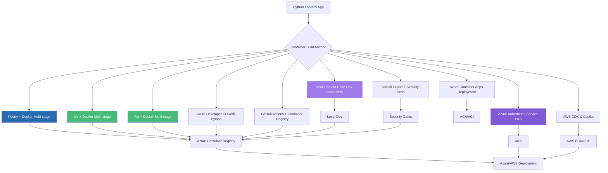

# Publishing Python FastAPI Apps as Container Images: A Complete Guide to 10 Deployment Approaches

## Python Edition: From Development to Production on Azure

### Introduction: The Python Containerization Journey

In our previous series, we explored the complete landscape of containerizing .NET 10 applications—from SDK-native simplicity to Kubernetes orchestration, covering nine distinct approaches for Azure and ten for AWS. That comprehensive guide demonstrated how modern .NET developers have unprecedented flexibility in choosing their container deployment strategy.

Now, we turn our attention to the Python ecosystem. Python powers some of the most innovative applications today, particularly in the AI and machine learning space. The **AI Powered Video Tutorial Portal**—a FastAPI-based platform for managing course videos, content, and user engagement with MongoDB—represents exactly the kind of modern Python application that benefits from robust containerization strategies.

This new series adapts the proven patterns from our .NET containerization guide to the Python ecosystem, focusing on Azure deployment and Visual Studio Code as the primary development environment. Whether you're deploying a FastAPI backend, a machine learning service, or a data processing pipeline, you'll find battle-tested patterns for containerizing Python applications at scale.



### Stories at a Glance

**Companion stories in this Python series:**

- 🐍 **1. Poetry + Docker Multi-Stage: The Modern Python Approach** – Leveraging Poetry for dependency management with optimized multi-stage Docker builds for FastAPI applications

- ⚡ **2. UV + Docker: Blazing Fast Python Package Management** – Using the ultra-fast UV package installer for sub-second dependency resolution in container builds

- 📦 **3. Pip + Docker: The Classic Python Containerization** – Traditional requirements.txt approach with multi-stage builds and layer caching optimization

- 🚀 **4. Azure Container Apps: Serverless Python Deployment** – Deploying FastAPI applications to Azure Container Apps with auto-scaling and managed infrastructure

- 💻 **5. Visual Studio Code Dev Containers: Local Development to Production** – Using VS Code Dev Containers for consistent development environments and seamless deployment

- 🔧 **6. Azure Developer CLI (azd) with Python: The Turnkey Solution** – Full-stack deployments with `azd up`, Azure Container Apps provisioning, and infrastructure-as-code with Bicep

- 🔒 **7. Tarball Export + Runtime Load: Security-First CI/CD Workflows** – Generating container tarballs without a runtime, integrating with Trivy/Grype for vulnerability scanning, and deploying to air-gapped Azure environments

- ☸️ **8. Azure Kubernetes Service (AKS): Python Microservices at Scale** – Deploying FastAPI applications to AKS, Helm charts, GitOps with Flux, and production-grade operations

- 🤖 **9. GitHub Actions + Container Registry: CI/CD for Python** – Automated container builds, testing, and deployment with GitHub Actions workflows

- 🏗️ **10. AWS CDK & Copilot: Multi-Cloud Python Container Deployments** – Deploying Python FastAPI applications to AWS ECS with AWS Copilot, infrastructure-as-code with CDK, and Fargate serverless orchestration

---

## 1. 🐍 Poetry + Docker Multi-Stage: The Modern Python Approach

### Introduction to Poetry for Python Containerization

Poetry has emerged as the modern standard for Python dependency management, offering deterministic builds, virtual environment isolation, and lockfile-based reproducibility. For the AI Powered Video Tutorial Portal—a FastAPI application with dependencies like FastAPI, Motor (MongoDB async driver), PyJWT, and Python-multipart—Poetry ensures that container builds are reproducible across environments.

### The Poetry-Optimized Dockerfile

```dockerfile
# ============================================
# AI Powered Video Tutorial Portal - Poetry Build
# ============================================
# Optimized for Azure Container Registry deployment

# Stage 1: Builder with Poetry
FROM python:3.11-slim AS builder

# Install Poetry
RUN pip install poetry==1.7.1

# Set working directory
WORKDIR /app

# Copy dependency files first for layer caching
COPY pyproject.toml poetry.lock ./

# Configure Poetry to not create virtual environment in container
RUN poetry config virtualenvs.create false

# Install dependencies
RUN poetry install --no-interaction --no-ansi --no-root --only main

# Stage 2: Runtime
FROM python:3.11-slim AS runtime

# Install runtime dependencies
RUN apt-get update && apt-get install -y \
    curl \
    && rm -rf /var/lib/apt/lists/*

# Create non-root user
RUN useradd --create-home --shell /bin/bash appuser

WORKDIR /app

# Copy installed packages from builder
COPY --from=builder /usr/local/lib/python3.11/site-packages /usr/local/lib/python3.11/site-packages
COPY --from=builder /usr/local/bin /usr/local/bin

# Copy application code
COPY . .

# Set ownership
RUN chown -R appuser:appuser /app
USER appuser

# Expose port
EXPOSE 8000

# Health check
HEALTHCHECK --interval=30s --timeout=3s --start-period=5s --retries=3 \
    CMD curl -f http://localhost:8000/health || exit 1

# Run with uvicorn
CMD ["uvicorn", "server:app", "--host", "0.0.0.0", "--port", "8000"]
```

### Build and Push to Azure Container Registry

```bash
# Login to ACR
az acr login --name coursetutorials

# Build and push
docker build -t coursetutorials.azurecr.io/courses-api:latest -f Dockerfile.poetry .
docker push coursetutorials.azurecr.io/courses-api:latest
```

---

## 2. ⚡ UV + Docker: Blazing Fast Python Package Management

### UV: The Next-Generation Python Package Installer

UV, built by the Astral team (creators of Ruff), is a Rust-based Python package installer that dramatically speeds up dependency resolution—often reducing container build times from minutes to seconds.

### The UV-Optimized Dockerfile

```dockerfile
# ============================================
# AI Powered Video Tutorial Portal - UV Build
# ============================================
# Optimized for speed with UV package installer

FROM python:3.11-slim AS builder

# Install UV
COPY --from=ghcr.io/astral-sh/uv:latest /uv /usr/local/bin/uv

WORKDIR /app

# Copy dependency files
COPY pyproject.toml uv.lock ./

# Install dependencies with UV (extremely fast)
RUN uv pip install --system --no-cache -r pyproject.toml

# Copy application code
COPY . .

# Stage 2: Runtime
FROM python:3.11-slim AS runtime

RUN apt-get update && apt-get install -y curl && rm -rf /var/lib/apt/lists/*
RUN useradd --create-home appuser

WORKDIR /app

# Copy installed packages
COPY --from=builder /usr/local/lib/python3.11/site-packages /usr/local/lib/python3.11/site-packages
COPY --from=builder /usr/local/bin /usr/local/bin
COPY --from=builder /app /app

RUN chown -R appuser:appuser /app
USER appuser

EXPOSE 8000

HEALTHCHECK --interval=30s --timeout=3s --start-period=5s --retries=3 \
    CMD curl -f http://localhost:8000/health || exit 1

CMD ["uvicorn", "server:app", "--host", "0.0.0.0", "--port", "8000"]
```

---

## 3. 📦 Pip + Docker: The Classic Python Containerization

### Traditional Requirements.txt Approach

For teams preferring the classic approach, pip-based Dockerfiles remain a reliable choice.

### The Pip-Optimized Dockerfile

```dockerfile
# ============================================
# AI Powered Video Tutorial Portal - Pip Build
# ============================================
# Traditional pip-based multi-stage build

FROM python:3.11-slim AS builder

WORKDIR /app

# Copy requirements first for layer caching
COPY requirements.txt .

# Install dependencies
RUN pip install --user --no-cache-dir -r requirements.txt

FROM python:3.11-slim AS runtime

RUN apt-get update && apt-get install -y curl && rm -rf /var/lib/apt/lists/*
RUN useradd --create-home appuser

WORKDIR /app

# Copy dependencies from builder
COPY --from=builder /root/.local /root/.local

# Copy application
COPY . .

# Ensure scripts are in PATH
ENV PATH=/root/.local/bin:$PATH

RUN chown -R appuser:appuser /app
USER appuser

EXPOSE 8000

HEALTHCHECK --interval=30s --timeout=3s --start-period=5s --retries=3 \
    CMD curl -f http://localhost:8000/health || exit 1

CMD ["uvicorn", "server:app", "--host", "0.0.0.0", "--port", "8000"]
```

---

## 4. 🚀 Azure Container Apps: Serverless Python Deployment

### Deploying FastAPI to Azure Container Apps

Azure Container Apps provides a serverless container platform ideal for Python applications with automatic scaling and integrated networking.

### Bicep Infrastructure

```bicep
// main.bicep
param environmentName string
param location string = resourceGroup().location

// Container Registry
resource acr 'Microsoft.ContainerRegistry/registries@2023-07-01' = {
  name: 'acr${environmentName}'
  location: location
  sku: { name: 'Standard' }
}

// Container Apps Environment
resource logAnalytics 'Microsoft.OperationalInsights/workspaces@2023-09-01' = {
  name: 'log-${environmentName}'
  location: location
  properties: { sku: { name: 'PerGB2018' } }
}

resource containerEnv 'Microsoft.App/managedEnvironments@2023-11-02-preview' = {
  name: 'cae-${environmentName}'
  location: location
  properties: {
    appLogsConfiguration: {
      destination: 'log-analytics'
      logAnalyticsConfiguration: {
        customerId: logAnalytics.properties.customerId
        sharedKey: logAnalytics.listKeys().primarySharedKey
      }
    }
  }
}

// Container App
resource api 'Microsoft.App/containerApps@2023-11-02-preview' = {
  name: 'courses-api'
  location: location
  properties: {
    environmentId: containerEnv.id
    configuration: {
      ingress: {
        external: true
        targetPort: 8000
        traffic: [{ latestRevision: true, weight: 100 }]
      }
      registries: [{
        server: acr.properties.loginServer
        username: acr.properties.adminUserEnabled ? acr.listCredentials().username : null
        passwordSecretRef: 'acr-password'
      }]
    }
    template: {
      containers: [{
        image: '${acr.properties.loginServer}/courses-api:latest'
        name: 'api'
        resources: { cpu: 0.5, memory: '1Gi' }
        probes: [{
          type: 'Liveness'
          httpGet: { path: '/health', port: 8000 }
          initialDelaySeconds: 30
          periodSeconds: 10
        }]
      }]
      scale: {
        minReplicas: 1
        maxReplicas: 10
        rules: [{
          name: 'http'
          http: { metadata: { concurrentRequests: '50' } }
        }]
      }
    }
  }
}
```

---

## 5. 💻 Visual Studio Code Dev Containers: Local Development to Production

### Using VS Code Dev Containers for Consistent Python Development

Dev Containers enable reproducible development environments that mirror production, eliminating "works on my machine" issues.

### .devcontainer/devcontainer.json

```json
{
  "name": "AI Video Tutorial Portal",
  "build": {
    "dockerfile": "Dockerfile",
    "context": ".."
  },
  "customizations": {
    "vscode": {
      "extensions": [
        "ms-python.python",
        "ms-python.vscode-pylance",
        "ms-python.black-formatter",
        "ms-azuretools.vscode-docker",
        "GitHub.copilot",
        "mongodb.mongodb-vscode"
      ],
      "settings": {
        "python.defaultInterpreterPath": "/usr/local/bin/python",
        "python.formatting.provider": "black",
        "editor.formatOnSave": true
      }
    }
  },
  "forwardPorts": [8000, 27017],
  "postCreateCommand": "pip install -r requirements.txt",
  "remoteUser": "vscode"
}
```

### .devcontainer/Dockerfile

```dockerfile
FROM mcr.microsoft.com/devcontainers/python:3.11

# Install additional tools
RUN apt-get update && apt-get install -y \
    curl \
    mongodb-mongosh \
    && rm -rf /var/lib/apt/lists/*

# Install Python packages
COPY requirements.txt /tmp/
RUN pip install --no-cache-dir -r /tmp/requirements.txt

WORKDIR /workspace
```

---

## 6. 🔧 Azure Developer CLI (azd) with Python: The Turnkey Solution

### Full-Stack Deployments with azd

The Azure Developer CLI (`azd`) automates the entire deployment lifecycle for Python applications.

### azure.yaml

```yaml
name: courses-portal-api
metadata:
  template: azd-init@1.0.0

services:
  api:
    project: .
    host: containerapp
    language: python
    docker:
      path: ./Dockerfile
      context: ./
    target:
      port: 8000
```

### Deploy with One Command

```bash
azd init
azd up
```

---

## 7. 🔒 Tarball Export + Runtime Load: Security-First CI/CD Workflows

### Security Scanning for Python Containers

Generate tarballs for security scanning before pushing to Azure Container Registry.

```bash
# Build tarball
docker build -t courses-api:scan -f Dockerfile.poetry .
docker save courses-api:scan -o courses-api.tar

# Scan with Trivy
trivy image --input courses-api.tar --severity HIGH,CRITICAL

# Scan with Grype for license compliance
grype courses-api.tar

# Generate SBOM
syft courses-api.tar -o spdx-json > sbom.json

# Load and push after approval
docker load -i courses-api.tar
docker tag courses-api:scan coursetutorials.azurecr.io/courses-api:approved
docker push coursetutorials.azurecr.io/courses-api:approved
```

---

## 8. ☸️ Azure Kubernetes Service (AKS): Python Microservices at Scale

### Deploying FastAPI to AKS

```yaml
# deployment.yaml
apiVersion: apps/v1
kind: Deployment
metadata:
  name: courses-api
  namespace: courses
spec:
  replicas: 3
  selector:
    matchLabels:
      app: courses-api
  template:
    metadata:
      labels:
        app: courses-api
    spec:
      containers:
      - name: api
        image: coursetutorials.azurecr.io/courses-api:latest
        ports:
        - containerPort: 8000
        env:
        - name: MONGODB_URI
          valueFrom:
            secretKeyRef:
              name: mongodb-secret
              key: uri
        resources:
          requests:
            memory: "256Mi"
            cpu: "250m"
          limits:
            memory: "512Mi"
            cpu: "500m"
        livenessProbe:
          httpGet:
            path: /health
            port: 8000
          initialDelaySeconds: 30
          periodSeconds: 10
```

---

## 9. 🤖 GitHub Actions + Container Registry: CI/CD for Python

### Automated Python Container Pipeline

```yaml
# .github/workflows/deploy.yml
name: Build and Deploy Python API

on:
  push:
    branches: [main]

jobs:
  build:
    runs-on: ubuntu-latest
    steps:
    - uses: actions/checkout@v4
    
    - name: Set up Python
      uses: actions/setup-python@v5
      with:
        python-version: '3.11'
    
    - name: Install dependencies
      run: pip install -r requirements.txt
    
    - name: Run tests
      run: pytest tests/
    
    - name: Login to ACR
      uses: azure/docker-login@v1
      with:
        login-server: coursetutorials.azurecr.io
        username: ${{ secrets.ACR_USERNAME }}
        password: ${{ secrets.ACR_PASSWORD }}
    
    - name: Build and push
      run: |
        docker build -t coursetutorials.azurecr.io/courses-api:${{ github.sha }} .
        docker push coursetutorials.azurecr.io/courses-api:${{ github.sha }}
    
    - name: Deploy to ACA
      run: az containerapp update --name courses-api --resource-group rg-courses --image coursetutorials.azurecr.io/courses-api:${{ github.sha }}
```

---

## 10. 🏗️ AWS CDK & Copilot: Multi-Cloud Python Container Deployments

### Deploying Python to AWS ECS with Copilot

```bash
# Initialize Copilot app
copilot init \
    --app courses-portal \
    --name api \
    --type "Load Balanced Web Service" \
    --dockerfile ./Dockerfile \
    --port 8000 \
    --deploy
```

### AWS CDK with Python

```python
# app.py
from aws_cdk import (
    Stack,
    aws_ecs as ecs,
    aws_ec2 as ec2,
    aws_ecr_assets as assets,
)
from constructs import Construct

class CoursesPortalStack(Stack):
    def __init__(self, scope: Construct, id: str, **kwargs):
        super().__init__(scope, id, **kwargs)

        # VPC
        vpc = ec2.Vpc(self, "CoursesVpc", max_azs=2)

        # ECS Cluster
        cluster = ecs.Cluster(self, "CoursesCluster", vpc=vpc)

        # Task Definition
        task_definition = ecs.FargateTaskDefinition(self, "ApiTask")
        
        container = task_definition.add_container(
            "Api",
            image=assets.AssetImage.from_asset_artifact(
                self, "ApiImage", directory="./"
            ),
            memory_limit_mib=512,
            cpu=256,
            port_mappings=[ecs.PortMapping(container_port=8000)]
        )

        # Fargate Service
        ecs.FargateService(
            self, "ApiService",
            cluster=cluster,
            task_definition=task_definition,
            desired_count=3
        )
```

---

### Stories at a Glance

**Companion stories in this Python series:**

- 🐍 **1. Poetry + Docker Multi-Stage: The Modern Python Approach** – Leveraging Poetry for dependency management with optimized multi-stage Docker builds for FastAPI applications

- ⚡ **2. UV + Docker: Blazing Fast Python Package Management** – Using the ultra-fast UV package installer for sub-second dependency resolution in container builds

- 📦 **3. Pip + Docker: The Classic Python Containerization** – Traditional requirements.txt approach with multi-stage builds and layer caching optimization

- 🚀 **4. Azure Container Apps: Serverless Python Deployment** – Deploying FastAPI applications to Azure Container Apps with auto-scaling and managed infrastructure

- 💻 **5. Visual Studio Code Dev Containers: Local Development to Production** – Using VS Code Dev Containers for consistent development environments and seamless deployment

- 🔧 **6. Azure Developer CLI (azd) with Python: The Turnkey Solution** – Full-stack deployments with `azd up`, Azure Container Apps provisioning, and infrastructure-as-code with Bicep

- 🔒 **7. Tarball Export + Runtime Load: Security-First CI/CD Workflows** – Generating container tarballs without a runtime, integrating with Trivy/Grype for vulnerability scanning, and deploying to air-gapped Azure environments

- ☸️ **8. Azure Kubernetes Service (AKS): Python Microservices at Scale** – Deploying FastAPI applications to AKS, Helm charts, GitOps with Flux, and production-grade operations

- 🤖 **9. GitHub Actions + Container Registry: CI/CD for Python** – Automated container builds, testing, and deployment with GitHub Actions workflows

- 🏗️ **10. AWS CDK & Copilot: Multi-Cloud Python Container Deployments** – Deploying Python FastAPI applications to AWS ECS with AWS Copilot, infrastructure-as-code with CDK, and Fargate serverless orchestration

---

## What's Next?

Over the coming weeks, each approach in this Python series will be explored in exhaustive detail. We'll examine real-world Azure deployment scenarios for the AI Powered Video Tutorial Portal, benchmark performance across methods, and provide production-ready patterns for CI/CD pipelines. Whether you're a startup deploying your first FastAPI application or an enterprise migrating Python workloads to Azure Kubernetes Service, you'll find practical guidance tailored to your infrastructure requirements.

The evolution from pip-based builds to Poetry and UV reflects a maturing ecosystem where Python stands at the forefront of AI-powered application development. By mastering these ten approaches, you'll be equipped to choose the right tool for every scenario—from rapid prototyping with VS Code Dev Containers to mission-critical production deployments on Azure Kubernetes Service.

**Coming next in the series:**
**🐍 Poetry + Docker Multi-Stage: The Modern Python Approach** – We'll explore Poetry-optimized Dockerfiles, layer caching strategies, and Azure Container Registry integration for FastAPI applications.