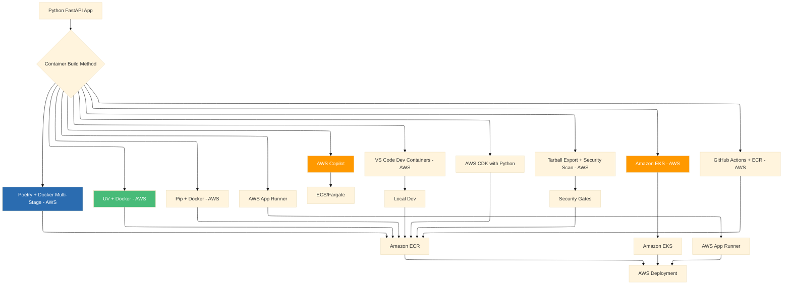

# This series adapts the proven patterns from our .N

```mermaid
---
config:
  theme: base
  layout: elk
---
graph TD
    A[Python FastAPI App] --> B{Container Build Method}
    
    B --> C[Poetry + Docker Multi-Stage - AWS]
    B --> D[UV + Docker - AWS]
    B --> E[Pip + Docker - AWS]
    B --> F[AWS Copilot]
    B --> G[VS Code Dev Containers - AWS]
    B --> H[AWS CDK with Python]
    B --> I[Tarball Export + Security Scan - AWS]
    B --> J[Amazon EKS - AWS]
    B --> K[GitHub Actions + ECR - AWS]
    B --> L[AWS App Runner]
    
    C --> M[Amazon ECR]
    D --> M
    E --> M
    F --> N[ECS/Fargate]
    G --> O[Local Dev]
    H --> M
    I --> P[Security Gates]
    J --> Q[Amazon EKS]
    K --> M
    L --> R[AWS App Runner]
    
    O --> M
    P --> M
    M --> S[AWS Deployment]
    Q --> S
    R --> S
    
    style C fill:#2b6cb0,color:#fff
    style D fill:#48bb78,color:#fff
    style F fill:#ff9900,color:#fff
    style J fill:#ff9900,color:#fff
```
