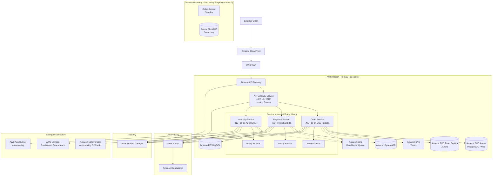
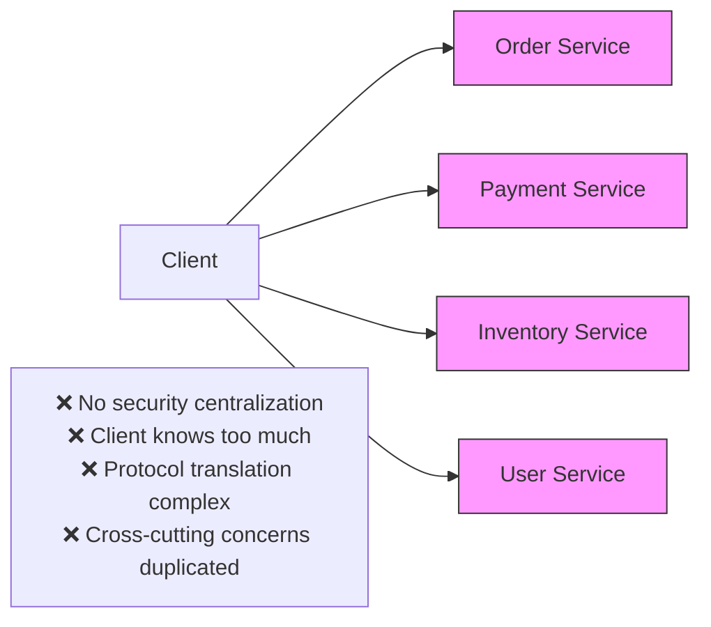
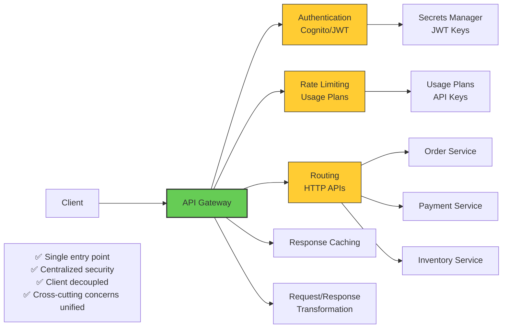
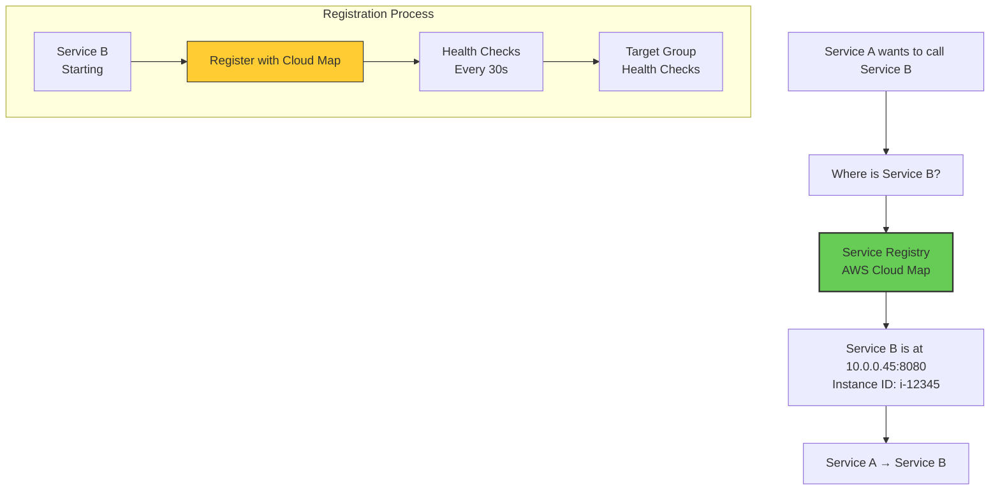
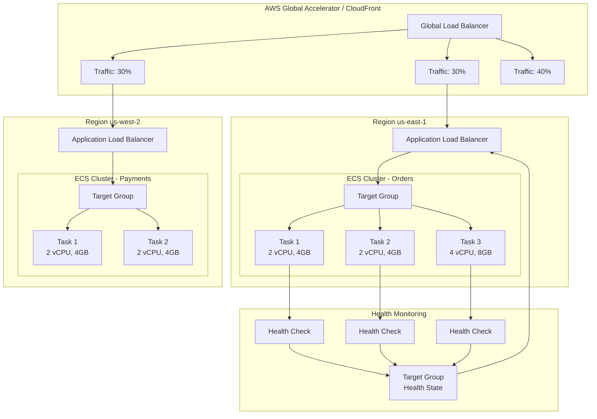
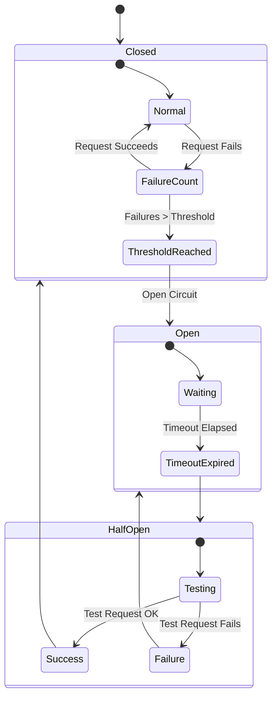
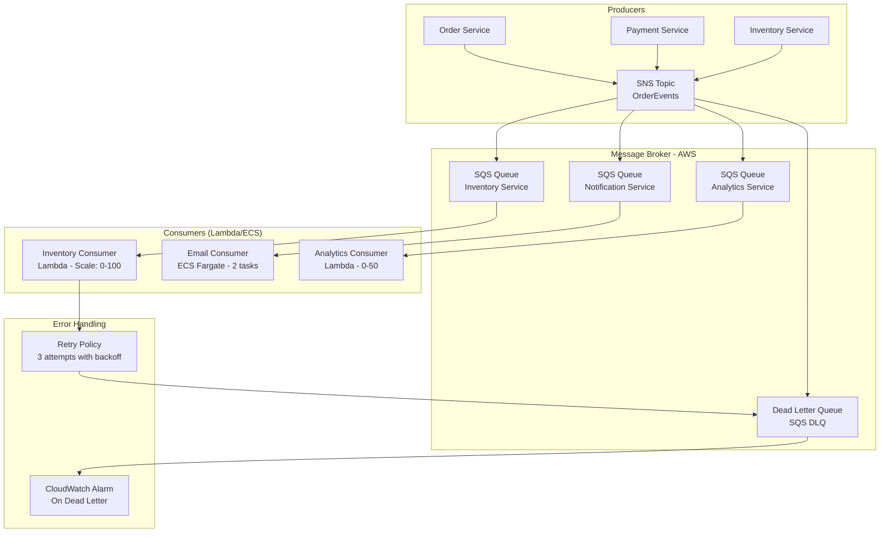

# 10 Essential Microservices Architecture Patterns: A Professional Reference Architecture with .NET 10 and AWS - Part 1

## Enterprise-Grade Implementation Guide for Cloud-Native Systems

**Author:** Principal Cloud Architect
**Version:** 1.0
**Last Updated:** March 2025

---

## Introduction


The journey from monolithic applications to microservices is paved with both opportunity and complexity. After architecting distributed systems for Fortune 500 companies over the past decade, I've learned that success isn't about adopting every pattern—it's about understanding which patterns solve specific problems and implementing them correctly.

This reference architecture presents ten fundamental microservices patterns that form the backbone of any resilient, scalable cloud-native system. Each pattern is examined through the lens of enterprise requirements including scalability, resilience, security, and maintainability.

**What makes this guide different:** Every pattern includes production-ready .NET 10 code implementing SOLID principles, proper dependency injection, AWS Secrets Manager integration for security, and comprehensive observability. The architecture is designed to handle real-world scenarios—from handling millions of requests to recovering from catastrophic failures.

### Series Structure

This guide is split into two parts for easier consumption:

**Part 1 (This Document):** Covers the first five foundational patterns—API Gateway, Service Discovery, Load Balancing, Circuit Breaker, and Event-Driven Communication—implemented on **AWS**. These patterns establish the core communication and resilience layer of your microservices architecture.

**Part 2:** Covers the remaining five advanced patterns—CQRS, Saga Pattern, Service Mesh, Distributed Tracing, and Containerization—also on **AWS**.

Each part includes complete architectural diagrams, design pattern explanations, SOLID principle applications, and production-ready .NET 10 implementations with AWS services.

### The Patterns We'll Master

**Part 1: Foundational Communication Patterns (AWS)**
1. **API Gateway** - The single entry point that protects and routes all client requests
2. **Service Discovery** - How services find each other in a dynamic cloud environment  
3. **Load Balancing** - Distributing traffic for optimal performance and reliability
4. **Circuit Breaker** - Preventing cascading failures when dependencies fail
5. **Event-Driven Communication** - Asynchronous, decoupled service interaction

**Part 2: Advanced Data & Operational Patterns (AWS)**
6. **CQRS** - Separating read and write models for optimal performance
7. **Saga Pattern** - Managing distributed transactions with compensation
8. **Service Mesh** - Offloading cross-cutting concerns to the infrastructure layer
9. **Distributed Tracing** - Following requests across service boundaries
10. **Containerization** - Packaging and deploying consistently anywhere

---

## System Architecture Overview

Before diving into individual patterns, let's understand how all the pieces fit together in our AWS-based reference implementation.

### High-Level Architecture



### Technology Stack Summary

| Component | AWS Service | Justification |
|-----------|-------------|---------------|
| **Runtime** | .NET 10 on AWS Lambda/ECS | Native AOT support, minimal APIs |
| **ORM** | EF Core 10 + Dapper | Compiled models, high-performance queries |
| **API Gateway** | Amazon API Gateway + YARP | Managed service + custom flexibility |
| **Service Mesh** | AWS App Mesh | Native AWS integration, Envoy proxies |
| **Secrets** | AWS Secrets Manager | Automatic rotation, IAM integration |
| **Database** | Amazon RDS Aurora + DynamoDB | Multi-AZ, global tables, serverless |
| **Messaging** | Amazon SNS + SQS | Fully managed, FIFO, DLQ support |
| **Container** | ECR + ECS Fargate + App Runner | Serverless containers, no cluster management |
| **Monitoring** | AWS X-Ray + CloudWatch | Distributed tracing, metrics, logs |
| **Compute** | ECS Fargate + Lambda + App Runner | Flexible compute options per workload |

### Design Principles Applied Throughout

- **Single Responsibility Principle**: Each microservice owns its domain and does one thing well
- **Open/Closed Principle**: Services extensible via events and configuration, not code modification
- **Liskov Substitution**: Consistent service interfaces allow component swapping
- **Interface Segregation**: Client-specific interfaces prevent unnecessary dependencies
- **Dependency Inversion**: Abstractions depend on abstractions, not concretions
- **Domain-Driven Design**: Bounded contexts ensure clean domain boundaries
- **Infrastructure as Code**: All resources defined in CloudFormation/CDK for repeatability
- **Security by Design**: IAM roles, least privilege, Secrets Manager integration

---

# Part 1: Foundational Communication Patterns on AWS

---

## Pattern 1: API Gateway

### Concept Overview

The API Gateway pattern addresses a fundamental challenge in microservices architecture: how do clients interact with dozens of fine-grained services without knowing their locations or implementation details.

**Definition:** An API Gateway is a service that acts as the single entry point for all client requests. It routes requests to appropriate microservices, handles cross-cutting concerns like authentication, rate limiting, and caching, and can aggregate responses from multiple services.

**Why it's essential:**
- Without a gateway, clients must know the location of every service
- Security becomes decentralized and harder to manage
- Cross-cutting concerns are duplicated across services
- Protocol translation becomes complex
- Client applications become tightly coupled to backend services

**Real-world analogy:** Think of API Gateway as the reception desk in a large office building. Visitors don't need to know where specific employees sit—they go to reception, get authenticated, receive directions, and are routed appropriately. The receptionist handles security, visitor logs, and can even provide information without bothering the employees.

### The Problem It Solves



**The solution architecture:**



### AWS Implementation Options

| Option | Best For | Scaling | Cost Model | Features |
|--------|----------|---------|------------|----------|
| **Amazon API Gateway (HTTP API)** | Lightweight, low-latency APIs | Automatic | Per request + data transfer | JWT auth, CORS, throttling |
| **Amazon API Gateway (REST API)** | Enterprise APIs with transformations | Automatic | Per request + caching | Usage plans, API keys, transformations |
| **Application Load Balancer** | Layer 7 routing to services | Auto-scaling | Per hour + LCU | Path-based routing, host-based routing |
| **CloudFront + Lambda@Edge** | Global edge caching | Global auto | Per request + data transfer | Edge computing, global distribution |
| **Custom YARP on App Runner** | Full control, simple needs | Auto-scaling | Per hour + resources | Full code control, customization |

### Design Patterns Applied

- **Facade Pattern**: The gateway provides a simplified interface to the complex subsystem of microservices
- **Proxy Pattern**: The gateway forwards requests while adding functionality
- **Chain of Responsibility**: Multiple middleware components process requests in sequence
- **Strategy Pattern**: Different routing strategies based on request characteristics
- **Factory Pattern**: Creating appropriate client instances for downstream services
- **Decorator Pattern**: Adding cross-cutting concerns without modifying core logic

### SOLID Principles Implementation

**Interface Segregation - Separate Gateway Concerns**

```csharp
// IGatewayRouter.cs - Single Responsibility for routing
public interface IGatewayRouter
{
    Task<RouteResult> RouteRequestAsync(HttpContext context);
    void RegisterRoute(string path, string destinationService);
}

// IAuthenticationHandler.cs - Single Responsibility for auth
public interface IAuthenticationHandler
{
    Task<AuthenticationResult> AuthenticateAsync(HttpRequest request);
    Task<TokenValidationResult> ValidateTokenAsync(string token);
}

// IRateLimiter.cs - Single Responsibility for rate limiting
public interface IRateLimiter
{
    Task<bool> IsRequestAllowedAsync(string clientId, string endpoint);
    Task<RateLimitHeaders> GetRateLimitHeadersAsync(string clientId);
}

// IGatewayTransform.cs - Open/Closed for transformations
public interface IGatewayTransform
{
    Task<HttpRequestMessage> TransformRequestAsync(HttpRequest originalRequest);
    Task<HttpResponseMessage> TransformResponseAsync(HttpResponseMessage serviceResponse);
}
```

**Dependency Injection Configuration with Secrets Manager**

```csharp
// Program.cs - API Gateway DI Container Setup
var builder = WebApplication.CreateBuilder(args);

// AWS Secrets Manager Integration - Secrets never in code
builder.Configuration.AddAWSSecretsManager(
    region: Amazon.RegionEndpoint.USEast1,
    secretName: builder.Configuration["Secrets:GatewaySecrets"],
    configurator: options =>
    {
        options.SecretRefreshInterval = TimeSpan.FromHours(1);
    });

// Register AWS services
builder.Services.AddDefaultAWSOptions(builder.Configuration.GetAWSOptions());
builder.Services.AddAWSService<IAmazonSecretsManager>();
builder.Services.AddAWSService<IAmazonS3>();
builder.Services.AddAWSService<IAmazonDynamoDB>();

// Register services with appropriate lifetimes
builder.Services.AddSingleton<IGatewayRouter, YarpGatewayRouter>();
builder.Services.AddScoped<IAuthenticationHandler, CognitoJwtAuthenticationHandler>();
builder.Services.AddSingleton<IRateLimiter, DynamoDbRateLimiter>();
builder.Services.AddTransient<IGatewayTransform, DefaultGatewayTransform>();

// Decorator pattern for logging - wraps existing implementation
builder.Services.Decorate<IAuthenticationHandler, LoggingAuthenticationHandler>();

// Factory pattern for client creation
builder.Services.AddSingleton<IGatewayClientFactory, GatewayClientFactory>();

// Options pattern for configuration - strongly typed settings
builder.Services.Configure<GatewayOptions>(
    builder.Configuration.GetSection("Gateway"));

// Health checks for all downstream services
builder.Services.AddHealthChecks()
    .AddUrlGroup(new Uri("https://orders-api.awsapprunner.com/health"), "orders")
    .AddUrlGroup(new Uri("https://payment-api.lambda-url.us-east-1.on.aws/health"), "payment")
    .AddUrlGroup(new Uri("https://inventory-api.awsapprunner.com/health"), "inventory")
    .AddDynamoDb(options =>
    {
        options.TableName = "HealthChecks";
    });

var app = builder.Build();
```

**Complete Gateway Implementation**

```csharp
// ApiGateway.cs - Main gateway orchestrator
public class ApiGateway
{
    private readonly IGatewayRouter _router;
    private readonly IAuthenticationHandler _authHandler;
    private readonly IRateLimiter _rateLimiter;
    private readonly IEnumerable<IGatewayTransform> _transforms;
    private readonly ILogger<ApiGateway> _logger;
    private readonly IGatewayClientFactory _clientFactory;
    private readonly IAmazonDynamoDB _dynamoDb;
    
    public ApiGateway(
        IGatewayRouter router,
        IAuthenticationHandler authHandler,
        IRateLimiter rateLimiter,
        IEnumerable<IGatewayTransform> transforms,
        ILogger<ApiGateway> logger,
        IGatewayClientFactory clientFactory,
        IAmazonDynamoDB dynamoDb)
    {
        _router = router;
        _authHandler = authHandler;
        _rateLimiter = rateLimiter;
        _transforms = transforms;
        _logger = logger;
        _clientFactory = clientFactory;
        _dynamoDb = dynamoDb;
    }
    
    public async Task HandleRequestAsync(HttpContext context)
    {
        // 1. Extract client identifier (Strategy pattern)
        var clientId = ExtractClientId(context.Request);
        
        // 2. Rate limiting (Chain of Responsibility start)
        if (!await _rateLimiter.IsRequestAllowedAsync(clientId, context.Request.Path))
        {
            context.Response.StatusCode = 429;
            await context.Response.WriteAsJsonAsync(new 
            { 
                error = "Rate limit exceeded",
                retryAfter = await _rateLimiter.GetRetryAfterAsync(clientId)
            });
            
            // Log to CloudWatch
            await LogMetricAsync("RateLimitExceeded", clientId);
            return;
        }
        
        // 3. Authentication
        var authResult = await _authHandler.AuthenticateAsync(context.Request);
        if (!authResult.IsAuthenticated)
        {
            context.Response.StatusCode = 401;
            await context.Response.WriteAsJsonAsync(new 
            { 
                error = "Authentication failed",
                details = authResult.FailureReason
            });
            return;
        }
        
        // 4. Routing (Strategy pattern)
        var route = await _router.RouteRequestAsync(context);
        if (!route.Found)
        {
            context.Response.StatusCode = 404;
            await context.Response.WriteAsJsonAsync(new 
            { 
                error = "Route not found",
                path = context.Request.Path
            });
            return;
        }
        
        // 5. Request transformation (Chain of Responsibility)
        var requestMessage = context.Request;
        foreach (var transform in _transforms)
        {
            requestMessage = await transform.TransformRequestAsync(requestMessage);
        }
        
        // 6. Forward to service (Factory pattern)
        var client = _clientFactory.CreateClient(route.ServiceName);
        var response = await client.SendAsync(requestMessage);
        
        // 7. Response transformation
        foreach (var transform in _transforms.Reverse())
        {
            response = await transform.TransformResponseAsync(response);
        }
        
        // 8. Write response
        context.Response.StatusCode = (int)response.StatusCode;
        foreach (var header in response.Headers)
        {
            context.Response.Headers[header.Key] = header.Value.ToArray();
        }
        await response.Content.CopyToAsync(context.Response.Body);
        
        // 9. Log for observability (X-Ray integration)
        _logger.LogInformation("Request {Method} {Path} -> {Service} returned {StatusCode} in {Duration}ms",
            context.Request.Method, context.Request.Path, route.ServiceName, 
            response.StatusCode, CalculateDuration(context));
            
        // 10. Store metrics in CloudWatch
        await LogMetricAsync("RequestProcessed", route.ServiceName, response.StatusCode);
    }
    
    private string ExtractClientId(HttpRequest request)
    {
        // Strategy: Extract from JWT, API key, or IP with fallback
        return request.Headers["X-Client-ID"].FirstOrDefault() 
               ?? request.Headers["Authorization"].FirstOrDefault()?.Split('.').First() 
               ?? request.HttpContext.Connection.RemoteIpAddress?.ToString() 
               ?? "anonymous";
    }
    
    private async Task LogMetricAsync(string metricName, string clientId, int statusCode = 0)
    {
        // In production, use CloudWatch Metrics
        var metricData = new Dictionary<string, object>
        {
            ["MetricName"] = metricName,
            ["ClientId"] = clientId,
            ["Timestamp"] = DateTime.UtcNow
        };
        
        if (statusCode > 0)
        {
            metricData["StatusCode"] = statusCode;
        }
        
        // Store in DynamoDB for analytics
        var request = new PutItemRequest
        {
            TableName = "GatewayMetrics",
            Item = new Dictionary<string, AttributeValue>
            {
                ["Id"] = new AttributeValue { S = Guid.NewGuid().ToString() },
                ["MetricName"] = new AttributeValue { S = metricName },
                ["ClientId"] = new AttributeValue { S = clientId },
                ["Timestamp"] = new AttributeValue { S = DateTime.UtcNow.ToString("o") }
            }
        };
        
        await _dynamoDb.PutItemAsync(request);
    }
    
    private long CalculateDuration(HttpContext context)
    {
        if (context.Items.TryGetValue("RequestStartTime", out var startTimeObj) 
            && startTimeObj is DateTime startTime)
        {
            return (long)(DateTime.UtcNow - startTime).TotalMilliseconds;
        }
        return 0;
    }
}
```

### AWS API Gateway Configuration

**CloudFormation Template for API Gateway**

```yaml
# api-gateway.yaml
AWSTemplateFormatVersion: '2010-09-09'
Description: 'API Gateway for Microservices'

Parameters:
  Environment:
    Type: String
    Default: production
    AllowedValues: [development, staging, production]
  
  OrderServiceUrl:
    Type: String
    Description: URL of the Order Service
  
  PaymentServiceUrl:
    Type: String
    Description: URL of the Payment Service

Resources:
  # API Gateway REST API
  MicroservicesApi:
    Type: AWS::ApiGateway::RestApi
    Properties:
      Name: !Sub 'microservices-api-${Environment}'
      Description: 'API Gateway for Microservices'
      EndpointConfiguration:
        Types:
          - REGIONAL
      MinimumCompressionSize: 1024
      ApiKeySource: HEADER
  
  # Usage Plan for rate limiting
  UsagePlan:
    Type: AWS::ApiGateway::UsagePlan
    Properties:
      ApiStages:
        - ApiId: !Ref MicroservicesApi
          Stage: !Ref Environment
      Description: 'Usage plan with rate limits'
      Quota:
        Limit: 10000
        Period: DAY
      Throttle:
        BurstLimit: 100
        RateLimit: 50
      UsagePlanName: !Sub 'standard-usage-plan-${Environment}'
  
  # API Key
  ApiKey:
    Type: AWS::ApiGateway::ApiKey
    Properties:
      Description: 'API Key for microservices'
      Enabled: true
      StageKeys:
        - RestApiId: !Ref MicroservicesApi
          StageName: !Ref Environment
  
  # Cognito Authorizer
  CognitoAuthorizer:
    Type: AWS::ApiGateway::Authorizer
    Properties:
      Name: !Sub 'cognito-authorizer-${Environment}'
      RestApiId: !Ref MicroservicesApi
      Type: COGNITO_USER_POOLS
      IdentitySource: method.request.header.Authorization
      ProviderARNs:
        - !Ref CognitoUserPoolArn
  
  # Order Service Resources
  OrdersResource:
    Type: AWS::ApiGateway::Resource
    Properties:
      ParentId: !GetAtt MicroservicesApi.RootResourceId
      PathPart: orders
      RestApiId: !Ref MicroservicesApi
  
  OrdersProxyResource:
    Type: AWS::ApiGateway::Resource
    Properties:
      ParentId: !Ref OrdersResource
      PathPart: '{proxy+}'
      RestApiId: !Ref MicroservicesApi
  
  OrdersProxyMethod:
    Type: AWS::ApiGateway::Method
    Properties:
      AuthorizationType: COGNITO_USER_POOLS
      AuthorizerId: !Ref CognitoAuthorizer
      HttpMethod: ANY
      ResourceId: !Ref OrdersProxyResource
      RestApiId: !Ref MicroservicesApi
      ApiKeyRequired: true
      Integration:
        IntegrationHttpMethod: ANY
        Type: HTTP_PROXY
        Uri: !Sub '${OrderServiceUrl}/{proxy}'
        ConnectionType: INTERNET
        RequestParameters:
          integration.request.path.proxy: method.request.path.proxy
      MethodResponses:
        - StatusCode: 200
        - StatusCode: 400
        - StatusCode: 500
  
  # Payment Service Resources
  PaymentsResource:
    Type: AWS::ApiGateway::Resource
    Properties:
      ParentId: !GetAtt MicroservicesApi.RootResourceId
      PathPart: payments
      RestApiId: !Ref MicroservicesApi
  
  PaymentsProxyResource:
    Type: AWS::ApiGateway::Resource
    Properties:
      ParentId: !Ref PaymentsResource
      PathPart: '{proxy+}'
      RestApiId: !Ref MicroservicesApi
  
  PaymentsProxyMethod:
    Type: AWS::ApiGateway::Method
    Properties:
      AuthorizationType: COGNITO_USER_POOLS
      AuthorizerId: !Ref CognitoAuthorizer
      HttpMethod: ANY
      ResourceId: !Ref PaymentsProxyResource
      RestApiId: !Ref MicroservicesApi
      ApiKeyRequired: true
      Integration:
        IntegrationHttpMethod: ANY
        Type: HTTP_PROXY
        Uri: !Sub '${PaymentServiceUrl}/{proxy}'
        ConnectionType: INTERNET
        RequestParameters:
          integration.request.path.proxy: method.request.path.proxy
      MethodResponses:
        - StatusCode: 200
        - StatusCode: 400
        - StatusCode: 500
  
  # Deployment
  Deployment:
    Type: AWS::ApiGateway::Deployment
    DependsOn:
      - OrdersProxyMethod
      - PaymentsProxyMethod
    Properties:
      RestApiId: !Ref MicroservicesApi
      StageName: !Ref Environment
      StageDescription:
        MetricsEnabled: true
        LoggingLevel: INFO
        DataTraceEnabled: true
        ThrottlingBurstLimit: 100
        ThrottlingRateLimit: 50
        CacheClusterEnabled: true
        CacheClusterSize: '0.5'
        Variables:
          Environment: !Ref Environment

Outputs:
  ApiEndpoint:
    Description: API Gateway Endpoint
    Value: !Sub 'https://${MicroservicesApi}.execute-api.${AWS::Region}.amazonaws.com/${Environment}'
  
  ApiKeyId:
    Description: API Key ID
    Value: !Ref ApiKey
```

**Custom Gateway with YARP on AWS App Runner**

```csharp
// Program.cs - YARP Gateway on App Runner
var builder = WebApplication.CreateBuilder(args);

// Load configuration from AWS App Runner environment
builder.Configuration.AddJsonFile("appsettings.json", optional: false)
    .AddJsonFile($"appsettings.{builder.Environment.EnvironmentName}.json", optional: true)
    .AddEnvironmentVariables();

// Add AWS Systems Manager Parameter Store for configuration
builder.Configuration.AddSystemsManager(config =>
{
    config.Path = $"/microservices/gateway/{builder.Environment.EnvironmentName}";
    config.ReloadAfter = TimeSpan.FromMinutes(5);
});

// Add YARP reverse proxy
builder.Services.AddReverseProxy()
    .LoadFromConfig(builder.Configuration.GetSection("ReverseProxy"));

// Add authentication
builder.Services.AddAuthentication(JwtBearerDefaults.AuthenticationScheme)
    .AddJwtBearer(options =>
    {
        options.Authority = builder.Configuration["Cognito:Authority"];
        options.Audience = builder.Configuration["Cognito:Audience"];
        options.TokenValidationParameters = new TokenValidationParameters
        {
            ValidateIssuer = true,
            ValidateAudience = true,
            ValidateLifetime = true
        };
    });

// Add CORS
builder.Services.AddCors(options =>
{
    options.AddPolicy("AppRunnerPolicy", policy =>
    {
        policy.WithOrigins(builder.Configuration.GetSection("Cors:AllowedOrigins").Get<string[]>())
              .AllowAnyMethod()
              .AllowAnyHeader()
              .AllowCredentials();
    });
});

// Add health checks
builder.Services.AddHealthChecks()
    .AddUrlGroup(new Uri(builder.Configuration["Services:Orders"]), "orders")
    .AddUrlGroup(new Uri(builder.Configuration["Services:Payments"]), "payments");

var app = builder.Build();

// Middleware pipeline
app.UseHttpsRedirection();
app.UseCors("AppRunnerPolicy");
app.UseAuthentication();
app.UseAuthorization();

// Custom middleware for logging to CloudWatch
app.Use(async (context, next) =>
{
    var stopwatch = Stopwatch.StartNew();
    context.Items["RequestStartTime"] = DateTime.UtcNow;
    
    await next();
    
    stopwatch.Stop();
    
    // Log to CloudWatch
    var logger = context.RequestServices.GetRequiredService<ILogger<Program>>();
    logger.LogInformation("Request: {Method} {Path} - {StatusCode} - {Duration}ms",
        context.Request.Method,
        context.Request.Path,
        context.Response.StatusCode,
        stopwatch.ElapsedMilliseconds);
});

// Map reverse proxy routes
app.MapReverseProxy();

// Health check endpoint
app.MapGet("/health", () => Results.Ok(new { status = "healthy", timestamp = DateTime.UtcNow }));

app.Run();
```

**appsettings.json for YARP Gateway**

```json
{
  "Cognito": {
    "Authority": "https://cognito-idp.us-east-1.amazonaws.com/us-east-1_xxxxxxxxx",
    "Audience": "xxxxxxxxxxxxxxxxxxxxxxxxxx"
  },
  "Cors": {
    "AllowedOrigins": ["https://app.contoso.com", "https://admin.contoso.com"]
  },
  "Services": {
    "Orders": "http://orders-service.microservices.local:8080",
    "Payments": "http://payment-service.microservices.local:8080",
    "Inventory": "http://inventory-service.microservices.local:8080"
  },
  "ReverseProxy": {
    "Routes": {
      "orders": {
        "ClusterId": "orders-cluster",
        "Match": {
          "Path": "/api/orders/{**catch-all}"
        },
        "Transforms": [
          { "PathPattern": "/orders/{**catch-all}" },
          { "RequestHeadersCopy": "true" }
        ]
      },
      "payments": {
        "ClusterId": "payments-cluster",
        "Match": {
          "Path": "/api/payments/{**catch-all}"
        }
      }
    },
    "Clusters": {
      "orders-cluster": {
        "Destinations": {
          "order-service-1": {
            "Address": "http://orders-service.microservices.local:8080/"
          }
        },
        "LoadBalancingPolicy": "PowerOfTwoChoices"
      },
      "payments-cluster": {
        "Destinations": {
          "payment-service": {
            "Address": "http://payment-service.microservices.local:8080/"
          }
        }
      }
    }
  },
  "RateLimiting": {
    "DefaultLimit": 100,
    "DefaultWindow": "00:01:00",
    "Endpoints": {
      "/api/orders": { "Limit": 50, "Window": "00:01:00" },
      "/api/payments": { "Limit": 30, "Window": "00:01:00" }
    }
  },
  "Logging": {
    "LogLevel": {
      "Default": "Information",
      "Microsoft": "Warning",
      "Microsoft.Hosting.Lifetime": "Information"
    },
    "CloudWatch": {
      "LogGroup": "/aws/apprunner/gateway",
      "Region": "us-east-1"
    }
  }
}
```

### AWS App Runner Configuration

```yaml
# apprunner-gateway.yaml
version: 1.0
runtime: dotnet10

build:
  buildCommand: dotnet build -c Release
  startCommand: dotnet run

network:
  ingress:
    - port: 8080
      protocol: HTTP
  egress:
    - port: 443
      protocol: HTTPS

observability:
  tracing:
    enabled: true
    vendor: AWSXRAY
  metrics:
    enabled: true

autoscaling:
  minSize: 2
  maxSize: 10
  cpuUtilization: 70
  requestsPerSecond: 100

health:
  path: /health
  interval: 10
  timeout: 5
  unhealthyThreshold: 3
  healthyThreshold: 2

secrets:
  - name: JWT_SIGNING_KEY
    valueFrom: arn:aws:secretsmanager:us-east-1:123456789012:secret:gateway-jwt-key
  - name: COGNITO_CLIENT_SECRET
    valueFrom: arn:aws:secretsmanager:us-east-1:123456789012:secret:cognito-client-secret

environment:
  - name: ASPNETCORE_ENVIRONMENT
    value: Production
  - name: AWS_REGION
    value: us-east-1
```

### Key Takeaways

- **Multiple AWS options** - Choose between fully managed API Gateway or custom YARP on App Runner
- **Secrets Manager integration** - No hardcoded secrets in configuration
- **Cognito authentication** - Built-in JWT validation with Cognito user pools
- **Usage plans and API keys** - Built-in rate limiting and client identification
- **CloudFormation infrastructure** - Everything as code for repeatability
- **X-Ray integration** - Automatic tracing for debugging
- **App Runner simplicity** - No cluster management for custom gateway

---

## Pattern 2: Service Discovery

### Concept Overview

In a dynamic cloud environment, services are constantly changing—they scale up, scale down, fail, recover, and move. Service discovery solves the fundamental problem of how services find each other without hardcoded locations.

**Definition:** Service discovery is a pattern that enables services to dynamically locate and communicate with each other without hardcoded network locations. It maintains a registry of available service instances and their current network addresses.

**Why it's essential:**
- Cloud environments are dynamic—IP addresses change constantly
- Manual configuration doesn't scale beyond a few services
- Load balancers need to know healthy instances
- Clients shouldn't be responsible for location management
- Zero-downtime deployments require dynamic routing

**Real-world analogy:** Service discovery is like a GPS navigation system. You don't need to know the exact coordinates of your destination—you just know the name, and the GPS finds the current location and directions. If the destination moves (like a food truck), the GPS updates automatically.

### The Problem It Solves

**Without service discovery (The Old Way):**
```csharp
// ❌ This will break when services scale or move
var client = new HttpClient();
client.BaseAddress = new Uri("http://10.0.0.12:8080"); // Fixed IP? Good luck!
```

**With service discovery:**



### AWS Implementation Matrix

| Service | Discovery Mechanism | Use Case | Integration |
|---------|---------------------|----------|-------------|
| **AWS Cloud Map** | DNS-based + API | Service discovery for any resource | ECS, EKS, EC2, Lambda |
| **Amazon ECS Service Discovery** | Cloud Map integration | ECS services only | Automatic with ECS |
| **AWS App Mesh** | Envoy sidecar + Control Plane | Service mesh discovery | Full mesh features |
| **ALB + Target Groups** | DNS + health checks | Load balancer-based | Simple use cases |
| **Amazon Route 53** | DNS-based | External services | Global DNS |

### Design Patterns Applied

- **Registry Pattern**: Centralized store of service locations (AWS Cloud Map)
- **Heartbeat Pattern**: Services send periodic signals to indicate health
- **Observer Pattern**: Clients are notified of registry changes
- **Cache-Aside Pattern**: Local caching of registry entries for performance
- **Strategy Pattern**: Different discovery strategies for different scenarios
- **Proxy Pattern**: Client-side discovery proxy with Envoy

### SOLID Principles Implementation

**Service Registry Interface - Single Responsibility**

```csharp
// IServiceRegistry.cs
public interface IServiceRegistry
{
    Task RegisterInstanceAsync(ServiceInstance instance, CancellationToken cancellationToken = default);
    Task DeregisterInstanceAsync(string serviceId, string instanceId, CancellationToken cancellationToken = default);
    Task<IEnumerable<ServiceInstance>> GetInstancesAsync(string serviceName, CancellationToken cancellationToken = default);
    Task<ServiceInstance> GetInstanceAsync(string serviceName, DiscoveryStrategy strategy = DiscoveryStrategy.RoundRobin, CancellationToken cancellationToken = default);
    Task HeartbeatAsync(string serviceId, string instanceId, CancellationToken cancellationToken = default);
    Task MarkUnhealthyAsync(string serviceId, string instanceId, string reason, CancellationToken cancellationToken = default);
}

public enum DiscoveryStrategy
{
    RoundRobin,
    Random,
    LeastLoaded,
    Sticky,
    LatencyBased
}

public class ServiceInstance
{
    public string ServiceId { get; set; }
    public string InstanceId { get; set; }
    public string ServiceName { get; set; }
    public Uri Uri { get; set; }
    public IReadOnlyDictionary<string, string> Metadata { get; set; }
    public ServiceHealthStatus HealthStatus { get; set; }
    public DateTime LastHeartbeat { get; set; }
    public DateTime RegisteredAt { get; set; }
    public int CurrentLoad { get; set; }
    public string Version { get; set; }
    public string[] Tags { get; set; }
    public int Weight { get; set; } = 100;
    public string AvailabilityZone { get; set; }
    public string InstanceType { get; set; }
}

public enum ServiceHealthStatus
{
    Healthy,
    Unhealthy,
    Draining,
    Unknown
}
```

**AWS Cloud Map Implementation**

```csharp
// AwsCloudMapRegistry.cs
public class AwsCloudMapRegistry : IServiceRegistry
{
    private readonly IAmazonServiceDiscovery _cloudMap;
    private readonly IAmazonECS _ecs;
    private readonly IMemoryCache _cache;
    private readonly ILogger<AwsCloudMapRegistry> _logger;
    private readonly ConcurrentDictionary<string, List<ServiceInstance>> _localRegistry;
    private readonly ConcurrentDictionary<string, InstanceStats> _stats;
    private readonly string _namespaceId;
    
    public AwsCloudMapRegistry(
        IAmazonServiceDiscovery cloudMap,
        IAmazonECS ecs,
        IMemoryCache cache,
        IConfiguration configuration,
        ILogger<AwsCloudMapRegistry> logger)
    {
        _cloudMap = cloudMap;
        _ecs = ecs;
        _cache = cache;
        _logger = logger;
        _localRegistry = new ConcurrentDictionary<string, List<ServiceInstance>>();
        _stats = new ConcurrentDictionary<string, InstanceStats>();
        _namespaceId = configuration["AWS:CloudMap:NamespaceId"];
        
        // Start background health checker
        Task.Run(HealthCheckLoopAsync);
    }
    
    public async Task RegisterInstanceAsync(ServiceInstance instance, CancellationToken cancellationToken)
    {
        var serviceId = await GetOrCreateServiceAsync(instance.ServiceName, cancellationToken);
        
        var registerRequest = new RegisterInstanceRequest
        {
            ServiceId = serviceId,
            InstanceId = instance.InstanceId,
            Attributes = new Dictionary<string, string>
            {
                ["AWS_INSTANCE_IPV4"] = instance.Uri.Host,
                ["AWS_INSTANCE_PORT"] = instance.Uri.Port.ToString(),
                ["AWS_INSTANCE_CNAME"] = instance.Uri.Host,
                ["Version"] = instance.Version,
                ["Zone"] = instance.AvailabilityZone,
                ["Weight"] = instance.Weight.ToString()
            }
        };
        
        // Add custom attributes
        if (instance.Metadata != null)
        {
            foreach (var kvp in instance.Metadata)
            {
                registerRequest.Attributes[kvp.Key] = kvp.Value;
            }
        }
        
        var response = await _cloudMap.RegisterInstanceAsync(registerRequest, cancellationToken);
        
        instance.RegisteredAt = DateTime.UtcNow;
        instance.LastHeartbeat = DateTime.UtcNow;
        
        _localRegistry.AddOrUpdate(
            instance.ServiceName,
            new List<ServiceInstance> { instance },
            (key, existing) =>
            {
                existing.RemoveAll(i => i.InstanceId == instance.InstanceId);
                existing.Add(instance);
                return existing;
            });
        
        _logger.LogInformation("Registered instance {InstanceId} for service {ServiceName} in Cloud Map", 
            instance.InstanceId, instance.ServiceName);
    }
    
    public async Task<ServiceInstance> GetInstanceAsync(
        string serviceName, 
        DiscoveryStrategy strategy = DiscoveryStrategy.RoundRobin,
        CancellationToken cancellationToken = default)
    {
        var cacheKey = $"discovery_{serviceName}_{strategy}";
        
        var instances = await _cache.GetOrCreateAsync(cacheKey, async entry =>
        {
            entry.AbsoluteExpirationRelativeToNow = TimeSpan.FromSeconds(30);
            
            // Discover from AWS Cloud Map
            return await DiscoverFromCloudMapAsync(serviceName, cancellationToken);
        });
        
        if (instances == null || !instances.Any())
            throw new ServiceNotFoundException(serviceName);
        
        var healthyInstances = instances
            .Where(i => i.HealthStatus == ServiceHealthStatus.Healthy)
            .ToList();
            
        if (!healthyInstances.Any())
            throw new NoHealthyInstancesException(serviceName);
        
        return SelectInstanceByStrategy(healthyInstances, strategy);
    }
    
    private async Task<List<ServiceInstance>> DiscoverFromCloudMapAsync(string serviceName, CancellationToken cancellationToken)
    {
        var serviceId = await GetServiceIdAsync(serviceName, cancellationToken);
        if (serviceId == null)
            return new List<ServiceInstance>();
        
        var request = new DiscoverInstancesRequest
        {
            NamespaceName = _namespaceId,
            ServiceName = serviceName,
            MaxResults = 100,
            HealthStatus = HealthStatusFilter.HEALTHY
        };
        
        var response = await _cloudMap.DiscoverInstancesAsync(request, cancellationToken);
        
        return response.Instances.Select((instance, index) => new ServiceInstance
        {
            ServiceName = serviceName,
            InstanceId = instance.InstanceId,
            Uri = new Uri($"http://{instance.Attributes["AWS_INSTANCE_IPV4"]}:{instance.Attributes["AWS_INSTANCE_PORT"]}"),
            Version = instance.Attributes.GetValueOrDefault("Version", "1.0.0"),
            AvailabilityZone = instance.Attributes.GetValueOrDefault("Zone", "unknown"),
            Weight = int.Parse(instance.Attributes.GetValueOrDefault("Weight", "100")),
            HealthStatus = instance.HealthStatus == InstanceHealthStatus.HEALTHY 
                ? ServiceHealthStatus.Healthy 
                : ServiceHealthStatus.Unhealthy,
            Metadata = instance.Attributes
        }).ToList();
    }
    
    private async Task<string> GetOrCreateServiceAsync(string serviceName, CancellationToken cancellationToken)
    {
        try
        {
            var listRequest = new ListServicesRequest
            {
                Filters = new List<ServiceFilter>
                {
                    new ServiceFilter
                    {
                        Name = ServiceFilterName.NAMESPACE_ID,
                        Values = new List<string> { _namespaceId }
                    }
                }
            };
            
            var listResponse = await _cloudMap.ListServicesAsync(listRequest, cancellationToken);
            var existingService = listResponse.Services
                .FirstOrDefault(s => s.Name == serviceName);
                
            if (existingService != null)
                return existingService.Id;
            
            // Create new service
            var createRequest = new CreateServiceRequest
            {
                Name = serviceName,
                NamespaceId = _namespaceId,
                DnsConfig = new DnsConfig
                {
                    DnsRecords = new List<DnsRecord>
                    {
                        new DnsRecord
                        {
                            Type = RecordType.A,
                            TTL = 60
                        }
                    },
                    RoutingPolicy = RoutingPolicy.MULTIVALUE
                },
                HealthCheckCustomConfig = new HealthCheckCustomConfig
                {
                    FailureThreshold = 3
                }
            };
            
            var createResponse = await _cloudMap.CreateServiceAsync(createRequest, cancellationToken);
            return createResponse.Service.Id;
        }
        catch (Exception ex)
        {
            _logger.LogError(ex, "Failed to get or create service {ServiceName}", serviceName);
            throw;
        }
    }
    
    private async Task<string> GetServiceIdAsync(string serviceName, CancellationToken cancellationToken)
    {
        try
        {
            var listRequest = new ListServicesRequest
            {
                Filters = new List<ServiceFilter>
                {
                    new ServiceFilter
                    {
                        Name = ServiceFilterName.NAMESPACE_ID,
                        Values = new List<string> { _namespaceId }
                    }
                }
            };
            
            var listResponse = await _cloudMap.ListServicesAsync(listRequest, cancellationToken);
            var service = listResponse.Services.FirstOrDefault(s => s.Name == serviceName);
            
            return service?.Id;
        }
        catch (Exception ex)
        {
            _logger.LogError(ex, "Failed to get service ID for {ServiceName}", serviceName);
            return null;
        }
    }
    
    private ServiceInstance SelectInstanceByStrategy(
        List<ServiceInstance> instances, 
        DiscoveryStrategy strategy)
    {
        return strategy switch
        {
            DiscoveryStrategy.RoundRobin => SelectRoundRobin(instances),
            DiscoveryStrategy.Random => instances[Random.Shared.Next(instances.Count)],
            DiscoveryStrategy.LeastLoaded => SelectLeastLoaded(instances),
            DiscoveryStrategy.LatencyBased => SelectLatencyBased(instances),
            DiscoveryStrategy.Sticky => SelectSticky(instances),
            _ => instances.First()
        };
    }
    
    private static readonly ConcurrentDictionary<string, int> _roundRobinCounters = new();
    
    private ServiceInstance SelectRoundRobin(List<ServiceInstance> instances)
    {
        var serviceName = instances.First().ServiceName;
        var counter = _roundRobinCounters.AddOrUpdate(
            serviceName,
            1,
            (_, value) => (value + 1) % instances.Count);
            
        var selected = instances[counter];
        UpdateStats(selected.InstanceId, "selected");
        return selected;
    }
    
    private ServiceInstance SelectLeastLoaded(List<ServiceInstance> instances)
    {
        var selected = instances
            .OrderBy(i => _stats.TryGetValue(i.InstanceId, out var stats) ? stats.CurrentLoad : 0)
            .First();
            
        UpdateStats(selected.InstanceId, "load_selected");
        return selected;
    }
    
    private ServiceInstance SelectLatencyBased(List<ServiceInstance> instances)
    {
        var selected = instances
            .OrderBy(i => _stats.TryGetValue(i.InstanceId, out var stats) ? stats.AverageLatency : double.MaxValue)
            .First();
            
        return selected;
    }
    
    private ServiceInstance SelectSticky(List<ServiceInstance> instances)
    {
        var httpContextAccessor = ServiceLocator.GetService<IHttpContextAccessor>();
        var clientId = httpContextAccessor.HttpContext?.Request.Headers["X-Client-ID"].FirstOrDefault() 
                      ?? "default";
        
        var hash = Math.Abs(clientId.GetHashCode());
        var index = hash % instances.Count;
        
        return instances[index];
    }
    
    private void UpdateStats(string instanceId, string operation)
    {
        var stats = _stats.GetOrAdd(instanceId, _ => new InstanceStats());
        stats.RequestCount++;
        stats.LastUsed = DateTime.UtcNow;
        
        if (operation == "selected")
            stats.SelectionCount++;
    }
    
    private async Task HealthCheckLoopAsync()
    {
        while (true)
        {
            try
            {
                foreach (var (serviceName, instances) in _localRegistry)
                {
                    foreach (var instance in instances.ToList())
                    {
                        var isHealthy = await PingInstanceAsync(instance);
                        
                        if (!isHealthy && instance.HealthStatus == ServiceHealthStatus.Healthy)
                        {
                            instance.HealthStatus = ServiceHealthStatus.Unhealthy;
                            _logger.LogWarning("Instance {InstanceId} for {ServiceName} marked unhealthy", 
                                instance.InstanceId, serviceName);
                                
                            // Deregister from Cloud Map if unhealthy
                            await DeregisterUnhealthyInstance(serviceName, instance, CancellationToken.None);
                        }
                        else if (isHealthy && instance.HealthStatus != ServiceHealthStatus.Healthy)
                        {
                            instance.HealthStatus = ServiceHealthStatus.Healthy;
                            _logger.LogInformation("Instance {InstanceId} for {ServiceName} recovered", 
                                instance.InstanceId, serviceName);
                        }
                        
                        if (_stats.TryGetValue(instance.InstanceId, out var stats))
                        {
                            stats.LastHealthCheck = DateTime.UtcNow;
                            stats.HealthStatus = instance.HealthStatus;
                        }
                    }
                }
            }
            catch (Exception ex)
            {
                _logger.LogError(ex, "Health check loop error");
            }
            
            await Task.Delay(TimeSpan.FromSeconds(10));
        }
    }
    
    private async Task<bool> PingInstanceAsync(ServiceInstance instance)
    {
        try
        {
            using var cts = new CancellationTokenSource(TimeSpan.FromSeconds(3));
            using var httpClient = new HttpClient();
            
            var stopwatch = Stopwatch.StartNew();
            var response = await httpClient.GetAsync($"{instance.Uri}/health", cts.Token);
            stopwatch.Stop();
            
            if (_stats.TryGetValue(instance.InstanceId, out var stats))
            {
                stats.AverageLatency = (stats.AverageLatency * 0.7) + (stopwatch.ElapsedMilliseconds * 0.3);
            }
            
            return response.IsSuccessStatusCode;
        }
        catch
        {
            return false;
        }
    }
    
    private async Task DeregisterUnhealthyInstance(string serviceName, ServiceInstance instance, CancellationToken cancellationToken)
    {
        try
        {
            var serviceId = await GetServiceIdAsync(serviceName, cancellationToken);
            if (serviceId != null)
            {
                var request = new DeregisterInstanceRequest
                {
                    ServiceId = serviceId,
                    InstanceId = instance.InstanceId
                };
                
                await _cloudMap.DeregisterInstanceAsync(request, cancellationToken);
                _logger.LogInformation("Deregistered unhealthy instance {InstanceId} from Cloud Map", 
                    instance.InstanceId);
            }
        }
        catch (Exception ex)
        {
            _logger.LogError(ex, "Failed to deregister unhealthy instance {InstanceId}", instance.InstanceId);
        }
    }
    
    private class InstanceStats
    {
        public int RequestCount { get; set; }
        public int SelectionCount { get; set; }
        public int CurrentLoad { get; set; }
        public double AverageLatency { get; set; }
        public DateTime LastUsed { get; set; }
        public DateTime LastHealthCheck { get; set; }
        public ServiceHealthStatus HealthStatus { get; set; }
    }
}
```

**ECS Service Discovery Integration**

```csharp
// EcsServiceDiscovery.cs - For ECS services
public class EcsServiceDiscovery
{
    private readonly IAmazonECS _ecs;
    private readonly IAmazonServiceDiscovery _cloudMap;
    private readonly ILogger<EcsServiceDiscovery> _logger;
    
    public EcsServiceDiscovery(
        IAmazonECS ecs,
        IAmazonServiceDiscovery cloudMap,
        ILogger<EcsServiceDiscovery> logger)
    {
        _ecs = ecs;
        _cloudMap = cloudMap;
        _logger = logger;
    }
    
    public async Task RegisterEcsServiceAsync(
        string clusterName, 
        string serviceName,
        string namespaceId,
        CancellationToken cancellationToken)
    {
        // Get ECS service details
        var describeRequest = new DescribeServicesRequest
        {
            Cluster = clusterName,
            Services = new List<string> { serviceName }
        };
        
        var describeResponse = await _ecs.DescribeServicesAsync(describeRequest, cancellationToken);
        var service = describeResponse.Services.FirstOrDefault();
        
        if (service == null)
        {
            throw new Exception($"ECS service {serviceName} not found");
        }
        
        // Get running tasks
        var listTasksRequest = new ListTasksRequest
        {
            Cluster = clusterName,
            ServiceName = serviceName,
            DesiredStatus = DesiredStatus.RUNNING
        };
        
        var listTasksResponse = await _ecs.ListTasksAsync(listTasksRequest, cancellationToken);
        
        if (listTasksResponse.TaskArns.Any())
        {
            var describeTasksRequest = new DescribeTasksRequest
            {
                Cluster = clusterName,
                Tasks = listTasksResponse.TaskArns
            };
            
            var describeTasksResponse = await _ecs.DescribeTasksAsync(describeTasksRequest, cancellationToken);
            
            // Create Cloud Map service if not exists
            var cloudMapServiceId = await GetOrCreateCloudMapService(serviceName, namespaceId, cancellationToken);
            
            // Register each task as an instance
            foreach (var task in describeTasksResponse.Tasks)
            {
                var attachment = task.Attachments?.FirstOrDefault();
                var networkInterface = attachment?.Details?.FirstOrDefault(d => d.Name == "networkInterfaceId");
                
                if (networkInterface != null)
                {
                    // Get ENI details to find IP
                    var ec2Client = new AmazonEC2Client();
                    var eniRequest = new DescribeNetworkInterfacesRequest
                    {
                        NetworkInterfaceIds = new List<string> { networkInterface.Value }
                    };
                    
                    var eniResponse = await ec2Client.DescribeNetworkInterfacesAsync(eniRequest, cancellationToken);
                    var ipAddress = eniResponse.NetworkInterfaces.FirstOrDefault()?.PrivateIpAddress;
                    
                    if (!string.IsNullOrEmpty(ipAddress))
                    {
                        var registerRequest = new RegisterInstanceRequest
                        {
                            ServiceId = cloudMapServiceId,
                            InstanceId = task.TaskArn.Split('/').Last(),
                            Attributes = new Dictionary<string, string>
                            {
                                ["AWS_INSTANCE_IPV4"] = ipAddress,
                                ["AWS_INSTANCE_PORT"] = "8080", // Default port
                                ["ECS_CLUSTER"] = clusterName,
                                ["ECS_TASK_ARN"] = task.TaskArn
                            }
                        };
                        
                        await _cloudMap.RegisterInstanceAsync(registerRequest, cancellationToken);
                        _logger.LogInformation("Registered ECS task {TaskId} in Cloud Map", task.TaskArn);
                    }
                }
            }
        }
    }
    
    private async Task<string> GetOrCreateCloudMapService(string serviceName, string namespaceId, CancellationToken cancellationToken)
    {
        var listRequest = new ListServicesRequest
        {
            Filters = new List<ServiceFilter>
            {
                new ServiceFilter
                {
                    Name = ServiceFilterName.NAMESPACE_ID,
                    Values = new List<string> { namespaceId }
                }
            }
        };
        
        var listResponse = await _cloudMap.ListServicesAsync(listRequest, cancellationToken);
        var existingService = listResponse.Services.FirstOrDefault(s => s.Name == serviceName);
        
        if (existingService != null)
            return existingService.Id;
        
        var createRequest = new CreateServiceRequest
        {
            Name = serviceName,
            NamespaceId = namespaceId,
            DnsConfig = new DnsConfig
            {
                DnsRecords = new List<DnsRecord>
                {
                    new DnsRecord
                    {
                        Type = RecordType.A,
                        TTL = 60
                    }
                },
                RoutingPolicy = RoutingPolicy.MULTIVALUE
            },
            HealthCheckCustomConfig = new HealthCheckCustomConfig
            {
                FailureThreshold = 2
            }
        };
        
        var createResponse = await _cloudMap.CreateServiceAsync(createRequest, cancellationToken);
        return createResponse.Service.Id;
    }
}
```

**Client-Side Discovery with Dependency Injection**

```csharp
// ServiceDiscoveryExtensions.cs
public static class ServiceDiscoveryExtensions
{
    public static IServiceCollection AddServiceDiscovery(
        this IServiceCollection services,
        Action<ServiceDiscoveryOptions> configureOptions = null)
    {
        var options = new ServiceDiscoveryOptions();
        configureOptions?.Invoke(options);
        
        services.AddSingleton(options);
        
        // Add AWS services
        services.AddDefaultAWSOptions(options.AWSOptions);
        services.AddAWSService<IAmazonServiceDiscovery>();
        services.AddAWSService<IAmazonECS>();
        
        services.AddSingleton<IServiceRegistry, AwsCloudMapRegistry>();
        services.AddMemoryCache();
        
        // Factory pattern for service clients
        services.AddSingleton<IServiceClientFactory, ServiceClientFactory>();
        
        // Interceptor pattern for automatic discovery
        services.AddTransient<DiscoveryDelegatingHandler>();
        
        // Configure HTTP clients with discovery
        services.AddHttpClient("discovery-client")
            .AddHttpMessageHandler<DiscoveryDelegatingHandler>()
            .AddPolicyHandler(GetRetryPolicy())
            .AddPolicyHandler(GetCircuitBreakerPolicy());
        
        return services;
    }
    
    private static IAsyncPolicy<HttpResponseMessage> GetRetryPolicy()
    {
        return HttpPolicyExtensions
            .HandleTransientHttpError()
            .WaitAndRetryAsync(3, retryAttempt => 
                TimeSpan.FromSeconds(Math.Pow(2, retryAttempt)));
    }
    
    private static IAsyncPolicy<HttpResponseMessage> GetCircuitBreakerPolicy()
    {
        return HttpPolicyExtensions
            .HandleTransientHttpError()
            .CircuitBreakerAsync(5, TimeSpan.FromSeconds(30));
    }
}

public class ServiceDiscoveryOptions
{
    public AWSOptions AWSOptions { get; set; } = new();
    public DiscoveryStrategy DefaultStrategy { get; set; } = DiscoveryStrategy.RoundRobin;
    public int CacheDurationSeconds { get; set; } = 30;
}

// DiscoveryDelegatingHandler.cs
public class DiscoveryDelegatingHandler : DelegatingHandler
{
    private readonly IServiceRegistry _registry;
    private readonly ILogger<DiscoveryDelegatingHandler> _logger;
    private readonly DiscoveryStrategy _strategy;
    
    public DiscoveryDelegatingHandler(
        IServiceRegistry registry,
        IConfiguration configuration,
        ILogger<DiscoveryDelegatingHandler> logger)
    {
        _registry = registry;
        _logger = logger;
        _strategy = configuration.GetValue<DiscoveryStrategy>("Discovery:Strategy", DiscoveryStrategy.RoundRobin);
    }
    
    protected override async Task<HttpResponseMessage> SendAsync(
        HttpRequestMessage request, 
        CancellationToken cancellationToken)
    {
        // Extract service name from request
        var serviceName = ExtractServiceName(request);
        
        // Discover service instance
        var instance = await _registry.GetInstanceAsync(serviceName, _strategy, cancellationToken);
        
        // Rewrite URL to target instance
        var originalUri = request.RequestUri;
        var newUri = new Uri(instance.Uri, originalUri.PathAndQuery);
        request.RequestUri = newUri;
        
        // Add instance info to headers for debugging
        request.Headers.Add("X-Service-Instance", instance.InstanceId);
        request.Headers.Add("X-Service-Version", instance.Version);
        request.Headers.Add("X-Availability-Zone", instance.AvailabilityZone);
        
        _logger.LogDebug("Routing request to {InstanceUri} for service {ServiceName} (Version: {Version})", 
            newUri, serviceName, instance.Version);
        
        try
        {
            var response = await base.SendAsync(request, cancellationToken);
            
            if (!response.IsSuccessStatusCode)
            {
                await _registry.MarkUnhealthyAsync(serviceName, instance.InstanceId, 
                    $"HTTP {(int)response.StatusCode}", cancellationToken);
            }
            
            return response;
        }
        catch (Exception ex)
        {
            await _registry.MarkUnhealthyAsync(serviceName, instance.InstanceId, 
                ex.Message, cancellationToken);
            throw;
        }
    }
    
    private string ExtractServiceName(HttpRequestMessage request)
    {
        if (request.Headers.TryGetValues("X-Service-Name", out var values))
            return values.First();
            
        return request.RequestUri.Host.Split('.')[0];
    }
}
```

### Configuration

```json
{
  "AWS": {
    "Region": "us-east-1",
    "CloudMap": {
      "NamespaceId": "ns-xxxxxxxxxxxxxxxxx"
    },
    "Credentials": {
      "Profile": "default"
    }
  },
  "Discovery": {
    "Strategy": "LeastLoaded",
    "CacheDurationSeconds": 30,
    "HealthCheckIntervalSeconds": 10
  },
  "Logging": {
    "LogLevel": {
      "Default": "Information",
      "Microsoft": "Warning",
      "Microsoft.Hosting.Lifetime": "Information"
    }
  }
}
```

### Key Takeaways

- **AWS Cloud Map** provides native service discovery with DNS and API endpoints
- **Health checks** automatically remove unhealthy instances
- **ECS integration** - Automatic registration of ECS tasks
- **Multi-AZ awareness** - Discover instances by availability zone
- **Caching improves performance** - Local cache reduces Cloud Map calls
- **Version-aware discovery** - Route to specific service versions
- **Weighted routing** - Distribute load based on instance capacity

---

## Pattern 3: Load Balancing

### Concept Overview

Load balancing is the art of distributing incoming requests across multiple instances of a service to ensure optimal resource utilization, maximum throughput, and minimal response time.

**Definition:** Load balancing distributes network traffic across multiple servers to ensure no single server bears too much demand. It improves responsiveness and availability by spreading requests across available resources.

**Why it's essential:**
- Prevents any single instance from becoming a bottleneck
- Provides redundancy when instances fail
- Enables horizontal scaling
- Improves user experience through faster response times
- Allows maintenance without downtime

**Real-world analogy:** Imagine 10,000 customers entering a store with 10 checkout counters. Without load balancing, everyone queues at the first counter. With load balancing, a greeter directs customers to the shortest line, ensuring all counters are utilized efficiently.

### Visual Distribution



### AWS Load Balancing Options

| Option | Layer | Algorithm | Session Affinity | Cross-Zone | Global | WAF | Best For |
|--------|-------|-----------|------------------|------------|--------|-----|----------|
| **Application Load Balancer** | L7 | Round Robin, Least Outstanding Requests | Cookie | Yes | No | Yes | HTTP/HTTPS traffic, path-based routing |
| **Network Load Balancer** | L4 | Flow Hash | Source IP | Yes | No | No | TCP/UDP, ultra-low latency |
| **AWS Global Accelerator** | L4/L7 | Performance, Weighted | Source IP | N/A | Yes | Yes | Global traffic acceleration |
| **CloudFront** | L7 | Latency-based | Cookie | N/A | Yes | Yes | CDN, edge caching |
| **Route 53** | DNS | Latency, Weighted, Geolocation | None | N/A | Yes | No | DNS-based global load balancing |

### Design Patterns Applied

- **Strategy Pattern**: Pluggable load balancing algorithms
- **Decorator Pattern**: Add retry and circuit breaking to load balancing
- **Observer Pattern**: Health monitoring and instance state changes
- **Factory Pattern**: Create load balancer instances based on configuration
- **Proxy Pattern**: Client-side load balancing proxy
- **Weighted Random Pattern**: Distribute based on instance capacity

### SOLID Principles Implementation

**Load Balancer Interface**

```csharp
// ILoadBalancer.cs
public interface ILoadBalancer
{
    Task<ServiceInstance> GetNextInstanceAsync(string serviceName, CancellationToken cancellationToken = default);
    Task ReportFailureAsync(string serviceName, string instanceId, CancellationToken cancellationToken = default);
    Task ReportSuccessAsync(string serviceName, string instanceId, long responseTimeMs, CancellationToken cancellationToken = default);
    Task UpdateInstancesAsync(string serviceName, IEnumerable<ServiceInstance> instances, CancellationToken cancellationToken = default);
    Task<LoadBalancerMetrics> GetMetricsAsync(string serviceName, CancellationToken cancellationToken = default);
}

public class LoadBalancerMetrics
{
    public string ServiceName { get; set; }
    public int TotalRequests { get; set; }
    public int FailedRequests { get; set; }
    public double AverageResponseTime { get; set; }
    public Dictionary<string, InstanceMetrics> InstanceMetrics { get; set; }
}

public class InstanceMetrics
{
    public string InstanceId { get; set; }
    public int RequestsHandled { get; set; }
    public int Failures { get; set; }
    public double AverageResponseTime { get; set; }
    public DateTime LastRequest { get; set; }
    public bool IsHealthy { get; set; }
}
```

**ALB Target Group Integration**

```csharp
// AlbTargetGroupLoadBalancer.cs
public class AlbTargetGroupLoadBalancer : ILoadBalancer
{
    private readonly IAmazonElasticLoadBalancingV2 _elbv2;
    private readonly IAmazonECS _ecs;
    private readonly ILogger<AlbTargetGroupLoadBalancer> _logger;
    private readonly ConcurrentDictionary<string, List<ServiceInstance>> _instances;
    private readonly ConcurrentDictionary<string, AlbTargetGroupConfig> _configs;
    
    public AlbTargetGroupLoadBalancer(
        IAmazonElasticLoadBalancingV2 elbv2,
        IAmazonECS ecs,
        ILogger<AlbTargetGroupLoadBalancer> logger)
    {
        _elbv2 = elbv2;
        _ecs = ecs;
        _logger = logger;
        _instances = new ConcurrentDictionary<string, List<ServiceInstance>>();
        _configs = new ConcurrentDictionary<string, AlbTargetGroupConfig>();
    }
    
    public async Task<ServiceInstance> GetNextInstanceAsync(string serviceName, CancellationToken cancellationToken)
    {
        if (!_configs.TryGetValue(serviceName, out var config))
        {
            throw new Exception($"No configuration found for service {serviceName}");
        }
        
        // Get target group health
        var healthRequest = new DescribeTargetHealthRequest
        {
            TargetGroupArn = config.TargetGroupArn
        };
        
        var healthResponse = await _elbv2.DescribeTargetHealthAsync(healthRequest, cancellationToken);
        
        var healthyTargets = healthResponse.TargetHealthDescriptions
            .Where(t => t.TargetHealth.State == TargetHealthStateEnum.Healthy)
            .ToList();
            
        if (!healthyTargets.Any())
        {
            throw new NoHealthyInstancesException(serviceName);
        }
        
        // Convert to service instances
        var instances = healthyTargets.Select(t => new ServiceInstance
        {
            ServiceName = serviceName,
            InstanceId = t.Target.Id,
            Uri = new Uri($"http://{t.Target.Id}:{config.Port}"),
            HealthStatus = ServiceHealthStatus.Healthy,
            AvailabilityZone = GetAvailabilityZone(t.Target.Id)
        }).ToList();
        
        _instances[serviceName] = instances;
        
        // Simple round-robin for this example
        // In production, you'd implement more sophisticated algorithms
        var index = Random.Shared.Next(instances.Count);
        return instances[index];
    }
    
    public async Task RegisterServiceAsync(
        string serviceName, 
        string targetGroupArn, 
        int port,
        CancellationToken cancellationToken)
    {
        _configs[serviceName] = new AlbTargetGroupConfig
        {
            TargetGroupArn = targetGroupArn,
            Port = port
        };
        
        // Start monitoring target group
        _ = Task.Run(() => MonitorTargetGroupAsync(serviceName, targetGroupArn, cancellationToken));
    }
    
    private async Task MonitorTargetGroupAsync(string serviceName, string targetGroupArn, CancellationToken cancellationToken)
    {
        while (!cancellationToken.IsCancellationRequested)
        {
            try
            {
                var healthRequest = new DescribeTargetHealthRequest
                {
                    TargetGroupArn = targetGroupArn
                };
                
                var healthResponse = await _elbv2.DescribeTargetHealthAsync(healthRequest, cancellationToken);
                
                foreach (var target in healthResponse.TargetHealthDescriptions)
                {
                    _logger.LogDebug("Target {TargetId} for {ServiceName} is {State}", 
                        target.Target.Id, serviceName, target.TargetHealth.State);
                }
                
                await Task.Delay(TimeSpan.FromSeconds(10), cancellationToken);
            }
            catch (Exception ex)
            {
                _logger.LogError(ex, "Error monitoring target group {TargetGroupArn}", targetGroupArn);
                await Task.Delay(TimeSpan.FromSeconds(30), cancellationToken);
            }
        }
    }
    
    private string GetAvailabilityZone(string instanceId)
    {
        // In production, you'd get this from EC2 metadata
        return instanceId.StartsWith("i-") ? "us-east-1a" : "unknown";
    }
    
    public Task ReportFailureAsync(string serviceName, string instanceId, CancellationToken cancellationToken)
    {
        _logger.LogWarning("Reported failure for instance {InstanceId} of service {ServiceName}", 
            instanceId, serviceName);
        return Task.CompletedTask;
    }
    
    public Task ReportSuccessAsync(string serviceName, string instanceId, long responseTimeMs, CancellationToken cancellationToken)
    {
        _logger.LogDebug("Reported success for instance {InstanceId} of service {ServiceName} ({ResponseTime}ms)", 
            instanceId, serviceName, responseTimeMs);
        return Task.CompletedTask;
    }
    
    public Task UpdateInstancesAsync(string serviceName, IEnumerable<ServiceInstance> instances, CancellationToken cancellationToken)
    {
        _instances[serviceName] = instances.ToList();
        return Task.CompletedTask;
    }
    
    public async Task<LoadBalancerMetrics> GetMetricsAsync(string serviceName, CancellationToken cancellationToken)
    {
        if (!_configs.TryGetValue(serviceName, out var config))
        {
            return null;
        }
        
        var metrics = new LoadBalancerMetrics
        {
            ServiceName = serviceName,
            InstanceMetrics = new Dictionary<string, InstanceMetrics>()
        };
        
        // Get CloudWatch metrics for the target group
        var cwClient = new AmazonCloudWatchClient();
        var now = DateTime.UtcNow;
        
        var request = new GetMetricStatisticsRequest
        {
            Namespace = "AWS/ApplicationELB",
            MetricName = "RequestCount",
            Dimensions = new List<Dimension>
            {
                new Dimension { Name = "TargetGroup", Value = config.TargetGroupArn.Split('/').Last() }
            },
            StartTimeUtc = now.AddMinutes(-5),
            EndTimeUtc = now,
            Period = 60,
            Statistics = new List<string> { "Sum" }
        };
        
        var response = await cwClient.GetMetricStatisticsAsync(request, cancellationToken);
        
        metrics.TotalRequests = (int)(response.Datapoints.Sum(d => d.Sum) ?? 0);
        
        return metrics;
    }
    
    private class AlbTargetGroupConfig
    {
        public string TargetGroupArn { get; set; }
        public int Port { get; set; }
    }
}
```

**ECS Service Auto-scaling Configuration**

```csharp
// EcsAutoScaling.cs
public class EcsAutoScaling
{
    private readonly IAmazonECS _ecs;
    private readonly IAmazonApplicationAutoScaling _autoScaling;
    private readonly ILogger<EcsAutoScaling> _logger;
    
    public EcsAutoScaling(
        IAmazonECS ecs,
        IAmazonApplicationAutoScaling autoScaling,
        ILogger<EcsAutoScaling> logger)
    {
        _ecs = ecs;
        _autoScaling = autoScaling;
        _logger = logger;
    }
    
    public async Task ConfigureAutoScalingAsync(
        string clusterName,
        string serviceName,
        int minCapacity,
        int maxCapacity,
        double targetCpuUtilization,
        double targetMemoryUtilization,
        CancellationToken cancellationToken)
    {
        var resourceId = $"service/{clusterName}/{serviceName}";
        
        // Register scalable target
        var registerRequest = new RegisterScalableTargetRequest
        {
            ServiceNamespace = ServiceNamespace.Ecs,
            ResourceId = resourceId,
            ScalableDimension = ScalableDimension.EcsServiceDesiredCount,
            MinCapacity = minCapacity,
            MaxCapacity = maxCapacity
        };
        
        await _autoScaling.RegisterScalableTargetAsync(registerRequest, cancellationToken);
        
        // CPU utilization scaling policy
        var cpuPolicyRequest = new PutScalingPolicyRequest
        {
            PolicyName = $"{serviceName}-cpu-scaling",
            ServiceNamespace = ServiceNamespace.Ecs,
            ResourceId = resourceId,
            ScalableDimension = ScalableDimension.EcsServiceDesiredCount,
            PolicyType = PolicyType.TargetTrackingScaling,
            TargetTrackingScalingPolicyConfiguration = new TargetTrackingScalingPolicyConfiguration
            {
                TargetValue = targetCpuUtilization,
                PredefinedMetricSpecification = new PredefinedMetricSpecification
                {
                    PredefinedMetricType = MetricType.ECSServiceAverageCPUUtilization
                },
                ScaleOutCooldown = 60,
                ScaleInCooldown = 60
            }
        };
        
        await _autoScaling.PutScalingPolicyAsync(cpuPolicyRequest, cancellationToken);
        
        // Memory utilization scaling policy
        var memoryPolicyRequest = new PutScalingPolicyRequest
        {
            PolicyName = $"{serviceName}-memory-scaling",
            ServiceNamespace = ServiceNamespace.Ecs,
            ResourceId = resourceId,
            ScalableDimension = ScalableDimension.EcsServiceDesiredCount,
            PolicyType = PolicyType.TargetTrackingScaling,
            TargetTrackingScalingPolicyConfiguration = new TargetTrackingScalingPolicyConfiguration
            {
                TargetValue = targetMemoryUtilization,
                PredefinedMetricSpecification = new PredefinedMetricSpecification
                {
                    PredefinedMetricType = MetricType.ECSServiceAverageMemoryUtilization
                },
                ScaleOutCooldown = 60,
                ScaleInCooldown = 60
            }
        };
        
        await _autoScaling.PutScalingPolicyAsync(memoryPolicyRequest, cancellationToken);
        
        _logger.LogInformation("Configured auto-scaling for service {ServiceName} (Min: {Min}, Max: {Max})", 
            serviceName, minCapacity, maxCapacity);
    }
    
    public async Task<ScalingMetrics> GetScalingMetricsAsync(
        string clusterName,
        string serviceName,
        CancellationToken cancellationToken)
    {
        var cwClient = new AmazonCloudWatchClient();
        var now = DateTime.UtcNow;
        
        var cpuRequest = new GetMetricStatisticsRequest
        {
            Namespace = "AWS/ECS",
            MetricName = "CPUUtilization",
            Dimensions = new List<Dimension>
            {
                new Dimension { Name = "ClusterName", Value = clusterName },
                new Dimension { Name = "ServiceName", Value = serviceName }
            },
            StartTimeUtc = now.AddHours(-1),
            EndTimeUtc = now,
            Period = 300,
            Statistics = new List<string> { "Average", "Maximum", "Minimum" }
        };
        
        var cpuResponse = await cwClient.GetMetricStatisticsAsync(cpuRequest, cancellationToken);
        
        var memoryRequest = new GetMetricStatisticsRequest
        {
            Namespace = "AWS/ECS",
            MetricName = "MemoryUtilization",
            Dimensions = new List<Dimension>
            {
                new Dimension { Name = "ClusterName", Value = clusterName },
                new Dimension { Name = "ServiceName", Value = serviceName }
            },
            StartTimeUtc = now.AddHours(-1),
            EndTimeUtc = now,
            Period = 300,
            Statistics = new List<string> { "Average", "Maximum", "Minimum" }
        };
        
        var memoryResponse = await cwClient.GetMetricStatisticsAsync(memoryRequest, cancellationToken);
        
        return new ScalingMetrics
        {
            ServiceName = serviceName,
            AverageCpuUtilization = cpuResponse.Datapoints.LastOrDefault()?.Average ?? 0,
            AverageMemoryUtilization = memoryResponse.Datapoints.LastOrDefault()?.Average ?? 0,
            Timestamp = DateTime.UtcNow
        };
    }
}

public class ScalingMetrics
{
    public string ServiceName { get; set; }
    public double AverageCpuUtilization { get; set; }
    public double AverageMemoryUtilization { get; set; }
    public DateTime Timestamp { get; set; }
}
```

**CloudFormation for Load Balancer**

```yaml
# load-balancer.yaml
AWSTemplateFormatVersion: '2010-09-09'
Description: 'Application Load Balancer for Microservices'

Parameters:
  Environment:
    Type: String
    Default: production
    AllowedValues: [development, staging, production]
  
  VpcId:
    Type: AWS::EC2::VPC::Id
    Description: VPC ID
  
  SubnetIds:
    Type: List<AWS::EC2::Subnet::Id>
    Description: List of subnet IDs

Resources:
  # Security Group for ALB
  AlbSecurityGroup:
    Type: AWS::EC2::SecurityGroup
    Properties:
      GroupDescription: Security group for Application Load Balancer
      VpcId: !Ref VpcId
      SecurityGroupIngress:
        - IpProtocol: tcp
          FromPort: 80
          ToPort: 80
          CidrIp: 0.0.0.0/0
        - IpProtocol: tcp
          FromPort: 443
          ToPort: 443
          CidrIp: 0.0.0.0/0
      Tags:
        - Key: Name
          Value: !Sub 'alb-sg-${Environment}'
        - Key: Environment
          Value: !Ref Environment

  # Application Load Balancer
  ApplicationLoadBalancer:
    Type: AWS::ElasticLoadBalancingV2::LoadBalancer
    Properties:
      Name: !Sub 'microservices-alb-${Environment}'
      Scheme: internet-facing
      Type: application
      IpAddressType: ipv4
      SecurityGroups:
        - !Ref AlbSecurityGroup
      Subnets: !Ref SubnetIds
      Tags:
        - Key: Name
          Value: !Sub 'microservices-alb-${Environment}'
        - Key: Environment
          Value: !Ref Environment

  # HTTP Listener
  HttpListener:
    Type: AWS::ElasticLoadBalancingV2::Listener
    Properties:
      LoadBalancerArn: !Ref ApplicationLoadBalancer
      Port: 80
      Protocol: HTTP
      DefaultActions:
        - Type: redirect
          RedirectConfig:
            Protocol: HTTPS
            Port: 443
            Host: "#{host}"
            Path: "/#{path}"
            Query: "#{query}"
            StatusCode: HTTP_301

  # HTTPS Listener
  HttpsListener:
    Type: AWS::ElasticLoadBalancingV2::Listener
    Properties:
      LoadBalancerArn: !Ref ApplicationLoadBalancer
      Port: 443
      Protocol: HTTPS
      Certificates:
        - CertificateArn: !Ref CertificateArn
      DefaultActions:
        - Type: fixed-response
          FixedResponseConfig:
            ContentType: application/json
            StatusCode: 404
            MessageBody: '{"error":"Not found"}'

  # Order Service Target Group
  OrderTargetGroup:
    Type: AWS::ElasticLoadBalancingV2::TargetGroup
    Properties:
      Name: !Sub 'orders-tg-${Environment}'
      Port: 8080
      Protocol: HTTP
      ProtocolVersion: HTTP1
      VpcId: !Ref VpcId
      HealthCheckEnabled: true
      HealthCheckPath: /health
      HealthCheckIntervalSeconds: 30
      HealthCheckTimeoutSeconds: 5
      HealthyThresholdCount: 2
      UnhealthyThresholdCount: 3
      Matcher:
        HttpCode: 200
      TargetType: ip
      Tags:
        - Key: Name
          Value: !Sub 'orders-tg-${Environment}'
        - Key: Service
          Value: orders

  # Payment Service Target Group
  PaymentTargetGroup:
    Type: AWS::ElasticLoadBalancingV2::TargetGroup
    Properties:
      Name: !Sub 'payments-tg-${Environment}'
      Port: 8080
      Protocol: HTTP
      ProtocolVersion: HTTP1
      VpcId: !Ref VpcId
      HealthCheckEnabled: true
      HealthCheckPath: /health
      HealthCheckIntervalSeconds: 30
      HealthCheckTimeoutSeconds: 5
      HealthyThresholdCount: 2
      UnhealthyThresholdCount: 3
      Matcher:
        HttpCode: 200
      TargetType: ip
      Tags:
        - Key: Name
          Value: !Sub 'payments-tg-${Environment}'
        - Key: Service
          Value: payments

  # Listener Rules
  OrdersRule:
    Type: AWS::ElasticLoadBalancingV2::ListenerRule
    Properties:
      ListenerArn: !Ref HttpsListener
      Priority: 10
      Conditions:
        - Field: path-pattern
          Values:
            - /api/orders/*
      Actions:
        - Type: forward
          TargetGroupArn: !Ref OrderTargetGroup

  PaymentsRule:
    Type: AWS::ElasticLoadBalancingV2::ListenerRule
    Properties:
      ListenerArn: !Ref HttpsListener
      Priority: 20
      Conditions:
        - Field: path-pattern
          Values:
            - /api/payments/*
      Actions:
        - Type: forward
          TargetGroupArn: !Ref PaymentTargetGroup

Outputs:
  LoadBalancerDnsName:
    Description: ALB DNS Name
    Value: !GetAtt ApplicationLoadBalancer.DNSName
  
  LoadBalancerCanonicalHostedZoneId:
    Description: ALB Canonical Hosted Zone ID
    Value: !GetAtt ApplicationLoadBalancer.CanonicalHostedZoneID
  
  OrderTargetGroupArn:
    Description: Order Service Target Group ARN
    Value: !Ref OrderTargetGroup
  
  PaymentTargetGroupArn:
    Description: Payment Service Target Group ARN
    Value: !Ref PaymentTargetGroup
```

### Key Takeaways

- **Multiple AWS load balancing options** - ALB for HTTP/HTTPS, NLB for TCP, Global Accelerator for global traffic
- **Health checks ensure reliability** - Automatic instance draining and replacement
- **Path-based routing** - Route to different services based on URL paths
- **Auto-scaling integration** - Scale based on CPU, memory, or request count
- **CloudWatch metrics** - Monitor performance and set alarms
- **Cross-zone load balancing** - Distribute traffic evenly across AZs
- **WAF integration** - Protect against common web exploits

---

## Pattern 4: Circuit Breaker

### Concept Overview

The Circuit Breaker pattern prevents cascading failures in distributed systems by failing fast when a service is unhealthy, allowing it time to recover.

**Definition:** A circuit breaker wraps a protected function call and monitors for failures. Once failures reach a threshold, the circuit "trips" and all subsequent calls fail immediately without attempting the protected call. After a timeout, the circuit allows a limited number of test requests to determine if the service has recovered.

**Why it's essential:**
- Prevents cascading failures across services
- Gives failing services time to recover
- Provides graceful degradation
- Reduces load on struggling services
- Enables faster failure detection

**Real-world analogy:** Think of an electrical circuit breaker in your home. When too much current flows (a fault), the breaker trips, cutting power to prevent fire. After fixing the issue, you reset the breaker. Similarly, a software circuit breaker "trips" when too many failures occur, preventing further damage.

### The State Machine



### Design Patterns Applied

- **State Pattern**: Circuit states (Closed, Open, Half-Open)
- **Strategy Pattern**: Different failure detection strategies
- **Observer Pattern**: Notify on state changes
- **Decorator Pattern**: Wrap HTTP client with circuit breaker
- **Factory Pattern**: Create circuit breakers with configuration
- **Health Check Pattern**: Monitor service health

### SOLID Principles Implementation

**Circuit Breaker Interface**

```csharp
// ICircuitBreaker.cs
public interface ICircuitBreaker
{
    Task<T> ExecuteAsync<T>(Func<Task<T>> action, CancellationToken cancellationToken = default);
    CircuitState State { get; }
    event EventHandler<CircuitBreakerStateChangedEventArgs> StateChanged;
    Task ResetAsync(CancellationToken cancellationToken = default);
    CircuitBreakerStats GetStats();
}

public enum CircuitState
{
    Closed,
    Open,
    HalfOpen
}

public class CircuitBreakerStateChangedEventArgs : EventArgs
{
    public CircuitState OldState { get; set; }
    public CircuitState NewState { get; set; }
    public DateTime Timestamp { get; set; }
    public TimeSpan? RetryDelay { get; set; }
    public string Reason { get; set; }
}

public class CircuitBreakerStats
{
    public string Name { get; set; }
    public CircuitState State { get; set; }
    public int SuccessCount { get; set; }
    public int FailureCount { get; set; }
    public double FailureRate { get; set; }
    public DateTime LastFailure { get; set; }
    public DateTime LastSuccess { get; set; }
    public TimeSpan Uptime { get; set; }
}
```

**Circuit Breaker with CloudWatch Metrics**

```csharp
// CircuitBreaker.cs
public class CircuitBreaker : ICircuitBreaker
{
    private readonly string _name;
    private readonly CircuitBreakerOptions _options;
    private readonly ILogger<CircuitBreaker> _logger;
    private readonly IAmazonCloudWatch _cloudWatch;
    private readonly object _stateLock = new();
    private readonly RollingWindow _failureWindow;
    private readonly RollingWindow _successWindow;
    
    private CircuitState _state;
    private DateTime _lastStateChange;
    private int _halfOpenSuccessCount;
    private int _consecutiveFailures;
    private long _totalSuccesses;
    private long _totalFailures;
    
    public event EventHandler<CircuitBreakerStateChangedEventArgs> StateChanged;
    public CircuitState State => _state;
    
    public CircuitBreaker(
        string name,
        CircuitBreakerOptions options,
        IAmazonCloudWatch cloudWatch,
        ILogger<CircuitBreaker> logger)
    {
        _name = name;
        _options = options;
        _cloudWatch = cloudWatch;
        _logger = logger;
        _state = CircuitState.Closed;
        _lastStateChange = DateTime.UtcNow;
        _failureWindow = new RollingWindow(_options.SamplingDuration);
        _successWindow = new RollingWindow(_options.SamplingDuration);
    }
    
    public async Task<T> ExecuteAsync<T>(Func<Task<T>> action, CancellationToken cancellationToken)
    {
        // Check current state
        if (_state == CircuitState.Open)
        {
            var timeSinceOpen = DateTime.UtcNow - _lastStateChange;
            if (timeSinceOpen >= _options.BreakDuration)
            {
                await TransitionToHalfOpenAsync();
            }
            else
            {
                var retryDelay = _options.BreakDuration - timeSinceOpen;
                
                // Record rejected request metric
                await RecordMetricAsync("RejectedRequests", 1);
                
                throw new BrokenCircuitException($"Circuit is open for another {retryDelay}", retryDelay);
            }
        }
        
        // Apply timeout
        using var cts = CancellationTokenSource.CreateLinkedTokenSource(cancellationToken);
        cts.CancelAfter(_options.Timeout);
        
        try
        {
            var result = await action();
            
            // Record success
            await OnSuccessAsync();
            
            return result;
        }
        catch (Exception ex) when (ex is not BrokenCircuitException and not OperationCanceledException)
        {
            // Record failure
            await OnFailureAsync(ex);
            throw;
        }
        catch (OperationCanceledException) when (cts.IsCancellationRequested)
        {
            // Timeout counts as failure
            await OnFailureAsync(new TimeoutException($"Operation timed out after {_options.Timeout}"));
            throw new TimeoutException($"Operation timed out after {_options.Timeout}");
        }
    }
    
    private async Task OnSuccessAsync()
    {
        Interlocked.Increment(ref _totalSuccesses);
        _successWindow.Add(1);
        
        await RecordMetricAsync("SuccessCount", 1);
        
        if (_state == CircuitState.HalfOpen)
        {
            lock (_stateLock)
            {
                _halfOpenSuccessCount++;
                if (_halfOpenSuccessCount >= _options.HalfOpenSuccessThreshold)
                {
                    _ = Task.Run(TransitionToClosedAsync);
                }
            }
        }
        else if (_state == CircuitState.Closed)
        {
            _consecutiveFailures = 0;
        }
    }
    
    private async Task OnFailureAsync(Exception ex)
    {
        Interlocked.Increment(ref _totalFailures);
        _failureWindow.Add(1);
        _consecutiveFailures++;
        
        await RecordMetricAsync("FailureCount", 1);
        
        _logger.LogWarning(ex, "Circuit breaker {Name} recorded failure", _name);
        
        if (_state == CircuitState.HalfOpen)
        {
            await TransitionToOpenAsync("Test request failed");
        }
        else if (_state == CircuitState.Closed)
        {
            if (await ShouldOpenCircuitAsync())
            {
                await TransitionToOpenAsync("Failure threshold exceeded");
            }
        }
    }
    
    private async Task<bool> ShouldOpenCircuitAsync()
    {
        var totalRequests = _failureWindow.Count + _successWindow.Count;
        if (totalRequests < _options.MinimumThroughput)
            return false;
            
        var failureRate = (double)_failureWindow.Count / totalRequests;
        return failureRate >= _options.FailureThreshold || _consecutiveFailures >= _options.MinimumThroughput;
    }
    
    private async Task TransitionToOpenAsync(string reason)
    {
        lock (_stateLock)
        {
            _state = CircuitState.Open;
            _lastStateChange = DateTime.UtcNow;
            _halfOpenSuccessCount = 0;
        }
        
        _logger.LogWarning("Circuit breaker {Name} OPENED: {Reason}", _name, reason);
        
        await RecordMetricAsync("CircuitState", 1, new Dictionary<string, string>
        {
            ["State"] = "Open",
            ["Reason"] = reason
        });
        
        StateChanged?.Invoke(this, new CircuitBreakerStateChangedEventArgs
        {
            OldState = CircuitState.Closed,
            NewState = CircuitState.Open,
            Timestamp = DateTime.UtcNow,
            RetryDelay = _options.BreakDuration,
            Reason = reason
        });
    }
    
    private async Task TransitionToHalfOpenAsync()
    {
        lock (_stateLock)
        {
            _state = CircuitState.HalfOpen;
            _lastStateChange = DateTime.UtcNow;
            _halfOpenSuccessCount = 0;
        }
        
        _logger.LogInformation("Circuit breaker {Name} HALF-OPEN - Testing service", _name);
        
        await RecordMetricAsync("CircuitState", 1, new Dictionary<string, string>
        {
            ["State"] = "HalfOpen"
        });
        
        StateChanged?.Invoke(this, new CircuitBreakerStateChangedEventArgs
        {
            OldState = CircuitState.Open,
            NewState = CircuitState.HalfOpen,
            Timestamp = DateTime.UtcNow
        });
    }
    
    private async Task TransitionToClosedAsync()
    {
        lock (_stateLock)
        {
            _state = CircuitState.Closed;
            _lastStateChange = DateTime.UtcNow;
            _consecutiveFailures = 0;
        }
        
        _logger.LogInformation("Circuit breaker {Name} CLOSED - Service recovered", _name);
        
        await RecordMetricAsync("CircuitState", 1, new Dictionary<string, string>
        {
            ["State"] = "Closed"
        });
        
        StateChanged?.Invoke(this, new CircuitBreakerStateChangedEventArgs
        {
            OldState = CircuitState.HalfOpen,
            NewState = CircuitState.Closed,
            Timestamp = DateTime.UtcNow
        });
    }
    
    private async Task RecordMetricAsync(string metricName, double value, Dictionary<string, string> dimensions = null)
    {
        try
        {
            var metricDimensions = new List<Dimension>
            {
                new Dimension { Name = "CircuitBreaker", Value = _name }
            };
            
            if (dimensions != null)
            {
                metricDimensions.AddRange(dimensions.Select(d => new Dimension
                {
                    Name = d.Key,
                    Value = d.Value
                }));
            }
            
            var request = new PutMetricDataRequest
            {
                Namespace = "Microservices/CircuitBreaker",
                MetricData = new List<MetricDatum>
                {
                    new MetricDatum
                    {
                        MetricName = metricName,
                        Value = value,
                        Unit = StandardUnit.Count,
                        Dimensions = metricDimensions,
                        TimestampUtc = DateTime.UtcNow
                    }
                }
            };
            
            await _cloudWatch.PutMetricDataAsync(request);
        }
        catch (Exception ex)
        {
            _logger.LogError(ex, "Failed to record metric {MetricName}", metricName);
        }
    }
    
    public async Task ResetAsync(CancellationToken cancellationToken)
    {
        lock (_stateLock)
        {
            _state = CircuitState.Closed;
            _lastStateChange = DateTime.UtcNow;
            _consecutiveFailures = 0;
            _halfOpenSuccessCount = 0;
            _failureWindow.Clear();
            _successWindow.Clear();
            _totalSuccesses = 0;
            _totalFailures = 0;
        }
        
        _logger.LogInformation("Circuit breaker {Name} reset", _name);
    }
    
    public CircuitBreakerStats GetStats()
    {
        var totalRequests = _totalSuccesses + _totalFailures;
        var failureRate = totalRequests > 0 ? (double)_totalFailures / totalRequests : 0;
        
        return new CircuitBreakerStats
        {
            Name = _name,
            State = _state,
            SuccessCount = (int)_totalSuccesses,
            FailureCount = (int)_totalFailures,
            FailureRate = failureRate,
            LastFailure = _failureWindow.LastEvent,
            LastSuccess = _successWindow.LastEvent,
            Uptime = DateTime.UtcNow - _lastStateChange
        };
    }
    
    private class RollingWindow
    {
        private readonly TimeSpan _windowSize;
        private readonly Queue<DateTime> _events;
        private readonly object _lock = new();
        
        public int Count
        {
            get
            {
                lock (_lock)
                {
                    Prune();
                    return _events.Count;
                }
            }
        }
        
        public DateTime LastEvent { get; private set; }
        
        public RollingWindow(TimeSpan windowSize)
        {
            _windowSize = windowSize;
            _events = new Queue<DateTime>();
        }
        
        public void Add(int count = 1)
        {
            lock (_lock)
            {
                var now = DateTime.UtcNow;
                LastEvent = now;
                
                for (int i = 0; i < count; i++)
                {
                    _events.Enqueue(now);
                }
                
                Prune();
            }
        }
        
        private void Prune()
        {
            var cutoff = DateTime.UtcNow - _windowSize;
            while (_events.Count > 0 && _events.Peek() < cutoff)
            {
                _events.Dequeue();
            }
        }
        
        public void Clear()
        {
            lock (_lock)
            {
                _events.Clear();
            }
        }
    }
}

public class CircuitBreakerOptions
{
    public string Name { get; set; } = "default";
    public double FailureThreshold { get; set; } = 0.5;
    public TimeSpan SamplingDuration { get; set; } = TimeSpan.FromSeconds(30);
    public int MinimumThroughput { get; set; } = 10;
    public TimeSpan BreakDuration { get; set; } = TimeSpan.FromSeconds(30);
    public int HalfOpenMaxRequests { get; set; } = 3;
    public int HalfOpenSuccessThreshold { get; set; } = 2;
    public TimeSpan Timeout { get; set; } = TimeSpan.FromSeconds(10);
    public bool RecordExceptions { get; set; } = true;
}
```

**Circuit Breaker Factory**

```csharp
// CircuitBreakerFactory.cs
public interface ICircuitBreakerFactory
{
    ICircuitBreaker Create(string name, Action<CircuitBreakerOptions> configure = null);
    ICircuitBreaker GetOrCreate(string name, Action<CircuitBreakerOptions> configure = null);
    Task<IEnumerable<CircuitBreakerStats>> GetAllStatsAsync();
}

public class CircuitBreakerFactory : ICircuitBreakerFactory
{
    private readonly IServiceProvider _serviceProvider;
    private readonly ConcurrentDictionary<string, ICircuitBreaker> _breakers;
    private readonly ILogger<CircuitBreakerFactory> _logger;
    
    public CircuitBreakerFactory(
        IServiceProvider serviceProvider,
        ILogger<CircuitBreakerFactory> logger)
    {
        _serviceProvider = serviceProvider;
        _logger = logger;
        _breakers = new ConcurrentDictionary<string, ICircuitBreaker>();
    }
    
    public ICircuitBreaker Create(string name, Action<CircuitBreakerOptions> configure = null)
    {
        var options = new CircuitBreakerOptions { Name = name };
        configure?.Invoke(options);
        
        var cloudWatch = _serviceProvider.GetRequiredService<IAmazonCloudWatch>();
        var logger = _serviceProvider.GetRequiredService<ILogger<CircuitBreaker>>();
        
        return new CircuitBreaker(name, options, cloudWatch, logger);
    }
    
    public ICircuitBreaker GetOrCreate(string name, Action<CircuitBreakerOptions> configure = null)
    {
        return _breakers.GetOrAdd(name, _ =>
        {
            _logger.LogInformation("Creating circuit breaker: {Name}", name);
            return Create(name, configure);
        });
    }
    
    public async Task<IEnumerable<CircuitBreakerStats>> GetAllStatsAsync()
    {
        return _breakers.Values.Select(b => b.GetStats());
    }
}
```

**HTTP Client Integration**

```csharp
// CircuitBreakerDelegatingHandler.cs
public class CircuitBreakerDelegatingHandler : DelegatingHandler
{
    private readonly ICircuitBreakerFactory _breakerFactory;
    private readonly ILogger<CircuitBreakerDelegatingHandler> _logger;
    private readonly string _breakerName;
    
    public CircuitBreakerDelegatingHandler(
        ICircuitBreakerFactory breakerFactory,
        IConfiguration configuration,
        ILogger<CircuitBreakerDelegatingHandler> logger)
    {
        _breakerFactory = breakerFactory;
        _logger = logger;
        _breakerName = configuration["CircuitBreaker:Name"] ?? "default";
    }
    
    protected override async Task<HttpResponseMessage> SendAsync(
        HttpRequestMessage request,
        CancellationToken cancellationToken)
    {
        var breaker = _breakerFactory.GetOrCreate(_breakerName, options =>
        {
            // Configure based on endpoint
            if (request.RequestUri?.PathAndQuery.Contains("payment") == true)
            {
                options.FailureThreshold = 0.3;
                options.BreakDuration = TimeSpan.FromSeconds(45);
            }
        });
        
        try
        {
            return await breaker.ExecuteAsync(async () =>
            {
                var response = await base.SendAsync(request, cancellationToken);
                
                if (!response.IsSuccessStatusCode)
                {
                    throw new HttpRequestException(
                        $"Request failed with status {response.StatusCode}",
                        null,
                        response.StatusCode);
                }
                
                return response;
            }, cancellationToken);
        }
        catch (BrokenCircuitException ex)
        {
            _logger.LogWarning("Circuit is open, request fast-failed: {Message}", ex.Message);
            
            // Record in X-Ray
            AWSXRayRecorder.Instance.AddAnnotation("circuit.breaker.state", "Open");
            AWSXRayRecorder.Instance.AddAnnotation("circuit.breaker.retryAfter", ex.RetryDelay?.TotalSeconds);
            
            return new HttpResponseMessage(System.Net.HttpStatusCode.ServiceUnavailable)
            {
                Content = new StringContent(JsonSerializer.Serialize(new
                {
                    error = "Service temporarily unavailable",
                    retryAfter = ex.RetryDelay?.TotalSeconds ?? 30,
                    circuitState = "Open",
                    circuitBreaker = _breakerName
                })),
                ReasonPhrase = "Circuit Open"
            };
        }
        catch (TimeoutException)
        {
            return new HttpResponseMessage(System.Net.HttpStatusCode.RequestTimeout)
            {
                Content = new StringContent(JsonSerializer.Serialize(new
                {
                    error = "Request timeout",
                    circuitState = "Timeout",
                    circuitBreaker = _breakerName
                }))
            };
        }
    }
}
```

**X-Ray Integration**

```csharp
// XRayCircuitBreakerMiddleware.cs
public class XRayCircuitBreakerMiddleware
{
    private readonly RequestDelegate _next;
    private readonly ICircuitBreakerFactory _breakerFactory;
    private readonly ILogger<XRayCircuitBreakerMiddleware> _logger;
    
    public XRayCircuitBreakerMiddleware(
        RequestDelegate next,
        ICircuitBreakerFactory breakerFactory,
        ILogger<XRayCircuitBreakerMiddleware> logger)
    {
        _next = next;
        _breakerFactory = breakerFactory;
        _logger = logger;
    }
    
    public async Task InvokeAsync(HttpContext context)
    {
        var path = context.Request.Path.Value ?? "";
        
        // Record circuit breaker states in X-Ray
        var stats = await _breakerFactory.GetAllStatsAsync();
        
        foreach (var stat in stats)
        {
            AWSXRayRecorder.Instance.AddAnnotation($"circuit.breaker.{stat.Name}.state", stat.State.ToString());
            AWSXRayRecorder.Instance.AddAnnotation($"circuit.breaker.{stat.Name}.failureRate", stat.FailureRate);
        }
        
        await _next(context);
    }
}

// Register in Program.cs
app.UseMiddleware<XRayCircuitBreakerMiddleware>();
```

### Configuration

```json
{
  "CircuitBreaker": {
    "Name": "payment-service",
    "FailureThreshold": 0.3,
    "SamplingDuration": "00:00:30",
    "MinimumThroughput": 10,
    "BreakDuration": "00:00:45",
    "HalfOpenMaxRequests": 3,
    "HalfOpenSuccessThreshold": 2,
    "Timeout": "00:00:05"
  },
  "AWS": {
    "Region": "us-east-1",
    "CloudWatch": {
      "Namespace": "Microservices/CircuitBreaker"
    }
  }
}
```

### Key Takeaways

- **State machine prevents cascading failures** - Automatic circuit opening and closing
- **CloudWatch integration** - Monitor circuit breaker metrics
- **X-Ray annotations** - See circuit states in traces
- **Configurable thresholds** - Different settings per service
- **Rolling window tracks recent failures** - Not just absolute counts
- **Half-open state tests recovery** - Prevents flapping
- **Factory pattern** - Create circuit breakers per service endpoint

---

## Pattern 5: Event-Driven Communication

### Concept Overview

Event-driven communication enables loose coupling between microservices by using asynchronous message passing. Services communicate through events rather than direct calls.

**Definition:** Event-driven architecture is a software architecture pattern where services communicate by producing and consuming events. An event is a significant change in state that other services can react to asynchronously.

**Why it's essential:**
- Decouples producers from consumers
- Enables better scalability (consumers can scale independently)
- Improves fault isolation
- Supports eventual consistency
- Allows adding new consumers without changing producers

**Real-world analogy:** Think of a radio station. The station broadcasts (publishes) music, and anyone with a radio tuned to that frequency can listen (subscribe). The station doesn't know how many listeners there are, and listeners can come and go without affecting the station.

### The Pattern



### AWS Messaging Options

| Service | Pattern | Max Size | Ordering | Exactly-Once | Retention | Best For |
|---------|---------|----------|----------|--------------|-----------|----------|
| **SQS (Standard)** | Queue | 256KB | Best-effort | At-least-once | 14 days | Decoupled services, worker queues |
| **SQS (FIFO)** | Queue | 256KB | Strict FIFO | Exactly-once | 14 days | Ordered processing, financial transactions |
| **SNS** | Pub/Sub | 256KB | No | At-least-once | N/A | Fan-out to multiple subscribers |
| **EventBridge** | Event bus | 256KB | No | At-least-once | 7 days | Schema discovery, filtering, archiving |
| **Kinesis** | Stream | 1MB | Per shard | At-least-once | 365 days | Real-time analytics, large volumes |

### Design Patterns Applied

- **Observer Pattern**: Publishers and subscribers decoupled
- **Pub-Sub Pattern**: Multiple consumers per event type via SNS
- **Message Filter Pattern**: SQS queue policies and message attributes
- **Dead Letter Pattern**: Failed message handling with DLQ
- **Idempotent Consumer Pattern**: Handle duplicate messages safely
- **Competing Consumers Pattern**: Scale out consumers with SQS

### SOLID Principles Implementation

**Event Definitions**

```csharp
// IEvent.cs - Marker interface
public interface IEvent
{
    string EventId { get; }
    string CorrelationId { get; }
    DateTime OccurredAt { get; }
    string EventType { get; }
    int Version { get; }
}

// Base Event Class
public abstract class EventBase : IEvent
{
    public string EventId { get; set; } = Guid.NewGuid().ToString();
    public string CorrelationId { get; set; }
    public DateTime OccurredAt { get; set; } = DateTime.UtcNow;
    public abstract string EventType { get; }
    public int Version { get; set; } = 1;
}

// Specific Events
[SnsTopic("order-events")]
public class OrderCreatedEvent : EventBase
{
    public override string EventType => "OrderCreated";
    public Guid OrderId { get; set; }
    public string CustomerId { get; set; }
    public decimal TotalAmount { get; set; }
    public List<OrderItem> Items { get; set; }
    public string ShippingAddress { get; set; }
}

[SnsTopic("payment-events")]
public class PaymentProcessedEvent : EventBase
{
    public override string EventType => "PaymentProcessed";
    public Guid OrderId { get; set; }
    public string PaymentId { get; set; }
    public decimal Amount { get; set; }
    public PaymentStatus Status { get; set; }
}

[SnsTopic("inventory-events")]
public class InventoryReservedEvent : EventBase
{
    public override string EventType => "InventoryReserved";
    public Guid OrderId { get; set; }
    public List<ReservedItem> ReservedItems { get; set; }
    public bool Success { get; set; }
}

// Attribute for SNS topic routing
[AttributeUsage(AttributeTargets.Class)]
public class SnsTopicAttribute : Attribute
{
    public string TopicName { get; }
    public SnsTopicAttribute(string topicName) => TopicName = topicName;
}
```

**Event Publisher with SNS**

```csharp
// IEventPublisher.cs
public interface IEventPublisher
{
    Task PublishAsync<TEvent>(TEvent @event, CancellationToken cancellationToken = default)
        where TEvent : IEvent;
    Task PublishBatchAsync<TEvent>(IEnumerable<TEvent> events, CancellationToken cancellationToken = default)
        where TEvent : IEvent;
}

// AWS SNS Implementation
public class SnsEventPublisher : IEventPublisher
{
    private readonly IAmazonSimpleNotificationService _sns;
    private readonly IEventSerializer _serializer;
    private readonly ILogger<SnsEventPublisher> _logger;
    private readonly ConcurrentDictionary<string, string> _topicArns;
    private readonly EventPublisherOptions _options;
    
    public SnsEventPublisher(
        IAmazonSimpleNotificationService sns,
        IEventSerializer serializer,
        IOptions<EventPublisherOptions> options,
        ILogger<SnsEventPublisher> logger)
    {
        _sns = sns;
        _serializer = serializer;
        _logger = logger;
        _options = options.Value;
        _topicArns = new ConcurrentDictionary<string, string>();
    }
    
    public async Task PublishAsync<TEvent>(TEvent @event, CancellationToken cancellationToken = default)
        where TEvent : IEvent
    {
        var topicName = GetTopicName(typeof(TEvent));
        var topicArn = await GetOrCreateTopicArnAsync(topicName, cancellationToken);
        
        // Add tracing for X-Ray
        var entity = AWSXRayRecorder.Instance.GetEntity();
        var traceHeader = entity != null ? entity.ToHeader() : null;
        
        using var activity = new Activity($"Publish.{@event.EventType}").Start();
        activity?.SetTag("event.id", @event.EventId);
        activity?.SetTag("event.type", @event.EventType);
        activity?.SetTag("event.topic", topicName);
        
        try
        {
            var messageBody = await _serializer.SerializeAsync(@event);
            
            var messageAttributes = new Dictionary<string, MessageAttributeValue>
            {
                ["EventType"] = new MessageAttributeValue
                {
                    DataType = "String",
                    StringValue = @event.EventType
                },
                ["EventVersion"] = new MessageAttributeValue
                {
                    DataType = "Number",
                    StringValue = @event.Version.ToString()
                },
                ["CorrelationId"] = new MessageAttributeValue
                {
                    DataType = "String",
                    StringValue = @event.CorrelationId ?? ""
                },
                ["Source"] = new MessageAttributeValue
                {
                    DataType = "String",
                    StringValue = _options.SourceApplication
                }
            };
            
            var request = new PublishRequest
            {
                TopicArn = topicArn,
                Message = messageBody.ToString(),
                Subject = @event.EventType,
                MessageAttributes = messageAttributes
            };
            
            // Add X-Ray trace header for distributed tracing
            if (!string.IsNullOrEmpty(traceHeader))
            {
                request.MessageAttributes["AWSTraceHeader"] = new MessageAttributeValue
                {
                    DataType = "String",
                    StringValue = traceHeader
                };
            }
            
            var response = await _sns.PublishAsync(request, cancellationToken);
            
            _logger.LogInformation(
                "Published event {EventType} with ID {EventId} to {Topic} (MessageId: {MessageId})",
                @event.EventType, @event.EventId, topicName, response.MessageId);
        }
        catch (Exception ex)
        {
            _logger.LogError(ex, 
                "Failed to publish event {EventType} with ID {EventId}",
                @event.EventType, @event.EventId);
                
            activity?.SetStatus(ActivityStatusCode.Error, ex.Message);
            
            if (_options.EnableDeadLetterOnPublishFailure)
            {
                await SendToDeadLetterAsync(@event, ex, cancellationToken);
            }
            
            throw;
        }
    }
    
    private string GetTopicName(Type eventType)
    {
        var attribute = eventType.GetCustomAttribute<SnsTopicAttribute>();
        return attribute?.TopicName ?? _options.DefaultTopic;
    }
    
    private async Task<string> GetOrCreateTopicArnAsync(string topicName, CancellationToken cancellationToken)
    {
        if (_topicArns.TryGetValue(topicName, out var existingArn))
            return existingArn;
        
        try
        {
            var listRequest = new ListTopicsRequest();
            var listResponse = await _sns.ListTopicsAsync(listRequest, cancellationToken);
            
            var existingTopic = listResponse.Topics
                .FirstOrDefault(t => t.TopicArn.Contains($":{topicName}"));
                
            if (existingTopic != null)
            {
                _topicArns[topicName] = existingTopic.TopicArn;
                return existingTopic.TopicArn;
            }
            
            // Create new topic
            var createRequest = new CreateTopicRequest
            {
                Name = topicName,
                Attributes = new Dictionary<string, string>
                {
                    ["FifoTopic"] = _options.EnableFifo ? "true" : "false",
                    ["ContentBasedDeduplication"] = _options.EnableFifo ? "true" : "false"
                },
                Tags = new List<Tag>
                {
                    new Tag { Key = "Environment", Value = _options.Environment },
                    new Tag { Key = "Application", Value = _options.SourceApplication }
                }
            };
            
            var createResponse = await _sns.CreateTopicAsync(createRequest, cancellationToken);
            
            // Create DLQ for the topic
            if (_options.EnableDeadLetterQueue)
            {
                await ConfigureDeadLetterQueueAsync(topicName, createResponse.TopicArn, cancellationToken);
            }
            
            _topicArns[topicName] = createResponse.TopicArn;
            return createResponse.TopicArn;
        }
        catch (Exception ex)
        {
            _logger.LogError(ex, "Failed to get or create topic {TopicName}", topicName);
            throw;
        }
    }
    
    private async Task ConfigureDeadLetterQueueAsync(string topicName, string topicArn, CancellationToken cancellationToken)
    {
        var sqsClient = new AmazonSQSClient();
        var dlqName = $"{topicName}-dlq";
        
        // Create DLQ
        var createQueueRequest = new CreateQueueRequest
        {
            QueueName = dlqName,
            Attributes = new Dictionary<string, string>
            {
                ["MessageRetentionPeriod"] = "1209600", // 14 days
                ["VisibilityTimeout"] = "30"
            }
        };
        
        var createResponse = await sqsClient.CreateQueueAsync(createQueueRequest, cancellationToken);
        var dlqUrl = createResponse.QueueUrl;
        
        // Get DLQ ARN
        var getAttrRequest = new GetQueueAttributesRequest
        {
            QueueUrl = dlqUrl,
            AttributeNames = new List<string> { "QueueArn" }
        };
        
        var attrResponse = await sqsClient.GetQueueAttributesAsync(getAttrRequest, cancellationToken);
        var dlqArn = attrResponse.QueueARN;
        
        // Set DLQ policy on SNS topic
        var redrivePolicy = new
        {
            deadLetterTargetArn = dlqArn
        };
        
        var setAttrRequest = new SetTopicAttributesRequest
        {
            TopicArn = topicArn,
            AttributeName = "RedrivePolicy",
            AttributeValue = JsonSerializer.Serialize(redrivePolicy)
        };
        
        await _sns.SetTopicAttributesAsync(setAttrRequest, cancellationToken);
        
        _logger.LogInformation("Configured DLQ {DLQName} for topic {TopicName}", dlqName, topicName);
    }
    
    private async Task SendToDeadLetterAsync(IEvent @event, Exception exception, CancellationToken cancellationToken)
    {
        try
        {
            var sqsClient = new AmazonSQSClient();
            var dlqUrl = $"https://sqs.{_options.Region}.amazonaws.com/{_options.AccountId}/deadletter-queue";
            
            var messageBody = await _serializer.SerializeAsync(@event);
            
            var request = new SendMessageRequest
            {
                QueueUrl = dlqUrl,
                MessageBody = messageBody.ToString(),
                MessageAttributes = new Dictionary<string, MessageAttributeValue>
                {
                    ["DeadLetterReason"] = new MessageAttributeValue
                    {
                        DataType = "String",
                        StringValue = "PublishFailure"
                    },
                    ["DeadLetterException"] = new MessageAttributeValue
                    {
                        DataType = "String",
                        StringValue = exception.Message
                    },
                    ["DeadLetterTime"] = new MessageAttributeValue
                    {
                        DataType = "String",
                        StringValue = DateTime.UtcNow.ToString("o")
                    }
                }
            };
            
            await sqsClient.SendMessageAsync(request, cancellationToken);
            
            _logger.LogWarning("Event {EventId} sent to dead letter due to publish failure", 
                @event.EventId);
        }
        catch (Exception ex)
        {
            _logger.LogError(ex, "Failed to send event to dead letter");
        }
    }
}
```

**SQS Consumer with Lambda Integration**

```csharp
// SqsEventConsumer.cs - For Lambda or Background Service
public class SqsEventConsumer<TEvent> : BackgroundService where TEvent : IEvent
{
    private readonly IAmazonSQS _sqs;
    private readonly IEventHandler<TEvent> _handler;
    private readonly IIdempotencyStore _idempotencyStore;
    private readonly ILogger<SqsEventConsumer<TEvent>> _logger;
    private readonly string _queueUrl;
    private readonly ConsumerOptions _options;
    
    public SqsEventConsumer(
        IAmazonSQS sqs,
        IEventHandler<TEvent> handler,
        IIdempotencyStore idempotencyStore,
        IConfiguration configuration,
        IOptions<ConsumerOptions> options,
        ILogger<SqsEventConsumer<TEvent>> logger)
    {
        _sqs = sqs;
        _handler = handler;
        _idempotencyStore = idempotencyStore;
        _logger = logger;
        _options = options.Value;
        
        var queueName = GetQueueName(typeof(TEvent));
        _queueUrl = configuration[$"SQS:Queues:{queueName}"] 
            ?? $"https://sqs.{_options.Region}.amazonaws.com/{_options.AccountId}/{queueName}";
    }
    
    private string GetQueueName(Type eventType)
    {
        var attribute = eventType.GetCustomAttribute<SnsTopicAttribute>();
        return attribute != null ? $"{attribute.TopicName}.fifo" : "default-queue";
    }
    
    protected override async Task ExecuteAsync(CancellationToken stoppingToken)
    {
        _logger.LogInformation("Starting SQS consumer for {EventType} listening to {QueueUrl}", 
            typeof(TEvent).Name, _queueUrl);
        
        var receiveRequest = new ReceiveMessageRequest
        {
            QueueUrl = _queueUrl,
            MaxNumberOfMessages = _options.BatchSize,
            WaitTimeSeconds = _options.WaitTimeSeconds,
            VisibilityTimeout = _options.VisibilityTimeout,
            MessageAttributeNames = new List<string> { "All" }
        };
        
        while (!stoppingToken.IsCancellationRequested)
        {
            try
            {
                var response = await _sqs.ReceiveMessageAsync(receiveRequest, stoppingToken);
                
                var tasks = response.Messages.Select(async message =>
                {
                    await ProcessMessageAsync(message, stoppingToken);
                });
                
                await Task.WhenAll(tasks);
            }
            catch (Exception ex)
            {
                _logger.LogError(ex, "Error receiving messages from SQS");
                await Task.Delay(TimeSpan.FromSeconds(5), stoppingToken);
            }
        }
    }
    
    private async Task ProcessMessageAsync(Message message, CancellationToken cancellationToken)
    {
        using var scope = _logger.BeginScope(new Dictionary<string, object>
        {
            ["MessageId"] = message.MessageId,
            ["ReceiptHandle"] = message.ReceiptHandle
        });
        
        try
        {
            // Extract trace header for X-Ray
            if (message.MessageAttributes.TryGetValue("AWSTraceHeader", out var traceHeader))
            {
                AWSXRayRecorder.Instance.SetEntity(Entity.FromHeader(traceHeader.StringValue));
            }
            
            using var activity = new Activity($"Process.{typeof(TEvent).Name}").Start();
            
            // Deserialize event
            var serializer = new JsonEventSerializer();
            var @event = await serializer.DeserializeAsync<TEvent>(
                BinaryData.FromString(message.Body), 
                cancellationToken);
            
            activity?.SetTag("event.id", @event.EventId);
            activity?.SetTag("event.type", @event.EventType);
            activity?.SetTag("message.id", message.MessageId);
            
            // Check for idempotency
            if (await _idempotencyStore.IsProcessedAsync(@event.EventId))
            {
                _logger.LogInformation("Event {EventId} already processed, deleting message", @event.EventId);
                await DeleteMessageAsync(message.ReceiptHandle, cancellationToken);
                return;
            }
            
            // Acquire lock
            if (!await _idempotencyStore.TryAcquireLockAsync(@event.EventId, Environment.MachineName, TimeSpan.FromMinutes(5)))
            {
                _logger.LogWarning("Could not acquire lock for event {EventId}, will retry", @event.EventId);
                return; // Message becomes visible again after visibility timeout
            }
            
            try
            {
                // Execute handler with retry
                await ExecuteWithRetryAsync(
                    () => _handler.HandleAsync(@event, cancellationToken),
                    _options.MaxRetryCount);
                
                // Mark as processed
                await _idempotencyStore.MarkAsProcessedAsync(@event.EventId, @event.CorrelationId);
                
                // Delete message from queue
                await DeleteMessageAsync(message.ReceiptHandle, cancellationToken);
                
                _logger.LogInformation("Successfully processed event {EventId}", @event.EventId);
            }
            finally
            {
                await _idempotencyStore.ReleaseLockAsync(@event.EventId);
            }
        }
        catch (Exception ex)
        {
            _logger.LogError(ex, "Error processing message {MessageId}", message.MessageId);
            
            // Check if we should send to DLQ
            var approximateReceiveCount = GetApproximateReceiveCount(message);
            if (approximateReceiveCount >= _options.MaxReceiveCount)
            {
                await SendToDeadLetterQueueAsync(message, cancellationToken);
            }
            // Otherwise, message will become visible again after visibility timeout
        }
    }
    
    private async Task ExecuteWithRetryAsync(Func<Task> action, int maxRetries)
    {
        var retryCount = 0;
        var delay = TimeSpan.FromMilliseconds(100);
        
        while (true)
        {
            try
            {
                await action();
                return;
            }
            catch (Exception) when (retryCount < maxRetries)
            {
                retryCount++;
                await Task.Delay(delay);
                delay *= 2; // Exponential backoff
            }
        }
    }
    
    private int GetApproximateReceiveCount(Message message)
    {
        if (message.Attributes.TryGetValue("ApproximateReceiveCount", out var countStr))
        {
            return int.Parse(countStr);
        }
        return 1;
    }
    
    private async Task DeleteMessageAsync(string receiptHandle, CancellationToken cancellationToken)
    {
        var deleteRequest = new DeleteMessageRequest
        {
            QueueUrl = _queueUrl,
            ReceiptHandle = receiptHandle
        };
        
        await _sqs.DeleteMessageAsync(deleteRequest, cancellationToken);
    }
    
    private async Task SendToDeadLetterQueueAsync(Message message, CancellationToken cancellationToken)
    {
        try
        {
            var dlqUrl = $"{_queueUrl}-dlq";
            
            var sendRequest = new SendMessageRequest
            {
                QueueUrl = dlqUrl,
                MessageBody = message.Body,
                MessageAttributes = message.MessageAttributes
            };
            
            sendRequest.MessageAttributes["OriginalMessageId"] = new MessageAttributeValue
            {
                DataType = "String",
                StringValue = message.MessageId
            };
            
            await _sqs.SendMessageAsync(sendRequest, cancellationToken);
            
            // Delete from original queue
            await DeleteMessageAsync(message.ReceiptHandle, cancellationToken);
            
            _logger.LogWarning("Message {MessageId} sent to DLQ after {ReceiveCount} attempts", 
                message.MessageId, GetApproximateReceiveCount(message));
        }
        catch (Exception ex)
        {
            _logger.LogError(ex, "Failed to send message to DLQ");
        }
    }
}
```

**Lambda Function Handler for SQS Events**

```csharp
// OrderCreatedFunction.cs - AWS Lambda Handler
public class OrderCreatedFunction
{
    private readonly IEventHandler<OrderCreatedEvent> _handler;
    private readonly IIdempotencyStore _idempotencyStore;
    private readonly ILogger<OrderCreatedFunction> _logger;
    
    public OrderCreatedFunction()
    {
        // Configure services
        var services = new ServiceCollection();
        ConfigureServices(services);
        var serviceProvider = services.BuildServiceProvider();
        
        _handler = serviceProvider.GetRequiredService<IEventHandler<OrderCreatedEvent>>();
        _idempotencyStore = serviceProvider.GetRequiredService<IIdempotencyStore>();
        _logger = serviceProvider.GetRequiredService<ILogger<OrderCreatedFunction>>();
    }
    
    private void ConfigureServices(IServiceCollection services)
    {
        services.AddLogging();
        services.AddSingleton<IAmazonSQS>(sp => new AmazonSQSClient());
        services.AddSingleton<IAmazonDynamoDB>(sp => new AmazonDynamoDBClient());
        services.AddSingleton<IIdempotencyStore, DynamoDbIdempotencyStore>();
        services.AddScoped<IEventHandler<OrderCreatedEvent>, OrderCreatedHandler>();
    }
    
    public async Task FunctionHandler(SQSEvent evnt, ILambdaContext context)
    {
        _logger.LogInformation("Processing {Count} messages from SQS", evnt.Records.Count);
        
        foreach (var record in evnt.Records)
        {
            using (AWSXRayRecorder.Instance.BeginSubsegment("ProcessMessage"))
            {
                AWSXRayRecorder.Instance.AddAnnotation("message.id", record.MessageId);
                AWSXRayRecorder.Instance.AddAnnotation("message.receiveCount", record.ApproximateReceiveCount);
                
                try
                {
                    // Parse event
                    var serializer = new JsonEventSerializer();
                    var @event = await serializer.DeserializeAsync<OrderCreatedEvent>(
                        BinaryData.FromString(record.Body));
                    
                    // Check idempotency
                    if (await _idempotencyStore.IsProcessedAsync(@event.EventId))
                    {
                        _logger.LogInformation("Event {EventId} already processed", @event.EventId);
                        continue;
                    }
                    
                    // Process
                    await _handler.HandleAsync(@event);
                    
                    // Mark as processed
                    await _idempotencyStore.MarkAsProcessedAsync(@event.EventId, @event.CorrelationId);
                    
                    AWSXRayRecorder.Instance.AddAnnotation("event.processed", true);
                }
                catch (Exception ex)
                {
                    _logger.LogError(ex, "Error processing message {MessageId}", record.MessageId);
                    AWSXRayRecorder.Instance.AddException(ex);
                    
                    // If this is a Lambda function, throwing will cause the message to be retried
                    throw;
                }
            }
        }
    }
}
```

**Idempotency Store with DynamoDB**

```csharp
// IIdempotencyStore.cs
public interface IIdempotencyStore
{
    Task<bool> IsProcessedAsync(string eventId, CancellationToken cancellationToken = default);
    Task MarkAsProcessedAsync(string eventId, string correlationId, TimeSpan? ttl = null, CancellationToken cancellationToken = default);
    Task<bool> TryAcquireLockAsync(string eventId, string instanceId, TimeSpan timeout, CancellationToken cancellationToken = default);
    Task ReleaseLockAsync(string eventId, CancellationToken cancellationToken = default);
}

// DynamoDB Implementation
public class DynamoDbIdempotencyStore : IIdempotencyStore
{
    private readonly IAmazonDynamoDB _dynamoDb;
    private readonly string _tableName;
    private readonly ILogger<DynamoDbIdempotencyStore> _logger;
    
    public DynamoDbIdempotencyStore(
        IAmazonDynamoDB dynamoDb,
        IConfiguration configuration,
        ILogger<DynamoDbIdempotencyStore> logger)
    {
        _dynamoDb = dynamoDb;
        _logger = logger;
        _tableName = configuration["DynamoDB:IdempotencyTable"] ?? "IdempotencyStore";
        
        // Ensure table exists
        EnsureTableExistsAsync().GetAwaiter().GetResult();
    }
    
    private async Task EnsureTableExistsAsync()
    {
        try
        {
            var tables = await _dynamoDb.ListTablesAsync();
            if (!tables.TableNames.Contains(_tableName))
            {
                var createRequest = new CreateTableRequest
                {
                    TableName = _tableName,
                    AttributeDefinitions = new List<AttributeDefinition>
                    {
                        new AttributeDefinition { AttributeName = "PK", AttributeType = ScalarAttributeType.S },
                        new AttributeDefinition { AttributeName = "SK", AttributeType = ScalarAttributeType.S }
                    },
                    KeySchema = new List<KeySchemaElement>
                    {
                        new KeySchemaElement { AttributeName = "PK", KeyType = KeyType.HASH },
                        new KeySchemaElement { AttributeName = "SK", KeyType = KeyType.RANGE }
                    },
                    BillingMode = BillingMode.PAY_PER_REQUEST
                };
                
                await _dynamoDb.CreateTableAsync(createRequest);
                
                // Wait for table to be active
                var waiter = new DynamoDBWaiter(_dynamoDb);
                await waiter.WaitForTableActiveAsync(_tableName);
                
                _logger.LogInformation("Created DynamoDB table {TableName}", _tableName);
            }
        }
        catch (Exception ex)
        {
            _logger.LogError(ex, "Failed to ensure DynamoDB table exists");
        }
    }
    
    public async Task<bool> IsProcessedAsync(string eventId, CancellationToken cancellationToken)
    {
        var request = new GetItemRequest
        {
            TableName = _tableName,
            Key = new Dictionary<string, AttributeValue>
            {
                ["PK"] = new AttributeValue { S = $"EVENT#{eventId}" },
                ["SK"] = new AttributeValue { S = "PROCESSED" }
            },
            ConsistentRead = true
        };
        
        var response = await _dynamoDb.GetItemAsync(request, cancellationToken);
        return response.Item.Count > 0;
    }
    
    public async Task MarkAsProcessedAsync(string eventId, string correlationId, TimeSpan? ttl = null, CancellationToken cancellationToken = default)
    {
        var expiry = ttl ?? TimeSpan.FromDays(7);
        var ttlTimestamp = DateTimeOffset.UtcNow.Add(expiry).ToUnixTimeSeconds();
        
        var request = new PutItemRequest
        {
            TableName = _tableName,
            Item = new Dictionary<string, AttributeValue>
            {
                ["PK"] = new AttributeValue { S = $"EVENT#{eventId}" },
                ["SK"] = new AttributeValue { S = "PROCESSED" },
                ["CorrelationId"] = new AttributeValue { S = correlationId },
                ["ProcessedAt"] = new AttributeValue { S = DateTime.UtcNow.ToString("o") },
                ["TTL"] = new AttributeValue { N = ttlTimestamp.ToString() }
            }
        };
        
        await _dynamoDb.PutItemAsync(request, cancellationToken);
        
        // Also store for correlation lookup
        var correlationRequest = new PutItemRequest
        {
            TableName = _tableName,
            Item = new Dictionary<string, AttributeValue>
            {
                ["PK"] = new AttributeValue { S = $"CORRELATION#{correlationId}" },
                ["SK"] = new AttributeValue { S = eventId },
                ["EventId"] = new AttributeValue { S = eventId },
                ["TTL"] = new AttributeValue { N = ttlTimestamp.ToString() }
            }
        };
        
        await _dynamoDb.PutItemAsync(correlationRequest, cancellationToken);
        
        _logger.LogDebug("Marked event {EventId} as processed", eventId);
    }
    
    public async Task<bool> TryAcquireLockAsync(string eventId, string instanceId, TimeSpan timeout, CancellationToken cancellationToken)
    {
        var expiry = DateTimeOffset.UtcNow.Add(timeout).ToUnixTimeSeconds();
        
        var request = new PutItemRequest
        {
            TableName = _tableName,
            Item = new Dictionary<string, AttributeValue>
            {
                ["PK"] = new AttributeValue { S = $"LOCK#{eventId}" },
                ["SK"] = new AttributeValue { S = "ACTIVE" },
                ["InstanceId"] = new AttributeValue { S = instanceId },
                ["AcquiredAt"] = new AttributeValue { S = DateTime.UtcNow.ToString("o") },
                ["TTL"] = new AttributeValue { N = expiry.ToString() }
            },
            ConditionExpression = "attribute_not_exists(PK)"
        };
        
        try
        {
            await _dynamoDb.PutItemAsync(request, cancellationToken);
            return true;
        }
        catch (ConditionalCheckFailedException)
        {
            return false;
        }
    }
    
    public async Task ReleaseLockAsync(string eventId, CancellationToken cancellationToken)
    {
        var request = new DeleteItemRequest
        {
            TableName = _tableName,
            Key = new Dictionary<string, AttributeValue>
            {
                ["PK"] = new AttributeValue { S = $"LOCK#{eventId}" },
                ["SK"] = new AttributeValue { S = "ACTIVE" }
            }
        };
        
        await _dynamoDb.DeleteItemAsync(request, cancellationToken);
    }
}
```

### AWS CloudFormation for Messaging

```yaml
# messaging.yaml
AWSTemplateFormatVersion: '2010-09-09'
Description: 'SNS Topics and SQS Queues for Microservices'

Parameters:
  Environment:
    Type: String
    Default: production
    AllowedValues: [development, staging, production]
  
  OrderServiceQueueName:
    Type: String
    Default: order-service-queue
    Description: Name for Order Service queue

Resources:
  # SNS Topics
  OrderEventsTopic:
    Type: AWS::SNS::Topic
    Properties:
      TopicName: !Sub 'order-events-${Environment}'
      DisplayName: !Sub 'Order Events - ${Environment}'
      Tags:
        - Key: Environment
          Value: !Ref Environment
        - Key: Service
          Value: orders
  
  PaymentEventsTopic:
    Type: AWS::SNS::Topic
    Properties:
      TopicName: !Sub 'payment-events-${Environment}'
      DisplayName: !Sub 'Payment Events - ${Environment}'
      Tags:
        - Key: Environment
          Value: !Ref Environment
        - Key: Service
          Value: payments

  # SQS Queues
  OrderServiceQueue:
    Type: AWS::SQS::Queue
    Properties:
      QueueName: !Sub '${OrderServiceQueueName}-${Environment}.fifo'
      FifoQueue: true
      ContentBasedDeduplication: true
      VisibilityTimeout: 30
      MessageRetentionPeriod: 1209600 # 14 days
      RedrivePolicy:
        deadLetterTargetArn: !GetAtt OrderServiceDLQ.Arn
        maxReceiveCount: 3
      Tags:
        - Key: Environment
          Value: !Ref Environment
        - Key: Service
          Value: orders

  OrderServiceDLQ:
    Type: AWS::SQS::Queue
    Properties:
      QueueName: !Sub '${OrderServiceQueueName}-dlq-${Environment}.fifo'
      FifoQueue: true
      MessageRetentionPeriod: 1209600 # 14 days
      Tags:
        - Key: Environment
          Value: !Ref Environment
        - Key: Service
          Value: orders

  PaymentServiceQueue:
    Type: AWS::SQS::Queue
    Properties:
      QueueName: !Sub 'payment-service-queue-${Environment}.fifo'
      FifoQueue: true
      ContentBasedDeduplication: true
      VisibilityTimeout: 30
      MessageRetentionPeriod: 1209600
      RedrivePolicy:
        deadLetterTargetArn: !GetAtt PaymentServiceDLQ.Arn
        maxReceiveCount: 3
      Tags:
        - Key: Environment
          Value: !Ref Environment
        - Key: Service
          Value: payments

  PaymentServiceDLQ:
    Type: AWS::SQS::Queue
    Properties:
      QueueName: !Sub 'payment-service-dlq-${Environment}.fifo'
      FifoQueue: true
      MessageRetentionPeriod: 1209600
      Tags:
        - Key: Environment
          Value: !Ref Environment
        - Key: Service
          Value: payments

  # SQS Queue Policies
  OrderServiceQueuePolicy:
    Type: AWS::SQS::QueuePolicy
    Properties:
      Queues:
        - !Ref OrderServiceQueue
      PolicyDocument:
        Version: '2012-10-17'
        Statement:
          - Effect: Allow
            Principal:
              Service: sns.amazonaws.com
            Action: sqs:SendMessage
            Resource: !GetAtt OrderServiceQueue.Arn
            Condition:
              ArnEquals:
                aws:SourceArn: !Ref OrderEventsTopic

  PaymentServiceQueuePolicy:
    Type: AWS::SQS::QueuePolicy
    Properties:
      Queues:
        - !Ref PaymentServiceQueue
      PolicyDocument:
        Version: '2012-10-17'
        Statement:
          - Effect: Allow
            Principal:
              Service: sns.amazonaws.com
            Action: sqs:SendMessage
            Resource: !GetAtt PaymentServiceQueue.Arn
            Condition:
              ArnEquals:
                aws:SourceArn: !Ref PaymentEventsTopic

  # SNS Subscriptions
  OrderServiceSubscription:
    Type: AWS::SNS::Subscription
    Properties:
      TopicArn: !Ref OrderEventsTopic
      Endpoint: !GetAtt OrderServiceQueue.Arn
      Protocol: sqs
      RawMessageDelivery: true
      FilterPolicy:
        eventType:
          - OrderCreated
          - OrderUpdated
          - OrderCancelled

  PaymentServiceSubscription:
    Type: AWS::SNS::Subscription
    Properties:
      TopicArn: !Ref PaymentEventsTopic
      Endpoint: !GetAtt PaymentServiceQueue.Arn
      Protocol: sqs
      RawMessageDelivery: true
      FilterPolicy:
        eventType:
          - PaymentProcessed
          - PaymentFailed
          - PaymentRefunded

  # Lambda Function for Order Processing
  OrderProcessorFunction:
    Type: AWS::Lambda::Function
    Properties:
      FunctionName: !Sub 'order-processor-${Environment}'
      Runtime: dotnet10
      Handler: OrderService::OrderService.Functions.OrderProcessorFunction::FunctionHandler
      Code:
        S3Bucket: !Sub 'microservices-lambda-${AWS::AccountId}'
        S3Key: order-processor.zip
      MemorySize: 512
      Timeout: 60
      Environment:
        Variables:
          ENVIRONMENT: !Ref Environment
          IDEMPOTENCY_TABLE: !Ref IdempotencyTable
      Policies:
        - AWSLambdaBasicExecutionRole
        - Version: '2012-10-17'
          Statement:
            - Effect: Allow
              Action:
                - sqs:ReceiveMessage
                - sqs:DeleteMessage
                - sqs:GetQueueAttributes
              Resource: !GetAtt OrderServiceQueue.Arn
            - Effect: Allow
              Action:
                - dynamodb:GetItem
                - dynamodb:PutItem
                - dynamodb:DeleteItem
              Resource: !GetAtt IdempotencyTable.Arn

  # DynamoDB Idempotency Table
  IdempotencyTable:
    Type: AWS::DynamoDB::Table
    Properties:
      TableName: !Sub 'idempotency-store-${Environment}'
      AttributeDefinitions:
        - AttributeName: PK
          AttributeType: S
        - AttributeName: SK
          AttributeType: S
      KeySchema:
        - AttributeName: PK
          KeyType: HASH
        - AttributeName: SK
          KeyType: RANGE
      BillingMode: PAY_PER_REQUEST
      TimeToLiveSpecification:
        AttributeName: TTL
        Enabled: true
      Tags:
        - Key: Environment
          Value: !Ref Environment

  # Lambda Event Source Mapping
  OrderProcessorEventSource:
    Type: AWS::Lambda::EventSourceMapping
    Properties:
      EventSourceArn: !GetAtt OrderServiceQueue.Arn
      FunctionName: !Ref OrderProcessorFunction
      BatchSize: 10
      MaximumBatchingWindowInSeconds: 5
      Enabled: true

Outputs:
  OrderEventsTopicArn:
    Description: Order Events SNS Topic ARN
    Value: !Ref OrderEventsTopic
  
  OrderServiceQueueUrl:
    Description: Order Service SQS Queue URL
    Value: !Ref OrderServiceQueue
  
  OrderServiceQueueArn:
    Description: Order Service SQS Queue ARN
    Value: !GetAtt OrderServiceQueue.Arn
```

### Configuration

```json
{
  "EventPublisher": {
    "DefaultTopic": "events",
    "SourceApplication": "OrderService",
    "Environment": "Production",
    "EnableFifo": false,
    "EnableDeadLetterQueue": true,
    "Region": "us-east-1",
    "AccountId": "123456789012"
  },
  "Consumer": {
    "BatchSize": 10,
    "WaitTimeSeconds": 20,
    "VisibilityTimeout": 30,
    "MaxRetryCount": 3,
    "MaxReceiveCount": 3
  },
  "DynamoDB": {
    "IdempotencyTable": "idempotency-store-production"
  },
  "AWS": {
    "Region": "us-east-1",
    "Profile": "default"
  }
}
```

### Key Takeaways

- **SNS + SQS** provides reliable, decoupled messaging
- **FIFO queues** enable ordered processing when needed
- **Dead Letter Queues** prevent message loss
- **Idempotency with DynamoDB** ensures exactly-once processing
- **Lambda integration** provides serverless consumers
- **X-Ray integration** enables tracing across message boundaries
- **CloudFormation** defines infrastructure as code
- **Message filtering** routes events to specific queues

---

## End of Part 1 - AWS Edition

### What We Covered in Part 1 (AWS)

In this first part of the AWS series, we've implemented five foundational microservices patterns using AWS services:

1. **API Gateway** - Centralized entry point using Amazon API Gateway and custom YARP on App Runner
2. **Service Discovery** - Dynamic service location using AWS Cloud Map
3. **Load Balancing** - Intelligent traffic distribution using Application Load Balancer and Global Accelerator
4. **Circuit Breaker** - Resilience and failure isolation with CloudWatch metrics
5. **Event-Driven Communication** - Asynchronous messaging using SNS, SQS, and Lambda

Each pattern included:
- Complete architectural diagrams using Mermaid
- SOLID principle applications in .NET 10
- AWS service integrations (API Gateway, Cloud Map, ALB, CloudWatch, SNS, SQS, Lambda, DynamoDB)
- Production-ready code with dependency injection
- Secrets Manager integration for security
- Comprehensive CloudFormation templates
- X-Ray integration for distributed tracing

### Coming in Part 2 - AWS Edition

In the second part of this AWS series, we'll tackle advanced patterns for data management, observability, and operations:

6. **CQRS (Command Query Responsibility Segregation)** - Separating read and write models with Aurora and DynamoDB
7. **Saga Pattern** - Managing distributed transactions with Step Functions and compensation
8. **Service Mesh** - Offloading cross-cutting concerns with AWS App Mesh
9. **Distributed Tracing** - Following requests across service boundaries with X-Ray
10. **Containerization** - Packaging and deploying consistently with ECR and ECS Fargate

**Part 2 will include:**
- Complete CQRS implementation with Aurora for writes and DynamoDB for reads
- Saga orchestration with AWS Step Functions
- AWS App Mesh configuration with Envoy sidecars
- Advanced X-Ray tracing with custom annotations and segments
- Multi-stage Docker builds and ECS task definitions
- Infrastructure as Code with AWS CDK

### AWS vs Azure: Quick Comparison

| Pattern | AWS Implementation | Azure Implementation |
|---------|-------------------|----------------------|
| API Gateway | Amazon API Gateway + App Runner | Azure API Management + Container Apps |
| Service Discovery | AWS Cloud Map | Azure Container Apps DNS |
| Load Balancing | ALB + Global Accelerator | Front Door + Application Gateway |
| Circuit Breaker | Polly + CloudWatch | Polly + Application Insights |
| Event-Driven | SNS + SQS + Lambda | Service Bus + Functions |
| CQRS | Aurora + DynamoDB | SQL + Cosmos DB |
| Saga | Step Functions | Dapr + Service Bus |
| Service Mesh | App Mesh | Dapr on ACA |
| Tracing | X-Ray | Application Insights |
| Container | ECR + ECS Fargate | ACR + Container Apps |

### Next Steps

1. **Clone the reference implementation** and run locally with Docker Compose
2. **Deploy to AWS** using the provided CloudFormation templates
3. **Experiment with different configurations** - try FIFO queues for ordered processing
4. **Monitor with CloudWatch** - set up dashboards and alarms
5. **Extend patterns** for your specific business requirements
6. **Watch for Part 2** covering advanced patterns

---

**Author:** Principal Cloud Architect
**Version:** 1.0
**Last Updated:** March 2025

*This reference architecture is provided for educational purposes. Always test thoroughly in your specific environment before production deployment.*