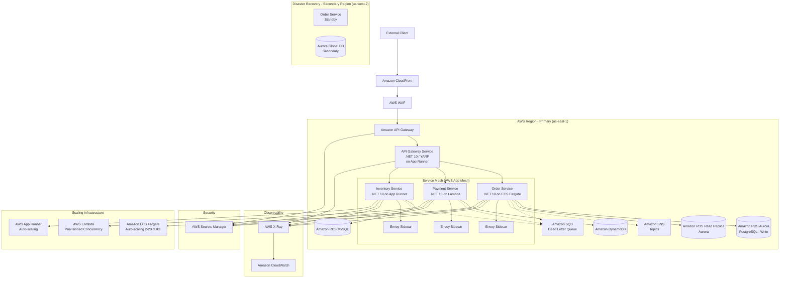
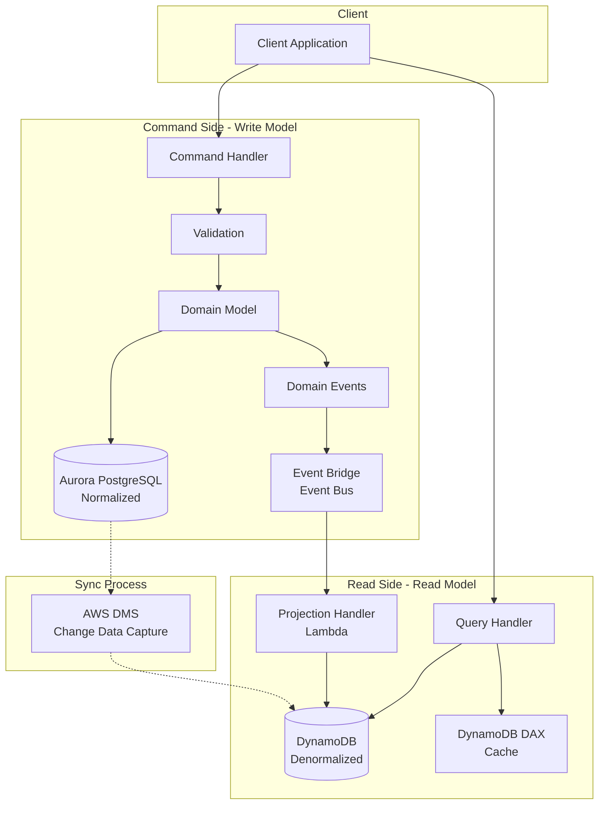
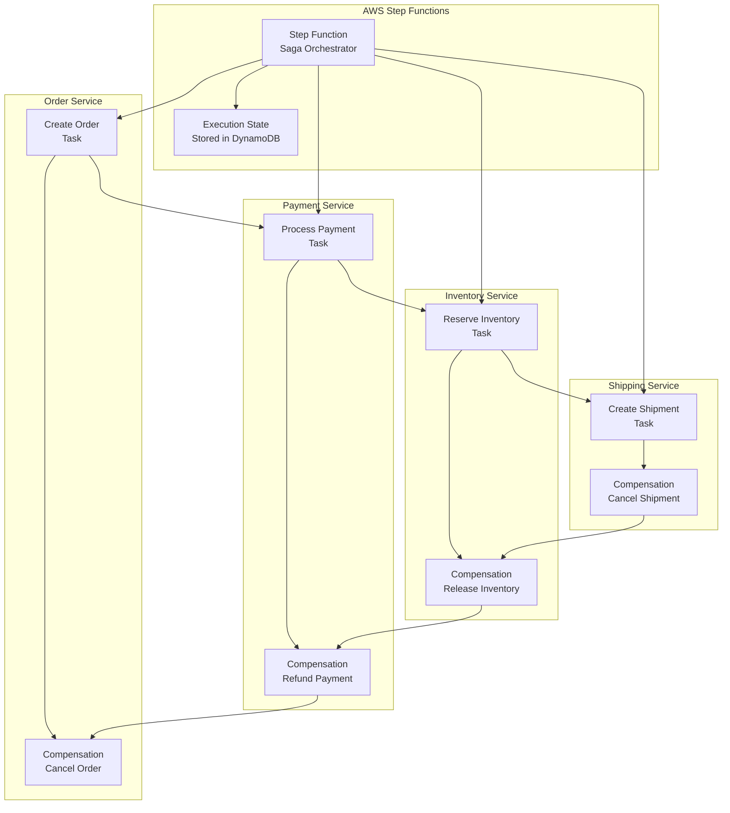
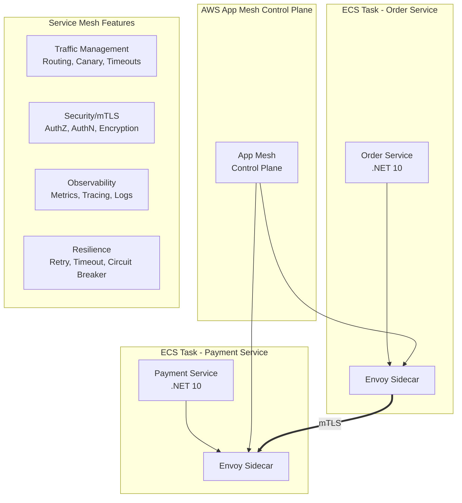
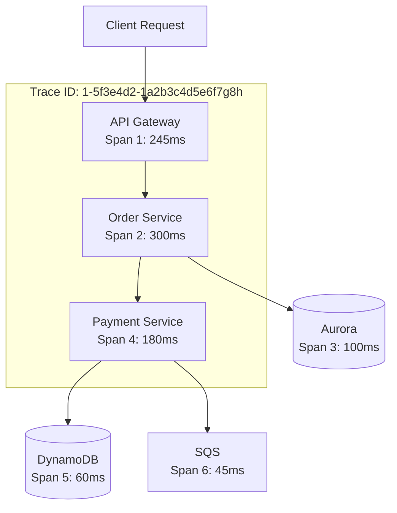
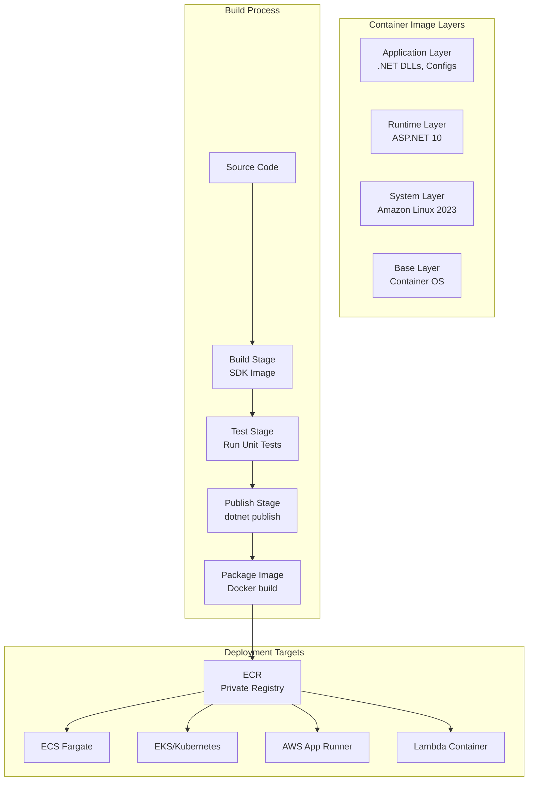

# 10 Essential Microservices Architecture Patterns: A Professional Reference Architecture with .NET 10 and AWS - Part 2

## Enterprise-Grade Implementation Guide for Cloud-Native Systems

**Author:** Principal Cloud Architect
**Version:** 1.0
**Last Updated:** March 2025

---

## Introduction

The journey from monolithic applications to microservices is paved with both opportunity and complexity. After architecting distributed systems for Fortune 500 companies over the past decade, I've learned that success isn't about adopting every pattern—it's about understanding which patterns solve specific problems and implementing them correctly.

This reference architecture presents ten fundamental microservices patterns that form the backbone of any resilient, scalable cloud-native system. Each pattern is examined through the lens of enterprise requirements including scalability, resilience, security, and maintainability.

**What makes this guide different:** Every pattern includes production-ready .NET 10 code implementing SOLID principles, proper dependency injection, AWS Secrets Manager integration for security, and comprehensive observability. The architecture is designed to handle real-world scenarios—from handling millions of requests to recovering from catastrophic failures.

### Series Structure

This guide is split into two parts for easier consumption:

**Part 1:** Covered the first five foundational patterns—API Gateway, Service Discovery, Load Balancing, Circuit Breaker, and Event-Driven Communication—implemented on **AWS**. These patterns establish the core communication and resilience layer of your microservices architecture.

**Part 2 (This Document):** Covers the remaining five advanced patterns—CQRS, Saga Pattern, Service Mesh, Distributed Tracing, and Containerization—also on **AWS**. These patterns address complex distributed data management, observability, and operational concerns.

Each part includes complete architectural diagrams, design pattern explanations, SOLID principle applications, and production-ready .NET 10 implementations with AWS services.

### The Patterns We'll Master

**Part 1: Foundational Communication Patterns (AWS)**

1. **API Gateway** - The single entry point that protects and routes all client requests
2. **Service Discovery** - How services find each other in a dynamic cloud environment
3. **Load Balancing** - Distributing traffic for optimal performance and reliability
4. **Circuit Breaker** - Preventing cascading failures when dependencies fail
5. **Event-Driven Communication** - Asynchronous, decoupled service interaction

**Part 2: Advanced Data & Operational Patterns (AWS)**
6. **CQRS** - Separating read and write models for optimal performance
7. **Saga Pattern** - Managing distributed transactions with compensation
8. **Service Mesh** - Offloading cross-cutting concerns to the infrastructure layer
9. **Distributed Tracing** - Following requests across service boundaries
10. **Containerization** - Packaging and deploying consistently anywhere

---

## System Architecture Overview

Before diving into individual patterns, let's understand how all the pieces fit together in our AWS-based reference implementation.

### High-Level Architecture



### Technology Stack Summary


| Component        | AWS Service                       | Justification                                |
| ---------------- | --------------------------------- | -------------------------------------------- |
| **Runtime**      | .NET 10 on AWS Lambda/ECS         | Native AOT support, minimal APIs             |
| **ORM**          | EF Core 10 + Dapper               | Compiled models, high-performance queries    |
| **API Gateway**  | Amazon API Gateway + YARP         | Managed service + custom flexibility         |
| **Service Mesh** | AWS App Mesh                      | Native AWS integration, Envoy proxies        |
| **Secrets**      | AWS Secrets Manager               | Automatic rotation, IAM integration          |
| **Database**     | Amazon RDS Aurora + DynamoDB      | Multi-AZ, global tables, serverless          |
| **Messaging**    | Amazon SNS + SQS                  | Fully managed, FIFO, DLQ support             |
| **Container**    | ECR + ECS Fargate + App Runner    | Serverless containers, no cluster management |
| **Monitoring**   | AWS X-Ray + CloudWatch            | Distributed tracing, metrics, logs           |
| **Compute**      | ECS Fargate + Lambda + App Runner | Flexible compute options per workload        |

### Design Principles Applied Throughout

- **Single Responsibility Principle**: Each microservice owns its domain and does one thing well
- **Open/Closed Principle**: Services extensible via events and configuration, not code modification
- **Liskov Substitution**: Consistent service interfaces allow component swapping
- **Interface Segregation**: Client-specific interfaces prevent unnecessary dependencies
- **Dependency Inversion**: Abstractions depend on abstractions, not concretions
- **Domain-Driven Design**: Bounded contexts ensure clean domain boundaries
- **Infrastructure as Code**: All resources defined in CloudFormation/CDK for repeatability
- **Security by Design**: IAM roles, least privilege, Secrets Manager integration

---

# Part 2: Advanced Data & Operational Patterns on AWS

---

## Pattern 6: CQRS (Command Query Responsibility Segregation)

### Concept Overview

CQRS separates read and write operations into different models, allowing each to be optimized independently for performance, scalability, and security.

**Definition:** CQRS is an architectural pattern that separates the operations that read data (queries) from the operations that write data (commands). This separation allows each side to use models optimized for its specific purpose.

**Why it's essential:**

- Read and write workloads often have different requirements
- Queries can use denormalized data for better performance
- Commands can enforce complex business rules
- Scales read and write independently
- Improves security by segregating responsibilities
- Enables event sourcing integration

**Real-world analogy:** Think of a library. The catalog system (read) is optimized for finding books quickly, with multiple copies and easy searching. The acquisition system (write) is optimized for ordering, cataloging, and shelving new books, with complex business rules about budgeting and vendor relationships. They use different data structures but work together.

### Architecture



### Database Options Comparison


| Database                | Write Perf | Read Perf   | Consistency | Scaling   | Best For                            |
| ----------------------- | ---------- | ----------- | ----------- | --------- | ----------------------------------- |
| **Aurora PostgreSQL**   | Good       | Excellent   | Strong      | 128TB     | Transactional writes, complex joins |
| **Aurora MySQL**        | Good       | Excellent   | Strong      | 128TB     | MySQL compatibility                 |
| **DynamoDB**            | Excellent  | Excellent   | Tunable     | Unlimited | High-scale reads/writes, key-value  |
| **DynamoDB + DAX**      | Excellent  | Exceptional | Eventual    | Unlimited | Read-heavy workloads, caching       |
| **RDS + Read Replicas** | Good       | Very Good   | Eventual    | 64TB      | Read scale-out, cost-effective      |

### Design Patterns Applied

- **Command Pattern**: Encapsulate write operations
- **Query Pattern**: Separate read operations
- **Repository Pattern**: Data access abstraction
- **Unit of Work Pattern**: Transaction management
- **Projection Pattern**: Read model updates from events
- **Separated Interface Pattern**: Decouple command/query contracts
- **Mediator Pattern**: Decouple request handling

### SOLID Principles Implementation

**Command Side**

```csharp
// ICommand.cs
public interface ICommand<TResult>
{
}

// Command Handler Interface
public interface ICommandHandler<in TCommand, TResult>
    where TCommand : ICommand<TResult>
{
    Task<TResult> HandleAsync(TCommand command, CancellationToken cancellationToken = default);
}

// Specific Commands
public record CreateOrderCommand(
    string CustomerId,
    List<OrderItemDto> Items,
    AddressDto ShippingAddress,
    string PaymentMethod
) : ICommand<OrderResult>;

public record UpdateOrderStatusCommand(
    Guid OrderId,
    OrderStatus NewStatus,
    string Reason
) : ICommand<bool>;

public record CancelOrderCommand(
    Guid OrderId,
    string Reason
) : ICommand<bool>;

// Command Result
public record OrderResult(
    Guid OrderId,
    string CustomerId,
    decimal TotalAmount,
    OrderStatus Status,
    DateTime CreatedAt
);
```

**Domain Models - Rich Domain with Business Logic**

```csharp
// Domain Models
public class Order : AggregateRoot
{
    private readonly List<OrderItem> _items = new();
    private readonly List<IDomainEvent> _domainEvents = new();
  
    public Guid Id { get; private set; }
    public string CustomerId { get; private set; }
    public DateTime CreatedAt { get; private set; }
    public IReadOnlyList<OrderItem> Items => _items.AsReadOnly();
    public OrderStatus Status { get; private set; }
    public decimal TotalAmount { get; private set; }
    public Address ShippingAddress { get; private set; }
    public PaymentInfo PaymentInfo { get; private set; }
    public IReadOnlyList<IDomainEvent> DomainEvents => _domainEvents.AsReadOnly();
  
    private Order() { } // EF Core
  
    public static Order Create(string customerId, List<OrderItem> items, Address shippingAddress)
    {
        if (string.IsNullOrWhiteSpace(customerId))
            throw new DomainException("Customer ID is required");
          
        if (!items.Any())
            throw new DomainException("Order must have at least one item");
          
        var order = new Order
        {
            Id = Guid.NewGuid(),
            CustomerId = customerId,
            CreatedAt = DateTime.UtcNow,
            Status = OrderStatus.Pending,
            ShippingAddress = shippingAddress
        };
      
        order.AddItems(items);
        order.CalculateTotal();
      
        order.AddDomainEvent(new OrderCreatedDomainEvent(order.Id, customerId, order.TotalAmount));
      
        return order;
    }
  
    private void AddItems(List<OrderItem> items)
    {
        _items.AddRange(items);
    }
  
    private void CalculateTotal()
    {
        TotalAmount = _items.Sum(i => i.Quantity * i.UnitPrice);
    }
  
    public void AddPayment(PaymentInfo payment)
    {
        if (Status != OrderStatus.Pending)
            throw new DomainException("Can only add payment to pending orders");
          
        if (payment.Amount != TotalAmount)
            throw new DomainException($"Payment amount {payment.Amount} does not match order total {TotalAmount}");
          
        PaymentInfo = payment;
        Status = OrderStatus.Paid;
      
        AddDomainEvent(new OrderPaidDomainEvent(Id, payment.TransactionId));
    }
  
    public void Ship()
    {
        if (Status != OrderStatus.Paid)
            throw new DomainException("Can only ship paid orders");
          
        Status = OrderStatus.Shipped;
      
        AddDomainEvent(new OrderShippedDomainEvent(Id));
    }
  
    public void Deliver()
    {
        if (Status != OrderStatus.Shipped)
            throw new DomainException("Can only deliver shipped orders");
          
        Status = OrderStatus.Delivered;
      
        AddDomainEvent(new OrderDeliveredDomainEvent(Id));
    }
  
    public void Cancel(string reason)
    {
        if (Status == OrderStatus.Shipped || Status == OrderStatus.Delivered)
            throw new DomainException("Cannot cancel shipped or delivered orders");
          
        Status = OrderStatus.Cancelled;
      
        AddDomainEvent(new OrderCancelledDomainEvent(Id, reason));
    }
  
    private void AddDomainEvent(IDomainEvent domainEvent)
    {
        _domainEvents.Add(domainEvent);
    }
  
    public void ClearDomainEvents()
    {
        _domainEvents.Clear();
    }
}

// Value Objects
public record Address(string Street, string City, string PostalCode, string Country)
{
    public string FullAddress => $"{Street}, {City}, {PostalCode}, {Country}";
}

public record OrderItem(Guid ProductId, string ProductName, int Quantity, decimal UnitPrice)
{
    public decimal TotalPrice => Quantity * UnitPrice;
}

public record PaymentInfo(string TransactionId, decimal Amount, DateTime PaidAt, PaymentMethod Method);
```

**Write Repository with Aurora PostgreSQL**

```csharp
// IOrderRepository.cs
public interface IOrderRepository
{
    Task<Order> GetByIdAsync(Guid id, CancellationToken cancellationToken = default);
    Task<IEnumerable<Order>> GetByCustomerAsync(string customerId, CancellationToken cancellationToken = default);
    Task AddAsync(Order order, CancellationToken cancellationToken = default);
    Task UpdateAsync(Order order, CancellationToken cancellationToken = default);
    Task<bool> ExistsAsync(Guid id, CancellationToken cancellationToken = default);
}

// PostgreSQL Implementation with EF Core
public class OrderRepository : IOrderRepository
{
    private readonly WriteDbContext _context;
    private readonly ILogger<OrderRepository> _logger;
  
    public OrderRepository(
        WriteDbContext context,
        ILogger<OrderRepository> logger)
    {
        _context = context;
        _logger = logger;
    }
  
    public async Task<Order> GetByIdAsync(Guid id, CancellationToken cancellationToken)
    {
        return await _context.Orders
            .Include(o => o.Items)
            .FirstOrDefaultAsync(o => o.Id == id, cancellationToken);
    }
  
    public async Task<IEnumerable<Order>> GetByCustomerAsync(string customerId, CancellationToken cancellationToken)
    {
        return await _context.Orders
            .Include(o => o.Items)
            .Where(o => o.CustomerId == customerId)
            .OrderByDescending(o => o.CreatedAt)
            .ToListAsync(cancellationToken);
    }
  
    public async Task AddAsync(Order order, CancellationToken cancellationToken)
    {
        await _context.Orders.AddAsync(order, cancellationToken);
    }
  
    public Task UpdateAsync(Order order, CancellationToken cancellationToken)
    {
        _context.Entry(order).State = EntityState.Modified;
        return Task.CompletedTask;
    }
  
    public async Task<bool> ExistsAsync(Guid id, CancellationToken cancellationToken)
    {
        return await _context.Orders.AnyAsync(o => o.Id == id, cancellationToken);
    }
}

// WriteDbContext with PostgreSQL
public class WriteDbContext : DbContext
{
    public WriteDbContext(DbContextOptions<WriteDbContext> options) : base(options) { }
  
    public DbSet<Order> Orders { get; set; }
    public DbSet<OrderItem> OrderItems { get; set; }
  
    protected override void OnModelCreating(ModelBuilder modelBuilder)
    {
        modelBuilder.Entity<Order>(entity =>
        {
            entity.ToTable("orders");
            entity.HasKey(e => e.Id);
            entity.Property(e => e.TotalAmount).HasPrecision(18, 2);
            entity.OwnsOne(e => e.ShippingAddress, a =>
            {
                a.Property(p => p.Street).HasColumnName("shipping_street");
                a.Property(p => p.City).HasColumnName("shipping_city");
                a.Property(p => p.PostalCode).HasColumnName("shipping_postal_code");
                a.Property(p => p.Country).HasColumnName("shipping_country");
            });
            entity.Ignore(e => e.Items);
            entity.Ignore(e => e.DomainEvents);
        });
      
        modelBuilder.Entity<OrderItem>(entity =>
        {
            entity.ToTable("order_items");
            entity.HasKey(e => e.Id);
            entity.Property(e => e.UnitPrice).HasPrecision(18, 2);
            entity.HasOne<Order>()
                  .WithMany()
                  .HasForeignKey(e => e.OrderId);
        });
    }
}
```

**Command Handler Implementation**

```csharp
// CreateOrderCommandHandler.cs
public class CreateOrderCommandHandler : ICommandHandler<CreateOrderCommand, OrderResult>
{
    private readonly IOrderRepository _orderRepository;
    private readonly ICustomerRepository _customerRepository;
    private readonly IProductRepository _productRepository;
    private readonly IEventPublisher _eventPublisher;
    private readonly IValidator<CreateOrderCommand> _validator;
    private readonly IUnitOfWork _unitOfWork;
    private readonly ILogger<CreateOrderCommandHandler> _logger;
    private readonly IAmazonSimpleNotificationService _sns;
  
    public CreateOrderCommandHandler(
        IOrderRepository orderRepository,
        ICustomerRepository customerRepository,
        IProductRepository productRepository,
        IEventPublisher eventPublisher,
        IValidator<CreateOrderCommand> validator,
        IUnitOfWork unitOfWork,
        IAmazonSimpleNotificationService sns,
        ILogger<CreateOrderCommandHandler> logger)
    {
        _orderRepository = orderRepository;
        _customerRepository = customerRepository;
        _productRepository = productRepository;
        _eventPublisher = eventPublisher;
        _validator = validator;
        _unitOfWork = unitOfWork;
        _sns = sns;
        _logger = logger;
    }
  
    public async Task<OrderResult> HandleAsync(
        CreateOrderCommand command, 
        CancellationToken cancellationToken)
    {
        // 1. Validate command (Strategy pattern)
        var validationResult = await _validator.ValidateAsync(command, cancellationToken);
        if (!validationResult.IsValid)
        {
            throw new ValidationException(validationResult.Errors);
        }
      
        // 2. Begin transaction (Unit of Work)
        await _unitOfWork.BeginTransactionAsync(cancellationToken);
      
        try
        {
            // 3. Load aggregates (Repository pattern)
            var customer = await _customerRepository.GetByIdAsync(
                command.CustomerId, cancellationToken);
            if (customer == null)
                throw new CustomerNotFoundException(command.CustomerId);
          
            // 4. Convert DTOs to domain objects
            var items = command.Items.Select(i => 
                new OrderItem(i.ProductId, i.ProductName, i.Quantity, i.UnitPrice)).ToList();
          
            var address = new Address(
                command.ShippingAddress.Street,
                command.ShippingAddress.City,
                command.ShippingAddress.PostalCode,
                command.ShippingAddress.Country
            );
          
            // 5. Create domain entity (Domain model with business logic)
            var order = Order.Create(command.CustomerId, items, address);
          
            // 6. Apply business rules - check inventory
            foreach (var item in order.Items)
            {
                var product = await _productRepository.GetByIdAsync(item.ProductId, cancellationToken);
                if (!product.HasSufficientStock(item.Quantity))
                {
                    throw new InsufficientStockException(item.ProductId, item.Quantity);
                }
              
                // Reserve stock
                product.ReserveStock(item.Quantity);
                await _productRepository.UpdateAsync(product, cancellationToken);
            }
          
            // 7. Save aggregate
            await _orderRepository.AddAsync(order, cancellationToken);
            await _unitOfWork.SaveChangesAsync(cancellationToken);
          
            // 8. Publish domain events to EventBridge
            foreach (var domainEvent in order.DomainEvents)
            {
                await _eventPublisher.PublishAsync(domainEvent, cancellationToken);
            }
          
            // 9. Also publish to SNS for other subscribers
            await PublishToSnsAsync(order, cancellationToken);
          
            // 10. Commit transaction
            await _unitOfWork.CommitTransactionAsync(cancellationToken);
          
            _logger.LogInformation("Order {OrderId} created successfully", order.Id);
          
            // 11. Return result
            return new OrderResult(
                order.Id,
                order.CustomerId,
                order.TotalAmount,
                order.Status,
                order.CreatedAt
            );
        }
        catch (Exception)
        {
            // Rollback on failure
            await _unitOfWork.RollbackTransactionAsync(cancellationToken);
            throw;
        }
        finally
        {
            // Clear domain events to prevent memory leaks
            var order = await _orderRepository.GetByIdAsync(command.CustomerId, cancellationToken);
            order?.ClearDomainEvents();
        }
    }
  
    private async Task PublishToSnsAsync(Order order, CancellationToken cancellationToken)
    {
        var orderCreatedEvent = new
        {
            OrderId = order.Id,
            CustomerId = order.CustomerId,
            TotalAmount = order.TotalAmount,
            Items = order.Items.Select(i => new { i.ProductId, i.Quantity }),
            Timestamp = DateTime.UtcNow
        };
      
        var request = new PublishRequest
        {
            TopicArn = "arn:aws:sns:us-east-1:123456789012:order-events",
            Message = JsonSerializer.Serialize(orderCreatedEvent),
            Subject = "OrderCreated",
            MessageAttributes = new Dictionary<string, MessageAttributeValue>
            {
                ["EventType"] = new MessageAttributeValue
                {
                    DataType = "String",
                    StringValue = "OrderCreated"
                }
            }
        };
      
        await _sns.PublishAsync(request, cancellationToken);
    }
}
```

**Read Side - Query Models with DynamoDB**

```csharp
// IQuery.cs
public interface IQuery<TResult>
{
}

// Query Handler Interface
public interface IQueryHandler<in TQuery, TResult>
    where TQuery : IQuery<TResult>
{
    Task<TResult> HandleAsync(TQuery query, CancellationToken cancellationToken = default);
}

// Queries
public record GetOrderByIdQuery(Guid OrderId) : IQuery<OrderDetailDto>;
public record GetOrdersByCustomerQuery(string CustomerId, int Page, int PageSize) : IQuery<PagedResult<OrderSummaryDto>>;
public record GetRecentOrdersQuery(int Hours) : IQuery<List<OrderSummaryDto>>;
public record SearchOrdersQuery(string SearchTerm, OrderStatus? Status, DateTime? From, DateTime? To) : IQuery<PagedResult<OrderSummaryDto>>;

// Read Models (Denormalized for DynamoDB)
public class OrderDetailDto
{
    public Guid Id { get; set; }
    public string CustomerId { get; set; }
    public string CustomerName { get; set; }
    public string CustomerEmail { get; set; }
    public DateTime OrderDate { get; set; }
    public List<OrderItemDto> Items { get; set; }
    public decimal Subtotal { get; set; }
    public decimal Tax { get; set; }
    public decimal Shipping { get; set; }
    public decimal Total { get; set; }
    public string Status { get; set; }
    public AddressDto ShippingAddress { get; set; }
    public PaymentInfoDto Payment { get; set; }
    public List<StatusHistoryDto> StatusHistory { get; set; }
    public Dictionary<string, object> Metadata { get; set; }
}

public class OrderSummaryDto
{
    public Guid Id { get; set; }
    public string CustomerName { get; set; }
    public DateTime OrderDate { get; set; }
    public decimal Total { get; set; }
    public int ItemCount { get; set; }
    public string Status { get; set; }
    public bool IsPaid { get; set; }
    public bool IsShipped { get; set; }
    public bool IsDelivered { get; set; }
}

public class PagedResult<T>
{
    public List<T> Items { get; set; }
    public int Page { get; set; }
    public int PageSize { get; set; }
    public int TotalCount { get; set; }
    public int TotalPages => (int)Math.Ceiling(TotalCount / (double)PageSize);
    public bool HasPrevious => Page > 1;
    public bool HasNext => Page < TotalPages;
}
```

**DynamoDB Query Handler with DAX Caching**

```csharp
// DynamoDbOrderQueryHandler.cs
public class DynamoDbOrderQueryHandler : 
    IQueryHandler<GetOrderByIdQuery, OrderDetailDto>,
    IQueryHandler<GetOrdersByCustomerQuery, PagedResult<OrderSummaryDto>>
{
    private readonly IAmazonDynamoDB _dynamoDb;
    private readonly IDAXClient _daxClient; // DynamoDB Accelerator for caching
    private readonly ILogger<DynamoDbOrderQueryHandler> _logger;
    private readonly string _tableName;
    private readonly JsonSerializerOptions _jsonOptions;
  
    public DynamoDbOrderQueryHandler(
        IAmazonDynamoDB dynamoDb,
        IDAXClient daxClient,
        IConfiguration configuration,
        ILogger<DynamoDbOrderQueryHandler> logger)
    {
        _dynamoDb = dynamoDb;
        _daxClient = daxClient;
        _logger = logger;
        _tableName = configuration["DynamoDB:OrdersTable"] ?? "Orders";
        _jsonOptions = new JsonSerializerOptions
        {
            PropertyNamingPolicy = JsonNamingPolicy.CamelCase
        };
    }
  
    public async Task<OrderDetailDto> HandleAsync(
        GetOrderByIdQuery query, 
        CancellationToken cancellationToken)
    {
        // Try DAX cache first
        var cacheKey = $"ORDER#{query.OrderId}";
      
        var getItemRequest = new GetItemRequest
        {
            TableName = _tableName,
            Key = new Dictionary<string, AttributeValue>
            {
                ["PK"] = new AttributeValue { S = cacheKey },
                ["SK"] = new AttributeValue { S = "DETAIL" }
            },
            ConsistentRead = false // Eventual consistency for reads
        };
      
        // Try DAX first (low latency)
        var response = await _daxClient.GetItemAsync(getItemRequest, cancellationToken);
      
        if (response.Item.Count > 0)
        {
            _logger.LogDebug("Cache hit for order {OrderId}", query.OrderId);
            return DeserializeOrder(response.Item);
        }
      
        _logger.LogDebug("Cache miss for order {OrderId}, querying DynamoDB", query.OrderId);
      
        // Fallback to DynamoDB
        response = await _dynamoDb.GetItemAsync(getItemRequest, cancellationToken);
      
        if (response.Item.Count == 0)
            return null;
          
        var order = DeserializeOrder(response.Item);
      
        // Store in DAX for next time
        await CacheOrderAsync(order, cancellationToken);
      
        return order;
    }
  
    public async Task<PagedResult<OrderSummaryDto>> HandleAsync(
        GetOrdersByCustomerQuery query,
        CancellationToken cancellationToken)
    {
        // Query by GSI (CustomerId)
        var request = new QueryRequest
        {
            TableName = _tableName,
            IndexName = "CustomerId-Index",
            KeyConditionExpression = "CustomerId = :customerId",
            ExpressionAttributeValues = new Dictionary<string, AttributeValue>
            {
                [":customerId"] = new AttributeValue { S = query.CustomerId }
            },
            Limit = query.PageSize,
            ExclusiveStartKey = GetPaginationKey(query.Page)
        };
      
        var response = await _dynamoDb.QueryAsync(request, cancellationToken);
      
        var items = response.Items.Select(DeserializeSummary).ToList();
      
        return new PagedResult<OrderSummaryDto>
        {
            Items = items,
            Page = query.Page,
            PageSize = query.PageSize,
            TotalCount = await GetTotalCountAsync(query.CustomerId, cancellationToken)
        };
    }
  
    private OrderDetailDto DeserializeOrder(Dictionary<string, AttributeValue> item)
    {
        return new OrderDetailDto
        {
            Id = Guid.Parse(item["OrderId"].S),
            CustomerId = item["CustomerId"].S,
            CustomerName = item.GetValueOrDefault("CustomerName")?.S ?? "",
            OrderDate = DateTime.Parse(item["OrderDate"].S),
            Total = decimal.Parse(item["Total"].N),
            Status = item["Status"].S,
            Items = DeserializeItems(item.GetValueOrDefault("Items")?.S ?? "[]")
        };
    }
  
    private OrderSummaryDto DeserializeSummary(Dictionary<string, AttributeValue> item)
    {
        return new OrderSummaryDto
        {
            Id = Guid.Parse(item["OrderId"].S),
            CustomerName = item.GetValueOrDefault("CustomerName")?.S ?? "",
            OrderDate = DateTime.Parse(item["OrderDate"].S),
            Total = decimal.Parse(item["Total"].N),
            ItemCount = int.Parse(item.GetValueOrDefault("ItemCount")?.N ?? "0"),
            Status = item["Status"].S,
            IsPaid = item["Status"].S == "Paid" || item["Status"].S == "Shipped" || item["Status"].S == "Delivered",
            IsShipped = item["Status"].S == "Shipped" || item["Status"].S == "Delivered",
            IsDelivered = item["Status"].S == "Delivered"
        };
    }
  
    private List<OrderItemDto> DeserializeItems(string itemsJson)
    {
        return JsonSerializer.Deserialize<List<OrderItemDto>>(itemsJson, _jsonOptions);
    }
  
    private async Task CacheOrderAsync(OrderDetailDto order, CancellationToken cancellationToken)
    {
        try
        {
            var cacheKey = $"ORDER#{order.Id}";
            var item = SerializeOrder(order);
          
            var putRequest = new PutItemRequest
            {
                TableName = _tableName,
                Item = item
            };
          
            await _daxClient.PutItemAsync(putRequest, cancellationToken);
        }
        catch (Exception ex)
        {
            _logger.LogWarning(ex, "Failed to cache order {OrderId}", order.Id);
            // Non-critical, continue
        }
    }
  
    private Dictionary<string, AttributeValue> SerializeOrder(OrderDetailDto order)
    {
        return new Dictionary<string, AttributeValue>
        {
            ["PK"] = new AttributeValue { S = $"ORDER#{order.Id}" },
            ["SK"] = new AttributeValue { S = "DETAIL" },
            ["OrderId"] = new AttributeValue { S = order.Id.ToString() },
            ["CustomerId"] = new AttributeValue { S = order.CustomerId },
            ["CustomerName"] = new AttributeValue { S = order.CustomerName },
            ["OrderDate"] = new AttributeValue { S = order.OrderDate.ToString("o") },
            ["Total"] = new AttributeValue { N = order.Total.ToString() },
            ["Status"] = new AttributeValue { S = order.Status },
            ["Items"] = new AttributeValue { S = JsonSerializer.Serialize(order.Items) }
        };
    }
  
    private Dictionary<string, AttributeValue> GetPaginationKey(int page)
    {
        // Implement pagination logic
        return null;
    }
  
    private async Task<int> GetTotalCountAsync(string customerId, CancellationToken cancellationToken)
    {
        var request = new QueryRequest
        {
            TableName = _tableName,
            IndexName = "CustomerId-Index",
            KeyConditionExpression = "CustomerId = :customerId",
            ExpressionAttributeValues = new Dictionary<string, AttributeValue>
            {
                [":customerId"] = new AttributeValue { S = customerId }
            },
            Select = Select.COUNT
        };
      
        var response = await _dynamoDb.QueryAsync(request, cancellationToken);
        return response.Count;
    }
}
```

**Projection Handler - Update Read Model from Events**

```csharp
// OrderProjectionHandler.cs - AWS Lambda triggered by EventBridge
public class OrderProjectionHandler
{
    private readonly IAmazonDynamoDB _dynamoDb;
    private readonly IAmazonSNS _sns;
    private readonly ILogger<OrderProjectionHandler> _logger;
    private readonly string _tableName;
  
    public OrderProjectionHandler()
    {
        _dynamoDb = new AmazonDynamoDBClient();
        _sns = new AmazonSimpleNotificationServiceClient();
        _logger = LoggerFactory.Create(b => b.AddConsole()).CreateLogger<OrderProjectionHandler>();
        _tableName = Environment.GetEnvironmentVariable("ORDERS_TABLE") ?? "Orders";
    }
  
    public async Task HandleAsync(OrderCreatedEvent @event, ILambdaContext context)
    {
        _logger.LogInformation("Projecting order {OrderId} to DynamoDB", @event.OrderId);
      
        // Create denormalized read model
        var orderDetail = new OrderDetailDto
        {
            Id = @event.OrderId,
            CustomerId = @event.CustomerId,
            CustomerName = await GetCustomerNameAsync(@event.CustomerId),
            OrderDate = @event.OccurredAt,
            Total = @event.TotalAmount,
            Status = "Pending",
            Items = @event.Items,
            ShippingAddress = @event.ShippingAddress,
            StatusHistory = new List<StatusHistoryDto>
            {
                new StatusHistoryDto
                {
                    Status = "Pending",
                    ChangedAt = @event.OccurredAt,
                    Note = "Order created"
                }
            }
        };
      
        // Store in DynamoDB
        await StoreOrderDetailAsync(orderDetail);
      
        // Also store summary for list views
        await StoreOrderSummaryAsync(orderDetail);
      
        // Publish projection completed event
        await PublishProjectionCompletedAsync(@event.OrderId);
    }
  
    public async Task HandleAsync(OrderPaidDomainEvent @event, ILambdaContext context)
    {
        var updateRequest = new UpdateItemRequest
        {
            TableName = _tableName,
            Key = new Dictionary<string, AttributeValue>
            {
                ["PK"] = new AttributeValue { S = $"ORDER#{@event.OrderId}" },
                ["SK"] = new AttributeValue { S = "DETAIL" }
            },
            UpdateExpression = "SET #status = :status, PaymentId = :paymentId, PaidAt = :paidAt",
            ExpressionAttributeNames = new Dictionary<string, string>
            {
                ["#status"] = "Status"
            },
            ExpressionAttributeValues = new Dictionary<string, AttributeValue>
            {
                [":status"] = new AttributeValue { S = "Paid" },
                [":paymentId"] = new AttributeValue { S = @event.PaymentId },
                [":paidAt"] = new AttributeValue { S = DateTime.UtcNow.ToString("o") }
            }
        };
      
        await _dynamoDb.UpdateItemAsync(updateRequest);
      
        // Add to status history
        await AddStatusHistoryAsync(@event.OrderId, "Paid", "Payment processed");
      
        // Update summary
        await UpdateOrderSummaryStatusAsync(@event.OrderId, "Paid");
    }
  
    private async Task StoreOrderDetailAsync(OrderDetailDto order)
    {
        var item = new Dictionary<string, AttributeValue>
        {
            ["PK"] = new AttributeValue { S = $"ORDER#{order.Id}" },
            ["SK"] = new AttributeValue { S = "DETAIL" },
            ["OrderId"] = new AttributeValue { S = order.Id.ToString() },
            ["CustomerId"] = new AttributeValue { S = order.CustomerId },
            ["CustomerName"] = new AttributeValue { S = order.CustomerName ?? "" },
            ["OrderDate"] = new AttributeValue { S = order.OrderDate.ToString("o") },
            ["Total"] = new AttributeValue { N = order.Total.ToString() },
            ["Status"] = new AttributeValue { S = order.Status },
            ["Items"] = new AttributeValue { S = JsonSerializer.Serialize(order.Items) },
            ["ShippingAddress"] = new AttributeValue { S = JsonSerializer.Serialize(order.ShippingAddress) },
            ["StatusHistory"] = new AttributeValue { S = JsonSerializer.Serialize(order.StatusHistory) },
            ["TTL"] = new AttributeValue { N = DateTimeOffset.UtcNow.AddDays(90).ToUnixTimeSeconds().ToString() }
        };
      
        var request = new PutItemRequest
        {
            TableName = _tableName,
            Item = item
        };
      
        await _dynamoDb.PutItemAsync(request);
    }
  
    private async Task StoreOrderSummaryAsync(OrderDetailDto order)
    {
        var item = new Dictionary<string, AttributeValue>
        {
            ["PK"] = new AttributeValue { S = $"CUSTOMER#{order.CustomerId}" },
            ["SK"] = new AttributeValue { S = $"ORDER#{order.Id}" },
            ["OrderId"] = new AttributeValue { S = order.Id.ToString() },
            ["CustomerName"] = new AttributeValue { S = order.CustomerName ?? "" },
            ["OrderDate"] = new AttributeValue { S = order.OrderDate.ToString("o") },
            ["Total"] = new AttributeValue { N = order.Total.ToString() },
            ["ItemCount"] = new AttributeValue { N = order.Items.Count.ToString() },
            ["Status"] = new AttributeValue { S = order.Status }
        };
      
        var request = new PutItemRequest
        {
            TableName = _tableName,
            Item = item
        };
      
        await _dynamoDb.PutItemAsync(request);
    }
  
    private async Task AddStatusHistoryAsync(Guid orderId, string status, string note)
    {
        var getRequest = new GetItemRequest
        {
            TableName = _tableName,
            Key = new Dictionary<string, AttributeValue>
            {
                ["PK"] = new AttributeValue { S = $"ORDER#{orderId}" },
                ["SK"] = new AttributeValue { S = "DETAIL" }
            }
        };
      
        var response = await _dynamoDb.GetItemAsync(getRequest);
      
        if (response.Item.Count > 0)
        {
            var historyJson = response.Item.GetValueOrDefault("StatusHistory")?.S ?? "[]";
            var history = JsonSerializer.Deserialize<List<StatusHistoryDto>>(historyJson);
          
            history.Add(new StatusHistoryDto
            {
                Status = status,
                ChangedAt = DateTime.UtcNow,
                Note = note
            });
          
            var updateRequest = new UpdateItemRequest
            {
                TableName = _tableName,
                Key = new Dictionary<string, AttributeValue>
                {
                    ["PK"] = new AttributeValue { S = $"ORDER#{orderId}" },
                    ["SK"] = new AttributeValue { S = "DETAIL" }
                },
                UpdateExpression = "SET StatusHistory = :history",
                ExpressionAttributeValues = new Dictionary<string, AttributeValue>
                {
                    [":history"] = new AttributeValue { S = JsonSerializer.Serialize(history) }
                }
            };
          
            await _dynamoDb.UpdateItemAsync(updateRequest);
        }
    }
  
    private async Task UpdateOrderSummaryStatusAsync(Guid orderId, string status)
    {
        // Need to find all summaries for this order (could be multiple customers)
        // This is simplified - in production, you'd maintain an index
    }
  
    private async Task<string> GetCustomerNameAsync(string customerId)
    {
        // Call customer service or query customer table
        return "John Doe"; // Simplified
    }
  
    private async Task PublishProjectionCompletedAsync(Guid orderId)
    {
        var request = new PublishRequest
        {
            TopicArn = "arn:aws:sns:us-east-1:123456789012:projection-events",
            Message = JsonSerializer.Serialize(new { OrderId = orderId, Event = "ProjectionCompleted" }),
            Subject = "ProjectionCompleted"
        };
      
        await _sns.PublishAsync(request);
    }
}
```

**EventBridge Rules for Projections**

```yaml
# eventbridge-rules.yaml
AWSTemplateFormatVersion: '2010-09-09'
Description: 'EventBridge Rules for Order Projections'

Parameters:
  Environment:
    Type: String
    Default: production

Resources:
  # Event Bus
  OrderEventBus:
    Type: AWS::Events::EventBus
    Properties:
      Name: !Sub 'order-events-${Environment}'
  
  # Rule for Order Created events
  OrderCreatedRule:
    Type: AWS::Events::Rule
    Properties:
      Name: !Sub 'order-created-projection-${Environment}'
      EventBusName: !Ref OrderEventBus
      EventPattern:
        source:
          - "order.service"
        detail-type:
          - "OrderCreated"
      Targets:
        - Arn: !GetAtt OrderProjectionFunction.Arn
          Id: "OrderProjectionFunction"
          InputPath: "$.detail"
  
  # Rule for Order Paid events
  OrderPaidRule:
    Type: AWS::Events::Rule
    Properties:
      Name: !Sub 'order-paid-projection-${Environment}'
      EventBusName: !Ref OrderEventBus
      EventPattern:
        source:
          - "order.service"
        detail-type:
          - "OrderPaid"
      Targets:
        - Arn: !GetAtt OrderProjectionFunction.Arn
          Id: "OrderProjectionFunction"
          InputPath: "$.detail"
  
  # Lambda Permission for EventBridge
  EventBridgePermission:
    Type: AWS::Lambda::Permission
    Properties:
      FunctionName: !Ref OrderProjectionFunction
      Action: lambda:InvokeFunction
      Principal: events.amazonaws.com
      SourceArn: !GetAtt OrderCreatedRule.Arn

  # Lambda Function for Projections
  OrderProjectionFunction:
    Type: AWS::Lambda::Function
    Properties:
      FunctionName: !Sub 'order-projection-${Environment}'
      Runtime: dotnet10
      Handler: OrderService::OrderService.Projections.OrderProjectionHandler::HandleAsync
      Code:
        S3Bucket: !Sub 'microservices-lambda-${AWS::AccountId}'
        S3Key: order-projection.zip
      MemorySize: 512
      Timeout: 60
      Environment:
        Variables:
          ENVIRONMENT: !Ref Environment
          ORDERS_TABLE: !Ref OrdersTable
          CUSTOMER_TABLE: !Ref CustomerTable
      Policies:
        - AWSLambdaBasicExecutionRole
        - Version: '2012-10-17'
          Statement:
            - Effect: Allow
              Action:
                - dynamodb:GetItem
                - dynamodb:PutItem
                - dynamodb:UpdateItem
                - dynamodb:Query
              Resource: !GetAtt OrdersTable.Arn
            - Effect: Allow
              Action:
                - sns:Publish
              Resource: !Ref ProjectionEventsTopic

  # DynamoDB Tables
  OrdersTable:
    Type: AWS::DynamoDB::Table
    Properties:
      TableName: !Sub 'orders-${Environment}'
      AttributeDefinitions:
        - AttributeName: PK
          AttributeType: S
        - AttributeName: SK
          AttributeType: S
        - AttributeName: CustomerId
          AttributeType: S
        - AttributeName: OrderDate
          AttributeType: S
      KeySchema:
        - AttributeName: PK
          KeyType: HASH
        - AttributeName: SK
          KeyType: RANGE
      GlobalSecondaryIndexes:
        - IndexName: CustomerId-Index
          KeySchema:
            - AttributeName: CustomerId
              KeyType: HASH
            - AttributeName: OrderDate
              KeyType: RANGE
          Projection:
            ProjectionType: ALL
      BillingMode: PAY_PER_REQUEST
      TimeToLiveSpecification:
        AttributeName: TTL
        Enabled: true

  CustomerTable:
    Type: AWS::DynamoDB::Table
    Properties:
      TableName: !Sub 'customers-${Environment}'
      AttributeDefinitions:
        - AttributeName: PK
          AttributeType: S
        - AttributeName: SK
          AttributeType: S
      KeySchema:
        - AttributeName: PK
          KeyType: HASH
        - AttributeName: SK
          KeyType: RANGE
      BillingMode: PAY_PER_REQUEST

  # DAX Cluster for Caching
  DAXCluster:
    Type: AWS::DAX::Cluster
    Properties:
      ClusterName: !Sub 'orders-dax-${Environment}'
      NodeType: dax.r4.large
      ReplicationFactor: 3
      IAMRoleARN: !GetAtt DAXRole.Arn
      SubnetGroupName: !Ref DAXSubnetGroup
      SecurityGroupIds:
        - !Ref DAXSecurityGroup

  DAXSubnetGroup:
    Type: AWS::DAX::SubnetGroup
    Properties:
      SubnetGroupName: !Sub 'dax-subnet-group-${Environment}'
      SubnetIds:
        - subnet-12345
        - subnet-67890

  DAXSecurityGroup:
    Type: AWS::EC2::SecurityGroup
    Properties:
      GroupDescription: Security group for DAX cluster
      VpcId: vpc-12345

  DAXRole:
    Type: AWS::IAM::Role
    Properties:
      AssumeRolePolicyDocument:
        Version: '2012-10-17'
        Statement:
          - Effect: Allow
            Principal:
              Service: dax.amazonaws.com
            Action: sts:AssumeRole
      Policies:
        - PolicyName: DAXAccess
          PolicyDocument:
            Version: '2012-10-17'
            Statement:
              - Effect: Allow
                Action:
                  - dynamodb:GetItem
                  - dynamodb:PutItem
                  - dynamodb:UpdateItem
                  - dynamodb:DeleteItem
                  - dynamodb:Query
                  - dynamodb:Scan
                Resource: !GetAtt OrdersTable.Arn

  # SNS Topic for Projection Events
  ProjectionEventsTopic:
    Type: AWS::SNS::Topic
    Properties:
      TopicName: !Sub 'projection-events-${Environment}'

Outputs:
  OrdersTableName:
    Description: Orders DynamoDB Table
    Value: !Ref OrdersTable
  
  DAXEndpoint:
    Description: DAX Cluster Endpoint
    Value: !GetAtt DAXCluster.ClusterDiscoveryEndpoint
  
  EventBusName:
    Description: EventBridge Event Bus
    Value: !Ref OrderEventBus
```

### Key Takeaways

- **CQRS with AWS** - Aurora for writes, DynamoDB for reads
- **DynamoDB DAX** - In-memory cache for read models
- **EventBridge** - Central event bus for domain events
- **Lambda projections** - Serverless read model updates
- **Global secondary indexes** - Flexible query patterns
- **TTL for data retention** - Automatic cleanup of old data
- **Polyglot persistence** - Choose the right database for each workload

---

## Pattern 7: Saga Pattern

### Concept Overview

The Saga pattern manages distributed transactions across multiple microservices by breaking them into a series of local transactions with compensating actions for rollback.

**Definition:** A saga is a sequence of local transactions where each transaction updates data within a single service. If a transaction fails, the saga executes compensating transactions to undo the changes made by preceding transactions.

**Why it's essential:**

- Distributed transactions don't scale (2PC is slow)
- Services must maintain consistency without distributed locks
- Failures require coordinated rollback
- Business processes often span multiple services
- Provides eventual consistency across boundaries
- Enables long-running business processes

**Real-world analogy:** Think of booking a vacation package: flight, hotel, and car rental. If the hotel booking fails after flight is booked, you need to cancel the flight (compensation). Each booking is a local transaction, and if any fails, you compensate the previous ones.

### Saga Flow



### Saga Implementation Options


| Pattern           | Coordination             | AWS Service    | Best For                               |
| ----------------- | ------------------------ | -------------- | -------------------------------------- |
| **Choreography**  | Decentralized (events)   | SNS + SQS      | Simple workflows, fewer services       |
| **Orchestration** | Centralized orchestrator | Step Functions | Complex workflows, business processes  |
| **State Machine** | Visual workflow          | Step Functions | Long-running processes, human approval |

### Design Patterns Applied

- **Saga Pattern**: Distributed transaction coordination
- **State Machine Pattern**: Saga state management with Step Functions
- **Command Pattern**: Encapsulate transaction steps
- **Compensation Pattern**: Rollback actions for failures
- **Process Manager Pattern**: Centralized orchestration
- **Event Sourcing Pattern**: Saga state persistence in DynamoDB

### SOLID Principles Implementation

**Saga Definition**

```csharp
// ISaga.cs
public interface ISaga<TData> where TData : class
{
    string SagaId { get; }
    TData Data { get; }
    SagaStatus Status { get; }
    Task StartAsync(CancellationToken cancellationToken = default);
    Task HandleCallbackAsync<TMessage>(TMessage message, CancellationToken cancellationToken = default);
}

public enum SagaStatus
{
    NotStarted,
    InProgress,
    Completed,
    Failed,
    Compensating,
    Compensated
}
```

**Order Saga Data**

```csharp
// OrderSagaData.cs
public class OrderSagaData
{
    public string SagaId { get; set; }
    public Guid OrderId { get; set; }
    public string CustomerId { get; set; }
    public decimal TotalAmount { get; set; }
    public List<OrderItem> Items { get; set; }
    public string PaymentId { get; set; }
    public List<ReservedItem> ReservedItems { get; set; }
    public string ShipmentId { get; set; }
    public DateTime CreatedAt { get; set; }
    public DateTime? CompletedAt { get; set; }
    public Dictionary<string, object> StepResults { get; set; } = new();
    public string CorrelationId { get; set; }
    public List<string> CompletedSteps { get; set; } = new();
    public string CurrentStep { get; set; }
}

public class ReservedItem
{
    public string ProductId { get; set; }
    public int Quantity { get; set; }
    public string Location { get; set; }
}
```

**Step Functions State Machine Definition**

```json
{
  "Comment": "Order Processing Saga",
  "StartAt": "ProcessPayment",
  "States": {
    "ProcessPayment": {
      "Type": "Task",
      "Resource": "arn:aws:lambda:us-east-1:123456789012:function:process-payment",
      "Next": "CheckPaymentResult",
      "Catch": [
        {
          "ErrorEquals": ["States.ALL"],
          "Next": "CompensateOrder"
        }
      ],
      "Parameters": {
        "sagaId.$": "$$.Execution.Id",
        "orderId.$": "$.orderId",
        "customerId.$": "$.customerId",
        "amount.$": "$.totalAmount"
      }
    },
    "CheckPaymentResult": {
      "Type": "Choice",
      "Choices": [
        {
          "Variable": "$.paymentResult.success",
          "BooleanEquals": true,
          "Next": "ReserveInventory"
        },
        {
          "Variable": "$.paymentResult.success",
          "BooleanEquals": false,
          "Next": "CompensateOrder"
        }
      ],
      "Default": "CompensateOrder"
    },
    "ReserveInventory": {
      "Type": "Task",
      "Resource": "arn:aws:lambda:us-east-1:123456789012:function:reserve-inventory",
      "Next": "CheckInventoryResult",
      "Catch": [
        {
          "ErrorEquals": ["States.ALL"],
          "Next": "CompensatePayment"
        }
      ],
      "Parameters": {
        "sagaId.$": "$$.Execution.Id",
        "orderId.$": "$.orderId",
        "items.$": "$.items"
      }
    },
    "CheckInventoryResult": {
      "Type": "Choice",
      "Choices": [
        {
          "Variable": "$.inventoryResult.success",
          "BooleanEquals": true,
          "Next": "CreateShipment"
        },
        {
          "Variable": "$.inventoryResult.success",
          "BooleanEquals": false,
          "Next": "CompensatePayment"
        }
      ],
      "Default": "CompensatePayment"
    },
    "CreateShipment": {
      "Type": "Task",
      "Resource": "arn:aws:lambda:us-east-1:123456789012:function:create-shipment",
      "Next": "CheckShipmentResult",
      "Catch": [
        {
          "ErrorEquals": ["States.ALL"],
          "Next": "CompensateInventory"
        }
      ],
      "Parameters": {
        "sagaId.$": "$$.Execution.Id",
        "orderId.$": "$.orderId",
        "customerId.$": "$.customerId",
        "items.$": "$.items"
      }
    },
    "CheckShipmentResult": {
      "Type": "Choice",
      "Choices": [
        {
          "Variable": "$.shipmentResult.success",
          "BooleanEquals": true,
          "Next": "CompleteSaga"
        },
        {
          "Variable": "$.shipmentResult.success",
          "BooleanEquals": false,
          "Next": "CompensateInventory"
        }
      ],
      "Default": "CompensateInventory"
    },
    "CompleteSaga": {
      "Type": "Task",
      "Resource": "arn:aws:lambda:us-east-1:123456789012:function:complete-saga",
      "End": true,
      "Parameters": {
        "sagaId.$": "$$.Execution.Id",
        "orderId.$": "$.orderId",
        "status": "COMPLETED"
      }
    },
    "CompensatePayment": {
      "Type": "Task",
      "Resource": "arn:aws:lambda:us-east-1:123456789012:function:refund-payment",
      "Next": "CompensateOrder",
      "Parameters": {
        "sagaId.$": "$$.Execution.Id",
        "paymentId.$": "$.paymentId",
        "amount.$": "$.totalAmount"
      }
    },
    "CompensateInventory": {
      "Type": "Task",
      "Resource": "arn:aws:lambda:us-east-1:123456789012:function:release-inventory",
      "Next": "CompensatePayment",
      "Parameters": {
        "sagaId.$": "$$.Execution.Id",
        "orderId.$": "$.orderId",
        "reservedItems.$": "$.reservedItems"
      }
    },
    "CompensateOrder": {
      "Type": "Task",
      "Resource": "arn:aws:lambda:us-east-1:123456789012:function:cancel-order",
      "Next": "SagaFailed",
      "Parameters": {
        "sagaId.$": "$$.Execution.Id",
        "orderId.$": "$.orderId",
        "reason": "Saga compensation triggered"
      }
    },
    "SagaFailed": {
      "Type": "Task",
      "Resource": "arn:aws:lambda:us-east-1:123456789012:function:handle-saga-failure",
      "End": true,
      "Parameters": {
        "sagaId.$": "$$.Execution.Id",
        "orderId.$": "$.orderId",
        "status": "FAILED"
      }
    }
  }
}
```

**Lambda Function for Payment Processing**

```csharp
// ProcessPaymentFunction.cs
public class ProcessPaymentFunction
{
    private readonly IAmazonDynamoDB _dynamoDb;
    private readonly IAmazonSNS _sns;
    private readonly ILogger<ProcessPaymentFunction> _logger;
  
    public ProcessPaymentFunction()
    {
        _dynamoDb = new AmazonDynamoDBClient();
        _sns = new AmazonSimpleNotificationServiceClient();
        _logger = LoggerFactory.Create(b => b.AddConsole()).CreateLogger<ProcessPaymentFunction>();
    }
  
    public async Task<PaymentResult> FunctionHandler(SagaInput input, ILambdaContext context)
    {
        _logger.LogInformation("Processing payment for saga {SagaId}, order {OrderId}", 
            input.SagaId, input.OrderId);
      
        try
        {
            // Store saga state
            await UpdateSagaStateAsync(input.SagaId, "ProcessPayment", "IN_PROGRESS");
          
            // Process payment (simulate)
            var paymentId = $"PAY-{Guid.NewGuid():N}";
          
            // Simulate payment processing
            await Task.Delay(500);
          
            var result = new PaymentResult
            {
                Success = true,
                TransactionId = paymentId,
                Amount = input.Amount,
                SagaId = input.SagaId,
                OrderId = input.OrderId
            };
          
            // Update saga state
            await UpdateSagaStateAsync(input.SagaId, "ProcessPayment", "COMPLETED", result);
          
            // Publish event
            await PublishEventAsync("PaymentProcessed", result);
          
            return result;
        }
        catch (Exception ex)
        {
            _logger.LogError(ex, "Payment failed for saga {SagaId}", input.SagaId);
          
            await UpdateSagaStateAsync(input.SagaId, "ProcessPayment", "FAILED", null, ex.Message);
          
            throw;
        }
    }
  
    private async Task UpdateSagaStateAsync(string sagaId, string step, string status, object result = null, string error = null)
    {
        var updateExpression = "SET CurrentStep = :step, #status = :status, LastUpdated = :lastUpdated";
        var expressionAttributeValues = new Dictionary<string, AttributeValue>
        {
            [":step"] = new AttributeValue { S = step },
            [":status"] = new AttributeValue { S = status },
            [":lastUpdated"] = new AttributeValue { S = DateTime.UtcNow.ToString("o") }
        };
      
        if (result != null)
        {
            updateExpression += ", StepResults.#step = :result";
            expressionAttributeValues[":result"] = new AttributeValue 
            { 
                S = JsonSerializer.Serialize(result) 
            };
        }
      
        if (!string.IsNullOrEmpty(error))
        {
            updateExpression += ", Error = :error";
            expressionAttributeValues[":error"] = new AttributeValue { S = error };
        }
      
        var request = new UpdateItemRequest
        {
            TableName = Environment.GetEnvironmentVariable("SAGA_TABLE"),
            Key = new Dictionary<string, AttributeValue>
            {
                ["PK"] = new AttributeValue { S = $"SAGA#{sagaId}" },
                ["SK"] = new AttributeValue { S = "STATE" }
            },
            UpdateExpression = updateExpression,
            ExpressionAttributeNames = new Dictionary<string, string>
            {
                ["#status"] = "Status",
                ["#step"] = step
            },
            ExpressionAttributeValues = expressionAttributeValues
        };
      
        await _dynamoDb.UpdateItemAsync(request);
    }
  
    private async Task PublishEventAsync(string eventType, object detail)
    {
        var request = new PublishRequest
        {
            TopicArn = Environment.GetEnvironmentVariable("SAGA_EVENTS_TOPIC"),
            Message = JsonSerializer.Serialize(detail),
            Subject = eventType,
            MessageAttributes = new Dictionary<string, MessageAttributeValue>
            {
                ["EventType"] = new MessageAttributeValue
                {
                    DataType = "String",
                    StringValue = eventType
                }
            }
        };
      
        await _sns.PublishAsync(request);
    }
}

public class SagaInput
{
    public string SagaId { get; set; }
    public Guid OrderId { get; set; }
    public string CustomerId { get; set; }
    public decimal Amount { get; set; }
    public List<OrderItem> Items { get; set; }
}

public class PaymentResult
{
    public bool Success { get; set; }
    public string TransactionId { get; set; }
    public decimal Amount { get; set; }
    public string SagaId { get; set; }
    public Guid OrderId { get; set; }
    public string ErrorMessage { get; set; }
}
```

**Compensation Lambda - Refund Payment**

```csharp
// RefundPaymentFunction.cs
public class RefundPaymentFunction
{
    private readonly IAmazonDynamoDB _dynamoDb;
    private readonly IAmazonSNS _sns;
    private readonly ILogger<RefundPaymentFunction> _logger;
  
    public RefundPaymentFunction()
    {
        _dynamoDb = new AmazonDynamoDBClient();
        _sns = new AmazonSimpleNotificationServiceClient();
        _logger = LoggerFactory.Create(b => b.AddConsole()).CreateLogger<RefundPaymentFunction>();
    }
  
    public async Task<CompensationResult> FunctionHandler(CompensationInput input, ILambdaContext context)
    {
        _logger.LogInformation("Processing refund for saga {SagaId}, payment {PaymentId}", 
            input.SagaId, input.PaymentId);
      
        try
        {
            // Process refund
            var refundId = $"REF-{Guid.NewGuid():N}";
          
            // Simulate refund processing
            await Task.Delay(300);
          
            var result = new CompensationResult
            {
                Success = true,
                CompensationId = refundId,
                SagaId = input.SagaId,
                Message = "Payment refunded successfully"
            };
          
            // Update saga state
            await UpdateSagaStateAsync(input.SagaId, "RefundPayment", "COMPLETED", result);
          
            // Publish event
            await PublishEventAsync("PaymentRefunded", result);
          
            return result;
        }
        catch (Exception ex)
        {
            _logger.LogError(ex, "Refund failed for saga {SagaId}", input.SagaId);
          
            await UpdateSagaStateAsync(input.SagaId, "RefundPayment", "FAILED", null, ex.Message);
          
            throw;
        }
    }
  
    private async Task UpdateSagaStateAsync(string sagaId, string step, string status, object result = null, string error = null)
    {
        var request = new UpdateItemRequest
        {
            TableName = Environment.GetEnvironmentVariable("SAGA_TABLE"),
            Key = new Dictionary<string, AttributeValue>
            {
                ["PK"] = new AttributeValue { S = $"SAGA#{sagaId}" },
                ["SK"] = new AttributeValue { S = "STATE" }
            },
            UpdateExpression = "SET Compensations.#step = :result, LastUpdated = :lastUpdated",
            ExpressionAttributeNames = new Dictionary<string, string>
            {
                ["#step"] = step
            },
            ExpressionAttributeValues = new Dictionary<string, AttributeValue>
            {
                [":result"] = new AttributeValue { S = JsonSerializer.Serialize(result) },
                [":lastUpdated"] = new AttributeValue { S = DateTime.UtcNow.ToString("o") }
            }
        };
      
        await _dynamoDb.UpdateItemAsync(request);
    }
  
    private async Task PublishEventAsync(string eventType, object detail)
    {
        var request = new PublishRequest
        {
            TopicArn = Environment.GetEnvironmentVariable("SAGA_EVENTS_TOPIC"),
            Message = JsonSerializer.Serialize(detail),
            Subject = eventType
        };
      
        await _sns.PublishAsync(request);
    }
}

public class CompensationInput
{
    public string SagaId { get; set; }
    public string PaymentId { get; set; }
    public decimal Amount { get; set; }
}

public class CompensationResult
{
    public bool Success { get; set; }
    public string CompensationId { get; set; }
    public string SagaId { get; set; }
    public string Message { get; set; }
}
```

**Saga Orchestrator Client**

```csharp
// SagaOrchestratorClient.cs
public class SagaOrchestratorClient
{
    private readonly IAmazonStepFunctions _stepFunctions;
    private readonly IAmazonDynamoDB _dynamoDb;
    private readonly ILogger<SagaOrchestratorClient> _logger;
    private readonly string _stateMachineArn;
    private readonly string _sagaTable;
  
    public SagaOrchestratorClient(
        IAmazonStepFunctions stepFunctions,
        IAmazonDynamoDB dynamoDb,
        IConfiguration configuration,
        ILogger<SagaOrchestratorClient> logger)
    {
        _stepFunctions = stepFunctions;
        _dynamoDb = dynamoDb;
        _logger = logger;
        _stateMachineArn = configuration["StepFunctions:OrderSagaArn"];
        _sagaTable = configuration["DynamoDB:SagaTable"] ?? "SagaStates";
    }
  
    public async Task<string> StartOrderSagaAsync(CreateOrderCommand command)
    {
        var sagaId = Guid.NewGuid().ToString();
      
        _logger.LogInformation("Starting saga {SagaId} for order", sagaId);
      
        // Create initial saga state
        var sagaData = new OrderSagaData
        {
            SagaId = sagaId,
            OrderId = Guid.NewGuid(),
            CustomerId = command.CustomerId,
            TotalAmount = command.Items.Sum(i => i.Quantity * i.UnitPrice),
            Items = command.Items.Select(i => new OrderItem
            {
                ProductId = i.ProductId,
                ProductName = i.ProductName,
                Quantity = i.Quantity,
                UnitPrice = i.UnitPrice
            }).ToList(),
            CreatedAt = DateTime.UtcNow,
            CorrelationId = Guid.NewGuid().ToString(),
            Status = SagaStatus.NotStarted.ToString()
        };
      
        // Save to DynamoDB
        await SaveSagaStateAsync(sagaData);
      
        // Start Step Function execution
        var input = new
        {
            sagaId = sagaId,
            orderId = sagaData.OrderId,
            customerId = sagaData.CustomerId,
            totalAmount = sagaData.TotalAmount,
            items = sagaData.Items
        };
      
        var startRequest = new StartExecutionRequest
        {
            StateMachineArn = _stateMachineArn,
            Name = $"OrderSaga-{sagaId}",
            Input = JsonSerializer.Serialize(input)
        };
      
        var response = await _stepFunctions.StartExecutionAsync(startRequest);
      
        _logger.LogInformation("Started Step Function execution {ExecutionArn} for saga {SagaId}", 
            response.ExecutionArn, sagaId);
      
        return sagaId;
    }
  
    public async Task<OrderSagaData> GetSagaStatusAsync(string sagaId)
    {
        var request = new GetItemRequest
        {
            TableName = _sagaTable,
            Key = new Dictionary<string, AttributeValue>
            {
                ["PK"] = new AttributeValue { S = $"SAGA#{sagaId}" },
                ["SK"] = new AttributeValue { S = "STATE" }
            }
        };
      
        var response = await _dynamoDb.GetItemAsync(request);
      
        if (response.Item.Count == 0)
            return null;
          
        return DeserializeSagaState(response.Item);
    }
  
    public async Task<IEnumerable<OrderSagaData>> GetStuckSagasAsync(TimeSpan olderThan)
    {
        var cutoffTime = DateTime.UtcNow.Subtract(olderThan);
      
        var request = new ScanRequest
        {
            TableName = _sagaTable,
            FilterExpression = "#status IN (:inProgress, :compensating) AND CreatedAt < :cutoff",
            ExpressionAttributeNames = new Dictionary<string, string>
            {
                ["#status"] = "Status"
            },
            ExpressionAttributeValues = new Dictionary<string, AttributeValue>
            {
                [":inProgress"] = new AttributeValue { S = SagaStatus.InProgress.ToString() },
                [":compensating"] = new AttributeValue { S = SagaStatus.Compensating.ToString() },
                [":cutoff"] = new AttributeValue { S = cutoffTime.ToString("o") }
            }
        };
      
        var response = await _dynamoDb.ScanAsync(request);
      
        return response.Items.Select(DeserializeSagaState);
    }
  
    private async Task SaveSagaStateAsync(OrderSagaData sagaData)
    {
        var item = new Dictionary<string, AttributeValue>
        {
            ["PK"] = new AttributeValue { S = $"SAGA#{sagaData.SagaId}" },
            ["SK"] = new AttributeValue { S = "STATE" },
            ["SagaId"] = new AttributeValue { S = sagaData.SagaId },
            ["OrderId"] = new AttributeValue { S = sagaData.OrderId.ToString() },
            ["CustomerId"] = new AttributeValue { S = sagaData.CustomerId },
            ["TotalAmount"] = new AttributeValue { N = sagaData.TotalAmount.ToString() },
            ["Items"] = new AttributeValue { S = JsonSerializer.Serialize(sagaData.Items) },
            ["CreatedAt"] = new AttributeValue { S = sagaData.CreatedAt.ToString("o") },
            ["Status"] = new AttributeValue { S = sagaData.Status },
            ["CorrelationId"] = new AttributeValue { S = sagaData.CorrelationId },
            ["TTL"] = new AttributeValue { N = DateTimeOffset.UtcNow.AddDays(30).ToUnixTimeSeconds().ToString() }
        };
      
        if (sagaData.CompletedAt.HasValue)
        {
            item["CompletedAt"] = new AttributeValue { S = sagaData.CompletedAt.Value.ToString("o") };
        }
      
        if (sagaData.PaymentId != null)
        {
            item["PaymentId"] = new AttributeValue { S = sagaData.PaymentId };
        }
      
        if (sagaData.ShipmentId != null)
        {
            item["ShipmentId"] = new AttributeValue { S = sagaData.ShipmentId };
        }
      
        var request = new PutItemRequest
        {
            TableName = _sagaTable,
            Item = item
        };
      
        await _dynamoDb.PutItemAsync(request);
    }
  
    private OrderSagaData DeserializeSagaState(Dictionary<string, AttributeValue> item)
    {
        return new OrderSagaData
        {
            SagaId = item["SagaId"].S,
            OrderId = Guid.Parse(item["OrderId"].S),
            CustomerId = item["CustomerId"].S,
            TotalAmount = decimal.Parse(item["TotalAmount"].N),
            Items = JsonSerializer.Deserialize<List<OrderItem>>(item["Items"].S),
            CreatedAt = DateTime.Parse(item["CreatedAt"].S),
            Status = item["Status"].S,
            CorrelationId = item["CorrelationId"].S,
            PaymentId = item.GetValueOrDefault("PaymentId")?.S,
            ShipmentId = item.GetValueOrDefault("ShipmentId")?.S,
            CompletedAt = item.ContainsKey("CompletedAt") 
                ? DateTime.Parse(item["CompletedAt"].S) 
                : (DateTime?)null
        };
    }
}
```

**CloudFormation for Saga Infrastructure**

```yaml
# saga-infrastructure.yaml
AWSTemplateFormatVersion: '2010-09-09'
Description: 'Saga Pattern Infrastructure - Step Functions and DynamoDB'

Parameters:
  Environment:
    Type: String
    Default: production
    AllowedValues: [development, staging, production]
  
  PaymentFunctionArn:
    Type: String
    Description: ARN of the Payment Processing Lambda
  
  InventoryFunctionArn:
    Type: String
    Description: ARN of the Inventory Reservation Lambda
  
  ShipmentFunctionArn:
    Type: String
    Description: ARN of the Shipment Creation Lambda

Resources:
  # Step Functions State Machine
  OrderSagaStateMachine:
    Type: AWS::StepFunctions::StateMachine
    Properties:
      StateMachineName: !Sub 'order-saga-${Environment}'
      DefinitionS3Location:
        Bucket: !Sub 'microservices-stepfunctions-${AWS::AccountId}'
        Key: order-saga-state-machine.json
      RoleArn: !GetAtt StepFunctionsRole.Arn
      Tags:
        - Key: Environment
          Value: !Ref Environment
        - Key: Service
          Value: orders

  # Step Functions IAM Role
  StepFunctionsRole:
    Type: AWS::IAM::Role
    Properties:
      AssumeRolePolicyDocument:
        Version: '2012-10-17'
        Statement:
          - Effect: Allow
            Principal:
              Service: states.amazonaws.com
            Action: sts:AssumeRole
      Policies:
        - PolicyName: StepFunctionsLambdaInvoke
          PolicyDocument:
            Version: '2012-10-17'
            Statement:
              - Effect: Allow
                Action: lambda:InvokeFunction
                Resource:
                  - !Ref PaymentFunctionArn
                  - !Ref InventoryFunctionArn
                  - !Ref ShipmentFunctionArn
                  - !GetAtt CompleteSagaFunction.Arn
                  - !GetAtt CancelOrderFunction.Arn
                  - !GetAtt RefundPaymentFunction.Arn
                  - !GetAtt ReleaseInventoryFunction.Arn
                  - !GetAtt CancelShipmentFunction.Arn
        - PolicyName: StepFunctionsDynamoDB
          PolicyDocument:
            Version: '2012-10-17'
            Statement:
              - Effect: Allow
                Action:
                  - dynamodb:GetItem
                  - dynamodb:PutItem
                  - dynamodb:UpdateItem
                  - dynamodb:Query
                Resource: !GetAtt SagaTable.Arn

  # DynamoDB Table for Saga State
  SagaTable:
    Type: AWS::DynamoDB::Table
    Properties:
      TableName: !Sub 'saga-states-${Environment}'
      AttributeDefinitions:
        - AttributeName: PK
          AttributeType: S
        - AttributeName: SK
          AttributeType: S
        - AttributeName: Status
          AttributeType: S
        - AttributeName: CreatedAt
          AttributeType: S
      KeySchema:
        - AttributeName: PK
          KeyType: HASH
        - AttributeName: SK
          KeyType: RANGE
      GlobalSecondaryIndexes:
        - IndexName: Status-CreatedAt-Index
          KeySchema:
            - AttributeName: Status
              KeyType: HASH
            - AttributeName: CreatedAt
              KeyType: RANGE
          Projection:
            ProjectionType: ALL
      BillingMode: PAY_PER_REQUEST
      TimeToLiveSpecification:
        AttributeName: TTL
        Enabled: true

  # Lambda Functions
  CompleteSagaFunction:
    Type: AWS::Lambda::Function
    Properties:
      FunctionName: !Sub 'complete-saga-${Environment}'
      Runtime: dotnet10
      Handler: OrderService::OrderService.Saga.CompleteSagaFunction::FunctionHandler
      Code:
        S3Bucket: !Sub 'microservices-lambda-${AWS::AccountId}'
        S3Key: saga-functions.zip
      MemorySize: 256
      Timeout: 30
      Environment:
        Variables:
          ENVIRONMENT: !Ref Environment
          SAGA_TABLE: !Ref SagaTable
      Policies:
        - AWSLambdaBasicExecutionRole
        - Version: '2012-10-17'
          Statement:
            - Effect: Allow
              Action:
                - dynamodb:UpdateItem
              Resource: !GetAtt SagaTable.Arn

  CancelOrderFunction:
    Type: AWS::Lambda::Function
    Properties:
      FunctionName: !Sub 'cancel-order-${Environment}'
      Runtime: dotnet10
      Handler: OrderService::OrderService.Saga.CancelOrderFunction::FunctionHandler
      Code:
        S3Bucket: !Sub 'microservices-lambda-${AWS::AccountId}'
        S3Key: saga-functions.zip
      MemorySize: 256
      Timeout: 30
      Environment:
        Variables:
          ENVIRONMENT: !Ref Environment
          SAGA_TABLE: !Ref SagaTable
      Policies:
        - AWSLambdaBasicExecutionRole
        - Version: '2012-10-17'
          Statement:
            - Effect: Allow
              Action:
                - dynamodb:UpdateItem
              Resource: !GetAtt SagaTable.Arn

  RefundPaymentFunction:
    Type: AWS::Lambda::Function
    Properties:
      FunctionName: !Sub 'refund-payment-${Environment}'
      Runtime: dotnet10
      Handler: OrderService::OrderService.Saga.RefundPaymentFunction::FunctionHandler
      Code:
        S3Bucket: !Sub 'microservices-lambda-${AWS::AccountId}'
        S3Key: saga-functions.zip
      MemorySize: 256
      Timeout: 30
      Environment:
        Variables:
          ENVIRONMENT: !Ref Environment
          SAGA_TABLE: !Ref SagaTable
      Policies:
        - AWSLambdaBasicExecutionRole
        - Version: '2012-10-17'
          Statement:
            - Effect: Allow
              Action:
                - dynamodb:UpdateItem
              Resource: !GetAtt SagaTable.Arn

  ReleaseInventoryFunction:
    Type: AWS::Lambda::Function
    Properties:
      FunctionName: !Sub 'release-inventory-${Environment}'
      Runtime: dotnet10
      Handler: OrderService::OrderService.Saga.ReleaseInventoryFunction::FunctionHandler
      Code:
        S3Bucket: !Sub 'microservices-lambda-${AWS::AccountId}'
        S3Key: saga-functions.zip
      MemorySize: 256
      Timeout: 30
      Environment:
        Variables:
          ENVIRONMENT: !Ref Environment
          SAGA_TABLE: !Ref SagaTable
      Policies:
        - AWSLambdaBasicExecutionRole
        - Version: '2012-10-17'
          Statement:
            - Effect: Allow
              Action:
                - dynamodb:UpdateItem
              Resource: !GetAtt SagaTable.Arn

  CancelShipmentFunction:
    Type: AWS::Lambda::Function
    Properties:
      FunctionName: !Sub 'cancel-shipment-${Environment}'
      Runtime: dotnet10
      Handler: OrderService::OrderService.Saga.CancelShipmentFunction::FunctionHandler
      Code:
        S3Bucket: !Sub 'microservices-lambda-${AWS::AccountId}'
        S3Key: saga-functions.zip
      MemorySize: 256
      Timeout: 30
      Environment:
        Variables:
          ENVIRONMENT: !Ref Environment
          SAGA_TABLE: !Ref SagaTable
      Policies:
        - AWSLambdaBasicExecutionRole
        - Version: '2012-10-17'
          Statement:
            - Effect: Allow
              Action:
                - dynamodb:UpdateItem
              Resource: !GetAtt SagaTable.Arn

  # SNS Topic for Saga Events
  SagaEventsTopic:
    Type: AWS::SNS::Topic
    Properties:
      TopicName: !Sub 'saga-events-${Environment}'

  # CloudWatch Alarm for Failed Sagas
  FailedSagaAlarm:
    Type: AWS::CloudWatch::Alarm
    Properties:
      AlarmName: !Sub 'failed-saga-alarm-${Environment}'
      AlarmDescription: 'Alert on failed sagas'
      MetricName: FailedSagas
      Namespace: Microservices/Saga
      Statistic: Sum
      Period: 300
      EvaluationPeriods: 1
      Threshold: 0
      ComparisonOperator: GreaterThanThreshold
      AlarmActions:
        - !Ref SagaFailureTopic

  SagaFailureTopic:
    Type: AWS::SNS::Topic
    Properties:
      TopicName: !Sub 'saga-failure-alerts-${Environment}'

Outputs:
  SagaStateMachineArn:
    Description: Order Saga State Machine ARN
    Value: !Ref OrderSagaStateMachine
  
  SagaTableName:
    Description: Saga State DynamoDB Table
    Value: !Ref SagaTable
  
  SagaEventsTopicArn:
    Description: Saga Events SNS Topic
    Value: !Ref SagaEventsTopic
```

### Key Takeaways

- **Step Functions** - Visual orchestration of distributed transactions
- **Compensation logic** - Every step has a compensating action
- **DynamoDB for state** - Persistent saga state with TTL
- **SNS for events** - Publish saga events for observability
- **CloudWatch alarms** - Monitor for failed sagas
- **Idempotent handlers** - Lambdas handle retries safely
- **Timeout handling** - Detect and handle stuck sagas

---

## Pattern 8: Service Mesh

### Concept Overview

A service mesh is a dedicated infrastructure layer that handles service-to-service communication, offloading cross-cutting concerns like security, observability, and reliability from the application code.

**Definition:** A service mesh is a configurable infrastructure layer that manages communication between services using sidecar proxies. It provides capabilities like service discovery, load balancing, encryption, authentication, authorization, and observability without requiring changes to application code.

**Why it's essential:**

- Separates operational concerns from business logic
- Provides consistent policies across all services
- Enables mTLS encryption without code changes
- Offers deep observability into service communication
- Implements resilience patterns centrally
- Reduces boilerplate code in each service
- Enables gradual adoption and canary deployments

**Real-world analogy:** Think of a service mesh as the air traffic control system for a city. Planes (services) don't need to coordinate with each other directly—they communicate through a central system that handles routing, safety, and monitoring. Pilots focus on flying (business logic) while the control system handles coordination.

### Architecture



### AWS Service Mesh Options


| Solution           | Features                            | Complexity | Integration     | Best For              |
| ------------------ | ----------------------------------- | ---------- | --------------- | --------------------- |
| **AWS App Mesh**   | Envoy-based, native AWS integration | Medium     | ECS, EKS, EC2   | AWS-native services   |
| **Istio on EKS**   | Full-featured, multi-cluster        | High       | Kubernetes only | Complex multi-cluster |
| **Linkerd on EKS** | Lightweight, fast                   | Medium     | Kubernetes only | Simpler service mesh  |

### Design Patterns Applied

- **Sidecar Pattern**: Envoy proxy alongside service
- **Ambassador Pattern**: External communication handling
- **Adapter Pattern**: Protocol translation
- **Proxy Pattern**: Intercept and forward traffic
- **Control Loop Pattern**: Continuous reconciliation
- **Circuit Breaker Pattern**: At mesh level (configurable)

### SOLID Principles Implementation

**App Mesh Configuration**

```yaml
# app-mesh.yaml
AWSTemplateFormatVersion: '2010-09-09'
Description: 'AWS App Mesh Configuration for Microservices'

Parameters:
  Environment:
    Type: String
    Default: production
    AllowedValues: [development, staging, production]
  
  MeshName:
    Type: String
    Default: microservices-mesh

Resources:
  # App Mesh
  MicroservicesMesh:
    Type: AWS::AppMesh::Mesh
    Properties:
      MeshName: !Sub '${MeshName}-${Environment}'
      Spec:
        EgressFilter:
          Type: ALLOW_ALL
      Tags:
        - Key: Environment
          Value: !Ref Environment

  # Virtual Nodes
  OrderVirtualNode:
    Type: AWS::AppMesh::VirtualNode
    Properties:
      MeshName: !GetAtt MicroservicesMesh.MeshName
      VirtualNodeName: order-vn
      Spec:
        Listeners:
          - PortMapping:
              Port: 8080
              Protocol: http
            HealthCheck:
              HealthyThreshold: 2
              IntervalMillis: 5000
              Path: /health
              Port: 8080
              Protocol: http
              TimeoutMillis: 2000
              UnhealthyThreshold: 2
        ServiceDiscovery:
          DNS:
            Hostname: order-service.microservices.local
        Backends:
          - VirtualService:
              VirtualServiceName: payment-service.microservices.local
          - VirtualService:
              VirtualServiceName: inventory-service.microservices.local
        Logging:
          AccessLog:
            File:
              Path: /dev/stdout

  PaymentVirtualNode:
    Type: AWS::AppMesh::VirtualNode
    Properties:
      MeshName: !GetAtt MicroservicesMesh.MeshName
      VirtualNodeName: payment-vn
      Spec:
        Listeners:
          - PortMapping:
              Port: 8080
              Protocol: http
            HealthCheck:
              HealthyThreshold: 2
              IntervalMillis: 5000
              Path: /health
              Port: 8080
              Protocol: http
              TimeoutMillis: 2000
              UnhealthyThreshold: 2
        ServiceDiscovery:
          DNS:
            Hostname: payment-service.microservices.local
        Logging:
          AccessLog:
            File:
              Path: /dev/stdout

  InventoryVirtualNode:
    Type: AWS::AppMesh::VirtualNode
    Properties:
      MeshName: !GetAtt MicroservicesMesh.MeshName
      VirtualNodeName: inventory-vn
      Spec:
        Listeners:
          - PortMapping:
              Port: 8080
              Protocol: http
            HealthCheck:
              HealthyThreshold: 2
              IntervalMillis: 5000
              Path: /health
              Port: 8080
              Protocol: http
              TimeoutMillis: 2000
              UnhealthyThreshold: 2
        ServiceDiscovery:
          DNS:
            Hostname: inventory-service.microservices.local
        Logging:
          AccessLog:
            File:
              Path: /dev/stdout

  # Virtual Routers
  OrderVirtualRouter:
    Type: AWS::AppMesh::VirtualRouter
    Properties:
      MeshName: !GetAtt MicroservicesMesh.MeshName
      VirtualRouterName: order-vr
      Spec:
        Listeners:
          - PortMapping:
              Port: 8080
              Protocol: http

  PaymentVirtualRouter:
    Type: AWS::AppMesh::VirtualRouter
    Properties:
      MeshName: !GetAtt MicroservicesMesh.MeshName
      VirtualRouterName: payment-vr
      Spec:
        Listeners:
          - PortMapping:
              Port: 8080
              Protocol: http

  # Routes
  OrderRoute:
    Type: AWS::AppMesh::Route
    Properties:
      MeshName: !GetAtt MicroservicesMesh.MeshName
      VirtualRouterName: !GetAtt OrderVirtualRouter.VirtualRouterName
      RouteName: order-route
      Spec:
        HttpRoute:
          Match:
            Prefix: /
          Action:
            WeightedTargets:
              - VirtualNode: !GetAtt OrderVirtualNode.VirtualNodeName
                Weight: 1

  PaymentRoute:
    Type: AWS::AppMesh::Route
    Properties:
      MeshName: !GetAtt MicroservicesMesh.MeshName
      VirtualRouterName: !GetAtt PaymentVirtualRouter.VirtualRouterName
      RouteName: payment-route
      Spec:
        HttpRoute:
          Match:
            Prefix: /
          Action:
            WeightedTargets:
              - VirtualNode: !GetAtt PaymentVirtualNode.VirtualNodeName
                Weight: 1

  # Virtual Services
  OrderVirtualService:
    Type: AWS::AppMesh::VirtualService
    Properties:
      MeshName: !GetAtt MicroservicesMesh.MeshName
      VirtualServiceName: order-service.microservices.local
      Spec:
        Provider:
          VirtualRouter:
            VirtualRouterName: !GetAtt OrderVirtualRouter.VirtualRouterName

  PaymentVirtualService:
    Type: AWS::AppMesh::VirtualService
    Properties:
      MeshName: !GetAtt MicroservicesMesh.MeshName
      VirtualServiceName: payment-service.microservices.local
      Spec:
        Provider:
          VirtualRouter:
            VirtualRouterName: !GetAtt PaymentVirtualRouter.VirtualRouterName

  InventoryVirtualService:
    Type: AWS::AppMesh::VirtualService
    Properties:
      MeshName: !GetAtt MicroservicesMesh.MeshName
      VirtualServiceName: inventory-service.microservices.local
      Spec:
        Provider:
          VirtualNode:
            VirtualNodeName: !GetAtt InventoryVirtualNode.VirtualNodeName
```

**ECS Task Definition with Envoy Sidecar**

```json
{
  "family": "order-service",
  "networkMode": "awsvpc",
  "executionRoleArn": "arn:aws:iam::123456789012:role/ecsTaskExecutionRole",
  "taskRoleArn": "arn:aws:iam::123456789012:role/order-service-task-role",
  "cpu": "1024",
  "memory": "2048",
  "containerDefinitions": [
    {
      "name": "order-app",
      "image": "123456789012.dkr.ecr.us-east-1.amazonaws.com/order-service:latest",
      "cpu": 512,
      "memory": 1024,
      "essential": true,
      "portMappings": [
        {
          "containerPort": 8080,
          "protocol": "tcp"
        }
      ],
      "environment": [
        {
          "name": "ASPNETCORE_ENVIRONMENT",
          "value": "Production"
        },
        {
          "name": "APP_MESH_VIRTUAL_NODE_NAME",
          "value": "mesh/microservices-mesh-production/virtualNode/order-vn"
        }
      ],
      "logConfiguration": {
        "logDriver": "awslogs",
        "options": {
          "awslogs-group": "/ecs/order-service",
          "awslogs-region": "us-east-1",
          "awslogs-stream-prefix": "ecs"
        }
      }
    },
    {
      "name": "envoy",
      "image": "840364872350.dkr.ecr.us-east-1.amazonaws.com/aws-appmesh-envoy:v1.25.4.0-prod",
      "cpu": 256,
      "memory": 512,
      "essential": true,
      "user": "1337",
      "environment": [
        {
          "name": "APPMESH_VIRTUAL_NODE_NAME",
          "value": "mesh/microservices-mesh-production/virtualNode/order-vn"
        },
        {
          "name": "ENABLE_ENVOY_STATS_TAGS",
          "value": "1"
        },
        {
          "name": "ENABLE_ENVOY_XRAY_TRACING",
          "value": "1"
        }
      ],
      "logConfiguration": {
        "logDriver": "awslogs",
        "options": {
          "awslogs-group": "/ecs/order-service-envoy",
          "awslogs-region": "us-east-1",
          "awslogs-stream-prefix": "ecs"
        }
      }
    }
  ],
  "proxyConfiguration": {
    "type": "APPMESH",
    "containerName": "envoy",
    "properties": [
      {
        "name": "AppPorts",
        "value": "8080"
      },
      {
        "name": "ProxyIngressPort",
        "value": "15000"
      },
      {
        "name": "ProxyEgressPort",
        "value": "15001"
      },
      {
        "name": "IgnoredUID",
        "value": "1337"
      },
      {
        "name": "IgnoredGID",
        "value": "1338"
      }
    ]
  }
}
```

**Service Discovery with App Mesh**

```csharp
// AppMeshServiceDiscovery.cs
public class AppMeshServiceDiscovery
{
    private readonly IAmazonAppMesh _appMesh;
    private readonly ILogger<AppMeshServiceDiscovery> _logger;
    private readonly string _meshName;
  
    public AppMeshServiceDiscovery(
        IAmazonAppMesh appMesh,
        IConfiguration configuration,
        ILogger<AppMeshServiceDiscovery> logger)
    {
        _appMesh = appMesh;
        _logger = logger;
        _meshName = configuration["AppMesh:MeshName"] ?? "microservices-mesh";
    }
  
    public async Task<string> ResolveVirtualServiceAsync(string serviceName)
    {
        try
        {
            var request = new DescribeVirtualServiceRequest
            {
                MeshName = _meshName,
                VirtualServiceName = serviceName
            };
          
            var response = await _appMesh.DescribeVirtualServiceAsync(request);
          
            // Get provider details
            var provider = response.VirtualService.Spec.Provider;
          
            if (provider.VirtualNode != null)
            {
                _logger.LogInformation("Service {ServiceName} resolved to VirtualNode {NodeName}", 
                    serviceName, provider.VirtualNode.VirtualNodeName);
                return $"http://{serviceName}:8080";
            }
            else if (provider.VirtualRouter != null)
            {
                _logger.LogInformation("Service {ServiceName} resolved to VirtualRouter {RouterName}", 
                    serviceName, provider.VirtualRouter.VirtualRouterName);
                return $"http://{serviceName}:8080";
            }
          
            return null;
        }
        catch (Exception ex)
        {
            _logger.LogError(ex, "Failed to resolve virtual service {ServiceName}", serviceName);
            return null;
        }
    }
}
```

**Client-side Service Mesh Integration**

```csharp
// Program.cs - App Mesh Integration
var builder = WebApplication.CreateBuilder(args);

// Configure App Mesh
builder.Services.AddAppMesh(options =>
{
    options.MeshName = builder.Configuration["AppMesh:MeshName"];
    options.VirtualNodeName = builder.Configuration["AppMesh:VirtualNodeName"];
});

// Add service discovery
builder.Services.AddSingleton<IServiceDiscovery, AppMeshServiceDiscovery>();

// Configure HTTP client with App Mesh
builder.Services.AddHttpClient("service-client")
    .ConfigureHttpClient((sp, client) =>
    {
        var discovery = sp.GetRequiredService<IServiceDiscovery>();
        // Client will use App Mesh for service discovery
    })
    .AddHttpMessageHandler<AppMeshTracingHandler>();

// App Mesh configuration
public static class AppMeshExtensions
{
    public static IServiceCollection AddAppMesh(this IServiceCollection services, Action<AppMeshOptions> configure)
    {
        services.Configure(configure);
        services.AddSingleton<AppMeshTracingHandler>();
        services.AddSingleton<IServiceDiscovery, AppMeshServiceDiscovery>();
        return services;
    }
}

public class AppMeshOptions
{
    public string MeshName { get; set; }
    public string VirtualNodeName { get; set; }
}

// Tracing handler for App Mesh
public class AppMeshTracingHandler : DelegatingHandler
{
    private readonly ILogger<AppMeshTracingHandler> _logger;
  
    public AppMeshTracingHandler(ILogger<AppMeshTracingHandler> logger)
    {
        _logger = logger;
    }
  
    protected override async Task<HttpResponseMessage> SendAsync(
        HttpRequestMessage request, 
        CancellationToken cancellationToken)
    {
        // App Mesh automatically injects X-Ray tracing headers
        // The Envoy proxy handles trace propagation
      
        // Add custom App Mesh headers
        request.Headers.Add("x-amzn-trace-id", System.Diagnostics.Activity.Current?.Id);
      
        return await base.SendAsync(request, cancellationToken);
    }
}
```

### Key Takeaways

- **AWS App Mesh** provides native service mesh capabilities
- **Envoy sidecars** handle traffic without code changes
- **Virtual nodes and routers** define service topology
- **mTLS encryption** between services automatically
- **X-Ray integration** for distributed tracing
- **Traffic splitting** enables canary deployments
- **Health checking** at mesh level
- **Centralized policies** for retries, timeouts, circuit breakers

---

## Pattern 9: Distributed Tracing

### Concept Overview

Distributed tracing tracks requests as they flow through multiple services, providing visibility into system behavior and performance bottlenecks.

**Definition:** Distributed tracing is a method of monitoring applications built on microservices architecture by tracking a single request across all services it traverses. Each trace consists of spans representing individual operations, forming a tree structure that shows the complete path of a request.

**Why it's essential:**

- Understand request flow across service boundaries
- Identify performance bottlenecks
- Debug failures in complex distributed systems
- Measure service dependencies and latencies
- Correlate logs across different services
- Analyze system behavior under load
- Support SLO/SLA monitoring and reporting

**Real-world analogy:** Think of distributed tracing as a flight tracking system. When you book a trip with multiple connecting flights, the system tracks your entire journey with a single itinerary number. Each leg of the journey is tracked separately, but they're all connected to the same trip ID, allowing you to see where delays happen and how they affect your overall journey.

### Trace Tree



### AWS Observability Options


| Service                          | Purpose                        | Features                                     | Integration              |
| -------------------------------- | ------------------------------ | -------------------------------------------- | ------------------------ |
| **AWS X-Ray**                    | Distributed tracing            | Trace analysis, service maps, annotations    | SDK, agents, Lambda      |
| **CloudWatch**                   | Metrics, logs, alarms          | Dashboards, log analytics, anomaly detection | Agent, SDK, integrations |
| **CloudWatch Logs**              | Log aggregation                | Centralized logging, Insights queries        | Agent, Lambda, ECS       |
| **AWS Distro for OpenTelemetry** | Vendor-neutral instrumentation | OpenTelemetry collector, exporters           | Multiple backends        |

### Design Patterns Applied

- **Correlation Pattern**: Link requests across services with a unique ID
- **Span Pattern**: Individual operation tracking with timing
- **Sampling Pattern**: Control trace volume to manage cost
- **Baggage Pattern**: Propagate context data across service boundaries
- **OpenTelemetry Pattern**: Vendor-neutral instrumentation
- **Hierarchical Pattern**: Parent-child span relationships

### SOLID Principles Implementation

**X-Ray Configuration**

```csharp
// Program.cs - AWS X-Ray Setup
var builder = WebApplication.CreateBuilder(args);

// Configure AWS X-Ray
builder.Services.AddAWSService<IAmazonXRay>();
builder.Services.AddXRayTracing(options =>
{
    options.CollectSqlQueries = true;
    options.UseRuntimeErrors = true;
});

// Add AWS X-Ray to HTTP client
builder.Services.AddHttpClient("xray-client")
    .AddXRayTrace();

var app = builder.Build();

// Add X-Ray middleware
app.UseXRay("OrderService");

// Custom X-Ray middleware for additional annotations
app.Use(async (context, next) =>
{
    var segment = AWSXRayRecorder.Instance.GetEntity();
  
    if (segment != null)
    {
        // Add custom annotations
        segment.AddAnnotation("request.path", context.Request.Path);
        segment.AddAnnotation("request.method", context.Request.Method);
        segment.AddAnnotation("user.agent", context.Request.Headers["User-Agent"]);
      
        // Add metadata
        segment.AddMetadata("request", new
        {
            headers = context.Request.Headers.ToDictionary(h => h.Key, h => h.Value.ToString()),
            query = context.Request.QueryString.ToString()
        });
    }
  
    await next(context);
});
```

**Manual Instrumentation with X-Ray**

```csharp
// OrderService.cs - Manual X-Ray Tracing
public class OrderService
{
    private readonly IOrderRepository _orderRepository;
    private readonly IPaymentClient _paymentClient;
    private readonly ILogger<OrderService> _logger;
  
    public OrderService(
        IOrderRepository orderRepository,
        IPaymentClient paymentClient,
        ILogger<OrderService> logger)
    {
        _orderRepository = orderRepository;
        _paymentClient = paymentClient;
        _logger = logger;
    }
  
    public async Task<OrderResult> CreateOrderAsync(CreateOrderCommand command)
    {
        // Start a custom subsegment for the business operation
        AWSXRayRecorder.Instance.BeginSubsegment("CreateOrder");
      
        try
        {
            // Add annotations
            AWSXRayRecorder.Instance.AddAnnotation("order.customer", command.CustomerId);
            AWSXRayRecorder.Instance.AddAnnotation("order.items.count", command.Items.Count);
            AWSXRayRecorder.Instance.AddAnnotation("order.total", command.Items.Sum(i => i.Quantity * i.UnitPrice));
          
            // Validate order
            await ValidateOrderAsync(command);
          
            // Save to database with nested subsegment
            Order order;
            using (AWSXRayRecorder.Instance.BeginSubsegment("SaveOrder"))
            {
                AWSXRayRecorder.Instance.AddAnnotation("db.operation", "insert");
              
                var stopwatch = Stopwatch.StartNew();
                order = await _orderRepository.CreateAsync(command);
                stopwatch.Stop();
              
                AWSXRayRecorder.Instance.AddMetadata("db", new
                {
                    durationMs = stopwatch.ElapsedMilliseconds,
                    orderId = order.Id
                });
            }
          
            // Call payment service
            using (AWSXRayRecorder.Instance.BeginSubsegment("ProcessPayment"))
            {
                AWSXRayRecorder.Instance.AddAnnotation("payment.amount", order.TotalAmount);
                AWSXRayRecorder.Instance.AddAnnotation("payment.method", command.PaymentMethod);
              
                var stopwatch = Stopwatch.StartNew();
                var paymentResult = await _paymentClient.ProcessPaymentAsync(new PaymentRequest
                {
                    OrderId = order.Id,
                    Amount = order.TotalAmount,
                    CustomerId = command.CustomerId
                });
                stopwatch.Stop();
              
                AWSXRayRecorder.Instance.AddAnnotation("payment.success", paymentResult.Success);
                AWSXRayRecorder.Instance.AddAnnotation("payment.duration_ms", stopwatch.ElapsedMilliseconds);
              
                if (!paymentResult.Success)
                {
                    AWSXRayRecorder.Instance.AddException(new Exception("Payment failed"));
                }
            }
          
            _logger.LogInformation("Order {OrderId} created successfully", order.Id);
          
            return new OrderResult { OrderId = order.Id, Success = true };
        }
        catch (Exception ex)
        {
            AWSXRayRecorder.Instance.AddException(ex);
            AWSXRayRecorder.Instance.MarkError();
            throw;
        }
        finally
        {
            AWSXRayRecorder.Instance.EndSubsegment();
        }
    }
  
    private async Task ValidateOrderAsync(CreateOrderCommand command)
    {
        using (AWSXRayRecorder.Instance.BeginSubsegment("ValidateOrder"))
        {
            // Simulate validation
            await Task.Delay(50);
        }
    }
}
```

**X-Ray with Entity Framework Core**

```csharp
// XRayEfCoreInterceptor.cs
public class XRayEfCoreInterceptor : DbCommandInterceptor
{
    public override ValueTask<InterceptionResult<DbDataReader>> ReaderExecutingAsync(
        DbCommand command,
        CommandEventData eventData,
        InterceptionResult<DbDataReader> result,
        CancellationToken cancellationToken = default)
    {
        var segment = AWSXRayRecorder.Instance.GetEntity();
      
        if (segment != null)
        {
            using var subsegment = AWSXRayRecorder.Instance.BeginSubsegment("Database.Query");
          
            // Add SQL metadata
            subsegment.AddMetadata("sql", new
            {
                query = command.CommandText,
                parameters = command.Parameters.Cast<DbParameter>()
                    .ToDictionary(p => p.ParameterName, p => p.Value),
                commandType = command.CommandType.ToString()
            });
          
            // Add annotation for query type
            var queryType = GetQueryType(command.CommandText);
            subsegment.AddAnnotation("db.query_type", queryType);
        }
      
        return base.ReaderExecutingAsync(command, eventData, result, cancellationToken);
    }
  
    public override async Task ReaderExecutedAsync(
        DbCommand command,
        CommandExecutedEventData eventData,
        DbDataReader result,
        CancellationToken cancellationToken = default)
    {
        var segment = AWSXRayRecorder.Instance.GetEntity();
      
        if (segment != null)
        {
            var subsegment = segment.FindSubsegment("Database.Query");
            if (subsegment != null)
            {
                subsegment.AddMetadata("db", new
                {
                    durationMs = eventData.Duration.TotalMilliseconds,
                    rowCount = result?.RecordsAffected ?? 0
                });
                subsegment.End();
            }
        }
      
        await base.ReaderExecutedAsync(command, eventData, result, cancellationToken);
    }
  
    private string GetQueryType(string sql)
    {
        if (string.IsNullOrEmpty(sql)) return "Unknown";
      
        var trimmed = sql.TrimStart().ToUpperInvariant();
      
        if (trimmed.StartsWith("SELECT")) return "SELECT";
        if (trimmed.StartsWith("INSERT")) return "INSERT";
        if (trimmed.StartsWith("UPDATE")) return "UPDATE";
        if (trimmed.StartsWith("DELETE")) return "DELETE";
      
        return "Other";
    }
}

// Register in DbContext
protected override void OnConfiguring(DbContextOptionsBuilder optionsBuilder)
{
    optionsBuilder.AddInterceptors(new XRayEfCoreInterceptor());
}
```

**SQS Message Tracing with X-Ray**

```csharp
// XRaySqsMessageHandler.cs
public class XRaySqsMessageHandler : DelegatingHandler
{
    protected override async Task<HttpResponseMessage> SendAsync(
        HttpRequestMessage request, 
        CancellationToken cancellationToken)
    {
        // Start a subsegment for SQS operation
        using (AWSXRayRecorder.Instance.BeginSubsegment("SQS"))
        {
            var segment = AWSXRayRecorder.Instance.GetEntity();
          
            // Add SQS-specific annotations
            AWSXRayRecorder.Instance.AddAnnotation("sqs.queue_url", request.RequestUri?.ToString());
            AWSXRayRecorder.Instance.AddAnnotation("sqs.operation", request.Method.Method);
          
            // Add trace header to message
            if (request.Content != null)
            {
                var traceHeader = segment.ToHeader();
                request.Headers.Add("X-Amzn-Trace-Id", traceHeader);
            }
          
            var response = await base.SendAsync(request, cancellationToken);
          
            AWSXRayRecorder.Instance.AddAnnotation("sqs.status_code", (int)response.StatusCode);
          
            return response;
        }
    }
}

// Register with SQS client
services.AddHttpClient("sqs-client")
    .AddHttpMessageHandler<XRaySqsMessageHandler>();
```

**SQS Consumer with X-Ray**

```csharp
// XRaySqsConsumer.cs
public class XRaySqsConsumer : BackgroundService
{
    private readonly IAmazonSQS _sqs;
    private readonly IAmazonXRay _xray;
    private readonly IEventHandler<OrderCreatedEvent> _handler;
    private readonly ILogger<XRaySqsConsumer> _logger;
    private readonly string _queueUrl;
  
    public XRaySqsConsumer(
        IAmazonSQS sqs,
        IAmazonXRay xray,
        IEventHandler<OrderCreatedEvent> handler,
        IConfiguration configuration,
        ILogger<XRaySqsConsumer> logger)
    {
        _sqs = sqs;
        _xray = xray;
        _handler = handler;
        _logger = logger;
        _queueUrl = configuration["AWS:SQS:OrderQueueUrl"];
    }
  
    protected override async Task ExecuteAsync(CancellationToken stoppingToken)
    {
        var receiveRequest = new ReceiveMessageRequest
        {
            QueueUrl = _queueUrl,
            MaxNumberOfMessages = 10,
            WaitTimeSeconds = 20,
            MessageAttributeNames = new List<string> { "All" }
        };
      
        while (!stoppingToken.IsCancellationRequested)
        {
            try
            {
                var response = await _sqs.ReceiveMessageAsync(receiveRequest, stoppingToken);
              
                foreach (var message in response.Messages)
                {
                    // Extract trace header
                    var traceHeader = message.MessageAttributes
                        .GetValueOrDefault("X-Amzn-Trace-Id")?.StringValue;
                  
                    // Start trace segment
                    var segment = AWSXRayRecorder.Instance.BeginSegment(
                        "ProcessMessage",
                        traceHeader: traceHeader);
                  
                    try
                    {
                        segment.AddAnnotation("message.id", message.MessageId);
                        segment.AddAnnotation("queue", _queueUrl);
                      
                        await ProcessMessageAsync(message, stoppingToken);
                      
                        // Delete message after successful processing
                        await _sqs.DeleteMessageAsync(_queueUrl, message.ReceiptHandle, stoppingToken);
                      
                        segment.MarkComplete();
                    }
                    catch (Exception ex)
                    {
                        segment.AddException(ex);
                        segment.MarkError();
                        _logger.LogError(ex, "Error processing message {MessageId}", message.MessageId);
                    }
                    finally
                    {
                        AWSXRayRecorder.Instance.EndSegment();
                    }
                }
            }
            catch (Exception ex)
            {
                _logger.LogError(ex, "Error receiving messages from SQS");
                await Task.Delay(TimeSpan.FromSeconds(5), stoppingToken);
            }
        }
    }
  
    private async Task ProcessMessageAsync(Message message, CancellationToken cancellationToken)
    {
        using (AWSXRayRecorder.Instance.BeginSubsegment("Deserialize"))
        {
            var eventData = JsonSerializer.Deserialize<OrderCreatedEvent>(message.Body);
            AWSXRayRecorder.Instance.AddAnnotation("event.id", eventData.EventId);
            AWSXRayRecorder.Instance.AddAnnotation("event.type", "OrderCreated");
        }
      
        using (AWSXRayRecorder.Instance.BeginSubsegment("HandleEvent"))
        {
            var eventData = JsonSerializer.Deserialize<OrderCreatedEvent>(message.Body);
            await _handler.HandleAsync(eventData, cancellationToken);
        }
    }
}
```

**CloudFormation for X-Ray**

```yaml
# x-ray-configuration.yaml
AWSTemplateFormatVersion: '2010-09-09'
Description: 'X-Ray Configuration for Microservices'

Parameters:
  Environment:
    Type: String
    Default: production
    AllowedValues: [development, staging, production]

Resources:
  # X-Ray Sampling Rule
  XRaySamplingRule:
    Type: AWS::XRay::SamplingRule
    Properties:
      SamplingRule:
        RuleName: !Sub 'microservices-${Environment}'
        ResourceARN: "*"
        Priority: 1
        FixedRate: 0.1
        ReservoirSize: 5
        ServiceName: "*"
        ServiceType: "*"
        Host: "*"
        HTTPMethod: "*"
        URLPath: "*"
        Version: 1
      Tags:
        - Key: Environment
          Value: !Ref Environment

  # X-Ray Group
  XRayGroup:
    Type: AWS::XRay::Group
    Properties:
      GroupName: !Sub 'microservices-group-${Environment}'
      FilterExpression: 'service("OrderService") OR service("PaymentService")'
      InsightsConfiguration:
        InsightsEnabled: true
        NotificationsEnabled: true
      Tags:
        - Key: Environment
          Value: !Ref Environment

  # IAM Role for X-Ray
  XRayDaemonRole:
    Type: AWS::IAM::Role
    Properties:
      AssumeRolePolicyDocument:
        Version: '2012-10-17'
        Statement:
          - Effect: Allow
            Principal:
              Service:
                - ecs-tasks.amazonaws.com
            Action: sts:AssumeRole
      Policies:
        - PolicyName: XRayDaemonAccess
          PolicyDocument:
            Version: '2012-10-17'
            Statement:
              - Effect: Allow
                Action:
                  - xray:PutTraceSegments
                  - xray:PutTelemetryRecords
                  - xray:GetSamplingRules
                  - xray:GetSamplingTargets
                  - xray:GetSamplingStatisticSummaries
                Resource: "*"

  # CloudWatch Dashboard for X-Ray
  XRayDashboard:
    Type: AWS::CloudWatch::Dashboard
    Properties:
      DashboardName: !Sub 'x-ray-dashboard-${Environment}'
      DashboardBody: !Sub |
        {
          "widgets": [
            {
              "type": "metric",
              "properties": {
                "metrics": [
                  [ "AWS/X-Ray", "RequestCount", { "stat": "Sum" } ]
                ],
                "period": 300,
                "stat": "Sum",
                "region": "us-east-1",
                "title": "X-Ray Request Count"
              }
            },
            {
              "type": "metric",
              "properties": {
                "metrics": [
                  [ "AWS/X-Ray", "ResponseTime", { "stat": "Average" } ]
                ],
                "period": 300,
                "stat": "Average",
                "region": "us-east-1",
                "title": "Average Response Time"
              }
            },
            {
              "type": "metric",
              "properties": {
                "metrics": [
                  [ "AWS/X-Ray", "ErrorCount", { "stat": "Sum" } ]
                ],
                "period": 300,
                "stat": "Sum",
                "region": "us-east-1",
                "title": "Error Count"
              }
            }
          ]
        }

Outputs:
  XRayGroupArn:
    Description: X-Ray Group ARN
    Value: !GetAtt XRayGroup.GroupArn
  
  XRaySamplingRuleArn:
    Description: X-Ray Sampling Rule ARN
    Value: !GetAtt XRaySamplingRule.RuleArn
```

**X-Ray Queries**

```sql
-- Find all traces for a specific order
SELECT * FROM traces
WHERE service = 'OrderService'
AND annotation.order_id = '12345'
ORDER BY start_time DESC

-- Find slow operations (p95 > 1s)
SELECT service, name,
    percentile(duration, 95) as p95_duration
FROM traces
WHERE start_time > ago(1h)
GROUP BY service, name
HAVING percentile(duration, 95) > 1000

-- Trace a specific request
SELECT * FROM traces
WHERE trace_id = '1-5f3e4d2-1a2b3c4d5e6f7g8h'
ORDER BY start_time

-- Service dependency map
SELECT source.service, target.service, count(*) as call_count
FROM traces
WHERE start_time > ago(24h)
GROUP BY source.service, target.service

-- Error rate by service
SELECT service,
    count_if(response.status >= 400) as errors,
    count(*) as total,
    (errors / total) as error_rate
FROM traces
WHERE start_time > ago(1h)
GROUP BY service

-- Find the slowest endpoints
SELECT name,
    avg(duration) as avg_duration,
    max(duration) as max_duration
FROM traces
WHERE start_time > ago(1h)
GROUP BY name
ORDER BY avg_duration DESC
LIMIT 10
```

### Key Takeaways

- **X-Ray integration** - Native AWS distributed tracing
- **Automatic instrumentation** - Minimal code changes
- **Service maps** - Visualize service dependencies
- **Annotations and metadata** - Add business context
- **Sampling rules** - Control trace volume and cost
- **Trace analysis** - Identify performance bottlenecks
- **Error tracking** - Debug failures across services
- **CloudWatch integration** - Dashboards and alarms

---

## Pattern 10: Containerization

### Concept Overview

Containerization packages an application with its dependencies into a standardized unit that runs consistently across different environments.

**Definition:** Containerization is the packaging of software code with its dependencies (libraries, frameworks, configuration files) into a single, lightweight executable unit called a container. Containers run consistently on any infrastructure, from a developer's laptop to production servers.

**Why it's essential:**

- Eliminates "it works on my machine" problems
- Provides consistency across development, testing, and production
- Enables microservices isolation and resource control
- Facilitates continuous deployment and rollback
- Improves resource utilization compared to VMs
- Supports immutable infrastructure practices
- Enables faster startup and scaling

**Real-world analogy:** Think of containerization like shipping containers. Before standardized shipping containers, cargo was loaded inefficiently and differently on each ship. Standardized containers allow goods to be packed once and transported by ship, train, or truck without repacking. Similarly, containers package an application once and run it anywhere.

### Container Layers



### Container Registry Options


| Registry                   | Features                                   | Security                 | Geo-Replication          | Cost                              |
| -------------------------- | ------------------------------------------ | ------------------------ | ------------------------ | --------------------------------- |
| **Amazon ECR**             | Vulnerability scanning, lifecycle policies | IAM integration, private | Cross-region replication | Pay per storage + data transfer   |
| **Docker Hub**             | Public/private repos, automated builds     | Basic                    | No                       | Free for public, paid for private |
| **ECR Public**             | Public container gallery                   | IAM                      | Global                   | Free                              |
| **ECR Pull Through Cache** | Cache upstream registries                  | VPC endpoints            | Regional                 | Pay per cached data               |

### Design Patterns Applied

- **Immutable Infrastructure Pattern**: Containers never change; replaced instead
- **Sidecar Pattern**: Multiple containers per task for auxiliary functions
- **Init Container Pattern**: Setup tasks before main container starts
- **Health Check Pattern**: Liveness and readiness probes
- **Layer Caching Pattern**: Optimize builds by caching layers
- **Multi-stage Build Pattern**: Separate build and runtime environments
- **Distroless Pattern**: Minimal runtime for security

### SOLID Principles Implementation

**Production Dockerfile**

```dockerfile
# Multi-stage build for optimal size and security
# Single Responsibility: Each stage has one purpose

# ---- Build Stage ----
FROM mcr.microsoft.com/dotnet/sdk:10.0-amazonlinux2023 AS build
WORKDIR /src

# Set build arguments for versioning (Open/Closed for configuration)
ARG BUILD_CONFIGURATION=Release
ARG VERSION=1.0.0
ARG BUILD_NUMBER=1

# Copy csproj files first for layer caching (Dependency Inversion)
# This layer only changes when project references change
COPY ["OrderService/OrderService.csproj", "OrderService/"]
COPY ["Shared/Shared.csproj", "Shared/"]
RUN dotnet restore "OrderService/OrderService.csproj"

# Copy everything else and build
COPY . .
WORKDIR "/src/OrderService"

# Build and publish
RUN dotnet publish "OrderService.csproj" \
    -c ${BUILD_CONFIGURATION} \
    -o /app/publish \
    -p:Version=${VERSION}.${BUILD_NUMBER} \
    -p:InformationalVersion=${VERSION} \
    --no-restore

# ---- Test Stage ----
FROM build AS test
WORKDIR /src
RUN dotnet test --no-restore --verbosity normal --collect:"XPlat Code Coverage"
# Test results would be extracted in CI/CD

# ---- Security Scan Stage ----
FROM aquasec/trivy AS security-scan
COPY --from=build /app/publish /app
RUN trivy fs --severity HIGH,CRITICAL --no-progress /app

# ---- Runtime Stage ----
# Using AWS base image for Amazon Linux 2023
FROM public.ecr.aws/amazonlinux/amazonlinux:2023 AS runtime

# Install .NET runtime
RUN dnf install -y aspnetcore-runtime-10.0 && \
    dnf clean all

WORKDIR /app

# Create non-root user
RUN useradd -m -u 1000 dotnet && \
    chown -R dotnet:dotnet /app

USER dotnet

# Set environment variables
ENV ASPNETCORE_ENVIRONMENT=Production \
    DOTNET_SYSTEM_GLOBALIZATION_INVARIANT=false \
    DOTNET_RUNNING_IN_CONTAINER=true

# Expose ports
EXPOSE 8080
EXPOSE 8081

# Health check
HEALTHCHECK --interval=30s --timeout=3s --start-period=5s --retries=3 \
    CMD curl -f http://localhost:8080/health || exit 1

# Copy published app from build stage with correct ownership
COPY --from=build --chown=dotnet:dotnet /app/publish .

# Entry point
ENTRYPOINT ["dotnet", "OrderService.dll"]
```

**Docker Compose for Development**

```yaml
# docker-compose.yml
version: '3.8'

services:
  # API Gateway (custom)
  gateway:
    build:
      context: .
      dockerfile: Gateway/Dockerfile
      args:
        BUILD_CONFIGURATION: Debug
    ports:
      - "5000:8080"
    environment:
      - ASPNETCORE_ENVIRONMENT=Development
      - Services__Orders=http://orders-api:8080
      - Services__Payments=http://payment-api:8080
      - AWS_REGION=us-east-1
      - AWS_ACCESS_KEY_ID=${AWS_ACCESS_KEY_ID}
      - AWS_SECRET_ACCESS_KEY=${AWS_SECRET_ACCESS_KEY}
    depends_on:
      - orders-api
      - payment-api
      - localstack
    networks:
      - microservices-net
    volumes:
      - ./logs:/app/logs
      - ~/.aws:/home/dotnet/.aws:ro

  # Order Service
  orders-api:
    build:
      context: .
      dockerfile: OrderService/Dockerfile
      args:
        BUILD_CONFIGURATION: Debug
    environment:
      - ASPNETCORE_ENVIRONMENT=Development
      - ConnectionStrings__Default=Server=postgres;Database=OrdersDb;User Id=postgres;Password=postgres;TrustServerCertificate=true
      - AWS_REGION=us-east-1
      - AWS_ACCESS_KEY_ID=${AWS_ACCESS_KEY_ID}
      - AWS_SECRET_ACCESS_KEY=${AWS_SECRET_ACCESS_KEY}
      - AWS_ENDPOINT_URL=http://localstack:4566
    depends_on:
      postgres:
        condition: service_healthy
      localstack:
        condition: service_healthy
    networks:
      - microservices-net
    ports:
      - "5001:8080"
    healthcheck:
      test: ["CMD", "curl", "-f", "http://localhost:8080/health"]
      interval: 30s
      timeout: 5s
      retries: 3

  # Payment Service
  payment-api:
    build:
      context: .
      dockerfile: PaymentService/Dockerfile
      args:
        BUILD_CONFIGURATION: Debug
    environment:
      - ASPNETCORE_ENVIRONMENT=Development
      - AWS_REGION=us-east-1
      - AWS_ACCESS_KEY_ID=${AWS_ACCESS_KEY_ID}
      - AWS_SECRET_ACCESS_KEY=${AWS_SECRET_ACCESS_KEY}
      - AWS_ENDPOINT_URL=http://localstack:4566
    depends_on:
      localstack:
        condition: service_healthy
    networks:
      - microservices-net
    ports:
      - "5002:8080"

  # PostgreSQL (for development)
  postgres:
    image: postgres:15-alpine
    environment:
      - POSTGRES_USER=postgres
      - POSTGRES_PASSWORD=postgres
      - POSTGRES_DB=OrdersDb
    ports:
      - "5432:5432"
    volumes:
      - postgres-data:/var/lib/postgresql/data
    networks:
      - microservices-net
    healthcheck:
      test: ["CMD-SHELL", "pg_isready -U postgres"]
      interval: 10s
      timeout: 5s
      retries: 5

  # LocalStack for AWS services emulation
  localstack:
    image: localstack/localstack:latest
    environment:
      - SERVICES=dynamodb,sqs,sns,secretsmanager,cloudwatch
      - AWS_DEFAULT_REGION=us-east-1
      - EDGE_PORT=4566
      - DATA_DIR=/tmp/localstack/data
    ports:
      - "4566:4566"
    volumes:
      - localstack-data:/var/lib/localstack
      - /var/run/docker.sock:/var/run/docker.sock
    networks:
      - microservices-net
    healthcheck:
      test: ["CMD", "curl", "-f", "http://localhost:4566/_localstack/health"]
      interval: 10s
      timeout: 5s
      retries: 5

  # DynamoDB Admin UI (optional)
  dynamodb-admin:
    image: aaronshaf/dynamodb-admin:latest
    environment:
      - DYNAMO_ENDPOINT=http://localstack:4566
    ports:
      - "8001:8001"
    networks:
      - microservices-net

  # Jaeger for tracing (OpenTelemetry compatible)
  jaeger:
    image: jaegertracing/all-in-one:latest
    ports:
      - "16686:16686"  # UI
      - "14250:14250"  # gRPC
      - "4317:4317"    # OTLP gRPC
    environment:
      - COLLECTOR_OTLP_ENABLED=true
    networks:
      - microservices-net

  # Prometheus for metrics
  prometheus:
    image: prom/prometheus:latest
    ports:
      - "9090:9090"
    volumes:
      - ./prometheus.yml:/etc/prometheus/prometheus.yml
      - prometheus-data:/prometheus
    command:
      - '--config.file=/etc/prometheus/prometheus.yml'
      - '--storage.tsdb.path=/prometheus'
    networks:
      - microservices-net

  # Grafana for dashboards
  grafana:
    image: grafana/grafana:latest
    ports:
      - "3000:3000"
    environment:
      - GF_SECURITY_ADMIN_PASSWORD=admin
    volumes:
      - grafana-data:/var/lib/grafana
    networks:
      - microservices-net

volumes:
  postgres-data:
  localstack-data:
  prometheus-data:
  grafana-data:

networks:
  microservices-net:
    driver: bridge
```

**Amazon ECR Repository and Lifecycle Policy**

```yaml
# ecr-repositories.yaml
AWSTemplateFormatVersion: '2010-09-09'
Description: 'ECR Repositories for Microservices'

Parameters:
  Environment:
    Type: String
    Default: production
    AllowedValues: [development, staging, production]

Resources:
  # ECR Repositories
  OrderServiceRepository:
    Type: AWS::ECR::Repository
    Properties:
      RepositoryName: !Sub 'order-service-${Environment}'
      ImageTagMutability: MUTABLE
      ImageScanningConfiguration:
        ScanOnPush: true
      EncryptionConfiguration:
        EncryptionType: AES256
      LifecyclePolicy:
        LifecyclePolicyText: |
          {
            "rules": [
              {
                "rulePriority": 1,
                "description": "Keep last 10 images",
                "selection": {
                  "tagStatus": "any",
                  "countType": "imageCountMoreThan",
                  "countNumber": 10
                },
                "action": {
                  "type": "expire"
                }
              },
              {
                "rulePriority": 2,
                "description": "Expire untagged images after 7 days",
                "selection": {
                  "tagStatus": "untagged",
                  "countType": "sinceImagePushed",
                  "countUnit": "days",
                  "countNumber": 7
                },
                "action": {
                  "type": "expire"
                }
              }
            ]
          }
      Tags:
        - Key: Environment
          Value: !Ref Environment
        - Key: Service
          Value: orders

  PaymentServiceRepository:
    Type: AWS::ECR::Repository
    Properties:
      RepositoryName: !Sub 'payment-service-${Environment}'
      ImageTagMutability: MUTABLE
      ImageScanningConfiguration:
        ScanOnPush: true
      EncryptionConfiguration:
        EncryptionType: AES256
      LifecyclePolicy:
        LifecyclePolicyText: |
          {
            "rules": [
              {
                "rulePriority": 1,
                "description": "Keep last 10 images",
                "selection": {
                  "tagStatus": "any",
                  "countType": "imageCountMoreThan",
                  "countNumber": 10
                },
                "action": {
                  "type": "expire"
                }
              }
            ]
          }
      Tags:
        - Key: Environment
          Value: !Ref Environment
        - Key: Service
          Value: payments

  # ECR Repository Policy
  OrderServiceRepositoryPolicy:
    Type: AWS::ECR::RepositoryPolicy
    Properties:
      RepositoryName: !Ref OrderServiceRepository
      PolicyText:
        Version: '2012-10-17'
        Statement:
          - Sid: AllowPull
            Effect: Allow
            Principal:
              AWS:
                - !Sub 'arn:aws:iam::${AWS::AccountId}:role/ECSTaskExecutionRole'
                - !Sub 'arn:aws:iam::${AWS::AccountId}:role/CodeBuildRole'
            Action:
              - ecr:GetDownloadUrlForLayer
              - ecr:BatchGetImage
              - ecr:BatchCheckLayerAvailability

Outputs:
  OrderServiceRepositoryUri:
    Description: Order Service ECR Repository URI
    Value: !GetAtt OrderServiceRepository.RepositoryUri
  
  PaymentServiceRepositoryUri:
    Description: Payment Service ECR Repository URI
    Value: !GetAtt PaymentServiceRepository.RepositoryUri
```

**ECS Task Definition with Fargate**

```json
{
  "family": "order-service",
  "taskRoleArn": "arn:aws:iam::123456789012:role/OrderServiceTaskRole",
  "executionRoleArn": "arn:aws:iam::123456789012:role/ECSTaskExecutionRole",
  "networkMode": "awsvpc",
  "requiresCompatibilities": ["FARGATE"],
  "cpu": "1024",
  "memory": "2048",
  "containerDefinitions": [
    {
      "name": "order-service",
      "image": "123456789012.dkr.ecr.us-east-1.amazonaws.com/order-service-production:latest",
      "cpu": 1024,
      "memory": 2048,
      "essential": true,
      "portMappings": [
        {
          "containerPort": 8080,
          "protocol": "tcp"
        }
      ],
      "environment": [
        {
          "name": "ASPNETCORE_ENVIRONMENT",
          "value": "Production"
        },
        {
          "name": "AWS_REGION",
          "value": "us-east-1"
        }
      ],
      "secrets": [
        {
          "name": "ConnectionStrings__Default",
          "valueFrom": "arn:aws:secretsmanager:us-east-1:123456789012:secret:prod/db/orders"
        },
        {
          "name": "JWT__Secret",
          "valueFrom": "arn:aws:secretsmanager:us-east-1:123456789012:secret:prod/jwt/secret"
        }
      ],
      "logConfiguration": {
        "logDriver": "awslogs",
        "options": {
          "awslogs-group": "/ecs/order-service",
          "awslogs-region": "us-east-1",
          "awslogs-stream-prefix": "ecs"
        }
      },
      "healthCheck": {
        "command": ["CMD-SHELL", "curl -f http://localhost:8080/health || exit 1"],
        "interval": 30,
        "timeout": 5,
        "retries": 3,
        "startPeriod": 60
      }
    }
  ]
}
```

**ECS Service with Auto-scaling**

```yaml
# ecs-service.yaml
AWSTemplateFormatVersion: '2010-09-09'
Description: 'ECS Service with Fargate and Auto-scaling'

Parameters:
  Environment:
    Type: String
    Default: production
    AllowedValues: [development, staging, production]
  
  ClusterName:
    Type: String
    Default: microservices-cluster
  
  SubnetIds:
    Type: List<AWS::EC2::Subnet::Id>
  
  SecurityGroupId:
    Type: AWS::EC2::SecurityGroup::Id

Resources:
  # ECS Service
  OrderService:
    Type: AWS::ECS::Service
    Properties:
      Cluster: !Ref ClusterName
      ServiceName: !Sub 'order-service-${Environment}'
      TaskDefinition: !Ref OrderTaskDefinition
      DesiredCount: 2
      LaunchType: FARGATE
      PlatformVersion: LATEST
      NetworkConfiguration:
        AwsvpcConfiguration:
          AssignPublicIp: ENABLED
          Subnets: !Ref SubnetIds
          SecurityGroups:
            - !Ref SecurityGroupId
      DeploymentConfiguration:
        MaximumPercent: 200
        MinimumHealthyPercent: 50
        DeploymentCircuitBreaker:
          Enable: true
          Rollback: true
      DeploymentController:
        Type: ECS
      HealthCheckGracePeriodSeconds: 60
      LoadBalancers:
        - ContainerName: order-service
          ContainerPort: 8080
          TargetGroupArn: !Ref OrderTargetGroup
      ServiceRegistries:
        - RegistryArn: !GetAtt OrderServiceDiscoveryService.Arn
          ContainerName: order-service
          ContainerPort: 8080
      Tags:
        - Key: Environment
          Value: !Ref Environment
        - Key: Service
          Value: orders

  # Auto-scaling
  OrderServiceScalingTarget:
    Type: AWS::ApplicationAutoScaling::ScalableTarget
    Properties:
      MaxCapacity: 10
      MinCapacity: 2
      ResourceId: !Sub 'service/${ClusterName}/${OrderService.Name}'
      ScalableDimension: ecs:service:DesiredCount
      ServiceNamespace: ecs

  OrderServiceCpuScalingPolicy:
    Type: AWS::ApplicationAutoScaling::ScalingPolicy
    Properties:
      PolicyName: !Sub 'order-service-cpu-scaling-${Environment}'
      PolicyType: TargetTrackingScaling
      ScalingTargetId: !Ref OrderServiceScalingTarget
      TargetTrackingScalingPolicyConfiguration:
        TargetValue: 70.0
        PredefinedMetricSpecification:
          PredefinedMetricType: ECSServiceAverageCPUUtilization
        ScaleOutCooldown: 60
        ScaleInCooldown: 60

  OrderServiceMemoryScalingPolicy:
    Type: AWS::ApplicationAutoScaling::ScalingPolicy
    Properties:
      PolicyName: !Sub 'order-service-memory-scaling-${Environment}'
      PolicyType: TargetTrackingScaling
      ScalingTargetId: !Ref OrderServiceScalingTarget
      TargetTrackingScalingPolicyConfiguration:
        TargetValue: 80.0
        PredefinedMetricSpecification:
          PredefinedMetricType: ECSServiceAverageMemoryUtilization
        ScaleOutCooldown: 60
        ScaleInCooldown: 60

  # CloudWatch Alarms for Scaling
  OrderServiceHighCpuAlarm:
    Type: AWS::CloudWatch::Alarm
    Properties:
      AlarmName: !Sub 'order-service-high-cpu-${Environment}'
      AlarmDescription: 'Alarm when CPU exceeds 70%'
      MetricName: CPUUtilization
      Namespace: AWS/ECS
      Dimensions:
        - Name: ClusterName
          Value: !Ref ClusterName
        - Name: ServiceName
          Value: !GetAtt OrderService.Name
      Statistic: Average
      Period: 60
      EvaluationPeriods: 2
      Threshold: 70
      ComparisonOperator: GreaterThanThreshold
      AlarmActions:
        - !Ref OrderServiceScalingTarget

  # CloudWatch Logs
  OrderServiceLogGroup:
    Type: AWS::Logs::LogGroup
    Properties:
      LogGroupName: !Sub '/ecs/order-service-${Environment}'
      RetentionInDays: 30

  # Service Discovery
  OrderServiceDiscoveryService:
    Type: AWS::ServiceDiscovery::Service
    Properties:
      Name: !Sub 'order-service-${Environment}'
      DnsConfig:
        NamespaceId: !Ref PrivateNamespace
        DnsRecords:
          - Type: A
            TTL: 60
          - Type: SRV
            TTL: 60
      HealthCheckCustomConfig:
        FailureThreshold: 1
```

**CI/CD Pipeline with CodeBuild**

```yaml
# buildspec.yaml
version: 0.2

phases:
  pre_build:
    commands:
      - echo Logging in to Amazon ECR...
      - aws ecr get-login-password --region $AWS_DEFAULT_REGION | docker login --username AWS --password-stdin $AWS_ACCOUNT_ID.dkr.ecr.$AWS_DEFAULT_REGION.amazonaws.com
      - COMMIT_HASH=$(echo $CODEBUILD_RESOLVED_SOURCE_VERSION | cut -c 1-7)
      - IMAGE_TAG=${COMMIT_HASH:=latest}
      - echo Building version $IMAGE_TAG

  build:
    commands:
      - echo Build started on `date`
      - echo Building the Docker image...
      - docker build -t $ECR_REPOSITORY_URI:$IMAGE_TAG -f OrderService/Dockerfile .
      - docker tag $ECR_REPOSITORY_URI:$IMAGE_TAG $ECR_REPOSITORY_URI:latest

  post_build:
    commands:
      - echo Build completed on `date`
      - echo Pushing the Docker images...
      - docker push $ECR_REPOSITORY_URI:$IMAGE_TAG
      - docker push $ECR_REPOSITORY_URI:latest
      - printf '[{"name":"order-service","imageUri":"%s"}]' $ECR_REPOSITORY_URI:$IMAGE_TAG > imagedefinitions.json
      - echo Scanning image for vulnerabilities...
      - aws ecr start-image-scan --repository-name order-service-production --image-id imageTag=$IMAGE_TAG
      - echo Waiting for scan to complete...
      - |
        while true; do
          SCAN_STATUS=$(aws ecr describe-image-scan-findings --repository-name order-service-production --image-id imageTag=$IMAGE_TAG --query 'imageScanStatus.status' --output text)
          if [ "$SCAN_STATUS" = "COMPLETE" ]; then
            break
          fi
          sleep 10
        done
      - |
        FINDINGS=$(aws ecr describe-image-scan-findings --repository-name order-service-production --image-id imageTag=$IMAGE_TAG --query 'imageScanFindings.findingSeverityCounts')
        echo "Scan findings: $FINDINGS"
      - |
        HIGH_COUNT=$(echo $FINDINGS | jq -r '.HIGH // 0')
        CRITICAL_COUNT=$(echo $FINDINGS | jq -r '.CRITICAL // 0')
        if [ "$HIGH_COUNT" -gt 0 ] || [ "$CRITICAL_COUNT" -gt 0 ]; then
          echo "❌ High or critical vulnerabilities found!"
          exit 1
        fi

artifacts:
  files: imagedefinitions.json

cache:
  paths:
    - '/root/.nuget/packages/**/*'
```

**GitHub Actions Workflow**

```yaml
# .github/workflows/deploy.yml
name: Deploy to ECS

on:
  push:
    branches: [ main ]
  pull_request:
    branches: [ main ]

env:
  AWS_REGION: us-east-1
  ECR_REPOSITORY: order-service-production
  ECS_CLUSTER: microservices-cluster
  ECS_SERVICE: order-service-production
  ECS_TASK_DEFINITION: order-service-task.json

jobs:
  build-and-deploy:
    name: Build and Deploy
    runs-on: ubuntu-latest
    environment: production
  
    steps:
    - name: Checkout
      uses: actions/checkout@v3
  
    - name: Configure AWS credentials
      uses: aws-actions/configure-aws-credentials@v2
      with:
        aws-access-key-id: ${{ secrets.AWS_ACCESS_KEY_ID }}
        aws-secret-access-key: ${{ secrets.AWS_SECRET_ACCESS_KEY }}
        aws-region: ${{ env.AWS_REGION }}
  
    - name: Login to Amazon ECR
      id: login-ecr
      uses: aws-actions/amazon-ecr-login@v1
  
    - name: Build, tag, and push image to Amazon ECR
      id: build-image
      env:
        ECR_REGISTRY: ${{ steps.login-ecr.outputs.registry }}
        IMAGE_TAG: ${{ github.sha }}
      run: |
        docker build -t $ECR_REGISTRY/$ECR_REPOSITORY:$IMAGE_TAG -f OrderService/Dockerfile .
        docker push $ECR_REGISTRY/$ECR_REPOSITORY:$IMAGE_TAG
        echo "image=$ECR_REGISTRY/$ECR_REPOSITORY:$IMAGE_TAG" >> $GITHUB_OUTPUT
  
    - name: Scan image for vulnerabilities
      run: |
        aws ecr start-image-scan \
          --repository-name ${{ env.ECR_REPOSITORY }} \
          --image-id imageTag=${{ github.sha }}
      
        # Wait for scan to complete
        while true; do
          SCAN_STATUS=$(aws ecr describe-image-scan-findings \
            --repository-name ${{ env.ECR_REPOSITORY }} \
            --image-id imageTag=${{ github.sha }} \
            --query 'imageScanStatus.status' \
            --output text)
        
          if [ "$SCAN_STATUS" = "COMPLETE" ]; then
            break
          fi
          sleep 10
        done
      
        # Check findings
        FINDINGS=$(aws ecr describe-image-scan-findings \
          --repository-name ${{ env.ECR_REPOSITORY }} \
          --image-id imageTag=${{ github.sha }} \
          --query 'imageScanFindings.findingSeverityCounts')
      
        echo "Scan findings: $FINDINGS"
      
        HIGH_COUNT=$(echo $FINDINGS | jq -r '.HIGH // 0')
        CRITICAL_COUNT=$(echo $FINDINGS | jq -r '.CRITICAL // 0')
      
        if [ "$HIGH_COUNT" -gt 0 ] || [ "$CRITICAL_COUNT" -gt 0 ]; then
          echo "❌ High or critical vulnerabilities found!"
          exit 1
        fi
  
    - name: Download task definition
      run: |
        aws ecs describe-task-definition \
          --task-definition ${{ env.ECS_TASK_DEFINITION }} \
          --query taskDefinition > task-definition.json
  
    - name: Fill in the new image ID in the task definition
      id: task-def
      uses: aws-actions/amazon-ecs-render-task-definition@v1
      with:
        task-definition: task-definition.json
        container-name: order-service
        image: ${{ steps.build-image.outputs.image }}
  
    - name: Deploy to Amazon ECS
      uses: aws-actions/amazon-ecs-deploy-task-definition@v1
      with:
        task-definition: ${{ steps.task-def.outputs.task-definition }}
        service: ${{ env.ECS_SERVICE }}
        cluster: ${{ env.ECS_CLUSTER }}
        wait-for-service-stability: true
  
    - name: Run smoke tests
      run: |
        # Get service URL from ALB
        ALB_DNS=$(aws cloudformation describe-stacks \
          --stack-name microservices-infrastructure \
          --query 'Stacks[0].Outputs[?OutputKey==`LoadBalancerDNS`].OutputValue' \
          --output text)
      
        curl -f https://$ALB_DNS/health
        curl -f https://$ALB_DNS/ready
  
    - name: Notify success
      if: success()
      run: |
        curl -X POST -H 'Content-type: application/json' \
          --data '{"text":"✅ Order Service deployed successfully"}' \
          ${{ secrets.SLACK_WEBHOOK }}
  
    - name: Notify failure
      if: failure()
      run: |
        curl -X POST -H 'Content-type: application/json' \
          --data '{"text":"❌ Order Service deployment failed"}' \
          ${{ secrets.SLACK_WEBHOOK }}
```

### Key Takeaways

- **Amazon ECR** - Secure, private container registry
- **ECS Fargate** - Serverless container compute
- **Multi-stage builds** - Optimize image size and security
- **Image scanning** - Detect vulnerabilities before deployment
- **Lifecycle policies** - Automatically clean up old images
- **Auto-scaling** - Scale based on CPU/memory utilization
- **Service discovery** - AWS Cloud Map integration
- **CI/CD integration** - GitHub Actions + CodeBuild pipelines
- **Blue/green deployments** - Zero-downtime updates

---

## Conclusion

This reference architecture has presented ten essential microservices patterns with production-ready .NET 10 implementations on AWS. Each pattern was examined through the lens of enterprise requirements and implemented following SOLID principles, proper dependency injection, and AWS Secrets Manager integration for security.

### What We Covered in Part 2 (AWS)

In this second part of the AWS series, we've implemented five advanced microservices patterns:

6. **CQRS** - Separating read and write models with Aurora and DynamoDB
7. **Saga Pattern** - Managing distributed transactions with Step Functions
8. **Service Mesh** - Offloading cross-cutting concerns with AWS App Mesh
9. **Distributed Tracing** - End-to-end visibility with AWS X-Ray
10. **Containerization** - Consistent packaging with ECR and ECS Fargate

Each pattern included:

- Complete architectural diagrams using Mermaid
- SOLID principle applications in .NET 10
- AWS service integrations (Aurora, DynamoDB, Step Functions, App Mesh, X-Ray, ECR, ECS)
- Production-ready code with dependency injection
- Secrets Manager integration for security
- Comprehensive CloudFormation templates
- CI/CD pipelines with GitHub Actions

### Key Architectural Decisions Summary


| Pattern           | AWS Service                     | Key Benefits                                 |
| ----------------- | ------------------------------- | -------------------------------------------- |
| API Gateway       | Amazon API Gateway + App Runner | Centralized security, routing, rate limiting |
| Service Discovery | AWS Cloud Map                   | Dynamic service location                     |
| Load Balancing    | ALB + Global Accelerator        | Global distribution, auto-scaling            |
| Circuit Breaker   | Polly + CloudWatch              | Resilience, failure isolation                |
| Event-Driven      | SNS + SQS + Lambda              | Decoupled communication, scalability         |
| CQRS              | Aurora + DynamoDB               | Optimized read/write performance             |
| Saga              | Step Functions + DynamoDB       | Distributed transaction management           |
| Service Mesh      | AWS App Mesh                    | Zero-code infrastructure features            |
| Tracing           | AWS X-Ray                       | End-to-end visibility                        |
| Containerization  | ECR + ECS Fargate               | Consistent deployment, portability           |

### Production Readiness Checklist

Before deploying to production, ensure:

- ✅ **Security**: All secrets in Secrets Manager, IAM roles with least privilege
- ✅ **Resilience**: Circuit breakers configured, retry policies set, timeouts appropriate
- ✅ **Observability**: X-Ray tracing enabled, CloudWatch metrics and logs
- ✅ **Scaling**: Auto-scaling rules defined, load testing completed
- ✅ **Deployment**: Blue-green deployment strategy, rollback plan documented
- ✅ **Monitoring**: CloudWatch alarms for critical metrics, dashboards created
- ✅ **Compliance**: Data residency requirements met, audit logging enabled
- ✅ **Cost optimization**: Rightsizing, savings plans, spot instances where appropriate

### Azure vs AWS: Complete Comparison


| Pattern           | AWS Implementation              | Azure Implementation                   |
| ----------------- | ------------------------------- | -------------------------------------- |
| API Gateway       | Amazon API Gateway + App Runner | Azure API Management + Container Apps  |
| Service Discovery | AWS Cloud Map                   | Azure Container Apps DNS               |
| Load Balancing    | ALB + Global Accelerator        | Front Door + Application Gateway       |
| Circuit Breaker   | Polly + CloudWatch              | Polly + Application Insights           |
| Event-Driven      | SNS + SQS + Lambda              | Service Bus + Functions                |
| CQRS              | Aurora + DynamoDB               | SQL + Cosmos DB                        |
| Saga              | Step Functions + DynamoDB       | Dapr + Service Bus                     |
| Service Mesh      | App Mesh + Envoy                | Dapr on ACA                            |
| Tracing           | X-Ray                           | Application Insights                   |
| Container         | ECR + ECS Fargate               | ACR + Container Apps                   |
| Secrets           | Secrets Manager                 | Key Vault                              |
| Compute           | Lambda, ECS, App Runner         | Functions, Container Apps, App Service |

### Next Steps

1. **Clone the reference implementation** and run locally with Docker Compose
2. **Deploy to AWS** using the provided CloudFormation templates
3. **Experiment with different configurations** - try FIFO queues for ordered processing
4. **Set up monitoring** - CloudWatch dashboards and X-Ray service maps
5. **Implement your own patterns** - Extend for your specific business requirements
6. **Consider multi-cloud** - Run the Azure version for comparison

---

**Author:** Principal Cloud Architect
**Version:** 1.0
**Last Updated:** March 2025

*This reference architecture is provided for educational purposes. Always test thoroughly in your specific environment before production deployment.*
