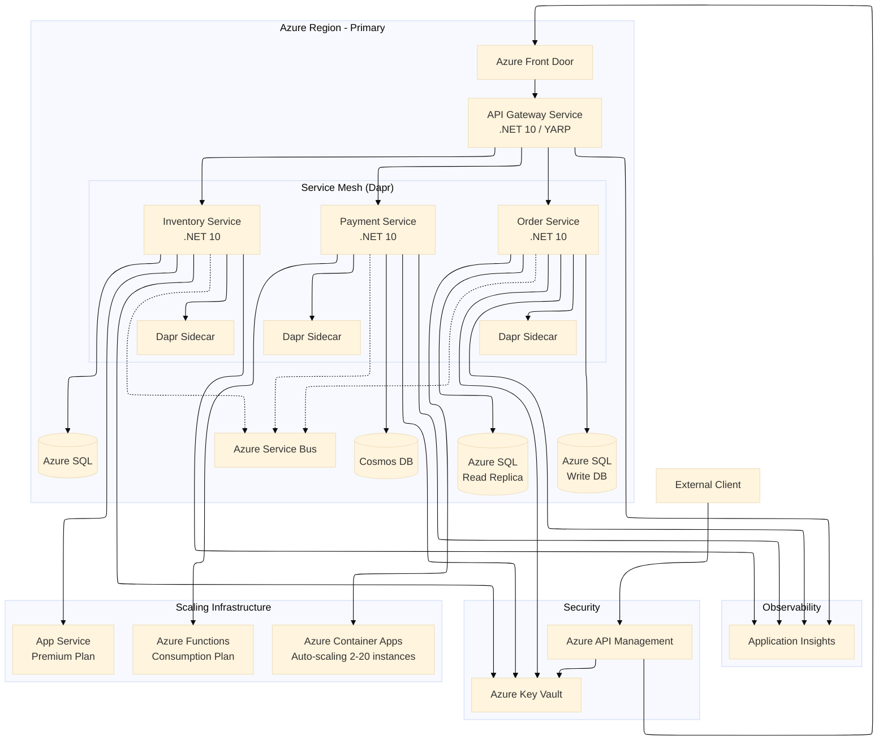
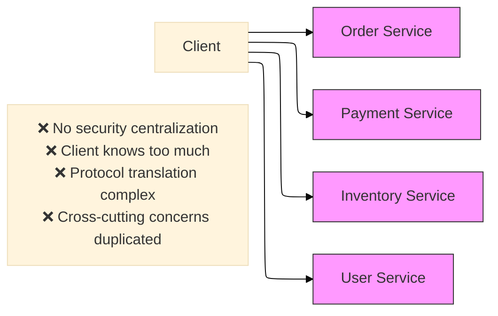
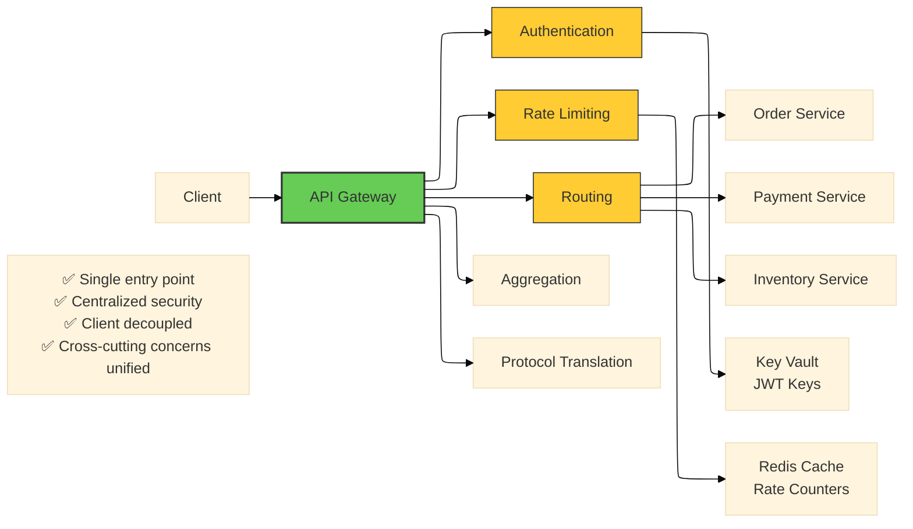
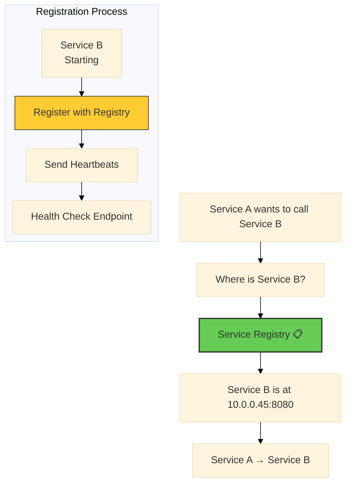
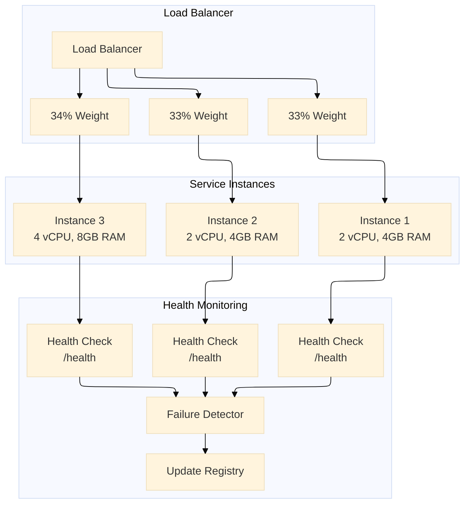
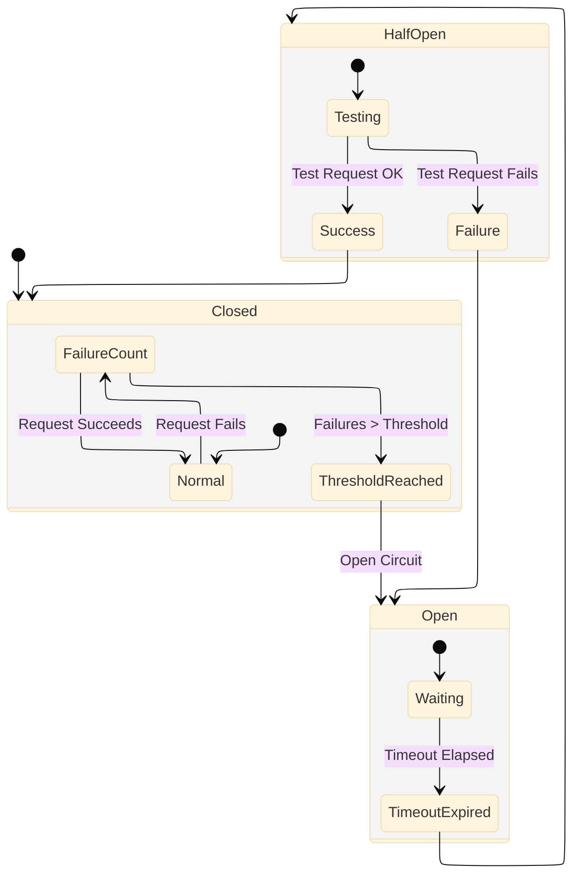
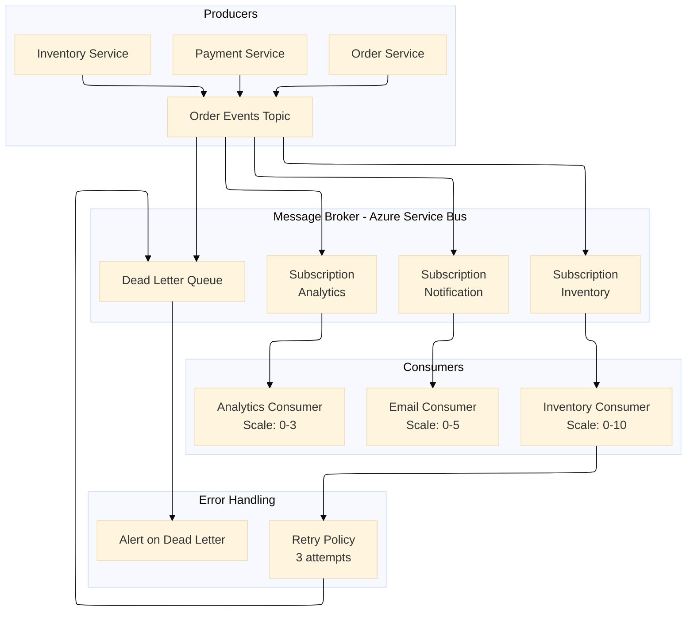

# 10 Essential Microservices Architecture Patterns: A Professional Reference Architecture with .NET 10 and Azure - Part 1
### Enterprise-Grade Microservices Architecture Implementation Guide for Cloud-Native Systems with Azure


## Introduction

The journey from monolithic applications to microservices is paved with both opportunity and complexity. After architecting distributed systems for Fortune 500 companies over the past decade, I've learned that success isn't about adopting every pattern—it's about understanding which patterns solve specific problems and implementing them correctly.

This reference architecture presents ten fundamental microservices patterns that form the backbone of any resilient, scalable cloud-native system. Each pattern is examined through the lens of enterprise requirements including scalability, resilience, security, and maintainability.

**What makes this guide different:** Every pattern includes production-ready .NET 10 code implementing SOLID principles, proper dependency injection, Azure Key Vault integration for security, and comprehensive observability. The architecture is designed to handle real-world scenarios—from handling millions of requests to recovering from catastrophic failures.

### Series Structure

This guide is split into two parts for easier consumption:

**Part 1 (This Document):** Covers the first five foundational patterns—API Gateway, Service Discovery, Load Balancing, Circuit Breaker, and Event-Driven Communication. These patterns establish the core communication and resilience layer of your microservices architecture.

**Part 2:** Covers the remaining five advanced patterns—CQRS, Saga Pattern, Service Mesh, Distributed Tracing, and Containerization. These patterns address complex distributed data management, observability, and operational concerns.

Each part includes complete architectural diagrams, design pattern explanations, SOLID principle applications, and production-ready .NET 10 implementations with Azure services.

### The Patterns We'll Master

**Part 1: Foundational Communication Patterns**

1.  **API Gateway** - The single entry point that protects and routes all client requests
2.  **Service Discovery** - How services find each other in a dynamic cloud environment
3.  **Load Balancing** - Distributing traffic for optimal performance and reliability
4.  **Circuit Breaker** - Preventing cascading failures when dependencies fail
5.  **Event-Driven Communication** - Asynchronous, decoupled service interaction

**Part 2: Advanced Data & Operational Patterns**

6.  **CQRS** - Separating read and write models for optimal performance
7.  **Saga Pattern** - Managing distributed transactions with compensation
8.  **Service Mesh** - Offloading cross-cutting concerns to the infrastructure layer
9.  **Distributed Tracing** - Following requests across service boundaries
10.  **Containerization** - Packaging and deploying consistently anywhere

---

## System Architecture Overview

Before diving into individual patterns, let's understand how all the pieces fit together in our reference implementation.

### High-Level Architecture



### Technology Stack Summary

| Component | Technology | Justification |
| --- | --- | --- |
| **Runtime** | .NET 10 | Native AOT, minimal APIs, enhanced performance, improved memory management |
| **ORM** | EF Core 10 | Compiled models, bulk updates, query splitting, JSON columns support |
| **API Gateway** | YARP + Azure APIM | Flexibility of custom code + managed service benefits with enterprise features |
| **Service Mesh** | Dapr on ACA | Language-agnostic, built-in patterns, mTLS, observability without code changes |
| **Secrets** | Azure Key Vault | HSM-backed, managed identities, automatic rotation, audit logging |
| **Database** | Azure SQL + Cosmos DB | Polyglot persistence per service need with optimal performance characteristics |
| **Messaging** | Azure Service Bus | Enterprise-grade, sessions, dead-lettering, duplicate detection, partitioning |
| **Container** | Docker + ACR | Secure, private registry with vulnerability scanning, geo-replication |
| **Monitoring** | Application Insights | Distributed tracing, metric collection, log analytics, smart detection |
| **Compute** | Container Apps + Functions | Flexible scaling options based on workload characteristics |

### Design Principles Applied Throughout

*   **Single Responsibility Principle**: Each microservice owns its domain and does one thing well
*   **Open/Closed Principle**: Services extensible via events and configuration, not code modification
*   **Liskov Substitution**: Consistent service interfaces allow component swapping
*   **Interface Segregation**: Client-specific interfaces prevent unnecessary dependencies
*   **Dependency Inversion**: Abstractions depend on abstractions, not concretions
*   **Domain-Driven Design**: Bounded contexts ensure clean domain boundaries
*   **Infrastructure as Code**: All resources defined in Bicep for repeatability
*   **Security by Design**: Zero-trust principles with mTLS and managed identities

---

# Part 1: Foundational Communication Patterns

---

## Pattern 1: API Gateway

### Concept Overview

The API Gateway pattern addresses a fundamental challenge in microservices architecture: how do clients interact with dozens of fine-grained services without knowing their locations or implementation details?

**Definition:** An API Gateway is a service that acts as the single entry point for all client requests. It routes requests to appropriate microservices, handles cross-cutting concerns like authentication, rate limiting, and caching, and can aggregate responses from multiple services.

**Why it's essential:**

*   Without a gateway, clients must know the location of every service
*   Security becomes decentralized and harder to manage
*   Cross-cutting concerns are duplicated across services
*   Protocol translation becomes complex
*   Client applications become tightly coupled to backend services

**Real-world analogy:** Think of API Gateway as the reception desk in a large office building. Visitors don't need to know where specific employees sit—they go to reception, get authenticated, receive directions, and are routed appropriately. The receptionist handles security, visitor logs, and can even provide information without bothering the employees.

### The Problem It Solves



**The solution architecture:**



### Azure Implementation Options

| Option | Best For | Scaling | Cost Model | Features |
| --- | --- | --- | --- | --- |
| **Azure API Management** | Enterprise APIs with developer portal | Auto-scale with premium tier | Consumption/Developer/Standard/Premium | Developer portal, analytics, policies, caching |
| **Azure Application Gateway** | Layer 7 load balancing + WAF | Auto-scaling available | Per hour + data processed | WAF, SSL termination, cookie affinity |
| **Azure Front Door** | Global HTTP load balancing | Global auto-scaling | Per request + outbound data | Global routing, acceleration, CDN |
| **Custom YARP in App Service** | Full control, simple needs | App Service scaling | App Service cost only | Full code control, customization |

### Design Patterns Applied

*   **Facade Pattern**: The gateway provides a simplified interface to the complex subsystem of microservices
*   **Proxy Pattern**: The gateway forwards requests while adding functionality
*   **Chain of Responsibility**: Multiple middleware components process requests in sequence
*   **Strategy Pattern**: Different routing strategies based on request characteristics
*   **Factory Pattern**: Creating appropriate client instances for downstream services
*   **Decorator Pattern**: Adding cross-cutting concerns without modifying core logic

### SOLID Principles Implementation

**Interface Segregation - Separate Gateway Concerns**

```
// IGatewayRouter.cs - Single Responsibility for routing
public interface IGatewayRouter
{
    Task<RouteResult> RouteRequestAsync(HttpContext context);
    void RegisterRoute(string path, string destinationService);
}

// IAuthenticationHandler.cs - Single Responsibility for auth
public interface IAuthenticationHandler
{
    Task<AuthenticationResult> AuthenticateAsync(HttpRequest request);
    Task<TokenValidationResult> ValidateTokenAsync(string token);
}

// IRateLimiter.cs - Single Responsibility for rate limiting
public interface IRateLimiter
{
    Task<bool> IsRequestAllowedAsync(string clientId, string endpoint);
    Task<RateLimitHeaders> GetRateLimitHeadersAsync(string clientId);
}

// IGatewayTransform.cs - Open/Closed for transformations
public interface IGatewayTransform
{
    Task<HttpRequestMessage> TransformRequestAsync(HttpRequest originalRequest);
    Task<HttpResponseMessage> TransformResponseAsync(HttpResponseMessage serviceResponse);
}
```

**Dependency Injection Configuration with Key Vault**

```
// Program.cs - API Gateway DI Container Setup
var builder = WebApplication.CreateBuilder(args);

// Azure Key Vault Integration - Secrets never in code
builder.Configuration.AddAzureKeyVault(
    new Uri(builder.Configuration["KeyVault:Uri"]),
    new DefaultAzureCredential());

// Register services with appropriate lifetimes
builder.Services.AddSingleton<IGatewayRouter, YarpGatewayRouter>();
builder.Services.AddScoped<IAuthenticationHandler, JwtAuthenticationHandler>();
builder.Services.AddSingleton<IRateLimiter, RedisRateLimiter>();
builder.Services.AddTransient<IGatewayTransform, DefaultGatewayTransform>();

// Decorator pattern for logging - wraps existing implementation
builder.Services.Decorate<IAuthenticationHandler, LoggingAuthenticationHandler>();

// Factory pattern for client creation
builder.Services.AddSingleton<IGatewayClientFactory, GatewayClientFactory>();

// Options pattern for configuration - strongly typed settings
builder.Services.Configure<GatewayOptions>(
    builder.Configuration.GetSection("Gateway"));

// Health checks for all downstream services
builder.Services.AddHealthChecks()
    .AddUrlGroup(new Uri("https://orders-api/health"), "orders")
    .AddUrlGroup(new Uri("https://payment-api/health"), "payment")
    .AddUrlGroup(new Uri("https://inventory-api/health"), "inventory");

var app = builder.Build();
```

**Complete Gateway Implementation**

```
// ApiGateway.cs - Main gateway orchestrator
public class ApiGateway
{
    private readonly IGatewayRouter _router;
    private readonly IAuthenticationHandler _authHandler;
    private readonly IRateLimiter _rateLimiter;
    private readonly IEnumerable<IGatewayTransform> _transforms;
    private readonly ILogger<ApiGateway> _logger;
    private readonly IGatewayClientFactory _clientFactory;
    
    public ApiGateway(
        IGatewayRouter router,
        IAuthenticationHandler authHandler,
        IRateLimiter rateLimiter,
        IEnumerable<IGatewayTransform> transforms,
        ILogger<ApiGateway> logger,
        IGatewayClientFactory clientFactory)
    {
        _router = router;
        _authHandler = authHandler;
        _rateLimiter = rateLimiter;
        _transforms = transforms;
        _logger = logger;
        _clientFactory = clientFactory;
    }
    
    public async Task HandleRequestAsync(HttpContext context)
    {
        // 1. Extract client identifier (Strategy pattern)
        var clientId = ExtractClientId(context.Request);
        
        // 2. Rate limiting (Chain of Responsibility start)
        if (!await _rateLimiter.IsRequestAllowedAsync(clientId, context.Request.Path))
        {
            context.Response.StatusCode = 429;
            await context.Response.WriteAsJsonAsync(new 
            { 
                error = "Rate limit exceeded",
                retryAfter = await _rateLimiter.GetRetryAfterAsync(clientId)
            });
            return;
        }
        
        // 3. Authentication
        var authResult = await _authHandler.AuthenticateAsync(context.Request);
        if (!authResult.IsAuthenticated)
        {
            context.Response.StatusCode = 401;
            return;
        }
        
        // 4. Routing (Strategy pattern)
        var route = await _router.RouteRequestAsync(context);
        if (!route.Found)
        {
            context.Response.StatusCode = 404;
            return;
        }
        
        // 5. Request transformation (Chain of Responsibility)
        var requestMessage = context.Request;
        foreach (var transform in _transforms)
        {
            requestMessage = await transform.TransformRequestAsync(requestMessage);
        }
        
        // 6. Forward to service (Factory pattern)
        var client = _clientFactory.CreateClient(route.ServiceName);
        var response = await client.SendAsync(requestMessage);
        
        // 7. Response transformation
        foreach (var transform in _transforms.Reverse())
        {
            response = await transform.TransformResponseAsync(response);
        }
        
        // 8. Write response
        context.Response.StatusCode = (int)response.StatusCode;
        await response.Content.CopyToAsync(context.Response.Body);
        
        // 9. Log for observability
        _logger.LogInformation("Request {Method} {Path} -> {Service} returned {StatusCode}",
            context.Request.Method, context.Request.Path, route.ServiceName, response.StatusCode);
    }
    
    private string ExtractClientId(HttpRequest request)
    {
        // Strategy: Extract from JWT, API key, or IP with fallback
        return request.Headers["X-Client-ID"].FirstOrDefault() 
               ?? request.Headers["Authorization"].FirstOrDefault()?.Split('.').First() 
               ?? request.HttpContext.Connection.RemoteIpAddress?.ToString() 
               ?? "anonymous";
    }
}
```

### Configuration Examples

**YARP Reverse Proxy Configuration:**

```
{
  "AzureAd": {
    "Instance": "https://login.microsoftonline.com/",
    "Domain": "contoso.onmicrosoft.com",
    "TenantId": "your-tenant-id",
    "ClientId": "your-gateway-client-id"
  },
  "ReverseProxy": {
    "Routes": {
      "orders": {
        "ClusterId": "orders-cluster",
        "Match": {
          "Path": "/api/orders/{**catch-all}"
        },
        "Transforms": [
          { "PathPattern": "/orders/{**catch-all}" },
          { "RequestHeadersCopy": "true" }
        ]
      },
      "payments": {
        "ClusterId": "payments-cluster",
        "Match": {
          "Path": "/api/payments/{**catch-all}"
        }
      }
    },
    "Clusters": {
      "orders-cluster": {
        "Destinations": {
          "order-service-1": {
            "Address": "https://orders-api.azurewebsites.net/"
          },
          "order-service-2": {
            "Address": "https://orders-api-2.azurewebsites.net/"
          }
        },
        "LoadBalancingPolicy": "PowerOfTwoChoices"
      }
    }
  },
  "RateLimiting": {
    "DefaultLimit": 100,
    "DefaultWindow": "00:01:00",
    "Endpoints": {
      "/api/orders": { "Limit": 50, "Window": "00:01:00" },
      "/api/payments": { "Limit": 30, "Window": "00:01:00" }
    }
  }
}
```

**Azure API Management Policy:**

```xml
<policies>
    <inbound>
        <base />
        <!-- JWT Validation with Azure AD -->
        <validate-jwt header-name="Authorization" failed-validation-httpcode="401">
            <openid-config url="https://login.microsoftonline.com/{tenant}/v2.0/.well-known/openid-configuration" />
            <audiences>
                <audience>api://{api-id}</audience>
            </audiences>
            <issuers>
                <issuer>https://sts.windows.net/{tenant-id}/</issuer>
            </issuers>
        </validate-jwt>
        
        <!-- Rate Limiting -->
        <rate-limit calls="100" renewal-period="60" />
        
        <!-- CORS -->
        <cors allow-credentials="true">
            <allowed-origins>
                <origin>https://app.contoso.com</origin>
                <origin>https://admin.contoso.com</origin>
            </allowed-origins>
            <allowed-methods>
                <method>GET</method>
                <method>POST</method>
                <method>PUT</method>
                <method>DELETE</method>
            </allowed-methods>
            <allowed-headers>
                <header>authorization</header>
                <header>content-type</header>
                <header>x-request-id</header>
                <header>x-correlation-id</header>
            </allowed-headers>
        </cors>
        
        <!-- Route to backend -->
        <set-backend-service base-url="https://${backend}.azurewebsites.net" />
        
        <!-- Add headers for downstream services -->
        <set-header name="X-Forwarded-For" exists-action="override">
            <value>@(context.Request.IpAddress)</value>
        </set-header>
        <set-header name="X-Correlation-ID" exists-action="override">
            <value>@(Guid.NewGuid())</value>
        </set-header>
    </inbound>
    <outbound>
        <base />
        <!-- Remove sensitive headers -->
        <set-header name="X-Powered-By" exists-action="delete" />
    </outbound>
</policies>
```

### Key Takeaways

*   **API Gateway centralizes cross-cutting concerns** - Security, rate limiting, and routing in one place
*   **Multiple implementation options** - Choose between managed services (APIM) or custom code (YARP) based on requirements
*   **SOLID principles ensure maintainability** - Each concern has its own interface and implementation
*   **Key Vault integration keeps secrets secure** - No connection strings or keys in configuration files
*   **Observability built-in** - Every request is logged and traced for debugging

---

## Pattern 2: Service Discovery

### Concept Overview

In a dynamic cloud environment, services are constantly changing—they scale up, scale down, fail, recover, and move. Service discovery solves the fundamental problem of how services find each other without hardcoded locations.

**Definition:** Service discovery is a pattern that enables services to dynamically locate and communicate with each other without hardcoded network locations. It maintains a registry of available service instances and their current network addresses.

**Why it's essential:**

*   Cloud environments are dynamic—IP addresses change constantly
*   Manual configuration doesn't scale beyond a few services
*   Load balancers need to know healthy instances
*   Clients shouldn't be responsible for location management
*   Zero-downtime deployments require dynamic routing

**Real-world analogy:** Service discovery is like a GPS navigation system. You don't need to know the exact coordinates of your destination—you just know the name, and the GPS finds the current location and directions. If the destination moves (like a food truck), the GPS updates automatically.

### The Problem It Solves

**Without service discovery (The Old Way):**

```
// ❌ This will break when services scale or move
var client = new HttpClient();
client.BaseAddress = new Uri("http://10.0.0.12:8080"); // Fixed IP? Good luck!
```

**With service discovery:**



### Azure Implementation Matrix

| Service | Discovery Mechanism | Use Case | Registration Method |
| --- | --- | --- | --- |
| **Azure Container Apps** | Internal DNS + Dapr | Containerized microservices | Automatic via environment |
| **App Service with VNet** | Private endpoints | Web apps in VNet | Manual via DNS |
| **AKS** | K8s DNS + Headless services | Complex orchestration | Automatic via K8s API |
| **Azure Traffic Manager** | DNS routing | Global distribution | Manual configuration |
| **Azure Front Door** | Global load balancing | CDN + routing | Manual backend config |

### Design Patterns Applied

*   **Registry Pattern**: Centralized store of service locations
*   **Heartbeat Pattern**: Services send periodic signals to indicate health
*   **Observer Pattern**: Clients are notified of registry changes
*   **Cache-Aside Pattern**: Local caching of registry entries for performance
*   **Strategy Pattern**: Different discovery strategies for different scenarios
*   **Proxy Pattern**: Client-side discovery proxy

### SOLID Principles Implementation

**Service Registry Interface - Single Responsibility**

```
// IServiceRegistry.cs
public interface IServiceRegistry
{
    Task RegisterInstanceAsync(ServiceInstance instance, CancellationToken cancellationToken = default);
    Task DeregisterInstanceAsync(string serviceId, string instanceId, CancellationToken cancellationToken = default);
    Task<IEnumerable<ServiceInstance>> GetInstancesAsync(string serviceName, CancellationToken cancellationToken = default);
    Task<ServiceInstance> GetInstanceAsync(string serviceName, DiscoveryStrategy strategy = DiscoveryStrategy.RoundRobin, CancellationToken cancellationToken = default);
    Task HeartbeatAsync(string serviceId, string instanceId, CancellationToken cancellationToken = default);
    Task MarkUnhealthyAsync(string serviceId, string instanceId, string reason, CancellationToken cancellationToken = default);
}

public enum DiscoveryStrategy
{
    RoundRobin,
    Random,
    LeastLoaded,
    Sticky,
    LatencyBased
}

public class ServiceInstance
{
    public string ServiceId { get; set; }
    public string InstanceId { get; set; }
    public string ServiceName { get; set; }
    public Uri Uri { get; set; }
    public IReadOnlyDictionary<string, string> Metadata { get; set; }
    public ServiceHealthStatus HealthStatus { get; set; }
    public DateTime LastHeartbeat { get; set; }
    public DateTime RegisteredAt { get; set; }
    public int CurrentLoad { get; set; }
    public string Version { get; set; }
    public string[] Tags { get; set; }
    public int Weight { get; set; } = 100; // For weighted load balancing
    public string Zone { get; set; } // Availability zone
}

public enum ServiceHealthStatus
{
    Healthy,
    Unhealthy,
    Draining, // Receiving no new requests
    Unknown
}
```

**Azure Container Apps Implementation**

```
// AzureContainerAppsRegistry.cs
public class AzureContainerAppsRegistry : IServiceRegistry
{
    private readonly IConfiguration _configuration;
    private readonly IMemoryCache _cache;
    private readonly ILogger<AzureContainerAppsRegistry> _logger;
    private readonly HttpClient _httpClient;
    private readonly ConcurrentDictionary<string, List<ServiceInstance>> _localRegistry;
    private readonly ConcurrentDictionary<string, InstanceStats> _stats;
    
    public AzureContainerAppsRegistry(
        IConfiguration configuration,
        IMemoryCache cache,
        ILogger<AzureContainerAppsRegistry> logger,
        IHttpClientFactory httpClientFactory)
    {
        _configuration = configuration;
        _cache = cache;
        _logger = logger;
        _httpClient = httpClientFactory.CreateClient("service-discovery");
        _localRegistry = new ConcurrentDictionary<string, List<ServiceInstance>>();
        _stats = new ConcurrentDictionary<string, InstanceStats>();
        
        // Start background health checker
        Task.Run(HealthCheckLoopAsync);
    }
    
    public async Task RegisterInstanceAsync(ServiceInstance instance, CancellationToken cancellationToken)
    {
        // In ACA, instances register via environment variables
        var environment = _configuration["AZURE_ENVIRONMENT_NAME"];
        var location = _configuration["AZURE_LOCATION"];
        
        // Construct the internal DNS name
        instance.Uri = new Uri($"http://{instance.ServiceName}.internal.{location}.azurecontainerapps.io");
        instance.RegisteredAt = DateTime.UtcNow;
        instance.LastHeartbeat = DateTime.UtcNow;
        
        _localRegistry.AddOrUpdate(
            instance.ServiceName,
            new List<ServiceInstance> { instance },
            (key, existing) =>
            {
                existing.RemoveAll(i => i.InstanceId == instance.InstanceId);
                existing.Add(instance);
                return existing;
            });
        
        _logger.LogInformation("Registered instance {InstanceId} for service {ServiceName} at {Uri}", 
            instance.InstanceId, instance.ServiceName, instance.Uri);
    }
    
    public async Task<ServiceInstance> GetInstanceAsync(
        string serviceName, 
        DiscoveryStrategy strategy = DiscoveryStrategy.RoundRobin,
        CancellationToken cancellationToken = default)
    {
        var cacheKey = $"discovery_{serviceName}_{strategy}";
        
        var instances = await _cache.GetOrCreateAsync(cacheKey, async entry =>
        {
            entry.AbsoluteExpirationRelativeToNow = TimeSpan.FromSeconds(30);
            
            // Try local registry first (instances that registered directly)
            if (_localRegistry.TryGetValue(serviceName, out var localInstances))
            {
                var healthy = localInstances
                    .Where(i => i.HealthStatus == ServiceHealthStatus.Healthy)
                    .ToList();
                    
                if (healthy.Any())
                    return healthy;
            }
            
            // Fallback to Azure DNS discovery
            return await DiscoverFromDnsAsync(serviceName, cancellationToken);
        });
        
        if (instances == null || !instances.Any())
            throw new ServiceNotFoundException(serviceName);
        
        return SelectInstanceByStrategy(instances, strategy);
    }
    
    private ServiceInstance SelectInstanceByStrategy(
        List<ServiceInstance> instances, 
        DiscoveryStrategy strategy)
    {
        return strategy switch
        {
            DiscoveryStrategy.RoundRobin => SelectRoundRobin(instances),
            DiscoveryStrategy.Random => instances[Random.Shared.Next(instances.Count)],
            DiscoveryStrategy.LeastLoaded => SelectLeastLoaded(instances),
            DiscoveryStrategy.LatencyBased => SelectLatencyBased(instances),
            DiscoveryStrategy.Sticky => SelectSticky(instances),
            _ => instances.First()
        };
    }
    
    private static readonly ConcurrentDictionary<string, int> _roundRobinCounters = new();
    
    private ServiceInstance SelectRoundRobin(List<ServiceInstance> instances)
    {
        var serviceName = instances.First().ServiceName;
        var counter = _roundRobinCounters.AddOrUpdate(
            serviceName,
            1,
            (_, value) => (value + 1) % instances.Count);
            
        var selected = instances[counter];
        UpdateStats(selected.InstanceId, "selected");
        return selected;
    }
    
    private ServiceInstance SelectLeastLoaded(List<ServiceInstance> instances)
    {
        var selected = instances
            .OrderBy(i => _stats.TryGetValue(i.InstanceId, out var stats) ? stats.CurrentLoad : 0)
            .First();
            
        UpdateStats(selected.InstanceId, "load_selected");
        return selected;
    }
    
    private ServiceInstance SelectLatencyBased(List<ServiceInstance> instances)
    {
        var selected = instances
            .OrderBy(i => _stats.TryGetValue(i.InstanceId, out var stats) ? stats.AverageLatency : double.MaxValue)
            .First();
            
        return selected;
    }
    
    private ServiceInstance SelectSticky(List<ServiceInstance> instances)
    {
        // Get client identifier from context
        var httpContextAccessor = ServiceLocator.GetService<IHttpContextAccessor>();
        var clientId = httpContextAccessor.HttpContext?.Request.Headers["X-Client-ID"].FirstOrDefault() 
                      ?? "default";
        
        var hash = Math.Abs(clientId.GetHashCode());
        var index = hash % instances.Count;
        
        return instances[index];
    }
    
    private void UpdateStats(string instanceId, string operation)
    {
        var stats = _stats.GetOrAdd(instanceId, _ => new InstanceStats());
        stats.RequestCount++;
        stats.LastUsed = DateTime.UtcNow;
        
        // Track operation type for metrics
        if (operation == "selected")
            stats.SelectionCount++;
    }
    
    private async Task<List<ServiceInstance>> DiscoverFromDnsAsync(string serviceName, CancellationToken cancellationToken)
    {
        // In ACA, services are discoverable via internal DNS
        var location = _configuration["AZURE_LOCATION"];
        var domain = $"internal.{location}.azurecontainerapps.io";
        var fullDomain = $"{serviceName}.{domain}";
        
        try
        {
            // DNS SRV record lookup
            var entries = await Dns.GetHostEntryAsync(fullDomain);
            
            return entries.AddressList.Select((ip, index) => new ServiceInstance
            {
                ServiceName = serviceName,
                InstanceId = $"{serviceName}-{index}-{Guid.NewGuid():N}",
                Uri = new Uri($"http://{ip}:8080"),
                HealthStatus = ServiceHealthStatus.Healthy,
                LastHeartbeat = DateTime.UtcNow,
                RegisteredAt = DateTime.UtcNow,
                Zone = "default"
            }).ToList();
        }
        catch (Exception ex)
        {
            _logger.LogWarning(ex, "DNS discovery failed for {ServiceName}", serviceName);
            return new List<ServiceInstance>();
        }
    }
    
    private async Task HealthCheckLoopAsync()
    {
        while (true)
        {
            try
            {
                foreach (var (serviceName, instances) in _localRegistry)
                {
                    foreach (var instance in instances.ToList())
                    {
                        var isHealthy = await PingInstanceAsync(instance);
                        
                        if (!isHealthy && instance.HealthStatus == ServiceHealthStatus.Healthy)
                        {
                            instance.HealthStatus = ServiceHealthStatus.Unhealthy;
                            _logger.LogWarning("Instance {InstanceId} for {ServiceName} marked unhealthy", 
                                instance.InstanceId, serviceName);
                        }
                        else if (isHealthy && instance.HealthStatus != ServiceHealthStatus.Healthy)
                        {
                            instance.HealthStatus = ServiceHealthStatus.Healthy;
                            _logger.LogInformation("Instance {InstanceId} for {ServiceName} recovered", 
                                instance.InstanceId, serviceName);
                        }
                        
                        // Update stats
                        if (_stats.TryGetValue(instance.InstanceId, out var stats))
                        {
                            stats.LastHealthCheck = DateTime.UtcNow;
                            stats.HealthStatus = instance.HealthStatus;
                        }
                    }
                }
            }
            catch (Exception ex)
            {
                _logger.LogError(ex, "Health check loop error");
            }
            
            await Task.Delay(TimeSpan.FromSeconds(10));
        }
    }
    
    private async Task<bool> PingInstanceAsync(ServiceInstance instance)
    {
        try
        {
            using var cts = new CancellationTokenSource(TimeSpan.FromSeconds(3));
            var stopwatch = Stopwatch.StartNew();
            
            var response = await _httpClient.GetAsync($"{instance.Uri}/health", cts.Token);
            
            stopwatch.Stop();
            
            // Update latency stats
            if (_stats.TryGetValue(instance.InstanceId, out var stats))
            {
                stats.AverageLatency = (stats.AverageLatency * 0.7) + (stopwatch.ElapsedMilliseconds * 0.3);
            }
            
            return response.IsSuccessStatusCode;
        }
        catch
        {
            return false;
        }
    }
    
    private class InstanceStats
    {
        public int RequestCount { get; set; }
        public int SelectionCount { get; set; }
        public int CurrentLoad { get; set; }
        public double AverageLatency { get; set; }
        public DateTime LastUsed { get; set; }
        public DateTime LastHealthCheck { get; set; }
        public ServiceHealthStatus HealthStatus { get; set; }
    }
}
```

**Client-Side Discovery with Dependency Injection**

```
// ServiceDiscoveryExtensions.cs
public static class ServiceDiscoveryExtensions
{
    public static IServiceCollection AddServiceDiscovery(
        this IServiceCollection services,
        Action<ServiceDiscoveryOptions> configureOptions = null)
    {
        var options = new ServiceDiscoveryOptions();
        configureOptions?.Invoke(options);
        
        services.AddSingleton(options);
        services.AddSingleton<IServiceRegistry, AzureContainerAppsRegistry>();
        services.AddMemoryCache();
        
        // Factory pattern for service clients
        services.AddSingleton<IServiceClientFactory, ServiceClientFactory>();
        
        // Interceptor pattern for automatic discovery
        services.AddTransient<DiscoveryDelegatingHandler>();
        
        // Configure HTTP clients with discovery
        services.AddHttpClient("discovery-client")
            .AddHttpMessageHandler<DiscoveryDelegatingHandler>()
            .AddPolicyHandler(GetRetryPolicy())
            .AddCircuitBreakerPolicy();
        
        return services;
    }
    
    private static IAsyncPolicy<HttpResponseMessage> GetRetryPolicy()
    {
        return HttpPolicyExtensions
            .HandleTransientHttpError()
            .WaitAndRetryAsync(3, retryAttempt => 
                TimeSpan.FromSeconds(Math.Pow(2, retryAttempt)));
    }
}

// DiscoveryDelegatingHandler.cs
public class DiscoveryDelegatingHandler : DelegatingHandler
{
    private readonly IServiceRegistry _registry;
    private readonly ILogger<DiscoveryDelegatingHandler> _logger;
    private readonly DiscoveryStrategy _strategy;
    
    public DiscoveryDelegatingHandler(
        IServiceRegistry registry,
        IConfiguration configuration,
        ILogger<DiscoveryDelegatingHandler> logger)
    {
        _registry = registry;
        _logger = logger;
        _strategy = configuration.GetValue<DiscoveryStrategy>("Discovery:Strategy", DiscoveryStrategy.RoundRobin);
    }
    
    protected override async Task<HttpResponseMessage> SendAsync(
        HttpRequestMessage request, 
        CancellationToken cancellationToken)
    {
        // Extract service name from request
        var serviceName = ExtractServiceName(request);
        
        // Discover service instance
        var instance = await _registry.GetInstanceAsync(serviceName, _strategy, cancellationToken);
        
        // Rewrite URL to target instance
        var originalUri = request.RequestUri;
        var newUri = new Uri(instance.Uri, originalUri.PathAndQuery);
        request.RequestUri = newUri;
        
        // Add instance info to headers for debugging
        request.Headers.Add("X-Service-Instance", instance.InstanceId);
        
        _logger.LogDebug("Routing request to {InstanceUri} for service {ServiceName}", 
            newUri, serviceName);
        
        try
        {
            var response = await base.SendAsync(request, cancellationToken);
            
            // Report success/failure for load balancing decisions
            if (!response.IsSuccessStatusCode)
            {
                await _registry.MarkUnhealthyAsync(serviceName, instance.InstanceId, 
                    $"HTTP {(int)response.StatusCode}", cancellationToken);
            }
            
            return response;
        }
        catch (Exception ex)
        {
            await _registry.MarkUnhealthyAsync(serviceName, instance.InstanceId, 
                ex.Message, cancellationToken);
            throw;
        }
    }
    
    private string ExtractServiceName(HttpRequestMessage request)
    {
        // Extract from headers or URL
        if (request.Headers.TryGetValues("X-Service-Name", out var values))
            return values.First();
            
        // Default: use first part of hostname
        return request.RequestUri.Host.Split('.')[0];
    }
}
```

### Configuration

```
{
  "Discovery": {
    "Strategy": "LeastLoaded",
    "CacheDurationSeconds": 30,
    "HealthCheckIntervalSeconds": 10,
    "UnhealthyThreshold": 3,
    "RecoveryThreshold": 2
  },
  "Azure": {
    "Location": "eastus",
    "EnvironmentName": "production"
  }
}
```

### Key Takeaways

*   **Dynamic discovery is essential for cloud-native apps** - Services come and go; discovery handles it automatically
*   **Multiple strategies for different needs** - Choose based on workload characteristics
*   **Caching prevents registry overload** - Local cache with expiration reduces calls to registry
*   **Health checking ensures reliability** - Unhealthy instances are automatically removed
*   **Client-side discovery scales better** - No central load balancer bottleneck

---

## Pattern 3: Load Balancing

### Concept Overview

Load balancing is the art of distributing incoming requests across multiple instances of a service to ensure optimal resource utilization, maximum throughput, and minimal response time.

**Definition:** Load balancing distributes network traffic across multiple servers to ensure no single server bears too much demand. It improves responsiveness and availability by spreading requests across available resources.

**Why it's essential:**

*   Prevents any single instance from becoming a bottleneck
*   Provides redundancy when instances fail
*   Enables horizontal scaling
*   Improves user experience through faster response times
*   Allows maintenance without downtime

**Real-world analogy:** Imagine 10,000 customers entering a store with 10 checkout counters. Without load balancing, everyone queues at the first counter. With load balancing, a greeter directs customers to the shortest line, ensuring all counters are utilized efficiently.

### Visual Distribution



### Azure Load Balancing Options

| Option | Layer | Algorithm | Session Affinity | Global | WAF | SSL Offload |
| --- | --- | --- | --- | --- | --- | --- |
| **Azure Load Balancer** | L4 | Hash, Round Robin | Source IP | No | No | No |
| **Application Gateway** | L7 | Round Robin, Weighted | Cookie | No | Yes | Yes |
| **Azure Front Door** | L7 | Latency, Priority, Weighted | Cookie | Yes | Yes | Yes |
| **Traffic Manager** | DNS | Performance, Priority, Weighted | None | Yes | No | No |
| **Container Apps** | L7 | Automatic, weighted revisions | Auto | Regional | No | Yes |

### Design Patterns Applied

*   **Strategy Pattern**: Pluggable load balancing algorithms
*   **Decorator Pattern**: Add retry and circuit breaking to load balancing
*   **Observer Pattern**: Health monitoring and instance state changes
*   **Factory Pattern**: Create load balancer instances based on configuration
*   **Proxy Pattern**: Client-side load balancing proxy
*   **Weighted Random Pattern**: Distribute based on instance capacity

### SOLID Principles Implementation

**Interface Definition - Open/Closed Principle**

```
// ILoadBalancer.cs - Open for extension, closed for modification
public interface ILoadBalancer
{
    Task<ServiceInstance> GetNextInstanceAsync(string serviceName, CancellationToken cancellationToken = default);
    Task ReportFailureAsync(string serviceName, string instanceId, CancellationToken cancellationToken = default);
    Task ReportSuccessAsync(string serviceName, string instanceId, long responseTimeMs, CancellationToken cancellationToken = default);
    Task UpdateInstancesAsync(string serviceName, IEnumerable<ServiceInstance> instances, CancellationToken cancellationToken = default);
    Task<LoadBalancerMetrics> GetMetricsAsync(string serviceName, CancellationToken cancellationToken = default);
}

public class LoadBalancerMetrics
{
    public string ServiceName { get; set; }
    public int TotalRequests { get; set; }
    public int FailedRequests { get; set; }
    public double AverageResponseTime { get; set; }
    public Dictionary<string, InstanceMetrics> InstanceMetrics { get; set; }
}

public class InstanceMetrics
{
    public string InstanceId { get; set; }
    public int RequestsHandled { get; set; }
    public int Failures { get; set; }
    public double AverageResponseTime { get; set; }
    public DateTime LastRequest { get; set; }
    public bool IsHealthy { get; set; }
}
```

**Abstract Base Class with Common Functionality**

```
// LoadBalancerBase.cs
public abstract class LoadBalancerBase : ILoadBalancer
{
    protected readonly ILogger _logger;
    protected readonly ConcurrentDictionary<string, List<ServiceInstance>> _instances;
    protected readonly ConcurrentDictionary<string, InstanceStats> _stats;
    protected readonly IOptions<LoadBalancerOptions> _options;
    
    protected LoadBalancerBase(
        ILogger logger,
        IOptions<LoadBalancerOptions> options)
    {
        _logger = logger;
        _options = options;
        _instances = new ConcurrentDictionary<string, List<ServiceInstance>>();
        _stats = new ConcurrentDictionary<string, InstanceStats>();
    }
    
    public abstract Task<ServiceInstance> GetNextInstanceAsync(string serviceName, CancellationToken cancellationToken);
    
    public virtual async Task ReportFailureAsync(string serviceName, string instanceId, CancellationToken cancellationToken)
    {
        var stats = _stats.GetOrAdd(instanceId, _ => new InstanceStats());
        stats.FailureCount++;
        stats.LastFailure = DateTime.UtcNow;
        stats.ConsecutiveFailures++;
        
        // Circuit breaker logic - if too many consecutive failures, mark as unhealthy
        if (stats.ConsecutiveFailures >= _options.Value.UnhealthyThreshold)
        {
            await MarkInstanceUnhealthyAsync(serviceName, instanceId, 
                $"Too many consecutive failures: {stats.ConsecutiveFailures}", 
                cancellationToken);
        }
        
        _logger.LogWarning("Instance {InstanceId} reported failure. Consecutive failures: {Count}", 
            instanceId, stats.ConsecutiveFailures);
    }
    
    public virtual async Task ReportSuccessAsync(string serviceName, string instanceId, long responseTimeMs, CancellationToken cancellationToken)
    {
        var stats = _stats.GetOrAdd(instanceId, _ => new InstanceStats());
        stats.SuccessCount++;
        stats.ConsecutiveFailures = 0; // Reset on success
        stats.TotalResponseTime += responseTimeMs;
        stats.RequestCount++;
        stats.LastSuccess = DateTime.UtcNow;
        
        // Update moving average
        stats.AverageResponseTime = stats.TotalResponseTime / stats.RequestCount;
        
        // If instance was unhealthy but now succeeding, consider recovery
        if (stats.ConsecutiveSuccesses >= _options.Value.RecoveryThreshold)
        {
            await RecoverInstanceAsync(serviceName, instanceId, cancellationToken);
        }
    }
    
    public virtual Task UpdateInstancesAsync(string serviceName, IEnumerable<ServiceInstance> instances, CancellationToken cancellationToken)
    {
        var healthyInstances = instances
            .Where(i => i.HealthStatus == ServiceHealthStatus.Healthy)
            .ToList();
            
        _instances.AddOrUpdate(serviceName, healthyInstances, (_, __) => healthyInstances);
        
        _logger.LogInformation("Updated {Count} healthy instances for service {ServiceName}", 
            healthyInstances.Count, serviceName);
            
        return Task.CompletedTask;
    }
    
    public virtual async Task<LoadBalancerMetrics> GetMetricsAsync(string serviceName, CancellationToken cancellationToken)
    {
        if (!_instances.TryGetValue(serviceName, out var instances))
            return null;
            
        var metrics = new LoadBalancerMetrics
        {
            ServiceName = serviceName,
            InstanceMetrics = new Dictionary<string, InstanceMetrics>()
        };
        
        foreach (var instance in instances)
        {
            if (_stats.TryGetValue(instance.InstanceId, out var stats))
            {
                metrics.InstanceMetrics[instance.InstanceId] = new InstanceMetrics
                {
                    InstanceId = instance.InstanceId,
                    RequestsHandled = stats.RequestCount,
                    Failures = stats.FailureCount,
                    AverageResponseTime = stats.AverageResponseTime,
                    LastRequest = stats.LastRequest,
                    IsHealthy = instance.HealthStatus == ServiceHealthStatus.Healthy
                };
                
                metrics.TotalRequests += stats.RequestCount;
                metrics.FailedRequests += stats.FailureCount;
            }
        }
        
        metrics.AverageResponseTime = metrics.TotalRequests > 0 
            ? metrics.InstanceMetrics.Values.Average(m => m.AverageResponseTime) 
            : 0;
            
        return metrics;
    }
    
    protected virtual async Task MarkInstanceUnhealthyAsync(string serviceName, string instanceId, string reason, CancellationToken cancellationToken)
    {
        if (_instances.TryGetValue(serviceName, out var instances))
        {
            var instance = instances.FirstOrDefault(i => i.InstanceId == instanceId);
            if (instance != null)
            {
                instance.HealthStatus = ServiceHealthStatus.Unhealthy;
                _logger.LogWarning("Instance {InstanceId} marked unhealthy: {Reason}", instanceId, reason);
            }
        }
    }
    
    protected virtual async Task RecoverInstanceAsync(string serviceName, string instanceId, CancellationToken cancellationToken)
    {
        if (_instances.TryGetValue(serviceName, out var instances))
        {
            var instance = instances.FirstOrDefault(i => i.InstanceId == instanceId);
            if (instance != null && instance.HealthStatus == ServiceHealthStatus.Unhealthy)
            {
                instance.HealthStatus = ServiceHealthStatus.Healthy;
                _logger.LogInformation("Instance {InstanceId} recovered and marked healthy", instanceId);
            }
        }
    }
    
    protected class InstanceStats
    {
        public int RequestCount { get; set; }
        public int SuccessCount { get; set; }
        public int FailureCount { get; set; }
        public int ConsecutiveFailures { get; set; }
        public int ConsecutiveSuccesses { get; set; }
        public DateTime LastFailure { get; set; }
        public DateTime LastSuccess { get; set; }
        public DateTime LastRequest { get; set; }
        public double TotalResponseTime { get; set; }
        public double AverageResponseTime { get; set; }
    }
}
```

**Strategy Pattern Implementations**

```
// RoundRobinLoadBalancer.cs - With weighted distribution
public class RoundRobinLoadBalancer : LoadBalancerBase
{
    private readonly ConcurrentDictionary<string, int> _counters;
    
    public RoundRobinLoadBalancer(
        ILogger<RoundRobinLoadBalancer> logger,
        IOptions<LoadBalancerOptions> options) : base(logger, options)
    {
        _counters = new ConcurrentDictionary<string, int>();
    }
    
    public override async Task<ServiceInstance> GetNextInstanceAsync(string serviceName, CancellationToken cancellationToken)
    {
        if (!_instances.TryGetValue(serviceName, out var instances) || !instances.Any())
            throw new NoAvailableInstancesException(serviceName);
        
        var healthyInstances = instances
            .Where(i => i.HealthStatus == ServiceHealthStatus.Healthy)
            .ToList();
            
        if (!healthyInstances.Any())
            throw new NoHealthyInstancesException(serviceName);
        
        // Weighted round-robin based on instance weight
        var totalWeight = healthyInstances.Sum(i => i.Weight);
        var counter = _counters.AddOrUpdate(serviceName, 0, (_, val) => (val + 1) % totalWeight);
        
        var cumulative = 0;
        foreach (var instance in healthyInstances)
        {
            cumulative += instance.Weight;
            if (counter < cumulative)
            {
                UpdateStats(instance.InstanceId);
                return instance;
            }
        }
        
        // Fallback to simple round-robin
        var index = _counters.AddOrUpdate(serviceName, 0, (_, val) => (val + 1) % healthyInstances.Count);
        var selected = healthyInstances[index];
        UpdateStats(selected.InstanceId);
        return selected;
    }
    
    private void UpdateStats(string instanceId)
    {
        if (_stats.TryGetValue(instanceId, out var stats))
        {
            stats.RequestCount++;
            stats.LastRequest = DateTime.UtcNow;
        }
    }
}

// LeastConnectionsLoadBalancer.cs - Adaptive
public class LeastConnectionsLoadBalancer : LoadBalancerBase
{
    public LeastConnectionsLoadBalancer(
        ILogger<LeastConnectionsLoadBalancer> logger,
        IOptions<LoadBalancerOptions> options) : base(logger, options) { }
    
    public override async Task<ServiceInstance> GetNextInstanceAsync(string serviceName, CancellationToken cancellationToken)
    {
        if (!_instances.TryGetValue(serviceName, out var instances) || !instances.Any())
            throw new NoAvailableInstancesException(serviceName);
        
        var healthyInstances = instances
            .Where(i => i.HealthStatus == ServiceHealthStatus.Healthy)
            .ToList();
            
        if (!healthyInstances.Any())
            throw new NoHealthyInstancesException(serviceName);
        
        // Get instance with least current connections
        var selected = healthyInstances
            .OrderBy(i => _stats.TryGetValue(i.InstanceId, out var stats) ? stats.RequestCount : 0)
            .First();
        
        // Increment connection count
        var stats = _stats.GetOrAdd(selected.InstanceId, _ => new InstanceStats());
        stats.RequestCount++;
        stats.LastRequest = DateTime.UtcNow;
        
        _logger.LogDebug("Selected instance {InstanceId} with {Count} active requests", 
            selected.InstanceId, stats.RequestCount);
            
        return selected;
    }
    
    public override async Task ReportSuccessAsync(string serviceName, string instanceId, long responseTimeMs, CancellationToken cancellationToken)
    {
        await base.ReportSuccessAsync(serviceName, instanceId, responseTimeMs, cancellationToken);
        
        // Decrement active request count
        if (_stats.TryGetValue(instanceId, out var stats))
        {
            stats.RequestCount = Math.Max(0, stats.RequestCount - 1);
        }
    }
}

// LatencyBasedLoadBalancer.cs
public class LatencyBasedLoadBalancer : LoadBalancerBase
{
    public LatencyBasedLoadBalancer(
        ILogger<LatencyBasedLoadBalancer> logger,
        IOptions<LoadBalancerOptions> options) : base(logger, options) { }
    
    public override async Task<ServiceInstance> GetNextInstanceAsync(string serviceName, CancellationToken cancellationToken)
    {
        if (!_instances.TryGetValue(serviceName, out var instances) || !instances.Any())
            throw new NoAvailableInstancesException(serviceName);
        
        var healthyInstances = instances
            .Where(i => i.HealthStatus == ServiceHealthStatus.Healthy)
            .ToList();
            
        if (!healthyInstances.Any())
            throw new NoHealthyInstancesException(serviceName);
        
        // Weight by inverse of latency (faster instances get more requests)
        var weights = healthyInstances.ToDictionary(
            i => i,
            i => _stats.TryGetValue(i.InstanceId, out var stats) 
                ? (int)(1000 / Math.Max(1, stats.AverageResponseTime)) 
                : 100);
        
        var totalWeight = weights.Values.Sum();
        var random = Random.Shared.Next(totalWeight);
        var cumulative = 0;
        
        foreach (var (instance, weight) in weights)
        {
            cumulative += weight;
            if (random < cumulative)
            {
                if (_stats.TryGetValue(instance.InstanceId, out var stats))
                {
                    stats.RequestCount++;
                    stats.LastRequest = DateTime.UtcNow;
                }
                return instance;
            }
        }
        
        return healthyInstances.First();
    }
}
```

**Load Balancer Factory**

```
// LoadBalancerFactory.cs
public interface ILoadBalancerFactory
{
    ILoadBalancer CreateLoadBalancer(LoadBalancingAlgorithm algorithm);
    ILoadBalancer GetOrCreateLoadBalancer(string serviceName, LoadBalancingAlgorithm algorithm);
}

public class LoadBalancerFactory : ILoadBalancerFactory
{
    private readonly IServiceProvider _serviceProvider;
    private readonly ConcurrentDictionary<string, ILoadBalancer> _loadBalancers;
    
    public LoadBalancerFactory(IServiceProvider serviceProvider)
    {
        _serviceProvider = serviceProvider;
        _loadBalancers = new ConcurrentDictionary<string, ILoadBalancer>();
    }
    
    public ILoadBalancer CreateLoadBalancer(LoadBalancingAlgorithm algorithm)
    {
        return algorithm switch
        {
            LoadBalancingAlgorithm.RoundRobin => 
                _serviceProvider.GetRequiredService<RoundRobinLoadBalancer>(),
            LoadBalancingAlgorithm.LeastConnections => 
                _serviceProvider.GetRequiredService<LeastConnectionsLoadBalancer>(),
            LoadBalancingAlgorithm.LatencyBased => 
                _serviceProvider.GetRequiredService<LatencyBasedLoadBalancer>(),
            LoadBalancingAlgorithm.WeightedRoundRobin => 
                _serviceProvider.GetRequiredService<RoundRobinLoadBalancer>(), // Same implementation
            _ => throw new NotSupportedException($"Algorithm {algorithm} not supported")
        };
    }
    
    public ILoadBalancer GetOrCreateLoadBalancer(string serviceName, LoadBalancingAlgorithm algorithm)
    {
        return _loadBalancers.GetOrAdd(serviceName, _ => CreateLoadBalancer(algorithm));
    }
}

public enum LoadBalancingAlgorithm
{
    RoundRobin,
    LeastConnections,
    LatencyBased,
    WeightedRoundRobin,
    Random
}

public class LoadBalancerOptions
{
    public int UnhealthyThreshold { get; set; } = 3;
    public int RecoveryThreshold { get; set; } = 2;
    public int HealthCheckIntervalSeconds { get; set; } = 10;
    public bool EnableMetrics { get; set; } = true;
}
```

### Configuration

```
{
  "LoadBalancer": {
    "Algorithm": "LeastConnections",
    "UnhealthyThreshold": 3,
    "RecoveryThreshold": 2,
    "EnableMetrics": true
  }
}
```

### Key Takeaways

*   **Different algorithms for different workloads** - CPU-bound vs I/O-bound benefit from different strategies
*   **Weighted distribution respects capacity** - Larger instances get more traffic
*   **Health tracking prevents routing to dead instances** - Automatic removal and recovery
*   **Metrics enable continuous optimization** - Track performance per instance
*   **Azure provides multiple options** - From simple L4 to global L7 with WAF

---

## Pattern 4: Circuit Breaker

### Concept Overview

The Circuit Breaker pattern prevents cascading failures in distributed systems by failing fast when a service is unhealthy, allowing it time to recover.

**Definition:** A circuit breaker wraps a protected function call and monitors for failures. Once failures reach a threshold, the circuit "trips" and all subsequent calls fail immediately without attempting the protected call. After a timeout, the circuit allows a limited number of test requests to determine if the service has recovered.

**Why it's essential:**

*   Prevents cascading failures across services
*   Gives failing services time to recover
*   Provides graceful degradation
*   Reduces load on struggling services
*   Enables faster failure detection

**Real-world analogy:** Think of an electrical circuit breaker in your home. When too much current flows (a fault), the breaker trips, cutting power to prevent fire. After fixing the issue, you reset the breaker. Similarly, a software circuit breaker "trips" when too many failures occur, preventing further damage.

### The State Machine



### Design Patterns Applied

*   **State Pattern**: Circuit states (Closed, Open, Half-Open)
*   **Strategy Pattern**: Different failure detection strategies
*   **Observer Pattern**: Notify on state changes
*   **Decorator Pattern**: Wrap HTTP client with circuit breaker
*   **Factory Pattern**: Create circuit breakers with configuration
*   **Health Check Pattern**: Monitor service health

### SOLID Principles Implementation

**Circuit Breaker Interface**

```
// ICircuitBreaker.cs
public interface ICircuitBreaker
{
    Task<T> ExecuteAsync<T>(Func<Task<T>> action, CancellationToken cancellationToken = default);
    CircuitState State { get; }
    event EventHandler<CircuitBreakerStateChangedEventArgs> StateChanged;
    Task ResetAsync(CancellationToken cancellationToken = default);
    CircuitBreakerStats GetStats();
}

public enum CircuitState
{
    Closed,
    Open,
    HalfOpen
}

public class CircuitBreakerStateChangedEventArgs : EventArgs
{
    public CircuitState OldState { get; set; }
    public CircuitState NewState { get; set; }
    public DateTime Timestamp { get; set; }
    public TimeSpan? RetryDelay { get; set; }
    public string Reason { get; set; }
}

public class CircuitBreakerStats
{
    public string Name { get; set; }
    public CircuitState State { get; set; }
    public int SuccessCount { get; set; }
    public int FailureCount { get; set; }
    public double FailureRate { get; set; }
    public DateTime LastFailure { get; set; }
    public DateTime LastSuccess { get; set; }
    public TimeSpan Uptime { get; set; }
}
```

**Circuit Breaker Options**

```
// CircuitBreakerOptions.cs
public class CircuitBreakerOptions
{
    public string Name { get; set; } = "default";
    public double FailureThreshold { get; set; } = 0.5; // 50% failures opens circuit
    public TimeSpan SamplingDuration { get; set; } = TimeSpan.FromSeconds(30);
    public int MinimumThroughput { get; set; } = 10; // Minimum requests before evaluating
    public TimeSpan BreakDuration { get; set; } = TimeSpan.FromSeconds(30);
    public int HalfOpenMaxRequests { get; set; } = 3;
    public int HalfOpenSuccessThreshold { get; set; } = 2;
    public TimeSpan Timeout { get; set; } = TimeSpan.FromSeconds(10);
    public bool RecordExceptions { get; set; } = true;
}
```

**Circuit Breaker Implementation**

```
// CircuitBreaker.cs
public class CircuitBreaker : ICircuitBreaker
{
    private readonly string _name;
    private readonly CircuitBreakerOptions _options;
    private readonly ILogger<CircuitBreaker> _logger;
    private readonly object _stateLock = new();
    private readonly RollingWindow _failureWindow;
    private readonly RollingWindow _successWindow;
    
    private CircuitState _state;
    private DateTime _lastStateChange;
    private int _halfOpenSuccessCount;
    private int _consecutiveFailures;
    private long _totalSuccesses;
    private long _totalFailures;
    
    public event EventHandler<CircuitBreakerStateChangedEventArgs> StateChanged;
    public CircuitState State => _state;
    
    public CircuitBreaker(
        IOptions<CircuitBreakerOptions> options,
        ILogger<CircuitBreaker> logger)
    {
        _options = options.Value;
        _name = _options.Name;
        _logger = logger;
        _state = CircuitState.Closed;
        _lastStateChange = DateTime.UtcNow;
        _failureWindow = new RollingWindow(_options.SamplingDuration);
        _successWindow = new RollingWindow(_options.SamplingDuration);
    }
    
    public async Task<T> ExecuteAsync<T>(Func<Task<T>> action, CancellationToken cancellationToken)
    {
        // Check current state
        if (_state == CircuitState.Open)
        {
            var timeSinceOpen = DateTime.UtcNow - _lastStateChange;
            if (timeSinceOpen >= _options.BreakDuration)
            {
                await TransitionToHalfOpenAsync();
            }
            else
            {
                var retryDelay = _options.BreakDuration - timeSinceOpen;
                throw new BrokenCircuitException($"Circuit is open for another {retryDelay}", retryDelay);
            }
        }
        
        // Apply timeout
        using var cts = CancellationTokenSource.CreateLinkedTokenSource(cancellationToken);
        cts.CancelAfter(_options.Timeout);
        
        try
        {
            var result = await action();
            
            // Record success
            await OnSuccessAsync();
            
            return result;
        }
        catch (Exception ex) when (ex is not BrokenCircuitException and not OperationCanceledException)
        {
            // Record failure
            await OnFailureAsync(ex);
            throw;
        }
        catch (OperationCanceledException) when (cts.IsCancellationRequested)
        {
            // Timeout counts as failure
            await OnFailureAsync(new TimeoutException($"Operation timed out after {_options.Timeout}"));
            throw new TimeoutException($"Operation timed out after {_options.Timeout}");
        }
    }
    
    private async Task OnSuccessAsync()
    {
        Interlocked.Increment(ref _totalSuccesses);
        _successWindow.Add(1);
        
        if (_state == CircuitState.HalfOpen)
        {
            lock (_stateLock)
            {
                _halfOpenSuccessCount++;
                if (_halfOpenSuccessCount >= _options.HalfOpenSuccessThreshold)
                {
                    _ = Task.Run(TransitionToClosedAsync);
                }
            }
        }
        else if (_state == CircuitState.Closed)
        {
            // Reset consecutive failures on success
            _consecutiveFailures = 0;
        }
    }
    
    private async Task OnFailureAsync(Exception ex)
    {
        Interlocked.Increment(ref _totalFailures);
        _failureWindow.Add(1);
        _consecutiveFailures++;
        
        _logger.LogWarning(ex, "Circuit breaker {Name} recorded failure", _name);
        
        if (_state == CircuitState.HalfOpen)
        {
            // Any failure in half-open trips back to open
            await TransitionToOpenAsync("Test request failed");
        }
        else if (_state == CircuitState.Closed)
        {
            // Check if we should open the circuit
            if (await ShouldOpenCircuitAsync())
            {
                await TransitionToOpenAsync("Failure threshold exceeded");
            }
        }
    }
    
    private async Task<bool> ShouldOpenCircuitAsync()
    {
        var totalRequests = _failureWindow.Count + _successWindow.Count;
        if (totalRequests < _options.MinimumThroughput)
            return false;
            
        var failureRate = (double)_failureWindow.Count / totalRequests;
        return failureRate >= _options.FailureThreshold || _consecutiveFailures >= _options.MinimumThroughput;
    }
    
    private async Task TransitionToOpenAsync(string reason)
    {
        lock (_stateLock)
        {
            _state = CircuitState.Open;
            _lastStateChange = DateTime.UtcNow;
            _halfOpenSuccessCount = 0;
        }
        
        _logger.LogWarning("Circuit breaker {Name} OPENED: {Reason}", _name, reason);
        
        StateChanged?.Invoke(this, new CircuitBreakerStateChangedEventArgs
        {
            OldState = CircuitState.Closed,
            NewState = CircuitState.Open,
            Timestamp = DateTime.UtcNow,
            RetryDelay = _options.BreakDuration,
            Reason = reason
        });
    }
    
    private async Task TransitionToHalfOpenAsync()
    {
        lock (_stateLock)
        {
            _state = CircuitState.HalfOpen;
            _lastStateChange = DateTime.UtcNow;
            _halfOpenSuccessCount = 0;
        }
        
        _logger.LogInformation("Circuit breaker {Name} HALF-OPEN - Testing service", _name);
        
        StateChanged?.Invoke(this, new CircuitBreakerStateChangedEventArgs
        {
            OldState = CircuitState.Open,
            NewState = CircuitState.HalfOpen,
            Timestamp = DateTime.UtcNow
        });
    }
    
    private async Task TransitionToClosedAsync()
    {
        lock (_stateLock)
        {
            _state = CircuitState.Closed;
            _lastStateChange = DateTime.UtcNow;
            _consecutiveFailures = 0;
        }
        
        _logger.LogInformation("Circuit breaker {Name} CLOSED - Service recovered", _name);
        
        StateChanged?.Invoke(this, new CircuitBreakerStateChangedEventArgs
        {
            OldState = CircuitState.HalfOpen,
            NewState = CircuitState.Closed,
            Timestamp = DateTime.UtcNow
        });
    }
    
    public async Task ResetAsync(CancellationToken cancellationToken)
    {
        lock (_stateLock)
        {
            _state = CircuitState.Closed;
            _lastStateChange = DateTime.UtcNow;
            _consecutiveFailures = 0;
            _halfOpenSuccessCount = 0;
            _failureWindow.Clear();
            _successWindow.Clear();
            _totalSuccesses = 0;
            _totalFailures = 0;
        }
        
        _logger.LogInformation("Circuit breaker {Name} reset", _name);
    }
    
    public CircuitBreakerStats GetStats()
    {
        var totalRequests = _totalSuccesses + _totalFailures;
        var failureRate = totalRequests > 0 ? (double)_totalFailures / totalRequests : 0;
        
        return new CircuitBreakerStats
        {
            Name = _name,
            State = _state,
            SuccessCount = (int)_totalSuccesses,
            FailureCount = (int)_totalFailures,
            FailureRate = failureRate,
            LastFailure = _failureWindow.LastEvent,
            LastSuccess = _successWindow.LastEvent,
            Uptime = DateTime.UtcNow - _lastStateChange
        };
    }
    
    // Rolling window for metrics
    private class RollingWindow
    {
        private readonly TimeSpan _windowSize;
        private readonly Queue<DateTime> _events;
        private readonly object _lock = new();
        
        public int Count
        {
            get
            {
                lock (_lock)
                {
                    Prune();
                    return _events.Count;
                }
            }
        }
        
        public DateTime LastEvent { get; private set; }
        
        public RollingWindow(TimeSpan windowSize)
        {
            _windowSize = windowSize;
            _events = new Queue<DateTime>();
        }
        
        public void Add(int count = 1)
        {
            lock (_lock)
            {
                var now = DateTime.UtcNow;
                LastEvent = now;
                
                for (int i = 0; i < count; i++)
                {
                    _events.Enqueue(now);
                }
                
                Prune();
            }
        }
        
        private void Prune()
        {
            var cutoff = DateTime.UtcNow - _windowSize;
            while (_events.Count > 0 && _events.Peek() < cutoff)
            {
                _events.Dequeue();
            }
        }
        
        public void Clear()
        {
            lock (_lock)
            {
                _events.Clear();
            }
        }
    }
}
```

**Circuit Breaker Factory**

```
// CircuitBreakerFactory.cs
public interface ICircuitBreakerFactory
{
    ICircuitBreaker Create(string name, Action<CircuitBreakerOptions> configure = null);
    ICircuitBreaker GetOrCreate(string name, Action<CircuitBreakerOptions> configure = null);
}

public class CircuitBreakerFactory : ICircuitBreakerFactory
{
    private readonly IServiceProvider _serviceProvider;
    private readonly ConcurrentDictionary<string, ICircuitBreaker> _breakers;
    private readonly ILogger<CircuitBreakerFactory> _logger;
    
    public CircuitBreakerFactory(
        IServiceProvider serviceProvider,
        ILogger<CircuitBreakerFactory> logger)
    {
        _serviceProvider = serviceProvider;
        _logger = logger;
        _breakers = new ConcurrentDictionary<string, ICircuitBreaker>();
    }
    
    public ICircuitBreaker Create(string name, Action<CircuitBreakerOptions> configure = null)
    {
        var options = new CircuitBreakerOptions { Name = name };
        configure?.Invoke(options);
        
        var optionsWrapper = Options.Create(options);
        var logger = _serviceProvider.GetRequiredService<ILogger<CircuitBreaker>>();
        
        return new CircuitBreaker(optionsWrapper, logger);
    }
    
    public ICircuitBreaker GetOrCreate(string name, Action<CircuitBreakerOptions> configure = null)
    {
        return _breakers.GetOrAdd(name, _ =>
        {
            _logger.LogInformation("Creating circuit breaker: {Name}", name);
            return Create(name, configure);
        });
    }
}
```

**HTTP Client Integration with Decorator Pattern**

```
// CircuitBreakerDelegatingHandler.cs
public class CircuitBreakerDelegatingHandler : DelegatingHandler
{
    private readonly ICircuitBreakerFactory _breakerFactory;
    private readonly ILogger<CircuitBreakerDelegatingHandler> _logger;
    private readonly string _breakerName;
    
    public CircuitBreakerDelegatingHandler(
        ICircuitBreakerFactory breakerFactory,
        IConfiguration configuration,
        ILogger<CircuitBreakerDelegatingHandler> logger)
    {
        _breakerFactory = breakerFactory;
        _logger = logger;
        _breakerName = configuration["CircuitBreaker:Name"] ?? "default";
    }
    
    protected override async Task<HttpResponseMessage> SendAsync(
        HttpRequestMessage request,
        CancellationToken cancellationToken)
    {
        var breaker = _breakerFactory.GetOrCreate(_breakerName);
        
        try
        {
            return await breaker.ExecuteAsync(async () =>
            {
                var response = await base.SendAsync(request, cancellationToken);
                
                if (!response.IsSuccessStatusCode)
                {
                    // Treat HTTP errors as failures
                    throw new HttpRequestException(
                        $"Request failed with status {response.StatusCode}",
                        null,
                        response.StatusCode);
                }
                
                return response;
            }, cancellationToken);
        }
        catch (BrokenCircuitException ex)
        {
            _logger.LogWarning("Circuit is open, request fast-failed: {Message}", ex.Message);
            
            return new HttpResponseMessage(System.Net.HttpStatusCode.ServiceUnavailable)
            {
                Content = new StringContent(JsonSerializer.Serialize(new
                {
                    error = "Service temporarily unavailable",
                    retryAfter = ex.RetryDelay?.TotalSeconds ?? 30,
                    circuitState = "Open",
                    circuitBreaker = _breakerName
                })),
                ReasonPhrase = "Circuit Open"
            };
        }
        catch (TimeoutException)
        {
            return new HttpResponseMessage(System.Net.HttpStatusCode.RequestTimeout)
            {
                Content = new StringContent(JsonSerializer.Serialize(new
                {
                    error = "Request timeout",
                    circuitState = "Timeout",
                    circuitBreaker = _breakerName
                }))
            };
        }
    }
}
```

**Health Check Integration**

```
// CircuitBreakerHealthCheck.cs
public class CircuitBreakerHealthCheck : IHealthCheck
{
    private readonly ICircuitBreakerFactory _breakerFactory;
    private readonly ILogger<CircuitBreakerHealthCheck> _logger;
    
    public CircuitBreakerHealthCheck(
        ICircuitBreakerFactory breakerFactory,
        ILogger<CircuitBreakerHealthCheck> logger)
    {
        _breakerFactory = breakerFactory;
        _logger = logger;
    }
    
    public Task<HealthCheckResult> CheckHealthAsync(
        HealthCheckContext context,
        CancellationToken cancellationToken = default)
    {
        var data = new Dictionary<string, object>();
        var healthy = true;
        var openBreakers = new List<string>();
        
        // This requires access to the factory's internal dictionary
        // In production, you'd expose this via a method
        if (_breakerFactory is CircuitBreakerFactory factory)
        {
            // Use reflection or expose method to get breakers
            var breakersField = typeof(CircuitBreakerFactory)
                .GetField("_breakers", System.Reflection.BindingFlags.NonPublic | System.Reflection.BindingFlags.Instance);
                
            if (breakersField?.GetValue(factory) is ConcurrentDictionary<string, ICircuitBreaker> breakers)
            {
                foreach (var kvp in breakers)
                {
                    var stats = kvp.Value.GetStats();
                    data[$"{kvp.Key}_state"] = stats.State.ToString();
                    data[$"{kvp.Key}_failure_rate"] = stats.FailureRate;
                    data[$"{kvp.Key}_total_failures"] = stats.FailureCount;
                    
                    if (stats.State == CircuitState.Open)
                    {
                        healthy = false;
                        openBreakers.Add(kvp.Key);
                    }
                }
            }
        }
        
        if (healthy)
        {
            return Task.FromResult(HealthCheckResult.Healthy("All circuit breakers closed", data));
        }
        
        var message = $"Open circuits: {string.Join(", ", openBreakers)}";
        return Task.FromResult(HealthCheckResult.Degraded(message, data: data));
    }
}

// Register health check
builder.Services.AddHealthChecks()
    .AddCheck<CircuitBreakerHealthCheck>("circuit_breakers");
```

### Configuration

```
{
  "CircuitBreaker": {
    "Name": "payment-service",
    "FailureThreshold": 0.3,
    "SamplingDuration": "00:00:30",
    "MinimumThroughput": 10,
    "BreakDuration": "00:00:45",
    "HalfOpenMaxRequests": 3,
    "HalfOpenSuccessThreshold": 2,
    "Timeout": "00:00:05"
  }
}
```

### Key Takeaways

*   **State machine prevents cascading failures** - Automatic circuit opening and closing
*   **Configurable thresholds for different services** - Critical services need different settings
*   **Rolling window tracks recent failures** - Not just absolute counts
*   **Half-open state tests recovery** - Prevents flapping
*   **Health check integration** - Monitor circuit status via health endpoints
*   **Metrics enable tuning** - Track failure rates and adjust thresholds

---

## Pattern 5: Event-Driven Communication

### Concept Overview

Event-driven communication enables loose coupling between microservices by using asynchronous message passing. Services communicate through events rather than direct calls.

**Definition:** Event-driven architecture is a software architecture pattern where services communicate by producing and consuming events. An event is a significant change in state that other services can react to asynchronously.

**Why it's essential:**

*   Decouples producers from consumers
*   Enables better scalability (consumers can scale independently)
*   Improves fault isolation
*   Supports eventual consistency
*   Allows adding new consumers without changing producers

**Real-world analogy:** Think of a radio station. The station broadcasts (publishes) music, and anyone with a radio tuned to that frequency can listen (subscribe). The station doesn't know how many listeners there are, and listeners can come and go without affecting the station.

### The Pattern



### Azure Messaging Options

| Service | Pattern | Max Size | Ordering | Exactly-Once | Best For |
| --- | --- | --- | --- | --- | --- |
| **Service Bus** | Queue/Topic | 256KB-100MB | Sessions | Via duplicate detection | Enterprise messaging, transactions |
| **Event Hubs** | Event stream | 1MB | Partition | At-least-once | Telemetry, event ingestion at scale |
| **Storage Queue** | Simple queue | 64KB | No | At-least-once | Simple, low-cost, large queues |
| **Event Grid** | Push events | 64KB | No | At-least-once | Reactive event routing, serverless |

### Design Patterns Applied

*   **Observer Pattern**: Publishers and subscribers decoupled
*   **Pub-Sub Pattern**: Multiple consumers per event type
*   **Message Filter Pattern**: Topic subscriptions with filters
*   **Dead Letter Pattern**: Failed message handling
*   **Idempotent Consumer Pattern**: Handle duplicate messages safely
*   **Competing Consumers Pattern**: Scale out consumers across instances

### SOLID Principles Implementation

**Event Definitions**

```
// IEvent.cs - Marker interface
public interface IEvent
{
    string EventId { get; }
    string CorrelationId { get; }
    DateTime OccurredAt { get; }
    string EventType { get; }
    int Version { get; }
}

// Base Event Class
public abstract class EventBase : IEvent
{
    public string EventId { get; set; } = Guid.NewGuid().ToString();
    public string CorrelationId { get; set; }
    public DateTime OccurredAt { get; set; } = DateTime.UtcNow;
    public abstract string EventType { get; }
    public int Version { get; set; } = 1;
}

// Specific Events
[Topic("orders")]
public class OrderCreatedEvent : EventBase
{
    public override string EventType => "OrderCreated";
    public Guid OrderId { get; set; }
    public string CustomerId { get; set; }
    public decimal TotalAmount { get; set; }
    public List<OrderItem> Items { get; set; }
    public string ShippingAddress { get; set; }
}

[Topic("payments")]
public class PaymentProcessedEvent : EventBase
{
    public override string EventType => "PaymentProcessed";
    public Guid OrderId { get; set; }
    public string PaymentId { get; set; }
    public decimal Amount { get; set; }
    public PaymentStatus Status { get; set; }
}

[Topic("inventory")]
public class InventoryReservedEvent : EventBase
{
    public override string EventType => "InventoryReserved";
    public Guid OrderId { get; set; }
    public List<ReservedItem> ReservedItems { get; set; }
    public bool Success { get; set; }
}

// Attribute for topic routing
[AttributeUsage(AttributeTargets.Class)]
public class TopicAttribute : Attribute
{
    public string TopicName { get; }
    public TopicAttribute(string topicName) => TopicName = topicName;
}
```

**Event Publisher**

```
// IEventPublisher.cs
public interface IEventPublisher
{
    Task PublishAsync<TEvent>(TEvent @event, CancellationToken cancellationToken = default)
        where TEvent : IEvent;
    Task PublishBatchAsync<TEvent>(IEnumerable<TEvent> events, CancellationToken cancellationToken = default)
        where TEvent : IEvent;
}

// Azure Service Bus Implementation
public class ServiceBusEventPublisher : IEventPublisher
{
    private readonly ServiceBusClient _client;
    private readonly IEventSerializer _serializer;
    private readonly ILogger<ServiceBusEventPublisher> _logger;
    private readonly ConcurrentDictionary<string, ServiceBusSender> _senders;
    private readonly EventPublisherOptions _options;
    
    public ServiceBusEventPublisher(
        ServiceBusClient client,
        IEventSerializer serializer,
        IOptions<EventPublisherOptions> options,
        ILogger<ServiceBusEventPublisher> logger)
    {
        _client = client;
        _serializer = serializer;
        _logger = logger;
        _options = options.Value;
        _senders = new ConcurrentDictionary<string, ServiceBusSender>();
    }
    
    public async Task PublishAsync<TEvent>(TEvent @event, CancellationToken cancellationToken = default)
        where TEvent : IEvent
    {
        var topicName = GetTopicName(typeof(TEvent));
        var sender = _senders.GetOrAdd(topicName, _ => _client.CreateSender(topicName));
        
        // Add tracing
        using var activity = new Activity($"Publish.{@event.EventType}").Start();
        activity?.SetTag("event.id", @event.EventId);
        activity?.SetTag("event.type", @event.EventType);
        activity?.SetTag("event.correlation", @event.CorrelationId);
        activity?.SetTag("event.topic", topicName);
        
        try
        {
            var message = await CreateServiceBusMessage(@event);
            
            await sender.SendMessageAsync(message, cancellationToken);
            
            _logger.LogInformation(
                "Published event {EventType} with ID {EventId} to {Topic}",
                @event.EventType, @event.EventId, topicName);
        }
        catch (Exception ex)
        {
            _logger.LogError(ex, 
                "Failed to publish event {EventType} with ID {EventId}",
                @event.EventType, @event.EventId);
                
            activity?.SetStatus(ActivityStatusCode.Error, ex.Message);
            
            if (_options.EnableDeadLetterOnPublishFailure)
            {
                await SendToDeadLetterAsync(@event, ex, cancellationToken);
            }
            
            throw;
        }
    }
    
    private async Task<ServiceBusMessage> CreateServiceBusMessage(IEvent @event)
    {
        var messageBody = await _serializer.SerializeAsync(@event);
        
        var message = new ServiceBusMessage(messageBody)
        {
            MessageId = @event.EventId,
            CorrelationId = @event.CorrelationId,
            Subject = @event.EventType,
            ContentType = "application/json",
            ApplicationProperties =
            {
                ["EventType"] = @event.EventType,
                ["EventVersion"] = @event.Version,
                ["Source"] = _options.SourceApplication,
                ["Environment"] = _options.Environment
            }
        };
        
        // Set session ID for ordered processing (FIFO per customer)
        if (@event is ISessionAwareEvent sessionEvent)
        {
            message.SessionId = sessionEvent.GetSessionId();
            message.ApplicationProperties["RequiresSession"] = true;
        }
        
        // Set scheduled enqueue time if needed (future delivery)
        if (@event is IScheduledEvent scheduledEvent)
        {
            message.ScheduledEnqueueTime = scheduledEvent.ScheduledTime;
        }
        
        // Add partition key for better distribution
        if (_options.EnablePartitioning)
        {
            message.PartitionKey = (@event.CorrelationId?.GetHashCode() % _options.PartitionCount).ToString();
        }
        
        return message;
    }
    
    private string GetTopicName(Type eventType)
    {
        var attribute = eventType.GetCustomAttribute<TopicAttribute>();
        return attribute?.TopicName ?? _options.DefaultTopic;
    }
    
    private async Task SendToDeadLetterAsync(IEvent @event, Exception exception, CancellationToken cancellationToken)
    {
        try
        {
            var deadLetterSender = _client.CreateSender(_options.DeadLetterTopic);
            var message = await CreateServiceBusMessage(@event);
            
            message.ApplicationProperties["DeadLetterReason"] = "PublishFailure";
            message.ApplicationProperties["DeadLetterException"] = exception.Message;
            message.ApplicationProperties["DeadLetterTime"] = DateTime.UtcNow;
            message.ApplicationProperties["DeadLetterSource"] = _options.SourceApplication;
            
            await deadLetterSender.SendMessageAsync(message, cancellationToken);
            
            _logger.LogWarning("Event {EventId} sent to dead letter due to publish failure", 
                @event.EventId);
        }
        catch (Exception ex)
        {
            _logger.LogError(ex, "Failed to send event to dead letter");
        }
    }
}
```

**Event Consumer with Idempotency**

```
// IEventHandler.cs
public interface IEventHandler<in TEvent> where TEvent : IEvent
{
    Task HandleAsync(TEvent @event, CancellationToken cancellationToken = default);
}

// Base Consumer
public abstract class EventConsumerBase : BackgroundService
{
    protected readonly ServiceBusProcessor _processor;
    protected readonly IServiceProvider _serviceProvider;
    protected readonly ILogger _logger;
    protected readonly ConsumerOptions _options;
    
    protected EventConsumerBase(
        ServiceBusClient client,
        string topicName,
        string subscriptionName,
        IServiceProvider serviceProvider,
        IOptions<ConsumerOptions> options,
        ILogger logger)
    {
        _serviceProvider = serviceProvider;
        _logger = logger;
        _options = options.Value;
        
        _processor = client.CreateProcessor(topicName, subscriptionName, new ServiceBusProcessorOptions
        {
            MaxConcurrentCalls = _options.MaxConcurrentCalls,
            AutoCompleteMessages = false,
            MaxAutoLockRenewalDuration = TimeSpan.FromMinutes(5),
            ReceiveMode = ServiceBusReceiveMode.PeekLock,
            PrefetchCount = _options.PrefetchCount,
            MaxDeliveryCount = _options.MaxDeliveryCount
        });
        
        _processor.ProcessMessageAsync += ProcessMessageAsync;
        _processor.ProcessErrorAsync += ProcessErrorAsync;
    }
    
    protected override async Task ExecuteAsync(CancellationToken stoppingToken)
    {
        await _processor.StartProcessingAsync(stoppingToken);
        _logger.LogInformation("Event consumer started for {Topic}/{Subscription}", 
            _processor.EntityPath, _processor.SubscriptionName);
    }
    
    protected abstract Task ProcessMessageAsync(ProcessMessageEventArgs args);
    
    protected virtual Task ProcessErrorAsync(ProcessErrorEventArgs args)
    {
        _logger.LogError(args.Exception, 
            "Error in consumer for {Topic}/{Subscription}: {ErrorSource}",
            _processor.EntityPath, _processor.SubscriptionName, args.ErrorSource);
        return Task.CompletedTask;
    }
    
    public override async Task StopAsync(CancellationToken cancellationToken)
    {
        await _processor.CloseAsync(cancellationToken);
        await base.StopAsync(cancellationToken);
    }
}

// Generic Consumer Implementation
public class EventConsumer<TEvent> : EventConsumerBase where TEvent : IEvent
{
    public EventConsumer(
        ServiceBusClient client,
        string subscriptionName,
        IServiceProvider serviceProvider,
        IOptions<ConsumerOptions> options,
        ILogger<EventConsumer<TEvent>> logger)
        : base(client, GetTopicName(), subscriptionName, serviceProvider, options, logger)
    {
    }
    
    private static string GetTopicName()
    {
        var attribute = typeof(TEvent).GetCustomAttribute<TopicAttribute>();
        return attribute?.TopicName ?? throw new InvalidOperationException($"No TopicAttribute found for {typeof(TEvent).Name}");
    }
    
    protected override async Task ProcessMessageAsync(ProcessMessageEventArgs args)
    {
        using var scope = _serviceProvider.CreateScope();
        var handler = scope.ServiceProvider.GetRequiredService<IEventHandler<TEvent>>();
        var idempotencyStore = scope.ServiceProvider.GetRequiredService<IIdempotencyStore>();
        
        // Start activity for tracing
        using var activity = new Activity($"Process.{typeof(TEvent).Name}").Start();
        activity?.SetTag("message.id", args.Message.MessageId);
        activity?.SetTag("correlation.id", args.Message.CorrelationId);
        
        try
        {
            // Deserialize event
            var serializer = scope.ServiceProvider.GetRequiredService<IEventSerializer>();
            var @event = await serializer.DeserializeAsync<TEvent>(args.Message.Body);
            
            // Check for idempotency (prevent duplicate processing)
            if (await idempotencyStore.IsProcessedAsync(@event.EventId))
            {
                _logger.LogInformation("Event {EventId} already processed, skipping", @event.EventId);
                await args.CompleteMessageAsync(args.Message);
                return;
            }
            
            // Acquire lock to prevent concurrent processing
            if (!await idempotencyStore.TryAcquireLockAsync(@event.EventId, Environment.MachineName, TimeSpan.FromMinutes(1)))
            {
                _logger.LogWarning("Could not acquire lock for event {EventId}, will retry", @event.EventId);
                await args.AbandonMessageAsync(args.Message);
                return;
            }
            
            try
            {
                // Execute handler with retry
                await ExecuteWithRetryAsync(
                    () => handler.HandleAsync(@event, args.CancellationToken),
                    _options.MaxRetryCount);
                
                // Mark as processed
                await idempotencyStore.MarkAsProcessedAsync(@event.EventId, @event.CorrelationId, TimeSpan.FromDays(7));
                
                // Complete message
                await args.CompleteMessageAsync(args.Message);
                
                _logger.LogInformation("Successfully processed event {EventId} of type {EventType}", 
                    @event.EventId, typeof(TEvent).Name);
            }
            finally
            {
                await idempotencyStore.ReleaseLockAsync(@event.EventId);
            }
        }
        catch (Exception ex)
        {
            _logger.LogError(ex, "Error processing event {MessageId}", args.Message.MessageId);
            
            activity?.SetStatus(ActivityStatusCode.Error, ex.Message);
            activity?.AddException(ex);
            
            // Dead letter if permanent failure
            if (IsPermanentFailure(ex))
            {
                await args.DeadLetterMessageAsync(args.Message,
                    "PermanentFailure",
                    ex.Message);
            }
            else
            {
                // Abandon for retry
                await args.AbandonMessageAsync(args.Message);
            }
        }
    }
    
    private async Task ExecuteWithRetryAsync(Func<Task> action, int maxRetries)
    {
        var retryCount = 0;
        var delay = TimeSpan.FromMilliseconds(100);
        
        while (true)
        {
            try
            {
                await action();
                return;
            }
            catch (Exception) when (retryCount < maxRetries)
            {
                retryCount++;
                await Task.Delay(delay);
                delay *= 2; // Exponential backoff
            }
        }
    }
    
    private bool IsPermanentFailure(Exception ex)
    {
        return ex is InvalidOperationException 
            || ex is ArgumentException 
            || ex is ValidationException
            || ex is BusinessRuleViolationException;
    }
}
```

**Idempotency Store**

```
// IIdempotencyStore.cs
public interface IIdempotencyStore
{
    Task<bool> IsProcessedAsync(string eventId, CancellationToken cancellationToken = default);
    Task MarkAsProcessedAsync(string eventId, string correlationId, TimeSpan? ttl = null, CancellationToken cancellationToken = default);
    Task<bool> TryAcquireLockAsync(string eventId, string instanceId, TimeSpan timeout, CancellationToken cancellationToken = default);
    Task ReleaseLockAsync(string eventId, CancellationToken cancellationToken = default);
}

// Redis Implementation
public class RedisIdempotencyStore : IIdempotencyStore
{
    private readonly IConnectionMultiplexer _redis;
    private readonly ILogger<RedisIdempotencyStore> _logger;
    
    public RedisIdempotencyStore(
        IConnectionMultiplexer redis,
        ILogger<RedisIdempotencyStore> logger)
    {
        _redis = redis;
        _logger = logger;
    }
    
    public async Task<bool> IsProcessedAsync(string eventId, CancellationToken cancellationToken)
    {
        var db = _redis.GetDatabase();
        return await db.KeyExistsAsync($"processed:{eventId}");
    }
    
    public async Task MarkAsProcessedAsync(string eventId, string correlationId, TimeSpan? ttl = null, CancellationToken cancellationToken = default)
    {
        var db = _redis.GetDatabase();
        var expiry = ttl ?? TimeSpan.FromDays(7);
        
        // Store processed event
        await db.StringSetAsync(
            $"processed:{eventId}", 
            correlationId, 
            expiry);
            
        // Add to correlation set for lookup
        await db.SetAddAsync($"correlation:{correlationId}", eventId);
        
        _logger.LogDebug("Marked event {EventId} as processed", eventId);
    }
    
    public async Task<bool> TryAcquireLockAsync(string eventId, string instanceId, TimeSpan timeout, CancellationToken cancellationToken = default)
    {
        var db = _redis.GetDatabase();
        return await db.StringSetAsync(
            $"lock:{eventId}", 
            instanceId, 
            timeout, 
            When.NotExists);
    }
    
    public async Task ReleaseLockAsync(string eventId, CancellationToken cancellationToken = default)
    {
        var db = _redis.GetDatabase();
        await db.KeyDeleteAsync($"lock:{eventId}");
    }
}
```

**Event Serializer**

```
// IEventSerializer.cs
public interface IEventSerializer
{
    Task<BinaryData> SerializeAsync<TEvent>(TEvent @event, CancellationToken cancellationToken = default);
    Task<TEvent> DeserializeAsync<TEvent>(BinaryData data, CancellationToken cancellationToken = default) where TEvent : IEvent;
}

public class JsonEventSerializer : IEventSerializer
{
    private readonly JsonSerializerOptions _options;
    
    public JsonEventSerializer()
    {
        _options = new JsonSerializerOptions
        {
            PropertyNamingPolicy = JsonNamingPolicy.CamelCase,
            WriteIndented = false,
            DefaultIgnoreCondition = JsonIgnoreCondition.WhenWritingNull,
            Converters = { new JsonStringEnumConverter() }
        };
    }
    
    public Task<BinaryData> SerializeAsync<TEvent>(TEvent @event, CancellationToken cancellationToken)
    {
        return Task.FromResult(BinaryData.FromObjectAsJson(@event, _options));
    }
    
    public Task<TEvent> DeserializeAsync<TEvent>(BinaryData data, CancellationToken cancellationToken) where TEvent : IEvent
    {
        return Task.FromResult(data.ToObjectFromJson<TEvent>(_options));
    }
}
```

### Configuration

```
{
  "EventPublisher": {
    "DefaultTopic": "events",
    "DeadLetterTopic": "deadletter",
    "SourceApplication": "OrderService",
    "Environment": "Production",
    "EnablePartitioning": true,
    "PartitionCount": 16
  },
  "Consumer": {
    "MaxConcurrentCalls": 10,
    "PrefetchCount": 30,
    "MaxRetryCount": 3,
    "MaxDeliveryCount": 10
  },
  "Redis": {
    "ConnectionString": "redis:6379,password=..."
  }
}
```

### Key Takeaways

*   **Decoupling is the primary benefit** - Producers don't know consumers
*   **Idempotency is critical** - Messages may be delivered multiple times
*   **Dead letter queues prevent message loss** - Failed messages are preserved
*   **Sessions enable ordered processing** - FIFO per customer or entity
*   **Redis provides distributed locking** - Prevents duplicate processing
*   **Azure Service Bus offers enterprise features** - Sessions, duplicate detection, dead-lettering

---

## End of Part 1

### What We Covered

In this first part of the series, we've implemented five foundational microservices patterns:

1.  **API Gateway** - Centralized entry point with security, routing, and rate limiting
2.  **Service Discovery** - Dynamic service location in cloud environments
3.  **Load Balancing** - Intelligent traffic distribution across instances
4.  **Circuit Breaker** - Resilience and failure isolation
5.  **Event-Driven Communication** - Asynchronous, decoupled service interaction

Each pattern included:

*   Complete architectural diagrams using Mermaid
*   SOLID principle applications in .NET 10
*   Azure service integrations (APIM, Container Apps, Service Bus, Redis)
*   Production-ready code with dependency injection
*   Key Vault integration for security
*   Comprehensive configuration examples

### Coming in Part 2

In the second part of this series, we'll tackle advanced patterns for data management, observability, and operations:

1.  **CQRS (Command Query Responsibility Segregation)** - Separating read and write models for optimal performance
2.  **Saga Pattern** - Managing distributed transactions with compensation
3.  **Service Mesh** - Offloading cross-cutting concerns to the infrastructure layer
4.  **Distributed Tracing** - Following requests across service boundaries with OpenTelemetry
5.  **Containerization** - Packaging and deploying consistently with Docker and ACR

**Part 2 will include:**

*   Complete CQRS implementation with separate read/write databases
*   Saga orchestration with compensation transactions
*   Dapr service mesh on Azure Container Apps
*   OpenTelemetry distributed tracing with Application Insights
*   Multi-stage Docker builds and Kubernetes manifests
*   Azure deployment scripts with Bicep

### Looking Ahead: AWS Edition

After completing both parts, we'll release a companion series implementing **the exact same patterns on AWS**:

| Azure Service | AWS Equivalent |
| --- | --- |
| Azure API Management | Amazon API Gateway |
| Azure Service Bus | Amazon SNS/SQS |
| Azure Container Apps | AWS App Runner / ECS Fargate |
| Azure SQL | Amazon RDS Aurora |
| Cosmos DB | Amazon DynamoDB |
| Application Insights | AWS X-Ray + CloudWatch |
| Azure Key Vault | AWS Secrets Manager |
| Azure Front Door | Amazon CloudFront |
| Azure Container Registry | Amazon ECR |

This side-by-side comparison will help you make informed decisions when choosing between cloud providers while maintaining the same business logic and architectural principles.

---

_This reference architecture is provided for educational purposes. Always test thoroughly in your specific environment before production deployment._

_Questions? Feedback? Comment? leave a response below. If you're implementing something similar and want to discuss architectural tradeoffs, I'm always happy to connect with fellow engineers tackling these challenges._