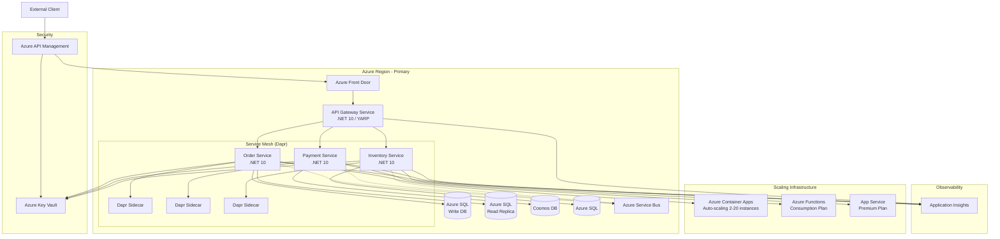
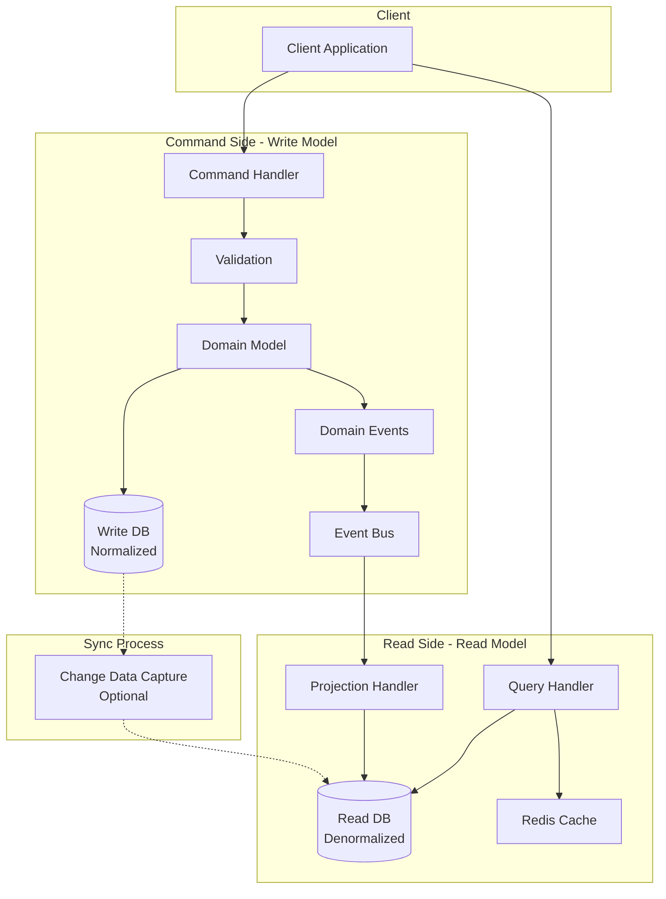
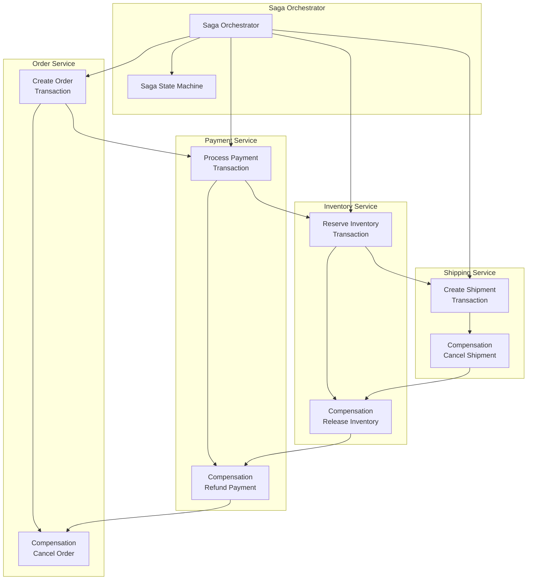
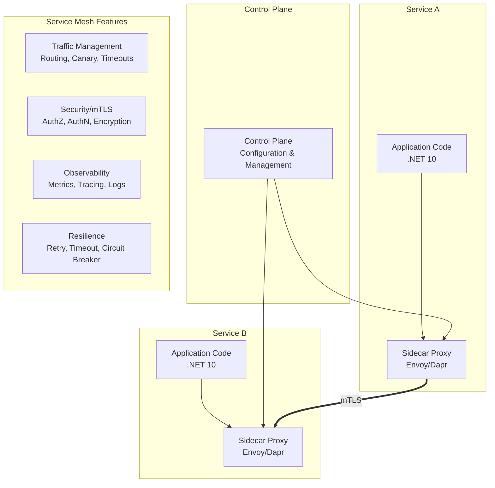
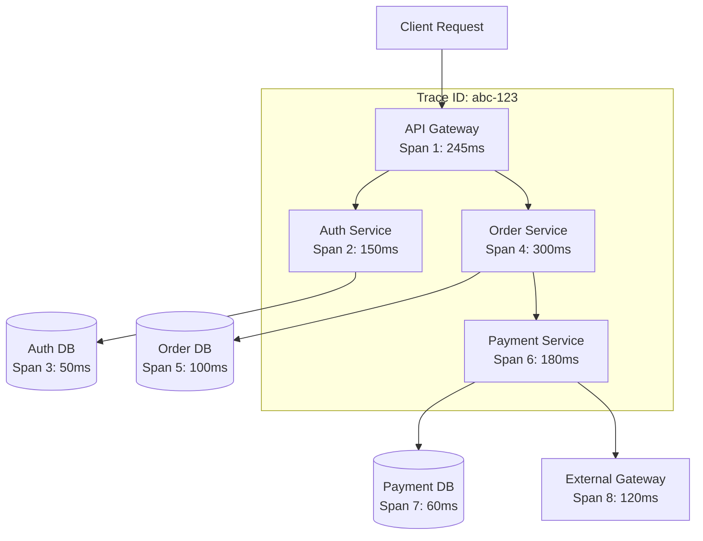
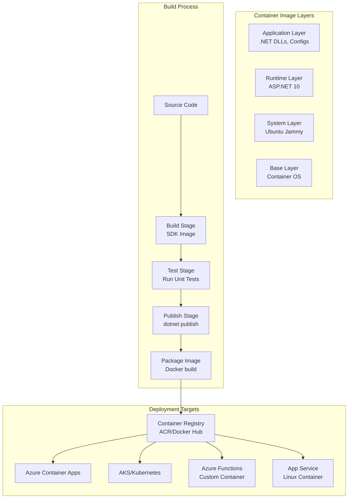

# 10 Essential Microservices Architecture Patterns: A Professional Reference Architecture with .NET 10 and Azure - Part 2

## Enterprise-Grade Implementation Guide for Cloud-Native Systems

**Author:** Principal Cloud Architect
**Version:** 1.0
**Last Updated:** March 2025

---

## Introduction

The journey from monolithic applications to microservices is paved with both opportunity and complexity. After architecting distributed systems for Fortune 500 companies over the past decade, I've learned that success isn't about adopting every pattern—it's about understanding which patterns solve specific problems and implementing them correctly.

This reference architecture presents ten fundamental microservices patterns that form the backbone of any resilient, scalable cloud-native system. Each pattern is examined through the lens of enterprise requirements including scalability, resilience, security, and maintainability.

**What makes this guide different:** Every pattern includes production-ready .NET 10 code implementing SOLID principles, proper dependency injection, Azure Key Vault integration for security, and comprehensive observability. The architecture is designed to handle real-world scenarios—from handling millions of requests to recovering from catastrophic failures.

### Series Structure

This guide is split into two parts for easier consumption:

**Part 1:** Covered the first five foundational patterns—API Gateway, Service Discovery, Load Balancing, Circuit Breaker, and Event-Driven Communication. These patterns establish the core communication and resilience layer of your microservices architecture.

**Part 2 (This Document):** Covers the remaining five advanced patterns—CQRS, Saga Pattern, Service Mesh, Distributed Tracing, and Containerization. These patterns address complex distributed data management, observability, and operational concerns.

Each part includes complete architectural diagrams, design pattern explanations, SOLID principle applications, and production-ready .NET 10 implementations with Azure services.

### The Patterns We'll Master

**Part 1: Foundational Communication Patterns**

1.  **API Gateway** - The single entry point that protects and routes all client requests
2.  **Service Discovery** - How services find each other in a dynamic cloud environment
3.  **Load Balancing** - Distributing traffic for optimal performance and reliability
4.  **Circuit Breaker** - Preventing cascading failures when dependencies fail
5.  **Event-Driven Communication** - Asynchronous, decoupled service interaction

**Part 2: Advanced Data & Operational Patterns**

6.  **CQRS** - Separating read and write models for optimal performance
7.  **Saga Pattern** - Managing distributed transactions with compensation
8.  **Service Mesh** - Offloading cross-cutting concerns to the infrastructure layer
9.  **Distributed Tracing** - Following requests across service boundaries
10.  **Containerization** - Packaging and deploying consistently anywhere


---

## System Architecture Overview

Before diving into individual patterns, let's understand how all the pieces fit together in our reference implementation.

### High-Level Architecture



### Technology Stack Summary

| Component | Technology | Justification |
|-----------|------------|---------------|
| **Runtime** | .NET 10 | Native AOT, minimal APIs, enhanced performance, improved memory management |
| **ORM** | EF Core 10 | Compiled models, bulk updates, query splitting, JSON columns support |
| **API Gateway** | YARP + Azure APIM | Flexibility of custom code + managed service benefits with enterprise features |
| **Service Mesh** | Dapr on ACA | Language-agnostic, built-in patterns, mTLS, observability without code changes |
| **Secrets** | Azure Key Vault | HSM-backed, managed identities, automatic rotation, audit logging |
| **Database** | Azure SQL + Cosmos DB | Polyglot persistence per service need with optimal performance characteristics |
| **Messaging** | Azure Service Bus | Enterprise-grade, sessions, dead-lettering, duplicate detection, partitioning |
| **Container** | Docker + ACR | Secure, private registry with vulnerability scanning, geo-replication |
| **Monitoring** | Application Insights | Distributed tracing, metric collection, log analytics, smart detection |
| **Compute** | Container Apps + Functions | Flexible scaling options based on workload characteristics |

### Design Principles Applied Throughout

- **Single Responsibility Principle**: Each microservice owns its domain and does one thing well
- **Open/Closed Principle**: Services extensible via events and configuration, not code modification
- **Liskov Substitution**: Consistent service interfaces allow component swapping
- **Interface Segregation**: Client-specific interfaces prevent unnecessary dependencies
- **Dependency Inversion**: Abstractions depend on abstractions, not concretions
- **Domain-Driven Design**: Bounded contexts ensure clean domain boundaries
- **Infrastructure as Code**: All resources defined in Bicep for repeatability
- **Security by Design**: Zero-trust principles with mTLS and managed identities

---

# Part 2: Advanced Data & Operational Patterns

---

## Pattern 6: CQRS (Command Query Responsibility Segregation)

### Concept Overview

CQRS separates read and write operations into different models, allowing each to be optimized independently for performance, scalability, and security.

**Definition:** CQRS is an architectural pattern that separates the operations that read data (queries) from the operations that write data (commands). This separation allows each side to use models optimized for its specific purpose.

**Why it's essential:**
- Read and write workloads often have different requirements
- Queries can use denormalized data for better performance
- Commands can enforce complex business rules
- Scales read and write independently
- Improves security by segregating responsibilities
- Enables event sourcing integration

**Real-world analogy:** Think of a library. The catalog system (read) is optimized for finding books quickly, with multiple copies and easy searching. The acquisition system (write) is optimized for ordering, cataloging, and shelving new books, with complex business rules about budgeting and vendor relationships. They use different data structures but work together.

### Architecture



### Database Options Comparison

| Database | Write Perf | Read Perf | Consistency | Scaling | Best For |
|----------|------------|-----------|-------------|---------|----------|
| **Azure SQL (Hyperscale)** | Good | Excellent | Strong | 100TB+ | Transactional writes, complex queries |
| **Cosmos DB** | Excellent | Excellent | Tunable | Global | Global scale, high throughput |
| **Azure SQL + Redis** | Good | Excellent | Eventual | Read scale-out | Read-heavy workloads |
| **SQL + Azure Synapse** | Good | Excellent | Snapshot | Petabyte | Analytics, reporting |

### Design Patterns Applied

- **Command Pattern**: Encapsulate write operations
- **Query Pattern**: Separate read operations
- **Repository Pattern**: Data access abstraction
- **Unit of Work Pattern**: Transaction management
- **Projection Pattern**: Read model updates from events
- **Separated Interface Pattern**: Decouple command/query contracts
- **Mediator Pattern**: Decouple request handling

### SOLID Principles Implementation

**Command Side**

```csharp
// ICommand.cs
public interface ICommand<TResult>
{
}

// Command Handler Interface
public interface ICommandHandler<in TCommand, TResult>
    where TCommand : ICommand<TResult>
{
    Task<TResult> HandleAsync(TCommand command, CancellationToken cancellationToken = default);
}

// Specific Commands
public record CreateOrderCommand(
    string CustomerId,
    List<OrderItemDto> Items,
    AddressDto ShippingAddress,
    string PaymentMethod
) : ICommand<OrderResult>;

public record UpdateOrderStatusCommand(
    Guid OrderId,
    OrderStatus NewStatus,
    string Reason
) : ICommand<bool>;

public record CancelOrderCommand(
    Guid OrderId,
    string Reason
) : ICommand<bool>;

// Command Result
public record OrderResult(
    Guid OrderId,
    string CustomerId,
    decimal TotalAmount,
    OrderStatus Status,
    DateTime CreatedAt
);

// Domain Models - Rich Domain with Business Logic
public class Order : AggregateRoot
{
    private readonly List<OrderItem> _items = new();
    private readonly List<IDomainEvent> _domainEvents = new();
    
    public Guid Id { get; private set; }
    public string CustomerId { get; private set; }
    public DateTime CreatedAt { get; private set; }
    public IReadOnlyList<OrderItem> Items => _items.AsReadOnly();
    public OrderStatus Status { get; private set; }
    public decimal TotalAmount { get; private set; }
    public Address ShippingAddress { get; private set; }
    public PaymentInfo PaymentInfo { get; private set; }
    public IReadOnlyList<IDomainEvent> DomainEvents => _domainEvents.AsReadOnly();
    
    private Order() { } // EF Core
    
    public static Order Create(string customerId, List<OrderItem> items, Address shippingAddress)
    {
        if (string.IsNullOrWhiteSpace(customerId))
            throw new DomainException("Customer ID is required");
            
        if (!items.Any())
            throw new DomainException("Order must have at least one item");
            
        var order = new Order
        {
            Id = Guid.NewGuid(),
            CustomerId = customerId,
            CreatedAt = DateTime.UtcNow,
            Status = OrderStatus.Pending,
            ShippingAddress = shippingAddress
        };
        
        order.AddItems(items);
        order.CalculateTotal();
        
        order.AddDomainEvent(new OrderCreatedDomainEvent(order.Id, customerId, order.TotalAmount));
        
        return order;
    }
    
    private void AddItems(List<OrderItem> items)
    {
        _items.AddRange(items);
    }
    
    private void CalculateTotal()
    {
        TotalAmount = _items.Sum(i => i.Quantity * i.UnitPrice);
    }
    
    public void AddPayment(PaymentInfo payment)
    {
        if (Status != OrderStatus.Pending)
            throw new DomainException("Can only add payment to pending orders");
            
        if (payment.Amount != TotalAmount)
            throw new DomainException($"Payment amount {payment.Amount} does not match order total {TotalAmount}");
            
        PaymentInfo = payment;
        Status = OrderStatus.Paid;
        
        AddDomainEvent(new OrderPaidDomainEvent(Id, payment.TransactionId));
    }
    
    public void Ship()
    {
        if (Status != OrderStatus.Paid)
            throw new DomainException("Can only ship paid orders");
            
        Status = OrderStatus.Shipped;
        
        AddDomainEvent(new OrderShippedDomainEvent(Id));
    }
    
    public void Deliver()
    {
        if (Status != OrderStatus.Shipped)
            throw new DomainException("Can only deliver shipped orders");
            
        Status = OrderStatus.Delivered;
        
        AddDomainEvent(new OrderDeliveredDomainEvent(Id));
    }
    
    public void Cancel(string reason)
    {
        if (Status == OrderStatus.Shipped || Status == OrderStatus.Delivered)
            throw new DomainException("Cannot cancel shipped or delivered orders");
            
        Status = OrderStatus.Cancelled;
        
        AddDomainEvent(new OrderCancelledDomainEvent(Id, reason));
    }
    
    private void AddDomainEvent(IDomainEvent domainEvent)
    {
        _domainEvents.Add(domainEvent);
    }
    
    public void ClearDomainEvents()
    {
        _domainEvents.Clear();
    }
}

// Value Objects
public record Address(string Street, string City, string PostalCode, string Country)
{
    public string FullAddress => $"{Street}, {City}, {PostalCode}, {Country}";
}

public record OrderItem(Guid ProductId, string ProductName, int Quantity, decimal UnitPrice)
{
    public decimal TotalPrice => Quantity * UnitPrice;
}

public record PaymentInfo(string TransactionId, decimal Amount, DateTime PaidAt, PaymentMethod Method);
```

**Command Handler Implementation**

```csharp
// CreateOrderCommandHandler.cs
public class CreateOrderCommandHandler : ICommandHandler<CreateOrderCommand, OrderResult>
{
    private readonly IOrderRepository _orderRepository;
    private readonly ICustomerRepository _customerRepository;
    private readonly IProductRepository _productRepository;
    private readonly IEventPublisher _eventPublisher;
    private readonly IValidator<CreateOrderCommand> _validator;
    private readonly IUnitOfWork _unitOfWork;
    private readonly ILogger<CreateOrderCommandHandler> _logger;
    
    public CreateOrderCommandHandler(
        IOrderRepository orderRepository,
        ICustomerRepository customerRepository,
        IProductRepository productRepository,
        IEventPublisher eventPublisher,
        IValidator<CreateOrderCommand> validator,
        IUnitOfWork unitOfWork,
        ILogger<CreateOrderCommandHandler> logger)
    {
        _orderRepository = orderRepository;
        _customerRepository = customerRepository;
        _productRepository = productRepository;
        _eventPublisher = eventPublisher;
        _validator = validator;
        _unitOfWork = unitOfWork;
        _logger = logger;
    }
    
    public async Task<OrderResult> HandleAsync(
        CreateOrderCommand command, 
        CancellationToken cancellationToken)
    {
        // 1. Validate command (Strategy pattern)
        var validationResult = await _validator.ValidateAsync(command, cancellationToken);
        if (!validationResult.IsValid)
        {
            throw new ValidationException(validationResult.Errors);
        }
        
        // 2. Begin transaction (Unit of Work)
        await _unitOfWork.BeginTransactionAsync(cancellationToken);
        
        try
        {
            // 3. Load aggregates (Repository pattern)
            var customer = await _customerRepository.GetByIdAsync(
                command.CustomerId, cancellationToken);
            if (customer == null)
                throw new CustomerNotFoundException(command.CustomerId);
            
            // 4. Convert DTOs to domain objects
            var items = command.Items.Select(i => 
                new OrderItem(i.ProductId, i.ProductName, i.Quantity, i.UnitPrice)).ToList();
            
            var address = new Address(
                command.ShippingAddress.Street,
                command.ShippingAddress.City,
                command.ShippingAddress.PostalCode,
                command.ShippingAddress.Country
            );
            
            // 5. Create domain entity (Domain model with business logic)
            var order = Order.Create(command.CustomerId, items, address);
            
            // 6. Apply business rules - check inventory
            foreach (var item in order.Items)
            {
                var product = await _productRepository.GetByIdAsync(item.ProductId, cancellationToken);
                if (!product.HasSufficientStock(item.Quantity))
                {
                    throw new InsufficientStockException(item.ProductId, item.Quantity);
                }
                
                // Reserve stock
                product.ReserveStock(item.Quantity);
                await _productRepository.UpdateAsync(product, cancellationToken);
            }
            
            // 7. Save aggregate
            await _orderRepository.AddAsync(order, cancellationToken);
            await _unitOfWork.SaveChangesAsync(cancellationToken);
            
            // 8. Publish domain events
            foreach (var domainEvent in order.DomainEvents)
            {
                await _eventPublisher.PublishAsync(domainEvent, cancellationToken);
            }
            
            // 9. Commit transaction
            await _unitOfWork.CommitTransactionAsync(cancellationToken);
            
            _logger.LogInformation("Order {OrderId} created successfully", order.Id);
            
            // 10. Return result
            return new OrderResult(
                order.Id,
                order.CustomerId,
                order.TotalAmount,
                order.Status,
                order.CreatedAt
            );
        }
        catch (Exception)
        {
            // Rollback on failure
            await _unitOfWork.RollbackTransactionAsync(cancellationToken);
            throw;
        }
        finally
        {
            // Clear domain events to prevent memory leaks
            var order = await _orderRepository.GetByIdAsync(command.CustomerId, cancellationToken);
            order?.ClearDomainEvents();
        }
    }
}
```

**Read Side - Query Models**

```csharp
// IQuery.cs
public interface IQuery<TResult>
{
}

// Query Handler Interface
public interface IQueryHandler<in TQuery, TResult>
    where TQuery : IQuery<TResult>
{
    Task<TResult> HandleAsync(TQuery query, CancellationToken cancellationToken = default);
}

// Queries
public record GetOrderByIdQuery(Guid OrderId) : IQuery<OrderDetailDto>;
public record GetOrdersByCustomerQuery(string CustomerId, int Page, int PageSize) : IQuery<PagedResult<OrderSummaryDto>>;
public record GetRecentOrdersQuery(int Hours) : IQuery<List<OrderSummaryDto>>;
public record SearchOrdersQuery(string SearchTerm, OrderStatus? Status, DateTime? From, DateTime? To) : IQuery<PagedResult<OrderSummaryDto>>;

// Read Models (Denormalized for performance)
public class OrderDetailDto
{
    public Guid Id { get; set; }
    public string CustomerId { get; set; }
    public string CustomerName { get; set; }
    public string CustomerEmail { get; set; }
    public DateTime OrderDate { get; set; }
    public List<OrderItemDto> Items { get; set; }
    public decimal Subtotal { get; set; }
    public decimal Tax { get; set; }
    public decimal Shipping { get; set; }
    public decimal Total { get; set; }
    public string Status { get; set; }
    public AddressDto ShippingAddress { get; set; }
    public PaymentInfoDto Payment { get; set; }
    public List<StatusHistoryDto> StatusHistory { get; set; }
    public Dictionary<string, object> Metadata { get; set; }
}

public class OrderSummaryDto
{
    public Guid Id { get; set; }
    public string CustomerName { get; set; }
    public DateTime OrderDate { get; set; }
    public decimal Total { get; set; }
    public int ItemCount { get; set; }
    public string Status { get; set; }
    public bool IsPaid { get; set; }
    public bool IsShipped { get; set; }
    public bool IsDelivered { get; set; }
}

public class PagedResult<T>
{
    public List<T> Items { get; set; }
    public int Page { get; set; }
    public int PageSize { get; set; }
    public int TotalCount { get; set; }
    public int TotalPages => (int)Math.Ceiling(TotalCount / (double)PageSize);
    public bool HasPrevious => Page > 1;
    public bool HasNext => Page < TotalPages;
}
```

**Query Handler with Caching**

```csharp
// GetOrderByIdQueryHandler.cs
public class GetOrderByIdQueryHandler : IQueryHandler<GetOrderByIdQuery, OrderDetailDto>
{
    private readonly SqlConnection _readConnection;
    private readonly IMemoryCache _cache;
    private readonly ICustomerService _customerService;
    private readonly ILogger<GetOrderByIdQueryHandler> _logger;
    private readonly CacheOptions _cacheOptions;
    
    public GetOrderByIdQueryHandler(
        IConfiguration configuration,
        IMemoryCache cache,
        ICustomerService customerService,
        IOptions<CacheOptions> cacheOptions,
        ILogger<GetOrderByIdQueryHandler> logger)
    {
        _readConnection = new SqlConnection(configuration.GetConnectionString("ReadDb"));
        _cache = cache;
        _customerService = customerService;
        _logger = logger;
        _cacheOptions = cacheOptions.Value;
    }
    
    public async Task<OrderDetailDto> HandleAsync(
        GetOrderByIdQuery query, 
        CancellationToken cancellationToken)
    {
        var cacheKey = $"order_detail_{query.OrderId}";
        
        return await _cache.GetOrCreateAsync(cacheKey, async entry =>
        {
            entry.AbsoluteExpirationRelativeToNow = _cacheOptions.OrderDetailExpiration;
            entry.SlidingExpiration = TimeSpan.FromMinutes(5);
            
            _logger.LogDebug("Cache miss for order {OrderId}, querying database", query.OrderId);
            
            var order = await GetOrderFromDatabaseAsync(query.OrderId, cancellationToken);
            
            if (order != null)
            {
                // Enrich with customer data from separate service (can be cached too)
                var customer = await _customerService.GetCustomerAsync(order.CustomerId, cancellationToken);
                order.CustomerName = customer?.Name;
                order.CustomerEmail = customer?.Email;
            }
            
            return order;
        });
    }
    
    private async Task<OrderDetailDto> GetOrderFromDatabaseAsync(Guid orderId, CancellationToken cancellationToken)
    {
        var query = @"
            SELECT 
                Id, CustomerId, OrderDate, Status,
                Subtotal, Tax, Shipping, Total,
                ShippingStreet, ShippingCity, ShippingPostalCode, ShippingCountry
            FROM OrderReadModel WITH (NOLOCK)
            WHERE Id = @OrderId";
        
        var order = await _readConnection.QuerySingleOrDefaultAsync<OrderDetailDto>(
            new CommandDefinition(query, new { OrderId = orderId }, cancellationToken: cancellationToken));
        
        if (order != null)
        {
            var itemsQuery = @"
                SELECT ProductId, ProductName, Quantity, UnitPrice
                FROM OrderItemReadModel WITH (NOLOCK)
                WHERE OrderId = @OrderId
                ORDER BY ProductName";
            
            order.Items = (await _readConnection.QueryAsync<OrderItemDto>(
                new CommandDefinition(itemsQuery, new { OrderId = orderId }, 
                cancellationToken: cancellationToken))).ToList();
                
            var historyQuery = @"
                SELECT Status, ChangedAt, Note
                FROM OrderStatusHistory WITH (NOLOCK)
                WHERE OrderId = @OrderId
                ORDER BY ChangedAt DESC";
                
            order.StatusHistory = (await _readConnection.QueryAsync<StatusHistoryDto>(
                new CommandDefinition(historyQuery, new { OrderId = orderId },
                cancellationToken: cancellationToken))).ToList();
        }
        
        return order;
    }
}

// Paged Query Handler with Dapper
public class GetOrdersByCustomerQueryHandler : IQueryHandler<GetOrdersByCustomerQuery, PagedResult<OrderSummaryDto>>
{
    private readonly SqlConnection _readConnection;
    private readonly ILogger<GetOrdersByCustomerQueryHandler> _logger;
    
    public GetOrdersByCustomerQueryHandler(
        IConfiguration configuration,
        ILogger<GetOrdersByCustomerQueryHandler> logger)
    {
        _readConnection = new SqlConnection(configuration.GetConnectionString("ReadDb"));
        _logger = logger;
    }
    
    public async Task<PagedResult<OrderSummaryDto>> HandleAsync(
        GetOrdersByCustomerQuery query,
        CancellationToken cancellationToken)
    {
        var offset = (query.Page - 1) * query.PageSize;
        
        // Get total count
        var countQuery = "SELECT COUNT(*) FROM OrderReadModel WHERE CustomerId = @CustomerId";
        var totalCount = await _readConnection.ExecuteScalarAsync<int>(
            new CommandDefinition(countQuery, new { query.CustomerId }, cancellationToken: cancellationToken));
        
        // Get paged data
        var dataQuery = @"
            SELECT 
                Id, CustomerName, OrderDate, Total, ItemCount, Status,
                CASE WHEN Status IN ('Paid', 'Shipped', 'Delivered') THEN 1 ELSE 0 END as IsPaid,
                CASE WHEN Status IN ('Shipped', 'Delivered') THEN 1 ELSE 0 END as IsShipped,
                CASE WHEN Status = 'Delivered' THEN 1 ELSE 0 END as IsDelivered
            FROM OrderReadModel WITH (NOLOCK)
            WHERE CustomerId = @CustomerId
            ORDER BY OrderDate DESC
            OFFSET @Offset ROWS
            FETCH NEXT @PageSize ROWS ONLY";
        
        var data = await _readConnection.QueryAsync<OrderSummaryDto>(
            new CommandDefinition(dataQuery, 
                new { query.CustomerId, Offset = offset, PageSize = query.PageSize },
                cancellationToken: cancellationToken));
        
        return new PagedResult<OrderSummaryDto>
        {
            Items = data.ToList(),
            Page = query.Page,
            PageSize = query.PageSize,
            TotalCount = totalCount
        };
    }
}
```

**Projection Handlers - Update Read Model**

```csharp
// IProjection.cs
public interface IProjection<in TEvent> where TEvent : IDomainEvent
{
    Task ProjectAsync(TEvent @event, CancellationToken cancellationToken = default);
}

// Order Projection Handler
public class OrderProjection : 
    IProjection<OrderCreatedDomainEvent>,
    IProjection<OrderPaidDomainEvent>,
    IProjection<OrderShippedDomainEvent>,
    IProjection<OrderDeliveredDomainEvent>,
    IProjection<OrderCancelledDomainEvent>
{
    private readonly SqlConnection _writeConnection;
    private readonly ILogger<OrderProjection> _logger;
    
    public OrderProjection(
        IConfiguration configuration,
        ILogger<OrderProjection> logger)
    {
        _writeConnection = new SqlConnection(configuration.GetConnectionString("ReadDb"));
        _logger = logger;
    }
    
    public async Task ProjectAsync(OrderCreatedDomainEvent @event, CancellationToken cancellationToken)
    {
        const string sql = @"
            INSERT INTO OrderReadModel (
                Id, CustomerId, CustomerName, OrderDate, 
                Subtotal, Tax, Shipping, Total, Status,
                ShippingStreet, ShippingCity, ShippingPostalCode, ShippingCountry,
                ItemCount
            )
            VALUES (
                @Id, @CustomerId, @CustomerName, @OrderDate,
                @Subtotal, @Tax, @Shipping, @Total, @Status,
                @ShippingStreet, @ShippingCity, @ShippingPostalCode, @ShippingCountry,
                @ItemCount
            )";
        
        await _writeConnection.ExecuteAsync(
            new CommandDefinition(sql, new
            {
                Id = @event.OrderId,
                CustomerId = @event.CustomerId,
                CustomerName = "", // Will be updated by customer projection
                OrderDate = DateTime.UtcNow,
                Subtotal = @event.TotalAmount * 0.9m, // Simplified calculation
                Tax = @event.TotalAmount * 0.1m,
                Shipping = 0,
                Total = @event.TotalAmount,
                Status = "Pending",
                ShippingStreet = @event.ShippingAddress?.Street ?? "",
                ShippingCity = @event.ShippingAddress?.City ?? "",
                ShippingPostalCode = @event.ShippingAddress?.PostalCode ?? "",
                ShippingCountry = @event.ShippingAddress?.Country ?? "",
                ItemCount = @event.ItemCount
            }, cancellationToken: cancellationToken));
        
        // Also insert items
        foreach (var item in @event.Items)
        {
            await InsertOrderItemAsync(@event.OrderId, item, cancellationToken);
        }
        
        _logger.LogInformation("Projected order {OrderId} to read database", @event.OrderId);
    }
    
    private async Task InsertOrderItemAsync(Guid orderId, OrderItemDto item, CancellationToken cancellationToken)
    {
        const string sql = @"
            INSERT INTO OrderItemReadModel (
                OrderId, ProductId, ProductName, Quantity, UnitPrice
            )
            VALUES (
                @OrderId, @ProductId, @ProductName, @Quantity, @UnitPrice
            )";
            
        await _writeConnection.ExecuteAsync(
            new CommandDefinition(sql, new
            {
                OrderId = orderId,
                item.ProductId,
                item.ProductName,
                item.Quantity,
                item.UnitPrice
            }, cancellationToken: cancellationToken));
    }
    
    public async Task ProjectAsync(OrderPaidDomainEvent @event, CancellationToken cancellationToken)
    {
        const string sql = @"
            UPDATE OrderReadModel 
            SET Status = 'Paid',
                PaymentId = @PaymentId,
                PaidAt = @PaidAt
            WHERE Id = @OrderId";
        
        await _writeConnection.ExecuteAsync(
            new CommandDefinition(sql, new
            {
                OrderId = @event.OrderId,
                PaymentId = @event.PaymentId,
                PaidAt = DateTime.UtcNow
            }, cancellationToken: cancellationToken));
            
        // Insert status history
        await InsertStatusHistoryAsync(@event.OrderId, "Paid", cancellationToken);
    }
    
    public async Task ProjectAsync(OrderShippedDomainEvent @event, CancellationToken cancellationToken)
    {
        const string sql = @"
            UPDATE OrderReadModel 
            SET Status = 'Shipped',
                ShippedAt = @ShippedAt
            WHERE Id = @OrderId";
        
        await _writeConnection.ExecuteAsync(
            new CommandDefinition(sql, new
            {
                OrderId = @event.OrderId,
                ShippedAt = DateTime.UtcNow
            }, cancellationToken: cancellationToken));
            
        await InsertStatusHistoryAsync(@event.OrderId, "Shipped", cancellationToken);
    }
    
    public async Task ProjectAsync(OrderDeliveredDomainEvent @event, CancellationToken cancellationToken)
    {
        const string sql = @"
            UPDATE OrderReadModel 
            SET Status = 'Delivered',
                DeliveredAt = @DeliveredAt
            WHERE Id = @OrderId";
        
        await _writeConnection.ExecuteAsync(
            new CommandDefinition(sql, new
            {
                OrderId = @event.OrderId,
                DeliveredAt = DateTime.UtcNow
            }, cancellationToken: cancellationToken));
            
        await InsertStatusHistoryAsync(@event.OrderId, "Delivered", cancellationToken);
    }
    
    public async Task ProjectAsync(OrderCancelledDomainEvent @event, CancellationToken cancellationToken)
    {
        const string sql = @"
            UPDATE OrderReadModel 
            SET Status = 'Cancelled',
                CancelledAt = @CancelledAt,
                CancellationReason = @Reason
            WHERE Id = @OrderId";
        
        await _writeConnection.ExecuteAsync(
            new CommandDefinition(sql, new
            {
                OrderId = @event.OrderId,
                CancelledAt = DateTime.UtcNow,
                Reason = @event.Reason
            }, cancellationToken: cancellationToken));
            
        await InsertStatusHistoryAsync(@event.OrderId, "Cancelled", cancellationToken, @event.Reason);
    }
    
    private async Task InsertStatusHistoryAsync(Guid orderId, string status, CancellationToken cancellationToken, string note = null)
    {
        const string sql = @"
            INSERT INTO OrderStatusHistory (
                OrderId, Status, ChangedAt, Note
            )
            VALUES (
                @OrderId, @Status, @ChangedAt, @Note
            )";
            
        await _writeConnection.ExecuteAsync(
            new CommandDefinition(sql, new
            {
                OrderId = orderId,
                Status = status,
                ChangedAt = DateTime.UtcNow,
                Note = note
            }, cancellationToken: cancellationToken));
    }
}
```

**Mediator Pattern Implementation**

```csharp
// IMediator.cs
public interface IMediator
{
    Task<TResult> Send<TResult>(ICommand<TResult> command, CancellationToken cancellationToken = default);
    Task<TResult> Send<TResult>(IQuery<TResult> query, CancellationToken cancellationToken = default);
}

public class Mediator : IMediator
{
    private readonly IServiceProvider _serviceProvider;
    private readonly ILogger<Mediator> _logger;
    
    public Mediator(IServiceProvider serviceProvider, ILogger<Mediator> logger)
    {
        _serviceProvider = serviceProvider;
        _logger = logger;
    }
    
    public async Task<TResult> Send<TResult>(ICommand<TResult> command, CancellationToken cancellationToken)
    {
        using var scope = _serviceProvider.CreateScope();
        
        var handlerType = typeof(ICommandHandler<,>).MakeGenericType(command.GetType(), typeof(TResult));
        var handler = scope.ServiceProvider.GetRequiredService(handlerType);
        
        _logger.LogDebug("Executing command {CommandType}", command.GetType().Name);
        
        var method = handlerType.GetMethod("HandleAsync");
        var task = (Task<TResult>)method.Invoke(handler, new object[] { command, cancellationToken });
        
        return await task;
    }
    
    public async Task<TResult> Send<TResult>(IQuery<TResult> query, CancellationToken cancellationToken)
    {
        using var scope = _serviceProvider.CreateScope();
        
        var handlerType = typeof(IQueryHandler<,>).MakeGenericType(query.GetType(), typeof(TResult));
        var handler = scope.ServiceProvider.GetRequiredService(handlerType);
        
        _logger.LogDebug("Executing query {QueryType}", query.GetType().Name);
        
        var method = handlerType.GetMethod("HandleAsync");
        var task = (Task<TResult>)method.Invoke(handler, new object[] { query, cancellationToken });
        
        return await task;
    }
}
```

**API Endpoints**

```csharp
// Program.cs - CQRS API Endpoints
app.MapPost("/api/commands/orders", async (
    CreateOrderCommand command,
    IMediator mediator,
    CancellationToken cancellationToken) =>
{
    try
    {
        var result = await mediator.Send(command, cancellationToken);
        return Results.Created($"/api/queries/orders/{result.OrderId}", result);
    }
    catch (ValidationException ex)
    {
        return Results.BadRequest(new { Errors = ex.Errors });
    }
    catch (DomainException ex)
    {
        return Results.BadRequest(new { Error = ex.Message });
    }
});

app.MapGet("/api/queries/orders/{orderId}", async (
    Guid orderId,
    IMediator mediator,
    CancellationToken cancellationToken) =>
{
    var query = new GetOrderByIdQuery(orderId);
    var result = await mediator.Send(query, cancellationToken);
    
    return result is null ? Results.NotFound() : Results.Ok(result);
});

app.MapGet("/api/queries/orders/customer/{customerId}", async (
    string customerId,
    [AsParameters] PagedRequest request,
    IMediator mediator,
    CancellationToken cancellationToken) =>
{
    var query = new GetOrdersByCustomerQuery(customerId, request.Page, request.PageSize);
    var result = await mediator.Send(query, cancellationToken);
    
    return Results.Ok(result);
});

app.MapGet("/api/queries/orders/recent/{hours}", async (
    int hours,
    IMediator mediator,
    CancellationToken cancellationToken) =>
{
    var query = new GetRecentOrdersQuery(hours);
    var result = await mediator.Send(query, cancellationToken);
    
    return Results.Ok(result);
});

app.MapPost("/api/queries/orders/search", async (
    SearchOrdersQuery query,
    IMediator mediator,
    CancellationToken cancellationToken) =>
{
    var result = await mediator.Send(query, cancellationToken);
    return Results.Ok(result);
});
```

### Configuration

```json
{
  "ConnectionStrings": {
    "WriteDb": "Server=tcp:write-server.database.windows.net;Database=OrdersWriteDb;Authentication=Active Directory Managed Identity",
    "ReadDb": "Server=tcp:read-server.database.windows.net;Database=OrdersReadDb;Authentication=Active Directory Managed Identity"
  },
  "Cache": {
    "OrderDetailExpiration": "00:05:00",
    "OrderListExpiration": "00:01:00"
  }
}
```

### Key Takeaways

- **Separation of concerns** - Write model for business logic, read model for query performance
- **Independent scaling** - Scale reads and writes separately based on workload
- **Optimized data structures** - Normalized for writes, denormalized for reads
- **Eventual consistency is acceptable** - Read model lags slightly behind writes
- **Projections keep read models updated** - React to domain events
- **Caching improves query performance** - Cache popular queries in Redis
- **Mediator pattern decouples clients** - Single entry point for commands and queries

---

## Pattern 7: Saga Pattern

### Concept Overview

The Saga pattern manages distributed transactions across multiple microservices by breaking them into a series of local transactions with compensating actions for rollback.

**Definition:** A saga is a sequence of local transactions where each transaction updates data within a single service. If a transaction fails, the saga executes compensating transactions to undo the changes made by preceding transactions.

**Why it's essential:**
- Distributed transactions don't scale (2PC is slow)
- Services must maintain consistency without distributed locks
- Failures require coordinated rollback
- Business processes often span multiple services
- Provides eventual consistency across boundaries
- Enables long-running business processes

**Real-world analogy:** Think of booking a vacation package: flight, hotel, and car rental. If the hotel booking fails after flight is booked, you need to cancel the flight (compensation). Each booking is a local transaction, and if any fails, you compensate the previous ones.

### Saga Flow



### Saga Implementation Options

| Pattern | Coordination | Complexity | Visibility | Best For |
|---------|--------------|------------|------------|----------|
| **Choreography** | Decentralized (events) | Lower | Less visibility | Simple workflows with few services |
| **Orchestration** | Centralized orchestrator | Higher | Full visibility | Complex workflows, business processes |
| **State Machine** | Durable Functions | Medium | Good visibility | Long-running processes with human steps |

### Design Patterns Applied

- **Saga Pattern**: Distributed transaction coordination
- **State Machine Pattern**: Saga state management
- **Command Pattern**: Encapsulate transaction steps
- **Compensation Pattern**: Rollback actions for failures
- **Process Manager Pattern**: Centralized orchestration
- **Event Sourcing Pattern**: Saga state persistence
- **Retry Pattern**: Automatic retry on transient failures

### SOLID Principles Implementation

**Saga Core Interfaces**

```csharp
// ISaga.cs
public interface ISaga<TData> where TData : class
{
    Guid SagaId { get; }
    TData Data { get; }
    SagaStatus Status { get; }
    IReadOnlyList<SagaStep> CompletedSteps { get; }
    Task StartAsync(CancellationToken cancellationToken = default);
    Task HandleMessageAsync<TMessage>(TMessage message, CancellationToken cancellationToken = default);
}

public enum SagaStatus
{
    NotStarted,
    InProgress,
    Completed,
    Failed,
    Compensating,
    Compensated
}

public class SagaStep
{
    public string StepName { get; set; }
    public DateTime StartedAt { get; set; }
    public DateTime? CompletedAt { get; set; }
    public bool Success { get; set; }
    public string Error { get; set; }
    public Dictionary<string, object> Output { get; set; }
    public Dictionary<string, object> Input { get; set; }
}

// Saga State for persistence
public class SagaState
{
    public Guid SagaId { get; set; }
    public string SagaType { get; set; }
    public string Data { get; set; } // Serialized TData
    public string Status { get; set; }
    public string CompletedSteps { get; set; } // Serialized steps
    public DateTime CreatedAt { get; set; }
    public DateTime LastUpdated { get; set; }
    public string CorrelationId { get; set; }
    public Dictionary<string, object> Metadata { get; set; }
}
```

**Order Saga Data**

```csharp
// OrderSagaData.cs
public class OrderSagaData
{
    public Guid OrderId { get; set; }
    public string CustomerId { get; set; }
    public decimal TotalAmount { get; set; }
    public List<OrderItem> Items { get; set; }
    public string PaymentId { get; set; }
    public List<ReservedItem> ReservedItems { get; set; }
    public string ShipmentId { get; set; }
    public DateTime CreatedAt { get; set; }
    public DateTime? CompletedAt { get; set; }
    public Dictionary<string, object> StepResults { get; set; } = new();
    public string CorrelationId { get; set; }
    public Dictionary<string, object> Metadata { get; set; } = new();
}

public class ReservedItem
{
    public string ProductId { get; set; }
    public int Quantity { get; set; }
    public string Location { get; set; }
}

// Saga Commands and Events
public record StartOrderSagaCommand(
    Guid OrderId,
    string CustomerId,
    decimal TotalAmount,
    List<OrderItem> Items,
    string CorrelationId);

public record ProcessPaymentCommand(
    Guid OrderId,
    string CustomerId,
    decimal Amount,
    string CorrelationId);

public record ReserveInventoryCommand(
    Guid OrderId,
    List<OrderItem> Items,
    string CorrelationId);

public record CreateShipmentCommand(
    Guid OrderId,
    string CustomerId,
    List<OrderItem> Items,
    string CorrelationId);

// Compensation Commands
public record CancelOrderCommand(
    Guid OrderId,
    string Reason,
    string CorrelationId);

public record RefundPaymentCommand(
    string PaymentId,
    decimal Amount,
    string CorrelationId);

public record ReleaseInventoryCommand(
    Guid OrderId,
    List<ReservedItem> Items,
    string CorrelationId);

public record CancelShipmentCommand(
    string ShipmentId,
    string CorrelationId);

// Results
public record PaymentResult(
    bool Success,
    string TransactionId,
    decimal Amount,
    string ErrorMessage = null);

public record InventoryResult(
    bool Success,
    List<ReservedItem> ReservedItems,
    string ErrorMessage = null);

public record ShipmentResult(
    bool Success,
    string ShipmentId,
    string ErrorMessage = null);
```

**Saga Orchestrator - State Machine Pattern**

```csharp
// OrderSagaOrchestrator.cs
public class OrderSagaOrchestrator : ISaga<OrderSagaData>
{
    private readonly ILogger<OrderSagaOrchestrator> _logger;
    private readonly ISagaStateRepository _stateRepository;
    private readonly IMessageBus _messageBus;
    private readonly ICommandHandler<ProcessPaymentCommand, PaymentResult> _paymentHandler;
    private readonly ICommandHandler<ReserveInventoryCommand, InventoryResult> _inventoryHandler;
    private readonly ICommandHandler<CreateShipmentCommand, ShipmentResult> _shipmentHandler;
    private readonly TimeSpan _stepTimeout = TimeSpan.FromMinutes(5);
    
    public Guid SagaId { get; }
    public OrderSagaData Data { get; }
    public SagaStatus Status { get; private set; }
    private readonly List<SagaStep> _completedSteps;
    public IReadOnlyList<SagaStep> CompletedSteps => _completedSteps.AsReadOnly();
    
    public OrderSagaOrchestrator(
        Guid sagaId,
        OrderSagaData data,
        ILogger<OrderSagaOrchestrator> logger,
        ISagaStateRepository stateRepository,
        IMessageBus messageBus,
        ICommandHandler<ProcessPaymentCommand, PaymentResult> paymentHandler,
        ICommandHandler<ReserveInventoryCommand, InventoryResult> inventoryHandler,
        ICommandHandler<CreateShipmentCommand, ShipmentResult> shipmentHandler)
    {
        SagaId = sagaId;
        Data = data;
        Status = SagaStatus.NotStarted;
        _completedSteps = new List<SagaStep>();
        
        _logger = logger;
        _stateRepository = stateRepository;
        _messageBus = messageBus;
        _paymentHandler = paymentHandler;
        _inventoryHandler = inventoryHandler;
        _shipmentHandler = shipmentHandler;
    }
    
    public async Task StartAsync(CancellationToken cancellationToken = default)
    {
        _logger.LogInformation("Starting saga {SagaId} for order {OrderId}", 
            SagaId, Data.OrderId);
        
        Status = SagaStatus.InProgress;
        await SaveStateAsync(cancellationToken);
        
        // Start first step
        await ProcessPaymentAsync(cancellationToken);
    }
    
    private async Task ProcessPaymentAsync(CancellationToken cancellationToken)
    {
        var step = new SagaStep
        {
            StepName = "ProcessPayment",
            StartedAt = DateTime.UtcNow,
            Input = new Dictionary<string, object>
            {
                ["OrderId"] = Data.OrderId,
                ["Amount"] = Data.TotalAmount
            }
        };
        
        try
        {
            using var cts = CancellationTokenSource.CreateLinkedTokenSource(cancellationToken);
            cts.CancelAfter(_stepTimeout);
            
            var command = new ProcessPaymentCommand(
                Data.OrderId,
                Data.CustomerId,
                Data.TotalAmount,
                Data.CorrelationId);
                
            var result = await _paymentHandler.HandleAsync(command, cts.Token);
            
            if (!result.Success)
            {
                throw new SagaStepException($"Payment failed: {result.ErrorMessage}");
            }
            
            Data.PaymentId = result.TransactionId;
            Data.StepResults["Payment"] = result;
            
            step.CompletedAt = DateTime.UtcNow;
            step.Success = true;
            step.Output = new Dictionary<string, object>
            {
                ["PaymentId"] = result.TransactionId,
                ["Amount"] = result.Amount
            };
            
            _completedSteps.Add(step);
            await SaveStateAsync(cancellationToken);
            
            // Move to next step
            await ReserveInventoryAsync(cancellationToken);
        }
        catch (Exception ex)
        {
            _logger.LogError(ex, "Payment processing failed for order {OrderId}", Data.OrderId);
            
            step.CompletedAt = DateTime.UtcNow;
            step.Success = false;
            step.Error = ex.Message;
            _completedSteps.Add(step);
            
            // Start compensation
            await CompensateAsync(cancellationToken);
        }
    }
    
    private async Task ReserveInventoryAsync(CancellationToken cancellationToken)
    {
        var step = new SagaStep
        {
            StepName = "ReserveInventory",
            StartedAt = DateTime.UtcNow,
            Input = new Dictionary<string, object>
            {
                ["OrderId"] = Data.OrderId,
                ["ItemCount"] = Data.Items?.Count
            }
        };
        
        try
        {
            using var cts = CancellationTokenSource.CreateLinkedTokenSource(cancellationToken);
            cts.CancelAfter(_stepTimeout);
            
            var command = new ReserveInventoryCommand(
                Data.OrderId,
                Data.Items,
                Data.CorrelationId);
                
            var result = await _inventoryHandler.HandleAsync(command, cts.Token);
            
            if (!result.Success)
            {
                throw new SagaStepException($"Inventory reservation failed: {result.ErrorMessage}");
            }
            
            Data.ReservedItems = result.ReservedItems;
            Data.StepResults["Inventory"] = result;
            
            step.CompletedAt = DateTime.UtcNow;
            step.Success = true;
            step.Output = new Dictionary<string, object>
            {
                ["ReservedItems"] = result.ReservedItems.Count
            };
            
            _completedSteps.Add(step);
            await SaveStateAsync(cancellationToken);
            
            // Move to next step
            await CreateShipmentAsync(cancellationToken);
        }
        catch (Exception ex)
        {
            _logger.LogError(ex, "Inventory reservation failed for order {OrderId}", Data.OrderId);
            
            step.CompletedAt = DateTime.UtcNow;
            step.Success = false;
            step.Error = ex.Message;
            _completedSteps.Add(step);
            
            // Start compensation
            await CompensateAsync(cancellationToken);
        }
    }
    
    private async Task CreateShipmentAsync(CancellationToken cancellationToken)
    {
        var step = new SagaStep
        {
            StepName = "CreateShipment",
            StartedAt = DateTime.UtcNow,
            Input = new Dictionary<string, object>
            {
                ["OrderId"] = Data.OrderId,
                ["CustomerId"] = Data.CustomerId
            }
        };
        
        try
        {
            using var cts = CancellationTokenSource.CreateLinkedTokenSource(cancellationToken);
            cts.CancelAfter(_stepTimeout);
            
            var command = new CreateShipmentCommand(
                Data.OrderId,
                Data.CustomerId,
                Data.Items,
                Data.CorrelationId);
                
            var result = await _shipmentHandler.HandleAsync(command, cts.Token);
            
            if (!result.Success)
            {
                throw new SagaStepException($"Shipment creation failed: {result.ErrorMessage}");
            }
            
            Data.ShipmentId = result.ShipmentId;
            Data.StepResults["Shipment"] = result;
            
            step.CompletedAt = DateTime.UtcNow;
            step.Success = true;
            step.Output = new Dictionary<string, object>
            {
                ["ShipmentId"] = result.ShipmentId
            };
            
            _completedSteps.Add(step);
            
            // Saga completed successfully
            Status = SagaStatus.Completed;
            Data.CompletedAt = DateTime.UtcNow;
            
            await SaveStateAsync(cancellationToken);
            
            _logger.LogInformation("Saga {SagaId} completed successfully for order {OrderId}", 
                SagaId, Data.OrderId);
                
            // Publish completion event
            await _messageBus.PublishAsync(new OrderSagaCompletedEvent
            {
                SagaId = SagaId,
                OrderId = Data.OrderId,
                PaymentId = Data.PaymentId,
                ShipmentId = Data.ShipmentId,
                CorrelationId = Data.CorrelationId
            }, cancellationToken);
        }
        catch (Exception ex)
        {
            _logger.LogError(ex, "Shipment creation failed for order {OrderId}", Data.OrderId);
            
            step.CompletedAt = DateTime.UtcNow;
            step.Success = false;
            step.Error = ex.Message;
            _completedSteps.Add(step);
            
            // Start compensation
            await CompensateAsync(cancellationToken);
        }
    }
    
    private async Task CompensateAsync(CancellationToken cancellationToken)
    {
        _logger.LogWarning("Starting compensation for saga {SagaId} order {OrderId}", 
            SagaId, Data.OrderId);
            
        Status = SagaStatus.Compensating;
        await SaveStateAsync(cancellationToken);
        
        // Execute compensations in reverse order
        foreach (var step in _completedSteps.OrderByDescending(s => s.StartedAt))
        {
            if (step.Success)
            {
                await ExecuteCompensationAsync(step, cancellationToken);
            }
        }
        
        Status = SagaStatus.Compensated;
        await SaveStateAsync(cancellationToken);
        
        _logger.LogWarning("Saga {SagaId} compensated for order {OrderId}", 
            SagaId, Data.OrderId);
            
        // Publish compensation event
        await _messageBus.PublishAsync(new OrderSagaCompensatedEvent
        {
            SagaId = SagaId,
            OrderId = Data.OrderId,
            Reason = "Step failed",
            CorrelationId = Data.CorrelationId
        }, cancellationToken);
    }
    
    private async Task ExecuteCompensationAsync(SagaStep step, CancellationToken cancellationToken)
    {
        try
        {
            _logger.LogInformation("Executing compensation for step {StepName}", step.StepName);
            
            switch (step.StepName)
            {
                case "CreateShipment":
                    if (!string.IsNullOrEmpty(Data.ShipmentId))
                    {
                        await _messageBus.PublishAsync(new CancelShipmentCommand(
                            Data.ShipmentId,
                            Data.CorrelationId), cancellationToken);
                    }
                    break;
                    
                case "ReserveInventory":
                    if (Data.ReservedItems?.Any() == true)
                    {
                        await _messageBus.PublishAsync(new ReleaseInventoryCommand(
                            Data.OrderId,
                            Data.ReservedItems,
                            Data.CorrelationId), cancellationToken);
                    }
                    break;
                    
                case "ProcessPayment":
                    if (!string.IsNullOrEmpty(Data.PaymentId))
                    {
                        await _messageBus.PublishAsync(new RefundPaymentCommand(
                            Data.PaymentId,
                            Data.TotalAmount,
                            Data.CorrelationId), cancellationToken);
                    }
                    break;
                    
                case "CreateOrder":
                    await _messageBus.PublishAsync(new CancelOrderCommand(
                        Data.OrderId,
                        "Saga compensation",
                        Data.CorrelationId), cancellationToken);
                    break;
            }
            
            _logger.LogInformation("Executed compensation for step {StepName}", step.StepName);
        }
        catch (Exception ex)
        {
            _logger.LogError(ex, "Compensation failed for step {StepName}", step.StepName);
            // Continue with other compensations - don't throw
            // Log for manual intervention
        }
    }
    
    private async Task SaveStateAsync(CancellationToken cancellationToken)
    {
        var state = new SagaState
        {
            SagaId = SagaId,
            SagaType = nameof(OrderSagaOrchestrator),
            Data = JsonSerializer.Serialize(Data),
            Status = Status.ToString(),
            CompletedSteps = JsonSerializer.Serialize(_completedSteps),
            CreatedAt = Data.CreatedAt,
            LastUpdated = DateTime.UtcNow,
            CorrelationId = Data.CorrelationId,
            Metadata = new Dictionary<string, object>
            {
                ["OrderId"] = Data.OrderId,
                ["CustomerId"] = Data.CustomerId
            }
        };
        
        await _stateRepository.SaveAsync(state, cancellationToken);
    }
    
    // For restoring saga from persisted state
    internal void SetStatus(SagaStatus status) => Status = status;
    internal void SetCompletedSteps(List<SagaStep> steps) => _completedSteps.AddRange(steps);
    
    public async Task HandleMessageAsync<TMessage>(TMessage message, CancellationToken cancellationToken)
    {
        // Handle incoming messages (for async steps or compensations)
        switch (message)
        {
            case PaymentProcessedEvent paymentEvent:
                _logger.LogInformation("Received async payment confirmation for saga {SagaId}", SagaId);
                // Handle async payment confirmation if needed
                break;
            case InventoryReservedEvent inventoryEvent:
                _logger.LogInformation("Received async inventory confirmation for saga {SagaId}", SagaId);
                break;
            case PaymentRefundedEvent refundEvent:
                _logger.LogInformation("Payment refunded for saga {SagaId}", SagaId);
                break;
        }
    }
}
```

**Saga Factory**

```csharp
// ISagaFactory.cs
public interface ISagaFactory
{
    Task<ISaga<TData>> CreateSagaAsync<TData>(TData data, CancellationToken cancellationToken = default)
        where TData : class;
    Task<ISaga<TData>> LoadSagaAsync<TData>(Guid sagaId, CancellationToken cancellationToken = default)
        where TData : class;
    Task<IEnumerable<ISaga<TData>>> FindSagasByStatusAsync<TData>(SagaStatus status, CancellationToken cancellationToken = default)
        where TData : class;
}

public class SagaFactory : ISagaFactory
{
    private readonly IServiceProvider _serviceProvider;
    private readonly ISagaStateRepository _stateRepository;
    private readonly ILogger<SagaFactory> _logger;
    
    public SagaFactory(
        IServiceProvider serviceProvider,
        ISagaStateRepository stateRepository,
        ILogger<SagaFactory> logger)
    {
        _serviceProvider = serviceProvider;
        _stateRepository = stateRepository;
        _logger = logger;
    }
    
    public async Task<ISaga<TData>> CreateSagaAsync<TData>(TData data, CancellationToken cancellationToken)
        where TData : class
    {
        var sagaId = Guid.NewGuid();
        
        var saga = ActivatorUtilities.CreateInstance<OrderSagaOrchestrator>(
            _serviceProvider,
            sagaId,
            data);
            
        _logger.LogInformation("Created new saga {SagaId} of type {SagaType}", 
            sagaId, typeof(OrderSagaOrchestrator).Name);
            
        return saga as ISaga<TData>;
    }
    
    public async Task<ISaga<TData>> LoadSagaAsync<TData>(Guid sagaId, CancellationToken cancellationToken)
        where TData : class
    {
        var state = await _stateRepository.GetByIdAsync(sagaId, cancellationToken);
        if (state == null)
            throw new SagaNotFoundException(sagaId);
            
        var data = JsonSerializer.Deserialize<TData>(state.Data);
        var completedSteps = JsonSerializer.Deserialize<List<SagaStep>>(state.CompletedSteps);
        
        var saga = ActivatorUtilities.CreateInstance<OrderSagaOrchestrator>(
            _serviceProvider,
            sagaId,
            data);
            
        // Restore state
        var orderSaga = saga as OrderSagaOrchestrator;
        orderSaga.SetStatus(Enum.Parse<SagaStatus>(state.Status));
        orderSaga.SetCompletedSteps(completedSteps);
        
        _logger.LogInformation("Loaded saga {SagaId} with status {Status}", sagaId, state.Status);
        
        return saga as ISaga<TData>;
    }
    
    public async Task<IEnumerable<ISaga<TData>>> FindSagasByStatusAsync<TData>(SagaStatus status, CancellationToken cancellationToken)
        where TData : class
    {
        var states = await _stateRepository.GetByStatusAsync(status, cancellationToken);
        var sagas = new List<ISaga<TData>>();
        
        foreach (var state in states)
        {
            var saga = await LoadSagaAsync<TData>(state.SagaId, cancellationToken);
            sagas.Add(saga);
        }
        
        return sagas;
    }
}
```

**Saga State Repository - Cosmos DB Implementation**

```csharp
// ISagaStateRepository.cs
public interface ISagaStateRepository
{
    Task SaveAsync(SagaState state, CancellationToken cancellationToken = default);
    Task<SagaState> GetByIdAsync(Guid sagaId, CancellationToken cancellationToken = default);
    Task<IEnumerable<SagaState>> GetByStatusAsync(SagaStatus status, CancellationToken cancellationToken = default);
    Task<IEnumerable<SagaState>> GetByCorrelationIdAsync(string correlationId, CancellationToken cancellationToken = default);
    Task DeleteAsync(Guid sagaId, CancellationToken cancellationToken = default);
}

// Cosmos DB Implementation
public class CosmosSagaStateRepository : ISagaStateRepository
{
    private readonly Container _container;
    private readonly ILogger<CosmosSagaStateRepository> _logger;
    private readonly JsonSerializerOptions _jsonOptions;
    
    public CosmosSagaStateRepository(
        CosmosClient cosmosClient,
        string databaseName,
        string containerName,
        ILogger<CosmosSagaStateRepository> logger)
    {
        _container = cosmosClient.GetContainer(databaseName, containerName);
        _logger = logger;
        _jsonOptions = new JsonSerializerOptions
        {
            PropertyNamingPolicy = JsonNamingPolicy.CamelCase
        };
    }
    
    public async Task SaveAsync(SagaState state, CancellationToken cancellationToken)
    {
        state.LastUpdated = DateTime.UtcNow;
        
        try
        {
            await _container.UpsertItemAsync(state, new PartitionKey(state.SagaId.ToString()), 
                cancellationToken: cancellationToken);
                
            _logger.LogDebug("Saved saga state {SagaId}", state.SagaId);
        }
        catch (CosmosException ex)
        {
            _logger.LogError(ex, "Failed to save saga state {SagaId}", state.SagaId);
            throw;
        }
    }
    
    public async Task<SagaState> GetByIdAsync(Guid sagaId, CancellationToken cancellationToken)
    {
        try
        {
            var response = await _container.ReadItemAsync<SagaState>(
                sagaId.ToString(), 
                new PartitionKey(sagaId.ToString()),
                cancellationToken: cancellationToken);
                
            return response.Resource;
        }
        catch (CosmosException ex) when (ex.StatusCode == System.Net.HttpStatusCode.NotFound)
        {
            return null;
        }
    }
    
    public async Task<IEnumerable<SagaState>> GetByStatusAsync(SagaStatus status, CancellationToken cancellationToken)
    {
        var query = new QueryDefinition("SELECT * FROM c WHERE c.Status = @status")
            .WithParameter("@status", status.ToString());
            
        var iterator = _container.GetItemQueryIterator<SagaState>(query);
        var results = new List<SagaState>();
        
        while (iterator.HasMoreResults)
        {
            var response = await iterator.ReadNextAsync(cancellationToken);
            results.AddRange(response);
        }
        
        return results;
    }
    
    public async Task<IEnumerable<SagaState>> GetByCorrelationIdAsync(string correlationId, CancellationToken cancellationToken)
    {
        var query = new QueryDefinition("SELECT * FROM c WHERE c.CorrelationId = @correlationId")
            .WithParameter("@correlationId", correlationId);
            
        var iterator = _container.GetItemQueryIterator<SagaState>(query);
        var results = new List<SagaState>();
        
        while (iterator.HasMoreResults)
        {
            var response = await iterator.ReadNextAsync(cancellationToken);
            results.AddRange(response);
        }
        
        return results;
    }
    
    public async Task DeleteAsync(Guid sagaId, CancellationToken cancellationToken)
    {
        await _container.DeleteItemAsync<SagaState>(
            sagaId.ToString(),
            new PartitionKey(sagaId.ToString()),
            cancellationToken: cancellationToken);
            
        _logger.LogInformation("Deleted saga state {SagaId}", sagaId);
    }
}
```

**Saga Host - Background Service**

```csharp
// SagaHost.cs
public class SagaHost : BackgroundService
{
    private readonly ISagaFactory _sagaFactory;
    private readonly IMessageBus _messageBus;
    private readonly ILogger<SagaHost> _logger;
    private readonly TimeSpan _cleanupInterval = TimeSpan.FromHours(1);
    private readonly TimeSpan _sagaTimeout = TimeSpan.FromHours(24);
    
    public SagaHost(
        ISagaFactory sagaFactory,
        IMessageBus messageBus,
        ILogger<SagaHost> logger)
    {
        _sagaFactory = sagaFactory;
        _messageBus = messageBus;
        _logger = logger;
    }
    
    protected override async Task ExecuteAsync(CancellationToken stoppingToken)
    {
        // Subscribe to saga messages
        await _messageBus.SubscribeAsync<StartOrderSagaCommand>(HandleStartSaga, stoppingToken);
        await _messageBus.SubscribeAsync<PaymentProcessedEvent>(HandlePaymentProcessed, stoppingToken);
        await _messageBus.SubscribeAsync<InventoryReservedEvent>(HandleInventoryReserved, stoppingToken);
        await _messageBus.SubscribeAsync<ShipmentCreatedEvent>(HandleShipmentCreated, stoppingToken);
        
        _logger.LogInformation("Saga host started");
        
        // Start cleanup task
        _ = Task.Run(() => CleanupStuckSagasAsync(stoppingToken), stoppingToken);
        
        // Keep running until cancellation
        await Task.Delay(Timeout.Infinite, stoppingToken);
    }
    
    private async Task HandleStartSaga(StartOrderSagaCommand command, CancellationToken cancellationToken)
    {
        _logger.LogInformation("Received command to start saga for order {OrderId}", command.OrderId);
        
        var data = new OrderSagaData
        {
            OrderId = command.OrderId,
            CustomerId = command.CustomerId,
            TotalAmount = command.TotalAmount,
            Items = command.Items,
            CorrelationId = command.CorrelationId,
            CreatedAt = DateTime.UtcNow,
            Metadata = new Dictionary<string, object>
            {
                ["Source"] = "OrderService",
                ["CommandType"] = nameof(StartOrderSagaCommand)
            }
        };
        
        var saga = await _sagaFactory.CreateSagaAsync<OrderSagaData>(data, cancellationToken);
        await saga.StartAsync(cancellationToken);
    }
    
    private async Task HandlePaymentProcessed(PaymentProcessedEvent @event, CancellationToken cancellationToken)
    {
        var sagas = await _sagaFactory.FindSagasByStatusAsync<OrderSagaData>(SagaStatus.InProgress, cancellationToken);
        var saga = sagas.FirstOrDefault(s => s.Data.OrderId == @event.OrderId);
        
        if (saga != null)
        {
            await saga.HandleMessageAsync(@event, cancellationToken);
        }
    }
    
    private async Task HandleInventoryReserved(InventoryReservedEvent @event, CancellationToken cancellationToken)
    {
        var sagas = await _sagaFactory.FindSagasByStatusAsync<OrderSagaData>(SagaStatus.InProgress, cancellationToken);
        var saga = sagas.FirstOrDefault(s => s.Data.OrderId == @event.OrderId);
        
        if (saga != null)
        {
            await saga.HandleMessageAsync(@event, cancellationToken);
        }
    }
    
    private async Task HandleShipmentCreated(ShipmentCreatedEvent @event, CancellationToken cancellationToken)
    {
        var sagas = await _sagaFactory.FindSagasByStatusAsync<OrderSagaData>(SagaStatus.InProgress, cancellationToken);
        var saga = sagas.FirstOrDefault(s => s.Data.OrderId == @event.OrderId);
        
        if (saga != null)
        {
            await saga.HandleMessageAsync(@event, cancellationToken);
        }
    }
    
    private async Task CleanupStuckSagasAsync(CancellationToken cancellationToken)
    {
        while (!cancellationToken.IsCancellationRequested)
        {
            try
            {
                await Task.Delay(_cleanupInterval, cancellationToken);
                
                _logger.LogInformation("Starting cleanup of stuck sagas");
                
                var inProgressSagas = await _sagaFactory.FindSagasByStatusAsync<OrderSagaData>(SagaStatus.InProgress, cancellationToken);
                var cutoffTime = DateTime.UtcNow - _sagaTimeout;
                
                foreach (var saga in inProgressSagas)
                {
                    if (saga.Data.CreatedAt < cutoffTime)
                    {
                        _logger.LogWarning("Saga {SagaId} for order {OrderId} has been stuck for over 24 hours", 
                            saga.SagaId, saga.Data.OrderId);
                        
                        // Could implement compensation here
                        // await saga.CompensateAsync(cancellationToken);
                    }
                }
            }
            catch (Exception ex)
            {
                _logger.LogError(ex, "Error during saga cleanup");
            }
        }
    }
}
```

### Configuration

```json
{
  "Saga": {
    "StepTimeout": "00:05:00",
    "SagaTimeout": "24:00:00",
    "CleanupInterval": "01:00:00",
    "MaxRetryCount": 3
  },
  "CosmosDb": {
    "DatabaseName": "SagaStore",
    "ContainerName": "SagaStates",
    "Throughput": 400
  }
}
```

### Key Takeaways

- **Distributed transactions without 2PC** - Sagas provide eventual consistency
- **Compensations are critical** - Every transaction must have a compensating action
- **State persistence enables recovery** - Sagas survive service restarts
- **Orchestration vs Choreography** - Choose based on complexity
- **Timeouts prevent stuck sagas** - Clean up abandoned processes
- **Idempotency is essential** - Handlers must handle duplicate messages
- **Cosmos DB provides global scale** - Saga state available across regions

---

## Pattern 8: Service Mesh

### Concept Overview

A service mesh is a dedicated infrastructure layer that handles service-to-service communication, offloading cross-cutting concerns like security, observability, and reliability from the application code.

**Definition:** A service mesh is a configurable infrastructure layer that manages communication between services using sidecar proxies. It provides capabilities like service discovery, load balancing, encryption, authentication, authorization, and observability without requiring changes to application code.

**Why it's essential:**
- Separates operational concerns from business logic
- Provides consistent policies across all services
- Enables mTLS encryption without code changes
- Offers deep observability into service communication
- Implements resilience patterns centrally
- Reduces boilerplate code in each service
- Enables gradual adoption and canary deployments

**Real-world analogy:** Think of a service mesh as the air traffic control system for a city. Planes (services) don't need to coordinate with each other directly—they communicate through a central system that handles routing, safety, and monitoring. Pilots focus on flying (business logic) while the control system handles coordination.

### Architecture



### Azure Service Mesh Options

| Solution | Features | Complexity | Learning Curve | Best For |
|----------|----------|------------|----------------|----------|
| **Dapr on ACA** | Building blocks, HTTP/gRPC, state management | Low | Easy | .NET microservices, rapid development |
| **Istio on AKS** | Full-featured, traffic management, security | High | Steep | Enterprise, complex policies |
| **Linkerd on AKS** | Lightweight, fast, minimal features | Medium | Moderate | Performance-focused, simple needs |
| **Open Service Mesh** | SMI-compliant, integrated with Azure | Medium | Moderate | Azure-native, SMI standard |

### Design Patterns Applied

- **Sidecar Pattern**: Proxy alongside service
- **Ambassador Pattern**: External communication handling
- **Adapter Pattern**: Protocol translation
- **Proxy Pattern**: Intercept and forward traffic
- **Control Loop Pattern**: Continuous reconciliation
- **Circuit Breaker Pattern**: At mesh level (configurable)
- **Retry Pattern**: Automatic retries with backoff

### SOLID Principles Implementation with Dapr

**Dapr Components Configuration**

```yaml
# dapr-components.yaml
apiVersion: dapr.io/v1alpha1
kind: Component
metadata:
  name: statestore
spec:
  type: state.redis
  version: v1
  metadata:
    - name: redisHost
      value: redis:6379
    - name: redisPassword
      secretKeyRef:
        name: redis-password
        key: redis-password
    - name: actorStateStore
      value: "true"
---
apiVersion: dapr.io/v1alpha1
kind: Component
metadata:
  name: pubsub
spec:
  type: pubsub.azure.servicebus
  version: v1
  metadata:
    - name: connectionString
      secretKeyRef:
        name: servicebus-connection
        key: servicebus-connection
    - name: maxDeliveryCount
      value: "3"
    - name: lockDuration
      value: "60s"
---
apiVersion: dapr.io/v1alpha1
kind: Component
metadata:
  name: secretstore
spec:
  type: secretstores.azure.keyvault
  version: v1
  metadata:
    - name: vaultName
      value: microservices-kv
    - name: spnClientId
      secretKeyRef:
        name: azure-spn-client-id
    - name: spnTenantId
      secretKeyRef:
        name: azure-spn-tenant-id
    - name: spnClientSecret
      secretKeyRef:
        name: azure-spn-client-secret
```

**Resiliency Configuration**

```yaml
# resiliency.yaml
apiVersion: dapr.io/v1alpha1
kind: Resiliency
metadata:
  name: my-resiliency
spec:
  policies:
    timeouts:
      general: 5s
      important: 60s
      critical: 120s
    retries:
      default:
        policy: constant
        duration: 1s
        maxRetries: 3
      important:
        policy: exponential
        maxInterval: 15s
        maxRetries: 5
      critical:
        policy: exponential
        maxInterval: 30s
        maxRetries: 10
    circuitBreakers:
      default:
        maxRequests: 1
        interval: 8s
        timeout: 45s
        trip: consecutiveFailures >= 5
      important:
        maxRequests: 2
        interval: 10s
        timeout: 60s
        trip: consecutiveFailures >= 8
  targets:
    apps:
      payment-api:
        timeout: important
        retry: important
        circuitBreaker: important
      inventory-api:
        timeout: general
        retry: default
        circuitBreaker: default
    components:
      pubsub:
        outbound:
          retry: default
      statestore:
        outbound:
          retry: important
```

**Azure Bicep for Dapr-enabled Container Apps**

```bicep
// main.bicep
resource environment 'Microsoft.App/managedEnvironments@2023-05-01' = {
  name: 'microservices-env'
  location: resourceGroup().location
  properties: {
    daprAIInstrumentationKey: appInsights.properties.InstrumentationKey
    appLogsConfiguration: {
      destination: 'log-analytics'
      logAnalyticsConfiguration: {
        customerId: logAnalytics.properties.customerId
        sharedKey: logAnalytics.listKeys().primarySharedKey
      }
    }
    workloadProfiles: [
      {
        name: 'Consumption'
        workloadProfileType: 'Consumption'
      }
    ]
  }
}

resource orderService 'Microsoft.App/containerApps@2023-05-01' = {
  name: 'orders-api'
  location: resourceGroup().location
  properties: {
    environmentId: environment.id
    workloadProfileName: 'Consumption'
    configuration: {
      dapr: {
        enabled: true
        appId: 'orders-api'
        appPort: 8080
        appProtocol: 'http'
        enableApiLogging: true
        httpMaxRequestSize: 4
        httpReadBufferSize: 4
        daprSidecar: {
          appProtocol: 'http'
          appPort: 8080
          image: 'daprio/dapr:latest'
        }
      }
      ingress: {
        external: true
        targetPort: 8080
        traffic: [
          {
            latestRevision: true
            weight: 100
          }
        ]
        corsPolicy: {
          allowedOrigins: ['https://*.contoso.com']
          allowedMethods: ['GET', 'POST', 'PUT', 'DELETE']
          allowedHeaders: ['authorization', 'content-type']
          exposeHeaders: ['x-trace-id']
          maxAge: 600
          allowCredentials: true
        }
      }
      secrets: [
        {
          name: 'servicebus-connection'
          value: serviceBusConnectionString
        }
        {
          name: 'redis-password'
          value: redisPassword
        }
        {
          name: 'azure-spn-client-id'
          value: spnClientId
        }
        {
          name: 'azure-spn-tenant-id'
          value: spnTenantId
        }
        {
          name: 'azure-spn-client-secret'
          value: spnClientSecret
        }
      ]
    }
    template: {
      containers: [
        {
          image: 'acr.azurecr.io/orders-api:latest'
          name: 'orders-api'
          env: [
            {
              name: 'ASPNETCORE_ENVIRONMENT'
              value: 'Production'
            }
            {
              name: 'DAPR_HTTP_PORT'
              value: '3500'
            }
            {
              name: 'DAPR_GRPC_PORT'
              value: '50001'
            }
            {
              name: 'APPLICATIONINSIGHTS_CONNECTION_STRING'
              value: appInsightsConnectionString
            }
          ]
          resources: {
            cpu: 1.0
            memory: '2Gi'
          }
          probes: [
            {
              type: 'Liveness'
              httpGet: {
                path: '/health'
                port: 8080
              }
              initialDelaySeconds: 30
              periodSeconds: 10
            }
            {
              type: 'Readiness'
              httpGet: {
                path: '/ready'
                port: 8080
              }
              initialDelaySeconds: 5
              periodSeconds: 5
            }
          ]
        }
      ]
      scale: {
        minReplicas: 2
        maxReplicas: 10
        rules: [
          {
            name: 'http-scale'
            http: {
              metadata: {
                concurrentRequests: '50'
              }
            }
          }
          {
            name: 'cpu-scale'
            custom: {
              type: 'cpu'
              metadata: {
                type: 'Utilization'
                value: '70'
              }
            }
          }
        ]
      }
    }
  }
}
```

**Dapr Service Invocation Client**

```csharp
// IDaprServiceClient.cs
public interface IDaprServiceClient
{
    Task<TResponse> InvokeServiceAsync<TRequest, TResponse>(
        string appId,
        string methodName,
        TRequest request,
        CancellationToken cancellationToken = default,
        Dictionary<string, string> headers = null);
        
    Task PublishEventAsync<TEvent>(
        string pubsubName,
        string topicName,
        TEvent eventData,
        CancellationToken cancellationToken = default,
        Dictionary<string, string> metadata = null);
        
    Task<TState> GetStateAsync<TState>(
        string storeName,
        string key,
        CancellationToken cancellationToken = default,
        Consistency consistency = Consistency.Eventual);
        
    Task SaveStateAsync<TState>(
        string storeName,
        string key,
        TState value,
        CancellationToken cancellationToken = default,
        Dictionary<string, string> metadata = null);
        
    Task DeleteStateAsync(
        string storeName,
        string key,
        CancellationToken cancellationToken = default);
        
    Task<TResponse> InvokeBindingAsync<TRequest, TResponse>(
        string bindingName,
        string operation,
        TRequest data,
        CancellationToken cancellationToken = default);
        
    Task<TResponse> GetSecretAsync<TResponse>(
        string secretStoreName,
        string key,
        Dictionary<string, string> metadata = null,
        CancellationToken cancellationToken = default);
}

public enum Consistency
{
    Eventual,
    Strong
}

// Dapr Service Client Implementation
public class DaprServiceClient : IDaprServiceClient
{
    private readonly HttpClient _httpClient;
    private readonly JsonSerializerOptions _jsonOptions;
    private readonly ILogger<DaprServiceClient> _logger;
    private readonly string _daprHttpEndpoint;
    private readonly string _daprApiToken;
    
    public DaprServiceClient(
        IConfiguration configuration,
        IHttpClientFactory httpClientFactory,
        ILogger<DaprServiceClient> logger)
    {
        _httpClient = httpClientFactory.CreateClient("dapr-client");
        _daprHttpEndpoint = configuration["DAPR_HTTP_ENDPOINT"] ?? "http://localhost:3500";
        _daprApiToken = configuration["DAPR_API_TOKEN"];
        _jsonOptions = new JsonSerializerOptions
        {
            PropertyNamingPolicy = JsonNamingPolicy.CamelCase,
            DefaultIgnoreCondition = JsonIgnoreCondition.WhenWritingNull,
            Converters = { new JsonStringEnumConverter() }
        };
        _logger = logger;
    }
    
    public async Task<TResponse> InvokeServiceAsync<TRequest, TResponse>(
        string appId,
        string methodName,
        TRequest request,
        CancellationToken cancellationToken = default,
        Dictionary<string, string> headers = null)
    {
        var url = $"{_daprHttpEndpoint}/v1.0/invoke/{appId}/method/{methodName}";
        
        _logger.LogInformation("Invoking service {AppId} method {Method} via Dapr", appId, methodName);
        
        using var activity = new Activity($"Dapr.Invoke.{appId}.{methodName}").Start();
        activity?.SetTag("dapr.app_id", appId);
        activity?.SetTag("dapr.method", methodName);
        
        var httpRequest = new HttpRequestMessage(HttpMethod.Post, url)
        {
            Content = JsonContent.Create(request, options: _jsonOptions)
        };
        
        // Add Dapr headers
        if (!string.IsNullOrEmpty(_daprApiToken))
        {
            httpRequest.Headers.Add("dapr-api-token", _daprApiToken);
        }
        
        // Add custom headers
        if (headers != null)
        {
            foreach (var header in headers)
            {
                httpRequest.Headers.Add(header.Key, header.Value);
            }
        }
        
        // Dapr automatically adds:
        // - mTLS encryption
        // - Distributed tracing headers (traceparent, tracestate)
        // - Retry policies from resiliency configuration
        // - Load balancing across instances
        // - Circuit breaking
        
        var response = await _httpClient.SendAsync(httpRequest, cancellationToken);
        
        if (!response.IsSuccessStatusCode)
        {
            var error = await response.Content.ReadAsStringAsync(cancellationToken);
            _logger.LogError("Dapr invocation failed: {StatusCode} - {Error}", 
                response.StatusCode, error);
            throw new DaprInvocationException($"Failed to invoke {appId}/{methodName}: {response.StatusCode}");
        }
        
        return await response.Content.ReadFromJsonAsync<TResponse>(_jsonOptions, cancellationToken);
    }
    
    public async Task PublishEventAsync<TEvent>(
        string pubsubName,
        string topicName,
        TEvent eventData,
        CancellationToken cancellationToken = default,
        Dictionary<string, string> metadata = null)
    {
        var url = $"{_daprHttpEndpoint}/v1.0/publish/{pubsubName}/{topicName}";
        
        // Add metadata as query parameters
        if (metadata != null)
        {
            var query = string.Join("&", metadata.Select(kv => $"metadata.{kv.Key}={Uri.EscapeDataString(kv.Value)}"));
            url += $"?{query}";
        }
        
        _logger.LogInformation("Publishing event to {Pubsub}/{Topic}", pubsubName, topicName);
        
        using var activity = new Activity($"Dapr.Publish.{pubsubName}.{topicName}").Start();
        activity?.SetTag("dapr.pubsub", pubsubName);
        activity?.SetTag("dapr.topic", topicName);
        
        // Add cloud events headers
        var httpRequest = new HttpRequestMessage(HttpMethod.Post, url)
        {
            Content = JsonContent.Create(eventData, options: _jsonOptions)
        };
        
        httpRequest.Headers.Add("traceparent", Activity.Current?.Id);
        httpRequest.Headers.Add("X-Correlation-ID", Activity.Current?.GetBaggageItem("correlation.id"));
        
        if (!string.IsNullOrEmpty(_daprApiToken))
        {
            httpRequest.Headers.Add("dapr-api-token", _daprApiToken);
        }
        
        var response = await _httpClient.SendAsync(httpRequest, cancellationToken);
        
        if (!response.IsSuccessStatusCode)
        {
            var error = await response.Content.ReadAsStringAsync(cancellationToken);
            _logger.LogError("Dapr publish failed: {StatusCode} - {Error}", 
                response.StatusCode, error);
            throw new DaprPublishException($"Failed to publish to {pubsubName}/{topicName}: {response.StatusCode}");
        }
    }
    
    public async Task<TState> GetStateAsync<TState>(
        string storeName,
        string key,
        CancellationToken cancellationToken = default,
        Consistency consistency = Consistency.Eventual)
    {
        var url = $"{_daprHttpEndpoint}/v1.0/state/{storeName}/{key}";
        
        // Add consistency parameter
        if (consistency == Consistency.Strong)
        {
            url += "?consistency=strong";
        }
        
        _logger.LogDebug("Getting state from {Store}/{Key}", storeName, key);
        
        var httpRequest = new HttpRequestMessage(HttpMethod.Get, url);
        
        if (!string.IsNullOrEmpty(_daprApiToken))
        {
            httpRequest.Headers.Add("dapr-api-token", _daprApiToken);
        }
        
        var response = await _httpClient.SendAsync(httpRequest, cancellationToken);
        
        if (response.StatusCode == HttpStatusCode.NoContent)
            return default;
            
        if (!response.IsSuccessStatusCode)
        {
            _logger.LogError("Failed to get state: {StatusCode}", response.StatusCode);
            throw new DaprStateException($"Failed to get state for key {key}");
        }
        
        return await response.Content.ReadFromJsonAsync<TState>(_jsonOptions, cancellationToken);
    }
    
    public async Task SaveStateAsync<TState>(
        string storeName,
        string key,
        TState value,
        CancellationToken cancellationToken = default,
        Dictionary<string, string> metadata = null)
    {
        var url = $"{_daprHttpEndpoint}/v1.0/state/{storeName}";
        
        var stateItem = new
        {
            key = key,
            value = value,
            metadata = metadata ?? new Dictionary<string, string>()
        };
        
        var items = new[] { stateItem };
        
        var httpRequest = new HttpRequestMessage(HttpMethod.Post, url)
        {
            Content = JsonContent.Create(items, options: _jsonOptions)
        };
        
        if (!string.IsNullOrEmpty(_daprApiToken))
        {
            httpRequest.Headers.Add("dapr-api-token", _daprApiToken);
        }
        
        var response = await _httpClient.SendAsync(httpRequest, cancellationToken);
        
        if (!response.IsSuccessStatusCode)
        {
            _logger.LogError("Failed to save state: {StatusCode}", response.StatusCode);
            throw new DaprStateException($"Failed to save state for key {key}");
        }
    }
    
    public async Task DeleteStateAsync(
        string storeName,
        string key,
        CancellationToken cancellationToken = default)
    {
        var url = $"{_daprHttpEndpoint}/v1.0/state/{storeName}/{key}";
        
        var httpRequest = new HttpRequestMessage(HttpMethod.Delete, url);
        
        if (!string.IsNullOrEmpty(_daprApiToken))
        {
            httpRequest.Headers.Add("dapr-api-token", _daprApiToken);
        }
        
        var response = await _httpClient.SendAsync(httpRequest, cancellationToken);
        
        if (!response.IsSuccessStatusCode)
        {
            _logger.LogError("Failed to delete state: {StatusCode}", response.StatusCode);
            throw new DaprStateException($"Failed to delete state for key {key}");
        }
    }
    
    public async Task<TResponse> InvokeBindingAsync<TRequest, TResponse>(
        string bindingName,
        string operation,
        TRequest data,
        CancellationToken cancellationToken = default)
    {
        var url = $"{_daprHttpEndpoint}/v1.0/bindings/{bindingName}";
        
        var request = new
        {
            operation = operation,
            data = data
        };
        
        var httpRequest = new HttpRequestMessage(HttpMethod.Post, url)
        {
            Content = JsonContent.Create(request, options: _jsonOptions)
        };
        
        if (!string.IsNullOrEmpty(_daprApiToken))
        {
            httpRequest.Headers.Add("dapr-api-token", _daprApiToken);
        }
        
        var response = await _httpClient.SendAsync(httpRequest, cancellationToken);
        
        if (!response.IsSuccessStatusCode)
        {
            _logger.LogError("Failed to invoke binding: {StatusCode}", response.StatusCode);
            throw new DaprBindingException($"Failed to invoke binding {bindingName}");
        }
        
        return await response.Content.ReadFromJsonAsync<TResponse>(_jsonOptions, cancellationToken);
    }
    
    public async Task<TResponse> GetSecretAsync<TResponse>(
        string secretStoreName,
        string key,
        Dictionary<string, string> metadata = null,
        CancellationToken cancellationToken = default)
    {
        var url = $"{_daprHttpEndpoint}/v1.0/secrets/{secretStoreName}/{key}";
        
        if (metadata != null)
        {
            var query = string.Join("&", metadata.Select(kv => $"{kv.Key}={Uri.EscapeDataString(kv.Value)}"));
            url += $"?{query}";
        }
        
        var httpRequest = new HttpRequestMessage(HttpMethod.Get, url);
        
        if (!string.IsNullOrEmpty(_daprApiToken))
        {
            httpRequest.Headers.Add("dapr-api-token", _daprApiToken);
        }
        
        var response = await _httpClient.SendAsync(httpRequest, cancellationToken);
        response.EnsureSuccessStatusCode();
        
        return await response.Content.ReadFromJsonAsync<TResponse>(_jsonOptions, cancellationToken);
    }
}
```

**Service Using Dapr**

```csharp
// OrderService.cs
public class OrderService
{
    private readonly IDaprServiceClient _daprClient;
    private readonly ILogger<OrderService> _logger;
    
    public OrderService(
        IDaprServiceClient daprClient,
        ILogger<OrderService> logger)
    {
        _daprClient = daprClient;
        _logger = logger;
    }
    
    public async Task<OrderResult> CreateOrderAsync(CreateOrderCommand command)
    {
        _logger.LogInformation("Creating order {OrderId}", command.OrderId);
        
        // 1. Save to state store (optional - for saga state)
        await _daprClient.SaveStateAsync(
            "statestore", 
            $"order_{command.OrderId}", 
            command,
            metadata: new Dictionary<string, string>
            {
                ["ttlInSeconds"] = "3600" // Expire after 1 hour
            });
        
        // 2. Call payment service via Dapr
        // Dapr automatically handles:
        // - Service discovery (finds payment-api)
        // - mTLS encryption
        // - Retries (configured in resiliency)
        // - Circuit breaking
        // - Load balancing
        // - Distributed tracing
        
        var paymentResult = await _daprClient.InvokeServiceAsync<PaymentRequest, PaymentResult>(
            "payment-api",
            "process",
            new PaymentRequest(command.OrderId, command.TotalAmount),
            headers: new Dictionary<string, string>
            {
                ["X-Idempotency-Key"] = command.OrderId.ToString()
            });
        
        // 3. Publish event
        await _daprClient.PublishEventAsync(
            "pubsub",
            "order-created",
            new OrderCreatedEvent(command.OrderId, command.CustomerId),
            metadata: new Dictionary<string, string>
            {
                ["rawPayload"] = "true"
            });
        
        // 4. Get updated state
        var savedOrder = await _daprClient.GetStateAsync<CreateOrderCommand>(
            "statestore", 
            $"order_{command.OrderId}",
            consistency: Consistency.Strong);
        
        return new OrderResult 
        { 
            OrderId = command.OrderId, 
            Success = paymentResult.Success,
            PaymentId = paymentResult.TransactionId
        };
    }
}
```

**Dapr Subscription Controller**

```csharp
// DaprSubscriptionController.cs
[ApiController]
[Route("api/[controller]")]
public class DaprSubscriptionController : ControllerBase
{
    private readonly IEventHandler<OrderCreatedEvent> _orderCreatedHandler;
    private readonly IEventHandler<PaymentProcessedEvent> _paymentProcessedHandler;
    private readonly ILogger<DaprSubscriptionController> _logger;
    
    public DaprSubscriptionController(
        IEventHandler<OrderCreatedEvent> orderCreatedHandler,
        IEventHandler<PaymentProcessedEvent> paymentProcessedHandler,
        ILogger<DaprSubscriptionController> logger)
    {
        _orderCreatedHandler = orderCreatedHandler;
        _paymentProcessedHandler = paymentProcessedHandler;
        _logger = logger;
    }
    
    // Dapr subscription endpoint - Dapr calls this to get subscriptions
    [HttpGet("dapr/subscribe")]
    public IActionResult GetSubscriptions()
    {
        var subscriptions = new[]
        {
            new
            {
                pubsubname = "pubsub",
                topic = "order-created",
                route = "order-created",
                metadata = new
                {
                    rawPayload = "false"
                }
            },
            new
            {
                pubsubname = "pubsub",
                topic = "payment-processed",
                route = "payment-processed"
            }
        };
        
        return Ok(subscriptions);
    }
    
    // Dapr delivers messages to these routes
    [HttpPost("order-created")]
    public async Task<IActionResult> HandleOrderCreated([FromBody] CloudEvent<OrderCreatedEvent> cloudEvent)
    {
        _logger.LogInformation("Received order created event via Dapr: {EventId}", cloudEvent.Id);
        
        using var activity = new Activity("HandleOrderCreated").Start();
        activity?.SetTag("event.id", cloudEvent.Id);
        activity?.SetTag("event.subject", cloudEvent.Subject);
        
        await _orderCreatedHandler.HandleAsync(cloudEvent.Data);
        
        return Ok(new { status = "processed" });
    }
    
    [HttpPost("payment-processed")]
    public async Task<IActionResult> HandlePaymentProcessed([FromBody] CloudEvent<PaymentProcessedEvent> cloudEvent)
    {
        _logger.LogInformation("Received payment processed event via Dapr: {EventId}", cloudEvent.Id);
        await _paymentProcessedHandler.HandleAsync(cloudEvent.Data);
        return Ok();
    }
    
    // Dapr health check
    [HttpGet("health")]
    public IActionResult Health() => Ok();
}

// CloudEvent wrapper for Dapr messages
public class CloudEvent<T>
{
    [JsonPropertyName("id")]
    public string Id { get; set; }
    
    [JsonPropertyName("source")]
    public string Source { get; set; }
    
    [JsonPropertyName("type")]
    public string Type { get; set; }
    
    [JsonPropertyName("specversion")]
    public string SpecVersion { get; set; }
    
    [JsonPropertyName("datacontenttype")]
    public string DataContentType { get; set; }
    
    [JsonPropertyName("subject")]
    public string Subject { get; set; }
    
    [JsonPropertyName("time")]
    public DateTime Time { get; set; }
    
    [JsonPropertyName("data")]
    public T Data { get; set; }
}
```

**Dapr Configuration in Program.cs**

```csharp
// Program.cs
var builder = WebApplication.CreateBuilder(args);

// Add Dapr client
builder.Services.AddDaprClient(options =>
{
    options.UseHttpEndpoint($"http://localhost:{builder.Configuration["DAPR_HTTP_PORT"] ?? "3500"}");
    options.UseGrpcEndpoint($"http://localhost:{builder.Configuration["DAPR_GRPC_PORT"] ?? "50001"}");
});

// Add Dapr service client
builder.Services.AddSingleton<IDaprServiceClient, DaprServiceClient>();

// Add Dapr controllers for subscriptions
builder.Services.AddControllers().AddDapr();

// Add health checks
builder.Services.AddHealthChecks()
    .AddDapr();

var app = builder.Build();

// Use Dapr
app.UseCloudEvents();
app.MapSubscribeHandler(); // Maps endpoint for Dapr to discover subscriptions

app.MapControllers();

app.Run();
```

### Key Takeaways

- **Zero-code infrastructure** - Resilience, security, observability without changing application code
- **Sidecar pattern** - Each service has its own proxy, no single point of failure
- **mTLS by default** - All service-to-service communication encrypted
- **Policy-driven** - Configure once, apply everywhere
- **Dapr provides building blocks** - Service invocation, state management, pub/sub, bindings
- **Azure Container Apps simplifies deployment** - Built-in Dapr support with managed control plane
- **Gradual adoption** - Add mesh capabilities service by service

---

## Pattern 9: Distributed Tracing

### Concept Overview

Distributed tracing tracks requests as they flow through multiple services, providing visibility into system behavior and performance bottlenecks.

**Definition:** Distributed tracing is a method of monitoring applications built on microservices architecture by tracking a single request across all services it traverses. Each trace consists of spans representing individual operations, forming a tree structure that shows the complete path of a request.

**Why it's essential:**
- Understand request flow across service boundaries
- Identify performance bottlenecks
- Debug failures in complex distributed systems
- Measure service dependencies and latencies
- Correlate logs across different services
- Analyze system behavior under load
- Support SLO/SLA monitoring and reporting

**Real-world analogy:** Think of distributed tracing as a flight tracking system. When you book a trip with multiple connecting flights, the system tracks your entire journey with a single itinerary number. Each leg of the journey is tracked separately, but they're all connected to the same trip ID, allowing you to see where delays happen and how they affect your overall journey.

### Trace Tree



### Azure Observability Options

| Service | Purpose | Features | Integration |
|---------|---------|----------|-------------|
| **Application Insights** | APM, traces, metrics | Distributed tracing, profiler, availability tests | OpenTelemetry, SDK |
| **Azure Monitor** | Metrics, logs, alerts | Platform metrics, log analytics, workbooks | Agent, diagnostics |
| **Log Analytics** | Log aggregation | KQL queries, custom logs, retention | Workspace, data sources |
| **Azure Dashboard** | Visualization | Custom dashboards, workbooks | Multiple data sources |
| **Azure Data Explorer** | Analytics | High-performance querying, time-series | SDK, connectors |

### Design Patterns Applied

- **Correlation Pattern**: Link requests across services with a unique ID
- **Span Pattern**: Individual operation tracking with timing
- **Sampling Pattern**: Control trace volume to manage cost
- **Baggage Pattern**: Propagate context data across service boundaries
- **OpenTelemetry Pattern**: Vendor-neutral instrumentation
- **Hierarchical Pattern**: Parent-child span relationships
- **Firehose Pattern**: Stream traces to multiple destinations

### SOLID Principles Implementation

**OpenTelemetry Configuration**

```csharp
// Program.cs - Complete OpenTelemetry Setup
var builder = WebApplication.CreateBuilder(args);

// Configure Azure Key Vault for connection strings
builder.Configuration.AddAzureKeyVault(
    new Uri(builder.Configuration["KeyVault:Uri"]),
    new DefaultAzureCredential());

// OpenTelemetry configuration
builder.Services.AddOpenTelemetry()
    .WithTracing(tracerProviderBuilder =>
    {
        tracerProviderBuilder
            // Set service information (Single Responsibility)
            .SetResourceBuilder(ResourceBuilder.CreateDefault()
                .AddService(
                    serviceName: builder.Configuration["Service:Name"] ?? "unknown-service",
                    serviceVersion: builder.Configuration["Service:Version"] ?? "1.0.0",
                    serviceInstanceId: Environment.MachineName)
                .AddAttributes(new Dictionary<string, object>
                {
                    ["deployment.environment"] = builder.Environment.EnvironmentName,
                    ["host.name"] = Environment.MachineName,
                    ["cloud.provider"] = "azure",
                    ["cloud.region"] = builder.Configuration["Azure:Region"],
                    ["service.namespace"] = builder.Configuration["Service:Namespace"] ?? "default"
                }))
            
            // ASP.NET Core instrumentation
            .AddAspNetCoreInstrumentation(options =>
            {
                options.Filter = (httpContext) =>
                    !httpContext.Request.Path.StartsWithSegments("/health") &&
                    !httpContext.Request.Path.StartsWithSegments("/metrics") &&
                    !httpContext.Request.Path.StartsWithSegments("/swagger");
                    
                options.RecordException = true;
                
                options.EnrichWithHttpRequest = (activity, request) =>
                {
                    activity.SetTag("request.protocol", request.Protocol);
                    activity.SetTag("request.host", request.Host.Value);
                    activity.SetTag("request.content_length", request.ContentLength);
                    activity.SetTag("request.scheme", request.Scheme);
                    
                    // Add custom headers to traces
                    if (request.Headers.TryGetValue("X-Client-ID", out var clientId))
                    {
                        activity.SetTag("client.id", clientId.ToString());
                    }
                    if (request.Headers.TryGetValue("X-Correlation-ID", out var correlationId))
                    {
                        activity.SetTag("correlation.id", correlationId.ToString());
                    }
                };
                
                options.EnrichWithHttpResponse = (activity, response) =>
                {
                    activity.SetTag("response.content_length", response.ContentLength);
                    activity.SetTag("response.status_code", response.StatusCode);
                };
                
                options.EnrichWithException = (activity, exception) =>
                {
                    activity.SetTag("exception.type", exception.GetType().Name);
                    activity.SetTag("exception.message", exception.Message);
                };
            })
            
            // HTTP Client instrumentation (outgoing calls)
            .AddHttpClientInstrumentation(options =>
            {
                options.RecordException = true;
                options.EnrichWithHttpRequestMessage = (activity, request) =>
                {
                    activity.SetTag("http.target", request.RequestUri?.PathAndQuery);
                    activity.SetTag("http.host", request.RequestUri?.Host);
                    activity.SetTag("http.method", request.Method.Method);
                    
                    // Don't record sensitive headers
                    if (request.Headers.TryGetValues("X-API-Key", out _))
                    {
                        activity.SetTag("http.auth", "api-key");
                    }
                };
                
                options.EnrichWithHttpResponseMessage = (activity, response) =>
                {
                    activity.SetTag("http.status_code", (int)response.StatusCode);
                };
                
                options.FilterHttpRequestMessage = (request) =>
                {
                    // Don't trace calls to health endpoints
                    return !request.RequestUri?.PathAndQuery.Contains("/health") ?? true;
                };
            })
            
            // SQL Client instrumentation
            .AddSqlClientInstrumentation(options =>
            {
                options.SetDbStatementForText = true;
                options.SetDbStatementForStoredProcedure = true;
                options.RecordException = true;
                options.EnableConnectionLevelAttributes = true;
                
                // Filter out sensitive data
                options.Filter = (command) =>
                    !command.CommandText.Contains("password", StringComparison.OrdinalIgnoreCase) &&
                    !command.CommandText.Contains("secret", StringComparison.OrdinalIgnoreCase);
                
                options.Enrich = (activity, command) =>
                {
                    activity.SetTag("db.instance", command.Connection?.Database);
                    activity.SetTag("db.server", command.Connection?.DataSource);
                };
            })
            
            // Entity Framework Core instrumentation
            .AddEntityFrameworkCoreInstrumentation(options =>
            {
                options.SetDbStatementForText = true;
                options.SetDbStatementForStoredProcedure = true;
            })
            
            // Azure SDK instrumentation
            .AddAzureCoreInstrumentation()
            
            // Exporters (Open/Closed - can add more exporters)
            .AddAzureMonitorTraceExporter(options =>
            {
                options.ConnectionString = builder.Configuration["APPLICATIONINSIGHTS:CONNECTION_STRING"];
            })
            
            .AddOtlpExporter(options =>
            {
                options.Endpoint = new Uri(builder.Configuration["OTLP:ENDPOINT"] ?? "http://localhost:4317");
                options.Protocol = OtlpExportProtocol.Grpc;
            })
            
            .AddConsoleExporter(); // Development only
    })
    .WithMetrics(metricsProviderBuilder =>
    {
        metricsProviderBuilder
            .SetResourceBuilder(ResourceBuilder.CreateDefault()
                .AddService(builder.Configuration["Service:Name"]))
            .AddAspNetCoreInstrumentation()
            .AddHttpClientInstrumentation()
            .AddRuntimeInstrumentation()
            .AddProcessInstrumentation()
            .AddAzureMonitorMetricExporter();
    })
    .WithLogging(loggingProviderBuilder =>
    {
        loggingProviderBuilder.AddAzureMonitorLogExporter();
    });

// Add custom ActivitySource for manual instrumentation
var activitySource = new ActivitySource(
    builder.Configuration["Service:Name"],
    builder.Configuration["Service:Version"]);
    
builder.Services.AddSingleton(activitySource);

// Add trace context middleware
builder.Services.AddSingleton<TraceContextMiddleware>();
builder.Services.AddSingleton<CorrelationIdMiddleware>();

var app = builder.Build();

// Add middleware pipeline (order matters!)
app.UseMiddleware<CorrelationIdMiddleware>();
app.UseMiddleware<TraceContextMiddleware>();
```

**Correlation ID Middleware**

```csharp
// CorrelationIdMiddleware.cs
public class CorrelationIdMiddleware
{
    private readonly RequestDelegate _next;
    private readonly ILogger<CorrelationIdMiddleware> _logger;
    
    public CorrelationIdMiddleware(RequestDelegate next, ILogger<CorrelationIdMiddleware> logger)
    {
        _next = next;
        _logger = logger;
    }
    
    public async Task InvokeAsync(HttpContext context)
    {
        // Try to get correlation ID from header, or create new one
        if (!context.Request.Headers.TryGetValue("X-Correlation-ID", out var correlationId))
        {
            correlationId = Guid.NewGuid().ToString();
            context.Request.Headers["X-Correlation-ID"] = correlationId;
        }
        
        // Add to activity baggage for propagation
        Activity.Current?.AddBaggage("correlation.id", correlationId);
        
        // Add to response for client correlation
        context.Response.Headers["X-Correlation-ID"] = correlationId;
        
        // Add to log scope for structured logging
        using (_logger.BeginScope(new Dictionary<string, object>
        {
            ["CorrelationId"] = correlationId,
            ["TraceId"] = Activity.Current?.TraceId,
            ["SpanId"] = Activity.Current?.SpanId
        }))
        {
            // Store in context items for easy access
            context.Items["CorrelationId"] = correlationId;
            
            await _next(context);
        }
    }
}

// TraceContextMiddleware.cs
public class TraceContextMiddleware
{
    private readonly RequestDelegate _next;
    private readonly ILogger<TraceContextMiddleware> _logger;
    
    public TraceContextMiddleware(RequestDelegate next, ILogger<TraceContextMiddleware> logger)
    {
        _next = next;
        _logger = logger;
    }
    
    public async Task InvokeAsync(HttpContext context)
    {
        // Extract trace context from incoming request (W3C Trace Context)
        var traceParent = context.Request.Headers["traceparent"].FirstOrDefault();
        var traceState = context.Request.Headers["tracestate"].FirstOrDefault();
        
        if (!string.IsNullOrEmpty(traceParent))
        {
            // W3C Trace Context propagation
            if (Activity.Current != null && Activity.Current.Id != traceParent)
            {
                Activity.Current.SetParentId(traceParent);
                
                if (!string.IsNullOrEmpty(traceState))
                {
                    Activity.Current.TraceStateString = traceState;
                }
            }
        }
        
        // Add trace ID to response headers for client correlation
        context.Response.Headers["X-Trace-ID"] = Activity.Current?.TraceId.ToString();
        context.Response.Headers["X-Span-ID"] = Activity.Current?.SpanId.ToString();
        
        // Log trace information
        _logger.LogDebug("Request trace: {TraceId}/{SpanId} for {Method} {Path}",
            Activity.Current?.TraceId, Activity.Current?.SpanId,
            context.Request.Method, context.Request.Path);
        
        await _next(context);
    }
}
```

**Manual Instrumentation with Custom Spans**

```csharp
// OrderService.cs - Manual tracing
public class OrderService
{
    private readonly ActivitySource _activitySource;
    private readonly IOrderRepository _orderRepository;
    private readonly IPaymentClient _paymentClient;
    private readonly ILogger<OrderService> _logger;
    
    public OrderService(
        ActivitySource activitySource,
        IOrderRepository orderRepository,
        IPaymentClient paymentClient,
        ILogger<OrderService> logger)
    {
        _activitySource = activitySource;
        _orderRepository = orderRepository;
        _paymentClient = paymentClient;
        _logger = logger;
    }
    
    public async Task<OrderResult> CreateOrderAsync(CreateOrderCommand command)
    {
        // Start a custom activity for the business operation
        using var activity = _activitySource.StartActivity("CreateOrder", ActivityKind.Server);
        
        try
        {
            // Add tags to the span
            activity?.SetTag("order.customer", command.CustomerId);
            activity?.SetTag("order.items.count", command.Items.Count);
            activity?.SetTag("order.total", command.Items.Sum(i => i.Quantity * i.UnitPrice));
            
            // Add baggage that propagates to downstream services
            activity?.AddBaggage("customer.tier", GetCustomerTier(command.CustomerId));
            activity?.AddBaggage("order.source", "web");
            
            // Add event for important milestones
            activity?.AddEvent(new ActivityEvent("OrderValidationStarted"));
            
            // Validate order
            await ValidateOrderAsync(command);
            
            activity?.AddEvent(new ActivityEvent("OrderValidationCompleted"));
            
            // Save to database with nested span
            Order order;
            using (var dbActivity = _activitySource.StartActivity("SaveOrder", ActivityKind.Internal))
            {
                dbActivity?.SetTag("order.id", command.OrderId);
                dbActivity?.SetTag("db.operation", "insert");
                
                var stopwatch = Stopwatch.StartNew();
                order = await _orderRepository.CreateAsync(command);
                stopwatch.Stop();
                
                dbActivity?.SetTag("db.duration_ms", stopwatch.ElapsedMilliseconds);
                dbActivity?.SetStatus(ActivityStatusCode.Ok);
            }
            
            // Call payment service with nested span
            using (var paymentActivity = _activitySource.StartActivity("ProcessPayment", ActivityKind.Client))
            {
                paymentActivity?.SetTag("payment.amount", order.TotalAmount);
                paymentActivity?.SetTag("payment.method", command.PaymentMethod);
                
                var stopwatch = Stopwatch.StartNew();
                
                // The activity context will be automatically propagated via HTTP headers
                var paymentResult = await _paymentClient.ProcessPaymentAsync(new PaymentRequest
                {
                    OrderId = order.Id,
                    Amount = order.TotalAmount,
                    CustomerId = command.CustomerId
                });
                
                stopwatch.Stop();
                
                paymentActivity?.SetTag("payment.duration_ms", stopwatch.ElapsedMilliseconds);
                paymentActivity?.SetTag("payment.success", paymentResult.Success);
                paymentActivity?.SetTag("payment.transaction_id", paymentResult.TransactionId);
                
                if (!paymentResult.Success)
                {
                    paymentActivity?.SetStatus(ActivityStatusCode.Error, "Payment failed");
                    paymentActivity?.AddEvent(new ActivityEvent("PaymentFailed", tags: new ActivityTagsCollection
                    {
                        ["reason"] = paymentResult.ErrorMessage
                    }));
                }
            }
            
            // Mark activity as successful
            activity?.SetStatus(ActivityStatusCode.Ok);
            activity?.SetTag("order.id", order.Id);
            activity?.SetTag("order.status", order.Status.ToString());
            
            _logger.LogInformation("Order {OrderId} created successfully", order.Id);
            
            return new OrderResult { OrderId = order.Id, Success = true };
        }
        catch (Exception ex)
        {
            // Record exception in trace
            activity?.SetStatus(ActivityStatusCode.Error, ex.Message);
            activity?.AddException(ex);
            activity?.AddEvent(new ActivityEvent("OrderFailed", tags: new ActivityTagsCollection
            {
                ["error.type"] = ex.GetType().Name,
                ["error.message"] = ex.Message
            }));
            
            _logger.LogError(ex, "Failed to create order");
            throw;
        }
    }
    
    private async Task ValidateOrderAsync(CreateOrderCommand command)
    {
        using var activity = _activitySource.StartActivity("ValidateOrder", ActivityKind.Internal);
        
        // Simulate validation
        await Task.Delay(50);
        
        activity?.SetTag("validation.passed", true);
    }
    
    private string GetCustomerTier(string customerId)
    {
        // In real app, this would come from a service
        return customerId.StartsWith("VIP") ? "premium" : "standard";
    }
}
```

**Tracing HTTP Handler**

```csharp
// TracingHttpHandler.cs
public class TracingHttpHandler : DelegatingHandler
{
    private readonly ILogger<TracingHttpHandler> _logger;
    
    public TracingHttpHandler(ILogger<TracingHttpHandler> logger)
    {
        _logger = logger;
    }
    
    protected override async Task<HttpResponseMessage> SendAsync(
        HttpRequestMessage request, 
        CancellationToken cancellationToken)
    {
        // Inject current trace context into outgoing request
        var currentActivity = Activity.Current;
        if (currentActivity != null)
        {
            // W3C Trace Context headers
            request.Headers.Add("traceparent", currentActivity.Id);
            
            if (currentActivity.TraceStateString != null)
            {
                request.Headers.Add("tracestate", currentActivity.TraceStateString);
            }
            
            // Add baggage items as headers
            foreach (var baggage in currentActivity.Baggage)
            {
                request.Headers.Add($"baggage-{baggage.Key}", baggage.Value);
            }
            
            // Add custom correlation ID
            if (currentActivity.GetBaggageItem("correlation.id") is string correlationId)
            {
                request.Headers.Add("X-Correlation-ID", correlationId);
            }
        }
        
        // Start client span for this HTTP call
        using var activity = new Activity($"HTTP {request.Method}")
            .SetTag("http.method", request.Method)
            .SetTag("http.url", request.RequestUri?.ToString())
            .SetTag("http.host", request.RequestUri?.Host)
            .SetTag("http.path", request.RequestUri?.PathAndQuery)
            .Start();
        
        try
        {
            var stopwatch = Stopwatch.StartNew();
            var response = await base.SendAsync(request, cancellationToken);
            stopwatch.Stop();
            
            activity.SetTag("http.status_code", (int)response.StatusCode);
            activity.SetTag("http.success", response.IsSuccessStatusCode);
            activity.SetTag("http.duration_ms", stopwatch.ElapsedMilliseconds);
            
            _logger.LogDebug("HTTP {Method} {Url} completed in {Duration}ms with status {StatusCode}",
                request.Method, request.RequestUri, stopwatch.ElapsedMilliseconds, response.StatusCode);
            
            return response;
        }
        catch (Exception ex)
        {
            activity.SetStatus(ActivityStatusCode.Error, ex.Message);
            activity.AddException(ex);
            _logger.LogError(ex, "HTTP {Method} {Url} failed", request.Method, request.RequestUri);
            throw;
        }
    }
}

// Register in DI
builder.Services.AddHttpClient("tracing-client")
    .AddHttpMessageHandler<TracingHttpHandler>();
```

**Custom Trace Exporter**

```csharp
// CustomTraceExporter.cs
public class CustomTraceExporter : BaseExporter<Activity>
{
    private readonly ILogger<CustomTraceExporter> _logger;
    private readonly List<Activity> _buffer;
    private readonly int _batchSize;
    private readonly object _lock = new();
    
    public CustomTraceExporter(ILogger<CustomTraceExporter> logger, int batchSize = 100)
    {
        _logger = logger;
        _buffer = new List<Activity>();
        _batchSize = batchSize;
    }
    
    public override ExportResult Export(in Batch<Activity> batch)
    {
        foreach (var activity in batch)
        {
            lock (_lock)
            {
                _buffer.Add(activity);
                
                if (_buffer.Count >= _batchSize)
                {
                    FlushBuffer();
                }
            }
            
            // Log trace for debugging (in production, sample this)
            if (_logger.IsEnabled(LogLevel.Debug))
            {
                _logger.LogDebug(
                    "Trace: {TraceId}, Span: {SpanId}, Parent: {ParentId}, Duration: {Duration}ms, Tags: {@Tags}",
                    activity.TraceId,
                    activity.SpanId,
                    activity.ParentSpanId,
                    activity.Duration.TotalMilliseconds,
                    activity.Tags.ToDictionary(t => t.Key, t => t.Value));
            }
            
            // Send to custom storage (e.g., Azure Table Storage)
            _ = Task.Run(() => SendToTableStorageAsync(activity));
        }
        
        return ExportResult.Success;
    }
    
    private void FlushBuffer()
    {
        var batch = _buffer.ToList();
        _buffer.Clear();
        
        // Process batch asynchronously
        _ = Task.Run(() => ProcessBatchAsync(batch));
    }
    
    private async Task ProcessBatchAsync(List<Activity> batch)
    {
        try
        {
            // Group by trace ID for analysis
            var traces = batch.GroupBy(a => a.TraceId);
            
            foreach (var trace in traces)
            {
                _logger.LogInformation("Trace {TraceId} has {SpanCount} spans", trace.Key, trace.Count());
            }
            
            // Here you could send to Azure Table Storage, Event Hubs, etc.
            await SendToAnalyticsAsync(batch);
        }
        catch (Exception ex)
        {
            _logger.LogError(ex, "Failed to process trace batch");
        }
    }
    
    private async Task SendToTableStorageAsync(Activity activity)
    {
        // Example: Send to Azure Table Storage
        // var tableClient = new TableClient(connectionString, "Traces");
        // await tableClient.AddEntityAsync(new TableEntity(...));
    }
    
    private async Task SendToAnalyticsAsync(List<Activity> batch)
    {
        // Example: Send to Azure Data Explorer for analysis
    }
    
    protected override bool OnShutdown(int timeoutMilliseconds)
    {
        lock (_lock)
        {
            if (_buffer.Any())
            {
                FlushBuffer();
            }
        }
        return base.OnShutdown(timeoutMilliseconds);
    }
}

// Register custom exporter
builder.Services.AddOpenTelemetry()
    .WithTracing(tracerProviderBuilder =>
    {
        tracerProviderBuilder.AddProcessor(new BatchActivityExportProcessor(
            new CustomTraceExporter(logger),
            batchSize: 100,
            scheduledDelayMilliseconds: 5000));
    });
```

**Sampling Configuration**

```csharp
// Sampling configuration
public class TraceSamplingOptions
{
    public double Probability { get; set; } = 0.1; // 10% of traces
    public int MaxTracesPerSecond { get; set; } = 100;
    public List<string> AlwaysSamplePaths { get; set; } = new();
    public List<string> NeverSamplePaths { get; set; } = new();
    public Dictionary<string, double> EndpointSamplingRates { get; set; } = new();
}

// Custom sampler
public class AdaptiveSampler : Sampler
{
    private readonly TraceSamplingOptions _options;
    private readonly RateLimiter _rateLimiter;
    private readonly Random _random = new();
    
    public AdaptiveSampler(IOptions<TraceSamplingOptions> options)
    {
        _options = options.Value;
        _rateLimiter = new RateLimiter(_options.MaxTracesPerSecond, TimeSpan.FromSeconds(1));
    }
    
    public override SamplingResult ShouldSample(in SamplingParameters parameters)
    {
        var path = parameters.Tags.FirstOrDefault(t => t.Key == "http.target").Value?.ToString();
        
        // Check endpoint-specific sampling rates
        if (path != null && _options.EndpointSamplingRates.TryGetValue(path, out var rate))
        {
            var sample = _random.NextDouble() < rate;
            return new SamplingResult(sample ? SamplingDecision.RecordAndSample : SamplingDecision.Drop);
        }
        
        // Always sample critical paths
        if (_options.AlwaysSamplePaths.Any(p => path?.Contains(p) == true))
        {
            return new SamplingResult(SamplingDecision.RecordAndSample);
        }
        
        // Never sample health checks
        if (_options.NeverSamplePaths.Any(p => path?.Contains(p) == true))
        {
            return new SamplingResult(SamplingDecision.Drop);
        }
        
        // Rate limiting
        if (!_rateLimiter.TryAcquire())
        {
            return new SamplingResult(SamplingDecision.Drop);
        }
        
        // Probabilistic sampling
        var sampleProb = _random.NextDouble() < _options.Probability;
        
        return new SamplingResult(sampleProb ? SamplingDecision.RecordAndSample : SamplingDecision.Drop);
    }
}

// Register custom sampler
builder.Services.Configure<TraceSamplingOptions>(builder.Configuration.GetSection("Tracing"));
builder.Services.AddSingleton<Sampler, AdaptiveSampler>();
```

**Application Insights Queries**

```kql
// Find all traces for a specific order
traces
| where timestamp > ago(1h)
| where customDimensions.OrderId == "12345"
| project timestamp, message, severityLevel, operation_Id, operation_ParentId
| order by timestamp asc

// Find slow operations (p95 > 1s)
let p95 = dependencies
| where timestamp > ago(1h)
| summarize percentiles(duration, 95) by operation_Name;
dependencies
| where timestamp > ago(1h)
| join p95 on operation_Name
| where duration > percentiles_duration_95
| project timestamp, operation_Name, duration, target, success

// Trace a specific request through all services
traces
| where timestamp > ago(1h)
| where operation_Id == "abc-123"
| project timestamp, message, severityLevel, operation_ParentId, cloud_RoleName, itemType
| order by timestamp asc

// Service dependency map
dependencies
| where timestamp > ago(24h)
| summarize count() by target, type
| render piechart

// Error rate by service
requests
| where timestamp > ago(1h)
| summarize success = countif(success == true), 
            failure = countif(success == false) 
            by cloud_RoleName
| extend failureRate = failure * 100.0 / (success + failure)
| project cloud_RoleName, failureRate
| order by failureRate desc

// Find the slowest endpoints
requests
| where timestamp > ago(1h)
| summarize avg(duration) by name, url
| order by avg_duration desc
| take 10

// Trace baggage propagation
traces
| where timestamp > ago(1h)
| extend baggage = parse_json(customDimensions.Baggage)
| where baggage.customer_tier == "premium"
| project timestamp, operation_Id, baggage
```

### Configuration

```json
{
  "Service": {
    "Name": "OrderService",
    "Version": "1.0.0",
    "Namespace": "ecommerce"
  },
  "Azure": {
    "Region": "eastus"
  },
  "APPLICATIONINSIGHTS:CONNECTION_STRING": "InstrumentationKey=...;IngestionEndpoint=...",
  "OTLP:ENDPOINT": "http://localhost:4317",
  "Tracing": {
    "Probability": 0.1,
    "MaxTracesPerSecond": 100,
    "AlwaysSamplePaths": [
      "/api/orders",
      "/api/payments"
    ],
    "NeverSamplePaths": [
      "/health",
      "/metrics",
      "/swagger"
    ],
    "EndpointSamplingRates": {
      "/api/orders/create": 1.0,
      "/api/orders/search": 0.01
    }
  }
}
```

### Key Takeaways

- **End-to-end visibility** - See request flow across all services
- **Performance optimization** - Identify and fix bottlenecks
- **Debugging superpower** - Trace failures to root cause
- **OpenTelemetry standard** - Vendor-neutral instrumentation
- **Sampling controls cost** - Don't trace everything in production
- **Baggage propagates context** - Share data across service boundaries
- **W3C Trace Context standard** - Interoperability across services

---

## Pattern 10: Containerization

### Concept Overview

Containerization packages an application with its dependencies into a standardized unit that runs consistently across different environments.

**Definition:** Containerization is the packaging of software code with its dependencies (libraries, frameworks, configuration files) into a single, lightweight executable unit called a container. Containers run consistently on any infrastructure, from a developer's laptop to production servers.

**Why it's essential:**
- Eliminates "it works on my machine" problems
- Provides consistency across development, testing, and production
- Enables microservices isolation and resource control
- Facilitates continuous deployment and rollback
- Improves resource utilization compared to VMs
- Supports immutable infrastructure practices
- Enables faster startup and scaling

**Real-world analogy:** Think of containerization like shipping containers. Before standardized shipping containers, cargo was loaded inefficiently and differently on each ship. Standardized containers allow goods to be packed once and transported by ship, train, or truck without repacking. Similarly, containers package an application once and run it anywhere.

### Container Layers



### Container Registry Options

| Registry | Features | Security | Geo-Replication | Cost |
|----------|----------|----------|-----------------|------|
| **Azure Container Registry** | ACR Tasks, vulnerability scan, Helm repos | Managed identity, firewall | Premium tier | Pay per storage + premium features |
| **Docker Hub** | Public/private repos, automated builds | Basic | No | Free for public, paid for private |
| **GitHub Container Registry** | Integrated with GitHub Actions | Fine-grained permissions | No | Included with GitHub |
| **Harbor (self-hosted)** | Vulnerability scanning, replication | Full control | Manual | Infrastructure cost |
| **Amazon ECR** | Integrated with AWS | IAM roles, VPC | Regional | Pay per storage |

### Design Patterns Applied

- **Immutable Infrastructure Pattern**: Containers never change; replaced instead
- **Sidecar Pattern**: Multiple containers per pod for auxiliary functions
- **Init Container Pattern**: Setup tasks before main container starts
- **Health Check Pattern**: Liveness and readiness probes
- **Layer Caching Pattern**: Optimize builds by caching layers
- **Multi-stage Build Pattern**: Separate build and runtime environments
- **Distroless Pattern**: Minimal runtime for security

### SOLID Principles Implementation

**Production Dockerfile**

```dockerfile
# Multi-stage build for optimal size and security
# Single Responsibility: Each stage has one purpose

# ---- Build Stage ----
FROM mcr.microsoft.com/dotnet/sdk:10.0-jammy AS build
WORKDIR /src

# Set build arguments for versioning (Open/Closed for configuration)
ARG BUILD_CONFIGURATION=Release
ARG VERSION=1.0.0
ARG BUILD_NUMBER=1

# Copy csproj files first for layer caching (Dependency Inversion)
# This layer only changes when project references change
COPY ["OrderService/OrderService.csproj", "OrderService/"]
COPY ["Shared/Shared.csproj", "Shared/"]
RUN dotnet restore "OrderService/OrderService.csproj"

# Copy everything else and build
COPY . .
WORKDIR "/src/OrderService"

# Build and publish
RUN dotnet publish "OrderService.csproj" \
    -c ${BUILD_CONFIGURATION} \
    -o /app/publish \
    -p:Version=${VERSION}.${BUILD_NUMBER} \
    -p:InformationalVersion=${VERSION} \
    --no-restore

# ---- Test Stage ----
FROM build AS test
WORKDIR /src
RUN dotnet test --no-restore --verbosity normal --collect:"XPlat Code Coverage"
# Test results would be extracted in CI/CD

# ---- Security Scan Stage ----
FROM aquasec/trivy AS security-scan
COPY --from=build /app/publish /app
RUN trivy fs --severity HIGH,CRITICAL --no-progress /app

# ---- Runtime Stage ----
# Using chiseled image for minimal attack surface
FROM mcr.microsoft.com/dotnet/aspnet:10.0-jammy-chiseled AS runtime
WORKDIR /app

# Create non-root user (already exists in chiseled)
USER $APP_UID

# Set environment variables
ENV ASPNETCORE_ENVIRONMENT=Production \
    DOTNET_SYSTEM_GLOBALIZATION_INVARIANT=false \
    DOTNET_RUNNING_IN_CONTAINER=true \
    COMPlus_EnableDiagnostics=0 \
    DOTNET_EnableDiagnostics=0

# Expose ports
EXPOSE 8080
EXPOSE 8081

# Health check
HEALTHCHECK --interval=30s --timeout=3s --start-period=5s --retries=3 \
    CMD curl -f http://localhost:8080/health || exit 1

# Copy published app from build stage with correct ownership
COPY --from=build --chown=$APP_UID /app/publish .

# Entry point
ENTRYPOINT ["dotnet", "OrderService.dll"]
```

**Docker Compose for Development**

```yaml
# docker-compose.yml
version: '3.8'

services:
  # API Gateway
  gateway:
    build:
      context: .
      dockerfile: Gateway/Dockerfile
      args:
        BUILD_CONFIGURATION: Debug
    ports:
      - "5000:8080"
    environment:
      - ASPNETCORE_ENVIRONMENT=Development
      - Services__Orders=http://orders-api:8080
      - Services__Payments=http://payment-api:8080
      - Services__Inventory=http://inventory-api:8080
      - DAPR_HTTP_PORT=3500
    depends_on:
      - orders-api
      - payment-api
      - inventory-api
    networks:
      - microservices-net
    volumes:
      - ./logs:/app/logs
    healthcheck:
      test: ["CMD", "curl", "-f", "http://localhost:8080/health"]
      interval: 30s
      timeout: 10s
      retries: 3

  # Order Service
  orders-api:
    build:
      context: .
      dockerfile: OrderService/Dockerfile
      args:
        BUILD_CONFIGURATION: Debug
    environment:
      - ASPNETCORE_ENVIRONMENT=Development
      - ConnectionStrings__Default=Server=sql-server;Database=OrdersDb;User=sa;Password=Your_password123;TrustServerCertificate=true
      - ServiceBus__ConnectionString=${SERVICE_BUS_CONNECTION}
      - Redis__ConnectionString=redis:6379
      - DAPR_HTTP_PORT=3500
      - DAPR_GRPC_PORT=50001
    depends_on:
      sql-server:
        condition: service_healthy
      redis:
        condition: service_healthy
      service-bus:
        condition: service_started
    networks:
      - microservices-net
    volumes:
      - ./logs/orders:/app/logs
    ports:
      - "5001:8080"
    healthcheck:
      test: ["CMD", "curl", "-f", "http://localhost:8080/health"]
      interval: 30s
      timeout: 5s
      retries: 3

  # Payment Service
  payment-api:
    build:
      context: .
      dockerfile: PaymentService/Dockerfile
      args:
        BUILD_CONFIGURATION: Debug
    environment:
      - ASPNETCORE_ENVIRONMENT=Development
      - ConnectionStrings__Default=Server=sql-server;Database=PaymentsDb;User=sa;Password=Your_password123;TrustServerCertificate=true
    networks:
      - microservices-net
    ports:
      - "5002:8080"

  # Inventory Service
  inventory-api:
    build:
      context: .
      dockerfile: InventoryService/Dockerfile
      args:
        BUILD_CONFIGURATION: Debug
    environment:
      - ASPNETCORE_ENVIRONMENT=Development
      - ConnectionStrings__Default=Server=sql-server;Database=InventoryDb;User=sa;Password=Your_password123;TrustServerCertificate=true
    networks:
      - microservices-net
    ports:
      - "5003:8080"

  # SQL Server
  sql-server:
    image: mcr.microsoft.com/mssql/server:2022-latest
    environment:
      - ACCEPT_EULA=Y
      - SA_PASSWORD=Your_password123
      - MSSQL_PID=Developer
    ports:
      - "1433:1433"
    volumes:
      - sql-data:/var/opt/mssql
      - ./scripts:/scripts
    networks:
      - microservices-net
    healthcheck:
      test: /opt/mssql-tools/bin/sqlcmd -S localhost -U sa -P "Your_password123" -Q "SELECT 1" || exit 1
      interval: 10s
      timeout: 5s
      retries: 5

  # Redis Cache
  redis:
    image: redis:7-alpine
    ports:
      - "6379:6379"
    volumes:
      - redis-data:/data
    command: redis-server --appendonly yes --requirepass ${REDIS_PASSWORD:-redispass}
    networks:
      - microservices-net
    healthcheck:
      test: ["CMD", "redis-cli", "ping"]
      interval: 10s
      timeout: 5s
      retries: 3

  # Service Bus Emulator (for local development)
  service-bus:
    image: mcr.microsoft.com/azure-service-bus-emulator:latest
    environment:
      - ACCEPT_EULA=Y
    ports:
      - "5672:5672"
    networks:
      - microservices-net

  # Jaeger for tracing (OpenTelemetry compatible)
  jaeger:
    image: jaegertracing/all-in-one:latest
    ports:
      - "16686:16686"  # UI
      - "14250:14250"  # gRPC
      - "4317:4317"    # OTLP gRPC
      - "4318:4318"    # OTLP HTTP
    environment:
      - COLLECTOR_OTLP_ENABLED=true
    networks:
      - microservices-net

  # Prometheus for metrics
  prometheus:
    image: prom/prometheus:latest
    ports:
      - "9090:9090"
    volumes:
      - ./prometheus.yml:/etc/prometheus/prometheus.yml
      - prometheus-data:/prometheus
    command:
      - '--config.file=/etc/prometheus/prometheus.yml'
      - '--storage.tsdb.path=/prometheus'
      - '--web.console.libraries=/usr/share/prometheus/console_libraries'
      - '--web.console.templates=/usr/share/prometheus/consoles'
    networks:
      - microservices-net

  # Grafana for dashboards
  grafana:
    image: grafana/grafana:latest
    ports:
      - "3000:3000"
    environment:
      - GF_SECURITY_ADMIN_PASSWORD=admin
      - GF_INSTALL_PLUGINS=grafana-piechart-panel
    volumes:
      - grafana-data:/var/lib/grafana
      - ./grafana/dashboards:/etc/grafana/provisioning/dashboards
      - ./grafana/datasources:/etc/grafana/provisioning/datasources
    networks:
      - microservices-net

  # Portainer for container management (optional)
  portainer:
    image: portainer/portainer-ce:latest
    ports:
      - "9000:9000"
    volumes:
      - /var/run/docker.sock:/var/run/docker.sock
      - portainer-data:/data
    networks:
      - microservices-net

volumes:
  sql-data:
  redis-data:
  prometheus-data:
  grafana-data:
  portainer-data:

networks:
  microservices-net:
    driver: bridge
```

**Azure Container Registry Tasks**

```yaml
# acr-task.yaml
version: v1.1.0
steps:
  # Build and push images
  - build: -t {{.Run.Registry}}/orders-api:{{.Run.ID}} -f OrderService/Dockerfile .
  - push:
    - "{{.Run.Registry}}/orders-api:{{.Run.ID}}"
    - "{{.Run.Registry}}/orders-api:latest"
  
  - build: -t {{.Run.Registry}}/payment-api:{{.Run.ID}} -f PaymentService/Dockerfile .
  - push:
    - "{{.Run.Registry}}/payment-api:{{.Run.ID}}"
    - "{{.Run.Registry}}/payment-api:latest"
  
  - build: -t {{.Run.Registry}}/inventory-api:{{.Run.ID}} -f InventoryService/Dockerfile .
  - push:
    - "{{.Run.Registry}}/inventory-api:{{.Run.ID}}"
    - "{{.Run.Registry}}/inventory-api:latest"
  
  # Run tests in container
  - cmd: docker run --rm {{.Run.Registry}}/orders-api:{{.Run.ID}} dotnet test --no-restore --filter "Category=Unit"
  
  # Scan for vulnerabilities
  - cmd: docker run --rm -v /var/run/docker.sock:/var/run/docker.sock aquasec/trivy image --severity HIGH,CRITICAL {{.Run.Registry}}/orders-api:{{.Run.ID}}
```

**Kubernetes Manifests (Alternative)**

```yaml
# deployment.yaml
apiVersion: apps/v1
kind: Deployment
metadata:
  name: orders-api
  namespace: microservices
  labels:
    app: orders-api
    version: v1
    environment: production
spec:
  replicas: 3
  strategy:
    type: RollingUpdate
    rollingUpdate:
      maxSurge: 1
      maxUnavailable: 0
  selector:
    matchLabels:
      app: orders-api
  template:
    metadata:
      labels:
        app: orders-api
        version: v1
      annotations:
        prometheus.io/scrape: "true"
        prometheus.io/port: "8080"
        prometheus.io/path: "/metrics"
        sidecar.istio.io/inject: "true"  # For Istio service mesh
    spec:
      serviceAccountName: orders-api-sa
      containers:
      - name: orders-api
        image: microservicesacr.azurecr.io/orders-api:latest
        imagePullPolicy: Always
        ports:
        - containerPort: 8080
          name: http
        - containerPort: 8081
          name: https
        - containerPort: 9090
          name: metrics
        env:
        - name: ASPNETCORE_ENVIRONMENT
          value: "Production"
        - name: ConnectionStrings__Default
          valueFrom:
            secretKeyRef:
              name: sql-connection
              key: connection-string
        - name: ServiceBus__ConnectionString
          valueFrom:
            secretKeyRef:
              name: servicebus-connection
              key: connection-string
        - name: DAPR_HTTP_PORT
          value: "3500"
        - name: POD_NAME
          valueFrom:
            fieldRef:
              fieldPath: metadata.name
        - name: POD_NAMESPACE
          valueFrom:
            fieldRef:
              fieldPath: metadata.namespace
        resources:
          requests:
            memory: "256Mi"
            cpu: "250m"
          limits:
            memory: "512Mi"
            cpu: "500m"
        livenessProbe:
          httpGet:
            path: /health
            port: 8080
          initialDelaySeconds: 30
          periodSeconds: 10
          timeoutSeconds: 5
          failureThreshold: 3
        readinessProbe:
          httpGet:
            path: /ready
            port: 8080
          initialDelaySeconds: 5
          periodSeconds: 5
          timeoutSeconds: 3
          successThreshold: 1
        volumeMounts:
        - name: secrets
          mountPath: /app/secrets
          readOnly: true
        - name: tmp
          mountPath: /tmp
      volumes:
      - name: secrets
        csi:
          driver: secrets-store.csi.k8s.io
          readOnly: true
          volumeAttributes:
            secretProviderClass: azure-kv-orders
      - name: tmp
        emptyDir: {}
---
apiVersion: v1
kind: Service
metadata:
  name: orders-api
  namespace: microservices
  labels:
    app: orders-api
spec:
  selector:
    app: orders-api
  ports:
    - name: http
      port: 80
      targetPort: 8080
    - name: https
      port: 443
      targetPort: 8081
    - name: metrics
      port: 9090
      targetPort: 9090
  type: ClusterIP
---
apiVersion: autoscaling/v2
kind: HorizontalPodAutoscaler
metadata:
  name: orders-api
  namespace: microservices
spec:
  scaleTargetRef:
    apiVersion: apps/v1
    kind: Deployment
    name: orders-api
  minReplicas: 2
  maxReplicas: 10
  metrics:
  - type: Resource
    resource:
      name: cpu
      target:
        type: Utilization
        averageUtilization: 70
  - type: Resource
    resource:
      name: memory
      target:
        type: Utilization
        averageUtilization: 80
  - type: Pods
    pods:
      metric:
        name: http_requests_per_second
      target:
        type: AverageValue
        averageValue: 100
---
apiVersion: policy/v1
kind: PodDisruptionBudget
metadata:
  name: orders-api-pdb
  namespace: microservices
spec:
  minAvailable: 2
  selector:
    matchLabels:
      app: orders-api
---
apiVersion: networking.k8s.io/v1
kind: NetworkPolicy
metadata:
  name: orders-api-network-policy
  namespace: microservices
spec:
  podSelector:
    matchLabels:
      app: orders-api
  policyTypes:
  - Ingress
  - Egress
  ingress:
  - from:
    - namespaceSelector:
        matchLabels:
          name: gateway
    ports:
    - protocol: TCP
      port: 8080
  egress:
  - to:
    - podSelector:
        matchLabels:
          app: payment-api
    ports:
    - protocol: TCP
      port: 8080
  - to:
    - namespaceSelector:
        matchLabels:
          name: kube-system
    ports:
    - protocol: TCP
      port: 53  # DNS
```

**Azure CLI Deployment Script**

```bash
#!/bin/bash
# deploy-to-aca.sh

set -e

# Variables
RESOURCE_GROUP="microservices-rg"
LOCATION="eastus"
ACR_NAME="microservicesacr"
ACA_ENV="microservices-env"
VERSION=$(date +%Y%m%d-%H%M%S)

# Colors for output
RED='\033[0;31m'
GREEN='\033[0;32m'
YELLOW='\033[1;33m'
NC='\033[0m' # No Color

echo -e "${GREEN}Starting deployment to Azure Container Apps...${NC}"

# Login to Azure (if not already)
az account show > /dev/null 2>&1 || az login

# Create resource group if not exists
if ! az group show --name $RESOURCE_GROUP &>/dev/null; then
    echo -e "${YELLOW}Creating resource group: $RESOURCE_GROUP${NC}"
    az group create --name $RESOURCE_GROUP --location $LOCATION
fi

# Create Azure Container Registry if not exists
if ! az acr show --name $ACR_NAME &>/dev/null; then
    echo -e "${YELLOW}Creating Azure Container Registry: $ACR_NAME${NC}"
    az acr create \
        --resource-group $RESOURCE_GROUP \
        --name $ACR_NAME \
        --sku Premium \
        --admin-enabled true
fi

# Build and push images
echo -e "${YELLOW}Building and pushing Docker images...${NC}"
az acr build \
    --registry $ACR_NAME \
    --image orders-api:$VERSION \
    --image orders-api:latest \
    --file OrderService/Dockerfile \
    .

az acr build \
    --registry $ACR_NAME \
    --image payment-api:$VERSION \
    --image payment-api:latest \
    --file PaymentService/Dockerfile \
    .

# Create Container Apps environment if not exists
if ! az containerapp env show --name $ACA_ENV --resource-group $RESOURCE_GROUP &>/dev/null; then
    echo -e "${YELLOW}Creating Container Apps environment: $ACA_ENV${NC}"
    az containerapp env create \
        --name $ACA_ENV \
        --resource-group $RESOURCE_GROUP \
        --location $LOCATION
fi

# Deploy Order Service
echo -e "${YELLOW}Deploying Order Service...${NC}"
az containerapp create \
    --name orders-api \
    --resource-group $RESOURCE_GROUP \
    --environment $ACA_ENV \
    --image $ACR_NAME.azurecr.io/orders-api:latest \
    --target-port 8080 \
    --ingress external \
    --min-replicas 2 \
    --max-replicas 10 \
    --registry-server $ACR_NAME.azurecr.io \
    --registry-identity system \
    --env-vars \
        ASPNETCORE_ENVIRONMENT=Production \
        ConnectionStrings__Default="Server=tcp:sql-server.database.windows.net;Database=OrdersDb;Authentication=Active Directory Managed Identity" \
        DAPR_HTTP_PORT=3500

# Enable Dapr
echo -e "${YELLOW}Enabling Dapr for Order Service...${NC}"
az containerapp dapr enable \
    --name orders-api \
    --resource-group $RESOURCE_GROUP \
    --dapr-app-id orders-api \
    --dapr-app-port 8080 \
    --dapr-app-protocol http

# Set up auto-scaling
echo -e "${YELLOW}Configuring auto-scaling...${NC}"
az containerapp update \
    --name orders-api \
    --resource-group $RESOURCE_GROUP \
    --scale-rule-name http-scale \
    --scale-rule-type http \
    --scale-rule-http-concurrency 50

# Get deployment URL
URL=$(az containerapp show \
    --name orders-api \
    --resource-group $RESOURCE_GROUP \
    --query properties.configuration.ingress.fqdn \
    --output tsv)

echo -e "${GREEN}Deployment complete!${NC}"
echo -e "${GREEN}Order Service URL: https://$URL${NC}"
echo -e "${GREEN}Version: $VERSION${NC}"

# Smoke test
echo -e "${YELLOW}Running smoke tests...${NC}"
sleep 10
curl -f https://$URL/health && echo -e "${GREEN}Health check passed${NC}" || echo -e "${RED}Health check failed${NC}"
```

### Configuration

```json
{
  "Container": {
    "Registry": "microservicesacr.azurecr.io",
    "Tag": "latest",
    "PullPolicy": "Always"
  },
  "Scaling": {
    "MinReplicas": 2,
    "MaxReplicas": 10,
    "CpuThreshold": 70,
    "MemoryThreshold": 80
  }
}
```

### Key Takeaways

- **Consistency across environments** - Same container runs everywhere
- **Immutable infrastructure** - Never patch running containers, replace them
- **Layer caching speeds builds** - Optimize Dockerfile for cache hits
- **Multi-stage builds reduce size** - Keep runtime images small and secure
- **Health checks ensure reliability** - Container platform knows when to restart
- **Azure Container Registry integrates with security** - Vulnerability scanning, managed identity
- **Chiseled images improve security** - Minimal attack surface, no shell

---

## Conclusion

This reference architecture has presented ten essential microservices patterns with production-ready .NET 10 implementations on Microsoft Azure. Each pattern was examined through the lens of enterprise requirements and implemented following SOLID principles, proper dependency injection, and Azure Key Vault integration for security.

### What We Covered in Part 2

In this second part of the series, we've implemented five advanced microservices patterns:

6. **CQRS** - Separating read and write models with optimized data structures and independent scaling
7. **Saga Pattern** - Managing distributed transactions with compensation and state persistence
8. **Service Mesh** - Offloading cross-cutting concerns to Dapr sidecars on Azure Container Apps
9. **Distributed Tracing** - End-to-end visibility with OpenTelemetry and Application Insights
10. **Containerization** - Consistent packaging and deployment with Docker and ACR

Each pattern included:
- Complete architectural diagrams using Mermaid
- SOLID principle applications in .NET 10
- Azure service integrations (SQL, Cosmos DB, Dapr, Container Apps, Application Insights)
- Production-ready code with dependency injection
- Key Vault integration for security
- Comprehensive configuration examples
- Infrastructure as Code with Bicep and Azure CLI

### Key Architectural Decisions Summary

| Pattern | Azure Service | Key Benefits |
|---------|--------------|--------------|
| API Gateway | Azure API Management + YARP | Centralized security, routing, rate limiting |
| Service Discovery | Azure Container Apps DNS | Dynamic service location without hardcoding |
| Load Balancing | Azure Front Door + Container Apps | Global distribution, auto-scaling |
| Circuit Breaker | Polly + Application Insights | Resilience, failure isolation |
| Event-Driven | Azure Service Bus | Decoupled communication, scalability |
| CQRS | Azure SQL + Cosmos DB | Optimized read/write performance |
| Saga | Dapr + Cosmos DB | Distributed transaction management |
| Service Mesh | Dapr on ACA | Zero-code infrastructure features |
| Distributed Tracing | Application Insights + OpenTelemetry | End-to-end visibility |
| Containerization | ACR + ACA | Consistent deployment, portability |

### Production Readiness Checklist

Before deploying to production, ensure:

- ✅ **Security**: All secrets in Key Vault, managed identities configured, network security groups applied
- ✅ **Resilience**: Circuit breakers configured, retry policies set, timeouts appropriate
- ✅ **Observability**: Distributed tracing enabled, metrics collected, logs aggregated
- ✅ **Scaling**: Auto-scaling rules defined, resource limits set, load testing completed
- ✅ **Deployment**: Blue-green or canary deployment strategy, rollback plan documented
- ✅ **Monitoring**: Alerts configured for critical metrics, dashboards created, on-call rotation established
- ✅ **Compliance**: Data residency requirements met, audit logging enabled, GDPR considerations addressed

### Looking Ahead: AWS Edition

We'll release a companion series implementing **the exact same patterns on AWS**:

| Azure Service | AWS Equivalent |
|--------------|----------------|
| Azure API Management | Amazon API Gateway |
| Azure Service Bus | Amazon SNS/SQS |
| Azure Container Apps | AWS App Runner / ECS Fargate |
| Azure SQL | Amazon RDS Aurora |
| Cosmos DB | Amazon DynamoDB |
| Application Insights | AWS X-Ray + CloudWatch |
| Azure Key Vault | AWS Secrets Manager |
| Azure Front Door | Amazon CloudFront |
| Azure Container Registry | Amazon ECR |
| Dapr on ACA | AWS App Mesh |

The AWS implementation will demonstrate the same SOLID principles and architectural patterns, highlighting the differences in cloud-native services while maintaining identical business logic. This side-by-side comparison will help you make informed decisions when choosing between cloud providers.

---

**Author:** Principal Cloud Architect
**Version:** 1.0
**Last Updated:** March 2025

*This reference architecture is provided for educational purposes. Always test thoroughly in your specific environment before production deployment.*