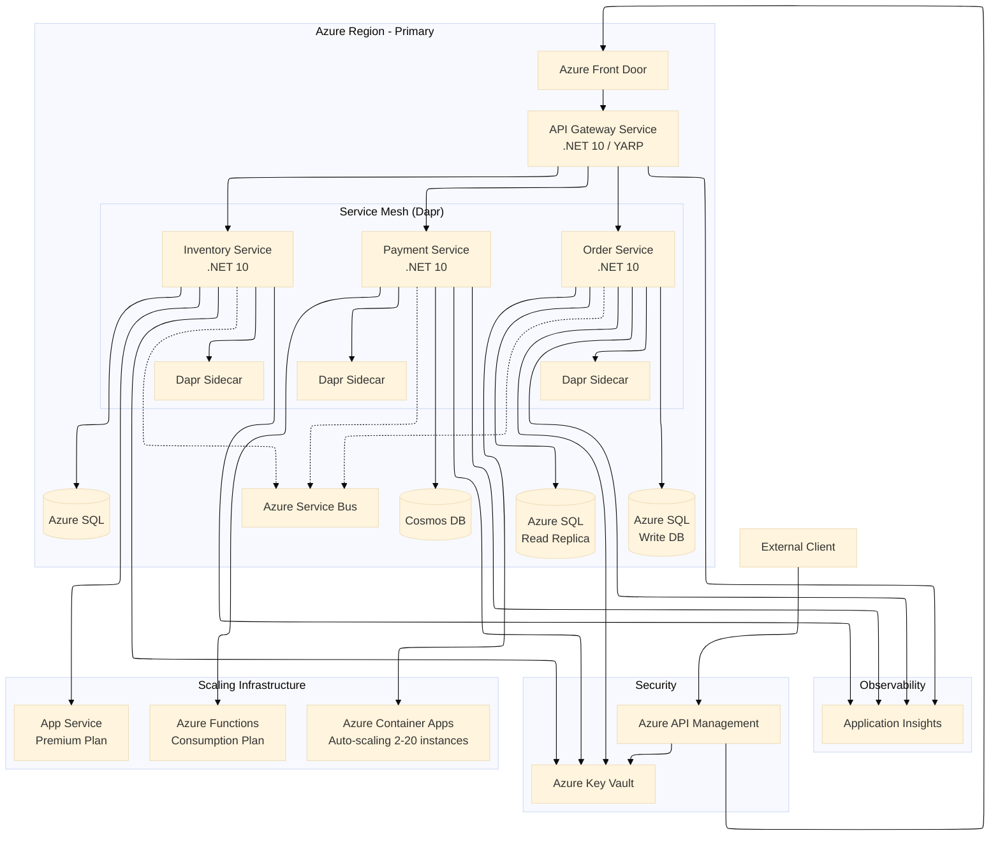

# ### High-Level Architecture

```mermaid
---
config:
  theme: base
  layout: elk
---
graph TB
    Client[External Client] --> APIM[Azure API Management]
    APIM --> FrontDoor[Azure Front Door]
    
    subgraph "Azure Region - Primary"
        FrontDoor --> Gateway[API Gateway Service<br/>.NET 10 / YARP]
        
        Gateway --> OrderSvc[Order Service<br/>.NET 10]
        Gateway --> PaymentSvc[Payment Service<br/>.NET 10]
        Gateway --> InventorySvc[Inventory Service<br/>.NET 10]
        
        OrderSvc --> OrderDB[(Azure SQL<br/>Write DB)]
        OrderSvc --> OrderReadDB[(Azure SQL<br/>Read Replica)]
        
        PaymentSvc --> PaymentDB[(Cosmos DB)]
        InventorySvc --> InventoryDB[(Azure SQL)]
        
        OrderSvc -.-> SB[Azure Service Bus]
        PaymentSvc -.-> SB
        InventorySvc -.-> SB
        
        subgraph "Service Mesh (Dapr)"
            OrderSvc --> DaprSidecar[Dapr Sidecar]
            PaymentSvc --> DaprSidecar2[Dapr Sidecar]
            InventorySvc --> DaprSidecar3[Dapr Sidecar]
        end
    end
    
    subgraph "Observability"
        OrderSvc --> AppInsights[Application Insights]
        PaymentSvc --> AppInsights
        InventorySvc --> AppInsights
        Gateway --> AppInsights
    end
    
    subgraph "Security"
        APIM --> KV[Azure Key Vault]
        OrderSvc --> KV
        PaymentSvc --> KV
        InventorySvc --> KV
    end
    
    subgraph "Scaling Infrastructure"
        OrderSvc --> ACA[Azure Container Apps<br/>Auto-scaling 2-20 instances]
        PaymentSvc --> Functions[Azure Functions<br/>Consumption Plan]
        InventorySvc --> AppService[App Service<br/>Premium Plan]
    end
```
