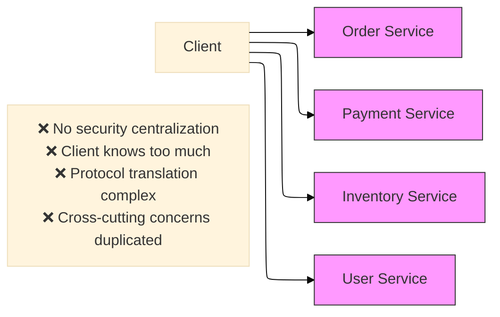

# ### The Problem It Solves

```mermaid
---
config:
  theme: base
  layout: elk
---
graph LR
    Client[Client] --> Order[Order Service]
    Client --> Payment[Payment Service]
    Client --> Inventory[Inventory Service]
    Client --> User[User Service]
    
    style Order fill:#f9f,stroke:#333
    style Payment fill:#f9f,stroke:#333
    style Inventory fill:#f9f,stroke:#333
    style User fill:#f9f,stroke:#333
    
    note1[❌ No security centralization<br/>❌ Client knows too much<br/>❌ Protocol translation complex<br/>❌ Cross-cutting concerns duplicated]
```
