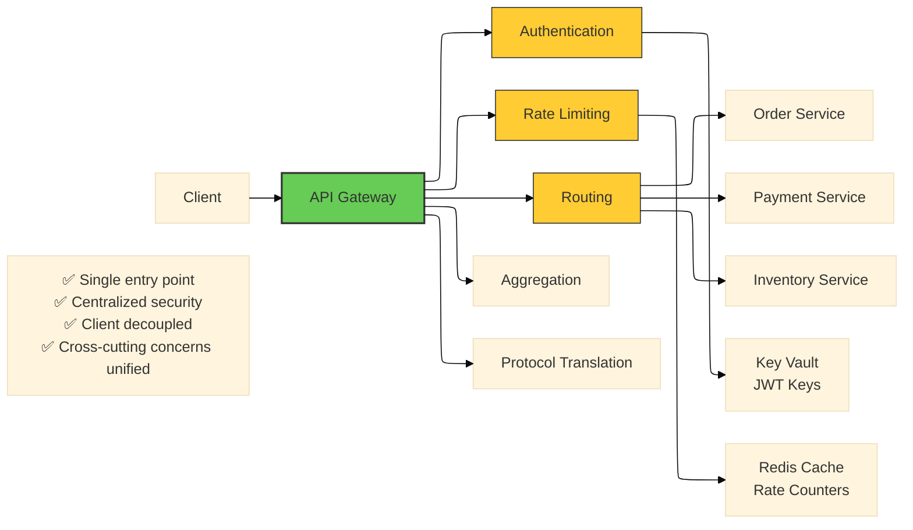

# diagram_03_the-solution-architecture

```mermaid
---
config:
  theme: base
  layout: elk
---
graph LR
    Client[Client] --> Gateway[API Gateway]
    
    Gateway --> Auth[Authentication]
    Gateway --> Rate[Rate Limiting]
    Gateway --> Route[Routing]
    Gateway --> Aggregate[Aggregation]
    Gateway --> Transform[Protocol Translation]
    
    Route --> Order[Order Service]
    Route --> Payment[Payment Service]
    Route --> Inventory[Inventory Service]
    
    Auth --> KV[Key Vault<br/>JWT Keys]
    Rate --> Redis[Redis Cache<br/>Rate Counters]
    
    style Gateway fill:#6c5,stroke:#333,stroke-width:2px
    style Auth fill:#fc3,stroke:#333
    style Rate fill:#fc3,stroke:#333
    style Route fill:#fc3,stroke:#333
    
    note2[✅ Single entry point<br/>✅ Centralized security<br/>✅ Client decoupled<br/>✅ Cross-cutting concerns unified]
```
