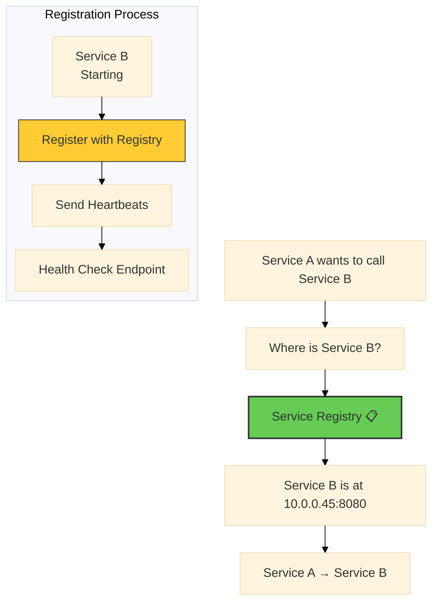

# diagram_04_with-service-discovery

```mermaid
---
config:
  theme: base
  layout: elk
---
graph TD
    Client[Service A wants to call Service B]
    Client --> Lookup["Where is Service B?"]
    Lookup --> Registry[Service Registry 📋]
    Registry --> Response["Service B is at 10.0.0.45:8080"]
    Response --> Call[Service A → Service B]
    
    subgraph "Registration Process"
        S1[Service B<br/>Starting] --> Register[Register with Registry]
        Register --> Heartbeat[Send Heartbeats]
        Heartbeat --> HealthCheck[Health Check Endpoint]
    end
    
    style Registry fill:#6c5,stroke:#333,stroke-width:2px
    style Register fill:#fc3,stroke:#333
```
