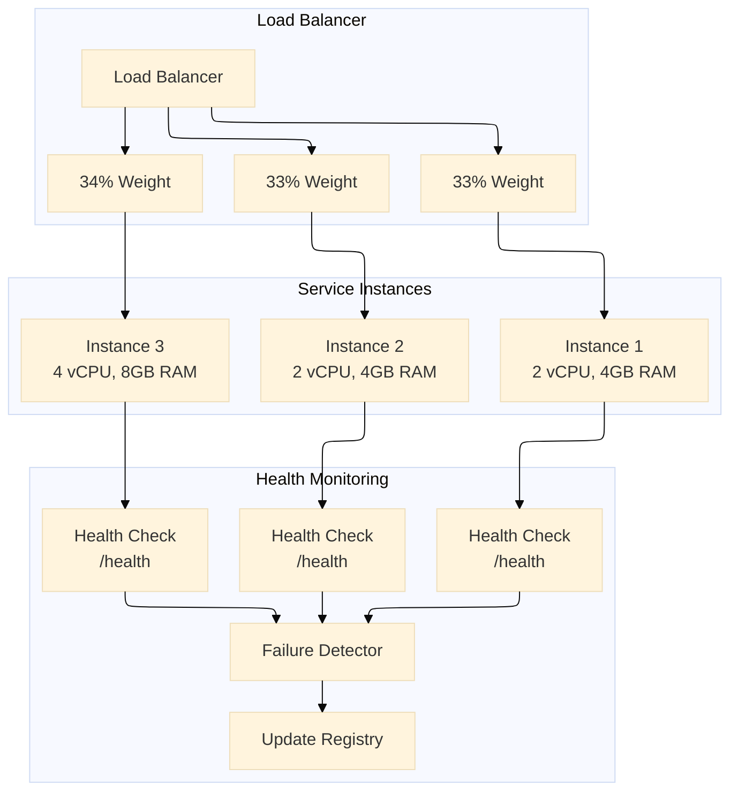

# ### Visual Distribution

```mermaid
---
config:
  theme: base
  layout: elk
---
graph TB
    subgraph "Load Balancer"
        LB[Load Balancer]
        LB --> W1[33% Weight]
        LB --> W2[33% Weight]
        LB --> W3[34% Weight]
    end
    
    subgraph "Service Instances"
        W1 --> I1[Instance 1<br/>2 vCPU, 4GB RAM]
        W2 --> I2[Instance 2<br/>2 vCPU, 4GB RAM]
        W3 --> I3[Instance 3<br/>4 vCPU, 8GB RAM]
    end
    
    subgraph "Health Monitoring"
        I1 --> H1[Health Check<br/>/health]
        I2 --> H2[Health Check<br/>/health]
        I3 --> H3[Health Check<br/>/health]
        H1 --> Detector[Failure Detector]
        H2 --> Detector
        H3 --> Detector
        Detector --> Registry[Update Registry]
    end
```
