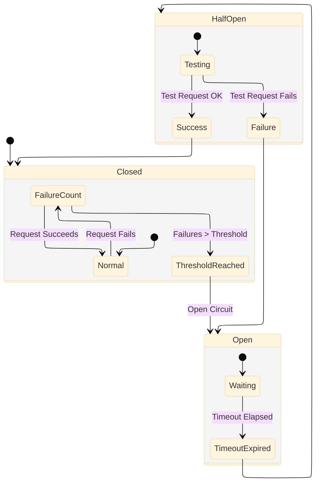

# ### The State Machine

```mermaid
---
config:
  theme: base
  layout: elk
---
stateDiagram-v2
    [*] --> Closed
    
    state Closed {
        [*] --> Normal
        Normal --> FailureCount: Request Fails
        FailureCount --> Normal: Request Succeeds
        FailureCount --> ThresholdReached: Failures > Threshold
    }
    
    ThresholdReached --> Open: Open Circuit
    
    state Open {
        [*] --> Waiting
        Waiting --> TimeoutExpired: Timeout Elapsed
    }
    
    TimeoutExpired --> HalfOpen
    
    state HalfOpen {
        [*] --> Testing
        Testing --> Success: Test Request OK
        Testing --> Failure: Test Request Fails
    }
    
    Success --> Closed
    Failure --> Open
```
