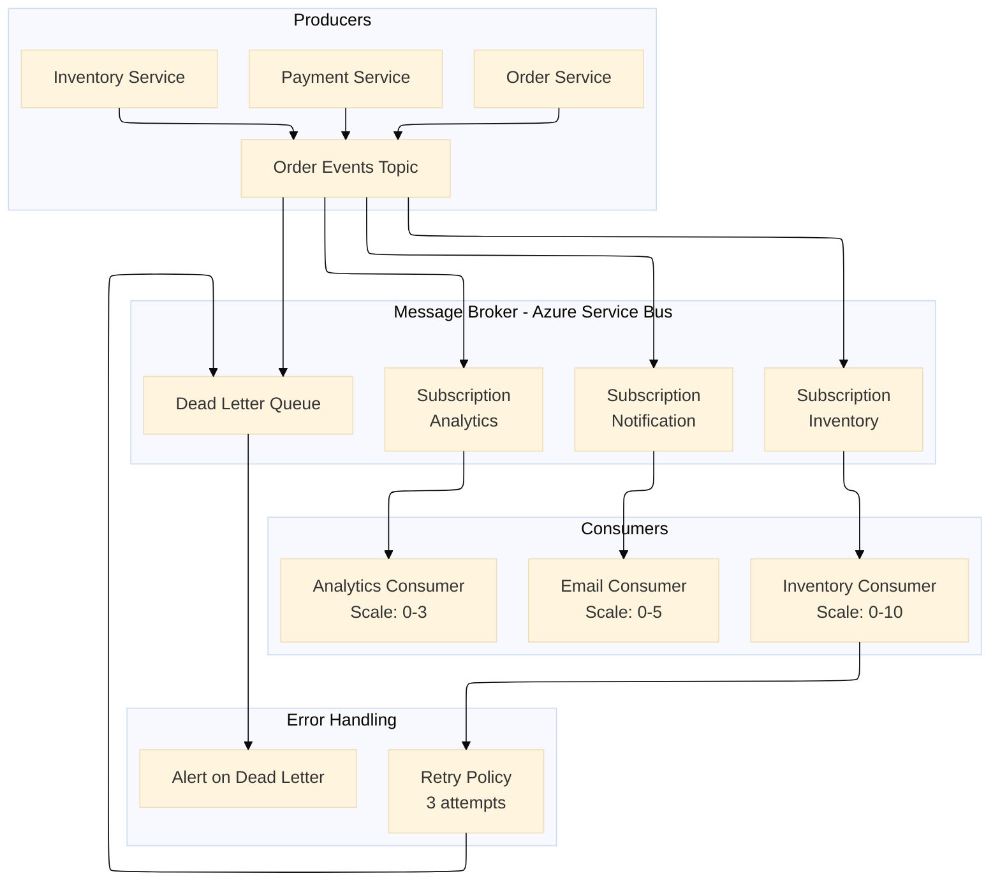

# diagram_07_the-pattern

```mermaid
---
config:
  theme: base
  layout: elk
---
graph TB
    subgraph "Producers"
        P1[Order Service] --> Topic[Order Events Topic]
        P2[Payment Service] --> Topic
        P3[Inventory Service] --> Topic
    end
    
    subgraph "Message Broker - Azure Service Bus"
        Topic --> Sub1[Subscription<br/>Inventory]
        Topic --> Sub2[Subscription<br/>Notification]
        Topic --> Sub3[Subscription<br/>Analytics]
        Topic --> DLQ[Dead Letter Queue]
    end
    
    subgraph "Consumers"
        Sub1 --> C1[Inventory Consumer<br/>Scale: 0-10]
        Sub2 --> C2[Email Consumer<br/>Scale: 0-5]
        Sub3 --> C3[Analytics Consumer<br/>Scale: 0-3]
    end
    
    subgraph "Error Handling"
        C1 --> Retry[Retry Policy<br/>3 attempts]
        Retry --> DLQ
        DLQ --> Monitor[Alert on Dead Letter]
    end
```
