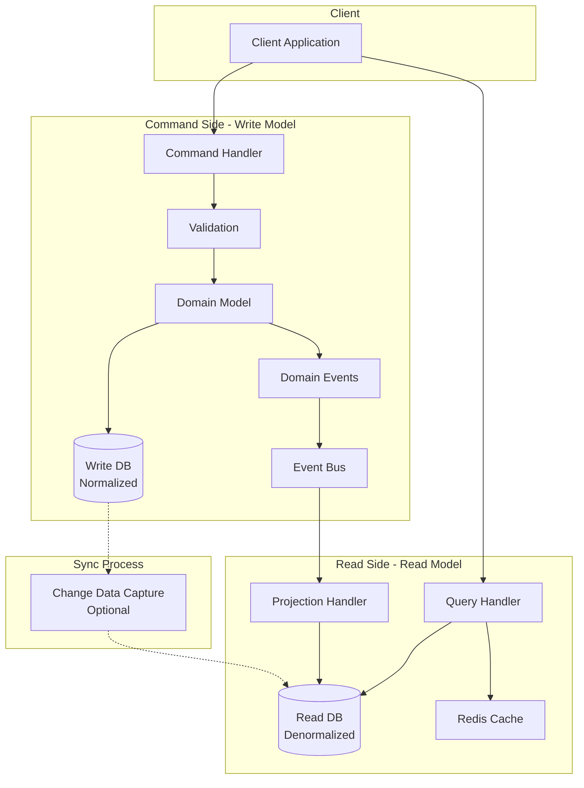

# diagram_02_architecture

```mermaid
graph TB
    subgraph "Client"
        C[Client Application]
    end
    
    subgraph "Command Side - Write Model"
        C --> Command[Command Handler]
        Command --> Validation[Validation]
        Validation --> Domain[Domain Model]
        Domain --> WriteDB[(Write DB<br/>Normalized)]
        Domain --> Events[Domain Events]
        Events --> Bus[Event Bus]
    end
    
    subgraph "Read Side - Read Model"
        Bus --> Projection[Projection Handler]
        Projection --> ReadDB[(Read DB<br/>Denormalized)]
        C --> Query[Query Handler]
        Query --> ReadDB
        Query --> Cache[Redis Cache]
    end
    
    subgraph "Sync Process"
        WriteDB -.-> Sync[Change Data Capture<br/>Optional]
        Sync -.-> ReadDB
    end
```
