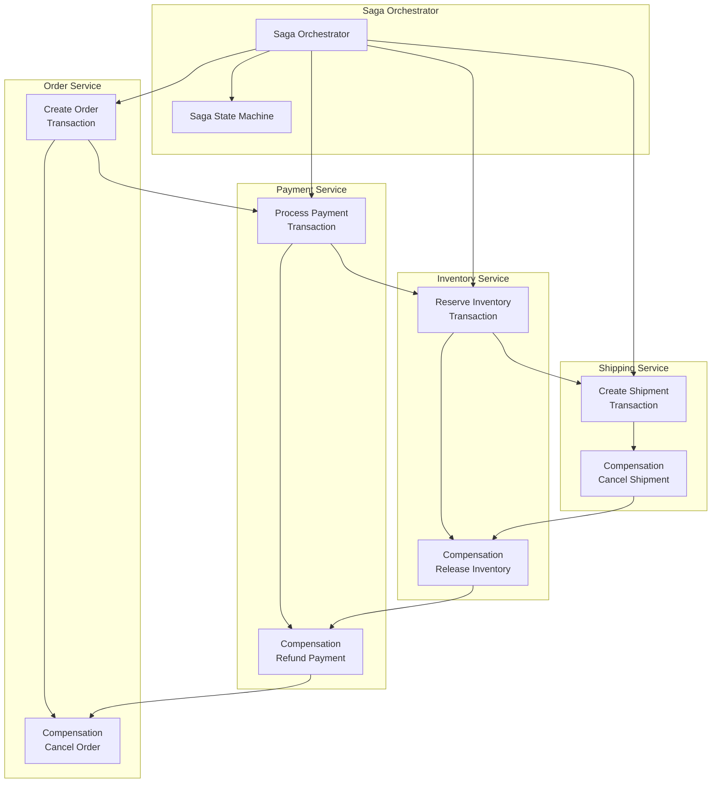

# diagram_03_saga-flow

```mermaid
graph TB
    subgraph "Saga Orchestrator"
        O[Saga Orchestrator]
        O --> State[Saga State Machine]
    end
    
    subgraph "Order Service"
        O --> T1[Create Order<br/>Transaction]
        T1 --> C1[Compensation<br/>Cancel Order]
    end
    
    subgraph "Payment Service"
        O --> T2[Process Payment<br/>Transaction]
        T2 --> C2[Compensation<br/>Refund Payment]
    end
    
    subgraph "Inventory Service"
        O --> T3[Reserve Inventory<br/>Transaction]
        T3 --> C3[Compensation<br/>Release Inventory]
    end
    
    subgraph "Shipping Service"
        O --> T4[Create Shipment<br/>Transaction]
        T4 --> C4[Compensation<br/>Cancel Shipment]
    end
    
    T1 --> T2 --> T3 --> T4
    C4 --> C3 --> C2 --> C1
```
