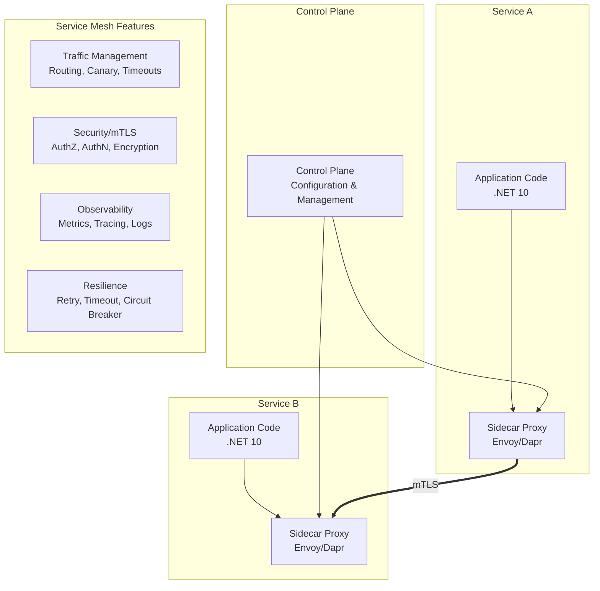

# diagram_04_architecture

```mermaid
graph TB
    subgraph "Service A"
        AppA[Application Code<br/>.NET 10]
        SidecarA[Sidecar Proxy<br/>Envoy/Dapr]
        AppA --> SidecarA
    end
    
    subgraph "Service B"
        AppB[Application Code<br/>.NET 10]
        SidecarB[Sidecar Proxy<br/>Envoy/Dapr]
        AppB --> SidecarB
    end
    
    subgraph "Control Plane"
        CP[Control Plane<br/>Configuration & Management]
        CP --> SidecarA
        CP --> SidecarB
    end
    
    SidecarA == mTLS ==> SidecarB
    
    subgraph "Service Mesh Features"
        Traffic[Traffic Management<br/>Routing, Canary, Timeouts]
        Security[Security/mTLS<br/>AuthZ, AuthN, Encryption]
        Observability[Observability<br/>Metrics, Tracing, Logs]
        Resilience[Resilience<br/>Retry, Timeout, Circuit Breaker]
    end
```
