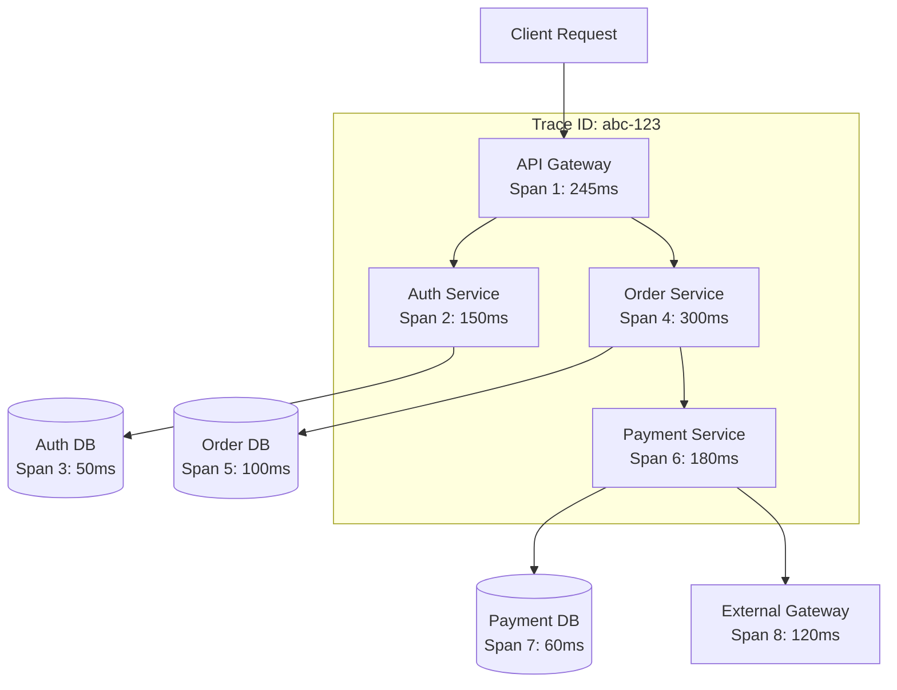

# diagram_05_trace-tree

```mermaid
graph TB
    Client[Client Request] --> Gateway[API Gateway<br/>Span 1: 245ms]
    
    Gateway --> Auth[Auth Service<br/>Span 2: 150ms]
    Auth --> DB1[(Auth DB<br/>Span 3: 50ms)]
    
    Gateway --> Order[Order Service<br/>Span 4: 300ms]
    Order --> DB2[(Order DB<br/>Span 5: 100ms)]
    Order --> Payment[Payment Service<br/>Span 6: 180ms]
    Payment --> DB3[(Payment DB<br/>Span 7: 60ms)]
    Payment --> External[External Gateway<br/>Span 8: 120ms]
    
    subgraph "Trace ID: abc-123"
        Gateway
        Auth
        Order
        Payment
    end
```
