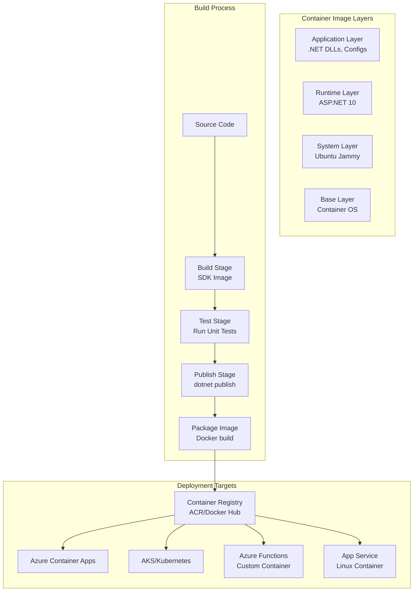

# diagram_06_container-layers

```mermaid
graph TB
    subgraph "Container Image Layers"
        L1[Application Layer<br/>.NET DLLs, Configs]
        L2[Runtime Layer<br/>ASP.NET 10]
        L3[System Layer<br/>Ubuntu Jammy]
        L4[Base Layer<br/>Container OS]
    end
    
    subgraph "Build Process"
        Source[Source Code] --> Build[Build Stage<br/>SDK Image]
        Build --> Test[Test Stage<br/>Run Unit Tests]
        Test --> Publish[Publish Stage<br/>dotnet publish]
        Publish --> Package[Package Image<br/>Docker build]
    end
    
    subgraph "Deployment Targets"
        Package --> Registry[Container Registry<br/>ACR/Docker Hub]
        Registry --> ACA[Azure Container Apps]
        Registry --> AKS[AKS/Kubernetes]
        Registry --> Functions[Azure Functions<br/>Custom Container]
        Registry --> AppService[App Service<br/>Linux Container]
    end
```
