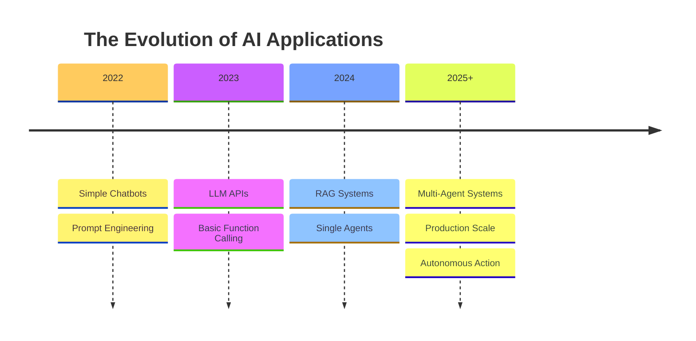
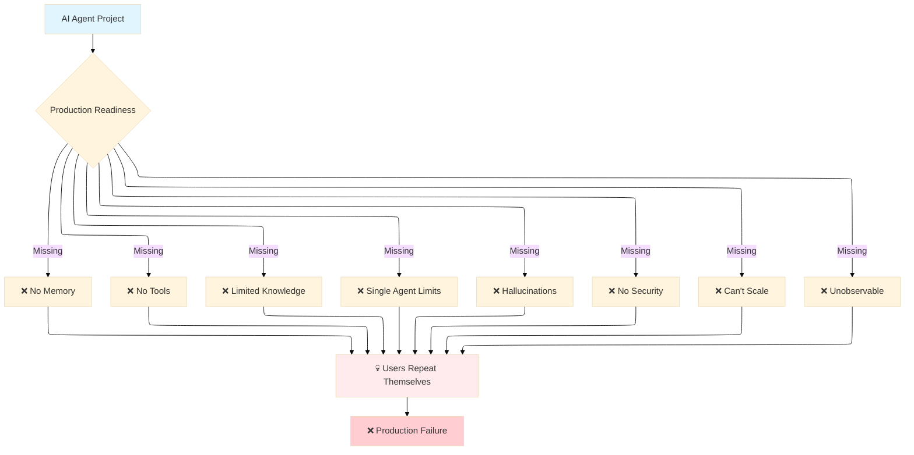
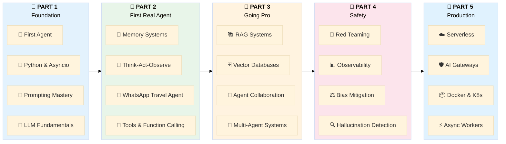
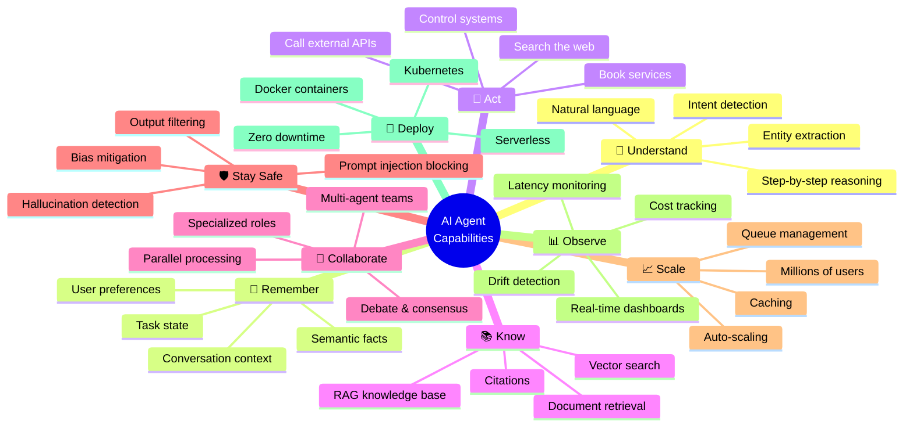
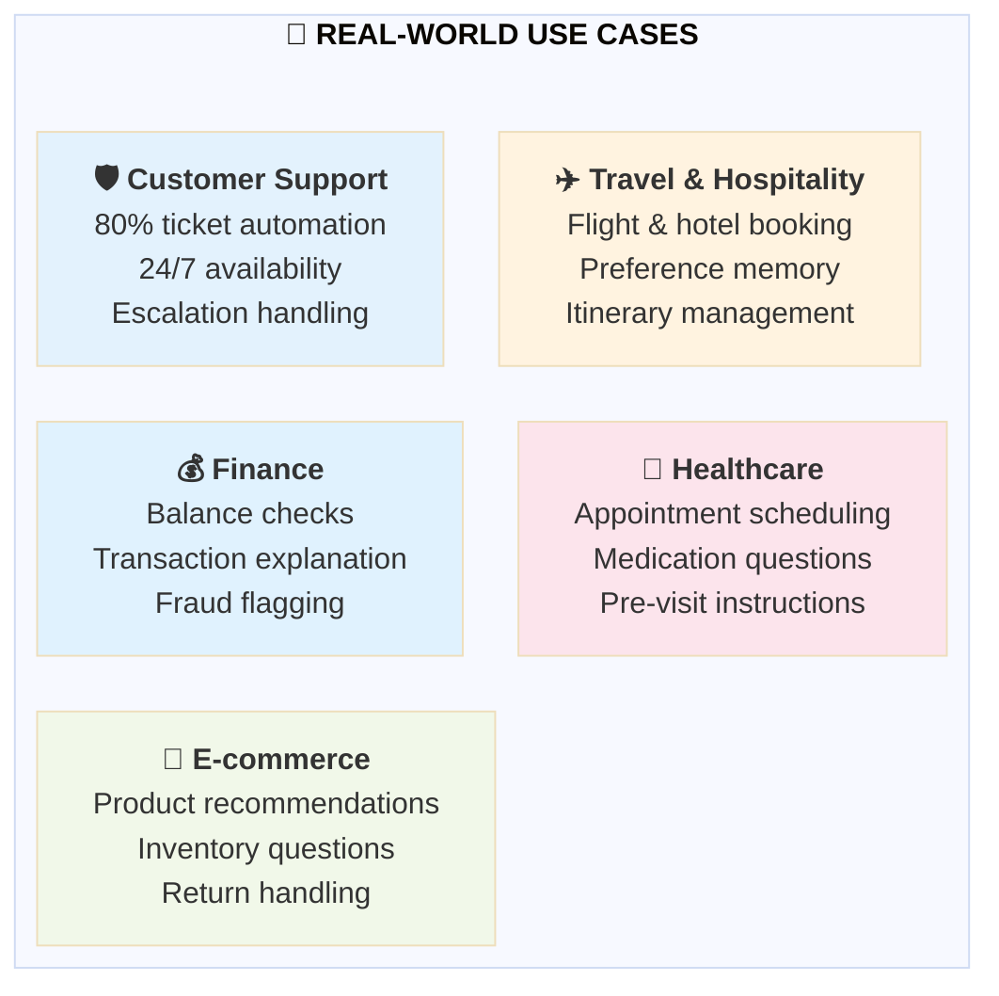
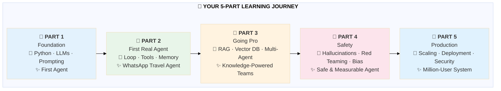
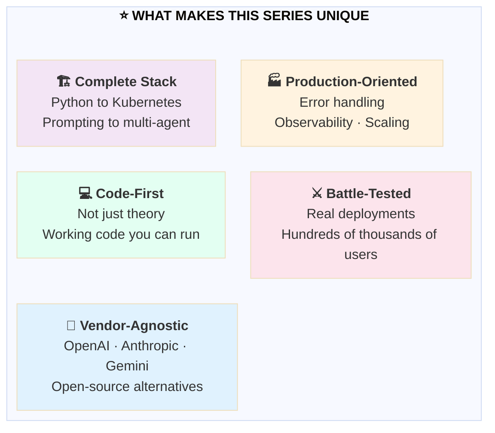
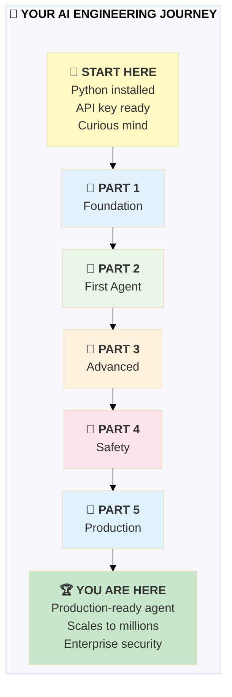
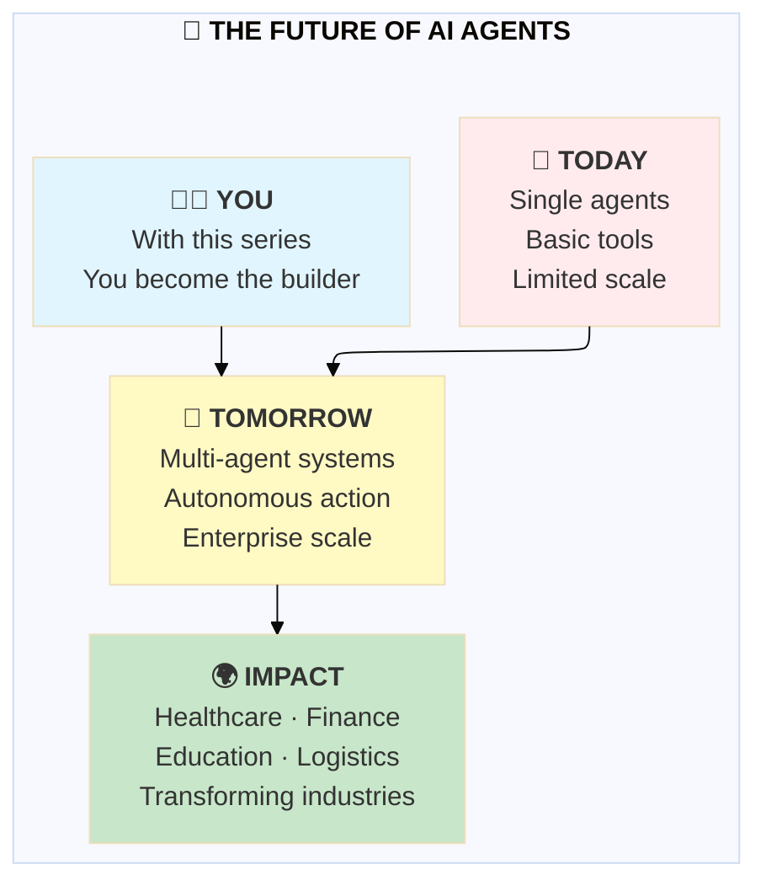

# AI Engineering: The 5-Step Blueprint to Building and Deploying AI Agents That Scale to Millions
### Master Asyncio, LangChain, Vector Databases, Kubernetes, and AI Security for Production Agents

## From Concept to Production — A Complete Journey Through the AI Agent Stack

## 🌟 Introduction: The Great Shift in AI Development

In 2023, we asked LLMs to write poetry and summarize emails. In 2024, we asked them to browse the web and analyze spreadsheets. But today, in 2025 and beyond, we're asking them to do something fundamentally different: **we're asking them to act.**

This is the era of AI agents — autonomous systems that don't just answer questions but execute tasks, use tools, remember context, collaborate with other agents, and operate at scale. They're not chatbots with attitude. They're digital workers that can book your travel, manage your calendar, analyze your documents, and handle customer service conversations across thousands of simultaneous users.

**But here's the challenge:** building an agent that works in a demo is one thing. Building one that scales to millions of users, stays secure against prompt injection attacks, recovers gracefully from API failures, and actually saves you money — that's a completely different discipline.

This five-part series was created to bridge that gap. What you'll find in the following stories isn't just theory. It's the exact patterns, code, and architecture I've used to build production AI agents that serve hundreds of thousands of users across Fortune 500 companies.

---

## 🎯 The Problem: Why Most AI Agents Fail in Production

Before we dive into the solution, let's be honest about why most AI agent projects fail to reach production — or fail once they get there:

| Problem | Reality | Impact |
|---------|---------|--------|
| 🧠 **No memory** | Users repeat themselves every conversation | 40% drop in user satisfaction |
| 🔧 **No tools** | Agents talk but can't act | 0% task completion rate |
| 📚 **Limited knowledge** | Don't know your products or policies | Wrong answers, lost trust |
| 👤 **Single agent limits** | One agent does everything poorly | Jack of all trades, master of none |
| 💭 **Hallucinations** | Confidently wrong answers | Legal liability, brand damage |
| 🔒 **No security** | Prompt injection, data leakage | Security breaches, data loss |
| 📈 **Can't scale** | First viral spike crashes system | Lost users, revenue |
| 📊 **Unobservable** | No metrics, no debugging | Can't fix what you can't measure |

**This series solves every single one of these problems.**

---

## 🔧 The Solution: A 5-Step Blueprint

Over the course of five comprehensive parts, you'll build an AI agent system that evolves from a simple chatbot to a production-scale, secure, multi-agent platform.

---

## 📖 The Five Parts

---

**1. 🏗️ AI Engineering: Foundation & LLM Fundamentals - Part 1** – Python mastery for agents (asyncio, FastAPI, Pydantic), LLM internals (transformers, tokens, context windows), prompting strategies (zero-shot, few-shot, chain-of-thought, ReAct), major LLM APIs (OpenAI, Anthropic, Gemini), development tools (OpenAI Playground, LangSmith, Guardrails AI), and your first working agent.

**✨ Outcome:** By the end of Part 1, you'll have built an agent that can detect user intent (greeting, weather, booking), extract entities like locations and dates, track token usage and estimate costs, maintain basic conversation context, and respond intelligently with fallback mechanisms.

📎 **Read the full story:** [AI Agent Engineering 1 - Foundation & LLM Fundamentals](./AI%20Agent%20Engineering%201%20-%20Foundation%20&%20LLM%20Fundamentals.md)

---

**2. 🤖 AI Engineering: Building Your First Real Agent — Architecture, Tools, and Memory - Part 2** – The think-act-observe autonomous loop that makes agents autonomous, tool design with JSON schemas, tool registry and orchestration, error handling with retries and circuit breakers, short-term memory (conversation buffer), long-term memory (Redis persistence), semantic memory with embeddings, working memory for task state, and a complete WhatsApp travel agent that can search flights, find hotels, and remember user preferences.

**✨ Outcome:** By the end of Part 2, you'll have built an agent that can remember user preferences (window seats, vegetarian meals), search for flights and hotels in real time, execute multi-step booking flows across multiple conversations, handle API failures gracefully, and maintain context across days of conversation.

📎 **Read the full story:** [AI Agent Engineering 2 - Building Your First Agent — Architecture, Tools, and Memory](./AI%20Agent%20Engineering%202%20-%20%20Building%20Your%20First%20Agent%20—%20Architecture,%20Tools,%20and%20Memory.md)

---

**3. 👥 AI Engineering: Going Pro — RAG Systems and Multi-Agent Collaboration - Part 3** – RAG fundamentals and document chunking strategies (fixed, semantic, recursive, structure-based), vector databases (Pinecone, Weaviate, Milvus, Chroma, Qdrant), RAG frameworks (LlamaIndex, LangChain Retrieval, Haystack), multi-agent patterns (planner-executor, supervisor, debate, swarm), and multi-agent frameworks (AutoGen, CrewAI, LangGraph, Semantic Kernel).

**✨ Outcome:** By the end of Part 3, you'll have built a system that can answer questions from a 500-page policy manual with citations, decompose complex tasks into subtasks for specialized agents, coordinate multiple agents working in parallel, resolve conflicting information through agent debate, and scale intelligence horizontally by adding more specialized agents.

📎 **Read the full story:** [AI Agent Engineering 3 - Going Pro — RAG Systems and Multi-Agent Collaboration](./AI%20Agent%20Engineering%203%20-%20Going%20Pro%20—%20RAG%20Systems%20and%20Multi-Agent%20Collaboration.md)

---

**4. 🛡️ AI Engineering: Keeping Agents Safe — Evaluation, Guardrails, and Observability - Part 4** – Hallucination detection (claim extraction, similarity-based, LLM-based detection, guard implementation), red teaming (attack test suites, prompt injection, jailbreak attempts, vulnerability assessment), output validation (business rules enforcement, PII redaction, length checks, automatic fixing), bias mitigation (detection across demographics, fairness testing, response neutralization), evaluation tools (LangSmith, TruLens, DeepEval, Guardrails AI), and observability (token tracking, latency monitoring, cost per request, drift detection, Prometheus, Grafana).

**✨ Outcome:** By the end of Part 4, you'll have built an agent that can detect and block hallucinations before they reach users, survive red team attacks that would break most agents, enforce business rules and compliance requirements, treat all users fairly across demographics, and show you exactly what it costs, how long it takes, and when it's drifting.

📎 **Read the full story:** [AI Agent Engineering 4 - Keeping Agents Safe — Evaluation, Guardrails, and Observability](./AI%20Agent%20Engineering%204%20-%20Keeping%20Agents%20Safe%20—%20Evaluation,%20Guardrails,%20and%20Observability%20.md)

---

**5. 🚀 AI Engineering: Taking Agents to Production — Deployment, Scaling, and Security - Part 5** – Production concepts (async worker pools for concurrency, stateless vs stateful architecture, queues for traffic spikes, tiered caching strategies), infrastructure tools (Docker containers, docker-compose, Kubernetes orchestration with HPA), serverless options (AWS Lambda with Mangum, Azure Functions, cold start optimization), AI gateway and security (rate limiting with fixed window, sliding window, and token bucket algorithms, prompt filtering, output filtering), and enterprise security (AWS Bedrock Guardrails, Azure Content Safety, Kong AI Gateway).

**✨ Outcome:** By the end of Part 5, you'll have built an agent system that can handle 10,000+ concurrent users with async workers, survive viral traffic spikes with priority queues, serve cached responses in milliseconds saving 40%+ on API costs, deploy with zero-downtime using Kubernetes rolling updates, scale automatically based on queue size and CPU usage, block prompt injection attacks and filter harmful outputs, and integrate with enterprise security standards.

📎 **Read the full story:** [AI Agent Engineering 5 - Taking Agents to Production — Deployment, Scaling, and Security](./AI%20Agent%20Engineering%205%20-%20Taking%20Agents%20to%20Production%20—%20Deployment,%20Scaling,%20and%20Security.md)

---

## 🎯 The Complete Picture: What You'll Be Able to Build

---

## 🏗️ Real-World Use Cases You'll Be Able to Build

The patterns you'll learn in this series apply to virtually any industry:

| Industry | Before | After with Your Agent |
|----------|--------|----------------------|
| 🛡️ **Customer Support** | Long wait times, inconsistent answers | 80% automation, 24/7 coverage, consistent quality |
| ✈️ **Travel & Hospitality** | Manual booking, lost preferences | Automated booking, remembered preferences, smart itineraries |
| 🏥 **Healthcare** | Days-long wait for appointments | Instant scheduling, medication guidance, pre-visit prep |
| 💰 **Finance** | Hold times for basic questions | Instant answers, transaction insights, fraud alerts |
| 🛒 **E-commerce** | Cart abandonment from poor search | Personalized recommendations, instant answers, seamless returns |

---

## 📚 Series Structure & Learning Path

Each part is designed to be self-contained but builds on previous concepts:

| Part | Foundation You Build | What You Create |
|------|---------------------|-----------------|
| **1** | Python, LLMs, prompting | Intent detection, basic conversation |
| **2** | Agent loop, tools, memory | WhatsApp travel agent with booking |
| **3** | RAG, vector DBs, multi-agent | Knowledge-powered multi-agent teams |
| **4** | Hallucination detection, red teaming | Safe, measurable, trustworthy agent |
| **5** | Scaling, deployment, security | Production-ready system for millions |

---

## 🎓 What Makes This Series Different

1. **💻 Code-First, Not Theory-First** — Every concept comes with working code you can run, modify, and deploy
2. **🏭 Production-Oriented** — We don't stop at "it works on my machine" — error handling, observability, scaling
3. **🏗️ Complete Stack Coverage** — From Python fundamentals to Kubernetes deployment, from prompting to multi-agent orchestration
4. **⚔️ Battle-Tested Patterns** — Every pattern comes from real production deployments serving hundreds of thousands of users
5. **🔌 Vendor-Agnostic** — We cover OpenAI, Anthropic, Google Gemini, and open-source alternatives

---

## 🚀 Your Journey Starts Now

The field of AI agents is moving faster than any technology I've seen. But the fundamentals you'll learn in this series — the architecture patterns, the evaluation strategies, the security considerations, the production best practices — these will remain relevant for years to come.

**What you'll need to begin:**
- 🐍 Python 3.11+ installed
- 🔑 An OpenAI API key (free credits available)
- 💻 Basic programming experience
- 🧠 A curious mind and willingness to build

**What you'll have by the end:**
- 🚀 A complete production-ready AI agent system
- 🧠 Deep understanding of every layer of the AI stack
- 💪 The confidence to build agents that scale to millions of users
- 📁 A portfolio of working code you can adapt for any use case

---

## 🌟 Conclusion: The Future Is Built by Engineers Like You

The most exciting applications of AI haven't been built yet. The agents that will transform industries — in healthcare, finance, education, logistics — are waiting to be created. And now, you have the complete blueprint to build them.

Remember: every production-scale AI system started as a simple agent. The difference between an idea and a product is execution. This series gives you the execution path.

**Let's build something amazing.** 🚀

## 📖 Series Overview
**👉 [Explore the complete blueprint: AI Engineering: The 5-Step Blueprint to Building and Deploying AI Agents That Scale to Millions](#)** — This story is part of the complete AI Engineering series, a comprehensive guide that takes you from Python fundamentals to production-scale agent deployment, with detailed overviews, architecture diagrams, and the full learning journey.

**1. 🏗️ AI Engineering: Foundation & LLM Fundamentals - Part 1** – Python mastery for agents, LLM internals, prompting strategies, major LLM APIs, development tools, and your first working agent. *Comming soon*

---

**2. 🤖 AI Engineering: Building Your First Real Agent — Architecture, Tools, and Memory - Part 2** – The think-act-observe autonomous loop, tool design with JSON schemas, tool registry, short-term and long-term memory systems, semantic memory with embeddings, and a complete WhatsApp travel agent. *Comming soon*

---

**3. 👥 AI Engineering: Going Pro — RAG Systems and Multi-Agent Collaboration - Part 3** – RAG fundamentals, chunking strategies, vector databases (Pinecone, Weaviate, Chroma, Qdrant), RAG frameworks (LlamaIndex, LangChain), multi-agent patterns (planner-executor, supervisor, debate, swarm), and frameworks (AutoGen, CrewAI, LangGraph). *Comming soon*

---

**4. 🛡️ AI Engineering: Keeping Agents Safe — Evaluation, Guardrails, and Observability - Part 4** – Hallucination detection, red teaming, output validation, bias mitigation, evaluation tools (LangSmith, TruLens, DeepEval), and observability (token tracking, latency, cost, drift detection). *Comming soon*

---

**5. 🚀 AI Engineering: Taking Agents to Production — Deployment, Scaling, and Security - Part 5** – Async worker pools, stateless vs stateful architecture, queues, caching strategies, Docker and Kubernetes deployment, serverless options (AWS Lambda, Azure Functions), AI gateways with rate limiting and prompt filtering, and enterprise security (AWS Bedrock Guardrails, Azure Content Safety, Kong). *Comming soon*

---

*📌 Save this guide to your reading list — it's your roadmap to becoming an AI Agent Engineer.*

**🔗 Follow me for updates:**
- [Medium](https://mvineetsharma.medium.com)
- [LinkedIn](https://www.linkedin.com/in/vineet-sharma-architect)

*In-depth .NET, Node.js, Python, Cloud Architecture, and System Design. New articles weekly.*

---

