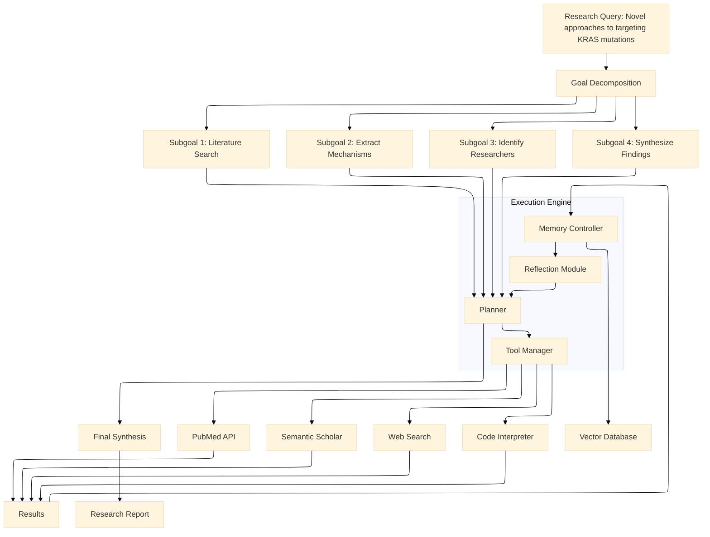
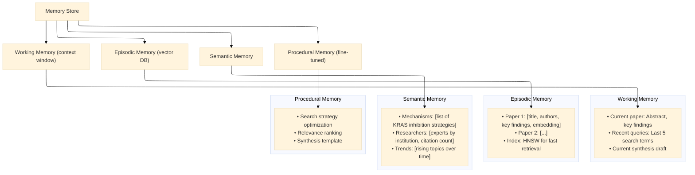
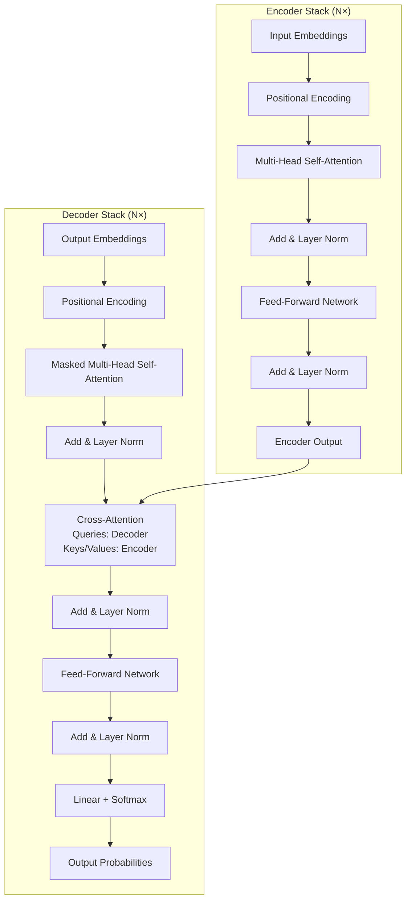

# AI From the Top Down: How Agentic Systems, Generative Models, and Symbolic Logic Build Intelligence

**A Technical Exploration of the Cognitive Technology Hierarchy**

Technology architecture has evolved from simple client-server models to something far more profound: cognitive systems that mimic the very structure of thought. When examining the AI Technology Hierarchy, one discovers a layered foundation that resembles a geological cross-section of intelligence itself—solid logic at the bottom, statistical patterns above, and emergent agency at the summit.

This is a technical examination of how intelligence is constructed from the ground up, layer by layer, with detailed exploration of each component and its practical applications. We begin at the apex—where intelligence becomes active and purposeful—and descend through the foundations that make it possible.

---

## Layer 7: Agentic AI

**The Layer Contains:** *Agentic AI, Goal Decomposition, Task Planning, Tool Integration, Environment Interaction, Memory Systems, Long-Term Context, Self-Reflection, Prompt Engineering*

At the apex of the stack lies **agency**—the ability to pursue goals over time, interact with environments, and reflect on outcomes. This is where intelligence transitions from reactive to proactive, from answering questions to pursuing objectives.

### Detailed Concept Explanations

**Agentic AI:**
Systems that exhibit goal-directed behavior over extended time horizons, interacting with environments, using tools, and adapting based on outcomes. Unlike reactive AI (respond to single query), agentic AI maintains internal state, formulates plans, and executes multi-step workflows.

**Key characteristics:**
- **Autonomy:** Operate without continuous human intervention
- **Goal-directed:** Actions chosen to achieve specified objectives
- **Situatedness:** Perceive and act upon environment
- **Persistence:** Maintain identity and memory across interactions
- **Adaptivity:** Modify behavior based on experience

**Goal Decomposition:**
The process of breaking high-level objectives into hierarchical subgoals that can be executed sequentially or in parallel.

**Techniques:**
- **Hierarchical planning:** Abstract goals decomposed into concrete subgoals
- **Means-ends analysis:** Compare current state to goal, identify differences, select actions that reduce differences
- **Task decomposition trees:** AND/OR graphs showing subgoal relationships
- **Recursive decomposition:** Subgoals themselves decomposed further

Example: "Plan vacation to Paris" →
- Transportation: Book flights
- Accommodation: Reserve hotel
- Activities: Research attractions, book tours
- Logistics: Check visa requirements, arrange airport transfer
- Budget: Calculate total cost, allocate spending

**Task Planning:**
Generating sequences of actions to achieve goals. Planning algorithms consider:
- **Preconditions:** What must be true before action
- **Effects:** What becomes true after action
- **Constraints:** Temporal ordering, resource limits, dependencies
- **Uncertainty:** Probabilistic outcomes requiring contingency plans

**Planning approaches:**
- **Classical planning:** Deterministic, fully observable (STRIPS, PDDL)
- **Hierarchical planning:** Abstract actions refined to primitives (HTN)
- **Probabilistic planning:** Markov Decision Processes, POMDPs
- **Reactive planning:** Condition-action rules for dynamic environments

**Tool Integration:**
The ability to call external functions, APIs, and services to extend capabilities beyond the model's internal knowledge.

**Tool types:**
- **Information retrieval:** Web search, database queries, document retrieval
- **Computation:** Code interpreter, calculator, symbolic math
- **Action execution:** Send email, book calendar, control devices
- **Specialized APIs:** Weather, maps, financial data, domain-specific services

**Integration patterns:**
- **Function calling:** Model generates structured arguments for predefined functions
- **ReAct (Reason + Act):** Interleave reasoning traces with actions
- **Toolformer:** Fine-tune model to decide when and how to use tools
- **Automatic tool discovery:** Model searches for and learns to use new tools

**Environment Interaction:**
Agents exist within environments (digital or physical) that respond to actions. The perception-action loop:

1. **Observe:** Perceive current state through sensors/APIs
2. **Interpret:** Understand state relative to goals
3. **Decide:** Select next action based on policy/plan
4. **Act:** Execute action, affecting environment
5. **Learn:** Update internal models based on outcomes

**Environment types:**
- **Fully observable:** Agent sees complete state
- **Partially observable:** Agent sees only subset (requires memory)
- **Deterministic:** Action outcomes predictable
- **Stochastic:** Outcomes probabilistic
- **Episodic:** Each interaction independent
- **Sequential:** Current actions affect future options

**Memory Systems:**
Architectures for storing, retrieving, and using information across time.

**Memory types:**

1. **Working memory (short-term):**
   * Current conversation context
   * Recent actions and observations
   * Typically implemented as context window (limited capacity)

2. **Episodic memory (long-term):**
   * Past interactions, experiences, outcomes
   * Stored as retrievable episodes
   * Implemented via vector databases for similarity search

3. **Semantic memory (long-term):**
   * Factual knowledge extracted from experience
   * General principles and patterns
   * May be stored in model weights or external knowledge bases

4. **Procedural memory:**
   - How to perform actions
   - Skills and procedures
   - May be implemented as fine-tuned capabilities

**Retrieval mechanisms:**
- **Dense retrieval:** Encode queries and memories, find nearest neighbors
- **Reranking:** Score retrieved candidates for relevance
- **Memory consolidation:** Important episodic memories converted to semantic over time

**Long-Term Context:**
The ability to maintain coherence across extended interactions spanning hours, days, or longer.

**Challenges:**
- **Context window limits:** Models can't attend to entire history
- **Relevance determination:** What past information matters now?
- **Memory decay:** Older information should be less accessible unless important

**Solutions:**
- **Summarization:** Periodically compress conversation history
- **Retrieval-augmented generation:** Retrieve relevant past contexts when needed
- **Hierarchical memory:** Recent in working memory, older in retrievable storage
- **Attention with memory:** Models that can attend to stored memories

**Self-Reflection:**
Meta-cognitive processes where agents evaluate their own performance, reasoning, and outputs.

**Reflection types:**
- **Outcome evaluation:** Did I achieve the goal? How well?
- **Process analysis:** Was my approach optimal? What could I improve?
- **Error identification:** Where did I go wrong? Why?
- **Learning extraction:** What should I remember for next time?

**Implementation approaches:**
- **Self-critique:** Generate evaluation of own output
- **Reflection prompts:** "Review your work and identify improvements"
- **Value functions:** Learned models predicting outcome quality
- **Monte Carlo Tree Search:** Explore alternative paths, reflect on outcomes

**Applications:**
- Self-improving agents that learn from mistakes
- Quality assurance before delivering results
- Explanation generation for human oversight

**Prompt Engineering:**
The discipline of designing inputs to effectively guide AI behavior. In agentic systems, prompts become complex programs controlling agent behavior.

**Prompt components:**
- **System prompt:** Core instructions, persona, constraints
- **Task specification:** Current goal and requirements
- **Context:** Relevant history and information
- **Tools:** Available functions and how to use them
- **Examples:** Few-shot demonstrations of desired behavior
- **Output format:** Structured specifications for parsing

**Advanced techniques:**
- **Chain-of-thought:** Encourage step-by-step reasoning
- **Self-consistency:** Sample multiple reasoning paths, vote
- **Tree of thoughts:** Explore multiple reasoning branches
- **ReAct:** Interleave reasoning and action
- **Reflexion:** Self-reflection to improve future attempts

### Practical Use Case: Autonomous Research Assistant

A pharmaceutical research company needs to accelerate literature review for drug discovery.

**The Challenge:** Thousands of new papers published daily. Researchers spend 40% of time reading, summarizing, and synthesizing literature. Critical connections between papers missed due to human cognitive limits.

**The Solution:** An agentic system that autonomously conducts research:

**System Architecture:**



**Detailed Workflow:**

1. **Goal Decomposition:**
   - System prompt defines research scientist persona
   - Query decomposed: "Targeting KRAS mutations"
   - Creates subgoals: mechanisms, clinical trials, resistance, combination therapies

2. **Task Planning:**
   - Priority order: recent papers first
   - Dependencies: understand mechanisms before analyzing trials
   - Resource allocation: search depth based on relevance

3. **Tool Integration:**
   - **PubMed API:** Search by keywords, MeSH terms
   - **Semantic Scholar:** Citation analysis, influential papers
   - **Web search:** Company websites, press releases
   - **Code interpreter:** Analyze statistics, create visualizations

4. **Memory Management:**
   - Working memory: Current paper being analyzed
   - Episodic memory: Papers read, key findings (vector DB)
   - Semantic memory: Emerging patterns, researcher expertise
   - Long-term context: Entire research session persists across days

5. **Environment Interaction:**
   - Rate limiting respected (delay between API calls)
   - Captchas detected and flagged for human
   - Paywalled papers noted for manual retrieval

6. **Self-Reflection:**
   - After 50 papers: "I've found consistent mechanisms, but clinical trial data sparse. Should expand search to preclinical studies."
   - After synthesizing: "My summary lacks dosing information. Re-query with 'KRAS inhibitor dosage'."
   - Quality check: "Three key papers from 2023 missing—expand date range."

**Memory Architecture Detail:**



**Prompt Engineering Strategy:**

```
System: You are a senior pharmaceutical researcher with 15 years experience in oncology drug discovery. You have access to search tools, a code interpreter, and a memory system. Think step by step. Reflect on your work. Produce comprehensive, accurate research.

Task: Investigate novel approaches to targeting KRAS mutations, focusing on papers from 2022-2024.

Current Context: [Memory summary of previous session]

Available Tools:
- search_pubmed(query, max_results): Returns papers
- get_full_text(paper_id): Retrieves full paper
- analyze_citations(paper_id): Returns citation network
- run_python(code): Executes analysis
- write_to_memory(key, value): Stores for future

Guidelines:
- Prioritize high-impact journals and highly cited papers
- Track conflicting findings and note controversies
- Identify promising therapeutic candidates
- Flag papers requiring paywall access

Output Format: Provide final synthesis as structured report with sections: Introduction, Mechanisms, Clinical Status, Future Directions, References.
```

**Outcome:**

- **Day 1:** Agent processes 847 papers, identifies 47 highly relevant
- **Day 2:** Extracts mechanisms, creates taxonomy of approaches
- **Day 3:** Analyzes clinical trial results, identifies most promising candidates
- **Day 4:** Maps researcher network, identifies collaboration opportunities
- **Day 5:** Generates 25-page research report with visualizations

**Human researcher feedback:** "This would have taken me 3 months. The agent found three papers I'd missed that completely changed our approach to combination therapies."

---

## Layer 6: Generative Architectures

**The Layer Contains:** *Diffusion Architectures, Latent Spaces, Text-to-Image, Fine-Tuning Methods*

Descending from agency, we encounter the systems that enable **creation**. Generative architectures produce novel artifacts that never existed in the training data—the engines that power the agent's ability to create.

### Detailed Concept Explanations

**Diffusion Architectures:**
A class of generative models that learn to reverse a gradual noising process. Inspired by nonequilibrium thermodynamics, diffusion models have become the state-of-the-art for image generation.

**The forward process (destruction):**
Start with clean data x₀. Gradually add small amounts of Gaussian noise over T steps, producing x₁, x₂, ..., x_T. At step T, x_T is nearly pure Gaussian noise. This is fixed—no learning involved.

Mathematically: q(x_t|x_{t-1}) = N(x_t; √(1-β_t)x_{t-1}, β_tI)

**The reverse process (creation):**
Learn to reverse the forward process: start with pure noise x_T, gradually denoise to recover x₀. A neural network (typically U-Net with attention) predicts the noise that was added at each step, or directly predicts the denoised image.

Training objective: Minimize difference between predicted noise and actual noise added.

**Sampling:** Start with random noise, iteratively apply the reverse process for T steps to generate a novel image.

**Advantages over previous generative models (GANs):**
- Stable training (no adversarial dynamics)
- Better mode coverage (captures full data distribution)
- Scalable to high resolutions

**Latent Spaces (in generative context):**
Modern diffusion models rarely operate on pixels directly. Instead:

1. **Compression:** Train VAE to compress 512×512×3 images to 64×64×4 latent codes (∼48× compression)
2. **Diffusion:** Run diffusion process in this compressed latent space
3. **Decompression:** Decode final latent to pixels

Benefits:
- Computational efficiency (smaller representations)
- Semantic focus (latent space already captures meaningful features)
- Quality (diffusion works better in semantically structured space)

**Text-to-Image:**
Conditioning diffusion models on text prompts enables text-guided generation.

**Mechanism:**
- Text prompt encoded via transformer (often CLIP text encoder)
- Text embeddings injected into diffusion model via cross-attention layers
- During denoising, model attends to text representation to guide generation

**Architecture components:**
- **Text encoder:** Frozen pretrained model
- **Diffusion model:** U-Net with cross-attention to text
- **Image decoder:** VAE decoder (if latent diffusion)
- **Upsampling:** Additional models to increase resolution

**Leading examples:** DALL-E 2/3, Stable Diffusion, Imagen, Midjourney.

**Fine-Tuning Methods:**
Techniques for adapting pretrained generative models to specific domains, styles, or concepts without training from scratch.

**Full fine-tuning:** Update all weights on domain-specific data. Powerful but:
- Requires significant data
- Computationally expensive
- Risk of catastrophic forgetting (model loses general capabilities)

**Parameter-efficient fine-tuning:**

- **LoRA (Low-Rank Adaptation):** Inject trainable rank decomposition matrices into model layers. For a weight matrix W, learn ∆W = BA where B∈R^{d×r}, A∈R^{r×k} with r << min(d,k). Only ∆W updated during fine-tuning (∼0.1-1% of parameters). Original W frozen.

- **Adapter layers:** Insert small trainable feed-forward networks between frozen layers. Only adapters updated.

- **Prefix tuning:** Learn virtual tokens prepended to input, keeping model frozen.

- **DreamBooth:** Fine-tune on 3-5 images of specific subject with class-specific preservation loss.

- **Textual inversion:** Learn new embeddings for specific concepts while keeping model frozen.

**Applications:**
- Style adaptation (generate images in specific artist's style)
- Subject personalization (generate pictures of your dog in any setting)
- Domain adaptation (generate medical images, satellite imagery)
- Concept removal (fine-tune to avoid generating harmful content)

### Practical Use Case: Architectural Design Assistance

An architectural firm wants to accelerate conceptual design phases by generating design variations from client requirements.

**The Challenge:** Early design exploration is time-intensive. Clients struggle to articulate visual preferences. Generating 20 concept sketches might take a week. Exploring style variations requires starting over.

**The Solution:** A text-to-image pipeline fine-tuned on architectural imagery:

**Base Model:** Stable Diffusion XL (pretrained on general images)

**Fine-Tuning Strategy:**

1. **Domain adaptation (LoRA):**
   - Dataset: 50,000 architectural images (buildings, interiors, landscapes)
   - Rank r=64 LoRA adapters trained on 8 GPUs for 2 days
   - Result: Model understands architectural terminology, building structures, materials

2. **Style personalization (DreamBooth):**
   - Each architect in firm contributes 10-20 examples of their preferred style
   - Class-specific preservation loss prevents overfitting
   - Result: Generate in "Johnson's style" or "Minimalist school"

3. **Concept embedding (Textual inversion):**
   - Client shows 3-5 inspiration images
   - Learn new embedding tokens S* representing client's taste
   - Combine with architectural prompts: "S* modern villa with pool"

**Workflow:**
- Architect enters: "sustainable office building with green roof, floor-to-ceiling windows, wooden structure"
- System generates 8 variations in seconds
- Architect selects preferred direction, iterates: "more cantilever, less glass, add solar panels"
- Final concepts presented to client with 50 variations in 2 hours vs. 2 weeks

**Technical Details:**
- **Guidance scale:** 7.5 (balance between prompt adherence and diversity)
- **Negative prompts:** "ugly, deformed, low quality, poorly lit"
- **Upscaling:** 512×512 → 2048×2048 via separate upsampling model
- **Inpainting:** Client wants to change window style? Mask and regenerate

**Outcome:**
- Conceptual design phase reduced from 3 weeks to 2 days
- Client satisfaction improves (they see possibilities they couldn't articulate)
- Architects explore 10× more variations, discovering novel combinations

---

## Layer 5: Representational Spaces

**The Layer Contains:** *Embedding Layers, Autocoders Models, Variational Autoencoders, Latent Spaces, Multimodal Systems*

Below generation lies the substrate upon which generation operates: **representation**. This layer creates the spaces where meaning lives—the conceptual playground that generative models navigate.

### Detailed Concept Explanations

**Embedding Layers:**
Learnable mappings from discrete objects (words, entities, categories) to continuous vector spaces. Instead of representing "dog" as a one-hot vector (10,000 dimensions with a single 1), embedding represents it as a dense vector (typically 100-1000 dimensions) where similar objects have similar vectors.

**Properties:**
- **Dimensionality reduction:** 10,000 categories → 300 dimensions
- **Semantic relationships captured geometrically:** `king - man + woman ≈ queen`
- **Learned during training:** Embeddings optimize for the task at hand

**Critical techniques:**
- **Word2Vec:** Skip-gram and CBOW architectures for learning word embeddings
- **GloVe:** Global vectors leveraging co-occurrence statistics
- **FastText:** Subword information for rare words and morphological understanding

**Applications:** Input layer for virtually all NLP systems, recommendation systems (user/item embeddings), graph neural networks (node embeddings).

**Autoencoders Models:**
Neural networks trained to reconstruct their input through a bottleneck layer. Architecture consists of:
- **Encoder:** Compresses input to lower-dimensional representation
- **Bottleneck (latent code):** Compressed representation, forced to capture most important features
- **Decoder:** Reconstructs original input from bottleneck

Training objective: Minimize reconstruction error (difference between input and output).

**Applications:**
- **Dimensionality reduction:** Alternative to PCA (can capture nonlinear relationships)
- **Denoising:** Train to reconstruct clean input from corrupted version
- **Anomaly detection:** High reconstruction error indicates anomalous input
- **Pretraining:** Encoder weights can initialize supervised models

**Variational Autoencoders (VAEs):**
A probabilistic spin on autoencoders that learns the parameters of a probability distribution rather than a single point. Instead of encoding input to a point, encoder outputs parameters (mean, variance) of a Gaussian distribution. The decoder samples from this distribution during reconstruction.

**Key innovations:**
- **Continuous latent space:** Moving smoothly in latent space produces smooth changes in output
- **Generative capability:** Can sample novel points from latent prior and decode to generate new examples
- **Regularization:** KL divergence term forces latent distributions toward standard normal

**The reparameterization trick:** Sampling made differentiable by expressing sample as mean + epsilon × variance (epsilon sampled from standard normal).

**Applications:** Generating faces, creating interpolations between images, drug molecule design, data augmentation.

**Latent Spaces:**
The low-dimensional manifolds where compressed representations live. Properties of well-structured latent spaces:
- **Continuity:** Nearby points decode to similar outputs
- **Completeness:** Points sampled from prior decode to plausible outputs
- **Disentanglement:** Different dimensions capture independent factors of variation (e.g., one dimension controls smile, another controls hair color)

Latent spaces become the "conceptual playground" where operations on ideas become possible—adding concepts, traversing between examples, exploring variations.

**Multimodal Systems:**
Architectures that learn joint representations across different data modalities (text, images, audio, video). The goal: align representations so that "dog" in text maps near dog photo in image space.

**Key approaches:**
- **CLIP (Contrastive Language-Image Pretraining):** Dual encoders (text transformer, image vision transformer) trained with contrastive loss to bring matching text-image pairs together, push non-matching apart
- **ImageBind:** Extends to six modalities without paired data for all combinations
- **Flamingo, GPT-4V:** Fuse visual and language representations in single model

**Applications:**
- **Zero-shot classification:** Classify images using text labels without training on those classes
- **Text-to-image generation:** Condition diffusion models on text embeddings
- **Cross-modal retrieval:** Search images with text, or text with images
- **Visual question answering:** Reason about images using natural language

### Practical Use Case: E-commerce Product Discovery

A major online retailer wants to revolutionize how customers search for products.

**The Challenge:** Traditional search relies on text matching and metadata. A customer looking for "a comfortable chair for reading" might not know to search "wingback armchair with padded arms." Visual search exists but can't capture abstract concepts like "cozy" or "modern."

**The Solution:** A multimodal embedding system:

**Architecture:**

1. **Product Embeddings:**
   - **Text encoder (Transformer):** Product titles, descriptions, reviews → 512-dim text embedding
   - **Image encoder (Vision Transformer):** Product photos → 512-dim image embedding
   - **Fusion layer:** Combined embedding (text + image) in shared space

2. **Training with CLIP-style contrastive loss:**
   - Positive pairs: Text and image of same product pulled together
   - Negative pairs: Different products pushed apart
   - Batch size 32,768 for rich comparisons

3. **User Query Embedding:**
   - Same text encoder maps search queries to embedding space
   - Real-time: Compare query embedding to all product embeddings (efficient approximate nearest neighbor search)

**Advanced Features:**

- **Attribute disentanglement:** Latent space dimensions learned to correspond to price range, style, color, material
- **Interpolation:** "More modern than this, but similar color" moves in latent space
- **Multimodal search:** Upload a photo of a room, find products that match the aesthetic

**Outcome:**
- Search conversion rate increases 34%
- New customers find relevant products without knowing "correct" terminology
- Visual search works for abstract concepts: "something that would look good in my living room"

---

## Layer 4: Specialized Architectures for Data Modalities

**The Layer Contains:** *Recurrent Networks, LSTM Networks, Convolutional Networks, Attention Mechanisms, Transformers Architecture*

Below representations lie the specialized engines that process different data types. This layer introduces structures optimized for sequences, spatial data, and relationships.

### Detailed Concept Explanations

**Recurrent Networks (RNNs):**
Neural networks designed for sequential data by maintaining hidden state that persists across time steps. At each step, the network receives:
- Current input
- Previous hidden state
It produces:
- Current output
- Updated hidden state

This recurrence creates a loop that theoretically allows information to persist indefinitely. However, vanilla RNNs struggle with long-range dependencies due to vanishing/exploding gradients through time.

**Applications:** Language modeling, time series prediction, speech recognition, machine translation.

**LSTM Networks (Long Short-Term Memory):**
A specialized RNN architecture designed explicitly to remember information for long periods, introduced by Hochreiter & Schmidhuber (1997). The core innovation: a memory cell with gates controlling information flow.

**Cell state:** The horizontal line running through the top of the LSTM, carrying information unchanged across time steps.

**Three gates (all sigmoid-activated, outputs 0-1):**
- **Forget gate:** Looks at previous hidden state and current input, outputs numbers between 0 and 1 for each cell state component (1 = keep, 0 = forget)
- **Input gate:** Decides which values to update, creates candidate values
- **Output gate:** Decides what to output based on cell state

This gating mechanism allows LSTMs to maintain information for hundreds of steps, solving the vanishing gradient problem that plagues vanilla RNNs.

**Applications:** Handwriting recognition, speech synthesis, music generation, sentiment analysis of long documents.

**Convolutional Networks (CNNs):**
Architectures designed for grid-like data (images, time series, spectrograms) that exploit spatial locality through convolution operations.

**Key concepts:**
- **Convolution:** Sliding a filter (kernel) across the input, computing dot products at each position
- **Parameter sharing:** Same filter applied everywhere, dramatically reducing parameters
- **Local connectivity:** Each neuron connects only to local region (receptive field)
- **Pooling:** Downsampling operations (max pooling, average pooling) that create spatial invariance

**Typical architecture:** Convolutional layers (feature extraction) → Pooling layers (dimensionality reduction) → Fully connected layers (classification)

**Applications:** Image classification, object detection, facial recognition, medical image analysis, video understanding.

**Attention Mechanisms:**
A technique allowing models to focus on relevant parts of input when producing each output. Instead of compressing entire input into fixed vector, attention lets model "look back" at input selectively.

**How it works:**
1. For each output position, compute attention scores between current state and all input positions
2. Convert scores to probabilities (softmax)
3. Weighted sum of input representations using these probabilities

**Benefits:** Solves bottleneck problem in encoder-decoder architectures, provides interpretability (attention weights show what model focuses on), captures long-range dependencies directly.

**Applications:** Machine translation, image captioning, document summarization, question answering.

**Transformers Architecture:**
The breakthrough architecture introduced in "Attention Is All You Need" (Vaswani et al., 2017) that dispenses with recurrence entirely, relying solely on attention mechanisms.

**Core components:**

1. **Self-attention:** Each position attends to all positions in previous layer, capturing dependencies directly without sequential processing. Multi-head attention runs multiple attention operations in parallel, capturing different types of relationships.

2. **Positional encoding:** Since no recurrence or convolution, the model needs information about position. Sinusoidal functions of different frequencies are added to input embeddings, giving the model access to sequence order.

3. **Feed-forward networks:** Each position processed through identical feed-forward network (applied independently per position).

4. **Layer normalization & residual connections:** Stabilize training of deep transformers.

5. **Encoder-decoder structure:** Encoder processes input sequence; decoder generates output sequence attending to encoder outputs.

**Scaling properties:** Transformers parallelize completely during training (unlike RNNs), enabling training on massive datasets with thousands of GPUs. This scaling property led directly to large language models.

**Applications:** GPT, BERT, T5, and virtually every modern language model; also adapted for vision (ViT), speech (Whisper), and multimodal applications.

### Architectural Diagram: Complete Transformer Architecture



### Practical Use Case: Real-Time Translation Service

A global communication platform needs to provide real-time translation across 50 languages for video conferencing.

**The Challenge:** Translation must be:
- **Low-latency:** Sub-second delay for natural conversation
- **Accurate:** Handle idioms, technical terms, cultural nuances
- **Context-aware:** Remember what was said earlier in conversation
- **Scalable:** Support millions of concurrent users

**The Solution:** A transformer-based architecture:

**Architecture Stack:**

1. **Audio Processing (CNN):** Raw audio → spectrograms → speech recognition

2. **Translation (Transformer):** 24-layer encoder, 24-layer decoder, 16 attention heads
   - **Pre-trained:** 500B tokens of parallel text
   - **Fine-tuned:** Domain-specific terminology (medical, legal, technical)

3. **Memory Mechanism (LSTM + Attention):** Conversation history maintained across turns
   - Recent context in working memory
   - Key information extracted to long-term memory via attention

4. **Beam Search Decoding:** Generate multiple candidates, select most probable

**Optimizations:**
- **Knowledge distillation:** Large teacher model trains smaller student model for deployment
- **Quantization:** 8-bit integer inference instead of 32-bit float (4× smaller, 3× faster)
- **Speculative decoding:** Draft model generates candidates, main model verifies

**Outcome:** The system translates 50 languages with <500ms latency, maintaining conversation context for up to 30 minutes. Handles 2M concurrent users during peak hours.

---

## Layer 3: The Neural Architecture

**The Layer Contains:** *Perceptron Models, Backpropagation Algorithm, Weight Initialization, Bias Parameters, Loss Minimization, Gradient Optimization*

Below specialized architectures lie the fundamental building blocks. This layer automates feature discovery by mimicking the biological neuron.

### Detailed Concept Explanations

**Perceptron Models:**
The fundamental computational unit of neural networks, invented by Frank Rosenblatt in 1958. A perceptron:
1. Receives multiple input values
2. Multiplies each by a corresponding weight
3. Sums the weighted inputs
4. Adds a bias term
5. Passes the result through an activation function

Mathematically: `output = activation(Σ(weight_i × input_i) + bias)`

The activation function introduces nonlinearity. Early versions used step functions (output 0 or 1). Modern networks use ReLU, sigmoid, or tanh.

The limitation: A single perceptron can only solve linearly separable problems. It cannot learn XOR—a fact that contributed to the first AI winter.

**Backpropagation Algorithm:**
The breakthrough that made deep learning possible (popularized in 1986 by Rumelhart, Hinton, and Williams). Backpropagation efficiently computes gradients through multilayer networks:

1. **Forward pass:** Input propagates through network to generate prediction
2. **Loss calculation:** Prediction compared to target, producing error
3. **Backward pass:** Error propagates backward through network
4. **Gradient computation:** Chain rule calculates each weight's contribution to error
5. **Weight update:** Weights adjusted in direction that reduces error

This algorithm enables learning in networks with multiple hidden layers, solving the credit assignment problem: which weights contributed how much to the error?

**Weight Initialization:**
The starting values of weights before training. Critical because:
- Zero initialization causes symmetry: all neurons learn same features
- Too large causes exploding gradients (activations saturate, gradients become huge)
- Too small causes vanishing gradients (gradients become near-zero, learning stops)

Standard approaches:
- **Xavier/Glorot initialization:** Weights drawn from distribution with variance = 2/(fan_in + fan_out)
- **He initialization:** Variance = 2/fan_in (optimized for ReLU activations)
- **Random uniform:** Simple but often suboptimal

**Bias Parameters:**
Additional learnable parameters that allow activation functions to shift. Without bias, a neuron's output would always be zero when inputs are zero. Bias provides flexibility to fire (or not) independent of input. Each neuron typically has one bias parameter, learned during training alongside weights.

**Loss Minimization:**
The objective driving all learning. Loss functions quantify "how bad" the current prediction is:
- **Mean squared error (MSE):** For regression tasks
- **Cross-entropy loss:** For classification tasks
- **Hinge loss:** For support vector machines
- **Custom losses:** Domain-specific (e.g., asymmetric costs for false positives vs. false negatives)

The goal: Find weights that minimize loss on training data while generalizing to unseen data.

**Gradient Optimization:**
Algorithms that navigate the loss landscape to find minima:
- **Stochastic Gradient Descent (SGD):** Update weights using gradient of random mini-batch
- **Momentum:** Accumulate velocity in consistent directions
- **Adam:** Adaptive moment estimation—combines momentum with per-parameter learning rates
- **RMSprop:** Adapts learning rates based on gradient magnitudes
- **Adagrad:** Reduces learning rate for frequently updated parameters

Each optimizer represents a different strategy for escaping local minima and finding good solutions efficiently.

### Practical Use Case: Medical Image Diagnosis

A healthcare technology company builds a system for detecting diabetic retinopathy from retinal scans.

**The Challenge:** Early detection prevents blindness, but specialists are scarce. In many regions, patients wait months for screening. Manual reading of retinal scans is time-consuming and subject to human fatigue.

**The Solution:** A deep convolutional neural network:

**Network Architecture:**
- **Input layer:** Retinal images resized to 512×512 pixels, normalized
- **Hidden layers:** 50+ convolutional layers with residual connections
- **Perceptrons:** Millions of neurons organized hierarchically
- **Output layer:** Multi-class classification (no disease, mild, moderate, severe, proliferative)

**Training Process:**
- **Weight initialization:** He initialization (ReLU activations throughout)
- **Loss function:** Weighted cross-entropy (misclassifying severe disease as healthy costs more)
- **Optimizer:** Adam with learning rate 0.001, batch size 32
- **Backpropagation:** Computing gradients through 50+ layers requires careful architecture (residual connections prevent vanishing gradients)

**Challenges Addressed:**
- **Vanishing gradients:** Residual connections (skip connections) allow gradients to flow directly to early layers
- **Overfitting:** Dropout layers randomly deactivate neurons during training
- **Class imbalance:** Severe disease rare; weighted loss and data augmentation compensate

**Outcome:** The system achieves 94% sensitivity and 91% specificity, equivalent to board-certified ophthalmologists. Deployed in rural clinics, it reduces screening wait times from 6 months to 24 hours.

---

## Layer 2: The Statistical Foundation

**The Layer Contains:** *Machine Learning, Supervised Learning, Unsupervised Learning, Regression Models, Classification Models, Feature Engineering, Cross Validation, Model Evaluation*

Below neural networks lies the statistical foundation upon which they were built. Machine Learning abandons the quest for perfect rules in favor of probabilistic patterns extracted from data.

### Detailed Concept Explanations

**Machine Learning:**
A paradigm where systems improve performance on tasks through experience (data). Instead of explicit programming, algorithms identify patterns and make decisions with minimal human intervention. The core premise: performance should improve with more data.

**Supervised Learning:**
Training on labeled examples where each input has a corresponding correct output. The algorithm learns to map inputs to outputs by minimizing error on training data, then generalizes to unseen examples. Applications dominate industry: spam detection, image classification, medical diagnosis.

**Unsupervised Learning:**
Training on unlabeled data where the algorithm discovers hidden structures. No correct answers are provided; the system finds patterns independently. Critical for exploratory data analysis, customer segmentation, and anomaly detection.

**Regression Models:**
Predict continuous numerical values. Linear regression fits a line through data points. Polynomial regression captures curves. More sophisticated versions include ridge regression (L2 regularization), lasso regression (L1 regularization), and support vector regression. Used for price prediction, demand forecasting, temperature estimation.

**Classification Models:**
Predict discrete categories or classes. Logistic regression (despite the name) predicts binary outcomes. Decision trees create if-then rules automatically. Random forests combine many trees. Support vector machines find optimal boundaries between classes. Neural networks handle complex, high-dimensional classification.

**Feature Engineering:**
The art and science of transforming raw data into representations that make machine learning work. Involves:
- **Feature creation:** Deriving new variables from existing ones (extracting day_of_week from timestamp)
- **Feature transformation:** Scaling, normalizing, or transforming distributions (log transforms for skewed data)
- **Feature selection:** Identifying which variables actually matter
- **Dimensionality reduction:** PCA, t-SNE for compressing many features

**Cross Validation:**
A technique for assessing how models will generalize to independent data. The dataset is partitioned into complementary subsets:
- **k-fold cross-validation:** Data split into k folds; model trained on k-1 folds, validated on remaining fold; repeated k times
- **Leave-one-out:** k = n (number of samples), computationally expensive but thorough
- **Stratified cross-validation:** Maintains class distribution proportions in each fold

**Model Evaluation:**
Metrics that quantify model performance, chosen based on task:
- **Classification:** Accuracy, precision, recall, F1-score, ROC-AUC, confusion matrix
- **Regression:** Mean squared error (MSE), R-squared, mean absolute error (MAE)
- **Clustering:** Silhouette score, Davies-Bouldin index, inertia

### Practical Use Case: E-commerce Fraud Detection

An online marketplace processes millions of transactions daily and must identify fraudulent purchases in real-time.

**The Challenge:** Fraud patterns evolve constantly. Rule-based systems (Layer 1) catch known fraud types but miss novel attacks. Each fraudulent transaction costs the company average $185.

**The Solution:** A machine learning pipeline:

**Feature Engineering:**
- **Transaction features:** Amount, product category, time of day, day of week
- **User features:** Account age, previous purchase count, average transaction value, email domain, shipping address consistency
- **Behavioral features:** Time between clicks, mouse movement patterns, device fingerprint, IP geolocation vs. shipping address
- **Derived features:** Ratio of transaction amount to user average, velocity (transactions per hour)

**Model Architecture:**
- **Classification Model:** Gradient-boosted decision trees (XGBoost) processing 200+ features
- **Real-time scoring:** Sub-100ms latency requirement
- **Ensemble component:** Neural network for detecting novel patterns

**Cross-Validation Strategy:**
Time-series cross-validation (training on past, validating on future) to prevent lookahead bias and simulate real-world performance.

**Model Evaluation:**
- Primary metric: Precision at 95% recall (minimize false positives while catching most fraud)
- Business metric: $ saved vs. $ of legitimate transactions blocked

**Outcome:** The system detects 87% of fraudulent transactions with 3.2% false positive rate, saving $47M annually while blocking only 1.8% of legitimate transactions (which require manual review).

---

## Layer 1: The Bedrock of Symbolic Reasoning

**The Layer Contains:** *Classical AI, Symbolic Systems, Logic Reasoning, Expert Systems, Knowledge Representation, Rule Engines, Search Algorithms, Inference Engines, Planning Systems, Cost Functions*

At the deepest foundation lies not computation, but **logic**. Classical AI, often called Symbolic AI or GOFAI (Good Old-Fashioned AI), treats intelligence as a problem of symbolic manipulation—the bedrock upon which all higher layers rest.

### Detailed Concept Explanations

**Classical AI:**
The original paradigm of artificial intelligence, dating from the 1950s-1980s, which assumes intelligence can be achieved by manipulating symbols according to formal rules. It treats cognitive processes as operations on symbolic representations that correspond to real-world objects and concepts.

**Symbolic Systems:**
Computational systems that operate on symbols—discrete tokens that stand for things in the world. A symbol might represent a physical object ("engine_block_428"), a concept ("temperature"), a relationship ("attached_to"), or a property ("metallic"). Symbols can be combined into expressions that represent complex facts.

**Logic Reasoning:**
The application of formal logic to derive conclusions from premises. Two primary forms dominate:
- **Deductive reasoning:** Moving from general rules to specific conclusions (All humans are mortal; Socrates is human; therefore Socrates is mortal)
- **Inductive reasoning:** Moving from specific observations to general rules (Socrates died; Plato died; therefore all humans die)

**Expert Systems:**
One of the first commercially successful AI applications. These systems capture human expertise as collections of IF-THEN rules. MYCIN (1970s) diagnosed bacterial infections using ~600 rules. XCON configured DEC computer systems, saving millions annually. Each rule represented a piece of expert knowledge: IF organism is gram-positive AND morphology is coccus THEN it's likely Streptococcus.

**Knowledge Representation:**
The methodology for encoding knowledge so that a system can use it. Major approaches include:
- **Semantic networks:** Nodes represent concepts, edges represent relationships
- **Frames:** Structured records with slots for attributes and values
- **Description logics:** Formal languages for representing knowledge with defined semantics
- **Ontologies:** Explicit specifications of conceptualizations, defining classes, properties, and relationships

**Rule Engines:**
Software systems that execute production rules (IF-THEN statements) against a working memory of facts. They handle rule matching, conflict resolution (which rule to fire when multiple apply), and rule execution. Modern rule engines like Drools, CLIPS, or IBM ODM can handle thousands of rules operating on millions of facts.

**Search Algorithms:**
Procedures for exploring solution spaces. Critical algorithms include:
- **Uninformed search:** BFS, DFS (no domain knowledge)
- **Informed search:** A*, best-first (use heuristics to guide search)
- **Adversarial search:** Minimax, alpha-beta pruning (for game-playing)
- **Constraint satisfaction:** Backtracking, forward checking

**Inference Engines:**
The "brain" of a symbolic system that applies rules to knowledge. Two primary control strategies:
- **Forward chaining:** Start with facts, apply rules to derive new facts until goal reached (data-driven)
- **Backward chaining:** Start with goal, work backward to find facts that support it (goal-driven)

**Planning Systems:**
Algorithms that generate sequences of actions to achieve goals. STRIPS (Stanford Research Institute Problem Solver) represented actions with:
- **Preconditions:** What must be true before action
- **Effects:** What becomes true after action
Modern planners like GraphPlan or Hierarchical Task Network (HTN) planners handle complex, real-world planning problems.

**Cost Functions:**
Mathematical functions that assign a cost to each possible solution path. In pathfinding, cost might be distance. In manufacturing, cost might be time or resource usage. Optimization algorithms seek to minimize total cost.

### Practical Use Case: Insurance Underwriting System

A major insurance carrier implements a symbolic system for commercial underwriting:

**The Challenge:** Underwriting commercial policies requires evaluating hundreds of risk factors against complex regulatory requirements and company policies. Training new underwriters takes 18+ months.

**The Solution:** An expert system with:
- **Knowledge Base:** 5,000+ facts about risk factors, regulatory requirements, and company policies encoded in description logic
- **Rule Engine:** 2,500+ production rules for risk assessment (IF building_age > 50 AND electrical_not_updated THEN high_fire_risk)
- **Inference Engine:** Forward-chaining that evaluates submitted applications against the knowledge base
- **Planning System:** Generates documentation requirements based on identified risks

**Outcome:** The system processes routine applications in under 2 minutes (versus 4 hours manually) while maintaining 99.7% regulatory compliance. Complex cases are flagged for human review with preliminary assessments already completed.

---

## The Integrated Architecture

When examined as a whole, the AI Technology Hierarchy reveals a coherent architectural story descending from the pinnacle of agency to the bedrock of logic:

| Layer | Layer Name | Key Capability | Practical Output |
|-------|------------|----------------|------------------|
| **Layer 7** | Agentic AI | Goal-directed behavior, autonomy | Research assistance, workflow automation |
| **Layer 6** | Generative Architectures | Creation from noise, novel artifact generation | Design assistance, content creation |
| **Layer 5** | Representational Spaces | Meaning geometry, concept manipulation | Multimodal search, semantic understanding |
| **Layer 4** | Specialized Architectures | Modality-optimized processing | Translation, computer vision |
| **Layer 3** | Neural Architecture | Automated feature discovery | Medical imaging, pattern recognition |
| **Layer 2** | Statistical Foundation | Probabilistic prediction from data | Fraud detection, recommendation |
| **Layer 1** | Symbolic Reasoning | Deterministic logic, explicit rules | Insurance underwriting, expert diagnosis |

Each layer builds upon the foundations below while enabling new capabilities above:
- **Layer 1 (Symbolic)** provides the logical skeleton—deterministic reasoning within bounded domains
- **Layer 2 (Statistical)** adds flexibility—pattern recognition from data rather than rules
- **Layer 3 (Neural)** enables feature discovery—hierarchical representations learned end-to-end
- **Layer 4 (Specialized Architectures)** optimizes for data modalities—CNNs for space, Transformers for relationships
- **Layer 5 (Representational Spaces)** creates the language of thought—continuous spaces where meaning has geometry
- **Layer 6 (Generative)** enables creation—navigating latent spaces to produce novel artifacts
- **Layer 7 (Agentic)** provides purpose—goal-directed behavior across time and environments

The symbolic layer's inference engines inform the agentic layer's planning systems. The statistical layer's feature representations become the neural layer's input embeddings. The representational spaces of Layer 5 become the latent spaces navigated by Layer 6's diffusion processes. Layer 7's memory systems store and retrieve representations created by all lower layers.

This is not merely a stack of technologies. It is a hierarchy of abstractions—each layer hiding the complexity below while enabling new capabilities above. The system architect's role is to understand every layer, design the interfaces between them, and compose them into systems that exhibit behavior indistinguishable from intelligence.

The summit is agency. The foundation is logic. Everything in between is the architecture of thought.