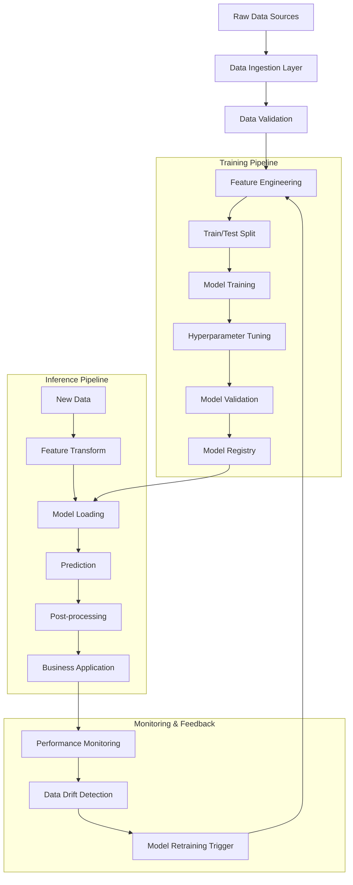
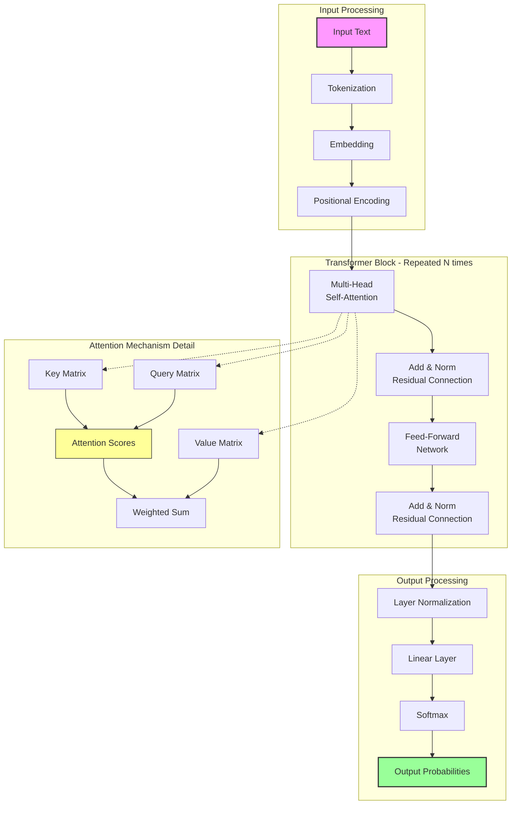
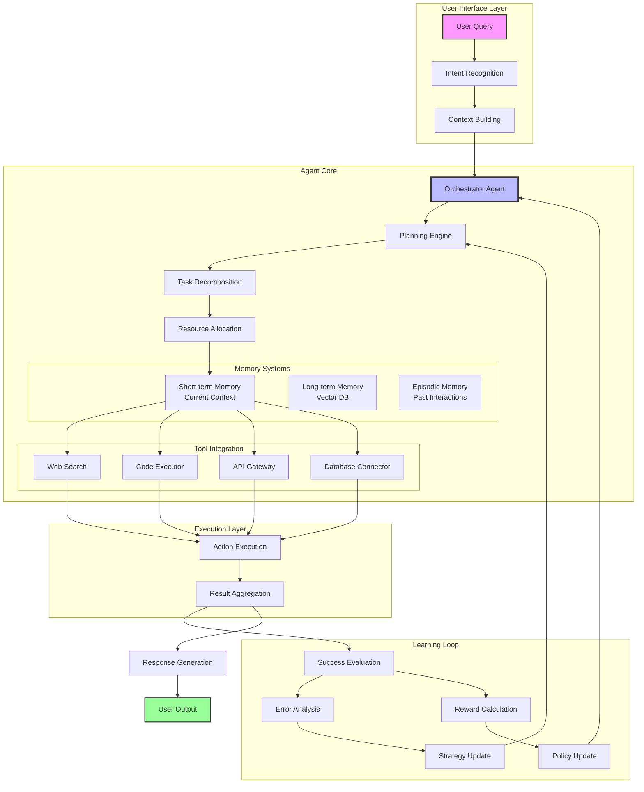

# Artificial Intelligence: From Basic Concepts to Agentic Systems — *Hands-On Implementation Guide*

---

## Introduction: Bridging Theory and Practice

In my previous article, ["Artificial Intelligence: From Basic Concepts to Agentic Systems"](https://mvineetsharma.medium.com/artificial-intelligence-from-basic-concepts-to-agentic-systems-8ae3e8438bdd), we built a comprehensive foundation—exploring everything from the three levels of AI to the architecture of modern agentic systems. We discussed machine learning paradigms, deep learning breakthroughs, and the generative AI revolution that's transforming industries.

But theory without practice remains abstract. Concepts without code stay in the realm of ideas. This follow-up guide serves as your hands-on laboratory—where we transform those foundational concepts into working code, architectural diagrams, and deployable systems. 

Consider this the practical companion to the theoretical journey we began. Where the first article explained *what* Transformers are and *why* they matter, here we'll build them. Where we previously discussed *how* agentic systems work, now we'll orchestrate actual AI agents. Each code snippet, each architecture diagram, each implementation pattern is designed to bridge the gap between understanding and doing.

Let's move from reading about AI to *building* with AI.

---

## Part 1: Machine Learning in Practice — From Theory to Working Code

*In our previous article, we explored the paradigm shift from traditional programming to machine learning—where systems learn rules from data rather than following explicit instructions. We discussed supervised learning algorithms like Random Forests and XGBoost, and how they power real-world applications like fraud detection. Now, let's implement these concepts and see them in action.*

### Implementing a Complete ML Pipeline

Let's build a practical fraud detection system that mirrors real-world patterns. This implementation will demonstrate the entire ML lifecycle—from data generation to model evaluation—using the very algorithms we discussed in the foundational article.

```python
# Import required libraries
import pandas as pd
import numpy as np
from sklearn.model_selection import train_test_split, cross_val_score
from sklearn.preprocessing import StandardScaler, LabelEncoder
from sklearn.ensemble import RandomForestClassifier, GradientBoostingClassifier
from sklearn.linear_model import LogisticRegression
from sklearn.metrics import classification_report, confusion_matrix, roc_auc_score
from sklearn.pipeline import Pipeline
import xgboost as xgb
import warnings
warnings.filterwarnings('ignore')

# Generate synthetic transaction data
np.random.seed(42)
n_samples = 10000

def generate_transaction_data(n_samples):
    """Create realistic transaction data with fraud patterns"""
    
    # Legitimate transactions (95%)
    legitimate = np.random.binomial(1, 0.05, n_samples)
    
    # Feature engineering
    data = {
        'transaction_amount': np.random.exponential(100, n_samples),
        'transaction_hour': np.random.randint(0, 24, n_samples),
        'transaction_day': np.random.randint(1, 31, n_samples),
        'merchant_category': np.random.choice(['retail', 'grocery', 'travel', 
                                               'entertainment', 'online'], n_samples),
        'distance_from_home': np.random.exponential(10, n_samples),
        'previous_fraud_attempts': np.random.poisson(0.1, n_samples),
        'card_present': np.random.binomial(1, 0.7, n_samples),
        'is_fraud': legitimate
    }
    
    df = pd.DataFrame(data)
    
    # Inject fraud patterns as discussed in the ML section
    fraud_mask = df['is_fraud'] == 1
    
    # Fraudulent transactions tend to be:
    # - Higher amount
    df.loc[fraud_mask, 'transaction_amount'] *= np.random.uniform(3, 8, fraud_mask.sum())
    
    # - More likely late night
    df.loc[fraud_mask, 'transaction_hour'] = np.random.choice([1, 2, 3, 4, 23], fraud_mask.sum())
    
    # - Greater distance from home
    df.loc[fraud_mask, 'distance_from_home'] *= np.random.uniform(2, 5, fraud_mask.sum())
    
    # - More likely online
    df.loc[fraud_mask, 'merchant_category'] = np.random.choice(
        ['online', 'travel'], fraud_mask.sum(), p=[0.7, 0.3]
    )
    
    return df

# Generate and prepare data
df = generate_transaction_data(n_samples)
print(f"Dataset shape: {df.shape}")
print(f"Fraud rate: {df['is_fraud'].mean():.3%}")
print("\nFirst few rows:")
print(df.head())

# Prepare features
categorical_features = ['merchant_category']
numerical_features = ['transaction_amount', 'transaction_hour', 'transaction_day',
                     'distance_from_home', 'previous_fraud_attempts', 'card_present']

# Encode categorical variables
le = LabelEncoder()
df['merchant_category_encoded'] = le.fit_transform(df['merchant_category'])

# Feature matrix and target
feature_columns = numerical_features + ['merchant_category_encoded']
X = df[feature_columns]
y = df['is_fraud']

# Split data
X_train, X_test, y_train, y_test = train_test_split(
    X, y, test_size=0.2, random_state=42, stratify=y
)

# Scale features
scaler = StandardScaler()
X_train_scaled = scaler.fit_transform(X_train)
X_test_scaled = scaler.transform(X_test)

print(f"\nTraining set size: {len(X_train)}")
print(f"Test set size: {len(X_test)}")
```

### Training Multiple Models for Comparison

Now let's implement the various algorithms we discussed—Logistic Regression, Random Forest, and XGBoost—and compare their performance on the fraud detection task.

```python
# Define models to compare
models = {
    'Logistic Regression': LogisticRegression(class_weight='balanced', random_state=42),
    'Random Forest': RandomForestClassifier(n_estimators=100, class_weight='balanced', 
                                           random_state=42, n_jobs=-1),
    'XGBoost': xgb.XGBClassifier(scale_pos_weight=(1 - df['is_fraud'].mean()) / 
                                 df['is_fraud'].mean(), random_state=42)
}

# Train and evaluate each model
results = {}

for name, model in models.items():
    # Train
    model.fit(X_train_scaled, y_train)
    
    # Predict
    y_pred = model.predict(X_test_scaled)
    y_pred_proba = model.predict_proba(X_test_scaled)[:, 1]
    
    # Evaluate
    results[name] = {
        'AUC-ROC': roc_auc_score(y_test, y_pred_proba),
        'Classification Report': classification_report(y_test, y_pred, output_dict=True)
    }
    
    print(f"\n{'='*50}")
    print(f"{name} Results:")
    print(f"AUC-ROC: {results[name]['AUC-ROC']:.4f}")
    print("\nConfusion Matrix:")
    print(confusion_matrix(y_test, y_pred))

# Feature importance from Random Forest
rf_model = models['Random Forest']
feature_importance = pd.DataFrame({
    'feature': feature_columns,
    'importance': rf_model.feature_importances_
}).sort_values('importance', ascending=False)

print("\nFeature Importance (Random Forest):")
print(feature_importance)
```

### Machine Learning Pipeline Architecture

The diagram below illustrates the complete ML pipeline we just implemented—from raw data to deployed model—showing how data flows through each stage of the process.



---

## Part 2: Deep Learning with PyTorch — Building Brain-Inspired Systems

*In our foundational article, we explored how deep learning draws inspiration from the human brain's neural networks—with artificial neurons organized in layers, detecting hierarchical features from simple edges to complex objects. We discussed Convolutional Neural Networks (CNNs) as "vision experts" and how they've revolutionized computer vision. Now, let's bring those concepts to life by building an actual CNN and watching it learn.*

### Building a Neural Network for Image Classification

This implementation demonstrates the hierarchical feature detection we discussed—from basic edges in early layers to complex object recognition in deeper layers.

```python
import torch
import torch.nn as nn
import torch.optim as optim
from torch.utils.data import DataLoader, TensorDataset
import torchvision
import torchvision.transforms as transforms
import matplotlib.pyplot as plt

# Check for GPU
device = torch.device('cuda' if torch.cuda.is_available() else 'cpu')
print(f"Using device: {device}")

# Load and preprocess CIFAR-10 dataset
transform = transforms.Compose([
    transforms.ToTensor(),
    transforms.Normalize((0.5, 0.5, 0.5), (0.5, 0.5, 0.5))
])

trainset = torchvision.datasets.CIFAR10(root='./data', train=True,
                                        download=True, transform=transform)
trainloader = DataLoader(trainset, batch_size=64, shuffle=True, num_workers=2)

testset = torchvision.datasets.CIFAR10(root='./data', train=False,
                                       download=True, transform=transform)
testloader = DataLoader(testset, batch_size=64, shuffle=False, num_workers=2)

classes = ('plane', 'car', 'bird', 'cat', 'deer', 
           'dog', 'frog', 'horse', 'ship', 'truck')

# Define a CNN architecture that mirrors the hierarchical detection we discussed
class ImprovedCNN(nn.Module):
    def __init__(self, num_classes=10):
        super(ImprovedCNN, self).__init__()
        
        # Convolutional layers - each layer learns increasingly complex features
        self.conv_layers = nn.Sequential(
            # Layer 1: Basic feature detectors (edges, colors, textures)
            nn.Conv2d(3, 32, kernel_size=3, padding=1),
            nn.BatchNorm2d(32),
            nn.ReLU(inplace=True),
            nn.Conv2d(32, 32, kernel_size=3, padding=1),
            nn.BatchNorm2d(32),
            nn.ReLU(inplace=True),
            nn.MaxPool2d(kernel_size=2, stride=2),  # 32x16x16
            
            # Layer 2: Pattern detectors (eyes, wheels, windows)
            nn.Conv2d(32, 64, kernel_size=3, padding=1),
            nn.BatchNorm2d(64),
            nn.ReLU(inplace=True),
            nn.Conv2d(64, 64, kernel_size=3, padding=1),
            nn.BatchNorm2d(64),
            nn.ReLU(inplace=True),
            nn.MaxPool2d(kernel_size=2, stride=2),  # 64x8x8
            
            # Layer 3: Object part detectors (faces, car bodies)
            nn.Conv2d(64, 128, kernel_size=3, padding=1),
            nn.BatchNorm2d(128),
            nn.ReLU(inplace=True),
            nn.Conv2d(128, 128, kernel_size=3, padding=1),
            nn.BatchNorm2d(128),
            nn.ReLU(inplace=True),
            nn.MaxPool2d(kernel_size=2, stride=2),  # 128x4x4
        )
        
        # Fully connected layers - combine detected features for final decision
        self.fc_layers = nn.Sequential(
            nn.Dropout(0.5),
            nn.Linear(128 * 4 * 4, 256),
            nn.ReLU(inplace=True),
            nn.Dropout(0.5),
            nn.Linear(256, 128),
            nn.ReLU(inplace=True),
            nn.Linear(128, num_classes)
        )
    
    def forward(self, x):
        x = self.conv_layers(x)
        x = x.view(x.size(0), -1)  # Flatten
        x = self.fc_layers(x)
        return x

# Initialize model
model = ImprovedCNN().to(device)
criterion = nn.CrossEntropyLoss()
optimizer = optim.Adam(model.parameters(), lr=0.001, weight_decay=1e-4)
scheduler = optim.lr_scheduler.StepLR(optimizer, step_size=5, gamma=0.5)

# Training function
def train_model(model, trainloader, criterion, optimizer, scheduler, epochs=10):
    model.train()
    train_losses = []
    
    for epoch in range(epochs):
        running_loss = 0.0
        correct = 0
        total = 0
        
        for i, data in enumerate(trainloader, 0):
            inputs, labels = data[0].to(device), data[1].to(device)
            
            optimizer.zero_grad()
            outputs = model(inputs)
            loss = criterion(outputs, labels)
            loss.backward()
            optimizer.step()
            
            running_loss += loss.item()
            _, predicted = torch.max(outputs.data, 1)
            total += labels.size(0)
            correct += (predicted == labels).sum().item()
            
            if i % 100 == 99:
                print(f'Epoch {epoch+1}, Batch {i+1}: loss = {running_loss/100:.3f}')
                running_loss = 0.0
        
        epoch_loss = running_loss / len(trainloader)
        epoch_acc = 100 * correct / total
        train_losses.append(epoch_loss)
        print(f'Epoch {epoch+1} completed - Loss: {epoch_loss:.3f}, Accuracy: {epoch_acc:.2f}%')
        scheduler.step()
    
    return train_losses

# Train the model
print("Starting training...")
losses = train_model(model, trainloader, criterion, optimizer, scheduler, epochs=10)

# Evaluate
model.eval()
correct = 0
total = 0
with torch.no_grad():
    for data in testloader:
        images, labels = data[0].to(device), data[1].to(device)
        outputs = model(images)
        _, predicted = torch.max(outputs.data, 1)
        total += labels.size(0)
        correct += (predicted == labels).sum().item()

print(f'Test Accuracy: {100 * correct / total:.2f}%')
```

### Neural Network Architecture Visualization

This diagram visualizes the CNN architecture we just built—showing how information flows through the network, with each layer extracting increasingly abstract features.

```mermaid
graph LR
    subgraph "Input Layer"
        A[Image<br/>32x32x3]
    end
    
    subgraph "Convolutional Layers - Feature Extraction"
        B[Conv2D<br/>32 filters<br/>3x3] --> C[BatchNorm<br/>+ ReLU]
        C --> D[Conv2D<br/>32 filters<br/>3x3]
        D --> E[BatchNorm<br/>+ ReLU]
        E --> F[MaxPool<br/>2x2]
        
        F --> G[Conv2D<br/>64 filters<br/>3x3]
        G --> H[BatchNorm<br/>+ ReLU]
        H --> I[Conv2D<br/>64 filters<br/>3x3]
        I --> J[BatchNorm<br/>+ ReLU]
        J --> K[MaxPool<br/>2x2]
        
        K --> L[Conv2D<br/>128 filters<br/>3x3]
        L --> M[BatchNorm<br/>+ ReLU]
        M --> N[Conv2D<br/>128 filters<br/>3x3]
        N --> O[BatchNorm<br/>+ ReLU]
        O --> P[MaxPool<br/>2x2]
    end
    
    subgraph "Fully Connected Layers - Decision Making"
        P --> Q[Flatten]
        Q --> R[Dropout<br/>0.5]
        R --> S[Dense<br/>256 + ReLU]
        S --> T[Dropout<br/>0.5]
        T --> U[Dense<br/>128 + ReLU]
        U --> V[Dense<br/>10 + Softmax]
    end
    
    subgraph "Output Layer"
        V --> W[Class Probabilities<br/>plane, car, bird, ...]
    end
    
    style A fill:#f9f,stroke:#333,stroke-width:2px
    style W fill:#9f9,stroke:#333,stroke-width:2px
```



---

## Part 3: Working with Large Language Models — From Transformers to Text Generation

*In our foundational article, we explored how the Transformer architecture—introduced in the 2017 paper "Attention Is All You Need"—revolutionized natural language processing. We discussed self-attention mechanisms, pre-training and fine-tuning phases, and the emergence of models like GPT, Claude, and Gemini. Now, let's work directly with these models and build practical applications.*

### Building an LLM-Powered Application

This code demonstrates how to load and interact with actual transformer models, implementing the concepts of tokenization, generation, and conversational AI we discussed.

```python
# Example using Hugging Face Transformers
from transformers import AutoTokenizer, AutoModelForCausalLM, pipeline
import torch

# Load a smaller model for demonstration (DialoGPT-small)
model_name = "microsoft/DialoGPT-small"

tokenizer = AutoTokenizer.from_pretrained(model_name)
model = AutoModelForCausalLM.from_pretrained(model_name)

# Create a text generation pipeline
generator = pipeline('text-generation', model=model, tokenizer=tokenizer)

# Generate text - showing how the model predicts next tokens
prompt = "The future of artificial intelligence will"
response = generator(prompt, max_length=100, num_return_sequences=1)
print("Generated text:")
print(response[0]['generated_text'])

# Build a simple chatbot with memory - implementing the conversational AI concept
class SimpleChatbot:
    def __init__(self, model_name="microsoft/DialoGPT-small"):
        self.tokenizer = AutoTokenizer.from_pretrained(model_name)
        self.model = AutoModelForCausalLM.from_pretrained(model_name)
        self.chat_history = []
        
    def chat(self, user_input, max_length=100):
        # Encode user input with chat history (maintaining context)
        new_input = self.tokenizer.encode(user_input + self.tokenizer.eos_token, 
                                          return_tensors='pt')
        
        # Append to chat history (short-term memory)
        self.chat_history.append(new_input)
        
        # Generate response based on full conversation history
        bot_input = torch.cat(self.chat_history, dim=-1)
        
        response = self.model.generate(
            bot_input,
            max_length=bot_input.shape[-1] + max_length,
            pad_token_id=self.tokenizer.eos_token_id,
            temperature=0.7,  # Controls randomness
            do_sample=True     # Enables sampling rather than greedy decoding
        )
        
        # Decode and store response
        response_text = self.tokenizer.decode(
            response[:, bot_input.shape[-1]:][0], 
            skip_special_tokens=True
        )
        
        # Add response to history (updating memory)
        self.chat_history.append(
            self.tokenizer.encode(response_text + self.tokenizer.eos_token, 
                                 return_tensors='pt')
        )
        
        return response_text

# Test the chatbot
print("\n" + "="*50)
print("Chatbot Demo - Implementing Conversational AI")
print("="*50)
bot = SimpleChatbot()
print("Chatbot: Hello! How can I help you today?")
print("(Type 'exit' to quit)\n")

# Simple interaction loop
user_inputs = ["What is machine learning?", "How is it different from deep learning?", "exit"]
for user_input in user_inputs:
    if user_input.lower() == 'exit':
        break
    print(f"You: {user_input}")
    response = bot.chat(user_input)
    print(f"Bot: {response}\n")
```

### Transformer Architecture Visualization

This diagram illustrates the Transformer architecture we discussed—showing the self-attention mechanism that enables models to weigh the importance of different words and capture long-range dependencies.



---

## Part 4: Building Agentic Systems — From Tools to Autonomous Colleagues

*In our foundational article, we explored the evolution from simple AI tools to agentic systems—systems that don't just respond to commands but proactively work toward goals. We discussed the anatomy of AI agents: planning engines, memory systems, tool integration, and reasoning capabilities. Now, let's build an actual agent that demonstrates these components in action.*

### Creating a Research Assistant Agent

This implementation brings the agent concept to life—complete with planning, execution, memory, and self-reflection capabilities.

```python
import asyncio
from typing import List, Dict, Any
import json
from datetime import datetime

class ResearchAssistant:
    """
    An AI agent that demonstrates the core components we discussed:
    - Planning Engine: Breaks down complex goals
    - Memory Systems: Short-term and long-term storage
    - Tool Integration: Simulated external tools
    - Reasoning Capabilities: Self-reflection and error correction
    """
    
    def __init__(self, name: str, expertise: List[str]):
        self.name = name
        self.expertise = expertise
        
        # Memory systems as discussed in the agent anatomy
        self.memory = {
            'short_term': [],      # Current context
            'long_term': {},       # Persistent knowledge
            'knowledge_base': {}    # Learned information
        }
        self.tasks = []
        
    def plan_research(self, topic: str, depth: str = 'medium') -> List[str]:
        """Planning Engine: Breaks down complex goals into actionable steps"""
        
        depth_config = {
            'quick': ['overview', 'key_facts'],
            'medium': ['overview', 'key_facts', 'analysis', 'sources'],
            'deep': ['overview', 'key_facts', 'analysis', 'sources', 
                    'expert_opinions', 'future_trends', 'criticisms']
        }
        
        steps = []
        for component in depth_config[depth]:
            steps.append(f"Research {component} of {topic}")
        
        steps.append(f"Generate report on {topic}")
        
        print(f"  Planning complete: {len(steps)} steps identified")
        return steps
    
    async def execute_step(self, step: str) -> Dict[str, Any]:
        """Tool Integration: Execute a single research step using simulated tools"""
        
        print(f"  Executing: {step}")
        await asyncio.sleep(1)  # Simulate work
        
        # Simulate findings based on step type
        if 'overview' in step:
            return {
                'type': 'overview',
                'content': f'Comprehensive overview of {step.split("of")[-1].strip()}',
                'confidence': 0.95
            }
        elif 'analysis' in step:
            return {
                'type': 'analysis',
                'content': 'Detailed analysis with key insights',
                'confidence': 0.88
            }
        elif 'sources' in step:
            return {
                'type': 'sources',
                'content': ['Academic Paper 1', 'Industry Report 2', 'Expert Interview 3'],
                'confidence': 0.92
            }
        else:
            return {
                'type': 'general',
                'content': f'Results from {step}',
                'confidence': 0.85
            }
    
    async def research_topic(self, topic: str, depth: str = 'medium') -> Dict[str, Any]:
        """Orchestrate the entire research process - the agent's main workflow"""
        
        print(f"\n🔍 Research Assistant '{self.name}' starting research on: {topic}")
        print(f"Expertise areas: {', '.join(self.expertise)}")
        
        # Step 1: Planning - breaking down the goal
        print("\n📋 Planning research approach...")
        steps = self.plan_research(topic, depth)
        print(f"Research plan created with {len(steps)} steps:")
        for i, step in enumerate(steps, 1):
            print(f"  {i}. {step}")
        
        # Step 2: Execute steps - using tools
        print("\n⚡ Executing research plan...")
        findings = []
        for step in steps:
            result = await self.execute_step(step)
            findings.append(result)
            
            # Store in short-term memory (current context)
            self.memory['short_term'].append({
                'step': step,
                'result': result,
                'timestamp': datetime.now().isoformat()
            })
        
        # Step 3: Synthesize findings - reasoning and integration
        print("\n🧠 Synthesizing findings...")
        report = self.generate_report(topic, findings)
        
        # Store in long-term memory (persistent knowledge)
        self.memory['long_term'][topic] = {
            'report': report,
            'findings': findings,
            'timestamp': datetime.now().isoformat()
        }
        
        return report
    
    def generate_report(self, topic: str, findings: List[Dict]) -> Dict[str, Any]:
        """Generate a comprehensive report from findings - showing reasoning"""
        
        report = {
            'topic': topic,
            'generated': datetime.now().isoformat(),
            'executive_summary': f"This report provides a comprehensive analysis of {topic}.",
            'key_findings': [],
            'sources': [],
            'confidence_score': 0.0,
            'recommendations': []
        }
        
        # Aggregate findings
        confidence_scores = []
        for finding in findings:
            if finding['type'] == 'overview':
                report['executive_summary'] += f" {finding['content']}"
            elif finding['type'] == 'sources':
                report['sources'].extend(finding['content'])
            elif finding['type'] in ['analysis', 'general']:
                report['key_findings'].append(finding['content'])
            
            confidence_scores.append(finding['confidence'])
        
        # Calculate overall confidence
        report['confidence_score'] = sum(confidence_scores) / len(confidence_scores)
        
        # Generate recommendations based on confidence
        if report['confidence_score'] > 0.9:
            report['recommendations'] = [
                "High confidence in findings - ready for decision-making",
                "Consider implementing based on research"
            ]
        elif report['confidence_score'] > 0.7:
            report['recommendations'] = [
                "Moderate confidence - validate key findings",
                "Conduct additional research on specific areas"
            ]
        else:
            report['recommendations'] = [
                "Low confidence - further research needed",
                "Consider alternative approaches"
            ]
        
        return report
    
    def reflect_on_work(self, topic: str) -> str:
        """Self-reflection capability - evaluating own performance"""
        
        if topic in self.memory['long_term']:
            research = self.memory['long_term'][topic]
            confidence = research['report']['confidence_score']
            
            reflection = f"Reflection on '{topic}' research:\n"
            reflection += f"- Confidence level: {confidence:.1%}\n"
            
            if confidence > 0.9:
                reflection += "- Excellent work! Findings are highly reliable.\n"
            elif confidence > 0.7:
                reflection += "- Good work, though some areas need verification.\n"
            else:
                reflection += "- More research needed in this area.\n"
            
            reflection += f"- Number of sources: {len(research['report']['sources'])}\n"
            reflection += f"- Key recommendations: {len(research['report']['recommendations'])}"
            
            return reflection
        else:
            return f"No research found on {topic}"

# Use the agent
async def run_research_assistant():
    print("="*60)
    print("DEMONSTRATING AGENTIC SYSTEM - Research Assistant")
    print("="*60)
    
    assistant = ResearchAssistant("Alex", ["AI", "Machine Learning", "Data Science"])
    
    # Conduct research - the agent in action
    report = await assistant.research_topic(
        "Applications of AI in Healthcare", 
        depth="medium"
    )
    
    # Display report summary
    print("\n📊 Research Report Summary:")
    print(json.dumps(report, indent=2))
    
    # Agent reflects on its work - self-evaluation
    print("\n🤔 Agent Self-Reflection:")
    print(assistant.reflect_on_work("Applications of AI in Healthcare"))

# Run the agent
asyncio.run(run_research_assistant())
```

### Agentic System Architecture

This diagram visualizes the complete agent architecture—showing how the planning engine, memory systems, tools, and learning loops interact to create an autonomous system.



---

## Part 5: Advanced Implementation Patterns — RAG and Production Systems

*In our foundational article, we explored the generative AI ecosystem and discussed how models are trained, fine-tuned, and deployed. We touched on the importance of combining retrieval with generation for more accurate and contextual responses. Now, let's implement these advanced patterns and see how they work in practice.*

### Building a RAG (Retrieval-Augmented Generation) System

This implementation demonstrates the RAG architecture we discussed—combining information retrieval with text generation for more accurate, knowledge-grounded responses.

```python
import numpy as np
from sklearn.feature_extraction.text import TfidfVectorizer
from sklearn.metrics.pairwise import cosine_similarity

class SimpleRAGSystem:
    """
    A minimal implementation of Retrieval-Augmented Generation
    Demonstrates how to combine retrieval with generation for better responses
    """
    
    def __init__(self, documents):
        self.documents = documents
        self.vectorizer = TfidfVectorizer(stop_words='english')
        self.document_vectors = self.vectorizer.fit_transform(documents)
        
    def retrieve(self, query, top_k=3):
        """Retrieve most relevant documents using semantic search"""
        query_vector = self.vectorizer.transform([query])
        similarities = cosine_similarity(query_vector, self.document_vectors).flatten()
        top_indices = similarities.argsort()[-top_k:][::-1]
        
        retrieved = []
        for idx in top_indices:
            retrieved.append({
                'document': self.documents[idx],
                'relevance': similarities[idx],
                'index': idx
            })
        
        return retrieved
    
    def generate_context(self, retrieved_docs):
        """Build context from retrieved documents"""
        context = "Relevant information:\n\n"
        for i, doc in enumerate(retrieved_docs, 1):
            context += f"[Document {i} (relevance: {doc['relevance']:.2f})]:\n"
            context += f"{doc['document']}\n\n"
        return context
    
    def answer(self, query, top_k=3):
        """Retrieve documents and generate context for answer"""
        retrieved = self.retrieve(query, top_k)
        context = self.generate_context(retrieved)
        
        # In a real system, this context would be fed to an LLM
        return {
            'query': query,
            'context': context,
            'retrieved_documents': retrieved,
            'answer': f"Based on the retrieved information, I can answer your question about '{query}'. " +
                     f"Here are the most relevant documents found with relevance scores."
        }

# Example usage with AI/ML documents
documents = [
    "Artificial Intelligence is the simulation of human intelligence in machines.",
    "Machine learning is a subset of AI that enables systems to learn from data.",
    "Deep learning uses neural networks with multiple layers for complex pattern recognition.",
    "Natural Language Processing allows computers to understand human language.",
    "Computer vision enables machines to interpret and make decisions from visual data.",
    "Reinforcement learning involves agents learning through interaction and rewards.",
    "Transformers are a neural network architecture that uses self-attention mechanisms.",
    "Large Language Models are trained on massive text corpora to generate human-like text.",
    "Agentic systems are AI systems that can pursue goals autonomously."
]

print("="*60)
print("RAG SYSTEM DEMONSTRATION")
print("="*60)

rag = SimpleRAGSystem(documents)
result = rag.answer("How do machines learn from data?")
print(f"\nQuery: {result['query']}")
print(f"\n{result['answer']}")
print("\nRetrieved context:")
print(result['context'])
```

### Model Deployment Patterns — From Development to Production

Now let's implement a production-ready API for serving ML models, demonstrating the deployment patterns discussed in the foundational article.

```python
from fastapi import FastAPI, HTTPException
from pydantic import BaseModel
import joblib
import numpy as np
from typing import List, Optional
import uvicorn
import time

# Define request/response models
class PredictionRequest(BaseModel):
    features: List[float]
    model_id: Optional[str] = "default"

class PredictionResponse(BaseModel):
    prediction: float
    confidence: float
    model_version: str
    processing_time_ms: float

class ModelMetadata(BaseModel):
    model_id: str
    model_type: str
    features: List[str]
    accuracy: float
    last_trained: str

# Create FastAPI app
app = FastAPI(title="ML Model Serving API", 
              description="Deploy and serve machine learning models in production",
              version="1.0.0")

# Model registry - stores deployed models and their metadata
class ModelRegistry:
    def __init__(self):
        self.models = {}
        self.metadata = {}
        
    def register(self, model_id, model, metadata):
        self.models[model_id] = model
        self.metadata[model_id] = metadata
        print(f"Model {model_id} registered successfully")
        
    def get(self, model_id):
        if model_id not in self.models:
            raise HTTPException(status_code=404, detail="Model not found")
        return self.models[model_id]
    
    def get_metadata(self, model_id):
        if model_id not in self.metadata:
            raise HTTPException(status_code=404, detail="Model metadata not found")
        return self.metadata[model_id]

registry = ModelRegistry()

# Simulate model registration with dummy model for demonstration
class DummyModel:
    def predict(self, features):
        return np.array([0.85])  # Dummy prediction
    
    def predict_proba(self, features):
        return np.array([[0.15, 0.85]])

registry.register(
    "fraud_detector_v1",
    DummyModel(),
    ModelMetadata(
        model_id="fraud_detector_v1",
        model_type="XGBoost",
        features=["amount", "hour", "distance", "previous_fraud"],
        accuracy=0.94,
        last_trained="2024-01-15"
    )
)

@app.get("/")
async def root():
    return {
        "message": "ML Model Serving API - Production Deployment Demo",
        "endpoints": [
            "/predict - Make predictions",
            "/models - List all models",
            "/models/{model_id} - Get model metadata",
            "/health - Health check",
            "/deploy - Deploy new model (demo)"
        ]
    }

@app.get("/health")
async def health_check():
    return {
        "status": "healthy", 
        "models_loaded": len(registry.models),
        "timestamp": time.time()
    }

@app.get("/models", response_model=List[ModelMetadata])
async def list_models():
    """List all available models with their metadata"""
    return [registry.get_metadata(model_id) for model_id in registry.models]

@app.get("/models/{model_id}", response_model=ModelMetadata)
async def get_model_metadata(model_id: str):
    """Get metadata for a specific model"""
    return registry.get_metadata(model_id)

@app.post("/predict", response_model=PredictionResponse)
async def predict(request: PredictionRequest):
    """Make a prediction using the specified model"""
    
    start_time = time.time()
    
    # Get model
    model = registry.get(request.model_id)
    
    # Convert features to numpy array
    features = np.array(request.features).reshape(1, -1)
    
    # Make prediction
    prediction = model.predict(features)[0]
    
    # Get confidence (probability)
    probabilities = model.predict_proba(features)[0]
    confidence = max(probabilities)
    
    processing_time = (time.time() - start_time) * 1000  # Convert to ms
    
    return PredictionResponse(
        prediction=float(prediction),
        confidence=float(confidence),
        model_version=request.model_id,
        processing_time_ms=processing_time
    )

@app.post("/deploy")
async def deploy_model(model_id: str, model_type: str):
    """
    Endpoint to deploy new models (simplified for demo)
    In production, this would load the actual model from storage
    """
    registry.register(
        model_id,
        DummyModel(),
        ModelMetadata(
            model_id=model_id,
            model_type=model_type,
            features=["feature1", "feature2", "feature3"],
            accuracy=0.95,
            last_trained="2024-02-01"
        )
    )
    return {"message": f"Model {model_id} deployed successfully"}

# To run: uvicorn main:app --reload
print("\n" + "="*60)
print("DEPLOYMENT DEMONSTRATION")
print("="*60)
print("\nAPI Endpoints created:")
print("  • POST /predict - Make predictions")
print("  • GET /models - List models")
print("  • POST /deploy - Deploy new models")
print("\nTo run the server:")
print("  uvicorn main:app --reload")
print("  Then visit http://localhost:8000/docs for interactive API documentation")
```

### Production Deployment Configuration

```dockerfile
# Dockerfile for ML model deployment
FROM python:3.9-slim

WORKDIR /app

# Install system dependencies
RUN apt-get update && apt-get install -y \
    build-essential \
    curl \
    && rm -rf /var/lib/apt/lists/*

# Copy requirements first for better caching
COPY requirements.txt .
RUN pip install --no-cache-dir -r requirements.txt

# Copy application code
COPY ./app /app/app
COPY ./models /app/models
COPY ./config /app/config

# Create non-root user for security
RUN useradd -m -u 1000 appuser && chown -R appuser:appuser /app
USER appuser

# Expose port
EXPOSE 8000

# Health check
HEALTHCHECK --interval=30s --timeout=3s --start-period=5s --retries=3 \
    CMD curl -f http://localhost:8000/health || exit 1

# Run the application
CMD ["uvicorn", "app.main:app", "--host", "0.0.0.0", "--port", "8000"]
```

```yaml
# docker-compose.yml - Complete production stack
version: '3.8'

services:
  model-api:
    build: .
    ports:
      - "8000:8000"
    environment:
      - MODEL_PATH=/app/models
      - LOG_LEVEL=info
    volumes:
      - ./models:/app/models
      - ./logs:/app/logs
    restart: unless-stopped
    networks:
      - ai-network
    deploy:
      resources:
        limits:
          cpus: '2'
          memory: 4G

  monitoring:
    image: prom/prometheus
    ports:
      - "9090:9090"
    volumes:
      - ./prometheus:/etc/prometheus
      - prometheus_data:/prometheus
    command:
      - '--config.file=/etc/prometheus/prometheus.yml'
      - '--storage.tsdb.path=/prometheus'
    networks:
      - ai-network
    restart: unless-stopped

  visualization:
    image: grafana/grafana
    ports:
      - "3000:3000"
    environment:
      - GF_SECURITY_ADMIN_PASSWORD=admin
      - GF_SECURITY_ADMIN_USER=admin
    volumes:
      - grafana_data:/var/lib/grafana
    networks:
      - ai-network
    restart: unless-stopped

  redis-cache:
    image: redis:alpine
    ports:
      - "6379:6379"
    volumes:
      - redis_data:/data
    networks:
      - ai-network
    restart: unless-stopped

networks:
  ai-network:
    driver: bridge

volumes:
  prometheus_data:
  grafana_data:
  redis_data:
```

---

## Part 6: Performance Optimization — Making AI Production-Ready

*In our foundational article, we discussed the computational demands of modern AI systems and the importance of optimization for production deployment. Now, let's implement concrete optimization techniques—quantization, benchmarking, and performance tuning—that make models faster and more efficient.*

### Model Optimization and Quantization

```python
import torch
import torch.nn as nn
import torch.quantization as quantization
import time

class OptimizedModel(nn.Module):
    """
    Demonstrates optimization techniques for production deployment
    """
    def __init__(self):
        super().__init__()
        self.conv1 = nn.Conv2d(3, 32, 3)
        self.conv2 = nn.Conv2d(32, 64, 3)
        self.fc1 = nn.Linear(64 * 6 * 6, 128)
        self.fc2 = nn.Linear(128, 10)
        self.relu = nn.ReLU()
        self.pool = nn.MaxPool2d(2)
        
    def forward(self, x):
        x = self.pool(self.relu(self.conv1(x)))
        x = self.pool(self.relu(self.conv2(x)))
        x = x.view(x.size(0), -1)
        x = self.relu(self.fc1(x))
        x = self.fc2(x)
        return x
    
    def optimize_for_inference(self):
        """Apply optimization techniques - quantization and fusion"""
        
        print("\nApplying optimization techniques:")
        
        # Quantization preparation
        print("  • Preparing for quantization...")
        self.eval()
        self.qconfig = quantization.get_default_qconfig('fbgemm')
        quantization.prepare(self, inplace=True)
        
        # Fuse layers where possible for efficiency
        print("  • Fusing compatible layers...")
        quantization.fuse_modules(self, [['conv1', 'relu']], inplace=True)
        
        # Convert to quantized model
        print("  • Converting to quantized model...")
        self.quantized = quantization.convert(self, inplace=False)
        print("  ✓ Optimization complete!")
        
        return self.quantized
    
    def benchmark_inference(self, input_tensor, iterations=100):
        """Benchmark inference speed"""
        
        # Warmup
        for _ in range(10):
            self(input_tensor)
        
        # Measure
        start_time = time.time()
        for _ in range(iterations):
            self(input_tensor)
        end_time = time.time()
        
        avg_time = (end_time - start_time) * 1000 / iterations
        return avg_time

print("="*60)
print("PERFORMANCE OPTIMIZATION DEMONSTRATION")
print("="*60)

# Create model and sample input
model = OptimizedModel()
sample_input = torch.randn(1, 3, 32, 32)

# Benchmark original
original_time = model.benchmark_inference(sample_input)
print(f"\n📊 Benchmark Results:")
print(f"  • Original inference time: {original_time:.2f} ms")

# Optimize
optimized_model = model.optimize_for_inference()
optimized_time = optimized_model.benchmark_inference(sample_input)
print(f"  • Optimized inference time: {optimized_time:.2f} ms")
print(f"  • Speedup: {original_time/optimized_time:.2f}x")
print(f"  • Performance gain: {((original_time-optimized_time)/original_time)*100:.1f}% faster")
```

---

## Conclusion: From Theory to Practice — Your AI Journey Continues

*In our foundational article, ["Artificial Intelligence: From Basic Concepts to Agentic Systems"](https://mvineetsharma.medium.com/artificial-intelligence-from-basic-concepts-to-agentic-systems-8ae3e8438bdd), we built a comprehensive theoretical framework—exploring the three levels of AI, the engine of machine learning, the brain-inspired revolution of deep learning, the generative AI explosion, and the autonomous future of agentic systems.*

This hands-on guide has been designed as your practical companion to that theoretical journey. We've transformed concepts into code, architectures into implementations, and ideas into working systems:

- **Machine Learning** went from algorithms on paper to a working fraud detection pipeline with multiple models and evaluation metrics.
- **Deep Learning** evolved from neural network descriptions to a trainable CNN that actually learns to recognize images.
- **Large Language Models** moved from transformer architecture diagrams to interactive chatbots with memory.
- **Agentic Systems** progressed from theoretical anatomy to autonomous research assistants that plan, execute, and reflect.
- **Production Deployment** shifted from best practices to actual APIs, Docker configurations, and monitoring stacks.

### The Path Forward

The journey from understanding to building is where real learning happens. Here's a structured path for continuing your hands-on AI journey:

```python
# Your personalized learning path
learning_path = [
    {
        "stage": "Beginner Projects - 2-3 weeks",
        "projects": [
            "Build linear regression from scratch using NumPy",
            "Create a spam classifier with Naive Bayes",
            "Implement k-means clustering for customer segmentation",
            "Build a simple neural network for XOR problem"
        ],
        "skills": ["Python", "NumPy", "scikit-learn", "Data visualization"]
    },
    {
        "stage": "Intermediate Projects - 4-6 weeks",
        "projects": [
            "Train CNN for CIFAR-10 with data augmentation",
            "Build sentiment analysis with transformers",
            "Create recommendation system with collaborative filtering",
            "Implement RAG system for question answering"
        ],
        "skills": ["PyTorch/TensorFlow", "Transformers", "Embeddings", "RAG"]
    },
    {
        "stage": "Advanced Projects - 8-12 weeks",
        "projects": [
            "Develop multi-agent system for task automation",
            "Build and deploy production ML API with monitoring",
            "Create fine-tuned LLM for specific domain",
            "Implement real-time computer vision pipeline"
        ],
        "skills": ["Agentic systems", "MLOps", "Model optimization", "System design"]
    }
]

print("\n" + "="*60)
print("YOUR AI LEARNING JOURNEY CONTINUES")
print("="*60)

for stage in learning_path:
    print(f"\n📌 {stage['stage']}:")
    for project in stage['projects']:
        print(f"  • {project}")
    print(f"  Skills: {', '.join(stage['skills'])}")
```

### Final Thoughts

The AI revolution we described in the first article is not just something to observe—it's something to participate in. Every expert was once a beginner who decided to start building. The code in this guide is not meant to be just read; it's meant to be run, modified, broken, and fixed. That's how real understanding develops.

Remember: AI is not about replacing human intelligence, but about augmenting it. The most powerful systems will always be human-AI collaborations—and you're now equipped to build them.

**Next Steps:**
1. Run the code examples in this guide
2. Modify them to solve your own problems
3. Combine techniques to create something new
4. Share your learnings with the community
5. Continue building, experimenting, and learning

The future of AI will be written by those who can both understand its concepts and implement its systems. That future includes you, and it starts today—with your hands on the keyboard, building the next generation of intelligent systems.

---

*"The best way to predict the future is to implement it."* — Adapted from Alan Kay

---

**Connect and Continue:**
- Read the foundational article: [Artificial Intelligence: From Basic Concepts to Agentic Systems](https://mvineetsharma.medium.com/artificial-intelligence-from-basic-concepts-to-agentic-systems-8ae3e8438bdd)

Questions? Feedback? Comment? leave a response below. If you're implementing something similar and want to discuss architectural tradeoffs, I'm always happy to connect with fellow engineers tackling these challenges.