# Prompt Engineering vs Content Engineering vs RAG
## The Three Pillars of Production-Ready AI Systems (with .NET 9/10 Enterprise Architecture)

---

*"The difference between a demo and a production AI system isn't the model—it's the architecture around it."*

---

## 🌉 Prologue: The Great Misunderstanding

It begins the same way in every organization.

A team discovers GPT-4. They spend 45 minutes crafting the perfect prompt. The model generates a response so insightful, so human, so *right* that executives lean forward in their chairs. "This is it," someone whispers. "This changes everything."

Three months later, that same team is drowning.

The demo that flawlessly answered five questions now hallucinates on the sixth. The chatbot that handled HR policies beautifully yesterday is citing a document from 2019—a policy that was repealed, amended, and replaced twice. The legal department won't approve deployment. Security won't sign off. IT Operations points out there's no monitoring, no versioning, no rollback strategy.

What happened?

What happened is that they mistook a model for a system.

---

## 🧠 The Cognitive Architecture of Enterprise AI

Modern AI systems are not powered by prompts alone. They are not powered by models alone. They are not powered by data alone.

They are powered by **three distinct architectural layers**, each addressing a fundamental limitation of the others:

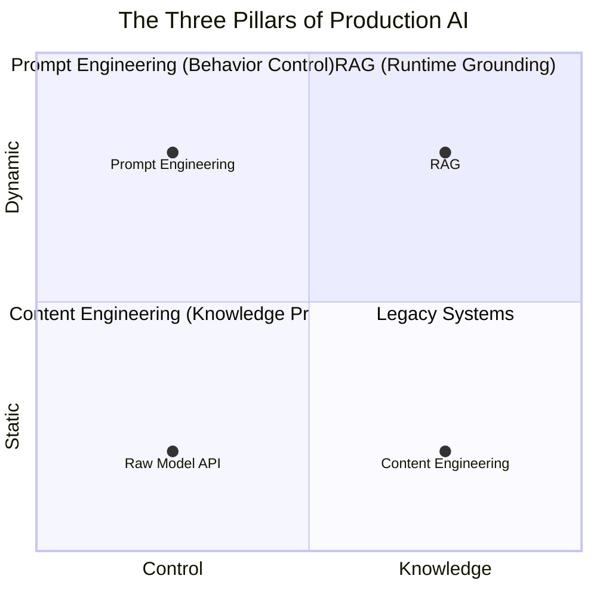

| Layer | Solves | Analogy |
|-------|--------|---------|
| **Prompt Engineering** | How the model thinks | Behavioral steering wheel |
| **Content Engineering** | What the model knows | Knowledge refinery |
| **RAG** | What knowledge is used when | Live navigation system |

If you are building:

- **Enterprise copilots** handling employee inquiries
- **HR policy assistants** answering leave, benefits, and compliance questions
- **Legal compliance bots** navigating regulatory frameworks
- **Banking regulatory systems** interpreting financial conduct rules
- **SaaS AI platforms** serving multi-tenant customers
- **Agent-based automation** making autonomous decisions

...you must understand how these three layers work—**independently, together, and in conflict**.

This is not theory.

This is **production architecture thinking**.

---

# 1. Prompt Engineering
## *How You Talk to the Model*

---

## 🎭 Deep Introduction: The Probability Shaper

**Large Language Models are not deterministic rule engines.**

Let that sentence sit for a moment, because everything else depends on it.

When you send a prompt to GPT-4, Claude, or Llama, you are not executing code. You are not calling a function with predictable return values. You are **conditioning a probability distribution**—nudging a trillion-parameter statistical model toward regions of its training space that resemble "helpful responses."

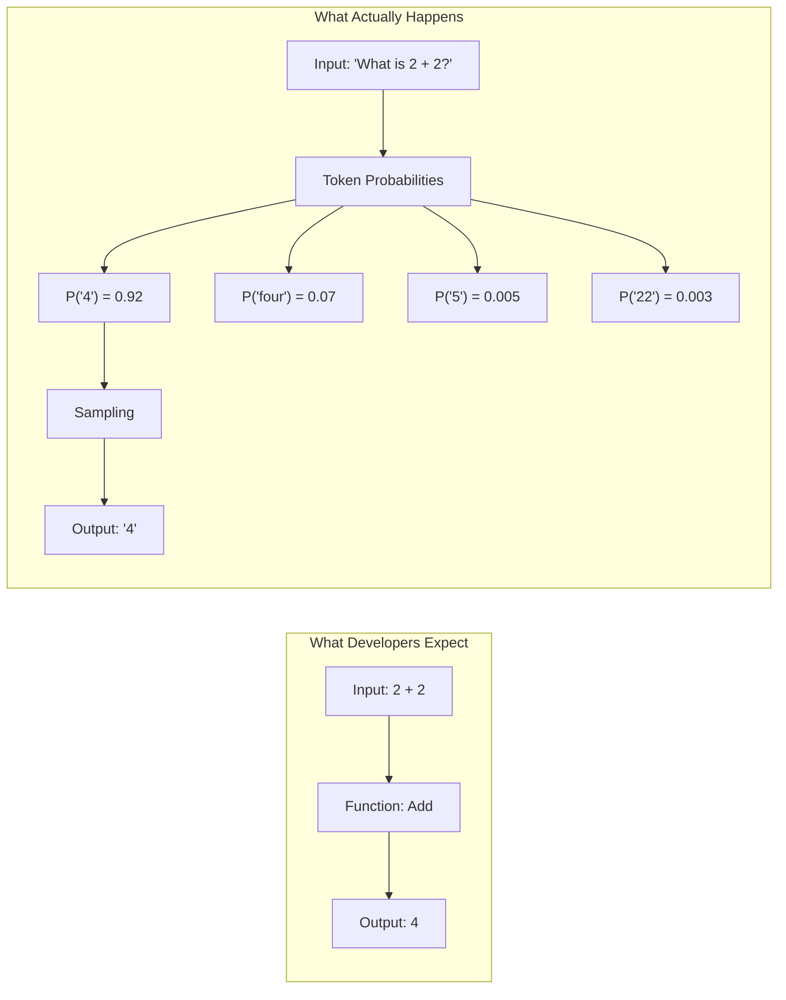

The implications are profound:

- **They do not "understand"** like humans understand. They pattern-match across billions of training examples.
- **They do not "remember"** like databases remember. They reconstruct plausible continuations.
- **Their behavior is exquisitely sensitive** to phrasing, formatting, and even whitespace.
- **The same prompt, twice, can yield different results**—not a bug, but a feature of sampling.

**Prompt Engineering is the discipline of shaping model probability space using structured instruction design.** It is not "asking nicely." It is **interface design for stochastic systems**.

---

## 🎯 What Prompt Engineering Controls

In enterprise systems, prompt engineering governs:

| Dimension | Enterprise Impact |
|-----------|-------------------|
| **Reasoning depth** | Does the model think step-by-step or jump to conclusions? |
| **Tone** | Formal, empathetic, technical, executive-summary? |
| **Format** | JSON, markdown, plain text, tables? |
| **Output determinism** | Temperature, top-p, consistent vs. creative? |
| **Safety** | Refusing harmful or off-policy requests? |
| **Compliance behavior** | Citing sources, stating uncertainty, disclosing limitations? |
| **Cost efficiency** | Token optimization, response length control |

---

## 🏢 The Enterprise Shift: From Cleverness to Contracts

In consumer AI, prompt engineering is about *cleverness*—finding the magic incantation that unlocks unexpected capability.

**In enterprise AI, prompt engineering is about *contracts*.**

You are designing a **behavioral interface** between:

```
Your Application ↔ Probabilistic Model
```

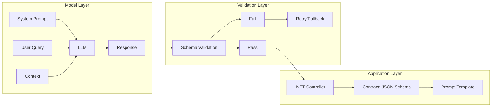

This interface must be:

- **Repeatable** — Same input → semantically same output
- **Parseable** — Machine-readable structure, not freeform prose
- **Verifiable** — You can detect when it fails
- **Governable** — Changes are versioned, reviewed, audited
- **Observable** — You can measure quality, cost, latency

A prompt is no longer a string. It is **a compiled artifact** in your deployment pipeline.

---

## 📚 Types of Prompting: From Zero to Complex

---

### Zero-Shot Prompting
*The baseline. No examples. Pure instruction following.*

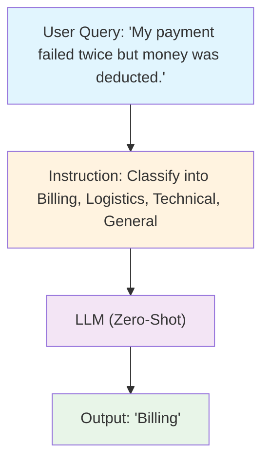

**Example — Ticket Classification**

```
Classify the support ticket into one of:
Billing, Logistics, Technical, General.

Ticket:
"My payment failed twice but money was deducted."

Model Output:
Billing
```

No examples were provided. No pattern was demonstrated. The model relied entirely on its training to understand the categories.

**Enterprise Use Case — .NET API Implementation**

```csharp
[ApiController]
[Route("api/support")]
public class TicketClassificationController : ControllerBase
{
    private readonly ILLMClient _llmClient;
    private readonly ILogger<TicketClassificationController> _logger;

    public TicketClassificationController(
        ILLMClient llmClient, 
        ILogger<TicketClassificationController> logger)
    {
        _llmClient = llmClient;
        _logger = logger;
    }

    [HttpPost("classify")]
    public async Task<ActionResult<string>> ClassifyTicket([FromBody] TicketRequest request)
    {
        _logger.LogInformation("Classifying ticket: {TicketId}", request.TicketId);
        
        var prompt = $"""
            Classify the support ticket into one of:
            Billing, Logistics, Technical, General.
            
            Ticket:
            "{request.Description}"
            
            Output only the category name.
            """;
        
        var response = await _llmClient.CompleteAsync(prompt, new LLMOptions
        {
            Temperature = 0.1,  // Low temperature for consistency
            MaxTokens = 10,      // Single word output
            StopSequences = new[] { "\n" } // Stop at newline
        });
        
        return Ok(response.Trim());
    }
}
```

**✅ Advantages:**
- Minimal token cost
- Fastest response time
- Simplest to implement
- No example management

**❌ Limitations:**
- May misclassify edge cases
- Inconsistent across ambiguous inputs
- Sensitive to category naming

---

### Few-Shot Prompting
*Pattern demonstration. Reliability through examples.*

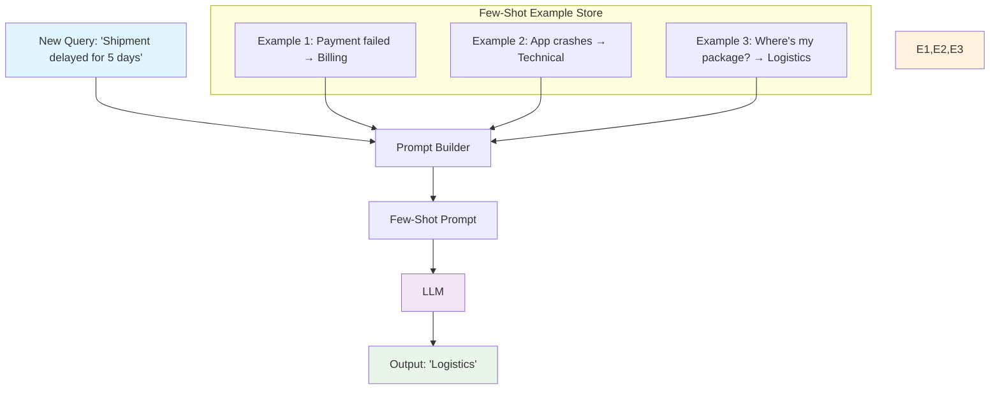

**The Problem:** Zero-shot works 85% of the time. Enterprise requires 99.9%.

**The Solution:** Show the model exactly what you want.

**Prompt:**

```
Example 1:
Input: "Payment deducted but order failed."
Output: Billing

Example 2:
Input: "App crashes on login."
Output: Technical

Example 3:
Input: "Where is my package? It's been 2 weeks."
Output: Logistics

Example 4:
Input: "Can you change my email address?"
Output: Account

Now classify:
Input: "Shipment delayed for 5 days. Customer is angry."
Output:
```

**Model Output:**
```
Logistics
```

**Why this works:** The model doesn't just learn category definitions—it learns *your distribution*. Notice how "Shipment delayed" maps to Logistics not because of dictionary definition, but because Example 3 established a pattern.

**Enterprise Pattern — Dynamic Few-Shot Selection:**

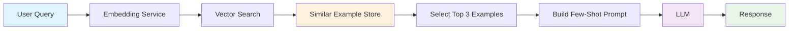

```csharp
public class DynamicFewShotSelector
{
    private readonly IVectorStore _exampleStore;
    
    public async Task<List<Example>> SelectRelevantExamplesAsync(
        string userQuery, 
        int k = 3)
    {
        // Embed the user query
        var queryEmbedding = await _embedder.EmbedAsync(userQuery);
        
        // Find semantically similar examples
        var similarExamples = await _exampleStore
            .SimilaritySearchAsync(queryEmbedding, k);
        
        return similarExamples;
    }
}
```

This is **prompt-time retrieval**—a precursor to full RAG.

---

### Chain-of-Thought Prompting
*Reasoning transparency. Error reduction through deliberation.*

```mermaid
flowchart TD
    subgraph "Standard Prompting"
        Q[Question] --> A[Direct Answer]
        A -.-> E1[Potential Error: Surface pattern match]
    end
    
    subgraph "Chain-of-Thought"
        Q2[Question] --> S1[Step 1: Check income]
        S1 --> S2[Step 2: Check debt ratio]
        S2 --> S3[Step 3: Check credit score]
        S3 --> S4[Step 4: Evaluate]
        S4 --> R[Reasoned Answer]
        R --> E2[Error: Reduced]
    end
    
    style Q fill:#e1f5fe
    style Q2 fill:#e1f5fe
    style S1,S2,S3,S4 fill:#fff3e0
    style R fill:#e8f5e8
```

**The Problem:** LLMs, like humans, make fast-thinking errors. They pattern-match to superficial similarities rather than reasoning through constraints.

**The Solution:** Force step-by-step reasoning.

**Example — Loan Eligibility**

```
Customer details:
- Annual Income: $60,000
- Debt-to-Income Ratio: 35%
- Credit Score: 720
- Loan Amount Requested: $200,000
- Property Type: Primary Residence

Step 1: Evaluate income threshold against minimum requirement ($50,000).
Step 2: Evaluate debt-to-income ratio against maximum (40%).
Step 3: Evaluate credit score against minimum (680).
Step 4: Evaluate loan-to-value ratio if applicable.
Step 5: Provide reasoning for each step.
Step 6: Output final decision with rationale.

Reasoning:
```

**Model Output:**

```
Step 1: Income threshold check.
- Minimum required: $50,000
- Customer income: $60,000
- Result: PASS (Income exceeds minimum by $10,000)

Step 2: Debt-to-income ratio check.
- Maximum allowed: 40%
- Customer DTI: 35%
- Result: PASS (Below threshold)

Step 3: Credit score check.
- Minimum required: 680
- Customer score: 720
- Result: PASS (Exceeds minimum)

Step 4: Loan-to-value ratio.
- Not applicable for this loan type.

Final Decision: APPROVED

Rationale: Customer meets or exceeds all eligibility criteria. 
Income sufficient, DTI within limits, credit score above threshold.
```

**The Cognitive Science:** Chain-of-thought reduces **System 1** errors (fast, intuitive, pattern-matching) and activates **System 2** (slow, deliberate, rule-following). For compliance-sensitive domains, the reasoning trace is as valuable as the decision.

---

### Structured Output Enforcement
*From prose to contracts.*

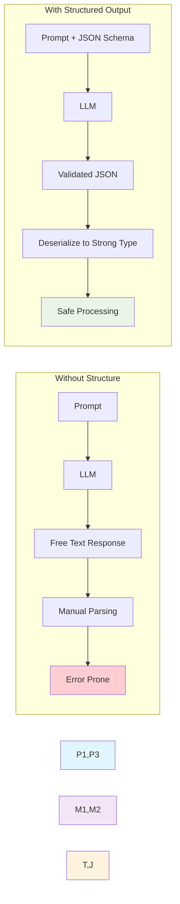

**The Problem:** Enterprise systems don't read paragraphs. They read JSON, XML, and protocol buffers.

**The Solution:** Constrain the output space.

**Prompt:**

```
You are a loan eligibility system.
Return ONLY valid JSON with this exact schema:

{
  "decision": "Approved | Rejected | ManualReview",
  "confidence": number (0.0 to 1.0),
  "reasoning_steps": [
    {
      "criteria": string,
      "result": "PASS | FAIL",
      "details": string
    }
  ],
  "risk_score": number (0-100),
  "conditions": string[],
  "timestamp": string (ISO format)
}

DO NOT include any text outside the JSON.
DO NOT add explanations.
DO NOT apologize.

Process the following request:
{loan_application}
```

**Model Output:**

```json
{
  "decision": "Approved",
  "confidence": 0.94,
  "reasoning_steps": [
    {
      "criteria": "Income Threshold",
      "result": "PASS",
      "details": "$60,000 exceeds minimum $50,000"
    },
    {
      "criteria": "Debt-to-Income",
      "result": "PASS",
      "details": "35% below 40% maximum"
    },
    {
      "criteria": "Credit Score",
      "result": "PASS",
      "details": "720 exceeds 680 minimum"
    }
  ],
  "risk_score": 21,
  "conditions": [
    "Property appraisal required",
    "Income verification required"
  ],
  "timestamp": "2026-02-13T14:23:18Z"
}
```

**Now your .NET API can:**
- Deserialize safely into strongly-typed objects
- Validate against schema contracts
- Reject malformed output before it reaches downstream systems
- Log structured data for audit trails

```csharp
public record LoanDecision(
    string Decision,
    double Confidence,
    List<ReasoningStep> ReasoningSteps,
    int RiskScore,
    string[] Conditions,
    DateTime Timestamp);

public async Task<LoanDecision> EvaluateLoanApplication(LoanApplication application)
{
    var prompt = _promptTemplateService.Render("loan-evaluation", application);
    var response = await _llmClient.CompleteStructuredAsync<LoanDecision>(prompt);
    
    // Validation layer
    if (response.Confidence < 0.6)
    {
        _logger.LogWarning("Low confidence decision: {Confidence}", response.Confidence);
        return response with { Decision = "ManualReview" };
    }
    
    return response;
}
```

---

## ⚙️ Advanced Prompt Techniques

| Technique | Purpose | Implementation |
|-----------|---------|----------------|
| **Response length constraints** | Cost control, conciseness | `MaxTokens: 100`, "Respond in exactly 3 sentences" |
| **Refusal enforcement** | Safety, compliance | "If the request violates policy, respond ONLY with: 'I cannot assist with this request.'" |
| **Citation requirements** | Traceability, verification | "For each statement, cite the policy section in brackets [Section X.Y]" |
| **Context usage enforcement** | Hallucination prevention | "If the answer is not found in the context provided, respond: 'I do not have sufficient information to answer this question.'" |
| **Tool invocation** | Agent capabilities | "When you need to check real-time data, respond with: TOOL_CALL: get_weather[city_name]" |
| **Multi-language constraints** | Global deployment | "Respond in the same language as the user's question" |

---

## 🏛️ Prompt Engineering in .NET 9/10 Enterprise Architecture

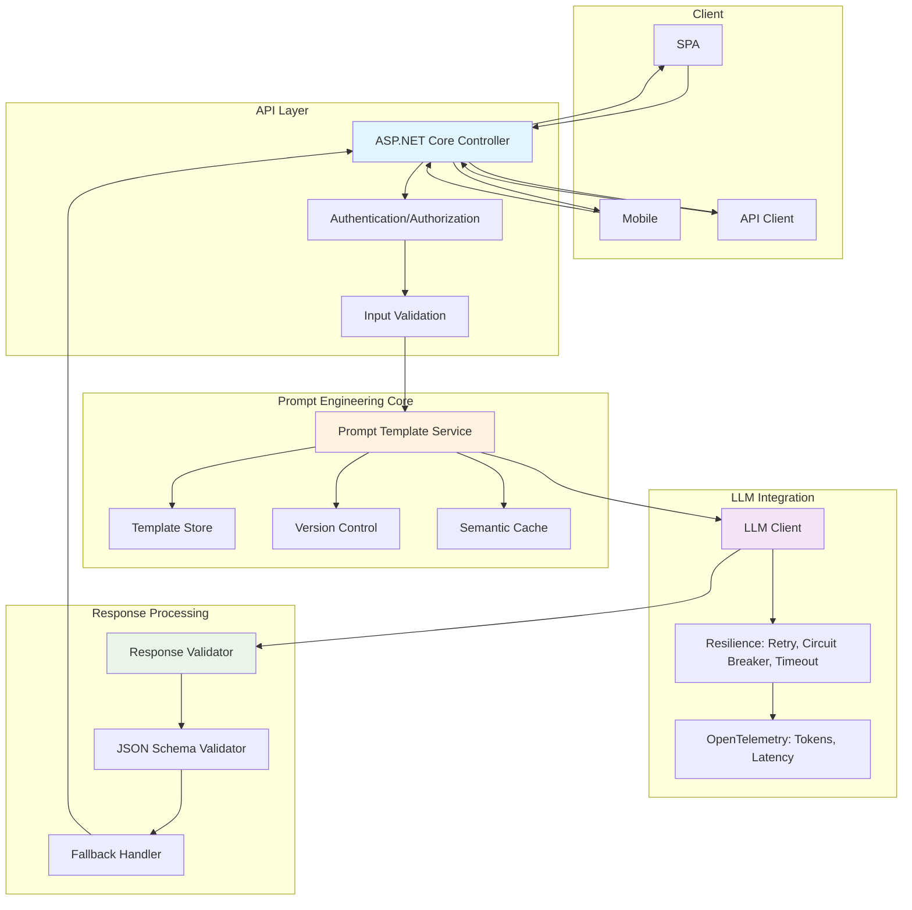

**Core Components:**

```csharp
public interface IPromptTemplateService
{
    string Render(string templateName, object parameters);
    string RenderSystemPrompt(string context);
    Version GetTemplateVersion(string templateName);
}

public interface ILLMClient
{
    Task<string> CompleteAsync(string prompt, LLMOptions options);
    Task<T> CompleteStructuredAsync<T>(string prompt, LLMOptions options);
    IAsyncEnumerable<string> CompleteStreamingAsync(string prompt, LLMOptions options);
}

public interface IResponseValidator
{
    ValidationResult Validate(string response, ValidationRules rules);
    ValidationResult ValidateJson(string json, JsonSchema schema);
}
```

**Production Considerations:**
- **Polly policies** for retry, circuit breaking, timeout
- **Semantic caching** to reduce costs on repeated queries
- **A/B testing infrastructure** for prompt versions
- **Observability** via OpenTelemetry for token usage, latency, quality scores
- **Version control** for prompts in Git (yes, prompts are code)

---

## ⚠️ The Hard Ceiling: What Prompt Engineering Alone Cannot Do

**Prompt Engineering is necessary. It is not sufficient.**

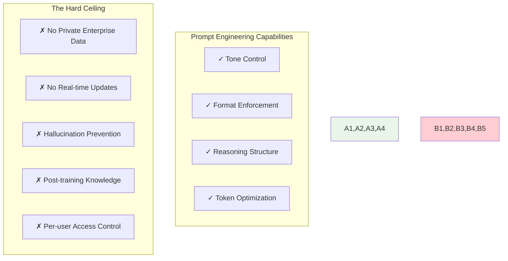

| Limitation | Why It Matters |
|-----------|----------------|
| **Cannot access private enterprise data** | Your HR policies aren't in GPT-4's training data. Never will be. |
| **Cannot update knowledge** | New regulations passed this morning? Model doesn't know. |
| **Cannot prevent hallucination fully** | Even with "say you don't know," models sometimes lie confidently. |
| **Cannot resolve outdated training information** | The cutoff date is immovable. |
| **Cannot enforce per-user access controls** | All users see the same model knowledge. |

**Prompt Engineering improves behavior—not knowledge grounding.**

It steers the car. It does not provide the fuel or the map.

---

# 2. Content Engineering
## *Preparing Knowledge for AI Systems*

---

## 🏗️ Deep Introduction: Knowledge Architecture for Machine Reasoning

**Before AI can retrieve knowledge, that knowledge must exist in a form AI can understand.**

This sounds obvious. It is routinely ignored.

Enterprise content is not born ready for AI. It is born in chaos:

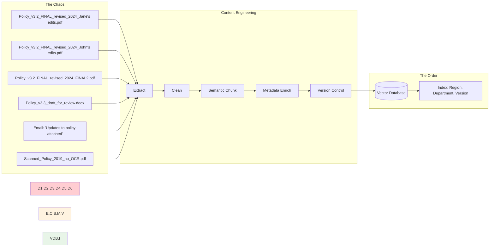

This is not a joke. This is SharePoint.

**Content Engineering is the discipline of transforming organizational chaos into machine-readable knowledge architecture.**

It encompasses:

- **Document ingestion** — Extracting text from PDFs, Word docs, emails, scanned images
- **Text cleaning** — Removing headers, footers, artifacts, boilerplate
- **Semantic chunking** — Dividing documents into meaningful, self-contained units
- **Metadata enrichment** — Tagging with region, department, version, confidentiality
- **Embedding generation** — Converting text to vector representations
- **Vector storage** — Indexing for similarity search
- **Version management** — Ensuring only current knowledge is retrievable
- **Access control integration** — Knowledge that respects user permissions

---

## 💀 The Hidden Complexity: Why Enterprise Content Engineering Fails

**Most enterprise AI failures are not due to poor models.**

They are not due to insufficient GPU capacity.

They are not due to prompt engineering mistakes.

**They are due to garbage in, garbage out at scale.**

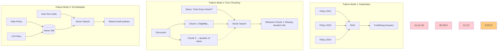

**Common Failure Modes:**

| Problem | Manifestation | Root Cause |
|---------|---------------|------------|
| **Duplicate documents** | RAG returns three slightly different versions of same policy | No canonical source identification |
| **Outdated policies** | AI cites 2021 regulation, 2024 amendment exists | No version tracking |
| **Inconsistent formats** | Some documents chunk well, others fragment | No standardized ingestion |
| **Poor chunking** | Retrieved text cuts off mid-sentence, mid-thought | Naive character splitting |
| **Missing metadata** | Indian employee receives US benefits information | No region tags |
| **Scanned PDFs** | OCR garbage → embedding garbage → retrieval garbage | No OCR quality validation |
| **Conflicting terminology** | "Parental leave" in one doc, "Family leave" in another | No ontology alignment |

---

## 📦 The Content Engineering Pipeline

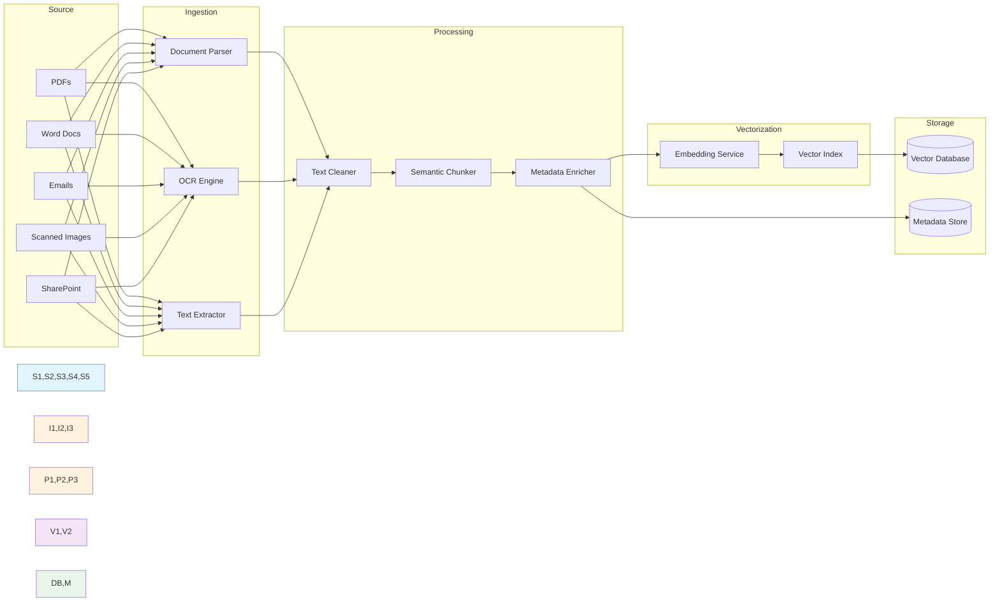

---

## 📄 Chunking Strategy: The Critical Detail

**Bad Chunking:**

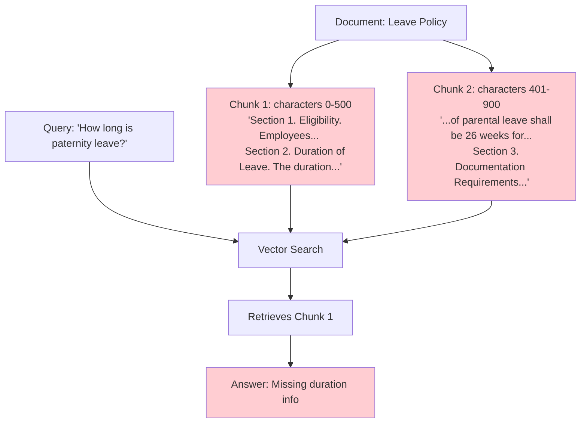

**Good Chunking (Semantic):**

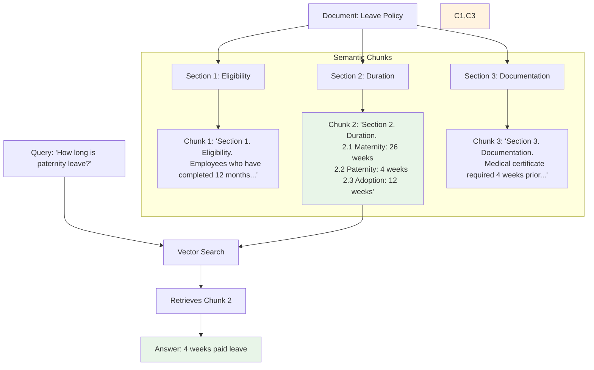

**Overlap Strategy:**

For long documents with continuity requirements:

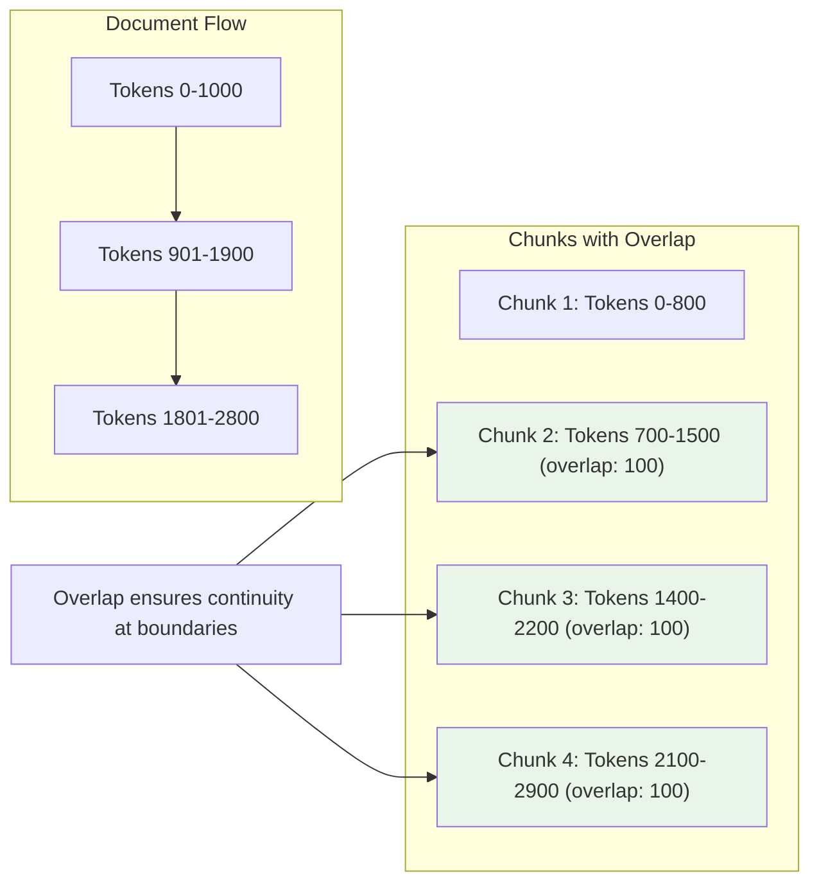

**.NET Implementation — Semantic Chunker:**

```csharp
public class SemanticChunker
{
    private readonly int _targetChunkSize;
    private readonly int _overlapSize;
    private readonly ITextSegmenter _segmenter;
    
    public List<DocumentChunk> ChunkDocument(string text, DocumentMetadata metadata)
    {
        // First, split by semantic boundaries (headers, sections, paragraphs)
        var segments = _segmenter.SplitBySemanticBoundaries(text);
        
        var chunks = new List<DocumentChunk>();
        var currentChunk = new StringBuilder();
        var currentChunkTokens = 0;
        
        foreach (var segment in segments)
        {
            var segmentTokens = CountTokens(segment);
            
            // If this segment alone exceeds chunk size, split it further
            if (segmentTokens > _targetChunkSize)
            {
                // Recursively chunk large segments
                var subChunks = ChunkLargeSegment(segment, metadata);
                chunks.AddRange(subChunks);
                continue;
            }
            
            // If adding this segment exceeds chunk size, finalize current chunk
            if (currentChunkTokens + segmentTokens > _targetChunkSize && currentChunk.Length > 0)
            {
                chunks.Add(CreateChunk(currentChunk.ToString(), metadata, chunks.Count));
                
                // Start new chunk with overlap
                currentChunk = new StringBuilder(GetOverlapText(currentChunk.ToString(), _overlapSize));
                currentChunk.Append(segment);
                currentChunkTokens = CountTokens(currentChunk.ToString());
            }
            else
            {
                currentChunk.Append(segment);
                currentChunkTokens += segmentTokens;
            }
        }
        
        // Don't forget the last chunk
        if (currentChunk.Length > 0)
        {
            chunks.Add(CreateChunk(currentChunk.ToString(), metadata, chunks.Count));
        }
        
        return chunks;
    }
    
    private string GetOverlapText(string chunk, int overlapTokens)
    {
        // Extract last N tokens for overlap
        var tokens = chunk.Split(' ');
        var overlapTokensList = tokens.TakeLast(overlapTokens);
        return string.Join(" ", overlapTokensList);
    }
}
```

---

## 🏷️ Metadata Strategy: The Knowledge Labeling System

**Without metadata, RAG is blind.**

Imagine a library where books have no titles, no authors, no Dewey Decimal codes—just shelves of undifferentiated text. That's RAG without metadata.

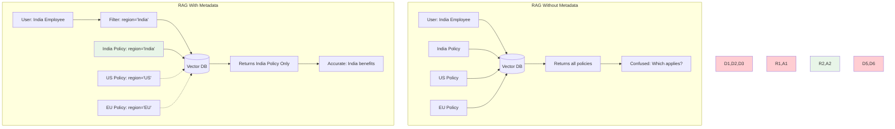

**Enterprise Metadata Schema:**

```json
{
  "documentId": "HR-POL-2024-018",
  "documentType": "Policy",
  "policyDomain": "Leave",
  "region": "India",
  "country": "IN",
  "department": "Human Resources",
  "effectiveDate": "2024-01-15",
  "version": "3.1",
  "status": "Active",
  "confidentiality": "Internal",
  "author": "Global HR Policy Team",
  "owner": "Director of Total Rewards",
  "reviewDate": "2025-01-15",
  "languages": ["en-IN", "hi", "ta"],
  "applicableEntities": ["FullTime", "PartTime", "Contract"],
  "keywords": ["maternity", "paternity", "adoption", "parental leave"],
  "hash": "sha256:a1b2c3..."
}
```

**What metadata enables:**

| Capability | Without Metadata | With Metadata |
|-----------|------------------|---------------|
| **Regional filtering** | Indian employee gets US policy | India tag → India policy only |
| **Version control** | 2019 policy cited as current | Version 3.1 filtered, old versions excluded |
| **Access control** | Everyone sees everything | Confidentiality + user role filtering |
| **Recency bias** | Old and new equally retrievable | Effective date boosts recent policies |
| **Department scoping** | HR bot answers engineering questions | Department filter restricts domain |

**Enterprise Use Case — Global Compliance Portal:**

A multinational corporation operates in:

- **EU** — GDPR, AI Act, local labor laws
- **US** — State-by-state employment regulations
- **APAC** — India, Singapore, Japan, Australia

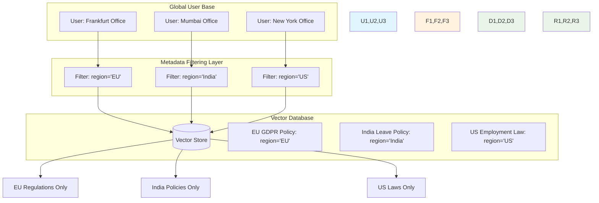

**User query from Frankfurt:** "What are our remote work policies regarding data privacy?"

**Without metadata:**
Vector similarity retrieves the semantically closest documents. Could be US policy. Could be Singapore policy. Could be irrelevant.

**With metadata filtering:**

```csharp
public async Task<List<DocumentChunk>> GetRelevantChunks(
    string query, 
    UserContext user)
{
    var queryEmbedding = await _embedder.EmbedAsync(query);
    
    var searchOptions = new VectorSearchOptions
    {
        Filters = new List<MetadataFilter>
        {
            // User's region only
            new("region", SearchFilter.Equal, user.Region),
            // Active documents only  
            new("status", SearchFilter.Equal, "Active"),
            // Appropriate confidentiality level
            new("confidentiality", SearchFilter.In, user.ClearanceLevels),
            // Not expired
            new("effectiveDate", SearchFilter.LessThanOrEqual, DateTime.UtcNow),
            new("reviewDate", SearchFilter.GreaterThan, DateTime.UtcNow)
        },
        TopK = 10,
        MinimumSimilarityScore = 0.7
    };
    
    return await _vectorStore.SimilaritySearchAsync(queryEmbedding, searchOptions);
}
```

**Result:** Only EU regulations. Only currently active policies. Only documents the user is cleared to see.

---

## 🏭 Content Engineering in .NET 9/10

**Ingestion Worker Architecture:**

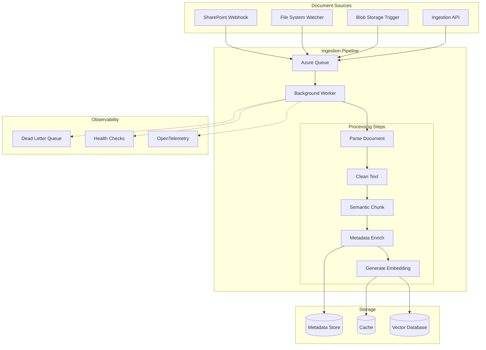

**.NET Implementation — Background Service:**

```csharp
public class ContentIngestionWorker : BackgroundService
{
    private readonly IBlobStorage _blobStorage;
    private readonly IDocumentParser _documentParser;
    private readonly ITextCleaner _textCleaner;
    private readonly ISemanticChunker _chunker;
    private readonly IMetadataEnricher _metadataEnricher;
    private readonly IEmbeddingService _embeddingService;
    private readonly IVectorStore _vectorStore;
    private readonly ILogger<ContentIngestionWorker> _logger;
    
    protected override async Task ExecuteAsync(CancellationToken stoppingToken)
    {
        _logger.LogInformation("Content Ingestion Worker started");
        
        while (!stoppingToken.IsCancellationRequested)
        {
            try
            {
                // Poll for new/changed documents
                var documents = await _blobStorage.GetPendingDocumentsAsync(10);
                
                foreach (var document in documents)
                {
                    using var activity = _telemetry.StartActivity("IngestDocument");
                    activity?.SetTag("document.id", document.Id);
                    
                    await ProcessDocumentAsync(document);
                    
                    // Mark as processed
                    await _blobStorage.MarkAsProcessedAsync(document.Id);
                }
                
                await Task.Delay(TimeSpan.FromSeconds(30), stoppingToken);
            }
            catch (Exception ex)
            {
                _logger.LogError(ex, "Error in ingestion worker");
                await Task.Delay(TimeSpan.FromSeconds(60), stoppingToken);
            }
        }
    }
    
    private async Task ProcessDocumentAsync(Document document)
    {
        // 1. Extract text based on file type
        var text = document.FileType switch
        {
            "pdf" => await _documentParser.ParsePdfAsync(document.Stream),
            "docx" => await _documentParser.ParseDocxAsync(document.Stream),
            "pptx" => await _documentParser.ParsePptxAsync(document.Stream),
            _ => throw new NotSupportedException($"File type {document.FileType} not supported")
        };
        
        // 2. Clean extracted text
        var cleanedText = _textCleaner.RemoveHeadersFooters(text);
        cleanedText = _textCleaner.NormalizeWhitespace(cleanedText);
        cleanedText = _textCleaner.ConvertToPlainText(cleanedText);
        
        // 3. Generate metadata
        var metadata = await _metadataEnricher.EnrichAsync(document, cleanedText);
        
        // 4. Semantic chunking
        var chunks = _chunker.ChunkDocument(cleanedText, metadata);
        
        // 5. Generate embeddings
        var embeddingTasks = chunks.Select(async chunk =>
        {
            chunk.Embedding = await _embeddingService.GenerateEmbeddingAsync(chunk.Text);
            return chunk;
        });
        
        var chunksWithEmbeddings = await Task.WhenAll(embeddingTasks);
        
        // 6. Store in vector database
        await _vectorStore.UpsertChunksAsync(chunksWithEmbeddings);
        
        _logger.LogInformation(
            "Ingested document {DocumentId} with {ChunkCount} chunks", 
            document.Id, 
            chunksWithEmbeddings.Length);
    }
}
```

**Key Technologies:**

| Component | Options |
|-----------|---------|
| **PDF Extraction** | iText7, PdfPig, Azure AI Document Intelligence |
| **Office Documents** | OpenXML SDK, NPOI, Aspose |
| **OCR** | Tesseract, Azure Computer Vision, AWS Textract |
| **Embedding** | Azure OpenAI, Semantic Kernel, Ollama, SentenceTransformers |
| **Vector Storage** | PostgreSQL + pgvector, Azure AI Search, Qdrant, Pinecone |
| **Orchestration** | Azure Functions, Durable Functions, Kubernetes Jobs |

---

## 🔮 The Output: Deterministic Knowledge

**Content Engineering transforms probabilistic retrieval into deterministic retrieval.**

When you tag a document with region="India", version="3.1", status="Active"—and filter on those fields—you are no longer hoping the model finds the right policy.

**You are specifying it.**

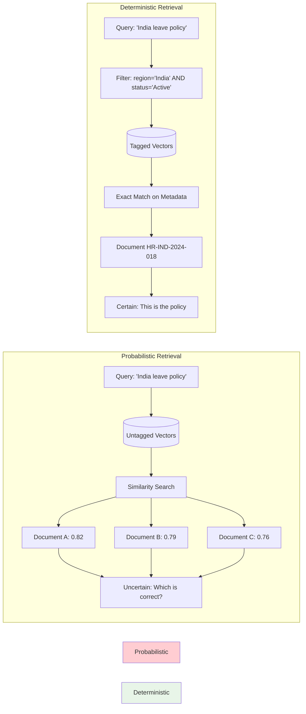

**This is the difference between:**

- **Without Content Engineering:** "Find me something about leave in India" → *Maybe correct, maybe not*
- **With Content Engineering:** "Retrieve only document HR-IND-2024-018" → *Always correct*

**Content Engineering turns search into lookup.**

---

# 3. RAG (Retrieval-Augmented Generation)
## *Connecting Models to Live Enterprise Knowledge*

---

## 🌊 Deep Introduction: The Grounding Layer

**LLMs are static knowledge systems frozen in time.**

GPT-4's knowledge ends in October 2023. Claude's in early 2024. Even if tomorrow a new regulation passes, even if this morning your company updated its parental leave policy, even if five minutes ago a critical compliance memo was distributed—**the model does not know.**

```mermaid
timeline
    title The Knowledge Gap
    section Model Training
        Training Date : Model learns data up to cutoff
    section Post-Cutoff Events
        Day After Cutoff : New regulations passed
        Last Week : Company policy updated
        Yesterday : Compliance memo distributed
        Today : User asks question
        Now : Model doesn't know
```

**RAG solves this by:**

1. **Retrieving** relevant content from your enterprise knowledge base at query time
2. **Injecting** that content into the model's context window
3. **Constraining** the model to answer based only on provided context
4. **Grounding** every response in verifiable, current, authorized sources

```mermaid
flowchart TD
    subgraph "Without RAG"
        Q1[User Question] --> M1[LLM Static Knowledge]
        M1 --> A1[Answer based on training data]
        A1 --> P1[May be outdated]
        A1 --> P2[No citations]
        A1 --> P3[No enterprise-specific info]
    end
    
    subgraph "With RAG"
        Q2[User Question] --> R[Retrieval System]
        KB[(Enterprise Knowledge Base)] --> R
        R --> C[Retrieved Context]
        C --> M2[LLM]
        Q2 --> M2
        M2 --> A2[Answer grounded in context]
        A2 --> P4[Current knowledge]
        A2 --> P5[Verifiable citations]
        A2 --> P6[Enterprise-specific]
    end
    
    style Without RAG fill:#ffcdd2
    style With RAG fill:#e8f5e8
```

**RAG converts a general-purpose foundation model into an enterprise-aware assistant that:**

- Knows your specific policies, not generic ones
- Respects your access controls, not open web knowledge
- Cites your documents, not its training data
- Admits ignorance when your knowledge is insufficient

---

## 🔄 The RAG Pipeline: Step by Step

```mermaid
flowchart TD
    subgraph "Query Time"
        A[User Query] --> B[Embed Query]
        B --> C[Vector Search]
        D[(Vector Database)] --> C
        C --> E[Metadata Filtering]
        F[User Context] --> E
    end
    
    subgraph "Augmentation"
        E --> G[Retrieved Chunks Top-K]
        G --> H[Prompt Builder]
        I[System Prompt Template] --> H
        H --> J[Augmented Prompt]
    end
    
    subgraph "Generation"
        J --> K[LLM]
        K --> L[Grounded Response]
        L --> M[Citation Validation]
    end
    
    subgraph "Observability"
        M --> N[Log Sources]
        N --> O[Audit Trail]
        N --> P[Feedback Loop]
    end
    
    style A fill:#e1f5fe
    style B,C,D,E fill:#fff3e0
    style G,H,I,J fill:#f3e5f5
    style K,L,M fill:#e8f5e8
    style N,O,P fill:#ffe0b2
```

**Step 1: Query Understanding**
- User submits natural language question
- Optional: Query rewriting, expansion, or decomposition

**Step 2: Embedding**
- Convert query to vector representation
- Same embedding model used for document ingestion

**Step 3: Retrieval**
- Vector similarity search against knowledge base
- Filter by metadata (region, department, version, access)
- Return top-K most relevant chunks

**Step 4: Prompt Augmentation**
- Construct system prompt with grounding instructions
- Inject retrieved chunks as context
- Insert user query

**Step 5: Generation**
- LLM generates response constrained by context
- Citation requirements enforced
- Hallucination refusal triggered

**Step 6: Validation & Observability**
- Verify citations exist in retrieved chunks
- Check for hallucinated content
- Log retrieval sources, confidence scores, latency

---

## 📝 Sample RAG Flow: Production Reality

```mermaid
sequenceDiagram
    participant User
    participant API as .NET API
    participant Vector as Vector DB
    participant Prompt as Prompt Service
    participant LLM
    participant Audit as Audit Log
    
    User->>API: "What is maternity leave in India?"
    
    API->>API: Get user context (region=India)
    API->>Vector: Embed query + filter region='India'
    
    Vector-->>API: Return top 3 relevant chunks
    Note right of Vector: • 26 weeks paid leave<br/>• Eligibility: 12 months<br/>• Documentation required
    
    API->>Prompt: Build prompt with context
    Prompt-->>API: Augmented prompt
    
    API->>LLM: Generate grounded response
    LLM-->>API: "26 weeks paid leave..." with citations
    
    API->>API: Validate citations exist in chunks
    API->>Audit: Log query, sources, response
    
    API-->>User: Grounded answer + sources
```

**User:**
```
What is maternity leave for employees in India?
```

**Retrieved Chunks (Metadata Filtered):**

```json
[
  {
    "text": "Maternity Leave: 26 weeks paid leave. Eligible after 12 months of continuous service. Leave must commence no earlier than 6 weeks before expected delivery date.",
    "source": "HR-POL-2024-018",
    "section": "2.1 Maternity Leave",
    "region": "India",
    "relevance": 0.89
  },
  {
    "text": "Documentation Requirements: Medical certificate confirming pregnancy and expected delivery date must be submitted at least 4 weeks prior to leave commencement.",
    "source": "HR-POL-2024-018", 
    "section": "2.1.1 Documentation",
    "region": "India",
    "relevance": 0.76
  }
]
```

**Augmented Prompt:**

```
You are an HR compliance assistant for a multinational corporation.
Answer questions based SOLELY on the provided context.
If the answer cannot be found in the context, respond:
"I do not have sufficient information to answer this question."
Cite the specific policy section for each statement in brackets.

CONTEXT:
--- START CONTEXT ---
[1] Maternity Leave: 26 weeks paid leave. Eligible after 12 months of continuous service. Leave must commence no earlier than 6 weeks before expected delivery date. (Source: HR-POL-2024-018, Section 2.1)
[2] Documentation Requirements: Medical certificate confirming pregnancy and expected delivery date must be submitted at least 4 weeks prior to leave commencement. (Source: HR-POL-2024-018, Section 2.1.1)
--- END CONTEXT ---

QUESTION:
What is maternity leave for employees in India?

ANSWER (with citations):
```

**Model Output:**
```
Employees in India are entitled to 26 weeks of paid maternity leave [Section 2.1]. 
Eligibility requires 12 months of continuous service, and leave must begin no earlier 
than 6 weeks before the expected delivery date [Section 2.1]. 

Employees must submit a medical certificate confirming pregnancy and expected delivery 
date at least 4 weeks before leave commencement [Section 2.1.1].
```

**Grounded. Verifiable. Auditable.**

---

## 🧩 Advanced RAG Patterns

### 1. Hybrid Search (Keyword + Vector)

```mermaid
flowchart LR
    Q[Query] --> VE[Vector Embedding]
    Q --> KE[Keyword Extraction]
    
    subgraph "Vector Search"
        VE --> VS[(Vector Index)]
        VS --> VR[Vector Results]
    end
    
    subgraph "Keyword Search"
        KE --> KS[(BM25 Index)]
        KS --> KR[Keyword Results]
    end
    
    subgraph "Reciprocal Rank Fusion"
        VR --> RRF
        KR --> RRF
        RRF --> F[Fused Rankings]
        F --> T[Top K Results]
    end
    
    style VE,VS,VR fill:#f3e5f5
    style KE,KS,KR fill:#fff3e0
    style RRF,F,T fill:#e8f5e8
```

```csharp
public async Task<List<DocumentChunk>> HybridSearchAsync(string query)
{
    // Vector similarity
    var vectorResults = await _vectorSearch.SearchAsync(query);
    
    // Keyword/BM25 search
    var keywordResults = await _keywordSearch.SearchAsync(query);
    
    // Reciprocal Rank Fusion
    var fusedResults = RRF.Merge(
        vectorResults, 
        keywordResults, 
        weights: (0.7, 0.3));
    
    return fusedResults;
}
```

### 2. Re-ranking

```mermaid
flowchart LR
    Q[Query] --> VS[(Vector Index)]
    VS --> C50[Top 50 Candidates]
    C50 --> RR[Cross-Encoder Re-ranker]
    Q --> RR
    RR --> C10[Top 10 Re-ranked]
    C10 --> LLM
    
    style VS fill:#fff3e0
    style RR fill:#f3e5f5
    style C10 fill:#e8f5e8
```

```csharp
public async Task<List<DocumentChunk>> RetrieveWithReRankAsync(string query)
{
    // Retrieve top 50 with vector search
    var candidates = await _vectorStore.SearchAsync(query, topK: 50);
    
    // Re-rank with cross-encoder
    var reRanked = await _reRanker.ReRankAsync(query, candidates);
    
    // Take top 10 after re-ranking
    return reRanked.Take(10).ToList();
}
```

### 3. Multi-Hop Retrieval

```mermaid
flowchart TD
    Q[User: Which EU countries have stricter privacy laws than our standard policy?]
    
    subgraph "Hop 1"
        R1[Retrieve: Our standard privacy policy]
        C1[Context: Standard policy requirements]
    end
    
    subgraph "Hop 2"
        R2[Retrieve: GDPR requirements]
        C2[Context: EU baseline regulations]
    end
    
    subgraph "Hop 3"
        R3[Retrieve: Individual EU country laws]
        C3[Context: France, Germany, Netherlands specifics]
    end
    
    subgraph "Reasoning"
        Compare[Compare each country vs. standard]
        Filter[Identify stricter jurisdictions]
    end
    
    Q --> R1 --> C1 --> R2 --> C2 --> R3 --> C3 --> Compare --> Filter
    
    style R1,R2,R3 fill:#fff3e0
    style C1,C2,C3 fill:#f3e5f5
    style Compare,Filter fill:#e8f5e8
```

### 4. Context Compression

```mermaid
flowchart LR
    RC[Raw Chunk: 500 tokens] --> EX[Extractor LLM]
    Q[Query] --> EX
    EX --> CC[Compressed Context: 150 tokens]
    CC --> A[Augmented Prompt]
    
    style RC fill:#ffcdd2
    style EX fill:#f3e5f5
    style CC fill:#e8f5e8
```

### 5. Agentic RAG

```mermaid
flowchart TD
    Q[User Query] --> A[AI Agent]
    
    subgraph "Agent Decision Loop"
        A --> D{Need more info?}
        D -- Yes --> T[Choose Tool]
        T --> V[Vector Search]
        T --> S[SQL Query]
        T --> API[External API]
        V & S & API --> C[Collect Results]
        C --> A
        D -- No --> G[Generate Response]
    end
    
    G --> R[Final Answer]
    
    style A fill:#f3e5f5
    style D fill:#fff3e0
    style T,V,S,API fill:#e1f5fe
    style G,R fill:#e8f5e8
```

### 6. Knowledge Graph RAG

```mermaid
graph TD
    Q[Query: 'Parental leave eligibility'] --> VS[Vector Search]
    VS --> C1[Chunk: Eligibility requirements]
    
    KG[(Knowledge Graph)]
    C1 --> KG
    KG --> R1[Related: 'Maternity leave policy']
    KG --> R2[Related: 'Paternity leave policy']
    KG --> R3[Related: 'Amended by 2024 update']
    KG --> R4[Related: 'Supersedes 2021 policy']
    
    R1 & R2 & R3 & R4 --> F[Fused Context]
    F --> LLM
    
    style VS fill:#fff3e0
    style KG fill:#f3e5f5
    style R1,R2,R3,R4 fill:#e1f5fe
    style F,LLM fill:#e8f5e8
```

---

## 🏛️ RAG in .NET 9/10 Enterprise Architecture

**RAG Orchestrator — The Coordination Layer:**

```mermaid
flowchart TD
    subgraph "Request Flow"
        REQ[HTTP Request] --> AUTH[Authenticate]
        AUTH --> CTX[Build User Context]
        CTX --> EMB[Embed Query]
        EMB --> FILT[Apply Metadata Filters]
        FILT --> VS[(Vector Search)]
        VS --> RANK[Re-rank]
    end
    
    subgraph "Context Building"
        CTX --> REGION[Region: India]
        CTX --> ROLE[Role: Employee]
        CTX --> DEPT[Dept: HR]
    end
    
    subgraph "Response Generation"
        RANK --> PROMPT[Build Prompt]
        PROMPT --> LLM[LLM Call]
        LLM --> VALID[Validate Citations]
        VALID --> AUDIT[Audit Log]
        AUDIT --> RESP[JSON Response]
    end
    
    style REQ fill:#e1f5fe
    style CTX,EMB,FILT fill:#fff3e0
    style PROMPT,LLM fill:#f3e5f5
    style VALID,AUDIT,RESP fill:#e8f5e8
```

```csharp
public class RAGOrchestrator
{
    private readonly IUserContext _userContext;
    private readonly IEmbeddingService _embeddingService;
    private readonly IVectorStore _vectorStore;
    private readonly IMetadataFilterBuilder _filterBuilder;
    private readonly IPromptTemplateService _promptService;
    private readonly ILLMClient _llmClient;
    private readonly IResponseValidator _validator;
    private readonly IAuditLogger _auditLogger;
    
    public async Task<RAGResponse> ProcessQueryAsync(
        string userQuery, 
        string conversationId,
        CancellationToken cancellationToken)
    {
        // 1. Authenticate and authorize
        var user = await _userContext.GetCurrentUserAsync();
        _auditLogger.LogQuery(user.Id, conversationId, userQuery);
        
        // 2. Generate query embedding
        var queryEmbedding = await _embeddingService.EmbedAsync(userQuery);
        
        // 3. Build metadata filters from user context
        var filters = _filterBuilder
            .FromUserClaims(user.Claims)
            .IncludeActiveOnly()
            .Build();
        
        // 4. Retrieve relevant chunks
        var retrievedChunks = await _vectorStore.SearchAsync(
            queryEmbedding,
            filters,
            topK: 10,
            minimumScore: 0.7);
        
        if (!retrievedChunks.Any())
        {
            return new RAGResponse
            {
                Answer = "I don't have sufficient information to answer this question.",
                Sources = Array.Empty<Source>(),
                Confidence = 0.0
            };
        }
        
        // 5. Augment prompt with retrieved context
        var augmentedPrompt = _promptService.Render(
            "rag-template",
            new
            {
                context = FormatRetrievedChunks(retrievedChunks),
                question = userQuery
            });
        
        // 6. Call LLM with structured output
        var llmResponse = await _llmClient.CompleteStructuredAsync<RAGStructuredResponse>(
            augmentedPrompt,
            new LLMOptions
            {
                Temperature = 0.1,
                MaxTokens = 1000,
                ResponseFormat = "json_object"
            });
        
        // 7. Validate response
        var validationResult = _validator.ValidateCitations(
            llmResponse.Answer,
            retrievedChunks);
        
        if (!validationResult.IsValid)
        {
            _logger.LogWarning("Response validation failed: {Errors}", 
                validationResult.Errors);
            
            // Fallback: Reject hallucinated response
            return new RAGResponse
            {
                Answer = "I cannot verify this answer against the provided sources.",
                Sources = retrievedChunks.Select(c => c.Source).Distinct(),
                Confidence = 0.3
            };
        }
        
        // 8. Log and return
        _auditLogger.LogResponse(
            conversationId,
            llmResponse.Answer,
            retrievedChunks.Select(c => c.Id));
        
        return new RAGResponse
        {
            Answer = llmResponse.Answer,
            Sources = retrievedChunks.Select(c => c.Source).Distinct(),
            Confidence = llmResponse.Confidence,
            Reasoning = llmResponse.Reasoning
        };
    }
    
    private string FormatRetrievedChunks(IEnumerable<DocumentChunk> chunks)
    {
        var sb = new StringBuilder();
        sb.AppendLine("--- START CONTEXT ---");
        
        foreach (var (chunk, index) in chunks.Select((c, i) => (c, i + 1)))
        {
            sb.AppendLine($"[{index}] {chunk.Text}");
            sb.AppendLine($"Source: {chunk.Source}, Section: {chunk.Section}");
            sb.AppendLine();
        }
        
        sb.AppendLine("--- END CONTEXT ---");
        return sb.ToString();
    }
}
```

---

# 🌍 Real Enterprise Scenario: Banking AI Platform

```mermaid
flowchart TD
    subgraph "The Challenge"
        C1[500+ Regulatory Documents]
        C2[15 Countries]
        C3[Daily Updates]
        C4[Role-based Access]
        C5[Audit Requirements]
        C6[Zero Hallucination Tolerance]
    end

    subgraph "Without Engineering"
        F1[✗ Duplicate documents]
        F2[✗ Conflicting versions]
        F3[✗ Region mixing]
        F4[✗ No traceability]
        F5[✗ Regulatory fines]
    end

    subgraph "With Three Pillars"
        S1[✓ Content Engineering]
        S2[✓ RAG Layer]
        S3[✓ Prompt Engineering]
        S4[✓ Observability]
    end

    subgraph "The Result"
        R1[100% Traceable]
        R2[Region Accurate]
        R3[Always Current]
        R4[Audit Ready]
        R5[Compliant AI]
    end

    C1 & C2 & C3 & C4 & C5 & C6 --> Without Engineering
    Without Engineering --> F1 & F2 & F3 & F4 & F5
    
    C1 & C2 & C3 & C4 & C5 & C6 --> With Three Pillars
    With Three Pillars --> S1 & S2 & S3 & S4
    S1 & S2 & S3 & S4 --> R1 & R2 & R3 & R4 & R5
    
    style Without Engineering fill:#ffcdd2
    style F1,F2,F3,F4,F5 fill:#ffcdd2
    style With Three Pillars fill:#e8f5e8
    style R1,R2,R3,R4,R5 fill:#e8f5e8
```

**The Challenge:**

A global investment bank maintains:
- **500+ regulatory documents** from 15 countries
- **Daily updates** to compliance policies
- **Role-based access**—traders see different policies than compliance officers
- **Audit requirements**—every AI response must be traceable to source documents
- **Zero tolerance for hallucination**—regulatory fines for incorrect advice

**Without Content Engineering:**
- Duplicate documents, conflicting versions, OCR errors
- Indian regulations mixed with EU regulations
- No way to know which policy is current

**Without RAG:**
- Model answers from general knowledge, not bank policies
- No citations, no traceability
- Inaccessible private policies

**Without Prompt Engineering:**
- Inconsistent response formats
- Verbose, non-parseable answers
- Occasional refusals on legitimate questions

---

## 🏛️ Full Enterprise Architecture

```mermaid
flowchart TD
    subgraph "Content Engineering Layer"
        direction TB
        CE1[Document Sources] --> CE2[Ingestion Worker]
        CE2 --> CE3[Parser/OCR]
        CE3 --> CE4[Text Cleaner]
        CE4 --> CE5[Semantic Chunker]
        CE5 --> CE6[Metadata Enricher]
        CE6 --> CE7[Embedding Service]
        CE7 --> CE8[(Vector Database)]
        
        CE6 --> CE9[(Metadata Index)]
    end

    subgraph "Application Layer"
        direction TB
        AL1[ASP.NET Core API] --> AL2[Authentication]
        AL2 --> AL3[User Context Builder]
    end

    subgraph "RAG Orchestration Layer"
        direction TB
        RL1[Query Embedder] --> RL2[Metadata Filter]
        RL2 --> RL3[Vector Search]
        RL3 --> RL4[Re-ranker]
        RL4 --> RL5[Context Compressor]
    end

    subgraph "Prompt Layer"
        direction TB
        PL1[Template Service] --> PL2[System Prompt]
        PL2 --> PL3[Context Injection]
        PL3 --> PL4[Few-Shot Selector]
        PL4 --> PL5[Augmented Prompt]
    end

    subgraph "Generation Layer"
        direction TB
        GL1[LLM Client] --> GL2[Resilience Policies]
        GL2 --> GL3[OpenTelemetry]
        GL3 --> GL4[LLM Provider]
    end

    subgraph "Validation Layer"
        direction TB
        VL1[Response Validator] --> VL2[JSON Schema]
        VL2 --> VL3[Citation Checker]
        VL3 --> VL4[Confidence Scoring]
    end

    subgraph "Observability Layer"
        direction TB
        OL1[Audit Logger] --> OL2[Metrics]
        OL2 --> OL3[Health Checks]
        OL3 --> OL4[Alerting]
    end

    CE8 --> RL3
    CE9 --> RL2
    
    AL3 --> RL2
    AL3 --> PL4
    
    RL5 --> PL3
    PL5 --> GL1
    GL4 --> VL1
    
    VL1 --> AL1
    VL1 --> OL1
    
    style CE1,CE2,CE3,CE4,CE5,CE6,CE7 fill:#fff3e0
    style CE8,CE9 fill:#ffe0b2
    style AL1,AL2,AL3 fill:#e1f5fe
    style RL1,RL2,RL3,RL4,RL5 fill:#f3e5f5
    style PL1,PL2,PL3,PL4,PL5 fill:#e8f5e8
    style GL1,GL2,GL3,GL4 fill:#d1c4e9
    style VL1,VL2,VL3,VL4 fill:#c8e6c9
    style OL1,OL2,OL3,OL4 fill:#ffe0b2
```

---

# 📊 Comparison Table: Three Pillars of Production AI

```mermaid
graph TD
    subgraph "Prompt Engineering"
        P1[Behavior Control]
        P2[Template Versioning]
        P3[Token Optimization]
        P4[Output Structuring]
    end
    
    subgraph "Content Engineering"
        C1[Knowledge Preparation]
        C2[Semantic Chunking]
        C3[Metadata Enrichment]
        C4[Version Management]
    end
    
    subgraph "RAG"
        R1[Runtime Retrieval]
        R2[Context Grounding]
        R3[Citation Enforcement]
        R4[User Context Filtering]
    end
    
    P1 & P2 & P3 & P4 --> T1[Response Quality]
    C1 & C2 & C3 & C4 --> T2[Knowledge Quality]
    R1 & R2 & R3 & R4 --> T3[Grounding Quality]
    
    T1 & T2 & T3 --> PROD[Production-Ready AI]
    
    style P1,P2,P3,P4 fill:#f3e5f5
    style C1,C2,C3,C4 fill:#fff3e0
    style R1,R2,R3,R4 fill:#e1f5fe
    style T1,T2,T3 fill:#e8f5e8
    style PROD fill:#ffe0b2
```

| Aspect | Prompt Engineering | Content Engineering | RAG |
|--------|-------------------|---------------------|-----|
| **Core Question** | How should the model behave? | What knowledge exists? | What knowledge is used now? |
| **Primary Artifact** | Prompt templates, system messages | Chunks, embeddings, metadata | Retrieval pipeline, augmented prompts |
| **Source of Truth** | Model's training + instructions | Enterprise documents | Retrieved context at query time |
| **Update Frequency** | Per prompt version | Continuous ingestion | Per query |
| **Failure Mode** | Inconsistent behavior, refusal | Garbage in, garbage out | Missing context, irrelevant retrieval |
| **Cost Driver** | Input + output tokens | Embedding generation + storage | Retrieval + augmented generation |
| **Observability** | Response quality, token usage | Document coverage, chunk quality | Retrieval relevance, citation accuracy |
| **.NET Implementation** | TemplateService, LLMClient | BackgroundService, VectorStore | RAGOrchestrator, MetadataFilter |
| **Dependency** | Model capability | Document quality | Vector search quality |
| **Maturity Level** | Demo → MVP | MVP → System | System → Platform |

---

# 🧠 Final Mental Model

```mermaid
quadrantChart
    title The Three Pillars Mental Model
    x-axis "Control" --> "Knowledge"
    y-axis "Static" --> "Dynamic"
    quadrant-1 "RAG = Live GPS Navigation"
    quadrant-2 "Prompt Engineering = Steering Wheel"
    quadrant-3 "Content Engineering = Clean Fuel"
    quadrant-4 "Legacy = No Map, No Steering, Empty Tank"
    "RAG": [0.75, 0.8]
    "Prompt Engineering": [0.25, 0.8]
    "Content Engineering": [0.75, 0.2]
    "Raw LLM API": [0.25, 0.2]
```

**Prompt Engineering = Steering Wheel**
- Controls direction
- Adjusts behavior in real-time
- Necessary for control, insufficient for navigation

**Content Engineering = Clean Fuel**
- High-quality knowledge input
- Without it, the engine clogs and stalls
- Invisible when done well, catastrophic when done poorly

**RAG = Live GPS Navigation**
- Tells you where to go based on current conditions
- Updates as the world changes
- Connects your destination (query) to the map (knowledge)

**Together:**

> **Prompt Engineering steers the car.**
> **Content Engineering provides the fuel.**
> **RAG tells you where to drive.**

```mermaid
graph LR
    subgraph "Car Analogy"
        PE[Prompt Engineering<br/>Steering Wheel] --> D[Destination<br/>Correct Answer]
        CE[Content Engineering<br/>Clean Fuel] --> D
        RAG[GPS Navigation<br/>RAG] --> D
    end
    
    style PE fill:#f3e5f5
    style CE fill:#fff3e0
    style RAG fill:#e1f5fe
    style D fill:#e8f5e8
```

A car with only steering: You can turn, but you're running on empty, lost.

A car with only fuel: You have energy, but no direction or control.

A car with only GPS: You have a destination, but no way to get there.

**Enterprise AI requires all three.**

---

# 🏁 Conclusion: From Demos to Platforms

**Production AI is architecture, not magic.**

The gap between a ChatGPT conversation and a regulated enterprise AI system is not a single breakthrough. It is not a better model. It is not a cleverer prompt.

**It is layers of engineering:**

```mermaid
graph TD
    subgraph "Maturity Model"
        M1[Demos] --> M2[MVPs]
        M2 --> M3[Systems]
        M3 --> M4[Platforms]
    end
    
    subgraph "What Each Layer Adds"
        L1[Prompt Engineering Only] --> M1
        L2[+ RAG] --> M2
        L3[+ Content Engineering] --> M3
        L4[+ Observability + Governance] --> M4
    end
    
    style M1 fill:#ffcdd2
    style M2 fill:#fff3e0
    style M3 fill:#f3e5f5
    style M4 fill:#e8f5e8
```

- **Prompt Engineering** controls *how* the model behaves—its reasoning, format, tone, and constraints. This is the interface layer between deterministic code and probabilistic inference.

- **Content Engineering** controls *what* knowledge exists—turning organizational chaos into machine-readable, semantically chunked, richly metadata-tagged, versioned knowledge assets. This is the foundation layer.

- **RAG** controls *what* knowledge is used at runtime—retrieving, filtering, and grounding model responses in current, authorized, verifiable sources. This is the execution layer.

**In .NET 9/10 enterprise systems:**

- **Workers** prepare data asynchronously, ingesting and embedding content
- **APIs** orchestrate retrieval, applying user context and access controls
- **Prompts** enforce contracts between your application and the model
- **Validation** ensures responses meet schema and accuracy requirements
- **Observability** tracks everything from token costs to retrieval relevance

---

**Build prompts only → you get a demo.**

**Add RAG → you get a system.**

**Add content engineering → you get a platform.**

**And platforms win.**

---

## 📈 The ROI of Three-Layer Architecture

```mermaid
graph LR
    subgraph "Investment"
        I1[Prompt Engineering: Low]
        I2[Content Engineering: Medium]
        I3[RAG: Medium-High]
    end
    
    subgraph "Return"
        R1[Accuracy: High]
        R2[Maintainability: High]
        R3[Auditability: Complete]
        R4[Scalability: Enterprise]
        R5[Cost Efficiency: Optimized]
    end
    
    I1 & I2 & I3 --> R1 & R2 & R3 & R4 & R5
    
    style I1,I2,I3 fill:#fff3e0
    style R1,R2,R3,R4,R5 fill:#e8f5e8
```

---

## 📚 Further Reading & References

- [Microsoft Semantic Kernel Documentation](https://learn.microsoft.com/en-us/semantic-kernel/)
- [Azure AI Search: Hybrid Search](https://learn.microsoft.com/en-us/azure/search/hybrid-search-how-to)
- [pgvector: PostgreSQL Vector Similarity](https://github.com/pgvector/pgvector)
- [Prompt Engineering Guide (OpenAI)](https://platform.openai.com/docs/guides/prompt-engineering)
- [Retrieval-Augmented Generation (RAG) Paper](https://arxiv.org/abs/2005.11401)

---

*This article is part of the "Enterprise AI Architecture with .NET" series.*  
*Follow for more on production-ready AI systems, semantic kernel patterns, and vector search at scale.*