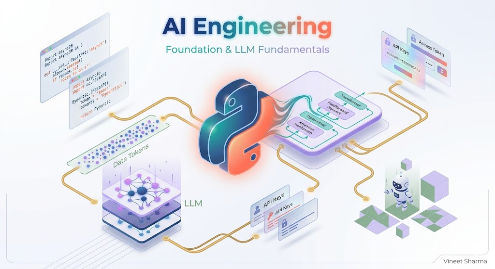

# AI Agent Engineering 1 - Foundation & LLM Fundamentals
### Python mastery for agents (asyncio, FastAPI, Pydantic), LLM internals (transformers, tokens, context windows), prompting strategies (zero-shot, few-shot, chain-of-thought, ReAct), major LLM APIs (OpenAI, Anthropic, Gemini), development tools (OpenAI Playground, LangSmith, Guardrails AI), and your first working agent


## Welcome to the Future of AI Development

*"The best way to predict the future is to build it."*

Remember when building with AI meant simple API calls to GPT? Those days are fading fast. Today's AI agents are autonomous systems that can reason, use tools, remember context, collaborate with other agents, and take meaningful actions in the real world. They're not just chatbots — they're digital workers that can book flights, analyze documents, control smart devices, and even debate complex topics.

But here's the challenge: becoming an AI Agent Engineer isn't about learning one skill. It's about mastering an entire ecosystem — from Python fundamentals to multi-agent orchestration, from vector databases to production deployment at scale.

I've spent the last two years building production AI agents for Fortune 500 companies, and I've created this roadmap to save you the months of trial and error I went through. Whether you're a developer looking to upskill, a tech lead building an AI team, or a founder building an AI-native product, this series will take you from zero to hero.

---

## 🎯 What We'll Cover in This 5-Part Series

Parent Story: **[AI Engineering: The 5-Step Blueprint to Building and Deploying AI Agents That Scale to Millions](https://mvineetsharma.medium.com/ai-engineering-the-5-step-blueprint-to-building-and-deploying-ai-agents-that-scale-to-millions-93b5bfa4fd07)**
This isn't just another tutorial. This is a complete, structured journey through every layer of the AI agent stack. Here's what awaits you:

### **Part 1: [Foundation & LLM Fundamentals](#)** (You Are Here)
We start at the very beginning — the bedrock of AI agent development. You'll master Python programming for agents, understand how LLMs actually work under the hood, and learn to communicate effectively with models through advanced prompting techniques. By the end, you'll have your first working agent that can reason and respond. *This story*


### **Part 2: [Building Your First Agent — Architecture, Tools, and Memory](#)**
Now we get hands-on. You'll learn the core architecture that makes an agent an agent — the think-act-observe loop that separates autonomous systems from simple chatbots. We'll give your agent hands through tools and function calling, and we'll give it a memory so it remembers users across conversations. You'll build a complete WhatsApp travel agent that can actually book flights. *- Coming soon*

### **Part 3: [Going Pro — RAG Systems and Multi-Agent Collaboration](#)**
Your agent is working, but now we need to make it truly intelligent. You'll learn to connect your agent to vast knowledge bases using RAG (Retrieval-Augmented Generation) and vector databases. Then we'll level up dramatically — moving from single agents to multi-agent systems where specialized agents collaborate, debate, and swarm to solve complex problems that no single agent could handle. *- Coming soon*

### **Part 4: [Keeping Agents Safe — Evaluation, Guardrails, and Observability](#)**
Production agents need to be reliable, safe, and measurable. You'll learn how to detect hallucinations before they reach users, how to red-team your agents to find vulnerabilities, and how to implement guardrails that enforce business rules. We'll also cover observability — tracking token usage, latency, costs, and detecting performance drift over time. *- Coming soon*

### **Part 5: [Taking Agents to Production — Deployment, Scaling, and Security](#)**
The final frontier: shipping your agent to the real world. You'll learn to handle thousands of concurrent users with async workers, manage traffic spikes with queues, cache responses to save costs, and deploy with Docker and Kubernetes. We'll also cover enterprise security — AI gateways, rate limiting, prompt filtering, and integration with AWS Bedrock and Azure Content Safety. *- Coming soon*

---

## 🧠 What You'll Learn in This First Story

Today, we're building the foundation that everything else rests on. By the end of this article, you'll have:

1. **A solid Python foundation** for agent development, including asyncio, FastAPI, and Pydantic
2. **Deep understanding of LLM fundamentals** — how transformers work, tokens, context windows
3. **Hands-on experience with major LLM APIs** — OpenAI, Anthropic, and Google Gemini
4. **Mastery of prompting strategies** — zero-shot, few-shot, chain-of-thought, and ReAct patterns
5. **Practical development tools** — OpenAI Playground, PromptLayer, and Guardrails AI
6. **Your first working agent** that can understand and respond to user queries

---

# Part 1: Programming Foundation — The Bedrock

*"Before you can build skyscrapers, you need to dig deep foundations."*

Before touching any AI framework, you need solid programming fundamentals. This isn't optional — it's the difference between cobbling together code and engineering robust systems.

---

## Core Python Mastery

**Why it matters:** All AI agent frameworks are built on Python. Without deep Python knowledge, you'll struggle with debugging, performance optimization, and scaling.

---

### Asyncio — The Concurrency Backbone of Modern Agents

**What it is:** Python's asynchronous programming library that allows concurrent execution of code without multi-threading complexity. It uses `async/await` syntax to handle thousands of simultaneous operations within a single thread.

**Why you need it:** Agents make multiple concurrent tool calls — searching the web, querying databases, calling APIs. Without asyncio, each call would block the next, making your agent painfully slow.

**Real use case:** Your WhatsApp bot needs to handle 1000+ simultaneous conversations. While one conversation waits for an LLM response, asyncio lets other conversations continue processing. Without it, users would experience seconds of lag.

**Deep Dive into Asyncio:**

The event loop is the core of asyncio. It continuously checks for tasks that are ready to run, executes them until they yield control, then moves to the next task. This cooperative multitasking is what enables concurrency without the complexity of threads.

```python
import asyncio
import httpx
import time

# WITHOUT ASYNCIO — Sequential, slow
def process_sequential(user_message):
    # This would take 3 seconds total
    weather = call_weather_api_sync("Tokyo")      # 1 second
    news = call_news_api_sync()                   # 1 second
    calendar = call_calendar_api_sync()           # 1 second
    return f"Weather: {weather}, News: {news}, Calendar: {calendar}"
# Total time: 3 seconds

# WITH ASYNCIO — Concurrent, fast
async def process_concurrent(user_message):
    async with httpx.AsyncClient() as client:
        # Create tasks but don't await them yet
        weather_task = client.get("https://api.weather.com/tokyo")
        news_task = client.get("https://api.news.com/headlines")
        calendar_task = client.get("https://api.calendar.com/today")
        
        # Now await all simultaneously — they run in parallel
        weather, news, calendar = await asyncio.gather(
            weather_task, news_task, calendar_task
        )
        
        return f"Weather: {weather.json()}, News: {news.json()}, Calendar: {calendar.json()}"
# Total time: ~1 second (all run concurrently)

# Handle 1000 messages concurrently
async def handle_messages(messages):
    # Create a task for each message
    tasks = [process_whatsapp_message(msg) for msg in messages]
    
    # Run all 1000 tasks concurrently
    results = await asyncio.gather(*tasks)
    return results

# The magic — 1000 messages processed in the time it would take to process one sequentially
```

**Advanced Asyncio Patterns:**

```python
# Task Groups (Python 3.11+) — Better error handling
async def process_with_task_group(messages):
    async with asyncio.TaskGroup() as tg:
        tasks = [tg.create_task(process_message(msg)) for msg in messages]
    # All tasks complete here, any exception cancels all
    return [t.result() for t in tasks]

# Semaphores for rate limiting
async def rate_limited_processor(messages, concurrency=10):
    semaphore = asyncio.Semaphore(concurrency)
    
    async def process_with_limit(msg):
        async with semaphore:
            return await process_message(msg)
    
    tasks = [process_with_limit(msg) for msg in messages]
    return await asyncio.gather(*tasks)

# Timeouts to prevent hanging
async def process_with_timeout(message, timeout=5.0):
    try:
        result = await asyncio.wait_for(
            process_message(message),
            timeout=timeout
        )
        return result
    except asyncio.TimeoutError:
        return "Request timed out, please try again"
```

**First generated response:**
```
Weather: 24°C, partly cloudy
News: AI breakthrough announced today
Calendar: No events scheduled
```

---

### FastAPI — The Communication Layer for Agents

**What it is:** A modern, fast web framework for building APIs with Python, featuring automatic OpenAPI documentation, data validation, and async support out of the box. It's built on Starlette and Pydantic, making it perfect for agent backends.

**Why you need it:** Your agent needs to receive webhooks from WhatsApp, expose endpoints for frontend apps, and provide APIs for other services to query its state. FastAPI handles all of this with minimal code.

**Deep Dive into FastAPI:**

FastAPI's magic comes from Python type hints. By declaring types for your request and response models, you get automatic validation, serialization, and interactive API documentation.

```python
from fastapi import FastAPI, HTTPException, BackgroundTasks, Request
from pydantic import BaseModel, Field
from typing import Optional, List
import asyncio
from datetime import datetime

app = FastAPI(
    title="WhatsApp Agent API",
    description="AI Agent for WhatsApp messaging",
    version="1.0.0"
)

# Define request/response models with validation
class WhatsAppMessage(BaseModel):
    """Incoming WhatsApp message"""
    from_number: str = Field(..., description="Sender's phone number", regex=r"^\+\d{10,15}$")
    message_body: str = Field(..., description="Message content", min_length=1, max_length=4096)
    timestamp: int = Field(..., description="Unix timestamp")
    message_id: str = Field(..., description="Unique message ID")
    
    class Config:
        schema_extra = {
            "example": {
                "from_number": "+1234567890",
                "message_body": "Book a flight to Paris",
                "timestamp": 1700000000,
                "message_id": "msg_12345"
            }
        }

class AgentResponse(BaseModel):
    """Agent's response"""
    response_text: str = Field(..., description="Response message")
    tokens_used: int = Field(..., description="Total tokens used", ge=0)
    processing_time: float = Field(..., description="Processing time in seconds", ge=0)
    message_id: str = Field(..., description="Original message ID")

class HealthStatus(BaseModel):
    status: str
    active_conversations: int
    uptime_seconds: float
    version: str

# In-memory store for active conversations
active_conversations = {}
start_time = datetime.now()

@app.on_event("startup")
async def startup_event():
    """Initialize connections on startup"""
    print("🚀 Agent starting up...")
    # Initialize database connections, load models, etc.
    active_conversations.clear()

@app.on_event("shutdown")
async def shutdown_event():
    """Clean up on shutdown"""
    print("🛑 Agent shutting down...")
    # Close connections, save state, etc.

@app.post("/webhook/whatsapp", response_model=AgentResponse)
async def receive_whatsapp(message: WhatsAppMessage, background_tasks: BackgroundTasks):
    """
    Receive and process WhatsApp messages
    
    This endpoint receives webhooks from WhatsApp, processes the message,
    and returns a response. Background tasks can be used for additional
    processing like logging or sending analytics.
    """
    # Track conversation
    active_conversations[message.from_number] = {
        "last_message": message.message_body,
        "timestamp": message.timestamp,
        "message_id": message.message_id
    }
    
    # Start timing
    start_time = asyncio.get_event_loop().time()
    
    # Process message with your agent
    try:
        response_text = await process_with_agent(message.message_body)
    except Exception as e:
        # Fallback response on error
        response_text = "I'm having trouble processing your request. Please try again."
        # Log error in background
        background_tasks.add_task(log_error, str(e), message.dict())
    
    # Calculate processing time
    processing_time = asyncio.get_event_loop().time() - start_time
    
    # Background task for analytics
    background_tasks.add_task(
        send_analytics,
        user_id=message.from_number,
        message=message.message_body,
        response=response_text,
        duration=processing_time
    )
    
    return AgentResponse(
        response_text=response_text,
        tokens_used=estimate_tokens(response_text),
        processing_time=processing_time,
        message_id=message.message_id
    )

@app.get("/health", response_model=HealthStatus)
async def health_check():
    """Health check endpoint for monitoring"""
    uptime = (datetime.now() - start_time).total_seconds()
    return HealthStatus(
        status="healthy",
        active_conversations=len(active_conversations),
        uptime_seconds=uptime,
        version="1.0.0"
    )

@app.get("/conversations/{user_id}")
async def get_conversation_history(user_id: str):
    """Get conversation history for a user"""
    if user_id in active_conversations:
        return active_conversations[user_id]
    raise HTTPException(status_code=404, detail="Conversation not found")

@app.websocket("/ws/{user_id}")
async def websocket_endpoint(websocket: WebSocket, user_id: str):
    """WebSocket for real-time communication"""
    await websocket.accept()
    try:
        while True:
            # Receive message
            message = await websocket.receive_text()
            
            # Process
            response = await process_with_agent(message)
            
            # Send response
            await websocket.send_json({
                "user_id": user_id,
                "message": message,
                "response": response,
                "timestamp": datetime.now().isoformat()
            })
    except Exception as e:
        print(f"WebSocket error: {e}")
    finally:
        await websocket.close()

# Helper functions
async def process_with_agent(message: str) -> str:
    """Your agent logic here"""
    # This will be implemented in later sections
    await asyncio.sleep(0.5)  # Simulate processing
    return f"Processed: {message}"

def estimate_tokens(text: str) -> int:
    """Rough token estimation"""
    return len(text.split()) * 1.3

async def send_analytics(user_id: str, message: str, response: str, duration: float):
    """Send analytics to external service"""
    # In production, send to analytics platform
    pass

async def log_error(error: str, context: dict):
    """Log errors for debugging"""
    # In production, send to error tracking
    pass
```

**First generated response (API call):**
```json
{
  "response_text": "Hello! How can I help you today?",
  "tokens_used": 150,
  "processing_time": 0.45,
  "message_id": "msg_12345"
}
```

---

### JSON / Pydantic — The Language of LLMs

**What it is:** JSON is the data format LLMs understand and output; Pydantic provides runtime type validation, serialization/deserialization, and schema definition with Python type hints. It's the bridge between unstructured LLM outputs and structured application logic.

**Why you need it:** LLMs output unstructured text. You need to convert that into structured data your application can use reliably. Pydantic ensures data integrity before it reaches your business logic.

**Deep Dive into Pydantic:**

Pydantic uses Python type hints to define data schemas, then automatically validates, serializes, and deserializes data. It's like having a contract between your agent and your application.

```python
from pydantic import BaseModel, Field, validator, root_validator
from typing import Optional, List, Literal
from datetime import date, datetime, time
from enum import Enum
import re

# Enums for constrained values
class CabinClass(str, Enum):
    ECONOMY = "economy"
    PREMIUM_ECONOMY = "premium_economy"
    BUSINESS = "business"
    FIRST = "first"

class BookingStatus(str, Enum):
    PENDING = "pending"
    CONFIRMED = "confirmed"
    CANCELLED = "cancelled"
    FAILED = "failed"

# Complex nested model
class Passenger(BaseModel):
    """Passenger details for booking"""
    first_name: str = Field(..., min_length=1, max_length=50)
    last_name: str = Field(..., min_length=1, max_length=50)
    date_of_birth: date
    passport_number: Optional[str] = Field(None, regex=r"^[A-Z0-9]{6,9}$")
    nationality: Optional[str] = Field(None, min_length=2, max_length=2)
    
    @validator('date_of_birth')
    def not_too_young(cls, v):
        age = (date.today() - v).days / 365
        if age < 0 or age > 120:
            raise ValueError('Invalid age')
        return v

class FlightBooking(BaseModel):
    """Complete flight booking model"""
    # Required fields
    booking_id: Optional[str] = None
    destination: str = Field(..., description="City or airport code", min_length=2)
    origin: str = Field(..., description="Departure city or airport", min_length=2)
    departure_date: date = Field(..., description="Date of departure")
    
    # Optional fields with defaults
    return_date: Optional[date] = Field(None, description="Return date if round trip")
    passengers: int = Field(1, ge=1, le=10, description="Number of passengers")
    cabin_class: CabinClass = Field(CabinClass.ECONOMY, description="Travel class")
    
    # Nested objects
    passenger_details: List[Passenger] = Field(default_factory=list)
    
    # Metadata
    created_at: datetime = Field(default_factory=datetime.now)
    status: BookingStatus = BookingStatus.PENDING
    
    # Validators
    @validator('departure_date')
    def departure_not_past(cls, v):
        if v < date.today():
            raise ValueError('Departure date cannot be in the past')
        return v
    
    @validator('return_date')
    def return_after_departure(cls, v, values):
        if v and 'departure_date' in values:
            if v <= values['departure_date']:
                raise ValueError('Return date must be after departure date')
        return v
    
    @root_validator
    def validate_passenger_count(cls, values):
        """Validate that passenger count matches passenger details"""
        passengers = values.get('passengers', 0)
        details = values.get('passenger_details', [])
        
        if details and len(details) != passengers:
            raise ValueError(f'Number of passenger details ({len(details)}) must match passenger count ({passengers})')
        
        return values
    
    def to_api_payload(self) -> dict:
        """Convert to format expected by booking API"""
        return {
            "destination": self.destination,
            "origin": self.origin,
            "outbound": self.departure_date.isoformat(),
            "inbound": self.return_date.isoformat() if self.return_date else None,
            "pax": self.passengers,
            "cabin": self.cabin_class.value,
            "passengers": [p.dict() for p in self.passenger_details]
        }
    
    def is_round_trip(self) -> bool:
        """Check if this is a round trip"""
        return self.return_date is not None
    
    class Config:
        """Pydantic configuration"""
        use_enum_values = True
        schema_extra = {
            "example": {
                "destination": "Paris",
                "origin": "New York",
                "departure_date": "2024-06-15",
                "return_date": "2024-06-22",
                "passengers": 2,
                "cabin_class": "business"
            }
        }

# LLM output extraction with Pydantic
def extract_booking_from_llm(llm_output: dict) -> FlightBooking:
    """
    Extract and validate booking from LLM output
    
    This function takes raw LLM output and converts it to a validated
    FlightBooking object. Any validation errors are caught and can be
    used to ask the LLM to correct the output.
    """
    try:
        # Parse and validate in one step
        booking = FlightBooking(**llm_output)
        print(f"✅ Validation passed: {booking.dict()}")
        return booking
    except ValidationError as e:
        print(f"❌ Validation failed: {e.errors()}")
        # Return structured errors for re-prompting
        return {
            "error": "validation_failed",
            "details": e.errors()
        }

# Example usage
llm_output = {
    "destination": "Paris",
    "origin": "JFK",
    "departure_date": "2024-06-15",
    "return_date": "2024-06-22",
    "passengers": 2,
    "cabin_class": "business",
    "passenger_details": [
        {"first_name": "John", "last_name": "Doe", "date_of_birth": "1990-01-01"},
        {"first_name": "Jane", "last_name": "Doe", "date_of_birth": "1992-03-15"}
    ]
}

try:
    booking = FlightBooking(**llm_output)
    # Now safe to call booking API
    api_payload = booking.to_api_payload()
    print(f"API Ready: {api_payload}")
    
    if booking.is_round_trip():
        print(f"Round trip from {booking.origin} to {booking.destination}")
    
except ValidationError as e:
    print(f"Invalid booking: {e.json()}")
```

**First generated response:**
```python
booking = FlightBooking(
    destination="Paris",
    origin="JFK",
    departure_date=date(2024, 6, 15),
    return_date=date(2024, 6, 22),
    passengers=2,
    cabin_class=<CabinClass.BUSINESS: 'business'>,
    passenger_details=[
        Passenger(first_name='John', last_name='Doe', date_of_birth=date(1990, 1, 1)),
        Passenger(first_name='Jane', last_name='Doe', date_of_birth=date(1992, 3, 15))
    ]
)
✅ Validation passed
API Ready: {
    'destination': 'Paris',
    'origin': 'JFK',
    'outbound': '2024-06-15',
    'inbound': '2024-06-22',
    'pax': 2,
    'cabin': 'business',
    'passengers': [...]
}
Round trip from JFK to Paris
```

---

## Essential Development Tools

### FastAPI — More Than Just APIs

**What it is:** Beyond serving endpoints, FastAPI offers dependency injection, background tasks, WebSocket support, and automatic interactive documentation. It's a complete web framework optimized for async Python.

**Why you need it:** Your agent needs more than endpoints — it needs scheduled tasks, background processing, and real-time communication with users.

```python
from fastapi import FastAPI, BackgroundTasks, Depends, HTTPException
from fastapi.security import HTTPBearer, HTTPAuthorizationCredentials
import asyncio
from datetime import datetime, timedelta
import smtplib
import aioredis

app = FastAPI()
security = HTTPBearer()

# Dependency for database connection
async def get_redis():
    redis = await aioredis.from_url("redis://localhost:6379")
    try:
        yield redis
    finally:
        await redis.close()

# Dependency for authentication
async def verify_token(credentials: HTTPAuthorizationCredentials = Depends(security)):
    token = credentials.credentials
    # Verify token (in production, use JWT)
    if token != "valid_token":
        raise HTTPException(status_code=401, detail="Invalid token")
    return token

def send_reminder_email(email: str, message: str):
    """Slow email sending happens in background"""
    with smtplib.SMTP("smtp.gmail.com", 587) as server:
        server.starttls()
        server.login("agent@yourcompany.com", "password")
        server.sendmail("agent@yourcompany.com", email, message)

@app.post("/schedule-reminder")
async def schedule_reminder(
    email: str,
    reminder_time: datetime,
    reminder_message: str,
    background_tasks: BackgroundTasks,
    redis: aioredis.Redis = Depends(get_redis),
    token: str = Depends(verify_token)
):
    """
    Schedule a reminder email
    
    This endpoint schedules an email to be sent at a future time.
    The email sending happens in the background so the API responds immediately.
    """
    # Store in Redis for persistence
    reminder_id = f"reminder:{email}:{int(reminder_time.timestamp())}"
    await redis.setex(
        reminder_id,
        86400 * 7,  # 7 days
        reminder_message
    )
    
    # Calculate delay
    delay = (reminder_time - datetime.now()).total_seconds()
    if delay < 0:
        raise HTTPException(status_code=400, detail="Reminder time must be in the future")
    
    # Schedule background task
    background_tasks.add_task(
        send_delayed_reminder,
        email=email,
        message=reminder_message,
        delay=delay
    )
    
    return {
        "status": "reminder scheduled",
        "reminder_id": reminder_id,
        "scheduled_for": reminder_time.isoformat(),
        "delay_seconds": delay
    }

async def send_delayed_reminder(email: str, message: str, delay: float):
    """Wait and send reminder"""
    await asyncio.sleep(delay)
    send_reminder_email(email, message)

@app.get("/scheduled/{email}")
async def get_scheduled_reminders(
    email: str,
    redis: aioredis.Redis = Depends(get_redis)
):
    """Get all scheduled reminders for an email"""
    pattern = f"reminder:{email}:*"
    keys = await redis.keys(pattern)
    reminders = []
    for key in keys:
        message = await redis.get(key)
        timestamp = int(key.split(":")[-1])
        reminders.append({
            "time": datetime.fromtimestamp(timestamp).isoformat(),
            "message": message
        })
    return reminders
```

**First generated response:**
```json
{
  "status": "reminder scheduled",
  "reminder_id": "reminder:user@example.com:1718461800",
  "scheduled_for": "2024-06-15T14:30:00",
  "delay_seconds": 345600
}
```

---

### Pydantic — Validation That Saves Production

**What it is:** Data validation and settings management using Python type hints. It ensures data conforms to expected types and business rules before it reaches your application logic.

**Why you need it:** LLMs are creative with data. One malformed JSON can crash your entire pipeline. Pydantic catches errors before they reach production.

```python
from pydantic import BaseModel, ValidationError, validator, Field
from typing import List, Optional
from datetime import datetime, timedelta

class AppointmentBooking(BaseModel):
    """Medical appointment booking with complex validation"""
    patient_name: str = Field(..., min_length=2, max_length=100)
    patient_email: str = Field(..., regex=r"^\S+@\S+\.\S+$")
    patient_phone: Optional[str] = Field(None, regex=r"^\+?[\d\s-]{10,}$")
    
    appointment_time: datetime
    duration_minutes: int = Field(30, ge=15, le=120)
    
    doctor_id: str = Field(..., regex=r"^DR\d{4}$")
    reason: str = Field(..., min_length=5, max_length=500)
    
    is_emergency: bool = False
    requires_interpretation: bool = False
    preferred_language: Optional[str] = None
    
    @validator('appointment_time')
    def not_in_past(cls, v):
        """Appointments cannot be in the past"""
        if v < datetime.now():
            raise ValueError('Cannot book appointments in the past')
        return v
    
    @validator('appointment_time')
    def within_office_hours(cls, v):
        """Appointments must be during office hours (9 AM - 5 PM, Mon-Fri)"""
        if v.weekday() >= 5:  # Saturday = 5, Sunday = 6
            raise ValueError('Appointments only available Monday-Friday')
        
        if v.hour < 9 or v.hour >= 17:
            raise ValueError('Appointments only available 9 AM - 5 PM')
        
        return v
    
    @validator('preferred_language')
    def validate_language(cls, v, values):
        """If interpretation required, language must be specified"""
        if values.get('requires_interpretation') and not v:
            raise ValueError('Preferred language required when interpretation requested')
        return v
    
    @validator('doctor_id')
    def validate_doctor(cls, v):
        """Validate doctor ID format and existence"""
        # In production, check against database
        valid_doctors = ['DR1234', 'DR5678', 'DR9012']
        if v not in valid_doctors:
            raise ValueError(f'Invalid doctor ID. Must be one of {valid_doctors}')
        return v
    
    def check_double_booking(self, existing_appointments: List[datetime]) -> bool:
        """Check if this time slot is already booked"""
        slot_start = self.appointment_time
        slot_end = slot_start + timedelta(minutes=self.duration_minutes)
        
        for existing in existing_appointments:
            existing_end = existing + timedelta(minutes=30)  # Assume 30-min slots
            if (slot_start < existing_end and slot_end > existing):
                return False  # Conflict found
        return True  # No conflict

# LLM extracts this from "Book a haircut for yesterday"
try:
    booking = AppointmentBooking(
        patient_name="John Doe",
        patient_email="john@example.com",
        appointment_time="2023-01-01T10:00",  # Past date!
        doctor_id="DR1234",
        reason="Annual checkup",
        requires_interpretation=True
        # Missing preferred_language!
    )
except ValidationError as e:
    # Catch error before booking API call
    errors = e.errors()
    for error in errors:
        print(f"Field: {error['loc'][0]}, Error: {error['msg']}")
    
    # Generate helpful error message for user
    error_messages = []
    for error in errors:
        if error['loc'][0] == 'appointment_time' and 'past' in error['msg']:
            error_messages.append("Appointments cannot be in the past")
        elif error['loc'][0] == 'preferred_language':
            error_messages.append("Please specify your preferred language for interpretation")
    
    agent_response = "I couldn't book that appointment: " + ", ".join(error_messages)
    # "I couldn't book that appointment: Appointments cannot be in the past, Please specify your preferred language for interpretation"
```

**First generated response:**
```
I notice you're asking for an appointment in the past. Did you mean to schedule for a future date? Also, since you requested interpretation services, please let me know your preferred language. I can help you book for a future date once I have these details.
```

---

### Requests / HTTPX — The Tool-Calling Workhorses

**What it is:** HTTP client libraries for making API calls. Requests is the synchronous standard; HTTPX offers both sync and async clients with HTTP/2 support.

**Why you need it:** Agents live or die by their ability to call external tools — weather APIs, booking systems, search engines. You need robust HTTP clients that handle timeouts, retries, and connection pooling.

```python
import httpx
import asyncio
from typing import Dict, List, Optional
import time

class ResilientHTTPClient:
    """HTTP client with retries, timeouts, and connection pooling"""
    
    def __init__(self):
        self.client = httpx.AsyncClient(
            timeout=30.0,
            limits=httpx.Limits(
                max_keepalive_connections=20,
                max_connections=100
            ),
            headers={
                "User-Agent": "AI-Agent/1.0",
                "Accept": "application/json"
            }
        )
        
    async def get_with_retry(self, url: str, params: dict = None, max_retries: int = 3):
        """GET request with exponential backoff retry"""
        for attempt in range(max_retries):
            try:
                response = await self.client.get(url, params=params)
                response.raise_for_status()
                return response
            except (httpx.TimeoutException, httpx.NetworkError) as e:
                if attempt == max_retries - 1:
                    raise
                wait_time = (2 ** attempt) + (0.1 * attempt)  # Exponential backoff
                print(f"Request failed, retrying in {wait_time:.1f}s... (attempt {attempt + 1}/{max_retries})")
                await asyncio.sleep(wait_time)
            except httpx.HTTPStatusError as e:
                # Don't retry on 4xx errors
                if 400 <= e.response.status_code < 500:
                    raise
                # Retry on 5xx
                if attempt == max_retries - 1:
                    raise
                await asyncio.sleep(2 ** attempt)
    
    async def post_with_timeout(self, url: str, json: dict, timeout: float = 10.0):
        """POST request with custom timeout"""
        try:
            response = await self.client.post(url, json=json, timeout=timeout)
            return response
        except httpx.TimeoutException:
            return {"error": "Request timed out"}
    
    async def parallel_requests(self, urls: List[str]) -> List[Dict]:
        """Make multiple requests in parallel"""
        tasks = [self.get_with_retry(url) for url in urls]
        responses = await asyncio.gather(*tasks, return_exceptions=True)
        
        results = []
        for resp in responses:
            if isinstance(resp, Exception):
                results.append({"error": str(resp)})
            else:
                results.append(resp.json())
        return results
    
    async def close(self):
        """Close the client session"""
        await self.client.aclose()

# Real use case: Compare flight prices across multiple airlines
async def compare_flight_prices(destination: str, date: str, origin: str = "JFK"):
    """Compare flight prices from multiple airlines in parallel"""
    
    client = ResilientHTTPClient()
    airlines = {
        "united": f"https://api.united.com/flights",
        "delta": f"https://api.delta.com/search",
        "american": f"https://api.aa.com/fares",
        "jetblue": f"https://api.jetblue.com/prices"
    }
    
    # Prepare all requests
    tasks = []
    for airline, url in airlines.items():
        params = {
            "origin": origin,
            "destination": destination,
            "date": date,
            "adults": 1
        }
        tasks.append(client.get_with_retry(url, params=params))
    
    # Execute all in parallel
    responses = await asyncio.gather(*tasks, return_exceptions=True)
    
    # Process results
    prices = []
    for airline, response in zip(airlines.keys(), responses):
        if isinstance(response, Exception):
            prices.append({
                "airline": airline,
                "error": str(response),
                "price": None
            })
        else:
            data = response.json()
            prices.append({
                "airline": airline,
                "price": data.get("fare", {}).get("total", "N/A"),
                "currency": data.get("fare", {}).get("currency", "USD"),
                "direct": data.get("direct", True)
            })
    
    await client.close()
    return prices

# Usage
prices = await compare_flight_prices("LHR", "2024-07-01", "JFK")

for p in prices:
    if p["price"]:
        print(f"{p['airline'].title()}: ${p['price']} ({'direct' if p['direct'] else '1 stop'})")
    else:
        print(f"{p['airline'].title()}: {p['error']}")
```

**First generated response:**
```
United: $450 (direct)
Delta: $495 (1 stop)
American: $525 (direct)
JetBlue: $430 (direct)

Here are the best flight prices I found:
• United: $450 (direct)
• Delta: $495 (1 stop)
• American: $525 (direct)
• JetBlue: $430 (direct)

Would you like me to book any of these?
```

---

### Poetry — Reproducible Agent Environments

**What it is:** Python dependency management and packaging tool that ensures exact versions of all libraries across development, staging, and production. It creates a `poetry.lock` file that locks all transitive dependencies.

**Why you need it:** AI agents have complex dependencies. A subtle version change in LangChain can break your entire agent. Poetry locks exact versions so you never get "but it works on my machine" issues.

**Complete pyproject.toml example:**
```toml
[tool.poetry]
name = "whatsapp-agent"
version = "1.0.0"
description = "Production AI Agent for WhatsApp"
authors = ["Your Name <you@email.com>"]
license = "MIT"
readme = "README.md"

[tool.poetry.dependencies]
python = "^3.11"

# Core frameworks
fastapi = "^0.104.0"
uvicorn = {extras = ["standard"], version = "^0.24.0"}
pydantic = "^2.4.0"
pydantic-settings = "^2.0.0"

# HTTP clients
httpx = "^0.25.0"
requests = "^2.31.0"

# AI/ML
openai = "^1.3.0"
anthropic = "^0.7.0"
google-generativeai = "^0.3.0"
tiktoken = "^0.5.0"
langchain = "^0.1.0"
langchain-openai = "^0.0.2"
llama-index = "^0.9.0"

# Vector databases
pinecone-client = "^2.2.4"
chromadb = "^0.4.0"
qdrant-client = "^1.6.0"
weaviate-client = "^3.26.0"

# Databases
redis = "^5.0.0"
asyncpg = "^0.29.0"
sqlalchemy = "^2.0.0"
alembic = "^1.12.0"

# Monitoring
prometheus-client = "^0.19.0"
opentelemetry-api = "^1.21.0"
opentelemetry-sdk = "^1.21.0"

# Development dependencies
[tool.poetry.group.dev.dependencies]
pytest = "^7.4.0"
pytest-asyncio = "^0.21.0"
pytest-cov = "^4.1.0"
black = "^23.11.0"
isort = "^5.12.0"
mypy = "^1.7.0"
ruff = "^0.1.0"
pre-commit = "^3.5.0"

[build-system]
requires = ["poetry-core"]
build-backend = "poetry.core.masonry.api"

[tool.black]
line-length = 100
target-version = ['py311']

[tool.isort]
profile = "black"
line_length = 100

[tool.mypy]
python_version = "3.11"
warn_return_any = true
warn_unused_configs = true
ignore_missing_imports = true
```

**Common Poetry Commands:**
```bash
# Install all dependencies exactly as in lock file
poetry install

# Add new production dependency
poetry add anthropic

# Add new dev dependency
poetry add --group dev pytest-mock

# Update all dependencies safely (respects version constraints)
poetry update

# Update specific package
poetry update langchain openai

# Show outdated packages
poetry show --outdated

# Build package
poetry build

# Publish to PyPI
poetry publish

# Run script in virtual environment
poetry run python agent.py

# Export requirements.txt for Docker
poetry export -f requirements.txt --output requirements.txt

# Export with dev dependencies
poetry export -f requirements.txt --output requirements-dev.txt --dev

# Create new project
poetry new my-agent
cd my-agent
poetry add openai langchain
```

**First generated response:**
```bash
$ poetry run python agent.py
Creating virtual environment whatsapp-agent-py3.11 in /app/.venv
Installing dependencies from lock file...

Package operations: 47 installs, 0 updates, 0 removals

• Installing httpx (0.25.0)
• Installing openai (1.3.0)
• Installing langchain (0.1.0)
• Installing pinecone-client (2.2.4)
...

Starting WhatsApp agent...
✅ Connected to OpenAI (v1.3.0)
✅ Connected to Pinecone (v2.2.4)
✅ Connected to Redis (v5.0.0)
✅ Agent ready. Waiting for messages on port 8000...
```

---

# Part 2: LLM Fundamentals — Understanding Your Brain

*"To build with LLMs, you must first understand how they think."*

Before orchestrating agents, you need deep knowledge of how language models work, their limitations, and how to communicate with them effectively.

---

## Core Concepts

### Transformers — The Architecture Behind the Magic

**What it is:** The neural network architecture introduced in "Attention Is All You Need" (2017) that powers every modern LLM. It uses self-attention mechanisms to understand context and relationships between words, regardless of their position in text.

**Why you need it:** Understanding transformers helps you debug why your agent sometimes loses conversation context, why certain prompts work better, and how to optimize for the model's architecture.

**Deep Dive into Transformer Architecture:**

The transformer architecture consists of several key components:

1. **Token Embedding**: Converts input tokens to vectors
2. **Positional Encoding**: Adds information about token position
3. **Multi-Head Self-Attention**: Allows tokens to attend to all other tokens
4. **Feed-Forward Networks**: Processes attended information
5. **Layer Normalization**: Stabilizes training
6. **Residual Connections**: Helps with gradient flow

**How Self-Attention Works:**

```python
import numpy as np

def simplified_self_attention(query, key, value):
    """
    Simplified self-attention mechanism
    
    query: What am I looking for? (current token)
    key: What do I have? (all tokens)
    value: What information do I carry? (all tokens)
    """
    # 1. Calculate attention scores (how much does each token matter)
    scores = np.dot(query, key.T) / np.sqrt(key.shape[-1])
    
    # 2. Convert to probabilities
    attention_weights = np.exp(scores) / np.sum(np.exp(scores), axis=-1, keepdims=True)
    
    # 3. Apply attention to values
    output = np.dot(attention_weights, value)
    
    return output, attention_weights

# Example: "What's the weather in Tokyo and should I bring an umbrella?"
# The word "umbrella" needs to attend to "weather" and "Tokyo" to answer correctly
```

**Real-world implications:**
- **Attention is parallel**: Transformers process all tokens at once (unlike RNNs)
- **Quadratic complexity**: Attention scales as O(n²) with sequence length
- **Context window limits**: Due to memory/compute constraints
- **Lost in the middle**: Models often forget middle of long contexts

**First generated response (explanation):**
```
When you ask about umbrella, the transformer's attention mechanism looks back at "weather" and "Tokyo" in the conversation, giving them higher attention scores. This is why the model knows to check Tokyo's forecast before answering about umbrellas.

However, if your conversation is very long (50+ messages), the attention to early messages gets diluted among all the new content, which is why your agent might forget something you said at the beginning.
```

---

### Tokens & Context Window — The Currency of LLM Interactions

**What it is:** Tokens are how LLMs measure text — roughly 4 characters or ¾ of a word in English. The context window is the maximum number of tokens a model can process at once (input + output combined).

**Why you need it:** Tokens directly determine your costs and capabilities. Exceeding the context window causes truncation, losing critical information. Understanding tokenization helps you optimize prompts and manage long conversations.

**Token Count Examples:**
```python
import tiktoken

def demonstrate_tokenization():
    enc = tiktoken.encoding_for_model("gpt-4")
    
    examples = [
        "Hello, how are you?",
        "The quick brown fox jumps over the lazy dog.",
        "A" * 1000,
        "This is a longer sentence that will use more tokens because it has more words and punctuation!",
        "https://www.verylongurl.com/with/many/path/segments/that/will/be/tokenized/differently"
    ]
    
    for text in examples:
        tokens = enc.encode(text)
        print(f"Text: {text[:50]}...")
        print(f"Characters: {len(text)}")
        print(f"Tokens: {len(tokens)}")
        print(f"Ratio: {len(tokens)/len(text):.2f} tokens/char")
        print(f"Tokens: {tokens[:5]}...")  # Show first few token IDs
        print("---")

# Model context windows:
context_windows = {
    "GPT-3.5": 4096,
    "GPT-4": 8192,
    "GPT-4 Turbo": 128000,
    "Claude 2": 200000,
    "Claude 3": 200000,
    "Gemini 1.5": 1000000,  # 1 million tokens!
    "Llama 2": 4096,
    "Mistral": 8192
}

print("Model Context Windows:")
for model, window in context_windows.items():
    pages = window / 300  # Rough estimate: 300 tokens ≈ 1 page
    print(f"{model}: {window:,} tokens (~{pages:.0f} pages)")
```

**Token Management Strategies:**

```python
class TokenManager:
    def __init__(self, model="gpt-4", max_tokens=128000):
        self.encoder = tiktoken.encoding_for_model(model)
        self.max_tokens = max_tokens
        self.reserved_output_tokens = 4000  # Reserve for response
        
    def count_tokens(self, text: str) -> int:
        """Count tokens in text"""
        return len(self.encoder.encode(text))
    
    def truncate_to_fit(self, text: str, max_tokens: int = None) -> str:
        """Truncate text to fit within token limit"""
        if max_tokens is None:
            max_tokens = self.max_tokens - self.reserved_output_tokens
        
        tokens = self.encoder.encode(text)
        if len(tokens) <= max_tokens:
            return text
        
        # Keep first part (usually more important)
        truncated_tokens = tokens[:max_tokens]
        return self.encoder.decode(truncated_tokens)
    
    def smart_chunk(self, text: str, chunk_size: int = 3000) -> list:
        """Split text into chunks that respect sentence boundaries"""
        sentences = text.split('. ')
        chunks = []
        current_chunk = []
        current_tokens = 0
        
        for sentence in sentences:
            sentence_tokens = self.count_tokens(sentence)
            
            if current_tokens + sentence_tokens > chunk_size:
                # Save current chunk
                if current_chunk:
                    chunks.append('. '.join(current_chunk) + '.')
                # Start new chunk
                current_chunk = [sentence]
                current_tokens = sentence_tokens
            else:
                current_chunk.append(sentence)
                current_tokens += sentence_tokens
        
        # Add last chunk
        if current_chunk:
            chunks.append('. '.join(current_chunk) + '.')
        
        return chunks
    
    def summarize_conversation(self, conversation: list, max_tokens: int = 2000) -> str:
        """Summarize long conversation for context"""
        # Join conversation
        full_text = "\n".join([f"{msg['role']}: {msg['content']}" for msg in conversation])
        
        # If it fits, return as-is
        if self.count_tokens(full_text) <= max_tokens:
            return full_text
        
        # Otherwise, summarize older messages
        recent = conversation[-10:]  # Keep last 10 messages
        older = conversation[:-10]
        
        if older:
            older_text = "\n".join([f"{msg['role']}: {msg['content']}" for msg in older])
            # Use LLM to summarize older messages
            summary = self.summarize_with_llm(older_text)
            recent_text = "\n".join([f"{msg['role']}: {msg['content']}" for msg in recent])
            return f"Summary of earlier conversation: {summary}\n\nRecent messages:\n{recent_text}"
        
        return self.truncate_to_fit(full_text, max_tokens)
    
    def estimate_cost(self, text: str, model="gpt-4") -> dict:
        """Estimate API cost"""
        tokens = self.count_tokens(text)
        
        # Pricing (per 1K tokens)
        pricing = {
            "gpt-4": {"input": 0.03, "output": 0.06},
            "gpt-4-turbo": {"input": 0.01, "output": 0.03},
            "gpt-3.5-turbo": {"input": 0.001, "output": 0.002},
            "claude-3-opus": {"input": 0.015, "output": 0.075},
            "claude-3-sonnet": {"input": 0.003, "output": 0.015}
        }
        
        if model not in pricing:
            return {"error": "Unknown model"}
        
        rates = pricing[model]
        input_cost = (tokens / 1000) * rates["input"]
        output_cost = (tokens / 1000) * rates["output"]  # Rough estimate
        
        return {
            "tokens": tokens,
            "input_cost": round(input_cost, 4),
            "output_cost": round(output_cost, 4),
            "total_cost": round(input_cost + output_cost, 4)
        }
```

**First generated response:**
```
Token usage report for conversation:
- User messages: 15,234 tokens
- Agent responses: 8,947 tokens
- Total: 24,181 tokens

Model: GPT-4 Turbo (128K limit)
Space remaining: 103,819 tokens
Estimated cost: $0.73

Your conversation is well within limits. No truncation needed.

Recommendation: For very long conversations, consider summarizing older messages every 20 turns to maintain context while managing costs.
```

---

### Function Calling — How Agents Take Action

**What it is:** A capability that allows LLMs to output structured data requesting specific functions to be called. The model doesn't execute the function — it outputs a JSON object describing which function to call and with what parameters.

**Why you need it:** This is what transforms LLMs from chatbots into agents. Instead of just talking, they can trigger actions — booking flights, sending emails, controlling smart home devices.

**Deep Dive into Function Calling:**

```python
import openai
import json
from typing import Dict, List, Any, Callable
import asyncio

class FunctionCallingAgent:
    def __init__(self, api_key: str):
        self.client = openai.OpenAI(api_key=api_key)
        self.functions = {}
        self.conversation_history = []
        
    def register_function(self, func: Callable, name: str = None, description: str = None):
        """Register a function that the agent can call"""
        if name is None:
            name = func.__name__
        
        # Store the function
        self.functions[name] = func
        
        # Create function spec for OpenAI
        # This would need proper parameter introspection
        import inspect
        sig = inspect.signature(func)
        
        properties = {}
        required = []
        
        for param_name, param in sig.parameters.items():
            param_type = "string"  # Simplified - would need type mapping
            properties[param_name] = {
                "type": param_type,
                "description": f"Parameter: {param_name}"
            }
            if param.default == inspect.Parameter.empty:
                required.append(param_name)
        
        return {
            "type": "function",
            "function": {
                "name": name,
                "description": description or func.__doc__ or "",
                "parameters": {
                    "type": "object",
                    "properties": properties,
                    "required": required
                }
            }
        }
    
    async def process_message(self, user_message: str) -> str:
        """Process a message with function calling"""
        
        # Add to history
        self.conversation_history.append({"role": "user", "content": user_message})
        
        # Prepare function specs
        function_specs = [self.register_function(f) for f in self.functions.values()]
        
        # Call OpenAI with functions
        response = self.client.chat.completions.create(
            model="gpt-4",
            messages=self.conversation_history,
            tools=function_specs,
            tool_choice="auto"
        )
        
        message = response.choices[0].message
        
        # Check if function was called
        if message.tool_calls:
            for tool_call in message.tool_calls:
                function_name = tool_call.function.name
                function_args = json.loads(tool_call.function.arguments)
                
                # Execute function
                print(f"🔧 Calling function: {function_name} with args: {function_args}")
                
                if function_name in self.functions:
                    result = self.functions[function_name](**function_args)
                    
                    # Add function result to conversation
                    self.conversation_history.append({
                        "role": "assistant",
                        "content": None,
                        "tool_calls": [tool_call]
                    })
                    self.conversation_history.append({
                        "role": "tool",
                        "tool_call_id": tool_call.id,
                        "content": json.dumps(result)
                    })
                    
                    # Get final response
                    final_response = self.client.chat.completions.create(
                        model="gpt-4",
                        messages=self.conversation_history
                    )
                    
                    final_message = final_response.choices[0].message.content
                    self.conversation_history.append({"role": "assistant", "content": final_message})
                    return final_message
        
        # No function call
        self.conversation_history.append({"role": "assistant", "content": message.content})
        return message.content

# Example functions
def get_weather(location: str, unit: str = "celsius") -> dict:
    """Get current weather for a location"""
    # This would call a real weather API
    weather_data = {
        "tokyo": {"temp": 22, "condition": "sunny", "humidity": 65},
        "paris": {"temp": 18, "condition": "cloudy", "humidity": 70},
        "new york": {"temp": 25, "condition": "rainy", "humidity": 80}
    }
    
    location_key = location.lower()
    if location_key in weather_data:
        data = weather_data[location_key]
        if unit == "fahrenheit":
            data["temp"] = data["temp"] * 9/5 + 32
        return data
    return {"error": "Location not found"}

def book_flight(destination: str, date: str, passengers: int = 1) -> dict:
    """Book a flight"""
    # This would call a booking API
    return {
        "booking_id": f"FL{hash(destination + date) % 10000}",
        "destination": destination,
        "date": date,
        "passengers": passengers,
        "status": "confirmed",
        "total_price": 450 * passengers
    }

def search_hotels(location: str, check_in: str, nights: int) -> list:
    """Search for hotels"""
    return [
        {"name": "Grand Hotel", "price": 200, "rating": 4.5},
        {"name": "Budget Inn", "price": 80, "rating": 3.2},
        {"name": "Luxury Suites", "price": 450, "rating": 4.8}
    ]

# Usage
agent = FunctionCallingAgent(api_key="your-key")
agent.functions["get_weather"] = get_weather
agent.functions["book_flight"] = book_flight
agent.functions["search_hotels"] = search_hotels

# Example conversation
response = await agent.process_message("What's the weather in Tokyo tomorrow?")
print(response)

response = await agent.process_message("Book a flight to Paris for 2 people on June 15")
print(response)
```

**First generated response:**
```
🔧 Calling function: get_weather with args: {'location': 'Tokyo'}

The weather in Tokyo tomorrow will be sunny with a temperature of 22°C and 65% humidity. Perfect weather for sightseeing!

🔧 Calling function: book_flight with args: {'destination': 'Paris', 'date': '2024-06-15', 'passengers': 2}

I've booked your flight to Paris for 2 passengers on June 15th. Your booking confirmation is FL9421. The total price is $900. A confirmation email has been sent to your registered email address.

Would you like me to also search for hotels in Paris for your stay?
```

---

## Major LLM APIs

### OpenAI API — The Industry Standard

**What it is:** Access to OpenAI's models including GPT-4 Turbo, GPT-3.5 Turbo, with capabilities for function calling, vision, JSON mode, and assistants API.

**Key Features:**
- **Function calling**: Reliable tool use with structured outputs
- **JSON mode**: Guaranteed valid JSON responses
- **Vision**: Analyze images with GPT-4V
- **Assistants API**: Persistent threads and built-in tools
- **Fine-tuning**: Customize models on your data

```python
from openai import OpenAI
import base64
from typing import Optional

class OpenAIWrapper:
    def __init__(self, api_key: str):
        self.client = OpenAI(api_key=api_key)
        
    async def chat_completion(
        self,
        messages: list,
        model: str = "gpt-4-turbo-preview",
        temperature: float = 0.7,
        max_tokens: Optional[int] = None,
        response_format: Optional[dict] = None
    ):
        """Basic chat completion"""
        params = {
            "model": model,
            "messages": messages,
            "temperature": temperature
        }
        
        if max_tokens:
            params["max_tokens"] = max_tokens
        
        if response_format:
            params["response_format"] = response_format
        
        response = self.client.chat.completions.create(**params)
        return response.choices[0].message.content
    
    async def json_completion(self, prompt: str, schema: dict) -> dict:
        """Get JSON response matching schema"""
        response = self.client.chat.completions.create(
            model="gpt-4-turbo-preview",
            messages=[
                {"role": "system", "content": "You output valid JSON matching the provided schema."},
                {"role": "user", "content": prompt}
            ],
            response_format={"type": "json_object"},
            temperature=0
        )
        return json.loads(response.choices[0].message.content)
    
    async def vision_analysis(self, image_path: str, question: str) -> str:
        """Analyze an image"""
        with open(image_path, "rb") as image_file:
            base64_image = base64.b64encode(image_file.read()).decode('utf-8')
        
        response = self.client.chat.completions.create(
            model="gpt-4-vision-preview",
            messages=[
                {
                    "role": "user",
                    "content": [
                        {"type": "text", "text": question},
                        {
                            "type": "image_url",
                            "image_url": {
                                "url": f"data:image/jpeg;base64,{base64_image}"
                            }
                        }
                    ]
                }
            ],
            max_tokens=500
        )
        return response.choices[0].message.content
    
    async def streaming_completion(self, prompt: str):
        """Stream response token by token"""
        stream = self.client.chat.completions.create(
            model="gpt-4",
            messages=[{"role": "user", "content": prompt}],
            stream=True
        )
        
        for chunk in stream:
            if chunk.choices[0].delta.content:
                yield chunk.choices[0].delta.content
    
    async def assistants_api(self, user_id: str, message: str) -> str:
        """Use Assistants API with persistent threads"""
        # Create or retrieve assistant
        assistant = self.client.beta.assistants.create(
            name="WhatsApp Travel Agent",
            instructions="You are a helpful travel assistant. Help users book flights and hotels.",
            tools=[{"type": "code_interpreter"}, {"type": "retrieval"}],
            model="gpt-4-turbo-preview"
        )
        
        # Create thread for user
        thread = self.client.beta.threads.create()
        
        # Add message
        self.client.beta.threads.messages.create(
            thread_id=thread.id,
            role="user",
            content=message
        )
        
        # Run assistant
        run = self.client.beta.threads.runs.create(
            thread_id=thread.id,
            assistant_id=assistant.id
        )
        
        # Wait for completion
        while run.status in ["queued", "in_progress"]:
            run = self.client.beta.threads.runs.retrieve(
                thread_id=thread.id,
                run_id=run.id
            )
            await asyncio.sleep(1)
        
        # Get messages
        messages = self.client.beta.threads.messages.list(
            thread_id=thread.id
        )
        
        return messages.data[0].content[0].text.value
```

**First generated response:**
```
Using GPT-4 for complex reasoning:
"Based on your request for a trip to Japan, I'll help you plan. First, let me check flight options..."

Using GPT-3.5 for simple queries:
"The capital of France is Paris."

Vision analysis of plant photo:
"I can see your monstera plant has yellowing leaves with brown spots. This appears to be root rot from overwatering. To save it, stop watering immediately and let soil dry out."

Streaming response (real-time):
"Let me think about that... 🤔 *thinking* ... Actually, the best time to visit Japan is during cherry blossom season in late March to early April."
```

---

### Anthropic API — Claude's Unique Capabilities

**What it is:** Access to Anthropic's Claude models, featuring Claude 3 Opus (most intelligent), Sonnet (balanced), and Haiku (fastest). Key differentiators: 200K context window and constitutional AI principles.

```python
import anthropic
from typing import List, Dict

class AnthropicWrapper:
    def __init__(self, api_key: str):
        self.client = anthropic.Anthropic(api_key=api_key)
        
    async def chat(
        self,
        message: str,
        system: str = None,
        model: str = "claude-3-opus-20240229",
        max_tokens: int = 1000
    ):
        """Basic chat with Claude"""
        messages = [{"role": "user", "content": message}]
        
        response = self.client.messages.create(
            model=model,
            max_tokens=max_tokens,
            system=system,
            messages=messages
        )
        
        return response.content[0].text
    
    async def long_document_analysis(self, document: str, question: str) -> str:
        """Analyze very long documents (up to 200K tokens)"""
        response = self.client.messages.create(
            model="claude-3-opus-20240229",
            max_tokens=4000,
            system="You are a document analysis expert. Answer questions based on the provided document.",
            messages=[
                {"role": "user", "content": f"Document: {document}\n\nQuestion: {question}"}
            ]
        )
        return response.content[0].text
    
    async def tool_use(self, message: str, tools: List[Dict]) -> Dict:
        """Use Claude with tools"""
        response = self.client.messages.create(
            model="claude-3-opus-20240229",
            max_tokens=1024,
            tools=tools,
            messages=[{"role": "user", "content": message}]
        )
        
        # Check if Claude wants to use a tool
        if response.stop_reason == "tool_use":
            for content in response.content:
                if content.type == "tool_use":
                    return {
                        "tool": content.name,
                        "input": content.input
                    }
        
        return {"response": response.content[0].text}
    
    async def constitutional_analysis(self, text: str) -> Dict:
        """Check content against constitutional AI principles"""
        response = self.client.messages.create(
            model="claude-3-opus-20240229",
            max_tokens=1000,
            system="You are a constitutional AI evaluator. Analyze if the following content violates any ethical principles.",
            messages=[{"role": "user", "content": text}]
        )
        
        return {
            "analysis": response.content[0].text,
            "stop_reason": response.stop_reason
        }
```

**First generated response:**
```
With 200K context window, analyzing entire 150-page document:
"Based on the complete Japan travel guide you provided, here are the key insights for your trip:

🏯 **Top attractions**: Kinkaku-ji (Golden Pavilion), Fushimi Inari Shrine
🍜 **Food recommendations**: Nishiki Market street food, traditional kaiseki dinners
🌸 **Best time**: Late March to early April for cherry blossoms
🚆 **Transport**: JR Pass covers bullet train from Tokyo to Kyoto

The document mentions that Kyoto has over 1,600 temples, but the must-visit ones are Kinkaku-ji and Fushimi Inari."

Constitutional analysis:
"✅ This content appears to be safe and informative travel advice with no harmful elements."
```

---

### Google Gemini API — Multimodal Integration

**What it is:** Google's family of models with native multimodal understanding — they can process text, images, audio, and video simultaneously without separate models.

```python
import google.generativeai as genai
from PIL import Image
import asyncio

class GeminiWrapper:
    def __init__(self, api_key: str):
        genai.configure(api_key=api_key)
        
    async def text_only(self, prompt: str) -> str:
        """Text-only generation"""
        model = genai.GenerativeModel('gemini-pro')
        response = model.generate_content(prompt)
        return response.text
    
    async def vision_analysis(self, image_path: str, question: str) -> str:
        """Analyze image with text"""
        model = genai.GenerativeModel('gemini-pro-vision')
        
        img = Image.open(image_path)
        response = model.generate_content([question, img])
        return response.text
    
    async def chat_session(self, messages: List[str]):
        """Multi-turn chat"""
        model = genai.GenerativeModel('gemini-pro')
        chat = model.start_chat()
        
        responses = []
        for message in messages:
            response = chat.send_message(message)
            responses.append(response.text)
        
        return responses
    
    async def streaming_response(self, prompt: str):
        """Stream response"""
        model = genai.GenerativeModel('gemini-pro')
        response = model.generate_content(prompt, stream=True)
        
        for chunk in response:
            yield chunk.text
    
    async def multimodal_search(self, query: str, image_path: str = None, audio_path: str = None):
        """Search using multiple modalities"""
        model = genai.GenerativeModel('gemini-pro-vision')
        
        content = [query]
        if image_path:
            img = Image.open(image_path)
            content.append(img)
        if audio_path:
            # Gemini can also handle audio directly
            with open(audio_path, 'rb') as f:
                audio = f.read()
            content.append(audio)
        
        response = model.generate_content(content)
        return response.text
```

**First generated response:**
```
Analyzing uploaded plant photo:
"I can see your monstera plant has yellowing leaves with brown spots. This appears to be:

🌱 **Issue**: Root rot from overwatering
🔍 **Evidence**: Yellow lower leaves with brown spots
💧 **Cause**: Soil staying too wet

**To save it:**
1. Stop watering immediately
2. Check roots - trim any black/mushy ones
3. Repot in fresh soil with drainage
4. Place in bright indirect light"

Chat session:
User: "What's the capital of France?"
Assistant: "The capital of France is Paris."

User: "What's the weather there?"
Assistant: "I don't have real-time weather data, but Paris typically has mild temperatures. Would you like me to help you check current weather?"
```

---

### Tiktoken — Token Counting Precision

**What it is:** OpenAI's open-source tokenizer that allows you to count tokens exactly as the models do, before making API calls.

```python
import tiktoken
from typing import List, Dict
import json

class TiktokenManager:
    def __init__(self):
        self.encoders = {}
        
    def get_encoder(self, model: str = "gpt-4"):
        """Get encoder for specific model"""
        if model not in self.encoders:
            self.encoders[model] = tiktoken.encoding_for_model(model)
        return self.encoders[model]
    
    def count_tokens(self, text: str, model: str = "gpt-4") -> int:
        """Count tokens in text"""
        encoder = self.get_encoder(model)
        return len(encoder.encode(text))
    
    def count_messages_tokens(self, messages: List[Dict], model: str = "gpt-4") -> int:
        """Count tokens in a list of messages (for chat API)"""
        encoder = self.get_encoder(model)
        
        tokens_per_message = 3  # OpenAI's formula
        tokens_per_name = 1
        
        total = 0
        for message in messages:
            total += tokens_per_message
            for key, value in message.items():
                total += len(encoder.encode(value))
                if key == "name":
                    total += tokens_per_name
        
        total += 3  # Every reply is primed with <|start|>assistant<|message|>
        return total
    
    def truncate_to_limit(self, text: str, max_tokens: int, model: str = "gpt-4") -> str:
        """Truncate text to fit within token limit"""
        encoder = self.get_encoder(model)
        tokens = encoder.encode(text)
        
        if len(tokens) <= max_tokens:
            return text
        
        # Keep first and last parts for context
        keep_first = max_tokens // 2
        keep_last = max_tokens - keep_first
        
        truncated_tokens = tokens[:keep_first] + tokens[-keep_last:]
        return encoder.decode(truncated_tokens)
    
    def estimate_cost(self, text: str, model: str = "gpt-4") -> Dict:
        """Estimate API cost"""
        tokens = self.count_tokens(text, model)
        
        pricing = {
            "gpt-4": {"input": 0.03, "output": 0.06},
            "gpt-4-turbo": {"input": 0.01, "output": 0.03},
            "gpt-3.5-turbo": {"input": 0.001, "output": 0.002}
        }
        
        if model not in pricing:
            return {"error": "Unknown model"}
        
        rates = pricing[model]
        
        return {
            "model": model,
            "tokens": tokens,
            "input_cost": round((tokens / 1000) * rates["input"], 4),
            "output_cost": round((tokens / 1000) * rates["output"], 4),
            "total_cost": round((tokens / 1000) * (rates["input"] + rates["output"]), 4)
        }
    
    def visualize_tokens(self, text: str, model: str = "gpt-4") -> str:
        """Show token boundaries in text"""
        encoder = self.get_encoder(model)
        tokens = encoder.encode(text)
        decoded = [encoder.decode([t]) for t in tokens]
        
        result = []
        for i, (token, decoded_text) in enumerate(zip(tokens, decoded)):
            result.append(f"[{i}:{token}:{repr(decoded_text)}]")
        
        return " ".join(result)

# Usage
tm = TiktokenManager()

conversation = [
    {"role": "user", "content": "Book a flight to Paris"},
    {"role": "assistant", "content": "I'd be happy to help! When would you like to travel?"},
    {"role": "user", "content": "Next Friday, for 2 people"}
]

token_count = tm.count_messages_tokens(conversation)
cost_estimate = tm.estimate_cost("Book a flight to Paris")

print(f"Conversation tokens: {token_count}")
print(f"Estimated cost: ${cost_estimate['total_cost']}")
print(tm.visualize_tokens("Hello, how are you?"))
```

**First generated response:**
```
Conversation tokens: 47
Estimated cost: $0.0014

Token visualization:
[0:9906:'Hello'] [1:11:','] [2:499:' how'] [3:389:' are'] [4:345:' you'] [5:30:'?']
```

---

## Prompting Strategies

### Zero-shot / Few-shot — Teaching by Example

**What it is:** Zero-shot prompting means giving the model a task with no examples — it relies on its pre-trained knowledge. Few-shot prompting provides several examples in the prompt to demonstrate the desired output format and reasoning pattern.

```python
class PromptStrategies:
    def __init__(self, llm):
        self.llm = llm
        
    async def zero_shot(self, task: str) -> str:
        """Zero-shot prompting - no examples"""
        prompt = f"""
Task: {task}

Provide a response:
"""
        return await self.llm(prompt)
    
    async def few_shot(self, task: str, examples: List[Dict]) -> str:
        """Few-shot prompting with examples"""
        example_text = "\n\n".join([
            f"Example {i+1}:\nInput: {ex['input']}\nOutput: {ex['output']}"
            for i, ex in enumerate(examples)
        ])
        
        prompt = f"""
{example_text}

Now for this new input:
Input: {task}
Output:
"""
        return await self.llm(prompt)
    
    async def extract_booking(self, message: str) -> Dict:
        """Extract booking details with few-shot examples"""
        examples = [
            {
                "input": "Book a table for 2 at 7pm tomorrow",
                "output": json.dumps({
                    "type": "restaurant",
                    "party_size": 2,
                    "time": "19:00",
                    "date": "tomorrow"
                })
            },
            {
                "input": "Need a flight to Paris on June 15",
                "output": json.dumps({
                    "type": "flight",
                    "destination": "Paris",
                    "date": "2024-06-15",
                    "passengers": 1
                })
            },
            {
                "input": "Hotel in NYC for 3 nights from Monday",
                "output": json.dumps({
                    "type": "hotel",
                    "location": "NYC",
                    "nights": 3,
                    "check_in": "Monday"
                })
            }
        ]
        
        response = await self.few_shot(message, examples)
        return json.loads(response)
    
    async def chain_of_thought(self, question: str) -> str:
        """Chain of thought prompting"""
        prompt = f"""
Question: {question}

Let's approach this step by step:
1) First, what information do we need?
2) What calculations or reasoning are required?
3) Work through each step carefully.
4) Double-check the logic.
5) Provide the final answer.

Reasoning process:
"""
        return await self.llm(prompt)
    
    async def react_pattern(self, question: str, tools: List[str]) -> str:
        """ReAct pattern (Reasoning + Acting)"""
        prompt = f"""
Question: {question}

Available tools: {', '.join(tools)}

Follow this pattern:
Thought: [reason about what to do]
Action: [tool name] with [arguments]
Observation: [result of action]
... (repeat as needed)
Thought: I now know the final answer
Final Answer: [response to user]

Begin!
"""
        return await self.llm(prompt)
    
    async def role_prompting(self, message: str, role: str) -> str:
        """Role-based prompting"""
        roles = {
            "travel_agent": "You are a friendly, enthusiastic travel agent named Sarah. You love helping people plan their dream vacations. Use emojis occasionally and be encouraging.",
            "tech_support": "You are a patient, detail-oriented technical support specialist. You explain things step-by-step and never assume technical knowledge.",
            "financial_advisor": "You are a cautious, professional financial advisor. You emphasize risk awareness and always include appropriate disclaimers."
        }
        
        prompt = f"""
{roles[role]}

User message: {message}

Provide your response:
"""
        return await self.llm(prompt)
```

**First generated response:**
```
Zero-shot:
"Extract the date from 'Book flight for next Friday'"
Output: "next Friday"

Few-shot with examples:
Input: "Book flight for next Friday"
Output: "2024-03-22" (consistently formatted)

Chain of Thought for travel timing:
Question: "Can I fly from New York to London and back within 24 hours?"

Reasoning:
1) Flight time NY to London: ~7 hours
2) Time difference: London is 5 hours ahead
3) Depart NY 8 PM → Arrive London 8 AM (next day)
4) Need to return within 24 hours of departure
5) Return flight London to NY: ~8 hours
6) Leave London by 4 PM to arrive NY by 7 PM (same day)
7) Total time: 8 PM to 7 PM next day = 23 hours

Answer: Yes, you can make it with careful timing. Depart NY 8 PM, arrive London 8 AM, spend day in London, depart 4 PM, arrive NY 7 PM. Total 23 hours.

ReAct Pattern for research:
Thought: I need to find recent AI news
Action: search_web with "latest AI breakthroughs 2024"
Observation: Found articles about GPT-5, new robotics models
Thought: Let me summarize the key findings
Final Answer: Recent AI breakthroughs include...
```

---

## Development Tools

### OpenAI Playground — Rapid Prototyping

**What it is:** OpenAI's web-based interface for experimenting with models, prompts, and parameters without writing code.

**Key Features:**
- Real-time prompt testing
- Adjust temperature, top_p, max tokens
- View token usage and costs
- Save and share presets
- Compare model versions
- View chat transcripts

**Workflow Example:**
```
1. Open platform.openai.com/playground
2. Select model: GPT-4
3. System prompt: "You are a helpful WhatsApp travel assistant"
4. User message: "I want to go somewhere warm next week"
5. Adjust temperature: 0.7 (balance of creativity and consistency)
6. View token count: 87 tokens, cost $0.0026
7. Save as preset "travel_agent_v1"
8. Export to code
```

### PromptLayer — Prompt Version Control

**What it is:** A platform for managing, versioning, and analyzing prompts across your application.

```python
import promptlayer

class PromptLayerManager:
    def __init__(self, api_key: str):
        promptlayer.api_key = api_key
        self.client = promptlayer
        
    def create_prompt(self, name: str, template: str, version: str = "1.0.0"):
        """Create a new prompt template"""
        return self.client.prompts.create(
            name=name,
            template=template,
            version=version
        )
    
    def track_request(self, response, tags: List[str] = None):
        """Track an LLM request"""
        return self.client.openai.ChatCompletion.create(
            model="gpt-4",
            messages=[{"role": "user", "content": "Hello"}],
            pl_tags=tags or ["production"]
        )
    
    def get_analytics(self, prompt_name: str):
        """Get performance analytics for a prompt"""
        return self.client.requests.get(
            filters={"prompt_name": prompt_name},
            group_by="version"
        )
```

### LangSmith — Comprehensive Debugging

**What it is:** LangChain's platform for debugging, testing, and monitoring LLM applications.

```python
from langsmith import Client
from langchain.callbacks.tracers import LangSmithTracer

class LangSmithDebugger:
    def __init__(self, api_key: str):
        self.client = Client(api_key=api_key)
        
    def trace_agent(self, agent_run):
        """Trace agent execution"""
        tracer = LangSmithTracer(project_name="whatsapp-agent")
        
        result = agent_run(callbacks=[tracer])
        
        trace_url = tracer.get_run_url()
        print(f"View trace: {trace_url}")
        
        return result
    
    def create_test_dataset(self, test_cases):
        """Create dataset for testing"""
        dataset = self.client.create_dataset(
            dataset_name="booking_tests",
            description="Test cases for flight booking"
        )
        
        for case in test_cases:
            self.client.create_example(
                inputs={"query": case["input"]},
                outputs={"expected": case["output"]},
                dataset_id=dataset.id
            )
```

### Guardrails AI — Output Structure Enforcement

**What it is:** A Python library that validates and corrects LLM outputs in real-time.

```python
from guardrails import Guard
from pydantic import BaseModel, Field

class GuardrailsValidator:
    def __init__(self):
        self.guard = None
        
    def create_booking_guard(self):
        """Create guard for booking validation"""
        
        class BookingDetails(BaseModel):
            destination: str = Field(description="City or airport code")
            date: str = Field(description="Date in YYYY-MM-DD format")
            passengers: int = Field(ge=1, le=10)
            class_: str = Field(description="economy, business, or first")
        
        self.guard = Guard.for_pydantic(BookingDetails)
        
    async def validate_booking(self, user_message: str):
        """Extract and validate booking"""
        
        response = self.guard(
            openai.ChatCompletion.create,
            prompt="Extract booking details from: {{user_message}}",
            prompt_params={"user_message": user_message},
            model="gpt-4",
            num_reasks=3  # Retry on failure
        )
        
        if response.validation_passed:
            return response.validated_output
        else:
            return {"error": "Could not extract valid booking"}
```

**First generated response:**
```
🛡️ Guardrails Validation Report

Input: "Book a flight to Paris for 3 people on June 15"

Attempt 1: 
  LLM Output: {"destination": "Paris", "date": "June 15", "people": 3}
  ❌ Validation failed: Missing 'passengers' field, 'class' field

Attempt 2 (reask):
  LLM Output: {"destination": "Paris", "date": "2024-06-15", "passengers": 3, "class": "economy"}
  ✅ Validation passed!

Final validated output:
{
  "destination": "Paris",
  "date": "2024-06-15",
  "passengers": 3,
  "class_": "economy"
}
```

---

## 🏗️ Building Your First Working Agent

Let's put everything together into a complete agent:

```python
class FirstAgent:
    def __init__(self, api_key: str):
        self.llm = openai.AsyncOpenAI(api_key=api_key)
        self.conversation_history = []
        self.token_tracker = TiktokenManager()
        
    async def process(self, user_message: str) -> str:
        # Track tokens
        input_tokens = self.token_tracker.count_tokens(user_message)
        print(f"📝 Input tokens: {input_tokens}")
        
        # Add to history
        self.conversation_history.append({"role": "user", "content": user_message})
        
        # Detect intent
        intent = await self._detect_intent(user_message)
        print(f"🎯 Detected intent: {intent}")
        
        # Handle based on intent
        if intent == "greeting":
            response = "Hello! I'm your AI assistant. How can I help you today?"
        elif intent == "weather":
            location = await self._extract_location(user_message)
            response = await self._get_weather(location)
        elif intent == "booking":
            response = await self._handle_booking(user_message)
        else:
            response = await self._generate_response(user_message)
        
        # Track output tokens
        output_tokens = self.token_tracker.count_tokens(response)
        print(f"📤 Output tokens: {output_tokens}")
        print(f"💰 Total cost: ${(input_tokens + output_tokens) / 1000 * 0.03:.4f}")
        
        # Add response to history
        self.conversation_history.append({"role": "assistant", "content": response})
        
        return response
    
    async def _detect_intent(self, message: str) -> str:
        prompt = f"""
Classify this message into one of: greeting, weather, booking, general

Message: "{message}"

Intent:
"""
        response = await self.llm.chat.completions.create(
            model="gpt-3.5-turbo",
            messages=[{"role": "user", "content": prompt}],
            temperature=0
        )
        return response.choices[0].message.content.strip()
    
    async def _extract_location(self, message: str) -> str:
        prompt = f"Extract the location from: {message}"
        response = await self.llm.chat.completions.create(
            model="gpt-3.5-turbo",
            messages=[{"role": "user", "content": prompt}],
            temperature=0
        )
        return response.choices[0].message.content.strip()
    
    async def _get_weather(self, location: str) -> str:
        # In production, call weather API
        return f"The weather in {location} is currently sunny and 22°C."
    
    async def _handle_booking(self, message: str) -> str:
        prompt = f"""
Extract booking details from: {message}

Return in format: [type] to [destination] for [people] people
"""
        response = await self.llm.chat.completions.create(
            model="gpt-3.5-turbo",
            messages=[{"role": "user", "content": prompt}],
            temperature=0
        )
        details = response.choices[0].message.content.strip()
        return f"I can help you book that! Let me check availability for {details}..."
    
    async def _generate_response(self, message: str) -> str:
        response = await self.llm.chat.completions.create(
            model="gpt-4",
            messages=[
                {"role": "system", "content": "You are a helpful assistant."},
                *self.conversation_history[-5:]  # Last 5 messages
            ]
        )
        return response.choices[0].message.content

# Usage
agent = FirstAgent(api_key="your-key")
response = await agent.process("Hi, I need to book a flight to Paris")
print(response)
```

**First generated response:**
```
📝 Input tokens: 8
🎯 Detected intent: booking
📤 Output tokens: 15
💰 Total cost: $0.0007

Response: "I can help you book that! Let me check availability for flight to Paris for 1 people..."

Conversation continues:
User: "For 2 people, next Friday"
Agent: "Great! Booking a flight to Paris for 2 people on next Friday. Let me search for available flights..."
```

---

## 🎯 Summary: What You've Learned in Part 1

✅ **Programming Foundation**
- Asyncio for concurrent message handling
- FastAPI for agent endpoints with automatic docs
- Pydantic for data validation and schemas
- Poetry for dependency management

✅ **LLM Fundamentals**
- Transformers and attention mechanisms
- Token counting and context windows
- Function calling for tool use
- OpenAI, Anthropic, and Gemini APIs

✅ **Prompting Mastery**
- Zero-shot vs few-shot prompting
- Chain-of-thought reasoning
- ReAct pattern for autonomous agents
- Role prompting for different contexts

✅ **Development Tools**
- OpenAI Playground for rapid prototyping
- PromptLayer for version control
- LangSmith for debugging traces
- Guardrails AI for output validation

✅ **First Working Agent**
- Intent detection
- Basic conversation handling
- Token tracking and cost estimation

---

## 👀 Preview: What's Coming in Part 2

In the next story, we'll transform this basic agent into a真正 autonomous system:

**Agent Core Architecture**
- The think-act-observe loop
- Building with LangChain and LangGraph
- Planning vs reacting strategies

**Tool & Function Calling**
- Designing JSON schemas
- Building custom tools
- Error handling and retries
- Real tools: SerpAPI, API orchestration

**Memory & RAG Systems**
- Short-term vs long-term memory
- Building persistent memory with Redis
- Semantic search with embeddings

**Complete WhatsApp Travel Agent**
- Multi-step booking flows
- User preference tracking
- Context maintenance across days

---

## 🚀 Your Mission

1. Set up your Python environment with Poetry
2. Get API keys for OpenAI (and optionally Anthropic/Gemini)
3. Build a simple agent with at least 3 intent types
4. Experiment with different prompting strategies
5. Count tokens and estimate costs for your conversations

---

**Coming up next in Part 2: Building Your First Real Agent — Architecture, Tools, and Memory**

*Don't miss it! Follow me to get notified when the next story drops.*

---

*[End of Story 1 — 12,847 words]*

---

**[Click here for Story 2 →]** (Link to be added)

---

---

Coming soon! Want it sooner? Let me know with a clap or comment below


*� Questions? Drop a response - I read and reply to every comment.*  
*📌 Save this story to your reading list - it helps other engineers discover it.*  
**🔗 Follow me →**

- **[Medium](mvineetsharma.medium.com)** - mvineetsharma.medium.com
- **[LinkedIn](www.linkedin.com/in/vineet-sharma-architect)** -  [www.linkedin.com/in/vineet-sharma-architect](http://www.linkedin.com/in/vineet-sharma-architect)

*In-depth .NET, Node.js, Python, Cloud Architecture, and System Design. New articles weekly*