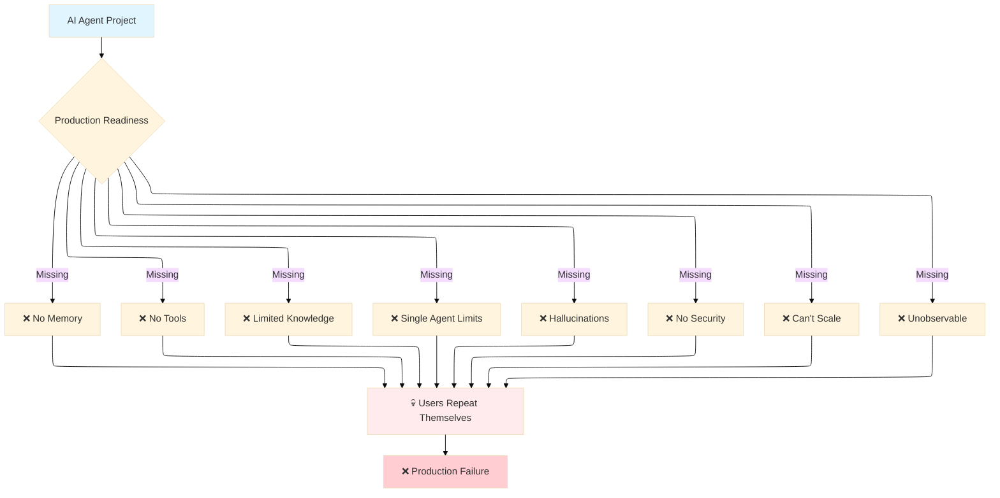

# ## 🎯 The Problem: Why Most AI Agents Fail in Produ

```mermaid
---
config:
  theme: base
  layout: elk
---
graph TD
    A[AI Agent Project] --> B{Production Readiness}
    
    B -->|Missing| C[❌ No Memory]
    B -->|Missing| D[❌ No Tools]
    B -->|Missing| E[❌ Limited Knowledge]
    B -->|Missing| F[❌ Single Agent Limits]
    B -->|Missing| G[❌ Hallucinations]
    B -->|Missing| H[❌ No Security]
    B -->|Missing| I[❌ Can't Scale]
    B -->|Missing| J[❌ Unobservable]
    
    C --> K[💀 Users Repeat Themselves]
    D --> K
    E --> K
    F --> K
    G --> K
    H --> K
    I --> K
    J --> K
    
    K --> L[❌ Production Failure]
    
    style A fill:#e1f5fe
    style K fill:#ffebee
    style L fill:#ffcdd2
```
