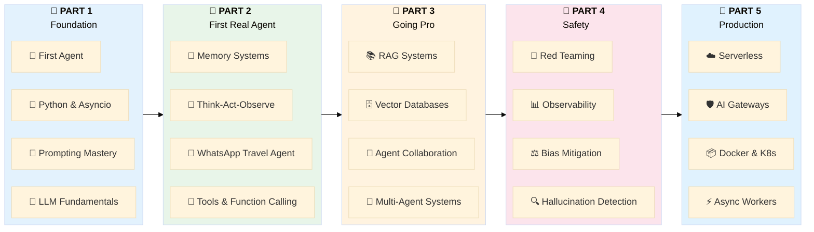

# ## 🔧 The Solution: A 5-Step Blueprint

```mermaid
---
config:
  theme: base
  layout: elk
---
flowchart LR
    subgraph Step1[<b>📖 PART 1</b><br/>Foundation]
        direction TB
        A1[🐍 Python & Asyncio]
        A2[🧠 LLM Fundamentals]
        A3[💬 Prompting Mastery]
        A4[🤖 First Agent]
    end
    
    subgraph Step2[<b>📖 PART 2</b><br/>First Real Agent]
        direction TB
        B1[🔄 Think-Act-Observe]
        B2[🔧 Tools & Function Calling]
        B3[💾 Memory Systems]
        B4[📱 WhatsApp Travel Agent]
    end
    
    subgraph Step3[<b>📖 PART 3</b><br/>Going Pro]
        direction TB
        C1[📚 RAG Systems]
        C2[🗄️ Vector Databases]
        C3[👥 Multi-Agent Systems]
        C4[🤝 Agent Collaboration]
    end
    
    subgraph Step4[<b>📖 PART 4</b><br/>Safety]
        direction TB
        D1[🔍 Hallucination Detection]
        D2[🎯 Red Teaming]
        D3[⚖️ Bias Mitigation]
        D4[📊 Observability]
    end
    
    subgraph Step5[<b>📖 PART 5</b><br/>Production]
        direction TB
        E1[⚡ Async Workers]
        E2[📦 Docker & K8s]
        E3[☁️ Serverless]
        E4[🛡️ AI Gateways]
    end
    
    Step1 --> Step2 --> Step3 --> Step4 --> Step5
    
    style Step1 fill:#e3f2fd
    style Step2 fill:#e8f5e9
    style Step3 fill:#fff3e0
    style Step4 fill:#fce4ec
    style Step5 fill:#e0f2fe
```
