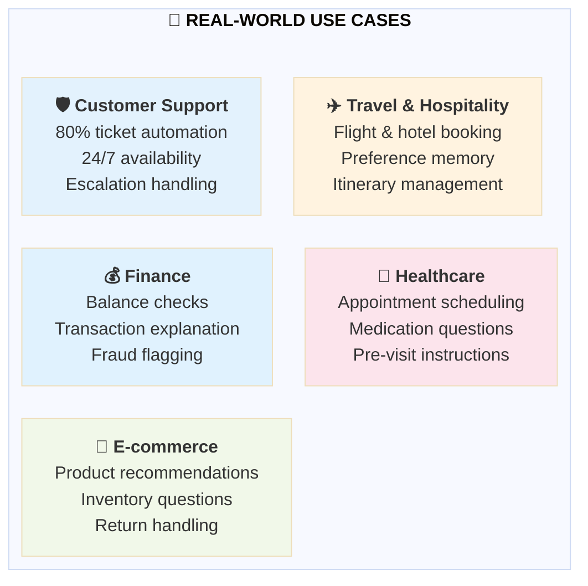

# ## 🏗️ Real-World Use Cases You'll Be Able to Build

```mermaid
---
config:
  theme: base
  layout: elk
---
graph TD
    subgraph UseCases[<b>🏢 REAL-WORLD USE CASES</b>]
        direction TB
        
        CS[<b>🛡️ Customer Support</b><br/>80% ticket automation<br/>24/7 availability<br/>Escalation handling]
        
        TR[<b>✈️ Travel & Hospitality</b><br/>Flight & hotel booking<br/>Preference memory<br/>Itinerary management]
        
        HC[<b>🏥 Healthcare</b><br/>Appointment scheduling<br/>Medication questions<br/>Pre-visit instructions]
        
        FN[<b>💰 Finance</b><br/>Balance checks<br/>Transaction explanation<br/>Fraud flagging]
        
        EC[<b>🛒 E-commerce</b><br/>Product recommendations<br/>Inventory questions<br/>Return handling]
    end
    
    style UseCases fill:#ff
    style CS fill:#e3f2fd
    style TR fill:#fff3e0
    style HC fill:#fce4ec
    style FN fill:#e0f2fe
    style EC fill:#f1f8e9
```
