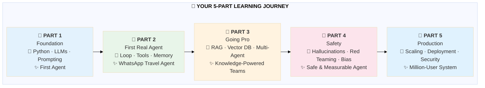

# ## 📚 Series Structure & Learning Path

```mermaid
---
config:
  theme: base
  layout: elk
---
flowchart TD
    subgraph Timeline[<b>📅 YOUR 5-PART LEARNING JOURNEY</b>]
        direction LR
        
        P1[<b>📖 PART 1</b><br/>Foundation<br/>🎯 Python · LLMs · Prompting<br/>✨ First Agent]
        
        P2[<b>📖 PART 2</b><br/>First Real Agent<br/>🎯 Loop · Tools · Memory<br/>✨ WhatsApp Travel Agent]
        
        P3[<b>📖 PART 3</b><br/>Going Pro<br/>🎯 RAG · Vector DB · Multi-Agent<br/>✨ Knowledge-Powered Teams]
        
        P4[<b>📖 PART 4</b><br/>Safety<br/>🎯 Hallucinations · Red Teaming · Bias<br/>✨ Safe & Measurable Agent]
        
        P5[<b>📖 PART 5</b><br/>Production<br/>🎯 Scaling · Deployment · Security<br/>✨ Million-User System]
    end
    
    P1 --> P2 --> P3 --> P4 --> P5
    
    style P1 fill:#e3f2fd
    style P2 fill:#e8f5e9
    style P3 fill:#fff3e0
    style P4 fill:#fce4ec
    style P5 fill:#e0f2fe
```
