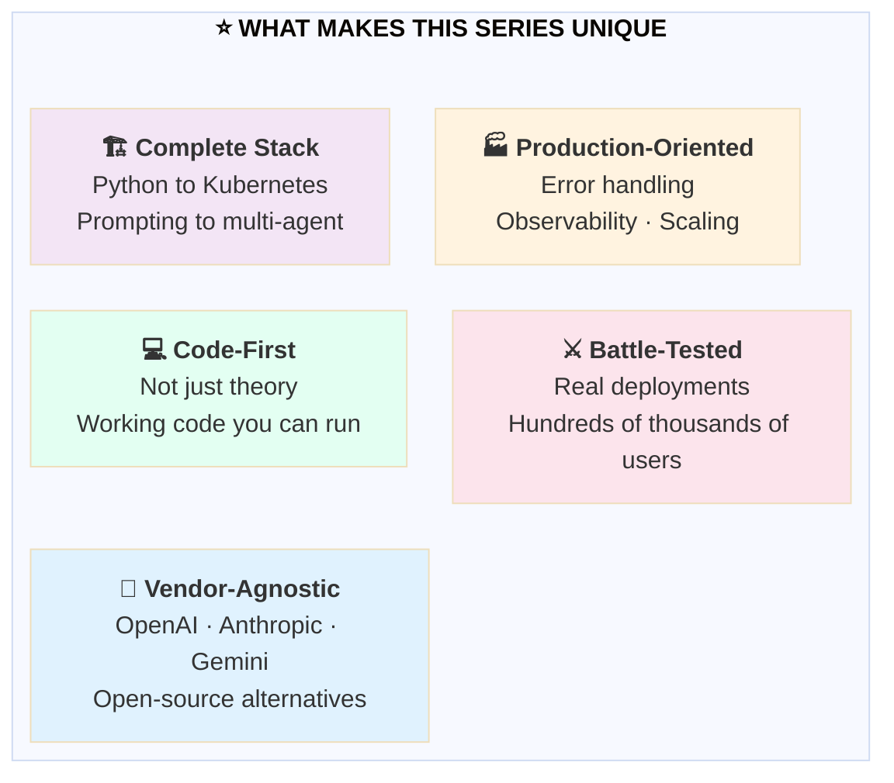

# ## 🎓 What Makes This Series Different

```mermaid
---
config:
  theme: base
  layout: elk
---
graph LR
    subgraph Differentiators[<b>⭐ WHAT MAKES THIS SERIES UNIQUE</b>]
        direction TB
        
        D1[<b>💻 Code-First</b><br/>Not just theory<br/>Working code you can run]
        
        D2[<b>🏭 Production-Oriented</b><br/>Error handling<br/>Observability · Scaling]
        
        D3[<b>🏗️ Complete Stack</b><br/>Python to Kubernetes<br/>Prompting to multi-agent]
        
        D4[<b>⚔️ Battle-Tested</b><br/>Real deployments<br/>Hundreds of thousands of users]
        
        D5[<b>🔌 Vendor-Agnostic</b><br/>OpenAI · Anthropic · Gemini<br/>Open-source alternatives]
    end
    
    style Differentiators fill:ffffff
    style D1 fill:#e3fff2fd
    style D2 fill:#fff3e0
    style D3 fill:#f3e5f5
    style D4 fill:#fce4ec
    style D5 fill:#e0f2fe
```
