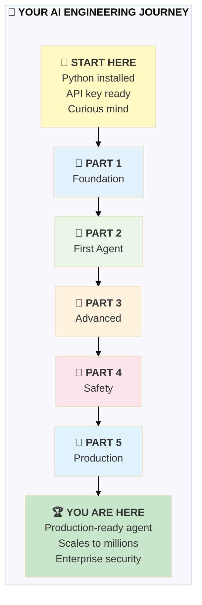

# ## 🚀 Your Journey Starts Now

```mermaid
---
config:
  theme: base
  layout: elk
---
graph LR
    subgraph Journey[<b>🌟 YOUR AI ENGINEERING JOURNEY</b>]
        direction TB
        
        Start[<b>🏁 START HERE</b><br/>Python installed<br/>API key ready<br/>Curious mind]
        
        Part1[<b>📖 PART 1</b><br/>Foundation]
        Part2[<b>📖 PART 2</b><br/>First Agent]
        Part3[<b>📖 PART 3</b><br/>Advanced]
        Part4[<b>📖 PART 4</b><br/>Safety]
        Part5[<b>📖 PART 5</b><br/>Production]
        
        End[<b>🏆 YOU ARE HERE</b><br/>Production-ready agent<br/>Scales to millions<br/>Enterprise security]
    end
    
    Start --> Part1 --> Part2 --> Part3 --> Part4 --> Part5 --> End
    
    style Start fill:#fff9c4
    style Part1 fill:#e3f2fd
    style Part2 fill:#e8f5e9
    style Part3 fill:#fff3e0
    style Part4 fill:#fce4ec
    style Part5 fill:#e0f2fe
    style End fill:#c8e6c9
```
