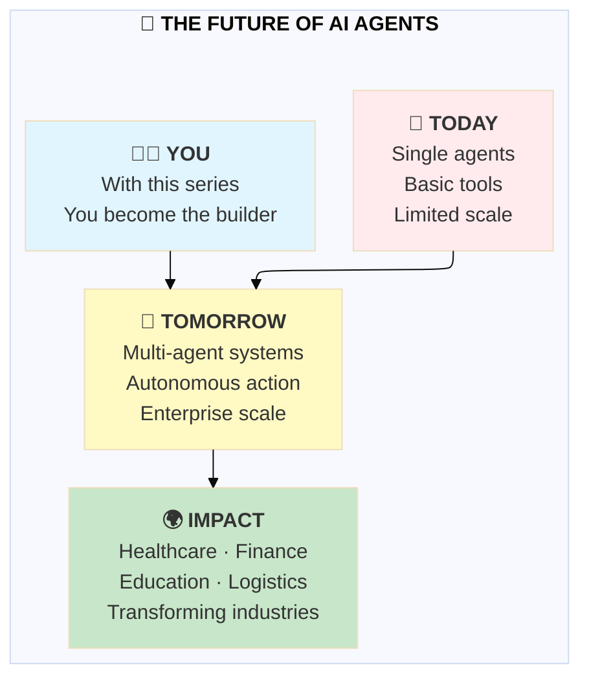

# ## 🌟 Conclusion: The Future Is Built by Engineers 

```mermaid
---
config:
  theme: base
  layout: elk
---
graph TD
    subgraph Future[<b>🚀 THE FUTURE OF AI AGENTS</b>]
        direction TB
        
        Today[<b>📅 TODAY</b><br/>Single agents<br/>Basic tools<br/>Limited scale]
        
        Tomorrow[<b>📅 TOMORROW</b><br/>Multi-agent systems<br/>Autonomous action<br/>Enterprise scale]
        
        You[<b>👨‍💻 YOU</b><br/>With this series<br/>You become the builder]
        
        Impact[<b>🌍 IMPACT</b><br/>Healthcare · Finance<br/>Education · Logistics<br/>Transforming industries]
    end
    
    Today --> Tomorrow
    You --> Tomorrow
    Tomorrow --> Impact
    
    style Today fill:#ffebee
    style Tomorrow fill:#fff9c4
    style You fill:#e1f5fe
    style Impact fill:#c8e6c9
```
