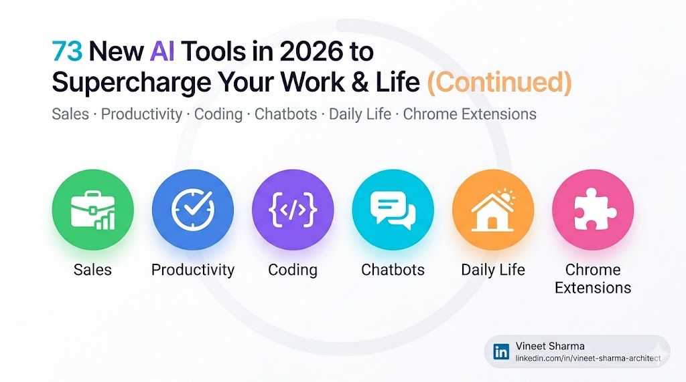
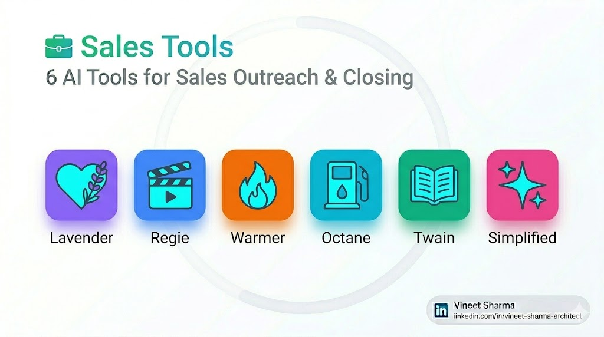
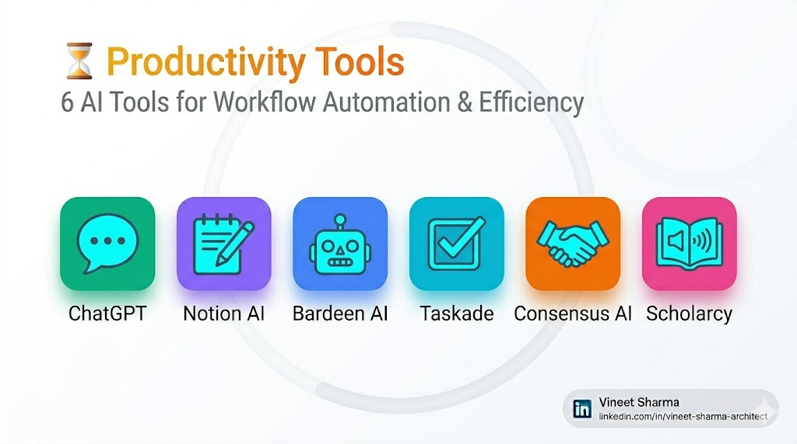
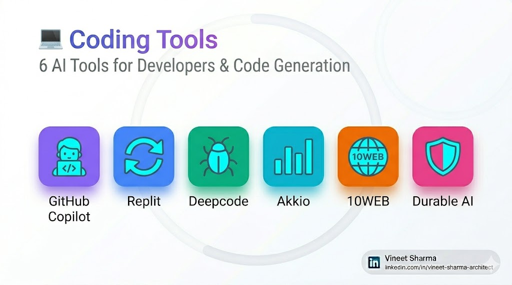
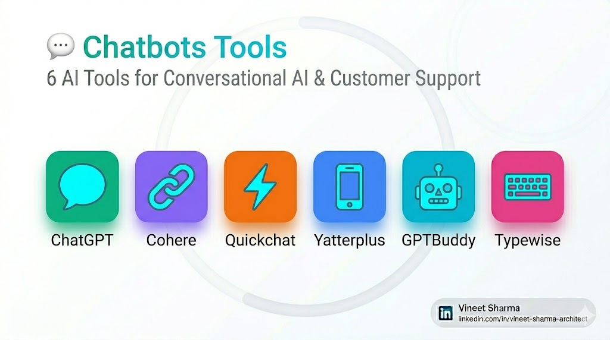
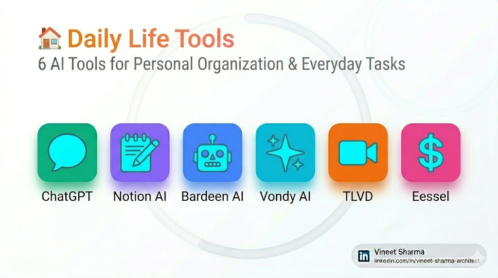
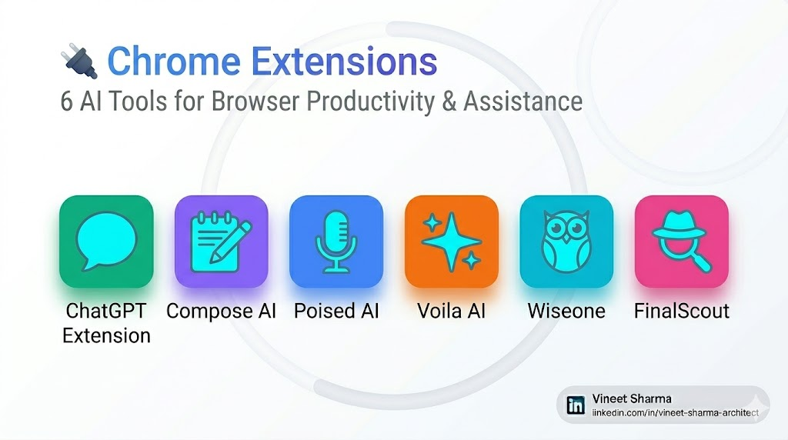

# 73 New AI Tools in 2026 — Sales, Productivity, Coding, Chatbots, Daily Life, Chrome Extensions
### Part 2 of a 2-part series covering 36 AI tools. At the end, you'll find a link back to Part 1 covering Images, YouTube, Content Creation, Writing, Twitter, and Music.*

## 🚀 The Ultimate 2026 Arsenal: 73 New AI Tools to Supercharge Your Work & Life (Continued)

Welcome back! In **Part 1**, we covered 37 powerful AI tools across Images, YouTube, Content Creation, Writing, Twitter, and Music.

Now, let's dive into the remaining **36 tools** — focusing on Sales, Productivity, Coding, Chatbots, Daily Life, and Chrome Extensions.

These are the tools that will automate your workflows, close more deals, write better code, and make your daily life easier.

Let's jump right in.

## 📋 Categories in This Part (Part 2)

1. 💼 Sales Tools (Tools 38-43)
2. ⏳ Productivity Tools (Tools 44-49)
3. 💻 Coding Tools (Tools 50-55)
4. 💬 Chatbots Tools (Tools 56-61)
5. 🏠 Daily Life Tools (Tools 62-67)
6. 🔌 Chrome Extensions (Tools 68-73)

## 💼 Sales Tools

### 38. [Lavender](https://www.lavender.ai)

**Lavender** acts like a real-time email coach that scores your cold emails before you hit send. It analyzes length, personalization, spam triggers, sentiment, and even mobile-friendliness. As you type, Lavender highlights weak sentences and suggests stronger alternatives drawn from millions of high-performing sales emails. It also pulls LinkedIn data about your recipient and inserts personalized icebreakers automatically. The tool integrates directly with [**Salesforce**](https://www.salesforce.com), [**HubSpot**](https://www.hubspot.com), and [**Outreach.io**](https://www.outreach.io).

[**Regie.ai**](https://www.regie.ai) offers similar email coaching, but Lavender focuses more heavily on the psychology of the *first impression*. Regie is built for multi-channel sequences; Lavender obsesses over the single email in front of you. For sales development representatives (SDRs) who live in their inbox all day, Lavender's real-time feedback loop creates faster habit improvement than Regie's campaign-level analytics. Users report a 15-20% increase in reply rates within the first month.

### 39. [Regie](https://www.regie.ai)

**Regie** builds multi-channel outreach sequences that combine email, LinkedIn, phone calls, and even direct mail into a single automated workflow. You set the rules — "if no reply to email in 3 days, send LinkedIn connection request" — and Regie executes across platforms. It also generates all the content for each touchpoint, maintaining a consistent voice while varying the messaging to avoid sounding robotic. The platform includes A/B testing for subject lines and call-to-action buttons.

Compared to [**Outreach.io**](https://www.outreach.io), Regie is more accessible for smaller sales teams. Outreach.io is powerful but requires significant setup and admin overhead. Regie offers similar sequencing intelligence with a lighter touch and built-in content generation. For startups and mid-market teams without a dedicated sales operations person, Regie hits the sweet spot. The pricing is also more flexible, with pay-as-you-go options available.

### 40. [Warmer](https://warmer.ai)

**Warmer** scans your recipient's LinkedIn profile, recent posts, company news, and shared connections to write hyper-personalized icebreaker lines for cold outreach. You paste your draft email, and Warmer suggests three to five opening sentences tailored specifically to that person. It might mention a recent promotion, a shared alma mater, or a comment they left on an industry post — details a human would take 20 minutes to find. The AI learns from which icebreakers get replies and improves its suggestions over time.

Unlike [**Woodpecker**](https://woodpecker.co), which focuses on email automation and follow-up sequences, Warmer is laser-focused on the *first line* of your email — where engagement lives or dies. Woodpecker helps you send more emails; Warmer helps you send *better* emails. For outbound sales reps struggling with reply rates, fixing the opener often has a higher ROI than scaling volume. Many users report doubling their reply rates within two weeks.

### 41. [Octane](https://octane.ai)

**Octane** lets you create interactive product demos without writing a single line of code. You click through your product once, and Octane records your actions, then generates a guided, clickable tour that prospects can explore on their own. These demos include tooltips, hotspots, and branching logic — if a user clicks one feature, they go down one path; if they click another, they see a different flow. The demos embed directly into your website or can be sent as links in emails.

[**Reprise**](https://www.reprise.com) offers similar interactive demo capabilities, but Octane differentiates itself with real-time analytics. You can see exactly where prospects click, how long they spend on each screen, and where they drop off. Reprise gives you the demo; Octane gives you the demo *plus* the behavioral data. For product-led growth teams, that insight is gold. Octane also offers a free tier for up to 100 demo views per month.

### 42. [Twain](https://twain.ai)

**Twain** automates deep research on your prospects by scanning their company website, recent press releases, SEC filings, LinkedIn activity, and even GitHub commits if applicable. It then generates human-like email drafts that reference specific initiatives, challenges, or wins relevant to that person's role. The result feels less like a template and more like a salesperson who genuinely did their homework. Twain also integrates with [**Apollo.io**](https://www.apollo.io) and [**ZoomInfo**](https://www.zoominfo.com) for contact data enrichment.

[**Apollo.io**](https://www.apollo.io) provides contact data and basic intent signals, but Twain goes several layers deeper. Apollo tells you *who* to email; Twain tells you *what* to say. For enterprise sales cycles where personalization can make or break a deal, Twain's research depth gives reps a fighting chance against competitors who rely on generic sequences. The platform is particularly popular among account-based marketing (ABM) teams.

### 43. [Simplified](https://simplified.com) (Sales)

**Simplified** is an all-in-one design tool that uses AI to generate sales collateral — one-pagers, pitch decks, case study summaries, and proposal templates. You feed it your product information and brand guidelines, and Simplified outputs ready-to-use assets in multiple formats. It also includes a library of sales-specific templates optimized for different industries and buyer personas. The AI can repurpose existing content — turn a case study into a one-pager, or a white paper into a slide deck — in seconds.

While [**Tome AI**](https://tome.app) focuses on narrative presentations, Simplified is built for the broader sales enablement stack. Tome helps you tell a story; Simplified helps you create the entire folder of assets a sales rep needs before a big meeting — deck, leave-behind, email follow-up, and social graphic. For lean marketing teams supporting sales, that breadth is a major advantage. Simplified also offers team collaboration features and version control.

## ⏳ Productivity Tools

### 44. [ChatGPT](https://chat.openai.com) (Productivity)

**ChatGPT** has become an indispensable productivity tool for millions of knowledge workers. Beyond conversation, it can draft emails, summarize long documents, translate text, brainstorm ideas, create to-do lists from meeting notes, and even write Excel formulas. The 2026 version includes a "Tasks" feature where you can assign recurring requests — "every Monday, summarize my unread emails" — and ChatGPT delivers. The mobile app now includes voice conversations with real-time translation.

[**Google Gemini**](https://gemini.google.com) offers tighter integration with Google Workspace, while [**Claude**](https://claude.ai) excels at processing extremely long documents. For general productivity — the 80% use cases — ChatGPT remains the most versatile and accessible. The free tier is generous enough for most individual users, and the paid tier ($20/month) adds priority access, longer context windows, and advanced data analysis features.

### 45. [Notion AI](https://www.notion.so/product/ai)

**Notion AI** brings generative AI directly into your Notion workspace. You can summarize meeting notes, brainstorm blog outlines, translate text, fix grammar, or generate action items — all without leaving your document. The AI has access to your Notion pages, so it can reference previous work, answer questions about your database, or pull insights from across your wiki. It can also auto-fill databases, generate property values, and suggest relationships between linked pages.

[**Mem AI**](https://mem.ai) offers similar workspace-native AI, but Notion's ecosystem advantage is overwhelming. Mem is a smaller, newer platform; Notion has millions of active users and decades of accumulated content. For teams already living in Notion, adding Notion AI is seamless. Mem would require a full platform migration, which few teams are willing to attempt. Notion AI is available as an add-on for $10 per member per month.

### 46. [Bardeen AI](https://www.bardeen.ai)

**Bardeen AI** automates repetitive browser tasks across different web apps without coding. You can build "playbooks" that trigger actions — for example, "when I save a LinkedIn profile to a Google Sheet, automatically send a connection request and log the interaction in my CRM." It works across 50+ integrations including [**Gmail**](https://gmail.com), [**Slack**](https://slack.com), [**Airtable**](https://airtable.com), and [**Notion**](https://www.notion.so), chaining together multi-step workflows in seconds. The "recorder" feature watches you perform a task and suggests an automation.

[**Zapier**](https://zapier.com) has been the automation king for years, but Bardeen AI flips the model. Zapier requires you to manually configure every step of a workflow. Bardeen learns from your actions and suggests automations based on your behavior patterns. For users who find Zapier's interface intimidating, Bardeen's "record and replay" approach feels much more natural. Bardeen's free tier includes 250 operations per month, enough for most individual users.

### 47. [Taskade](https://taskade.com)

**Taskade** is a collaborative workspace that combines to-do lists, notes, and mind maps with built-in AI assistance. You can ask Taskade to break down a project into subtasks, estimate timelines, assign owners, or generate meeting agendas. The AI lives inside your task lists, so you can generate action items directly where you'll execute them. The platform includes real-time collaboration, video chat, and multiple view options (list, board, mind map, org chart).

[**ClickUp's AI**](https://clickup.com) offers similar features, but Taskade's interface is simpler and more approachable. ClickUp is powerful but notoriously complex — users often spend weeks learning workflows. Taskade feels more like a souped-up notes app than an enterprise project manager. For small teams and individuals, that lower learning curve is a feature, not a bug. Taskade offers a generous free tier for up to 5 members.

### 48. [Consensus AI](https://consensus.app)

**Consensus AI** searches millions of peer-reviewed research papers and answers your questions with actual scientific findings, not AI hallucinations. You ask "does intermittent fasting improve cognitive function?" and Consensus returns a synthesized answer pulled from multiple studies, complete with citations and confidence scores. It's like [**Google Scholar**](https://scholar.google.com) plus [**ChatGPT**](https://chat.openai.com), but without the made-up references. The platform includes filters for publication date, study type, and journal impact factor.

[**Elicit**](https://elicit.com) is a close competitor, but Consensus focuses more on speed and simplicity. Elicit gives you a spreadsheet of relevant papers; Consensus gives you a plain-English answer backed by those papers. For busy professionals who need research-backed answers in minutes rather than hours, Consensus's direct-answer approach is more practical. Consensus offers a free tier with limited searches and a paid tier for power users.

### 49. [Scholarcy](https://scholarcy.com)

**Scholarcy** reads academic papers and generates interactive summary flashcards that extract the research question, methodology, findings, and limitations. It identifies key figures and tables, links to cited papers, and even checks for replication status. The output is designed to help researchers rapidly screen hundreds of papers to find the few worth reading in full. Scholarcy also creates reference lists in multiple citation formats (APA, MLA, Chicago, etc.).

[**Scite.ai**](https://scite.ai) focuses on citation context — how other papers have cited a given study. Scholarcy focuses on the paper itself. For literature reviews, the ideal workflow is using Scholarcy to skim and select papers, then Scite to understand how the academic community has received them. Alone, Scholarcy is the better starting point for coverage and speed. Scholarcy offers a browser extension and integrates with [**Zotero**](https://www.zotero.org) and [**Mendeley**](https://www.mendeley.com).

## 💻 Coding Tools

### 50. [GitHub Copilot](https://github.com/features/copilot)

**GitHub Copilot** is an AI pair programmer that suggests whole lines or entire functions as you type. It trains on billions of lines of public code and integrates directly into [**VS Code**](https://code.visualstudio.com), [**JetBrains**](https://www.jetbrains.com), and [**Neovim**](https://neovim.io). Copilot understands comments, variable names, and even your coding style, offering relevant suggestions that feel like they came from a human colleague. The 2026 version includes "Copilot Chat" for explaining code, suggesting refactors, and generating unit tests.

[**Tabnine**](https://www.tabnine.com) is Copilot's primary competitor, and the gap has narrowed significantly. Tabnine offers on-premise deployment for companies with security concerns, while Copilot is cloud-only. For individual developers, Copilot's integration with GitHub's ecosystem — pull requests, issues, actions — gives it a workflow advantage. For enterprises with strict data privacy requirements, Tabnine remains the safer choice. Copilot costs $10/month or $100/year for individuals.

### 51. [Replit](https://replit.com)

**Replit** is an online IDE that lets you write, run, and deploy code entirely in your browser. It supports 50+ programming languages and includes built-in AI assistance for code completion, debugging, and explanation. The "Ghostwriter" feature suggests entire functions based on comments, turning plain English descriptions into working code. Replit also includes hosting, databases, and a built-in package manager, making it a complete development environment.

[**GitHub Codespaces**](https://github.com/features/codespaces) offers cloud-based development environments, but Replit's AI integration is more aggressive and accessible. Codespaces gives you a remote machine; Replit gives you a coding assistant. For beginners learning to code, Replit's AI help reduces frustration. For experienced developers building prototypes, Replit's speed-to-deployment is unmatched. Replit offers a free tier with limited compute time.

### 52. [Deepcode](https://deepcode.ai)

**Deepcode** analyzes your codebase to find bugs, security vulnerabilities, and performance issues before they reach production. It learns from your repository's patterns and suggests fixes with explanations. Unlike traditional linters that check against generic rules, Deepcode understands your specific code context — variable names, function structures, and even comment intentions. It integrates with [**GitHub**](https://github.com), [**GitLab**](https://gitlab.com), and [**Bitbucket**](https://bitbucket.org).

[**SonarQube**](https://www.sonarqube.org) has been the static analysis standard for years, but Deepcode adds AI-powered auto-fixing. SonarQube tells you what's wrong; Deepcode tells you how to fix it and can even apply the fix automatically. For development teams racing toward deadlines, the difference between diagnosis and cure is hours of manual work saved. Deepcode offers a free tier for open-source projects and paid plans for private repositories.

### 53. [Akkio](https://akkio.com)

**Akkio** lets you build and deploy machine learning models without writing code. You upload a CSV or connect a database, tell Akkio what you want to predict — "which customers will churn?" — and it automatically trains, tests, and deploys a model. The output is a simple API endpoint you can integrate into your existing workflow. Akkio also includes pre-built templates for common use cases: customer segmentation, sales forecasting, fraud detection, and inventory optimization.

[**DataRobot**](https://www.datarobot.com) offers similar no-code ML, but Akkio targets smaller teams and lighter use cases. DataRobot is enterprise-grade, requiring significant budget and setup. Akkio is self-serve, pay-as-you-go, and designed for business analysts rather than data scientists. For startups and mid-market companies, Akkio provides 80% of DataRobot's value at 10% of the cost. Akkio's free tier includes 100 predictions per month.

### 54. [10WEB](https://10web.io)

**10WEB** uses AI to build, host, and manage WordPress websites. You describe your business — "I run a plumbing service in Chicago" — and 10WEB generates a complete site with pages, images, copy, and forms. It then handles hosting, security updates, backups, and performance optimization. Non-technical users get a professional website without touching code or hiring a developer. The platform also includes AI-powered page builders and image optimization.

[**Wix ADI**](https://www.wix.com/adi) offers similar automated website building, but 10WEB's WordPress foundation gives it more flexibility long-term. Wix sites are locked to Wix's platform; 10WEB builds standard WordPress sites you can export and take anywhere. For users who want AI assistance now but might hire a developer later, 10WEB's portability is a major advantage. 10WEB offers a 7-day free trial and paid plans starting at $24/month.

### 55. [Durable AI](https://durable.ai)

Durable AI builds entire websites, including copy, images, and contact forms, in under 30 seconds. It specializes in service businesses — contractors, consultants, salons, tutors — and includes built-in CRM, invoicing, and email marketing. Durable isn't just a website builder; it's an all-in-one business operating system for solo entrepreneurs. The platform also includes AI-generated blog posts, social media content, and ad copy tailored to your business.

[**Carrd**](https://carrd.co) is great for simple one-page sites, but Durable offers far more functionality. Carrd gives you a presence; Durable gives you a business stack. For freelancers and solopreneurs who need a website, client management, and payment processing in one place, Durable's integrated suite saves the cost and complexity of separate tools. Durable offers a free tier with limited features and paid plans starting at $15/month.

## 💬 Chatbots Tools

### 56. [ChatGPT](https://chat.openai.com) (Chatbots)

**ChatGPT** is the most widely used chatbot in the world, powering everything from customer service to personal assistance. The 2026 version includes customizable "GPTs" — specialized versions of ChatGPT that you can build for specific tasks without coding. You can create a GPT for your business that knows your products, policies, and tone, then embed it on your website or share a link. The platform also includes API access for developers building custom integrations.

[**Google Gemini**](https://gemini.google.com) and [**Claude**](https://claude.ai) are strong competitors, but ChatGPT's ecosystem advantage is significant. Gemini excels at search integration; Claude excels at long documents. ChatGPT has the largest plugin library, the most third-party integrations, and the most active developer community. For most businesses building a chatbot, ChatGPT is the safest starting point. The API costs based on tokens used.

### 57. [Cohere](https://cohere.com)

**Cohere** provides enterprise-grade large language models via API, specializing in retrieval-augmented generation, semantic search, and text classification. Unlike OpenAI's general-purpose models, Cohere's offerings are optimized for business use cases — customer support ticket routing, document summarization, knowledge base search. You can fine-tune models on your proprietary data, and Cohere offers on-premise deployment for companies with strict data privacy requirements.

[**OpenAI's API**](https://openai.com/api) is the obvious competitor, and Cohere's differentiation is data privacy. OpenAI trains on API data by default (unless you opt out); Cohere never trains on customer data. For regulated industries like healthcare and finance, that commitment to privacy makes Cohere the safer enterprise choice despite OpenAI's brand recognition. Cohere offers a free trial with 1,000 API calls per month.

### 58. [Quickchat](https://quickchat.ai)

**Quickchat** lets you build custom AI assistants for your website or app without coding. You define the assistant's personality, knowledge base, and allowed actions — "book a demo," "check order status," "connect to support" — and Quickchat generates an embeddable chat widget. The AI uses retrieval-augmented generation to answer from your documentation rather than hallucinating. Quickchat also includes analytics on user questions, satisfaction ratings, and conversation drop-off points.

[**Intercom's Fin**](https://www.intercom.com) offers similar custom assistants, but Quickchat is significantly cheaper and easier to set up. Fin requires technical implementation and monthly minimums; Quickchat works with a copy-paste embed code and pay-as-you-go pricing. For small businesses and startups, Quickchat makes AI customer service accessible without a six-figure budget. Quickchat's free tier includes 500 conversations per month.

### 59. [Yatterplus](https://yatterplus.com)

**Yatterplus** is a WhatsApp-integrated AI assistant that answers customer questions, books appointments, and processes orders entirely within chat. You train it on your FAQs, policies, and product catalog, and Yatterplus handles conversations 24/7. It supports text, images, voice notes, and even payment links, turning WhatsApp into a full customer service channel. The platform also includes analytics on response times, resolution rates, and customer satisfaction.

[**ManyChat**](https://manychat.com) focuses on Facebook Messenger, but Yatterplus is built specifically for WhatsApp's unique interface. WhatsApp has different expectations around speed, privacy, and media sharing than Messenger. Yatterplus's models are optimized for WhatsApp's user behavior, resulting in more natural conversations than generic chatbot platforms repurposed for the channel. Yatterplus offers a 14-day free trial and paid plans starting at $29/month.

### 60. [GPTBuddy](https://gptbuddy.com)

**GPTBuddy** is a desktop app that puts ChatGPT front and center with keyboard shortcuts, conversation history, and custom prompt templates. You can select text anywhere on your screen, hit a hotkey, and ask GPTBuddy to rewrite, summarize, or explain it. The app also includes a "compose" mode for drafting emails, social posts, or code without switching tabs. GPTBuddy works offline for basic tasks and syncs conversations across devices.

[**ChatGPT's native interface**](https://chat.openai.com) is free, but GPTBuddy's efficiency gains justify the price for power users. The web interface requires constant tab-switching and copying text. GPTBuddy lives in a hotkey and works across any app. For writers, developers, and researchers who use AI dozens of times per day, saving 5 seconds per interaction adds up to hours per month. GPTBuddy costs a one-time fee of $29.

### 61. [Typewise](https://typewise.app)

**Typewise** is an AI keyboard app that learns your typing patterns and predicts words with eerie accuracy. Unlike standard predictive text, Typewise uses a honeycomb layout designed for larger touch targets, reducing typos by 50% according to their studies. The AI runs entirely on-device, so your typing data never leaves your phone. The keyboard supports 40+ languages and includes swipe typing, emoji prediction, and customizable themes.

[**Gboard**](https://gboard.google.com) and [**SwiftKey**](https://www.microsoft.com/swiftkey) have been the keyboard standards for years, but Typewise's privacy-first approach is its killer feature. Google and Microsoft collect typing data to improve their models; Typewise explicitly does not. For privacy-conscious users, that trade-off — slightly less accuracy in exchange for zero data collection — is worth it. Typewise offers a free tier with basic features and a premium tier for advanced predictions.

## 🏠 Daily Life Tools

### 62. [ChatGPT](https://chat.openai.com) (Daily Life)

**ChatGPT** has become a daily companion for millions of people, helping with everything from meal planning to travel itineraries, relationship advice to homework help. The 2026 mobile app includes voice conversations, image recognition, and real-time web search. You can take a photo of your refrigerator contents and ask ChatGPT to suggest a recipe, or snap a picture of a plant to identify it. The "memory" feature remembers your preferences across conversations.

[**Google Gemini**](https://gemini.google.com) offers deeper integration with Google services like Maps, Calendar, and Photos. For users deeply embedded in the Google ecosystem, Gemini is often more convenient. For everyone else, ChatGPT's broader knowledge base and more natural conversation style make it the preferred daily assistant. ChatGPT's free tier is sufficient for most daily tasks, with the paid tier adding priority access and advanced features.

### 63. [Notion AI](https://www.notion.so/product/ai) (Daily Life)

**Notion AI** brings generative AI into your personal workspace, helping you organize your life. You can ask it to create a weekly meal plan, generate a packing list for a trip, draft a grocery list based on recipes, or summarize your daily to-do list. The AI has access to all your Notion pages, so it can reference past notes, track habits, and suggest improvements to your routines.

[**Mem AI**](https://mem.ai) offers similar personal organization features, but Notion's flexibility is unmatched. Mem is designed as a "second brain" with a specific structure; Notion lets you build your own system. For users who enjoy customizing their productivity setup, Notion AI is the better choice. Notion's free tier includes limited AI usage; the paid plan costs $10/month.

### 64. [Bardeen AI](https://www.bardeen.ai) (Daily Life)

**Bardeen AI** automates repetitive browser tasks for daily life. For example: when a new email arrives with an attachment, save it to Google Drive and add the link to a Notion database. Or: when I star an email, create a task in Todoist with the email content. Or: when I open a YouTube video, save the transcript to a Google Doc. Bardeen's "playbooks" run on triggers and save minutes of manual work dozens of times per day.

[**Zapier**](https://zapier.com) is the incumbent, but Bardeen's UI is more accessible for non-technical users. Zapier requires configuring triggers, actions, and filters in separate screens. Bardeen lets you "record" a sequence of clicks and turns it into an automation. For personal productivity automations — as opposed to enterprise integrations — Bardeen's approach feels more natural. Bardeen's free tier includes 250 operations per month.

### 65. [Vondy AI](https://vondy.com)

**Vondy AI** is a "personal AI assistant" that connects to your calendar, email, tasks, and notes to proactively suggest actions. It might notice you have a free hour and recommend drafting a proposal, or see that a client email went unanswered for three days and remind you to follow up. Vondy doesn't wait for commands; it surfaces opportunities. The AI learns your preferences over time — which suggestions you accept and which you ignore — and tailors future recommendations.

[**Google Assistant**](https://assistant.google.com) and [**Siri**](https://www.apple.com/siri) are reactive — they answer questions you ask. Vondy is proactive. That distinction matters for executive assistants and busy professionals who don't know what they've forgotten. Vondy's suggestions sometimes miss context, but catching the one important thing you overlooked makes up for occasional noise. Vondy offers a 14-day free trial and paid plans starting at $15/month.

### 66. [TLVD](https://tlvd.com)

**TLVD** (short for "TL;VD" — Too Long; Didn't View) summarizes videos, podcasts, and long-form audio into text and audio digests. You feed it a link, and TLVD returns a 2-minute summary and a 5-minute "deep dive" audio version you can listen to on the go. It's designed for knowledge workers who have more recommended content than waking hours. TLVD works with YouTube, Spotify, Apple Podcasts, and even local audio files.

[**Eightify**](https://eightify.app) focuses on YouTube only; TLVD handles podcasts, audiobooks, and even lecture recordings. For users who consume multiple content types, TLVD's cross-platform support saves the hassle of using separate summarizers. The audio digest feature is unique — most competitors only output text, but TLVD assumes you're multitasking. TLVD offers a free tier with 5 summaries per month and paid plans starting at $10/month.

### 67. [Eessel](https://eessel.com)

**Eessel** is an AI-powered expense tracker that connects to your bank accounts, scans receipts, and categorizes spending automatically. You snap a photo of a receipt, and Eessel extracts merchant, date, amount, and line items, then files it for tax purposes. The AI learns your categories over time — "that coffee shop is business, that one is personal" — and flags unusual spending patterns. Eessel also generates monthly spending reports and tax summaries.

[**Expensify**](https://www.expensify.com) has been the expense report standard, but Eessel's AI categorization is more accurate and requires less manual correction. Expensify still relies heavily on users selecting categories from drop-downs. Eessel predicts correctly 90% of the time after two weeks of learning. For freelancers and small business owners, that 10% improvement in automation saves hours of bookkeeping each month. Eessel offers a free tier with limited transactions and paid plans starting at $8/month.

## 🔌 Chrome Extensions

### 68. [ChatGPT](https://chat.openai.com) (Chrome Extension)

**ChatGPT**'s official Chrome extension brings AI assistance to every website you visit. You can select text anywhere on the web and ask ChatGPT to explain, summarize, translate, or rewrite it. The extension also adds a sidebar that can reference the page you're viewing — "what are the key arguments in this article?" — and answers without leaving the tab. The extension is free for all ChatGPT users.

[**Merlin**](https://merlin.fyi) offers similar sidebar assistance, but ChatGPT's official extension has better integration with your account history and preferences. Merlin works well for short-form assistance; ChatGPT handles long articles, research papers, and documentation. For users already paying for ChatGPT Plus, the official extension is the obvious choice. It's available for [**Chrome**](https://chrome.google.com/webstore) and [**Edge**](https://www.microsoft.com/edge).

### 69. [Compose AI](https://www.compose.ai)

**Compose AI** autocompletes your sentences anywhere you type in Chrome — email, Google Docs, Slack, Twitter, forms. As you start typing, Compose suggests completions in gray text. Hit Tab to accept. It learns your writing style over time, so suggestions feel natural rather than generic. It's like [**GitHub Copilot**](https://github.com/features/copilot) but for prose instead of code. Compose also includes templates for common message types — follow-ups, introductions, apologies.

[**Grammarly**](https://www.grammarly.com) offers writing suggestions, but Compose focuses on speed rather than correctness. Grammarly flags errors; Compose finishes thoughts. For writers who struggle with blank page syndrome or type slower than they think, Compose's predictive text keeps momentum going. The trade-off is occasional irrelevant suggestions, but ignoring them costs nothing. Compose offers a free tier with basic autocomplete and a premium tier for advanced features.

### 70. [Poised AI](https://www.poised.com)

**Poised AI** is a Chrome extension that provides real-time feedback on your video calls. It analyzes your speaking pace, filler words ("um," "uh," "like"), energy level, and listening ratio. After each meeting, Poised generates a report with specific improvements — "you interrupted twice" or "your energy dipped in the last 10 minutes." It works on [**Zoom**](https://zoom.us), [**Google Meet**](https://meet.google.com), and [**Microsoft Teams**](https://www.microsoft.com/teams).

[**Otter.ai**](https://otter.ai) transcribes meetings; Poised coaches your performance. For professionals who regularly present or lead meetings, Poised's feedback loop accelerates improvement faster than generic public speaking advice. Knowing you say "actually" 47 times in a one-hour call is the first step to saying it zero times. Poised offers a free tier with basic analytics and a premium tier for detailed reports and team features.

### 71. [Voila AI](https://www.getvoila.ai)

**Voila AI** is a Chrome extension that brings ChatGPT-style assistance to any website. You can select text and ask Voila to explain, summarize, translate, or rewrite it. You can also open a chat sidebar that references the page you're viewing — "what are the key arguments in this article?" — and answers without leaving the tab. Voila works on PDFs, articles, emails, and even social media posts.

[**Merlin**](https://merlin.fyi) offers similar sidebar assistance, but Voila's context window is larger, allowing it to reference entire pages rather than just selected text. Merlin works best for short-form assistance; Voila handles long articles, research papers, and documentation. For researchers and students, Voila's ability to process entire documents is essential. Voila offers a free tier with 25 queries per day and a premium tier for unlimited use.

### 72. [Wiseone](https://wiseone.io)

**Wiseone** is a Chrome extension for research and reading. It adds a sidebar to any article or PDF that suggests related concepts, defines jargon, finds cited sources, and generates study questions. You can highlight a term and Wiseone explains it in context, or ask "find more like this" and it searches for similar papers. It's built for students, academics, and deep researchers. Wiseone also integrates with [**Zotero**](https://www.zotero.org) and [**Mendeley**](https://www.mendeley.com) for reference management.

[**Explainpaper**](https://www.explainpaper.com) focuses specifically on academic papers; Wiseone works on any web content. For users who read a mix of news, blog posts, documentation, and research papers, Wiseone's versatility is valuable. The trade-off is less depth on any single content type, but for general research, breadth matters more than specialization. Wiseone offers a free tier with basic features and a premium tier for advanced research tools.

### 73. [FinalScout](https://finalscout.com)

**FinalScout** is a Chrome extension for LinkedIn prospecting. It finds email addresses from LinkedIn profiles, verifies them, and syncs to your CRM. One click on a profile, and FinalScout returns verified email addresses with confidence scores. It also tracks which emails bounce and updates its database accordingly, improving accuracy over time. FinalScout integrates with [**Salesforce**](https://www.salesforce.com), [**HubSpot**](https://www.hubspot.com), and [**Pipedrive**](https://www.pipedrive.com).

[**Hunter.io**](https://hunter.io) and [**Apollo.io**](https://www.apollo.io) offer email finding, but FinalScout's LinkedIn integration is seamless. Hunter requires copy-pasting domains; Apollo requires navigating a separate database. FinalScout works entirely within LinkedIn's interface, saving clicks and context switching. For recruiters and sales pros who live on LinkedIn, that integration is worth the premium pricing. FinalScout offers a free tier with 10 lookups per month and paid plans starting at $29/month.

## 🎯 Final Thoughts

**73 tools. 12 categories. One massive upgrade to your 2026 workflow.**

You don't need to adopt all of these. Pick the category where you spend the most time, try two or three tools, and see what sticks. The best AI tool isn't the most powerful — it's the one you actually use.

**Which category excites you most?** Drop a comment below, and I'll write deep-dive reviews of the top tools in that category.

## 🔗 Navigation

**End of Part 2 (Tools 38-73)**

👉 **[Back to Part 1](https://medium.com/...)** *(Insert your Part 1 link here)*

Part 1 covers:
- 🖼️ Images Tools (Tools 1-6)
- 🎥 YouTube Tools (Tools 7-12)
- 🎨 Content Creation Tools (Tools 13-19)
- ✍️ Writing Tools (Tools 20-25)
- 🐦 Twitter Tools (Tools 26-31)
- 🎵 Music Tools (Tools 32-37)

Coming soon! Want it sooner? Let me know with a clap or comment below

*� Questions? Drop a response - I read and reply to every comment.*  
*📌 Save this story to your reading list - it helps other engineers discover it.*  
**🔗 Follow me →**

- **[Medium](mvineetsharma.medium.com)** - mvineetsharma.medium.com
- **[LinkedIn](www.linkedin.com/in/vineet-sharma-architect)** -  [www.linkedin.com/in/vineet-sharma-architect](http://www.linkedin.com/in/vineet-sharma-architect)

*In-depth .NET, Node.js, Python, Cloud Architecture, and System Design. New articles weekly*