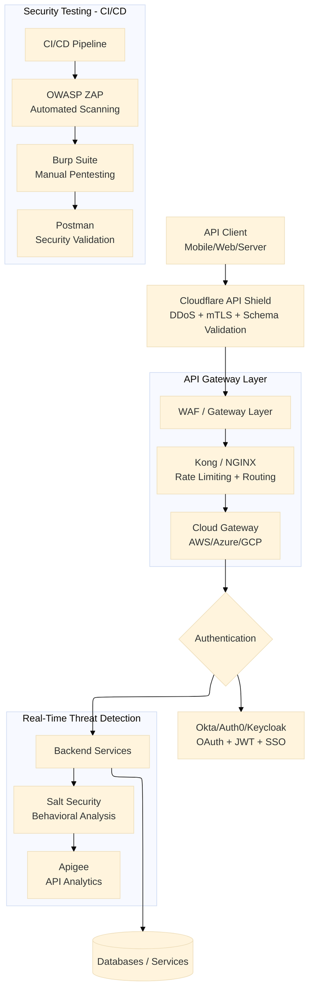
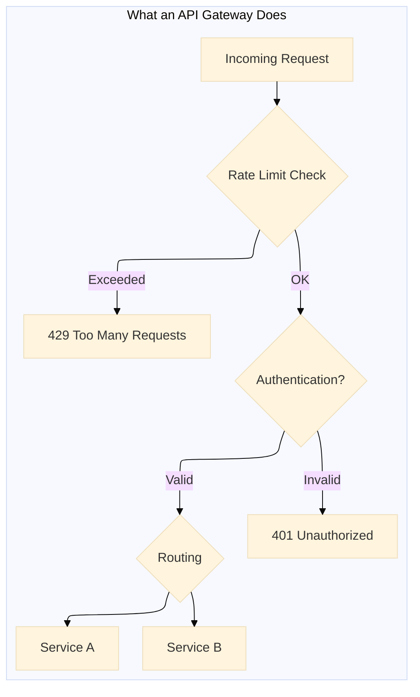
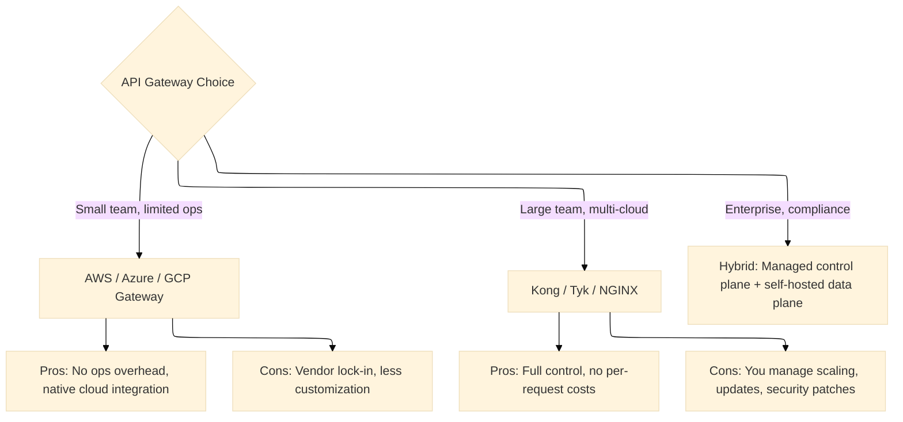
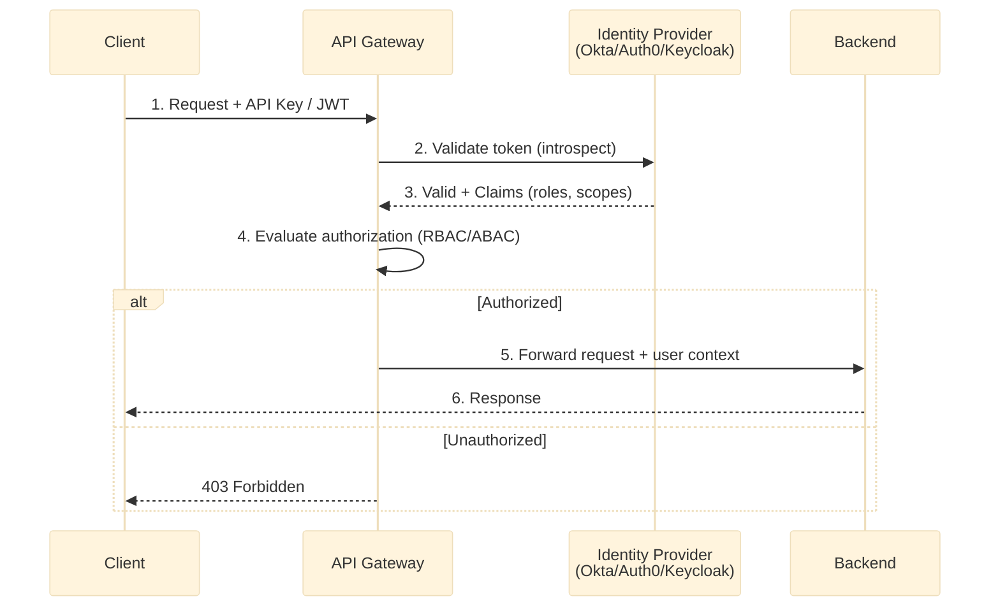
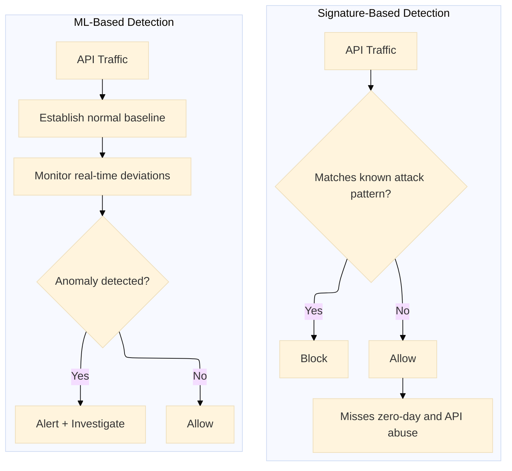
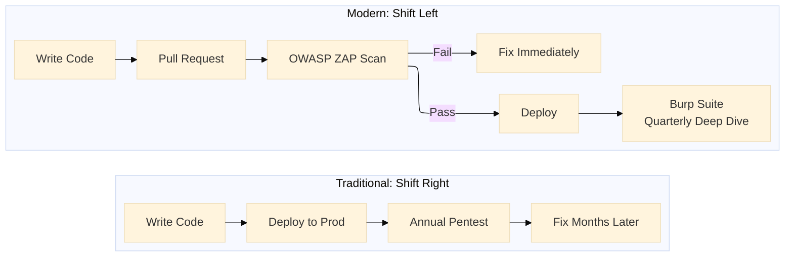
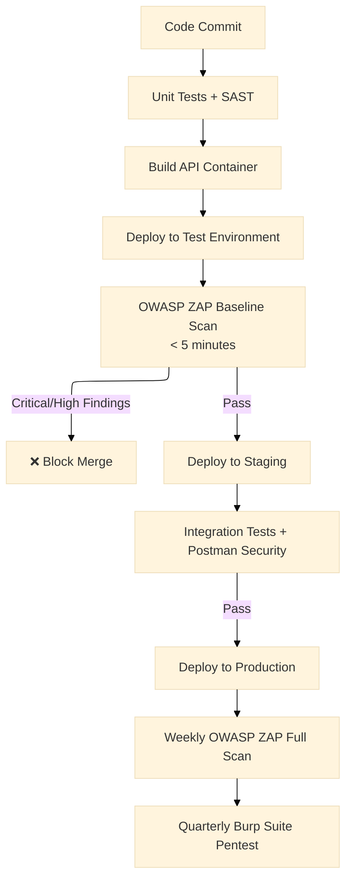
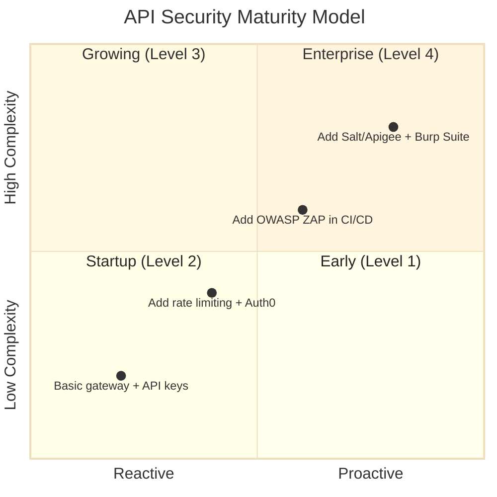

# API Security Arsenal: 15 Essential Tools Every Engineer Should Know
### A complete guide to API security tools including Kong, NGINX, AWS Gateway, Okta, Auth0, Keycloak, Apigee, Salt Security, Cloudflare, OWASP ZAP, Burp Suite, and Postman — with rate limiting strategies, OAuth 2.0 flows, JWT validation, mTLS, behavioral detection, and CI/CD security testing.


APIs are the backbone of modern applications. They connect microservices, power mobile apps, and expose business logic to the world. But with great connectivity comes great vulnerability.

API attacks have grown significantly in recent years, and the majority of organizations experience security incidents in production APIs. The numbers are staggering — but not surprising.

OWASP lists broken API authorization, excessive data exposure, and lack of rate limiting among the **top 10 API security risks**. The good news? You don't have to build defenses from scratch.

Over the years, the security community has developed a rich ecosystem of tools — from open-source scanners to enterprise-grade threat detection platforms. But with 15+ tools claiming to be "essential," where do you start?

This introduction story serves as your map. Below, you will find a navigation list of the five stories to come — each with a "Coming Soon" link. Read on for a detailed breakdown of what each story covers.

*(A parallel version for another major cloud provider will follow this series.)*

---

## 📚 Navigation: Stories in This Series

- 🔐 **1. API Security Arsenal: Securing the Perimeter with Gateways & Ingress Controllers** — *Coming soon*
- 🆔 **2. API Security Arsenal: Mastering Authentication with Okta, Auth0, and Keycloak** — *Coming soon*
- 🛡️ **3. API Security Arsenal: Real-Time Threat Detection with Apigee, Salt, and Cloudflare** — *Coming soon*
- 🧪 **4. API Security Arsenal: Breaking APIs Safely with OWASP ZAP, Burp Suite, and Postman** — *Coming soon*
- 🧠 **5. API Security Arsenal: How to Choose the Right Tools for Your Stack** — *Coming soon*

---

## Detailed Story Breakdowns

### 🔐 1. API Security Arsenal: Securing the Perimeter with Gateways & Ingress Controllers

**Tools covered:** Kong, NGINX API Gateway, AWS API Gateway, Azure API Management, Google Cloud Endpoints, Tyk API Gateway

**What you will learn:** API gateways act as your first line of defense. This story explains how to implement rate limiting, IP whitelisting, request validation, and traffic shaping using managed and open-source gateways — with practical examples from multiple cloud environments.

**Why this matters:** A well-configured gateway stops 80% of common API attacks before they reach your backend. We will explore real-world configurations, performance trade-offs, and when to use a gateway vs. a service mesh.

---

### 🆔 2. API Security Arsenal: Mastering Authentication with Okta, Auth0, and Keycloak

**Tools covered:** Okta, Auth0, Keycloak

**What you will learn:** Move beyond static API keys. This story covers OAuth 2.0, OIDC, JWT, and SSO — and how to integrate these identity providers with cloud-native services like Cognito, Azure AD, and IAM. When to use native vs. third-party IdP.

**Why this matters:** Broken authentication is the #1 cause of API breaches according to OWASP. We will dissect real breach examples (including major incidents) and show exactly how proper IdP configuration could have prevented them.

---

### 🛡️ 3. API Security Arsenal: Real-Time Threat Detection with Apigee, Salt, and Cloudflare

**Tools covered:** Apigee, Salt Security, Cloudflare API Shield

**What you will learn:** Gateways catch obvious attacks. But what about behavioral anomalies, business logic abuse, or zero-day exploits? This story explores advanced platforms that use machine learning, schema validation, and mTLS to detect what traditional tools miss — and how they integrate with cloud workloads.

**Why this matters:** Traditional WAFs and gateways operate on static rules. Modern API attacks look like legitimate traffic. We will explore how ML-based behavioral analysis detects API scraping, credential stuffing, and DDoS attacks that signatures cannot catch.

---

### 🧪 4. API Security Arsenal: Breaking APIs Safely with OWASP ZAP, Burp Suite, and Postman

**Tools covered:** OWASP ZAP, Burp Suite, Postman API Security

**What you will learn:** The best defense is a good offense. This story teaches you how to proactively scan your APIs for OWASP Top 10 vulnerabilities, integrate security testing into your CI/CD pipeline, and think like a hacker using industry-standard pentesting tools.

**Why this matters:** Security testing catches vulnerabilities before attackers do. We will walk through a complete penetration testing workflow — from discovery to exploitation to remediation — using free and commercial tools.

---

### 🧠 5. API Security Arsenal: How to Choose the Right Tools for Your Stack

**Tools covered:** All 15 tools compared side by side

**What you will learn:** Startup vs. enterprise? Cloud-native vs. on-prem? High compliance vs. rapid iteration? This final story provides a practical decision framework — including a comparison matrix and real-world stack recommendations for different scenarios.

**Why this matters:** You cannot (and should not) use all 15 tools. We will build a decision tree that maps your specific constraints — budget, team size, compliance requirements, cloud strategy — to the minimal viable security stack.

---

## Quick Reference: All 15 Tools at a Glance

| Category | Tools |
|----------|-------|
| **API Gateways** | Kong, NGINX, AWS Gateway, Azure API Management, Google Cloud Endpoints, Tyk |
| **Identity & Access** | Okta, Auth0, Keycloak |
| **Advanced Threat Protection** | Apigee, Salt Security, Cloudflare API Shield |
| **Security Testing** | OWASP ZAP, Burp Suite, Postman API Security |

---

## The Big Picture: How These Tools Fit Together

Before diving into individual tools, it helps to understand how they work together in a real-world architecture. The diagram below shows a typical API security stack — from the edge to the database.



**What this diagram shows:** Security is not a single tool — it is a layered strategy. Each layer serves a different purpose:

| Layer | Purpose | Example Tools |
|-------|---------|---------------|
| **Edge Protection** | Stop massive DDoS, enforce mTLS | Cloudflare API Shield |
| **Gateway** | Rate limiting, routing, basic auth | Kong, AWS Gateway |
| **Identity** | Authentication, authorization | Okta, Auth0, Keycloak |
| **Threat Detection** | Behavioral anomalies, API abuse | Salt, Apigee |
| **Testing** | Proactive vulnerability discovery | ZAP, Burp, Postman |

---

## Understanding the OWASP API Security Top 10

To appreciate why these tools matter, you need to understand what you are defending against. The **OWASP API Security Top 10** lists the most critical API vulnerabilities:

```mermaid
---
config:
  layout: elk
  theme: base
---
mindmap
  root((OWASP API Top 10))
    API1:2023 Broken Object Level Authorization
      Most critical
      User A accesses User B's data
    API2:2023 Broken Authentication
      Weak JWT validation
      No MFA
    API3:2023 Broken Object Property Level Authorization
      Mass assignment
      Excessive data exposure
    API4:2023 Unrestricted Resource Consumption
      No rate limiting
      DDoS vulnerability
    API5:2023 Broken Function Level Authorization
      Regular user calls admin API
    API6:2023 Unrestricted Access to Sensitive Business Flows
      Workflow abuse
      Inventory hoarding
    API7:2023 Server Side Request Forgery
      API fetches internal resources
    API8:2023 Security Misconfiguration
      Debug mode enabled
      Default credentials
    API9:2023 Improper Inventory Management
      Deprecated API versions exposed
      Staged APIs in production
    API10:2023 Unsafe Consumption of APIs
      No validation of third-party API responses
```

**Where the tools fit against OWASP Top 10:**

| OWASP Risk | Primary Defense Tools | Secondary Tools |
|------------|----------------------|------------------|
| Broken Object Level Authorization (API1) | Auth0, Okta, Keycloak | Burp Suite (testing) |
| Broken Authentication (API2) | Okta, Auth0, Keycloak | OWASP ZAP |
| Broken Object Property Level Authorization (API3) | Apigee, Salt Security | Postman |
| Unrestricted Resource Consumption (API4) | Kong, NGINX, AWS Gateway | Cloudflare |
| Broken Function Level Authorization (API5) | Okta, Auth0, Keycloak | Burp Suite |
| Unrestricted Access to Business Flows (API6) | Salt Security, Apigee | Cloudflare |
| Server Side Request Forgery (API7) | Cloudflare, AWS Gateway | OWASP ZAP |
| Security Misconfiguration (API8) | All gateways + testing tools | OWASP ZAP |
| Improper Inventory Management (API9) | Apigee, Kong, Tyk | Postman |
| Unsafe Consumption of APIs (API10) | OWASP ZAP, Burp Suite | Salt Security |

---

## Deep Dive: The Four Categories of API Security Tools

Understanding the **categories** is more important than memorizing tool names. Let me break down each category in depth.

### API Gateways (Traffic Control)

API gateways are the bouncers of your API nightclub. They decide who gets in, how many requests they can make, and where they are routed.



**Key capabilities to evaluate:**

| Capability | Why It Matters | Example Use Case |
|------------|----------------|-------------------|
| Rate limiting | Prevents DDoS and brute force | 100 requests per minute per API key |
| Request validation | Blocks malformed payloads | Reject JSON with unexpected fields |
| IP whitelisting/blacklisting | Restricts access by geography or threat intel | Block traffic from known malicious IP ranges |
| Request/response transformation | Hides internal implementation details | Remove `X-Internal-Server` headers |
| Analytics and logging | Provides visibility into API usage | Track error rates by endpoint |

**The open-source vs. managed trade-off:**



---

### Identity and Access Management (Who Are You?)

Authentication answers "Who are you?" Authorization answers "What can you do?" These are the most critical decisions your API makes on every request.



**When to choose each identity provider:**

| Provider | Best For | Key Differentiator |
|----------|----------|---------------------|
| **Okta** | Enterprise (500+ employees) | Best-in-class enterprise integrations (SAP, Workday, Salesforce) |
| **Auth0** | Developer-first teams | Most flexible rule engine, excellent documentation |
| **Keycloak** | Cost-sensitive, self-managed | Open-source, full-featured, no per-seat licensing |

**Critical anti-patterns to avoid:**

❌ **Anti-pattern #1:** Validating JWTs locally without checking revocation
- *Fix:* Use token introspection or short-lived tokens (5-15 minutes)

❌ **Anti-pattern #2:** Storing API keys in localStorage or client-side code
- *Fix:* Use HTTP-only cookies or backend proxy

❌ **Anti-pattern #3:** Rolling your own JWT library or crypto
- *Fix:* Use well-tested libraries from Okta/Auth0/Keycloak

---

### Advanced Threat Detection (Finding the Needle)

Traditional security tools look for **known signatures** — specific patterns that match known attacks. Advanced threat detection looks for **behavioral anomalies** — deviations from normal traffic patterns.



**What behavioral detection catches that signatures miss:**

| Attack Type | Signature-Based | Behavioral-Based |
|-------------|----------------|-------------------|
| Slow DDoS (low-and-slow) | ❌ Misses | ✅ Detects |
| Credential stuffing from distributed IPs | ❌ Misses | ✅ Detects |
| API scraping (legitimate user, automated) | ❌ Misses | ✅ Detects |
| Business logic abuse (e.g., discount stacking) | ❌ Misses | ✅ Detects |
| Data exfiltration over weeks | ❌ Misses | ✅ Detects |

**Real-world example:** A fintech API saw normal traffic of 50-100 requests per user per day. Behavioral detection flagged a user making exactly 200 requests every day at 3 AM — all downloading customer statements. The user had valid credentials. Traditional WAFs saw nothing wrong. Salt Security detected the behavioral anomaly and blocked the exfiltration attempt.

---

### Security Testing (Shifting Left)

"Shift left" means moving security testing earlier in the development lifecycle. Instead of waiting for a penetration test after deployment, you test every pull request.



**Testing tool comparison:**

| Tool | Best For | Learning Curve | Cost | Automation Friendly |
|------|----------|----------------|------|---------------------|
| **OWASP ZAP** | Automated CI/CD scanning | Medium | Free | ✅ Excellent |
| **Burp Suite Professional** | Manual penetration testing | High | $449/year | ⚠️ Limited |
| **Burp Suite Enterprise** | Organization-wide scanning | Medium | Custom | ✅ Yes |
| **Postman API Security** | Developer workflows (existing Postman users) | Low | Included in Postman Enterprise | ✅ Yes |

**Minimum viable testing pipeline:**



---

## Who This Series Is For

- **Backend engineers** building or maintaining APIs
- **DevOps/platform engineers** securing API workloads
- **Security engineers** looking for a tool-agnostic overview
- **Tech leads** choosing an API security stack for cloud-native or hybrid architectures

No prior security expertise is required. Basic familiarity with cloud services (API gateways, identity providers) is helpful but not mandatory.

---

## What Success Looks Like: A Maturity Model

Not every organization needs all 15 tools. Use this maturity model to determine where you should invest.



| Maturity Level | Characteristics | Recommended Tools |
|----------------|----------------|-------------------|
| **Level 1: Early** | No API gateway, hardcoded keys, no rate limiting | Add Kong + Keycloak (free) |
| **Level 2: Startup** | Basic gateway, API keys, some rate limiting | Add Auth0 + OWASP ZAP |
| **Level 3: Growing** | Full gateway features, OAuth/JWT, automated testing | Add Okta + Burp Suite + Postman Security |
| **Level 4: Enterprise** | ML-based detection, quarterly pentests, compliance | Add Salt Security + Apigee + Cloudflare |

---

## Common Mistakes and How to Avoid Them

Based on reviewing hundreds of API security implementations, here are the most common mistakes I see:

### ❌ Mistake #1: "We have a gateway, so we are secure"
A gateway is necessary but not sufficient. Gateways stop obvious attacks but miss business logic abuse, broken object-level authorization, and zero-day exploits.

**Fix:** Layer gateway + identity provider + testing + monitoring.

### ❌ Mistake #2: Using API keys for authentication
API keys identify applications, not users. If a key is leaked, you cannot know which user is responsible.

**Fix:** Use OAuth 2.0 + OIDC with short-lived JWTs for user-level authentication.

### ❌ Mistake #3: Security testing only before production
The average time to detect an API breach is long — often months. Most of that time is spent unaware.

**Fix:** Shift left with automated scanning in CI/CD + continuous monitoring in production.

### ❌ Mistake #4: Ignoring deprecated API versions
Attackers love old API versions. They often have weaker security, no rate limiting, and exposed debug endpoints.

**Fix:** Use your gateway to block all deprecated versions. Maintain an inventory of every exposed endpoint.

### ❌ Mistake #5: No schema validation
Without schema validation, attackers can inject unexpected fields (mass assignment) or oversized payloads (resource exhaustion).

**Fix:** Enforce OpenAPI/Swagger schema validation at the gateway or use Cloudflare API Shield.

---

## Real-World Breach Examples and How These Tools Help

| Breach | Year | Cause | Which Tool Would Have Helped |
|--------|------|-------|------------------------------|
| **Large Telecom** | 2022 | Unauthenticated API endpoint exposing customer data | API Gateway (auth enforcement) |
| **Ride-sharing Giant** | 2022 | Attacker found hardcoded credentials in internal scripts | Okta/Auth0 (MFA + credential rotation) |
| **Major Wireless Carrier** | 2023 | API enumeration attack exposing customer data | Salt Security (behavioral detection) |
| **Software Giant** | 2023 | Exposed test tenant with overly permissive OAuth | OWASP ZAP (pre-production scanning) |
| **Identity Provider** | 2023 | Service account with excessive privileges | Apigee (fine-grained authorization) |

---

## What's Next?

**Story #1** drops next: *API Security Arsenal: Securing the Perimeter with Gateways & Ingress Controllers*

We will compare Kong, NGINX, AWS API Gateway, Azure API Management, and others — including:
- Real configuration examples (rate limiting, auth forwarding, transformation)
- Cost comparison: open-source vs. managed
- Performance benchmarks
- When to use a service mesh instead of a gateway

---

## A Note on What's Coming After

Once this series wraps up, I will publish a parallel version tailored for another major cloud platform. If that is your primary environment, stay tuned.

---

## Your Turn

Before Story #1 arrives, take five minutes to answer these questions about your current API landscape:

1. How many public APIs does your organization expose?
2. Do you have an API gateway? If yes, which one?
3. Are you using API keys or OAuth/JWT?
4. When was your last API penetration test?
5. Do you know which of your API endpoints are deprecated?

Your answers will help you prioritize which stories to read first.

---

*Found this guide useful? Clap 👏, comment, and follow for the remaining five stories. If you have specific questions about any of the tools covered, drop them in the responses — I will address them in the detailed stories.*

---

**Next story:** API Security Arsenal: Securing the Perimeter with Gateways & Ingress Controllers *(Coming soon)*

---
Coming soon! Want it sooner? Let me know with a clap or comment below


*� Questions? Drop a response - I read and reply to every comment.*  
*📌 Save this story to your reading list - it helps other engineers discover it.*  
**🔗 Follow me →**

- **[Medium](mvineetsharma.medium.com)** - mvineetsharma.medium.com
- **[LinkedIn](www.linkedin.com/in/vineet-sharma-architect)** -  [www.linkedin.com/in/vineet-sharma-architect](http://www.linkedin.com/in/vineet-sharma-architect)

*In-depth .NET, Node.js, Python, Cloud Architecture, and System Design. New articles weekly*