# API Security Arsenal: How to Choose the Right Tools for Your Stack

### Practical decision framework for selecting API security tools across 15 options including Kong, NGINX, AWS Gateway, Azure APIM, GCP Endpoints, Tyk, Okta, Auth0, Keycloak, Apigee, Salt Security, Cloudflare, OWASP ZAP, Burp Suite, and Postman. Compare by budget ($0 to $20k+), team size (1 to 100+ developers), cloud provider (AWS-native, Azure-native, GCP-native, multi-cloud), and compliance requirements (SOC2, HIPAA, PCI, FedRAMP). Includes complete comparison matrix, stack recommendations, phasing roadmap (months 0-18), and the golden rule of API security.


You have made it through all 15 tools across five categories:

- **Gateways:** Kong, NGINX, AWS API Gateway, Azure API Management, Google Cloud Endpoints, Tyk
- **Identity Providers:** Okta, Auth0, Keycloak
- **Threat Detection:** Apigee, Salt Security, Cloudflare API Shield
- **Security Testing:** OWASP ZAP, Burp Suite, Postman API Security

But here is the uncomfortable truth: **You cannot use all 15 tools.**

Even if you could afford the licensing costs, your team would drown in alerts, dashboards, and configuration overhead. Security tools have diminishing returns — the 80/20 rule applies aggressively here.

The question is not "Which tools are best?" but rather **"Which tools are best for *my specific situation*?"**

This final story is the fifth in the series. It provides a practical decision framework to help you build an API security stack that fits your budget, team size, risk tolerance, and cloud strategy.

By the end of this story, you will understand:
- A complete comparison matrix of all 15 tools
- Decision frameworks for startups, enterprises, and regulated industries
- Reference architectures for common scenarios
- Budget-based recommendations from $0 to enterprise
- How to phase security tools over time (what to buy first, what to add later)

Let us begin.

---

## 📚 Navigation: Stories in This Series

- 🔐 **1. API Security Arsenal: Securing the Perimeter with Gateways & Ingress Controllers** — *Complete*
- 🆔 **2. API Security Arsenal: Mastering Authentication with Okta, Auth0, and Keycloak** — *Complete*
- 🛡️ **3. API Security Arsenal: Real-Time Threat Detection with Apigee, Salt, and Cloudflare** — *Complete*
- 🧪 **4. API Security Arsenal: Breaking APIs Safely with OWASP ZAP, Burp Suite, and Postman** — *Complete*
- 🧠 **5. API Security Arsenal: How to Choose the Right Tools for Your Stack** — *You are here*

---

## Complete Tool Comparison Matrix

Here is every tool from the series, compared across 12 dimensions.

| Tool | Category | Type | Key Strength | Setup Complexity | Ops Overhead | Cost Model | Best For |
|------|----------|------|--------------|------------------|--------------|------------|----------|
| **Kong** | Gateway | Open-source | Plugin ecosystem | Medium | High | Free (OSS) / Paid | Multi-cloud, K8s native |
| **NGINX** | Gateway | Open-source | Performance (fastest) | Medium | High | Free (OSS) / Paid | Edge, high throughput |
| **AWS Gateway** | Gateway | Managed | AWS integration | Low | Low | Pay per request | AWS-native |
| **Azure APIM** | Gateway | Managed | Full lifecycle | Low | Low | Pay per unit | Azure-native |
| **GCP Endpoints** | Gateway | Managed | OpenAPI native | Low | Low | Pay per request | GCP-native |
| **Tyk** | Gateway | Open-source | Developer portal | Medium | Medium | Free (OSS) / Paid | Developer experience |
| **Okta** | Identity | Commercial | Enterprise SSO | Low | Low | Per user/month | Enterprise (500+ employees) |
| **Auth0** | Identity | Commercial | Developer DX | Low | Low | Per active user/month | Developer-first teams |
| **Keycloak** | Identity | Open-source | Full-featured, free | High | High | $0 | Cost-sensitive, self-managed |
| **Apigee** | Threat Detection | Commercial | Full lifecycle + analytics | Medium | Low | Subscription + API calls | GCP users, enterprise governance |
| **Salt Security** | Threat Detection | Commercial | ML behavioral detection | Medium | Low | Annual subscription | API security focus |
| **Cloudflare Shield** | Threat Detection | Commercial | Edge + mTLS + DDoS | Low | Low | Included in CF plan | Cloudflare users, DDoS protection |
| **OWASP ZAP** | Testing | Open-source | Free DAST, CI/CD | Medium | Low | $0 | Automated scanning, budget-conscious |
| **Burp Suite** | Testing | Commercial | Manual pentesting | Medium | Low | $449/year (Pro) | Professional penetration testing |
| **Postman Security** | Testing | Commercial | Dev workflow integration | Low | Low | Included in Enterprise | Existing Postman users |

---

## Decision Framework Overview

Here is the complete decision framework used throughout this story:

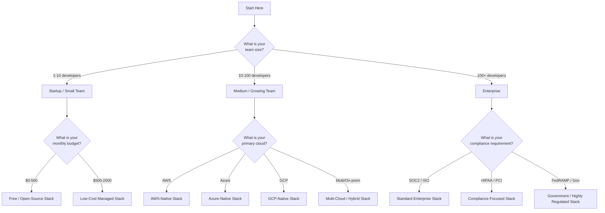

---

## Stack Recommendation #1: Free / Open-Source (Budget: $0-500/month)

**Target audience:** Startups, side projects, bootstrapped companies, proof-of-concept APIs.

**Philosophy:** Use the best open-source tools. Accept higher operational overhead in exchange for zero licensing costs.

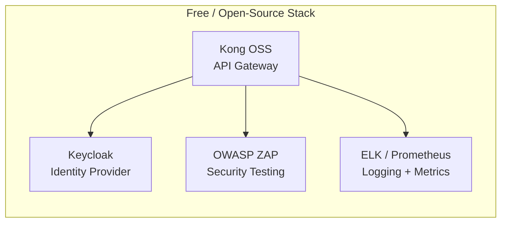

**The Stack:**

| Layer | Tool | Why This Choice | Cost |
|-------|------|-----------------|------|
| **Gateway** | Kong OSS | Plugin ecosystem, K8s native, community support | $0 |
| **Identity** | Keycloak | Full-featured, no per-user licensing | $0 (self-hosted) |
| **Threat Detection** | None (use gateway logs + manual review) | Budget constraint | $0 |
| **Testing** | OWASP ZAP | Free DAST, CI/CD integration | $0 |
| **Hosting** | Self-hosted (K8s, Docker, or VM) | You manage infrastructure | Variable ($50-500/month) |

**Deployment architecture:**

```yaml
# docker-compose.yml for free stack
version: '3.8'

services:
  # PostgreSQL for Kong
  kong-db:
    image: postgres:15
    environment:
      POSTGRES_DB: kong
      POSTGRES_USER: kong
      POSTGRES_PASSWORD: ${KONG_DB_PASSWORD}
    volumes:
      - kong-db-data:/var/lib/postgresql/data

  # Kong API Gateway
  kong:
    image: kong:3.4
    environment:
      KONG_DATABASE: postgres
      KONG_PG_HOST: kong-db
      KONG_PG_USER: kong
      KONG_PG_PASSWORD: ${KONG_DB_PASSWORD}
      KONG_PROXY_ACCESS_LOG: /dev/stdout
      KONG_ADMIN_ACCESS_LOG: /dev/stdout
      KONG_PROXY_ERROR_LOG: /dev/stderr
      KONG_ADMIN_ERROR_LOG: /dev/stderr
      KONG_ADMIN_LISTEN: 0.0.0.0:8001
    ports:
      - "8000:8000"  # Proxy
      - "8001:8001"  # Admin API
    depends_on:
      - kong-db

  # PostgreSQL for Keycloak
  keycloak-db:
    image: postgres:15
    environment:
      POSTGRES_DB: keycloak
      POSTGRES_USER: keycloak
      POSTGRES_PASSWORD: ${KEYCLOAK_DB_PASSWORD}
    volumes:
      - keycloak-db-data:/var/lib/postgresql/data

  # Keycloak Identity Provider
  keycloak:
    image: quay.io/keycloak/keycloak:22.0
    command: start --optimized
    environment:
      KC_DB: postgres
      KC_DB_URL: jdbc:postgresql://keycloak-db/keycloak
      KC_DB_USERNAME: keycloak
      KC_DB_PASSWORD: ${KEYCLOAK_DB_PASSWORD}
      KC_HOSTNAME: auth.yourdomain.com
      KEYCLOAK_ADMIN: admin
      KEYCLOAK_ADMIN_PASSWORD: ${KEYCLOAK_ADMIN_PASSWORD}
    ports:
      - "8080:8080"
    depends_on:
      - keycloak-db

volumes:
  kong-db-data:
  keycloak-db-data:
```

**CI/CD pipeline (GitHub Actions):**

```yaml
name: Security Testing

on:
  pull_request:
    branches: [main]

jobs:
  zap-scan:
    runs-on: ubuntu-latest
    steps:
      - uses: actions/checkout@v4
      - name: Run ZAP API Scan
        uses: zaproxy/action-api-scan@v0.6.0
        with:
          target: 'https://staging-api.yourdomain.com/openapi.json'
      - name: Upload Report
        if: always()
        uses: actions/upload-artifact@v3
        with:
          name: zap-report
          path: report.html
```

**Pros and cons of free stack:**

| Pros | Cons |
|------|------|
| ✅ No licensing costs | ❌ You manage everything (updates, backups, scaling) |
| ✅ Full control over configuration | ❌ No commercial support (community only) |
| ✅ No vendor lock-in | ❌ No advanced threat detection (Salt/Apigee) |
| ✅ Learn fundamentals deeply | ❌ Time-consuming to set up and maintain |
| ✅ Scales with your team | ❌ No built-in analytics dashboard |

**When to choose this stack:**
- You have a small team with strong DevOps skills
- You cannot afford paid tools yet
- You want to learn API security fundamentals deeply
- Your API is not business-critical (yet)
- You have time to manage infrastructure

**When to upgrade from this stack:**
- You spend more than 20 hours/month managing infrastructure
- Your API becomes business-critical
- You need compliance certifications (SOC2, HIPAA)
- You experience a security incident
- Your team grows beyond 10 developers

---

## Stack Recommendation #2: Low-Cost Managed (Budget: $500-2000/month)

**Target audience:** Startups with funding, small businesses, teams that want to reduce operational overhead.

**Philosophy:** Use managed services where possible. Pay a premium to avoid managing infrastructure. Accept higher cloud costs in exchange for lower headcount.

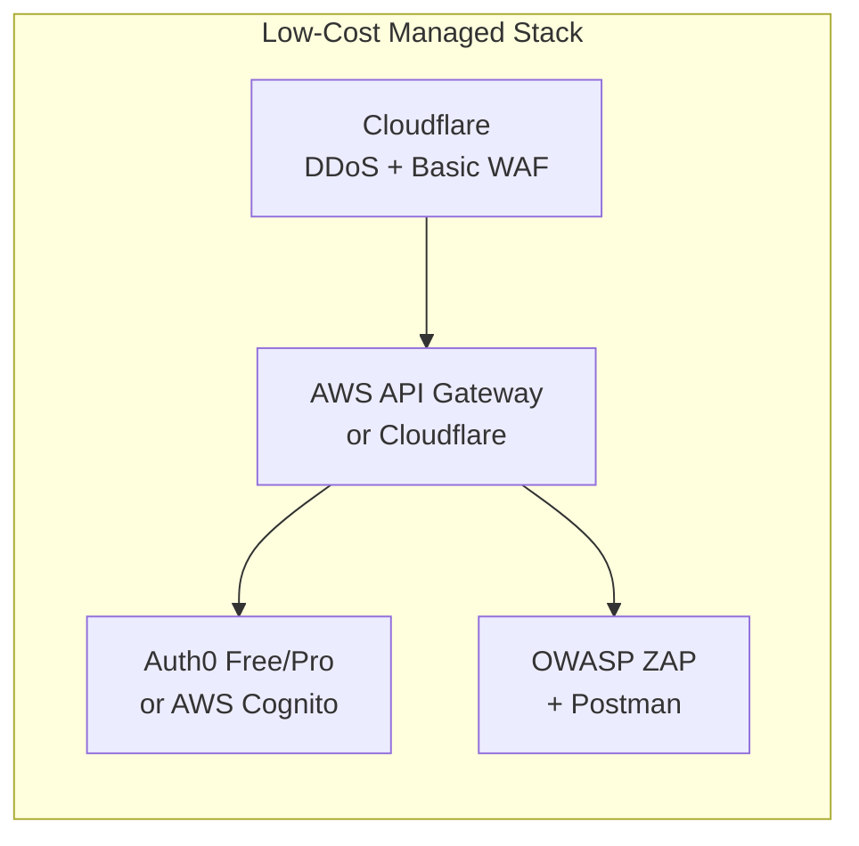

**The Stack:**

| Layer | Tool | Why This Choice | Cost |
|-------|------|-----------------|------|
| **Edge/Gateway** | Cloudflare Pro + AWS API Gateway | Cloudflare for DDoS + edge, AWS Gateway for API management | $20-200/month + $3.50/million requests |
| **Identity** | Auth0 Free/Pro or AWS Cognito | Managed identity, no self-hosting | $0-200/month |
| **Threat Detection** | Cloudflare (included) + gateway logs | Basic protection included | Included |
| **Testing** | OWASP ZAP (free) + Postman (free tier) | Free tools, minimal cost | $0 |

**Auth0 free tier (up to 7,500 active users):**

| Feature | Free | Pro ($23/active user/month) |
|---------|------|----------------------------|
| Active users | 7,500 | Unlimited |
| Social logins | 3 | 50+ |
| MFA | Email/SMS | TOTP, WebAuthn, SMS |
| Rules/Actions | 3 | Unlimited |
| Support | Community | Email |

**AWS Cognito (pay-as-you-go):**

```yaml
# Cognito pricing example
monthly_active_users: 10000
cost_per_MAU: $0.0055
monthly_cost: $55

# Additional features:
# - MFA: $0.001 per authentication
# - Advanced security: $0.0185 per MAU
```

**Cloudflare Pro ($20/month) includes:**
- DDoS protection
- Basic WAF rules
- Rate limiting (10 rules)
- API Shield (basic)
- Analytics

**Pros and cons of low-cost managed stack:**

| Pros | Cons |
|------|------|
| ✅ No infrastructure management | ❌ Higher per-request costs than self-hosted |
| ✅ Scales automatically | ❌ Vendor lock-in (AWS + Cloudflare) |
| ✅ Built-in analytics and logging | ❌ Limited advanced threat detection |
| ✅ Quick to set up (hours, not weeks) | ❌ Auth0 free tier has user limits |
| ✅ Compliance ready (SOC2, GDPR) | ❌ No ML-based behavioral detection |

**When to choose this stack:**
- You have funding but not a large operations team
- You expect to grow quickly
- You want to focus on product, not infrastructure
- Your user base is under 10,000 active users

**When to upgrade from this stack:**
- You exceed Auth0 free tier (7,500 users)
- You need advanced threat detection (Salt Security)
- You need professional penetration testing (Burp Suite)
- You have compliance requirements for API security (PCI, HIPAA)

---

## Stack Recommendation #3: AWS-Native (Cloud-Specific)

**Target audience:** Companies fully committed to AWS, using Lambda, ECS, or EKS.

**Philosophy:** Use AWS services for everything. Benefit from deep integration, IAM unification, and single billing. Accept vendor lock-in for operational simplicity.

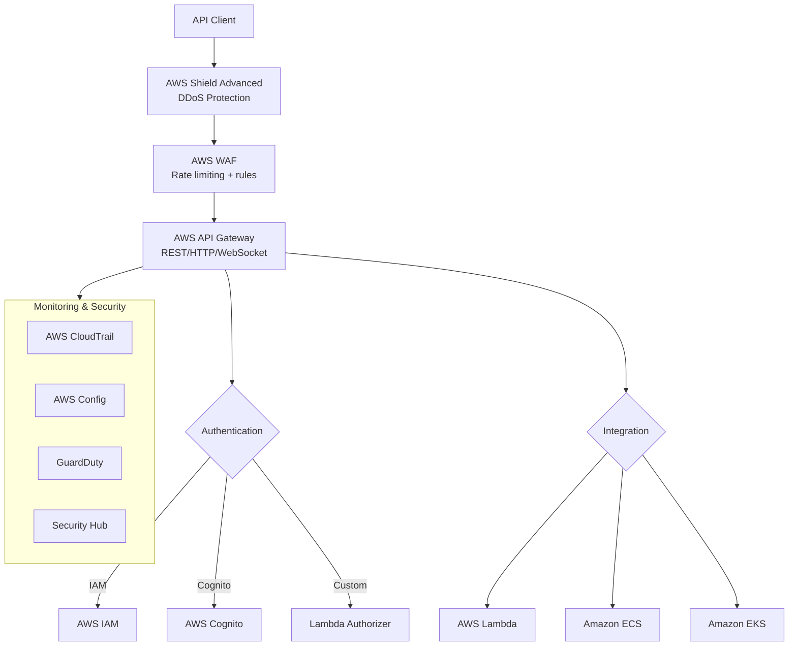

**The Stack:**

| Layer | Tool | Why This Choice | Cost |
|-------|------|-----------------|------|
| **DDoS Protection** | AWS Shield Advanced | AWS-native DDoS, cost protection | $3,000/month |
| **WAF** | AWS WAF | Managed rules, rate limiting | ~$25/month + $0.60/million requests |
| **Gateway** | AWS API Gateway | Deep AWS integration, serverless | $3.50/million requests |
| **Identity** | AWS Cognito + IAM | Native integration, no extra services | $0.0055 per MAU |
| **Threat Detection** | GuardDuty + Security Hub | Continuous monitoring, threat intelligence | ~$100/month |
| **Testing** | OWASP ZAP (CI/CD) + Burp (quarterly) | Automated + manual | $449/year (Burp Pro) |
| **Auditing** | CloudTrail + Config | API call logging, compliance | ~$100/month |

**AWS API Gateway + Cognito configuration (CDK):**

```typescript
// cdk-stack.ts - AWS CDK for API Gateway + Cognito
import * as cdk from 'aws-cdk-lib';
import * as apigateway from 'aws-cdk-lib/aws-apigateway';
import * as cognito from 'aws-cdk-lib/aws-cognito';
import * as wafv2 from 'aws-cdk-lib/aws-wafv2';

export class ApiSecurityStack extends cdk.Stack {
  constructor(scope: cdk.App, id: string, props?: cdk.StackProps) {
    super(scope, id, props);

    // 1. Cognito User Pool
    const userPool = new cognito.UserPool(this, 'ApiUserPool', {
      selfSignUpEnabled: true,
      signInAliases: { email: true },
      standardAttributes: { email: { required: true } },
      mfa: cognito.Mfa.OPTIONAL,
      mfaSecondFactor: { sms: true, otp: true },
      passwordPolicy: {
        minLength: 12,
        requireDigits: true,
        requireSymbols: true,
        requireUppercase: true,
      },
    });

    // 2. Cognito App Client
    const appClient = new cognito.UserPoolClient(this, 'ApiAppClient', {
      userPool,
      authFlows: { userPassword: true, userSrp: true },
      oAuth: {
        flows: { authorizationCodeGrant: true },
        scopes: [cognito.OAuthScope.OPENID, cognito.OAuthScope.EMAIL],
        callbackUrls: ['https://api.example.com/callback'],
      },
    });

    // 3. API Gateway with Cognito Authorizer
    const api = new apigateway.RestApi(this, 'SecureApi', {
      restApiName: 'Secure API',
      description: 'API Gateway with Cognito authentication',
      endpointTypes: [apigateway.EndpointType.EDGE],
      defaultCorsPreflightOptions: {
        allowOrigins: apigateway.Cors.ALL_ORIGINS,
        allowMethods: apigateway.Cors.ALL_METHODS,
        allowHeaders: ['Authorization', 'Content-Type'],
      },
    });

    const authorizer = new apigateway.CognitoUserPoolsAuthorizer(this, 'ApiAuthorizer', {
      cognitoUserPools: [userPool],
    });

    // 4. API Resources with Rate Limiting
    const users = api.root.addResource('users');
    users.addMethod('GET', new apigateway.LambdaIntegration(/* handler */), {
      authorizer,
      authorizationType: apigateway.AuthorizationType.COGNITO,
      throttlingRateLimit: 100,
      throttlingBurstLimit: 200,
    });

    // 5. Usage Plan for API Keys (machine-to-machine)
    const apiKey = api.addApiKey('ServiceApiKey');
    const usagePlan = api.addUsagePlan('ServiceUsagePlan', {
      name: 'Service Usage Plan',
      throttle: { rateLimit: 50, burstLimit: 100 },
      quota: { limit: 100000, period: apigateway.Period.MONTH },
    });
    usagePlan.addApiKey(apiKey);
    usagePlan.addApiStage({ stage: api.deploymentStage });

    // 6. WAF Association (via custom resource - simplified)
    new cdk.CfnOutput(this, 'ApiUrl', { value: api.url });
    new cdk.CfnOutput(this, 'UserPoolId', { value: userPool.userPoolId });
    new cdk.CfnOutput(this, 'AppClientId', { value: appClient.userPoolClientId });
  }
}
```

**AWS WAF rate limiting rules:**

```json
{
  "Name": "rate-limit-rules",
  "Rules": [
    {
      "Name": "GlobalRateLimit",
      "Priority": 0,
      "Action": { "Block": {} },
      "VisibilityConfig": {
        "SampledRequestsEnabled": true,
        "CloudWatchMetricsEnabled": true,
        "MetricName": "GlobalRateLimit"
      },
      "Statement": {
        "RateBasedStatement": {
          "Limit": 1000,
          "AggregateKeyType": "IP",
          "ScopeDownStatement": {
            "ByteMatchStatement": {
              "SearchString": "/api/",
              "FieldToMatch": { "UriPath": {} },
              "PositionalConstraint": "CONTAINS",
              "TextTransformations": []
            }
          }
        }
      }
    },
    {
      "Name": "AuthEndpointRateLimit",
      "Priority": 1,
      "Action": { "Block": {} },
      "Statement": {
        "RateBasedStatement": {
          "Limit": 10,
          "AggregateKeyType": "IP",
          "ScopeDownStatement": {
            "ByteMatchStatement": {
              "SearchString": "/auth/login",
              "FieldToMatch": { "UriPath": {} },
              "PositionalConstraint": "EXACTLY"
            }
          }
        }
      }
    }
  ]
}
```

**Pros and cons of AWS-native stack:**

| Pros | Cons |
|------|------|
| ✅ Deep integration across AWS services | ❌ Heavy vendor lock-in to AWS |
| ✅ Unified IAM for authentication | ❌ Shield Advanced is expensive ($3k/month) |
| ✅ No cross-cloud data transfer costs | ❌ Limited to AWS regions |
| ✅ Single support contract | ❌ API Gateway has feature limits vs Kong |
| ✅ SOC2/HIPAA/PCI compliance ready | ❌ Less flexible than open-source |

**When to choose this stack:**
- You are an AWS-only shop
- You have significant AWS spend (committed to the platform)
- You need compliance certifications (AWS handles the heavy lifting)
- You want to minimize operational overhead
- Your team is already AWS-certified

---

## Stack Recommendation #4: Azure-Native

**Target audience:** Companies fully committed to Microsoft Azure, using App Services, Functions, or AKS.

**Philosophy:** Use Azure services for everything. Benefit from Azure AD integration, Microsoft ecosystem, and hybrid cloud capabilities.

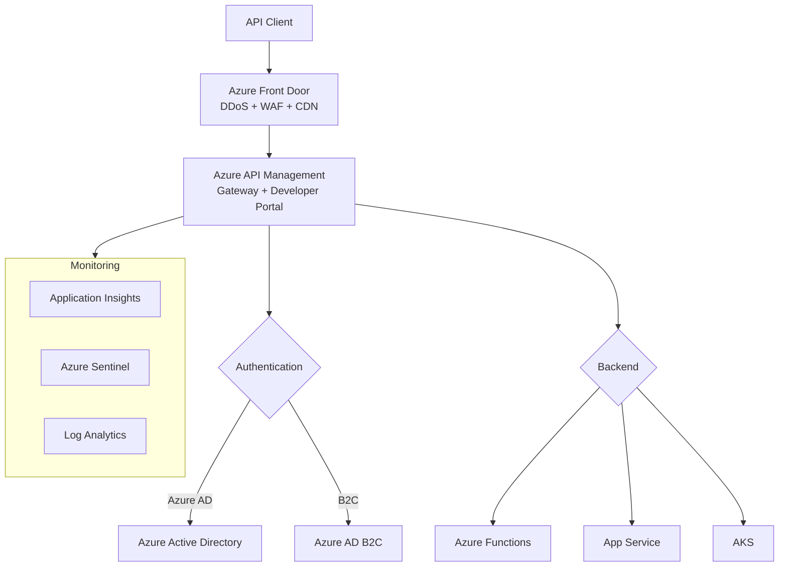

**The Stack:**

| Layer | Tool | Why This Choice | Cost |
|-------|------|-----------------|------|
| **DDoS + Edge** | Azure Front Door | Global DDoS, WAF, CDN, SSL termination | ~$35/month + traffic |
| **Gateway** | Azure API Management | Full lifecycle, developer portal, policies | $0.04/hour (basic) |
| **Identity** | Azure AD + AD B2C | Native integration, enterprise SSO | $0-6/user/month |
| **Threat Detection** | Azure Sentinel + Application Insights | SIEM + APM, ML-based detection | ~$100/month |
| **Testing** | OWASP ZAP + Burp Suite | Same as other stacks | $449/year (Burp) |

**Azure API Management policy for JWT validation:**

```xml
<!-- JWT validation with Azure AD -->
<policies>
    <inbound>
        <!-- Rate limiting -->
        <rate-limit calls="100" renewal-period="60" />
        
        <!-- JWT validation against Azure AD -->
        <validate-jwt 
            header-name="Authorization" 
            failed-validation-httpcode="401" 
            failed-validation-error-message="Unauthorized. Token is invalid or expired.">
            <openid-config 
                url="https://login.microsoftonline.com/{tenant-id}/v2.0/.well-known/openid-configuration" />
            <audiences>
                <audience>api://{api-client-id}</audience>
            </audiences>
            <issuers>
                <issuer>https://login.microsoftonline.com/{tenant-id}/v2.0</issuer>
            </issuers>
            <required-claims>
                <claim name="roles" match="any">
                    <value>api_user</value>
                    <value>admin</value>
                </claim>
            </required-claims>
        </validate-jwt>
        
        <!-- IP filtering -->
        <ip-filter action="allow">
            <address-range from="10.0.0.0" to="10.255.255.255" />
        </ip-filter>
        
        <base />
    </inbound>
</policies>
```

**When to choose Azure-native stack:**
- You are an Azure-only shop
- You use Azure Active Directory for workforce identity
- You need hybrid cloud (on-prem + Azure)
- Your customers are enterprise (Microsoft shops)
- You need the developer portal for API consumers

---

## Stack Recommendation #5: Multi-Cloud / Hybrid

**Target audience:** Companies running on multiple clouds, on-premise, or migrating between clouds.

**Philosophy:** Use cloud-agnostic open-source tools. Accept higher operational overhead for flexibility and portability.

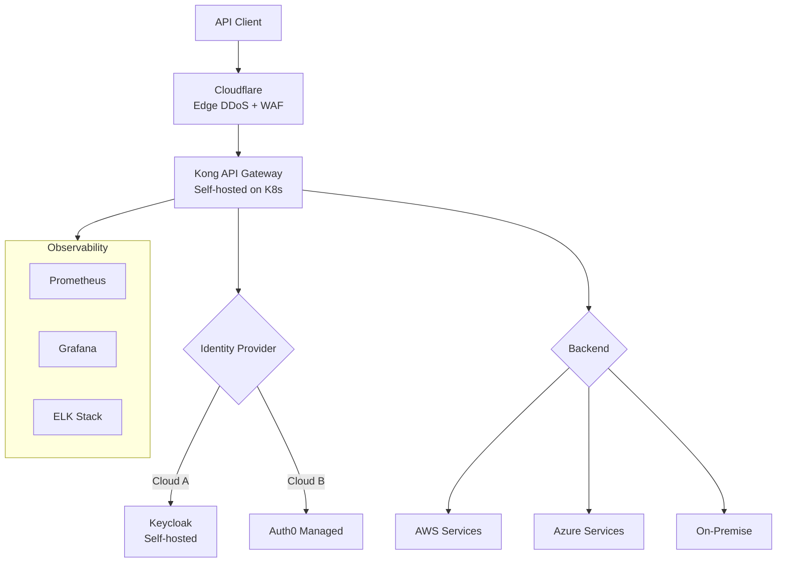

**The Stack:**

| Layer | Tool | Why This Choice | Cost |
|-------|------|-----------------|------|
| **Edge** | Cloudflare | Cloud-agnostic, global DDoS | $20-200/month |
| **Gateway** | Kong (self-hosted on K8s) | Cloud-agnostic, plugin ecosystem | Infrastructure + support |
| **Identity** | Keycloak + Auth0 (hybrid) | Flexibility + optional managed | $0 + optional Auth0 |
| **Threat Detection** | Salt Security (optional) | Cloud-agnostic API security | Annual subscription |
| **Testing** | OWASP ZAP + Burp | Cloud-agnostic | $449/year (Burp) |
| **Observability** | Prometheus + Grafana + ELK | Cloud-agnostic, open-source | Infrastructure |

**Kong on Kubernetes (multi-cloud):**

```yaml
# kong-values.yaml - Helm values for multi-cloud deployment
deployment:
  kind: deployment
  replicas: 3

image:
  repository: kong/kong-gateway
  tag: "3.4"

env:
  database: postgres
  pg_host: kong-db-primary.cluster-xyz.rds.amazonaws.com
  pg_user: kong
  pg_password: ${KONG_PG_PASSWORD}
  pg_database: kong

proxy:
  type: LoadBalancer
  annotations:
    # AWS annotation
    service.beta.kubernetes.io/aws-load-balancer-type: "nlb"
    # Azure annotation (if applicable)
    service.beta.kubernetes.io/azure-load-balancer-internal: "false"
  http:
    enabled: true
    servicePort: 80
    containerPort: 8000
  tls:
    enabled: true
    servicePort: 443
    containerPort: 8443

plugins:
  - name: jwt
  - name: rate-limiting
  - name: ip-restriction
  - name: prometheus

ingressController:
  enabled: true
  installCRDs: true
  ingressClass: kong

resources:
  limits:
    cpu: 1000m
    memory: 1Gi
  requests:
    cpu: 250m
    memory: 256Mi

autoscaling:
  enabled: true
  minReplicas: 3
  maxReplicas: 10
  targetCPUUtilizationPercentage: 70
```

**When to choose multi-cloud/hybrid stack:**
- You run on multiple cloud providers
- You have on-premise infrastructure
- You are migrating between clouds
- You want to avoid vendor lock-in
- You have a strong platform team

---

## Stack Recommendation #6: Enterprise Standard (SOC2 / ISO)

**Target audience:** Mid-to-large enterprises, SaaS companies, B2B APIs.

**Philosophy:** Balance managed services with enterprise features. Invest in threat detection and compliance automation.

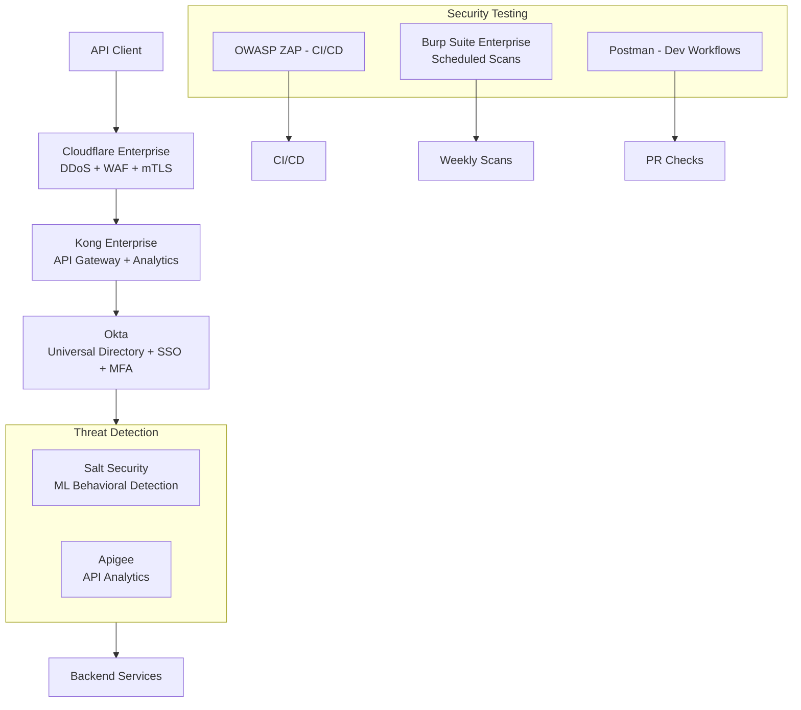

**The Stack:**

| Layer | Tool | Why This Choice | Estimated Cost |
|-------|------|-----------------|----------------|
| **Edge** | Cloudflare Enterprise | Global DDoS, mTLS, advanced WAF | Custom ($3k-10k/month) |
| **Gateway** | Kong Enterprise | Enterprise support, plugins, analytics | Custom ($20k-50k/year) |
| **Identity** | Okta | Enterprise SSO, AD integration, compliance | $2-15/user/month |
| **Threat Detection** | Salt Security + Apigee | ML detection + analytics | $30k-100k/year each |
| **Testing** | Burp Suite Enterprise + ZAP + Postman | Automated + manual + dev integration | $5k-20k/year |
| **SIEM** | Splunk / Datadog / Sumo Logic | Centralized logging, alerting | $50k-200k/year |

**Compliance mapping (SOC2):**

| SOC2 Trust Service Criteria | Tool Support |
|-----------------------------|--------------|
| **Security** (CC6, CC7, CC8) | Cloudflare, Kong, Okta, Salt, Burp |
| **Availability** (A1) | Cloudflare, Kong (multi-region) |
| **Processing Integrity** (PI1) | Apigee, Kong analytics |
| **Confidentiality** (C1) | mTLS (Cloudflare), encryption at rest |
| **Privacy** (P1) | Okta (PII management), Salt (data exposure detection) |

**When to choose enterprise standard stack:**
- You need SOC2, ISO 27001, or similar certification
- You have enterprise customers who require security questionnaires
- You have a dedicated security team
- Your API processes sensitive data
- You have >100 developers

---

## Stack Recommendation #7: Compliance-Focused (HIPAA / PCI)

**Target audience:** Healthcare, fintech, payment processors, insurance.

**Philosophy:** Prioritize compliance requirements over cost. Use tools with compliance certifications. Implement logging and auditing everywhere.

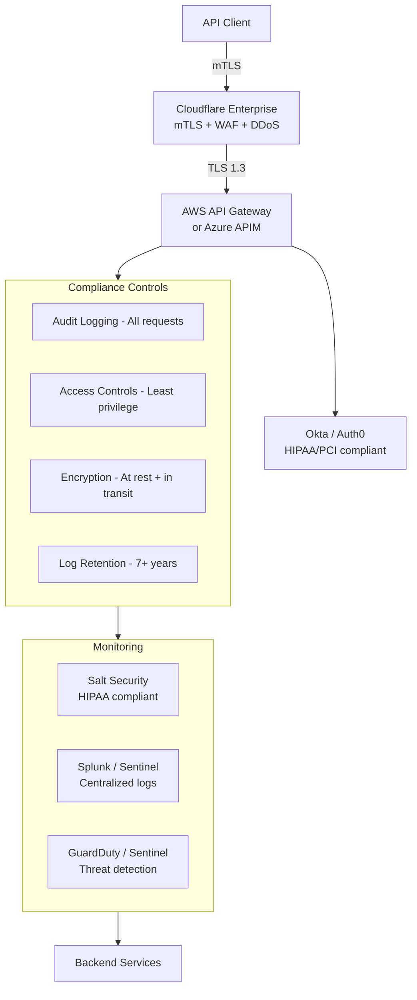

**The Stack:**

| Layer | Tool | Compliance Notes | Cost |
|-------|------|------------------|------|
| **Edge** | Cloudflare Enterprise | HIPAA eligible, PCI DSS Level 1 | Custom |
| **Gateway** | AWS API Gateway or Azure APIM | HIPAA eligible, PCI compliant | Pay per request + enterprise |
| **Identity** | Okta or Auth0 | HIPAA, PCI, SOC2 certified | Enterprise pricing |
| **Threat Detection** | Salt Security | HIPAA compliant | $50k-150k/year |
| **Testing** | Burp Suite Enterprise + ZAP | Annual pentest required | $10k-30k/year |
| **SIEM** | Splunk or Azure Sentinel | Audit logging, retention | $50k-200k/year |
| **Audit** | AWS CloudTrail or Azure Monitor | API call logging | $100-500/month |

**HIPAA compliance checklist for API security:**

```yaml
hipaa_api_compliance:
  access_control:
    - "Unique user identification (Okta/Auth0)"
    - "Emergency access procedure (break-glass account)"
    - "Automatic logoff (session timeout < 15 minutes)"
    - "MFA for all users"
    
  audit_controls:
    - "Log all API requests and responses"
    - "Log authentication attempts (success and failure)"
    - "Log access to PHI (Protected Health Information)"
    - "7-year log retention"
    - "Immutable logs (WORM storage)"
    
  integrity:
    - "mTLS for all API calls"
    - "TLS 1.3 minimum"
    - "Signed JWTs with short expiration (5 minutes)"
    
  transmission_security:
    - "Encryption in transit (TLS 1.3 only)"
    - "No HTTP endpoints"
    - "HSTS preload"
    
  business_associate_agreements:
    - "BAA with AWS/Azure"
    - "BAA with Cloudflare"
    - "BAA with Okta/Auth0"
    - "BAA with Salt Security"
```

**When to choose compliance-focused stack:**
- You handle PHI (HIPAA) or payment data (PCI)
- You have a dedicated compliance officer
- You undergo annual audits
- You have >10,000 customer records
- You have enterprise legal counsel

---

## Stack Recommendation #8: Government / FedRAMP

**Target audience:** Government contractors, federal agencies, defense industry.

**Philosophy:** Use FedRAMP-authorized tools. Accept significant cost and operational overhead. Prioritize data sovereignty and supply chain security.

**The Stack (FedRAMP High examples):**

| Layer | FedRAMP Authorized Tools |
|-------|--------------------------|
| **Gateway** | AWS GovCloud API Gateway, Azure Government API Management |
| **Identity** | Okta FedRAMP, Auth0 FedRAMP, Azure AD Government |
| **Edge** | Cloudflare FedRAMP Authorized |
| **Threat Detection** | Salt Security (FedRAMP in progress), Splunk FedRAMP |
| **Testing** | Burp Suite Enterprise (on-premise deployment) |
| **Hosting** | AWS GovCloud (US-East/West) or Azure Government |

---

## Cost Summary: From Startup to Enterprise

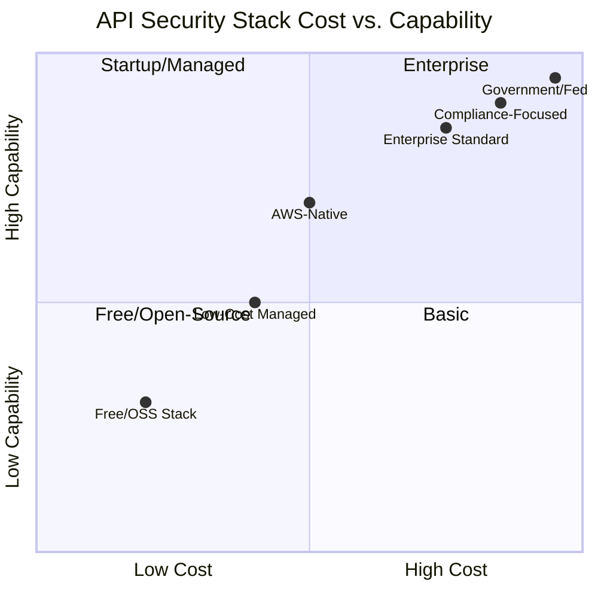

**Monthly cost estimates (excluding infrastructure):**

| Stack | Gateway | Identity | Threat Detection | Testing | Total (approx) |
|-------|---------|----------|------------------|---------|----------------|
| Free/OSS | $0 | $0 | $0 | $0 | **$0-500** |
| Low-Cost Managed | $50-200 | $0-200 | $20 | $0 | **$70-420** |
| AWS-Native | $100-500 | $50-200 | $100 | $40 | **$290-840** |
| Azure-Native | $100-500 | $50-300 | $100 | $40 | **$290-940** |
| Multi-Cloud/Hybrid | $500-2000 | $0-1000 | $200-500 | $40 | **$740-3,540** |
| Enterprise Standard | $2k-5k | $2k-10k | $5k-10k | $1k-2k | **$10k-27k** |
| Compliance-Focused | $5k-10k | $5k-15k | $10k-20k | $2k-5k | **$22k-50k** |
| Government/FedRAMP | $10k-20k | $10k-20k | $20k-30k | $5k-10k | **$45k-80k** |

---

## Phasing Your Security Investment (Roadmap)

You do not need to buy everything at once. Here is a recommended phased approach:

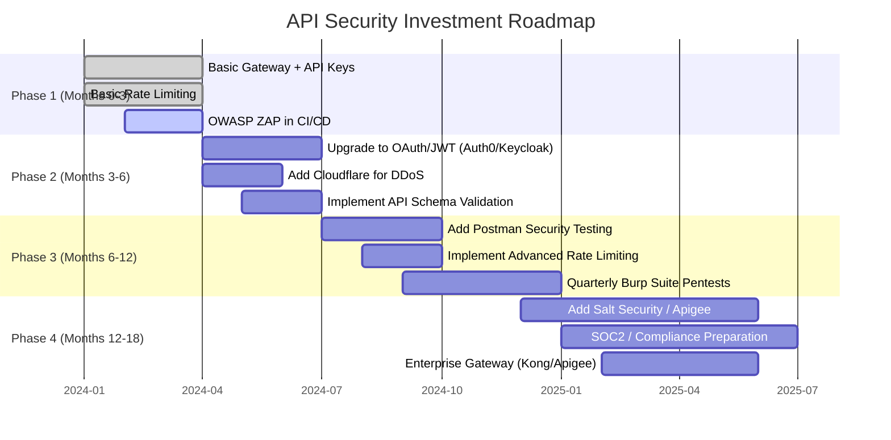

**Phase 1: Foundational (Month 0-3) - Cost: $0-500**
- Deploy basic API gateway (Kong OSS or cloud-native)
- Implement API keys for authentication
- Configure basic rate limiting
- Add OWASP ZAP to CI/CD pipeline

**Phase 2: Authentication & Edge (Month 3-6) - Cost: $500-2000**
- Upgrade to OAuth 2.0 + JWT (Auth0 or Keycloak)
- Add Cloudflare for DDoS protection
- Implement OpenAPI schema validation
- Enable audit logging

**Phase 3: Testing & Hardening (Month 6-12) - Cost: $2000-5000**
- Add Postman security testing to developer workflows
- Implement advanced rate limiting (per user, per endpoint)
- Schedule quarterly Burp Suite penetration tests
- Implement mTLS for internal services

**Phase 4: Advanced Detection (Month 12-18) - Cost: $5000-20000**
- Add Salt Security or Apigee for behavioral detection
- Prepare for SOC2/HIPAA compliance
- Upgrade to enterprise gateway (Kong Enterprise or Apigee)
- Implement SIEM integration (Splunk, Datadog, Sentinel)

---

## Quick Decision Guide

Here is a simple decision tree based on your situation:

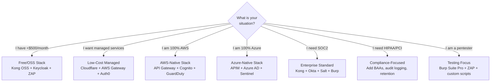

---

## Parting Thoughts

You have now completed the entire five-part series on API security tools. Here is what you have learned:

**Story #1 - Gateways:** Your first line of defense. Stop 80% of attacks with rate limiting, IP filtering, and request validation. Choose open-source for flexibility, managed for simplicity.

**Story #2 - Identity:** Authentication tells you who is calling. Authorization tells you what they can do. Never trust API keys for user-level auth. Use OAuth 2.0 + OIDC with JWTs.

**Story #3 - Threat Detection:** Gateways and auth miss behavioral anomalies. Add ML-based detection for scraping, enumeration, and business logic abuse. Use mTLS for machine-to-machine.

**Story #4 - Security Testing:** Break your own API before attackers do. Automate DAST with ZAP in CI/CD. Manual pentest with Burp Suite quarterly. Integrate security into Postman workflows.

**Story #5 - Choosing Tools:** You cannot use all 15 tools. Start small. Add layers as you grow. Match tools to your budget, team size, and compliance needs.

---

## The Golden Rule of API Security

After reviewing hundreds of API breaches, one pattern emerges repeatedly:

**"The breach did not happen because the attacker was sophisticated. It happened because a basic security control was missing."**

- No rate limiting on a login endpoint → credential stuffing
- No object-level authorization → BOLA attack
- JWT accepted without signature validation → token forgery
- Debug endpoint left exposed → information disclosure
- Deprecated API version still accessible → attack surface

Start with the fundamentals. A well-configured gateway with rate limiting and proper authentication stops the vast majority of attacks. Add advanced tools only after the basics are solid.

---

## What's Next After This Series?

This series covered the 15 essential API security tools. But tools are only half the story. Here is what you can explore next:

- **API Security Architecture:** Design patterns for zero-trust APIs
- **Compliance Automation:** Automating SOC2, HIPAA, PCI evidence collection
- **Threat Modeling:** Identifying API-specific threats before writing code
- **Bug Bounties:** Running private bug bounty programs for your API
- **API Firewalls:** RASP (Runtime Application Self-Protection) for APIs

---

## 📚 Navigation: Stories in This Series

- 🔐 **1. API Security Arsenal: Securing the Perimeter with Gateways & Ingress Controllers** — *Complete*
- 🆔 **2. API Security Arsenal: Mastering Authentication with Okta, Auth0, and Keycloak** — *Complete*
- 🛡️ **3. API Security Arsenal: Real-Time Threat Detection with Apigee, Salt, and Cloudflare** — *Complete*
- 🧪 **4. API Security Arsenal: Breaking APIs Safely with OWASP ZAP, Burp Suite, and Postman** — *Complete*
- 🧠 **5. API Security Arsenal: How to Choose the Right Tools for Your Stack** — *Complete*

---

## Final Call to Action

Take five minutes right now to answer these questions about your API landscape:

1. Do you have an API gateway in front of all your APIs?
2. Do you use OAuth 2.0 + JWT (not API keys) for user authentication?
3. Do you have rate limiting on your authentication endpoints?
4. When was your last API penetration test?
5. Do you know which of your API endpoints are deprecated and still exposed?

If you answered "no" to any of these, you have a clear next step.

**Start there. Not with the most expensive tool. Not with the most complex architecture. Start with the missing fundamental.**

---

*Thank you for reading this five-part series. Clap 👏, comment, and share which stack you chose for your API security journey. If you have questions about specific implementations, drop them in the responses — I will answer them in follow-up stories.*

---

**The end of the API Security Arsenal series.**

*� Questions? Drop a response - I read and reply to every comment.*  
*📌 Save this story to your reading list - it helps other engineers discover it.*  
**🔗 Follow me →**

- **[Medium](mvineetsharma.medium.com)** - mvineetsharma.medium.com
- **[LinkedIn](www.linkedin.com/in/vineet-sharma-architect)** -  [www.linkedin.com/in/vineet-sharma-architect](http://www.linkedin.com/in/vineet-sharma-architect)

*In-depth .NET, Node.js, Python, Cloud Architecture, and System Design. New articles weekly*