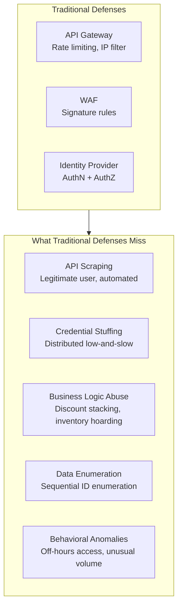
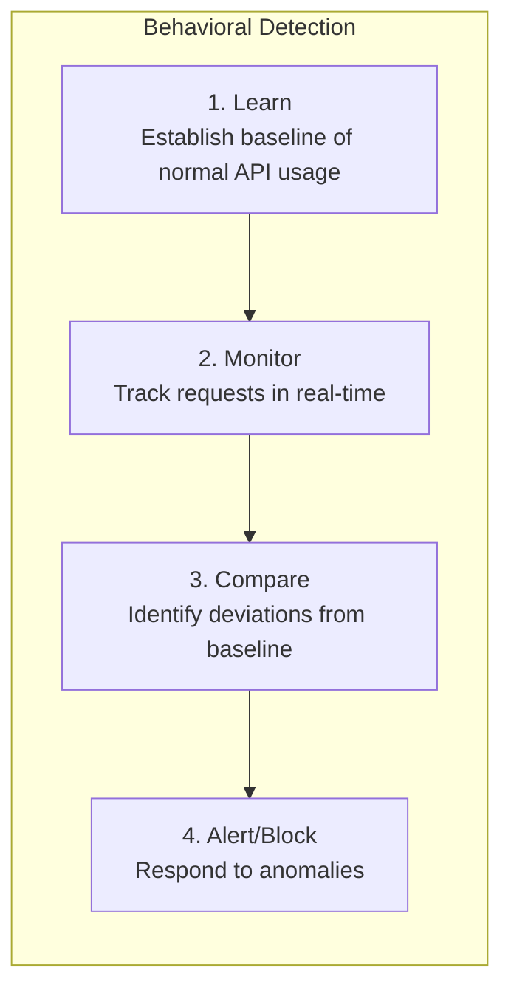
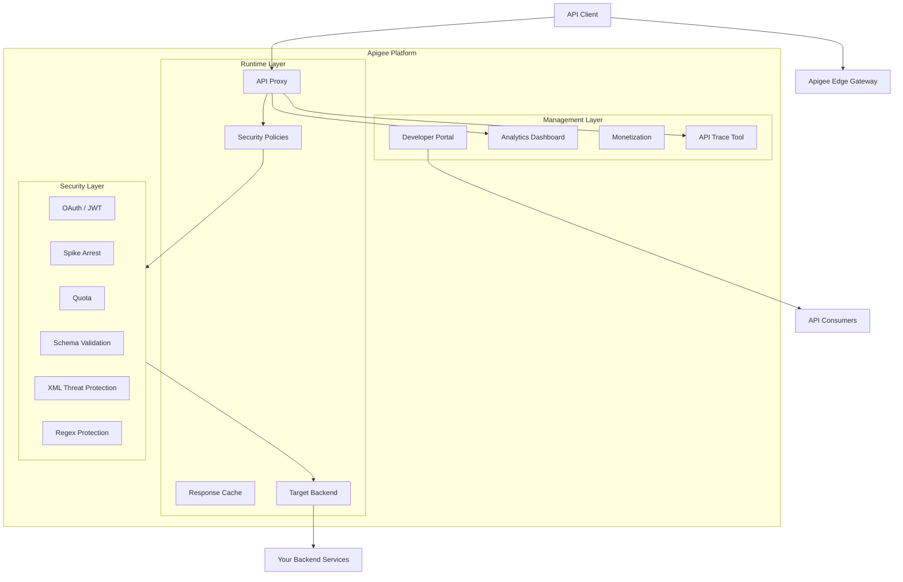
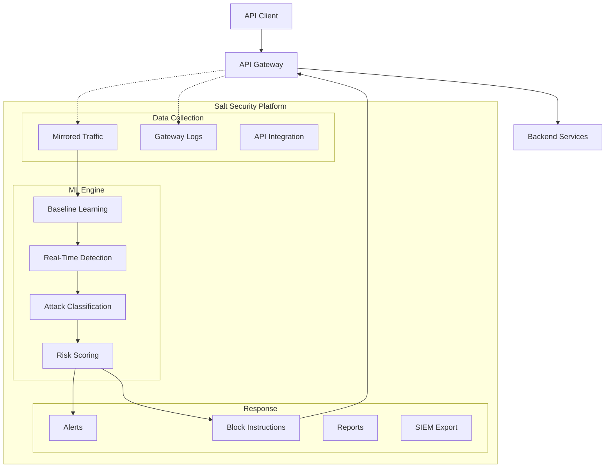
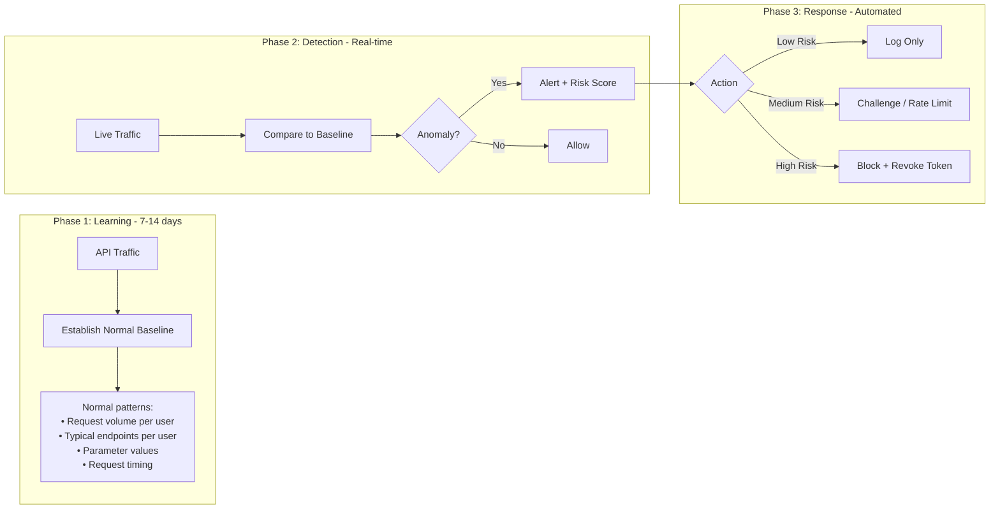
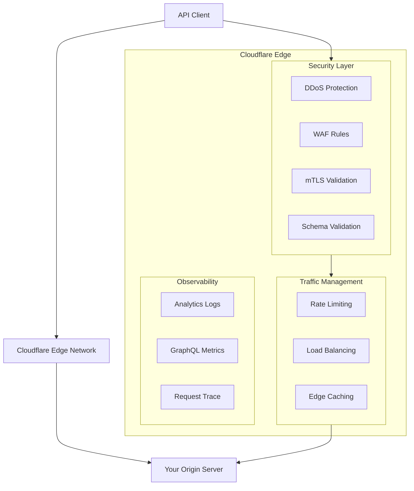
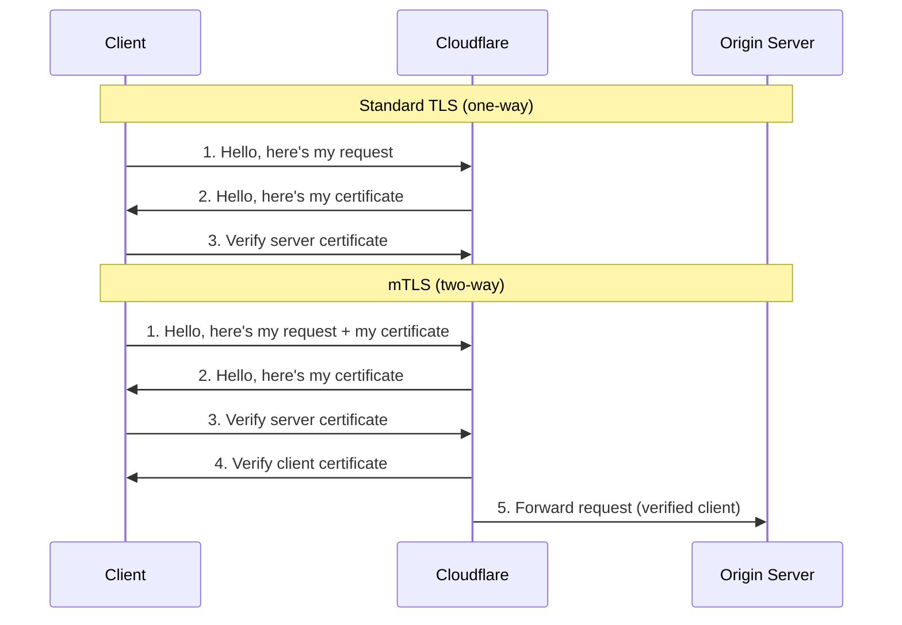
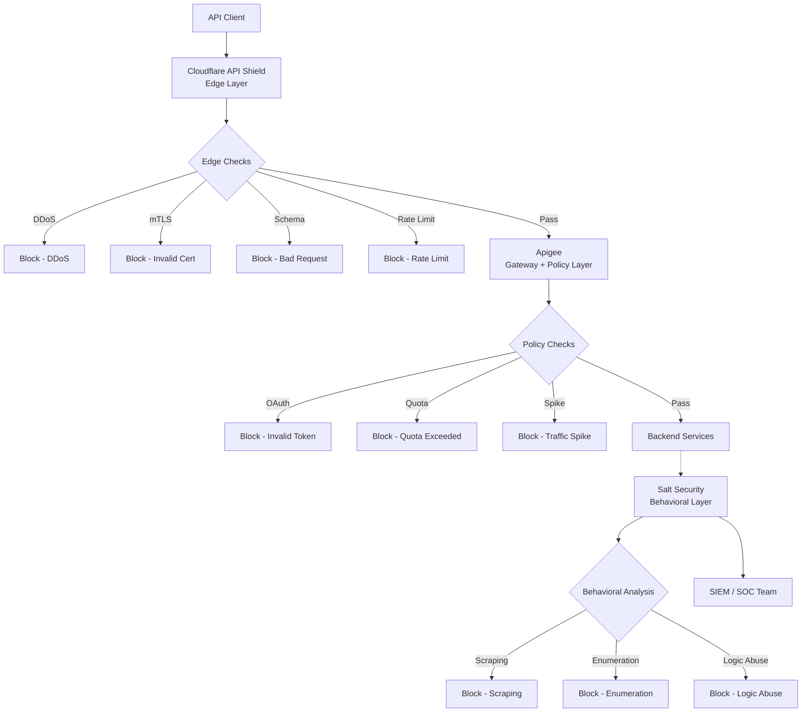
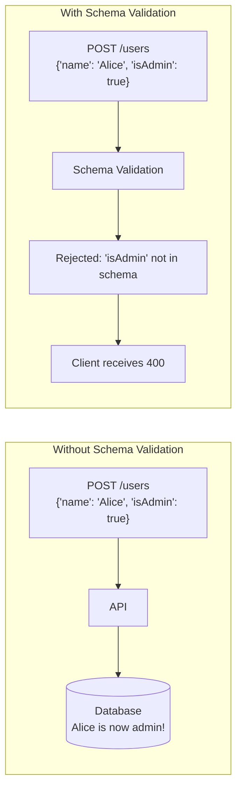
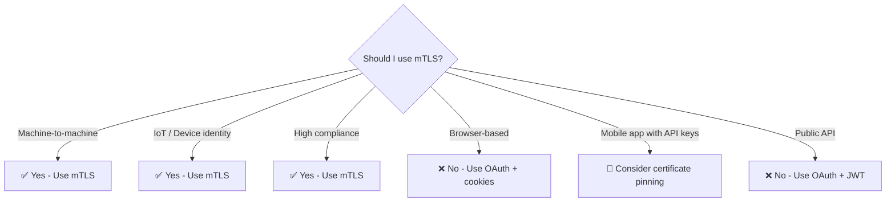

# API Security Arsenal: Real-Time Threat Detection with Apigee, Salt, and Cloudflare

### Advanced API threat detection using Apigee (full lifecycle management, spike arrest, quota enforcement, JSON/XML schema validation), Salt Security (ML behavioral analysis, API discovery, shadow APIs, attack path mapping, posture governance), and Cloudflare API Shield (edge DDoS protection, mTLS authentication, OpenAPI validation, global rate limiting). Learn what traditional WAFs and gateways miss: slow DDoS, distributed credential stuffing, API scraping, business logic abuse, data enumeration, and off-hours exfiltration with mTLS decision frameworks.


You have deployed your API gateway. Rate limiting is configured. Authentication is handled by a proper identity provider. Your JWTs are validated correctly. You should be secure, right?

Not quite.

Traditional security tools — gateways, WAFs, and identity providers — operate on **static rules**. They block requests that match known attack patterns. They authenticate users who present valid tokens. But what happens when an authenticated user behaves maliciously?

Consider these scenarios:

- A legitimate customer uses automated scripts to scrape your entire product catalog — downloading 100,000 pages per day. Their credentials are valid. Their JWT is properly signed. Their rate limits are respected (just under the threshold). Traditional tools see nothing wrong.

- An attacker uses 10,000 different IP addresses to test stolen credentials against your login endpoint. Each IP makes only 2 attempts per minute — well below your rate limit. Your gateway sees 10,000 unique, well-behaved clients. Your authentication service sees login failures. But the pattern across all IPs? A credential stuffing attack.

- A user discovers they can apply a "20% off" discount code repeatedly by making concurrent requests before the server updates inventory. This is a business logic flaw — not a signature-based attack. Your WAF has no rule for "discount stacking."

- An internal service account that normally calls 5 APIs per minute suddenly starts calling 500 APIs per second at 3 AM. The credentials are valid. The JWT is perfect. But the behavior is catastrophic.

These are **advanced API threats**. They look like legitimate traffic. They come from authenticated users. They exploit business logic, not vulnerabilities.

This story is the third in a five-part series on API security tools. We will explore three advanced threat detection platforms: Apigee, Salt Security, and Cloudflare API Shield.

By the end of this story, you will understand:
- The difference between signature-based and behavioral detection
- How ML-powered platforms detect API abuse in real-time
- Schema validation and why it stops mass assignment attacks
- mTLS and when to enforce mutual authentication
- How to layer these tools with your existing gateway and IdP

Let us begin.

---

## 📚 Navigation: Stories in This Series

- 🔐 **1. API Security Arsenal: Securing the Perimeter with Gateways & Ingress Controllers** — *Complete*
- 🆔 **2. API Security Arsenal: Mastering Authentication with Okta, Auth0, and Keycloak** — *Complete*
- 🛡️ **3. API Security Arsenal: Real-Time Threat Detection with Apigee, Salt, and Cloudflare** — *You are here*
- 🧪 **4. API Security Arsenal: Breaking APIs Safely with OWASP ZAP, Burp Suite, and Postman** — *Coming soon*
- 🧠 **5. API Security Arsenal: How to Choose the Right Tools for Your Stack** — *Coming soon*

---

## The Problem: What Traditional Security Misses

Before diving into the tools, let us understand the gap in traditional API security.



**The fundamental problem:** Traditional tools evaluate each request in isolation. They do not understand the context of the user, the sequence of requests, or the business impact of an action.

| Attack Type | Traditional Detection | Why It Fails |
|-------------|----------------------|---------------|
| Slow DDoS | ❌ Misses | Each request is below the rate limit |
| Distributed credential stuffing | ❌ Misses | Each IP appears well-behaved |
| API scraping | ❌ Misses | User is authenticated, rate limits respected |
| Business logic abuse | ❌ Misses | No signature matches |
| Data enumeration | ⚠️ Partial | Sequential requests look normal individually |
| Off-hours data exfiltration | ❌ Misses | Credentials are valid |

**The solution:** Behavioral detection that establishes a baseline of normal activity and identifies deviations in real-time.



---

## The Three Tools at a Glance

Before diving into details, here is a quick comparison of the three tools covered in this story:

| Tool | Type | Best For | Key Strength | Deployment |
|------|------|----------|--------------|------------|
| **Apigee** | Enterprise API platform | Google Cloud users, full lifecycle API management | Policy-driven security, analytics, monetization | Cloud (GCP) or hybrid |
| **Salt Security** | API security platform | Real-time threat detection, behavioral analysis | ML-based anomaly detection, API posture governance | Cloud or on-prem (SaaS) |
| **Cloudflare API Shield** | Edge security | DDoS protection, mTLS, schema validation | Global edge, no latency penalty, DDoS mitigation | Edge (Cloudflare network) |

---

## Deep Dive: Each Threat Detection Tool

### Apigee: The Enterprise API Platform

Apigee is Google Cloud's full lifecycle API management platform. While it includes gateway features, its real strength is in **policy-driven security, analytics, and threat detection** at the enterprise scale. Think of Apigee as Kong-plus-monitoring-plus-analytics-plus-enterprise-governance.

**Key security features:**
- API proxy with OAuth, JWT, API key, and basic auth
- Spike arrest (rate limiting with burst handling)
- Quota enforcement
- JSON schema validation
- XML threat protection
- Regular expression protection (SQL injection, XSS)
- Access control (IP, referer, HTTP method)
- API classification and risk scoring
- Built-in analytics and anomaly detection
- Developer portal with key management

**Architecture diagram:**



**Apigee policy configuration (XML):**

```xml
<!-- Proxy Endpoint policy bundle -->
<ProxyEndpoint name="default">
    <PreFlow>
        <Request>
            <Step>
                <Name>Verify-API-Key</Name>
            </Step>
            <Step>
                <Name>Spike-Arrest-1</Name>
            </Step>
            <Step>
                <Name>JSON-Schema-Validation</Name>
            </Step>
            <Step>
                <Name>XML-Threat-Protection</Name>
            </Step>
            <Step>
                <Name>Regular-Expression-Protection</Name>
            </Step>
        </Request>
    </PreFlow>
    
    <Flows>
        <Flow name="users-get">
            <Condition>(proxy.pathsuffix MatchesPath "/users") and (request.verb = "GET")</Condition>
            <Request>
                <Step>
                    <Name>OAuth-Validation</Name>
                </Step>
                <Step>
                    <Name>Quota-Limit</Name>
                </Step>
            </Request>
        </Flow>
        
        <Flow name="users-post">
            <Condition>(proxy.pathsuffix MatchesPath "/users") and (request.verb = "POST")</Condition>
            <Request>
                <Step>
                    <Name>OAuth-Validation</Name>
                </Step>
                <Step>
                    <Name>Quota-Admin</Name>
                </Step>
                <Step>
                    <Name>Assign-Message-AddUser</Name>
                </Step>
            </Request>
        </Flow>
    </Flows>
    
    <PostFlow>
        <Response>
            <Step>
                <Name>Response-Cache</Name>
            </Step>
            <Step>
                <Name>Remove-Sensitive-Headers</Name>
            </Step>
        </Response>
    </PostFlow>
</ProxyEndpoint>
```

**JSON Schema validation policy:**

```xml
<!-- JSON-Schema-Validation policy -->
<JSONSchemaValidation name="JSON-Schema-Validation">
    <DisplayName>Validate Request Body Against Schema</DisplayName>
    <Source>request</Source>
    <ResourceURL>jsc://user-schema.json</ResourceURL>
    <ValidationOptions>
        <ResolveReferences>true</ResolveReferences>
        <StrictValidation>true</StrictValidation>
    </ValidationOptions>
</JSONSchemaValidation>
```

**User schema (user-schema.json):**

```json
{
  "$schema": "http://json-schema.org/draft-07/schema#",
  "title": "User",
  "type": "object",
  "properties": {
    "email": {
      "type": "string",
      "format": "email",
      "maxLength": 255
    },
    "name": {
      "type": "string",
      "minLength": 1,
      "maxLength": 100
    },
    "age": {
      "type": "integer",
      "minimum": 13,
      "maximum": 120
    },
    "roles": {
      "type": "array",
      "items": {
        "type": "string",
        "enum": ["user", "moderator", "admin"]
      },
      "maxItems": 3,
      "uniqueItems": true
    }
  },
  "required": ["email", "name"],
  "additionalProperties": false,
  "errorMessage": {
    "properties": {
      "email": "A valid email address is required",
      "age": "Age must be between 13 and 120"
    },
    "additionalProperties": "No additional properties are allowed"
  }
}
```

**Spike Arrest (rate limiting with burst handling):**

```xml
<!-- Spike Arrest - protects against sudden traffic spikes -->
<SpikeArrest name="Spike-Arrest-1">
    <DisplayName>Spike Arrest</DisplayName>
    <Identifier ref="request.header.client-id"/>
    <MessageWeight ref="request.header.weight"/>
    <Rate>30pm</Rate>  <!-- 30 requests per minute -->
    <UseEffectiveCount>true</UseEffectiveCount>
    <IsCountingHeader>false</IsCountingHeader>
</SpikeArrest>

<!-- Quota - hard limits for API key holders -->
<Quota name="Quota-Limit">
    <DisplayName>API Key Quota</DisplayName>
    <Interval>1</Interval>
    <TimeUnit>day</TimeUnit>
    <Allow count="10000"/>
    <Identifier ref="request.header.api-key"/>
    <Distributed>true</Distributed>
    <Synchronous>true</Synchronous>
</Quota>
```

**Apigee analytics and anomaly detection:**

```javascript
// Apigee analytics query for anomaly detection
// Detects sudden changes in API behavior

// Query: Find API keys with >3x normal traffic volume
POST /analytics/query HTTP/1.1
Host: api.enterprise.apigee.com
Content-Type: application/json

{
  "metrics": [
    {"name": "message_count", "function": "sum"}
  ],
  "dimensions": ["apiproduct", "app_id"],
  "timeRange": "last7days",
  "filter": "message_count > 3*avg_message_count",
  "limit": 100
}

// Response: Anomalous API keys
{
  "results": [
    {
      "app_id": "app_12345",
      "apiproduct": "Premium API",
      "message_count": 45000,
      "avg_message_count": 12000,
      "deviation": "3.75x normal"
    }
  ]
}
```

**When to choose Apigee:**
- You are already on Google Cloud Platform
- You need full API lifecycle management (design, build, secure, analyze, monetize)
- You have enterprise governance requirements (multiple teams, API products)
- You want built-in analytics without building your own pipeline
- You need a developer portal for external API consumers

---

### Salt Security: The API Behavioral Detection Specialist

Salt Security is a dedicated API security platform. Unlike Apigee (which does many things), Salt focuses exclusively on **API threat detection and prevention**. It uses machine learning to learn your API's normal behavior and detect anomalies in real-time.

**Key security features:**
- API discovery and inventory (finds shadow APIs)
- Behavioral analysis (learns normal usage patterns)
- Real-time attack detection (OWASP API Top 10)
- API posture governance (identifies misconfigurations)
- Attack path mapping (connects related events)
- Integration with gateways (Kong, AWS, NGINX) for blocking
- SOC/SIEM integration (Splunk, Datadog, Sumo Logic)

**Architecture diagram:**



**How Salt's behavioral detection works:**



**Attack detection examples:**

| Attack Type | How Salt Detects It | Traditional Tools |
|-------------|---------------------|-------------------|
| **API scraping** | User downloads >5x normal content volume | ❌ Misses |
| **Credential stuffing** | Distributed login attempts across many IPs with same user-agent pattern | ❌ Misses |
| **Data enumeration** | Sequential ID traversal pattern (1,2,3,4,5) | ⚠️ May detect if obvious |
| **Business logic abuse** | Unusual sequence of API calls (e.g., discount applied 10x before inventory updates) | ❌ Misses |
| **Off-hours access** | User who normally accesses 9-5 suddenly active at 3 AM | ❌ Misses |
| **Parameter tampering** | Price parameter changed from 99.99 to 0.01 | ✅ WAF may detect |
| **JWT replay** | Same JWT used from different geographic locations simultaneously | ❌ Misses |

**Salt API posture governance (finding misconfigurations):**

```yaml
# Salt's posture governance checks
posture_checks:
  - name: "Authentication Required"
    severity: "CRITICAL"
    description: "API endpoints without authentication"
    
  - name: "Rate Limiting Enabled"
    severity: "HIGH"
    description: "Endpoints missing rate limiting"
    
  - name: "Sensitive Data Exposure"
    severity: "CRITICAL"
    description: "API returns PII without need"
    
  - name: "HTTP Methods"
    severity: "MEDIUM"
    description: "Unnecessary HTTP methods enabled (PUT, DELETE on read-only endpoints)"
    
  - name: "Deprecated API Versions"
    severity: "HIGH"
    description: "Old API versions still accessible"
    
  - name: "CORS Misconfiguration"
    severity: "MEDIUM"
    description: "Overly permissive CORS headers"
```

**Integration with Kong API Gateway:**

```yaml
# Kong plugin for Salt Security integration
plugins:
  - name: salt-security
    config:
      api_key: ${SALT_API_KEY}
      salt_host: https://api.salt.security
      block_on_high_risk: true
      block_on_critical_risk: true
      log_only_on_low_risk: true
      timeout_ms: 100  # Don't add latency
      cache_ttl_seconds: 60
```

**Integration with AWS Gateway via Lambda:**

```javascript
// AWS Lambda authorizer with Salt Security check
const saltClient = require('salt-security-client');

exports.handler = async (event) => {
  const token = event.authorizationToken?.replace('Bearer ', '');
  const userId = extractUserIdFromToken(token);
  const endpoint = event.methodArn;
  const sourceIp = event.requestContext.identity.sourceIp;
  
  // Check Salt for risk score
  const risk = await saltClient.getUserRisk({
    userId: userId,
    endpoint: endpoint,
    sourceIp: sourceIp,
    timestamp: Date.now()
  });
  
  if (risk.level === 'HIGH' || risk.level === 'CRITICAL') {
    return generatePolicy(userId, 'Deny', event.methodArn, {
      reason: `Salt risk score: ${risk.score}`,
      attackType: risk.attack_type
    });
  }
  
  // Apply rate limiting based on risk
  const rateLimit = risk.level === 'MEDIUM' ? '10pm' : '100pm';
  
  return generatePolicy(userId, 'Allow', event.methodArn, {
    userId: userId,
    riskScore: risk.score.toString(),
    rateLimit: rateLimit
  });
};
```

**Salt Security alert example (JSON):**

```json
{
  "alert_id": "salt_alert_12345",
  "severity": "HIGH",
  "attack_type": "API_DATA_ENUMERATION",
  "timestamp": "2024-01-15T03:23:45Z",
  "description": "User sequentially accessed 10,000 user records using ID traversal",
  
  "attacker": {
    "user_id": "user_67890",
    "ip_address": "203.0.113.45",
    "user_agent": "Mozilla/5.0 (Python-requests)",
    "geolocation": "Unknown (datacenter IP)"
  },
  
  "attack_details": {
    "pattern": "sequential_id_traversal",
    "endpoint": "/api/v1/users/{id}",
    "request_count": 10000,
    "time_window_seconds": 120,
    "unique_ids_traversed": 10000,
    "success_rate": 0.95,
    "normal_baseline": "User typically accesses 50-200 records per day"
  },
  
  "affected_data": {
    "sensitivity": "PII",
    "fields_exposed": ["email", "phone", "address", "ssn_last4"],
    "estimated_records": 10000
  },
  
  "mitigation": {
    "action_taken": "API key revoked",
    "recommendation": "Implement pagination with cursors, not sequential IDs",
    "block_rule_created": true
  },
  
  "links": {
    "investigate": "https://dashboard.salt.security/alerts/12345",
    "raw_traffic": "https://dashboard.salt.security/traces/12345"
  }
}
```

**When to choose Salt Security:**
- API security is your primary concern (not just gateway or IdP)
- You want ML-based behavioral detection
- You need to discover shadow APIs (unknown endpoints)
- You have compliance requirements for API security (PCI, HIPAA)
- You want integration with existing gateways (Kong, AWS, NGINX)
- You have a SOC/SIEM team that needs API-specific alerts

---

### Cloudflare API Shield: The Edge Security Specialist

Cloudflare API Shield is part of Cloudflare's edge network. It protects APIs at the edge — before traffic even reaches your infrastructure. This means zero latency penalty for security checks that would otherwise slow down your API.

**Key security features:**
- mTLS (mutual TLS) authentication
- Schema validation (OpenAPI/Swagger)
- Rate limiting (edge-based, global)
- WAF with API-specific rules
- DDoS protection (Cloudflare's specialty)
- API discovery and inventory
- Analytics and logging

**Architecture diagram:**



**mTLS (Mutual TLS) explained:**

Traditional TLS validates the server to the client. mTLS validates **both directions** — the client must also present a certificate.



**mTLS configuration (Cloudflare API Shield):**

```bash
# 1. Generate client certificates (using Cloudflare's PKI)
curl -X POST "https://api.cloudflare.com/client/v4/zones/{zone_id}/client_certificates" \
  -H "Authorization: Bearer {api_token}" \
  -H "Content-Type: application/json" \
  --data '{
    "certificate": "-----BEGIN CERTIFICATE REQUEST-----\n...\n-----END CERTIFICATE REQUEST-----"
  }'

# 2. Create mTLS policy
curl -X POST "https://api.cloudflare.com/client/v4/zones/{zone_id}/access/apps" \
  -H "Authorization: Bearer {api_token}" \
  -H "Content-Type: application/json" \
  --data '{
    "type": "self_hosted",
    "domain": "api.example.com",
    "name": "API Shield",
    "policies": [
      {
        "name": "Enforce mTLS",
        "decision": "allow",
        "include": [
          {
            "mtls": {
              "certificate_id": "{certificate_id}",
              "common_name": "*.api-client.com"
            }
          }
        ]
      }
    ]
  }'

# 3. Enforce mTLS at zone level
curl -X PATCH "https://api.cloudflare.com/client/v4/zones/{zone_id}/settings/tls_client_auth" \
  -H "Authorization: Bearer {api_token}" \
  -H "Content-Type: application/json" \
  --data '{"value": "on"}'
```

**Schema validation (OpenAPI):**

Cloudflare API Shield can validate API requests against your OpenAPI (Swagger) specification at the edge — before they reach your backend.

```yaml
# openapi.yaml - Your API specification
openapi: 3.0.0
info:
  title: Secure API
  version: 1.0.0
servers:
  - url: https://api.example.com

paths:
  /users/{userId}:
    get:
      summary: Get user by ID
      parameters:
        - name: userId
          in: path
          required: true
          schema:
            type: string
            pattern: '^[0-9a-f]{8}-[0-9a-f]{4}-[0-9a-f]{4}-[0-9a-f]{4}-[0-9a-f]{12}$'
          description: UUID format
      responses:
        '200':
          description: Success
        '400':
          description: Invalid user ID format
        '401':
          description: Missing or invalid mTLS certificate
        '429':
          description: Rate limit exceeded

  /users:
    post:
      summary: Create user
      requestBody:
        required: true
        content:
          application/json:
            schema:
              type: object
              required:
                - email
                - name
              properties:
                email:
                  type: string
                  format: email
                  maxLength: 255
                name:
                  type: string
                  minLength: 1
                  maxLength: 100
                age:
                  type: integer
                  minimum: 13
                  maximum: 120
      responses:
        '201':
          description: Created
```

**Upload and enforce schema:**

```bash
# Upload OpenAPI spec to Cloudflare
curl -X PUT "https://api.cloudflare.com/client/v4/zones/{zone_id}/api_gateway/schemas" \
  -H "Authorization: Bearer {api_token}" \
  -H "Content-Type: application/json" \
  --data '{
    "file": "openapi.yaml",
    "host": "api.example.com"
  }'

# Enable schema validation
curl -X POST "https://api.cloudflare.com/client/v4/zones/{zone_id}/api_gateway/validation" \
  -H "Authorization: Bearer {api_token}" \
  -H "Content-Type: application/json" \
  --data '{
    "schema_id": "{schema_id}",
    "enabled": true,
    "action": "block"  # or "log" for monitoring only
  }'
```

**Edge rate limiting (global, not per-region):**

```bash
# Create rate limiting rule
curl -X POST "https://api.cloudflare.com/client/v4/zones/{zone_id}/rate_limits" \
  -H "Authorization: Bearer {api_token}" \
  -H "Content-Type: application/json" \
  --data '{
    "description": "API rate limiting",
    "match": {
      "request": {
        "methods": ["GET", "POST", "PUT", "DELETE"],
        "schemes": ["HTTPS"],
        "url": "api.example.com/*"
      },
      "response": {
        "status": 429
      }
    },
    "threshold": 1000,
    "period": 60,
    "action": {
      "mode": "block",
      "timeout": 600,
      "response": {
        "body": "{\"error\": \"Rate limit exceeded\"}",
        "content_type": "application/json"
      }
    },
    "correlate": {
      "by": "http.request.headers.x-api-key"
    }
  }'
```

**API discovery (finding shadow APIs):**

Cloudflare automatically discovers API endpoints from traffic and alerts you to:

- Undocumented endpoints
- Deprecated API versions still receiving traffic
- Unexpected HTTP methods on endpoints
- Endpoints without authentication

```json
// API discovery results
{
  "discovered_endpoints": [
    {
      "endpoint": "/api/v1/users",
      "method": "GET",
      "documented": true,
      "traffic_volume": 100000,
      "authentication": "required"
    },
    {
      "endpoint": "/api/v2/users",
      "method": "GET",
      "documented": false,
      "traffic_volume": 5000,
      "authentication": "none",  // ⚠️ ALERT: No auth on v2!
      "risk": "HIGH",
      "recommendation": "Deprecate v2 or add authentication"
    },
    {
      "endpoint": "/internal/debug",
      "method": "POST",
      "documented": false,
      "traffic_volume": 2,
      "authentication": "none",
      "source_ips": ["203.0.113.45"],
      "risk": "CRITICAL",
      "recommendation": "Block immediately - debug endpoint exposed"
    }
  ]
}
```

**When to choose Cloudflare API Shield:**
- You already use Cloudflare for DDoS protection and CDN
- You need global edge distribution (lowest latency)
- You want mTLS without managing your own PKI
- You need schema validation at the edge (before origin)
- You want to discover shadow APIs automatically
- You prioritize DDoS protection and global rate limiting

---

## The Threat Detection Stack: How These Tools Work Together

No single tool does everything. Here is how Apigee, Salt, and Cloudflare complement each other:



**Layered defense table:**

| Layer | Tool | What It Catches | What It Misses |
|-------|------|-----------------|----------------|
| **Edge** | Cloudflare | DDoS, mTLS failures, schema violations, global rate limits | Business logic abuse, behavioral anomalies |
| **Gateway** | Apigee | OAuth validation, quota, spike arrest, policy violations | Distributed attacks, scraping |
| **Behavioral** | Salt | Scraping, enumeration, logic abuse, off-hours access | Initial DDoS (too much traffic) |

---

## Schema Validation: Why It Matters More Than You Think

Schema validation is one of the most underrated API security controls. It prevents:

- **Mass assignment attacks** (attackers add unexpected fields like `"isAdmin": true`)
- **Type confusion** (sending a string where an integer is expected)
- **Oversized payloads** (preventing resource exhaustion)
- **Malformed data** that could crash parsers



**Schema validation coverage by tool:**

| Tool | Schema Validation | OpenAPI Support | Custom Rules |
|------|-------------------|-----------------|--------------|
| **Apigee** | ✅ JSON/XML | ✅ (via policy) | ✅ XSD, JSON Schema |
| **Salt Security** | ⚠️ (posture only) | ✅ | ❌ (detection only) |
| **Cloudflare** | ✅ OpenAPI | ✅ (native) | ✅ (WAF rules) |

---

## mTLS: When and Why to Use Mutual TLS

mTLS is overkill for most public APIs, but essential for certain scenarios.

**Use mTLS when:**
- You have machine-to-machine communication (service accounts)
- You need device identity (IoT, mobile apps with certificate pinning)
- You operate in high-compliance industries (finance, healthcare, government)
- You want to eliminate API keys entirely (certificates are stronger)

**Do NOT use mTLS when:**
- You have browser-based clients (certificate distribution is impractical)
- You need user-level authentication (use OAuth, not mTLS)
- You cannot manage certificate rotation (expired certs = outages)



**mTLS certificate lifecycle best practices:**

| Practice | Why It Matters |
|----------|----------------|
| Short validity (30-90 days) | Limits exposure from leaked certs |
| Automated rotation | Prevents outages from expired certs |
| Revocation checking (CRL/OCSP) | Invalidates compromised certs |
| Hardware security modules (HSM) | Protects private keys |
| Certificate transparency | Detects mis-issued certs |

---

## Common Threat Detection Mistakes and How to Fix Them

### ❌ Mistake #1: "We have a WAF, so we are protected"
WAFs use signature-based rules. They miss API-specific attacks like business logic abuse, scraping, and enumeration.

**Fix:** Layer behavioral detection (Salt) or API-specific analytics (Apigee) on top of your WAF.

### ❌ Mistake #2: Only monitoring for "attacks," not anomalies
Attackers don't always use "attack" patterns. They look like normal users with unusual behavior.

**Fix:** Establish behavioral baselines. Alert on deviations, not just signatures.

### ❌ Mistake #3: No schema validation
Without schema validation, mass assignment and type confusion attacks are trivial.

**Fix:** Enforce OpenAPI schema validation at your gateway or edge (Apigee, Cloudflare).

### ❌ Mistake #4: Ignoring off-hours traffic
Many data exfiltration attacks happen at 3 AM when security teams are asleep.

**Fix:** Create rules that flag off-hours access to sensitive endpoints, especially from unusual IPs.

### ❌ Mistake #5: No integration between tools
Your gateway blocks, Salt detects, Cloudflare filters — but they don't talk to each other.

**Fix:** Integrate Salt with your gateway for automated blocking. Feed Cloudflare logs into Salt.

### ❌ Mistake #6: Alert fatigue with no action
Too many false positives = ignored alerts = missed real attacks.

**Fix:** Use risk scoring (Low/Medium/High/Critical). Automate responses for High/Critical. Investigate Medium.

---

## Performance Impact Comparison

| Tool | Latency Added | Deployment | Overhead |
|------|---------------|------------|----------|
| **Cloudflare API Shield** | ~1-5ms | Edge (CDN) | Minimal - Cloudflare's global network |
| **Apigee** | ~10-50ms | Cloud proxy | Moderate - policy processing |
| **Salt Security** | ~5-15ms (async) | Out-of-band or sidecar | Low - mostly analytics, blocking via gateway |

**Tip:** Deploy Cloudflare at the edge (lowest latency). Use Apigee for policy enforcement (higher latency but more features). Use Salt out-of-band for behavioral detection (no user-facing latency).

---

## Cost Comparison

| Tool | Pricing Model | Entry Cost | Volume Pricing |
|------|---------------|------------|----------------|
| **Apigee** | Monthly subscription + API calls | ~$500-1500/month | Enterprise: custom |
| **Salt Security** | Annual subscription | ~$30,000-100,000/year | Based on API volume |
| **Cloudflare API Shield** | Included in Cloudflare Pro/Business/Enterprise | $20-200/month + $0.50/million requests | Enterprise: custom |

**When to choose each based on budget:**
- **Small budget (<$500/month):** Cloudflare API Shield (included in Pro plan)
- **Medium budget ($500-2000/month):** Apigee + Cloudflare
- **Enterprise budget ($50k+/year):** Salt Security + Apigee + Cloudflare

---

## What's Next?

You have now mastered advanced threat detection. Your API has:
- Edge protection (Cloudflare) against DDoS and schema violations
- Gateway policies (Apigee) for OAuth, quotas, and spike arrest
- Behavioral detection (Salt) for scraping, enumeration, and logic abuse

But how do you know your API is actually secure? How do you find vulnerabilities before attackers do?

**Story #4** picks up exactly where we left off: *API Security Arsenal: Breaking APIs Safely with OWASP ZAP, Burp Suite, and Postman*

We will cover:
- Automated vulnerability scanning with OWASP ZAP
- Manual penetration testing with Burp Suite
- API security testing in CI/CD pipelines
- OWASP Top 10 testing techniques
- How to think like an API attacker

---

## 📚 Navigation: Stories in This Series

- 🔐 **1. API Security Arsenal: Securing the Perimeter with Gateways & Ingress Controllers** — *Complete*
- 🆔 **2. API Security Arsenal: Mastering Authentication with Okta, Auth0, and Keycloak** — *Complete*
- 🛡️ **3. API Security Arsenal: Real-Time Threat Detection with Apigee, Salt, and Cloudflare** — *You are here*
- 🧪 **4. API Security Arsenal: Breaking APIs Safely with OWASP ZAP, Burp Suite, and Postman** — *Coming soon*
- 🧠 **5. API Security Arsenal: How to Choose the Right Tools for Your Stack** — *Coming soon*

---

*Found this guide useful? Clap 👏, comment, and follow for Story #4. If you have questions about implementing threat detection for your specific API architecture, drop them in the responses — I will address them in future stories or updates.*

---

**Next story:** API Security Arsenal: Breaking APIs Safely with OWASP ZAP, Burp Suite, and Postman *(Coming soon)*

---
Coming soon! Want it sooner? Let me know with a clap or comment below


*� Questions? Drop a response - I read and reply to every comment.*  
*📌 Save this story to your reading list - it helps other engineers discover it.*  
**🔗 Follow me →**

- **[Medium](mvineetsharma.medium.com)** - mvineetsharma.medium.com
- **[LinkedIn](www.linkedin.com/in/vineet-sharma-architect)** -  [www.linkedin.com/in/vineet-sharma-architect](http://www.linkedin.com/in/vineet-sharma-architect)

*In-depth .NET, Node.js, Python, Cloud Architecture, and System Design. New articles weekly*