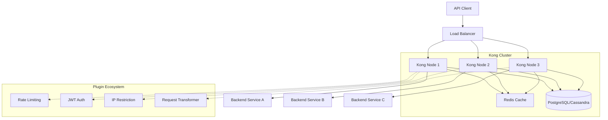
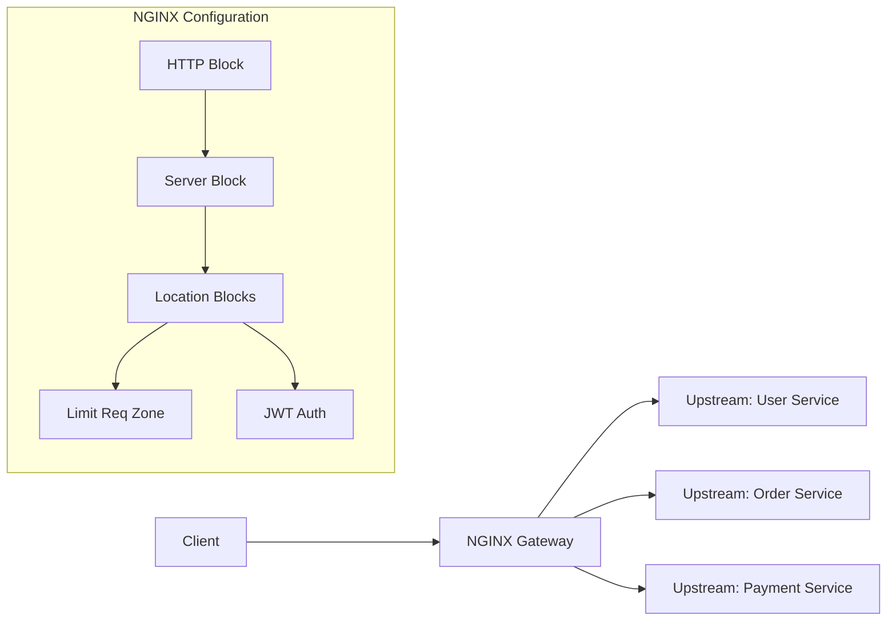
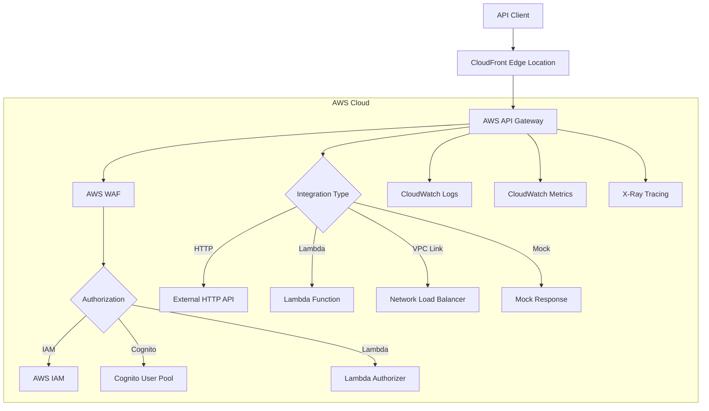
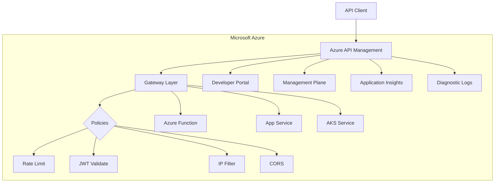
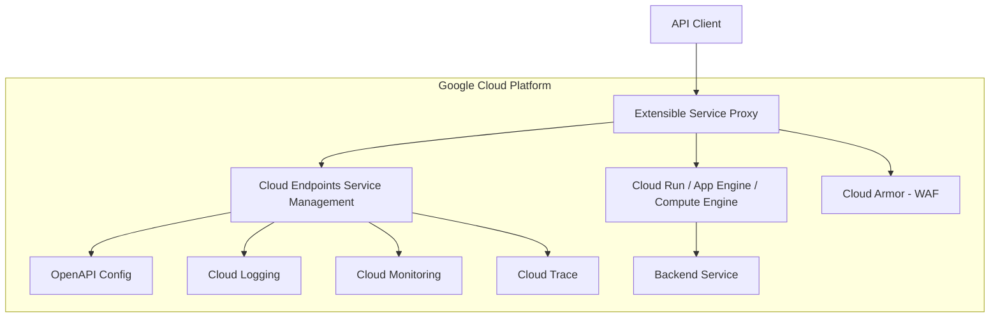
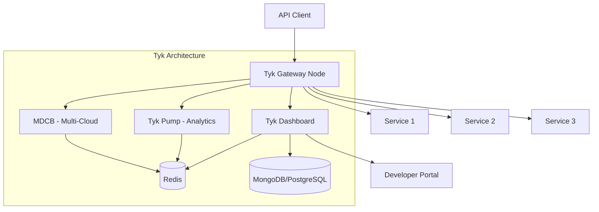
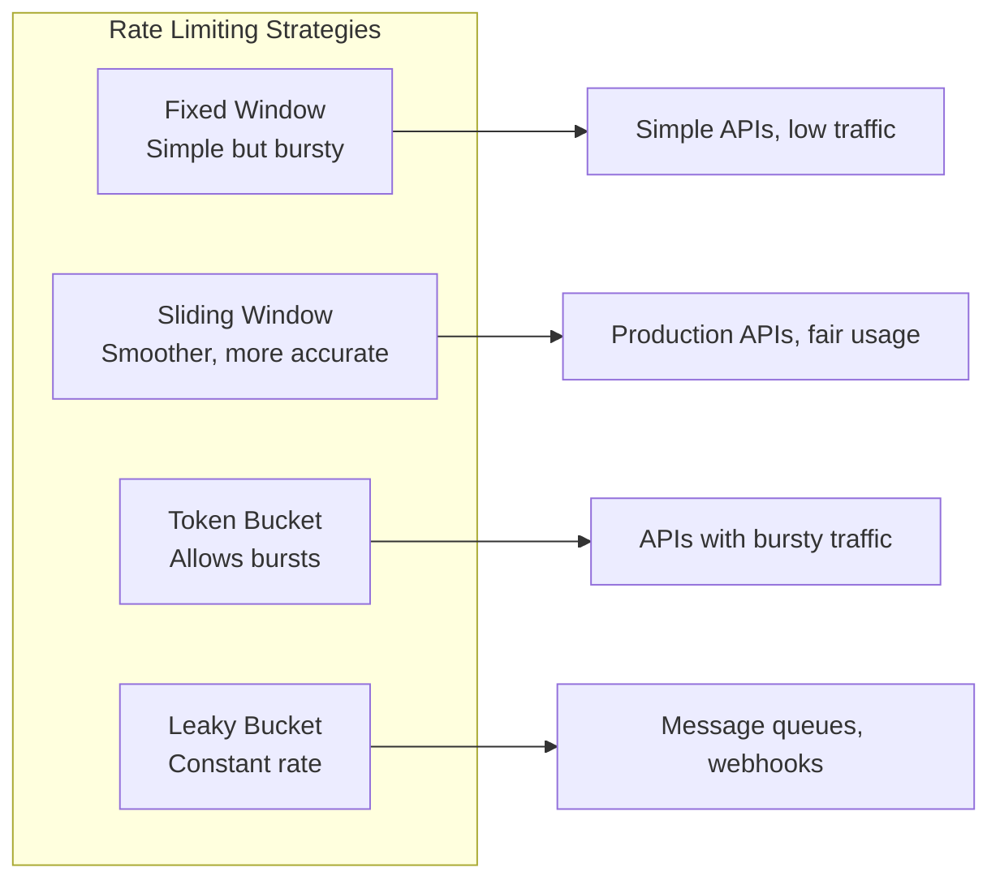
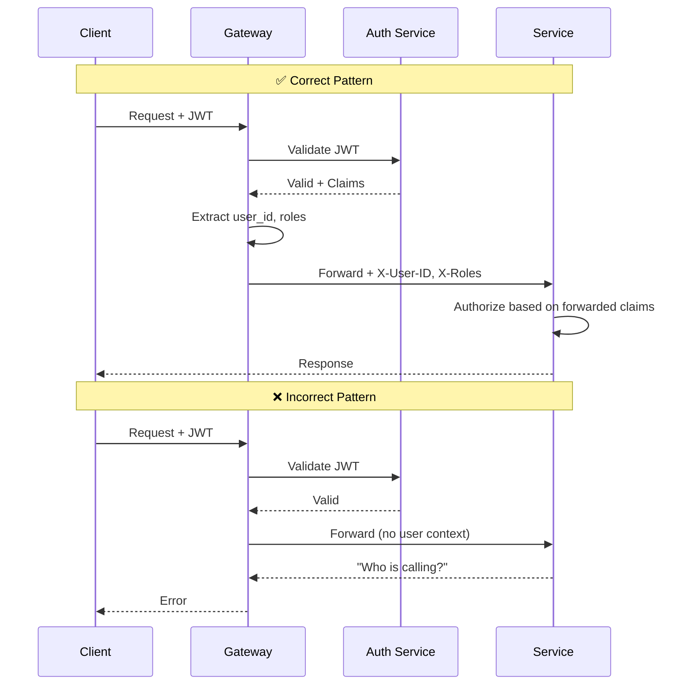
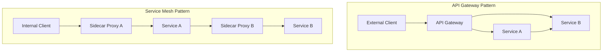

Here is the **full Story #1** in the series, written with the same depth, structure, and quality as the master introduction story.

---

# API Security Arsenal: Securing the Perimeter with Gateways & Ingress Controllers

APIs are everywhere. They power your mobile banking, your food delivery, your ride-sharing, and your favorite social media app. But before a single request reaches your backend code, it must pass through the front door — your API gateway.

Think of an API gateway as the reception desk of a large office building. The receptionist checks who you are, asks where you are going, validates your badge, limits how many people you brought, and then directs you to the correct elevator. Without this receptionist, anyone could wander directly into the CEO's office.

In the API world, the stakes are higher. A misconfigured or missing gateway can expose your entire backend to the open internet — leading to data breaches, denial of service, and financial ruin.

This story is the first in a five-part series on API security tools. We will explore the six most important gateway tools: Kong, NGINX API Gateway, AWS API Gateway, Azure API Management, Google Cloud Endpoints, and Tyk API Gateway.

By the end of this story, you will understand:
- What an API gateway does and why you need one
- How to configure rate limiting, authentication forwarding, and request validation
- The trade-offs between open-source and managed gateways
- Real-world configuration examples with code snippets
- When to use a gateway vs. a service mesh

Let us begin.

---

## 📚 Navigation: Stories in This Series

- 🔐 **1. API Security Arsenal: Securing the Perimeter with Gateways & Ingress Controllers** — *You are here*
- 🆔 **2. API Security Arsenal: Mastering Authentication with Okta, Auth0, and Keycloak** — *Coming soon*
- 🛡️ **3. API Security Arsenal: Real-Time Threat Detection with Apigee, Salt, and Cloudflare** — *Coming soon*
- 🧪 **4. API Security Arsenal: Breaking APIs Safely with OWASP ZAP, Burp Suite, and Postman** — *Coming soon*
- 🧠 **5. API Security Arsenal: How to Choose the Right Tools for Your Stack** — *Coming soon*

---

## What Is an API Gateway?

An API gateway is a reverse proxy that sits between your clients and your backend services. It intercepts all API requests, applies security and operational policies, and then routes the request to the appropriate backend.

Here is the basic architecture:

```mermaid
flowchart LR
    subgraph Clients
        Mobile[Mobile App]
        Web[Web Browser]
        Server[Server-to-Server]
    end
    
    subgraph Gateway[API Gateway Layer]
        Direction TB
        RateLimit[Rate Limiting]
        Auth[Authentication]
        Routing[Request Routing]
        Logging[Logging & Analytics]
    end
    
    subgraph Backend[Backend Services]
        Users[User Service]
        Orders[Order Service]
        Payments[Payment Service]
    end
    
    Mobile --> Gateway
    Web --> Gateway
    Server --> Gateway
    
    RateLimit --> Routing
    Auth --> Routing
    Routing --> Users
    Routing --> Orders
    Routing --> Payments
    
    Logging --> Logs[(Log Storage)]
```

**What an API gateway is NOT:**

| Misconception | Reality |
|---------------|---------|
| "A gateway replaces my backend security" | No — it adds a layer, but your backend must still validate everything |
| "A gateway is just a load balancer" | Load balancers distribute traffic; gateways enforce policies |
| "I can skip authentication if I have a gateway" | The gateway can *verify* auth, but your backend still needs to know *who* is calling |
| "One gateway fits all use cases" | Different gateways excel at different things — choose carefully |

---

## The Six Gateway Tools at a Glance

Before diving into details, here is a quick comparison of the six tools covered in this story:

| Tool | Type | Best For | Key Strength | Cost Model |
|------|------|----------|--------------|-------------|
| **Kong** | Open-source | Hybrid/multi-cloud | Plugin ecosystem, Kubernetes native | Free (OSS) or paid (Enterprise) |
| **NGINX** | Open-source | High-performance routing | Blazing fast, lightweight | Free (OSS) or paid (Plus) |
| **AWS API Gateway** | Managed | AWS-native workloads | Seamless AWS integration | Pay per request |
| **Azure API Management** | Managed | Azure-native workloads | Full lifecycle API management | Pay per unit + requests |
| **Google Cloud Endpoints** | Managed | GCP + OpenAPI users | Tight Cloud Run/IaC integration | Pay per request |
| **Tyk** | Open-source | Developer portal + analytics | Built-in developer portal | Free (OSS) or paid (Cloud/Self-managed) |

---

## Deep Dive: Each Gateway Tool

### Kong: The Plugin Powerhouse

Kong is built on top of NGINX with a plugin architecture that allows you to extend its functionality without modifying the core codebase. It is one of the most popular open-source API gateways, with a strong Kubernetes focus via the Kong Ingress Controller.

**Key security features:**
- Rate limiting (sliding window, Redis-backed)
- JWT, OAuth 2.0, Key Auth, LDAP, Basic Auth
- IP restriction (allow/deny lists)
- Request/response transformation
- Bot detection
- mTLS

**Architecture diagram:**



**Configuration example (declarative):**

```yaml
# kong.yml - Declarative configuration
_format_version: "3.0"
services:
  - name: user-service
    url: http://user-api.internal:8080
    routes:
      - name: user-route
        paths:
          - /api/v1/users
    plugins:
      - name: rate-limiting
        config:
          minute: 100
          hour: 5000
          policy: redis
      - name: jwt
        config:
          secret_is_base64: false
          claims_to_verify:
            - exp
      - name: ip-restriction
        config:
          allow:
            - 10.0.0.0/8
            - 172.16.0.0/12
          deny:
            - 203.0.113.0/24

  - name: payment-service
    url: http://payment-api.internal:9090
    routes:
      - name: payment-route
        paths:
          - /api/v1/payments
    plugins:
      - name: rate-limiting
        config:
          minute: 10  # Stricter limit for payments
      - name: key-auth
      - name: request-transformer
        config:
          add:
            headers:
              - X-User-ID: "$consumer_id"
```

**When to choose Kong:**
- You need to run the same gateway across multiple clouds (AWS, Azure, on-prem)
- You have a Kubernetes environment and want native Ingress integration
- You need a rich plugin ecosystem (100+ community plugins)
- You want open-source freedom with paid enterprise options for support

---

### NGINX API Gateway: The Speed Demon

NGINX started as a web server and reverse proxy. Over time, it has evolved into a powerful API gateway, especially with NGINX Plus (the commercial version). It is known for extreme performance and a small memory footprint.

**Key security features:**
- Rate limiting (leaky bucket algorithm)
- JWT validation (NGINX Plus)
- Basic authentication
- IP whitelisting/blacklisting
- Request body validation
- SSL/TLS termination with mTLS

**Architecture diagram:**



**Configuration example (NGINX Plus with JWT):**

```nginx
# nginx.conf
http {
    # Rate limiting zone: 10 requests per second, burst of 20
    limit_req_zone $binary_remote_addr zone=api_limit:10m rate=10r/s;
    
    # JWT validation zone
    jwt_zone $jwt_claims zone=jwt_zone:10m;
    
    upstream user_backend {
        server user-api-1.internal:8080 max_fails=3 fail_timeout=30s;
        server user-api-2.internal:8080 max_fails=3 fail_timeout=30s;
        keepalive 32;
    }
    
    server {
        listen 443 ssl http2;
        server_name api.example.com;
        
        ssl_certificate /etc/nginx/ssl/cert.pem;
        ssl_certificate_key /etc/nginx/ssl/key.pem;
        
        # Apply rate limiting globally
        limit_req zone=api_limit burst=20 nodelay;
        limit_req_status 429;
        
        # JWT validation for protected endpoints
        location /api/v1/users {
            auth_jwt "API Protected";
            auth_jwt_key_file /etc/nginx/keys/public.json;
            auth_jwt_claims $jwt_claims;
            
            # Forward user ID to backend
            proxy_set_header X-User-ID $jwt_claims.sub;
            proxy_pass http://user_backend;
        }
        
        # IP whitelisting for admin endpoints
        location /api/v1/admin {
            allow 10.0.0.0/8;
            allow 172.16.0.0/12;
            deny all;
            
            proxy_pass http://admin_backend;
        }
        
        # Request body validation
        location /api/v1/webhook {
            client_max_body_size 1m;
            
            # Validate JSON content type
            if ($content_type !~ "application/json") {
                return 415;
            }
            
            proxy_pass http://webhook_backend;
        }
    }
}
```

**When to choose NGINX:**
- Performance is your #1 priority (lowest latency of all gateways)
- You already use NGINX as a web server and want to extend it
- You need a lightweight gateway for edge deployments
- You prefer configuration-as-code (vanilla NGINX config syntax)

---

### AWS API Gateway: The Cloud-Native Choice

AWS API Gateway is a fully managed service that integrates seamlessly with the AWS ecosystem. You pay per request, with no upfront costs or servers to manage.

**Key security features:**
- IAM authentication (AWS-native)
- Lambda authorizers (custom auth logic)
- Cognito user pool integration
- API keys (usage plans)
- Resource policies (IP whitelisting)
- WAF integration
- Mutual TLS (mTLS)

**Architecture diagram:**



**Configuration example (CloudFormation / CDK):**

```yaml
# cloudformation.yaml - API Gateway with Lambda Authorizer
Resources:
  MyApi:
    Type: AWS::ApiGateway::RestApi
    Properties:
      Name: secure-api
      EndpointConfiguration:
        Types:
          - EDGE
      ApiKeySourceType: HEADER

  # Rate limiting usage plan
  UsagePlan:
    Type: AWS::ApiGateway::UsagePlan
    Properties:
      ApiStages:
        - ApiId: !Ref MyApi
          Stage: prod
      Throttle:
        BurstLimit: 100
        RateLimit: 50
      Quota:
        Limit: 10000
        Period: DAY

  # Lambda authorizer
  Authorizer:
    Type: AWS::ApiGateway::Authorizer
    Properties:
      Name: custom-authorizer
      RestApiId: !Ref MyApi
      Type: TOKEN
      IdentitySource: method.request.header.Authorization
      AuthorizerUri: !Sub arn:aws:apigateway:${AWS::Region}:lambda:path/2015-03-31/functions/${AuthLambda.Arn}/invocations

  # Resource with auth
  UsersResource:
    Type: AWS::ApiGateway::Resource
    Properties:
      RestApiId: !Ref MyApi
      ParentId: !GetAtt MyApi.RootResourceId
      PathPart: users

  UsersMethod:
    Type: AWS::ApiGateway::Method
    Properties:
      RestApiId: !Ref MyApi
      ResourceId: !Ref UsersResource
      HttpMethod: GET
      AuthorizationType: CUSTOM
      AuthorizerId: !Ref Authorizer
      Integration:
        Type: HTTP_PROXY
        IntegrationHttpMethod: GET
        Uri: http://user-service.internal/users
        ConnectionType: VPC_LINK
        ConnectionId: !Ref VpcLink

  # WAF association
  WAFAssociation:
    Type: AWS::WAFv2::WebACLAssociation
    Properties:
      WebACLArn: !Ref ApiWafAcl
      ResourceArn: !Sub arn:aws:apigateway:${AWS::Region}::/restapis/${MyApi}/stages/prod
```

**Lambda authorizer example (Node.js):**

```javascript
// Lambda Authorizer for JWT validation
exports.handler = async (event) => {
    const token = event.authorizationToken?.replace('Bearer ', '');
    
    if (!token) {
        return generatePolicy('user', 'Deny', event.methodArn);
    }
    
    try {
        // Validate JWT (using your preferred library)
        const decoded = verifyJWT(token, process.env.JWT_SECRET);
        
        // Return IAM policy with user context
        return generatePolicy(decoded.sub, 'Allow', event.methodArn, {
            userId: decoded.sub,
            roles: decoded.roles,
            email: decoded.email
        });
    } catch (error) {
        return generatePolicy('user', 'Deny', event.methodArn);
    }
};

function generatePolicy(principalId, effect, resource, context = {}) {
    return {
        principalId: principalId,
        policyDocument: {
            Version: '2012-10-17',
            Statement: [{
                Action: 'execute-api:Invoke',
                Effect: effect,
                Resource: resource
            }]
        },
        context: context
    };
}
```

**When to choose AWS API Gateway:**
- You are already heavily invested in AWS (Lambda, ECS, RDS)
- You want serverless, pay-per-request pricing
- You need deep integration with AWS WAF, CloudWatch, and X-Ray
- You prefer managed services over self-hosted infrastructure

---

### Azure API Management: The Enterprise Lifecycle Platform

Azure API Management (APIM) is a full lifecycle API management platform. It goes beyond simple gateway features to include a developer portal, API versioning, product-based access control, and policy-driven governance.

**Key security features:**
- Subscription keys (product-based)
- JWT validation
- Client certificate authentication (mTLS)
- IP filtering
- Rate limiting and quotas
- Azure AD integration
- Managed identities

**Architecture diagram:**



**Policy configuration example (XML-based):**

```xml
<!-- inbound-policy.xml -->
<policies>
    <inbound>
        <!-- IP whitelisting -->
        <ip-filter action="allow">
            <address-range from="10.0.0.0" to="10.255.255.255" />
            <address>52.123.45.67</address>
        </ip-filter>
        
        <!-- Rate limiting by subscription -->
        <rate-limit calls="100" renewal-period="60" />
        <quota calls="10000" renewal-period="86400" />
        
        <!-- JWT validation -->
        <validate-jwt header-name="Authorization" 
                      failed-validation-httpcode="401" 
                      failed-validation-error-message="Unauthorized">
            <openid-config url="https://login.microsoftonline.com/{tenant}/v2.0/.well-known/openid-configuration" />
            <audiences>
                <audience>api://my-api-client-id</audience>
            </audiences>
            <issuers>
                <issuer>https://login.microsoftonline.com/{tenant}/v2.0</issuer>
            </issuers>
            <required-claims>
                <claim name="roles" match="any">
                    <value>api_user</value>
                    <value>admin</value>
                </claim>
            </required-claims>
        </validate-jwt>
        
        <!-- Transform request headers -->
        <set-header name="X-User-Id" exists-action="override">
            <value>@(context.Request.Headers.GetValueOrDefault("Authorization","").AsJwt()?.Claims?.GetValueOrDefault("sub"))</value>
        </set-header>
        
        <!-- CORS -->
        <cors allow-credentials="true">
            <allowed-origins>
                <origin>https://myapp.com</origin>
            </allowed-origins>
            <allowed-methods>
                <method>GET</method>
                <method>POST</method>
            </allowed-methods>
        </cors>
        
        <base />
    </inbound>
    
    <backend>
        <base />
    </backend>
    
    <outbound>
        <!-- Remove sensitive headers -->
        <set-header name="Server" exists-action="delete" />
        <set-header name="X-Powered-By" exists-action="delete" />
        <base />
    </outbound>
    
    <on-error>
        <base />
    </on-error>
</policies>
```

**When to choose Azure API Management:**
- You are an Azure shop (Functions, App Service, AKS)
- You need a developer portal for external API consumers
- You require product-based access control (subscriptions, products, groups)
- You want full API lifecycle management (versions, revisions, deprecation)

---

### Google Cloud Endpoints: The OpenAPI Native

Google Cloud Endpoints is a lightweight API gateway built on top of the open-source Extensible Service Proxy (ESP). It is designed for developers who define their APIs using OpenAPI (Swagger) specifications.

**Key security features:**
- API keys
- Firebase authentication
- Google IAM integration
- JWT validation
- Rate limiting (via OpenAPI extensions)
- Cloud Armor integration (WAF)

**Architecture diagram:**



**OpenAPI configuration example (with security extensions):**

```yaml
# openapi.yaml
swagger: "2.0"
info:
  title: Secure API
  version: 1.0.0

host: api.example.com
schemes:
  - https

# Security definitions
securityDefinitions:
  api_key:
    type: "apiKey"
    name: "X-API-Key"
    in: "header"
  firebase:
    authorizationUrl: ""
    flow: "implicit"
    type: "oauth2"
    x-google-issuer: "https://securetoken.google.com/my-project"
    x-google-jwks_uri: "https://www.googleapis.com/service_accounts/v1/metadata/x509/securetoken@system.gserviceaccount.com"
    x-google-audiences: "my-project"

# Global security
security:
  - api_key: []

# Rate limiting via extension
x-google-management:
  metrics:
    - name: "read-request-count"
      displayName: "Read Request Count"
      valueType: INT64
      metricKind: DELTA
    - name: "write-request-count"
      displayName: "Write Request Count"
      valueType: INT64
      metricKind: DELTA
  
  quota:
    - name: "read-quota"
      metric: "read-request-count"
      unit: "1/min/{project}"
      limits:
        - name: "default-read-limit"
          unit: "1/min/{project}"
          values:
            STANDARD: 1000
    - name: "write-quota"
      metric: "write-request-count"
      unit: "1/min/{project}"
      limits:
        - name: "default-write-limit"
          unit: "1/min/{project}"
          values:
            STANDARD: 100

paths:
  /users:
    get:
      summary: Get users
      security:
        - firebase: []
      x-google-quota: "read-quota"
      x-google-allow: "GET"
      responses:
        200:
          description: OK
  
  /users:
    post:
      summary: Create user
      security:
        - firebase: []
        - api_key: []
      x-google-quota: "write-quota"
      x-google-allow: "POST"
      parameters:
        - in: body
          name: user
          required: true
          schema:
            type: object
            properties:
              email:
                type: string
      responses:
        201:
          description: Created

  /admin/config:
    get:
      summary: Admin configuration
      security:
        - firebase: []
      x-google-allow: "GET"
      x-google-audiences: "admin-api"
      x-google-issuer: "https://accounts.google.com"
      responses:
        200:
          description: OK
```

**When to choose Google Cloud Endpoints:**
- You use Google Cloud Run, App Engine, or Compute Engine
- You already define APIs with OpenAPI/Swagger
- You want lightweight, minimal configuration
- You prefer Google's IAM and Firebase for authentication

---

### Tyk: The Developer-First Gateway

Tyk is an open-source API gateway that emphasizes developer experience. It includes a built-in developer portal, analytics dashboard, and a rich policy management system.

**Key security features:**
- Key-based authentication (multiple algorithms)
- OAuth 2.0 (authorization code, client credentials, implicit, password)
- JWT (with custom claims validation)
- Basic authentication
- LDAP / Active Directory
- Mutual TLS
- IP whitelisting
- Rate limiting (multiple strategies)
- Quotas

**Architecture diagram:**



**API definition example (JSON):**

```json
{
  "name": "Secure API",
  "api_id": "secure-api-001",
  "org_id": "my-org",
  "definition": {
    "location": "header",
    "key": "x-api-version",
    "strip_path": false
  },
  "proxy": {
    "listen_path": "/api/v1/",
    "target_url": "http://backend-service:8080/",
    "strip_listen_path": true
  },
  "auth": {
    "auth_header_name": "Authorization",
    "use_cookie": false,
    "validate_signature": false,
    "use_param": false,
    "param_name": "",
    "use_certificate": false
  },
  "enable_jwt": true,
  "jwt_signing_method": "RS256",
  "jwt_source": "https://auth.example.com/.well-known/jwks.json",
  "jwt_identity_base_field": "sub",
  "jwt_policy_field_name": "policy_id",
  "jwt_default_policies": ["read-only-policy"],
  "rate_limit": {
    "rate": 100,
    "per": 60,
    "algorithm": "sliding_window"
  },
  "quota": {
    "quota_max": 10000,
    "quota_remaining": 10000,
    "quota_renews": 86400
  },
  "version_data": {
    "not_versioned": true,
    "versions": {
      "Default": {
        "name": "Default",
        "expires": "2025-01-01T00:00:00Z",
        "paths": {
          "ignored": [],
          "white_list": [],
          "black_list": []
        },
        "use_extended_paths": true,
        "extended_paths": {
          "ignored": [
            {
              "path": "/health",
              "method_actions": {
                "GET": {
                  "action": "no_action"
                }
              }
            }
          ],
          "white_list": [
            {
              "path": "/users",
              "method_actions": {
                "GET": {
                  "action": "no_action"
                }
              }
            }
          ]
        }
      }
    }
  },
  "session_lifetime": 28800,
  "active": true,
  "tags": ["production", "secure"],
  "enable_ip_whitelisting": true,
  "allowed_ips": ["10.0.0.0/8", "172.16.0.0/12", "192.168.0.0/16"]
}
```

**When to choose Tyk:**
- You want an open-source gateway with a polished developer portal
- You need detailed analytics and API usage metrics out of the box
- You prefer a policy-based approach (rather than per-route configuration)
- You want multi-cloud deployment with a unified control plane (MDCB)

---

## Rate Limiting: The Most Important Gateway Feature

If you implement nothing else, implement rate limiting. It protects your API from brute force attacks, DDoS, and resource exhaustion.

**Rate limiting strategies compared:**



**Configuration comparison across gateways:**

| Strategy | Kong | NGINX | AWS Gateway | Azure APIM | GCP Endpoints | Tyk |
|----------|------|-------|-------------|------------|---------------|-----|
| Fixed window | ✅ | ✅ | ✅ | ✅ | ✅ | ✅ |
| Sliding window | ✅ | ❌ | ❌ | ✅ | ❌ | ✅ |
| Token bucket | ❌ | ❌ | ✅ (burst) | ❌ | ❌ | ❌ |
| Per-user limits | ✅ | ✅ | ✅ (via usage plans) | ✅ | ✅ | ✅ |
| Per-API key | ✅ | ✅ | ✅ | ✅ | ✅ | ✅ |
| Redis-backed | ✅ | ✅ | N/A (managed) | N/A (managed) | N/A (managed) | ✅ |

**Example: Progressive rate limiting (recommended):**

```yaml
# Recommended rate limiting tiers
tiers:
  anonymous:
    rate: 10/minute
    burst: 5
  authenticated:
    rate: 100/minute
    burst: 20
  premium:
    rate: 1000/minute
    burst: 100
  internal:
    rate: 10000/minute
    burst: 500
```

---

## Authentication Forwarding: Patterns and Anti-Patterns

One of the most common gateway mistakes is assuming authentication happens *only* at the gateway. The correct pattern is authentication at the gateway, authorization at the service.



**Forwarding headers pattern (universal):**

```http
# Headers to forward from gateway to backend
X-User-ID: 12345
X-User-Email: user@example.com
X-User-Roles: admin,editor
X-Request-ID: req_abc123
X-Forwarded-For: client.ip.address
X-Forwarded-Proto: https
```

---

## Gateway vs. Service Mesh: Which One Do You Need?

This is a common source of confusion. Both sit between services, but they serve different purposes.



**Decision matrix:**

| Consideration | Use API Gateway | Use Service Mesh | Use Both |
|---------------|----------------|------------------|----------|
| Traffic source | External clients | Internal services | Both |
| Authentication | OAuth, JWT, API keys | mTLS (SPIFFE) | Gateway for external, mesh for internal |
| Rate limiting | Client-based | Service-based | Both |
| Observability | Request/response | Network-level | Combined |
| Team maturity | Ops-focused | Platform-focused | Large org |
| Example tools | Kong, AWS Gateway | Istio, Linkerd, Consul | Kong + Istio |

**Rule of thumb:** Start with an API gateway. Add a service mesh when you have more than 10 internal services and need fine-grained control over service-to-service communication.

---

## Common Gateway Mistakes and How to Fix Them

### ❌ Mistake #1: No rate limiting on authentication endpoints
Attackers will hit your `/login` or `/token` endpoint repeatedly.

**Fix:** Apply stricter rate limits to auth endpoints (e.g., 5 requests per minute).

### ❌ Mistake #2: Logging sensitive data
Gateways often log request/response bodies by default.

**Fix:** Configure field redaction for passwords, tokens, API keys, and PII.

### ❌ Mistake #3: Disabling SSL verification for backend connections
Some gateways disable SSL verification for convenience in development — and it makes it to production.

**Fix:** Always enable SSL verification. Use internal CA certificates.

### ❌ Mistake #4: Overly permissive CORS
`Access-Control-Allow-Origin: *` with credentials is dangerous.

**Fix:** Whitelist specific origins. Never use `*` with credentials.

### ❌ Mistake #5: No request size limits
Attackers send 1GB JSON payloads to exhaust memory.

**Fix:** Set `client_max_body_size` (NGINX) or equivalent in your gateway.

---

## Cost Comparison: Open-Source vs. Managed

| Gateway | Entry Cost | Operational Overhead | Scaling Cost |
|---------|------------|---------------------|---------------|
| Kong (OSS) | $0 | High (self-managed) | Add nodes |
| NGINX (OSS) | $0 | High (self-managed) | Add nodes + LB |
| Tyk (OSS) | $0 | Medium (self-managed) | Add nodes + Redis |
| AWS Gateway | $0 upfront | Low (fully managed) | $3.50 per million requests |
| Azure APIM | $0.04/hour (basic) | Low (managed) | Consumption tier available |
| GCP Endpoints | $0 upfront | Low (managed) | $2 per million requests |
| Kong Enterprise | Custom | Medium | Includes support |
| NGINX Plus | ~$2500/node/year | Medium | Per-node licensing |

**When self-hosting makes sense:**
- You have >10 million requests per month (cost becomes cheaper)
- You need to run in air-gapped or on-prem environments
- You have a dedicated platform team
- You require custom plugins that managed gateways cannot support

**When managed makes sense:**
- You want zero infrastructure management
- Your traffic is variable (serverless billing works for you)
- You are starting out (no upfront investment)
- You need deep integration with a specific cloud provider

---

## Performance Benchmarks (Approximate)

| Gateway | Latency (p99) | Throughput (req/sec) | Notes |
|---------|---------------|----------------------|-------|
| NGINX | 1-2ms | 50,000+ | Fastest |
| Kong | 2-5ms | 30,000+ | Plugin overhead |
| Tyk | 3-6ms | 25,000+ | Analytics overhead |
| AWS Gateway | 5-10ms | 10,000+ | Regional latency |
| Azure APIM | 8-15ms | 8,000+ | Policy processing |
| GCP Endpoints | 5-10ms | 10,000+ | ESP overhead |

*Note: Actual performance depends on plugins, policies, and backend latency.*

---

## What's Next?

You have now mastered API gateways — the first line of defense for your APIs. But a gateway alone cannot secure your API. It needs to know *who* is calling.

**Story #2** picks up exactly where we left off: *API Security Arsenal: Mastering Authentication with Okta, Auth0, and Keycloak*

We will cover:
- OAuth 2.0 flows (which one to use when)
- JWT structure, validation, and common pitfalls
- Single sign-on (SSO) across multiple applications
- Integrating identity providers with your gateway
- Real breach examples caused by broken authentication

---

## 📚 Navigation: Stories in This Series

- 🔐 **1. API Security Arsenal: Securing the Perimeter with Gateways & Ingress Controllers** — *You are here*
- 🆔 **2. API Security Arsenal: Mastering Authentication with Okta, Auth0, and Keycloak** — *Coming soon*
- 🛡️ **3. API Security Arsenal: Real-Time Threat Detection with Apigee, Salt, and Cloudflare** — *Coming soon*
- 🧪 **4. API Security Arsenal: Breaking APIs Safely with OWASP ZAP, Burp Suite, and Postman** — *Coming soon*
- 🧠 **5. API Security Arsenal: How to Choose the Right Tools for Your Stack** — *Coming soon*

---

*Found this guide useful? Clap 👏, comment, and follow for Story #2. If you have questions about any of the gateway tools or configurations, drop them in the responses — I will address them in future stories or updates.*

---

**Next story:** API Security Arsenal: Mastering Authentication with Okta, Auth0, and Keycloak *(Coming soon)*

---

Would you like me to continue with **Story #2** (Authentication with Okta, Auth0, and Keycloak) next?