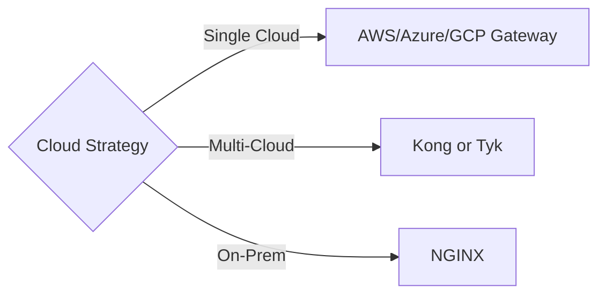
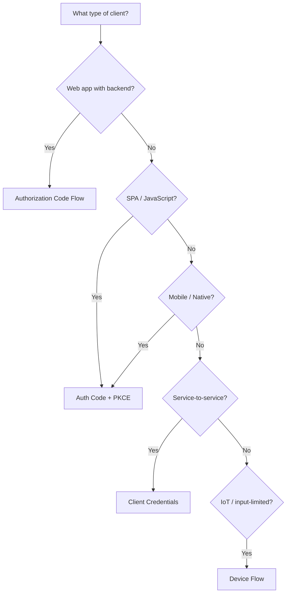
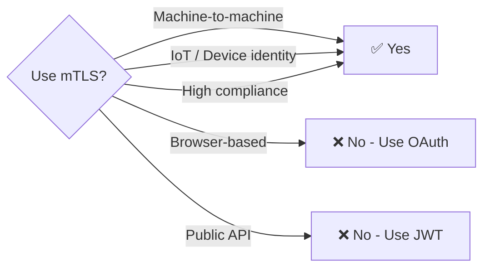
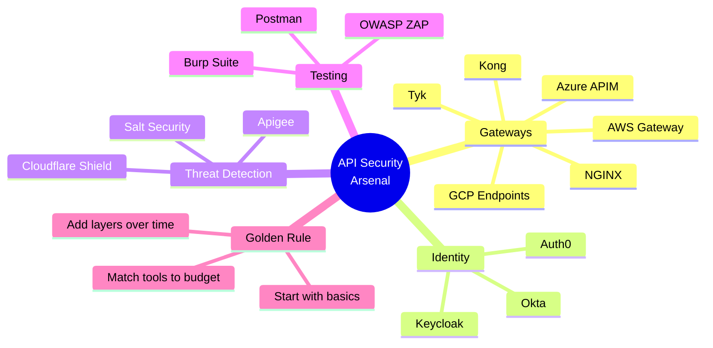

Here is a **companion cheatsheet and summary infographic** for the entire five-part series. This is designed as a printable reference, a slide deck, or a standalone Medium story.

---

# API Security Arsenal: The Complete Cheatsheet

## A 5-Minute Reference Guide to All 15 Tools

*This cheatsheet summarizes the entire five-part series. Bookmark it, print it, or share it with your team.*

---

## 📚 Series Navigation

| Story | Topic | Tools Covered | Status |
|-------|-------|---------------|--------|
| 1 | Gateways & Ingress Controllers | Kong, NGINX, AWS Gateway, Azure APIM, GCP Endpoints, Tyk | ✅ Complete |
| 2 | Authentication & Identity | Okta, Auth0, Keycloak | ✅ Complete |
| 3 | Threat Detection | Apigee, Salt Security, Cloudflare API Shield | ✅ Complete |
| 4 | Security Testing | OWASP ZAP, Burp Suite, Postman API Security | ✅ Complete |
| 5 | Choosing Your Stack | All 15 tools compared | ✅ Complete |

---

## 🔐 Story #1: Gateways at a Glance

### Quick Comparison

| Tool | Type | Key Strength | Best For | Cost |
|------|------|--------------|----------|------|
| **Kong** | Open-source | Plugin ecosystem | Multi-cloud, K8s | Free / Paid |
| **NGINX** | Open-source | Fastest performance | Edge, high throughput | Free / Paid |
| **AWS Gateway** | Managed | AWS integration | AWS-native | Pay per request |
| **Azure APIM** | Managed | Full lifecycle | Azure-native | Per unit |
| **GCP Endpoints** | Managed | OpenAPI native | GCP-native | Pay per request |
| **Tyk** | Open-source | Developer portal | Developer experience | Free / Paid |

### Essential Gateway Configurations

```yaml
# Rate Limiting (universal)
rate_limit: 100 requests per minute
burst: 20
policy: sliding_window  # or fixed_window

# Authentication Forwarding Headers
X-User-ID: user_12345
X-User-Roles: admin,editor
X-Request-ID: req_abc123

# Security Headers (always add)
Strict-Transport-Security: max-age=31536000
Content-Security-Policy: default-src 'none'
X-Content-Type-Options: nosniff
```

### Gateway Decision Tree



---

## 🆔 Story #2: Identity at a Glance

### Quick Comparison

| Tool | Type | Key Strength | Best For | Cost |
|------|------|--------------|----------|------|
| **Okta** | Commercial | Enterprise SSO | 500+ employees | Per user/month |
| **Auth0** | Commercial | Developer DX | Developer-first | Per active user |
| **Keycloak** | Open-source | Full-featured, free | Cost-sensitive | $0 (self-hosted) |

### OAuth 2.0 Flow Decision Tree



### JWT Validation Checklist

| Step | What to Check | If Missing |
|------|---------------|------------|
| 1 | Signature | Attacker can forge tokens |
| 2 | Expiration (`exp`) | Stolen tokens work forever |
| 3 | Issuer (`iss`) | Attacker can use their own tokens |
| 4 | Audience (`aud`) | Token meant for other API works |
| 5 | Not-before (`nbf`) | Clock skew attacks |
| 6 | Revocation | Compromised tokens remain valid |

### Authentication Anti-Patterns to Avoid

| Anti-Pattern | Fix |
|--------------|-----|
| ❌ Validating JWTs locally without revocation | Use token introspection or short-lived tokens |
| ❌ Storing tokens in localStorage | Use HTTP-only cookies |
| ❌ Not validating audience (`aud`) | Always validate `aud` |
| ❌ Using HS256 across services | Use RS256/ES256 |
| ❌ No refresh token rotation | Rotate on each refresh |

---

## 🛡️ Story #3: Threat Detection at a Glance

### Quick Comparison

| Tool | Type | Key Strength | Best For | Cost |
|------|------|--------------|----------|------|
| **Apigee** | Commercial | Full lifecycle + analytics | GCP, enterprise | Subscription |
| **Salt Security** | Commercial | ML behavioral detection | API security focus | Annual |
| **Cloudflare Shield** | Commercial | Edge + mTLS + DDoS | Cloudflare users | Included in CF plan |

### What Traditional Security Misses

| Attack Type | Gateway/WAF | Behavioral Detection |
|-------------|-------------|---------------------|
| Slow DDoS | ❌ Misses | ✅ Detects |
| Distributed credential stuffing | ❌ Misses | ✅ Detects |
| API scraping | ❌ Misses | ✅ Detects |
| Business logic abuse | ❌ Misses | ✅ Detects |
| Data enumeration | ⚠️ Partial | ✅ Detects |
| Off-hours exfiltration | ❌ Misses | ✅ Detects |

### mTLS Decision Tree



### Schema Validation (Critical but Underrated)

```json
// What schema validation prevents:
{
  "email": "user@example.com",
  "name": "Alice",
  "isAdmin": true,        // ← Mass assignment attack
  "role": "superadmin",   // ← Privilege escalation
  "ssn": "123-45-6789"    // ← Excessive data
}
```

---

## 🧪 Story #4: Security Testing at a Glance

### Quick Comparison

| Tool | Type | Key Strength | Best For | Cost |
|------|------|--------------|----------|------|
| **OWASP ZAP** | Open-source | Free DAST, CI/CD | Automated scanning | $0 |
| **Burp Suite** | Commercial | Manual pentesting | Professional testers | $449/year |
| **Postman Security** | Commercial | Dev workflow integration | Existing Postman users | Included in Enterprise |

### Testing Pipeline by Frequency

| Frequency | Tool | Type | Time |
|-----------|------|------|------|
| Every commit | SAST (Snyk/SonarQube) | Static analysis | < 1 min |
| Every PR | ZAP baseline | Passive scan | 2-5 min |
| Daily | Postman monitors | Scheduled | 5-10 min |
| Weekly | ZAP full scan | Active scan | 30-60 min |
| Per release | Postman security suite | Collection runner | 15-30 min |
| Quarterly | Burp Suite | Manual pentest | 1-5 days |

### OWASP API Top 10 Testing Checklist

| Risk | What to Test | Tools |
|------|--------------|-------|
| API1: BOLA | Access another user's resource | Burp Repeater, ZAP |
| API2: Broken Auth | JWT 'none' algorithm, weak secrets | Burp Intruder |
| API3: Excessive Data | Mass assignment, GraphQL introspection | Burp, Postman |
| API4: Rate Limiting | Burst 1000 requests, large payloads | Burp Intruder |
| API5: BFLA | Access admin endpoints as user | Burp Repeater |
| API6: Business Flows | Discount stacking, race conditions | Custom scripts |
| API7: SSRF | Internal IPs, file:// protocol | Burp Collaborator |
| API8: Misconfig | Debug endpoints, exposed stack traces | ZAP passive |
| API9: Inventory | Deprecated API versions | ZAP Spider |
| API10: Unsafe Consumption | Webhook payloads, redirect chains | Burp Repeater |

### GraphQL-Specific Tests

```graphql
# 1. Introspection (should be disabled in production)
query { __schema { types { name } } }

# 2. Depth attack (deep nesting)
query { user(id:"1") { friends { friends { friends { name } } } } }

# 3. Batch attack (many operations)
query { op1: user(id:"1") { name } op2: user(id:"2") { name } ... }
```

---

## 🧠 Story #5: Choosing Your Stack

### Complete Tool Matrix (All 15 Tools)

| Category | Tool | Type | Setup Complexity | Ops Overhead | Cost Model |
|----------|------|------|------------------|--------------|------------|
| Gateway | Kong | Open-source | Medium | High | Free/Paid |
| Gateway | NGINX | Open-source | Medium | High | Free/Paid |
| Gateway | AWS Gateway | Managed | Low | Low | Pay per request |
| Gateway | Azure APIM | Managed | Low | Low | Per unit |
| Gateway | GCP Endpoints | Managed | Low | Low | Pay per request |
| Gateway | Tyk | Open-source | Medium | Medium | Free/Paid |
| Identity | Okta | Commercial | Low | Low | Per user/month |
| Identity | Auth0 | Commercial | Low | Low | Per active user |
| Identity | Keycloak | Open-source | High | High | $0 |
| Threat | Apigee | Commercial | Medium | Low | Subscription |
| Threat | Salt Security | Commercial | Medium | Low | Annual |
| Threat | Cloudflare Shield | Commercial | Low | Low | Included in CF |
| Testing | OWASP ZAP | Open-source | Medium | Low | $0 |
| Testing | Burp Suite | Commercial | Medium | Low | $449/year |
| Testing | Postman Security | Commercial | Low | Low | Enterprise |

### Stack Recommendations by Budget

| Budget | Stack | Components |
|--------|-------|------------|
| **$0-500** | Free/OSS | Kong OSS + Keycloak + ZAP |
| **$500-2000** | Low-Cost Managed | Cloudflare + AWS Gateway + Auth0 free |
| **$2000-5000** | Cloud-Native | AWS/Azure native + GuardDuty/Sentinel |
| **$5000-20000** | Enterprise | Kong Enterprise + Okta + Salt + Burp |
| **$20000+** | Compliance | Add BAAs, audit logging, FedRAMP tools |

### Stack Recommendations by Team Size

| Team Size | Recommended Stack |
|-----------|-------------------|
| 1-10 developers | Free/OSS or Low-Cost Managed |
| 10-100 developers | Cloud-Native (AWS/Azure/GCP) |
| 100+ developers | Enterprise Standard |
| Enterprise + Compliance | Compliance-Focused or Gov |

### Phasing Roadmap (Months 0-18)

```mermaid
gantt
    title API Security Investment Roadmap
    dateFormat YYYY-MM
    axisFormat %b %Y
    
    Phase 1 (Months 0-3) :done
    Basic Gateway + API Keys :done, 2024-01, 3M
    Basic Rate Limiting :done, 2024-01, 3M
    OWASP ZAP in CI/CD :done, 2024-02, 2M
    
    Phase 2 (Months 3-6) :active
    OAuth/JWT (Auth0/Keycloak) :2024-04, 3M
    Cloudflare DDoS :2024-04, 2M
    Schema Validation :2024-05, 2M
    
    Phase 3 (Months 6-12)
    Postman Security :2024-07, 3M
    Advanced Rate Limiting :2024-08, 2M
    Burp Suite Pentests :2024-09, 4M
    
    Phase 4 (Months 12-18)
    Salt Security / Apigee :2024-12, 6M
    SOC2 / Compliance :2025-01, 6M
```

---

## The Golden Rule

> **"The breach did not happen because the attacker was sophisticated. It happened because a basic security control was missing."**

### Five-Minute Self-Assessment

| Question | Yes | No | Next Step |
|----------|-----|-----|-----------|
| Do you have an API gateway in front of all APIs? | ✅ | ❌ | Deploy Kong or cloud gateway |
| Do you use OAuth 2.0 + JWT (not API keys)? | ✅ | ❌ | Migrate to Auth0/Keycloak |
| Do you have rate limiting on auth endpoints? | ✅ | ❌ | Configure 5 requests/minute |
| Do you scan APIs in CI/CD? | ✅ | ❌ | Add OWASP ZAP to pipeline |
| Do you know which API versions are deprecated? | ✅ | ❌ | Run API inventory |

---

## Quick Reference Cards

### Gateway Rate Limiting by Endpoint Type

| Endpoint Type | Recommended Limit |
|---------------|-------------------|
| Authentication (/login, /token) | 5-10 per minute |
| Public read endpoints | 100-1000 per minute |
| Write endpoints (POST, PUT, DELETE) | 10-100 per minute |
| Admin endpoints | 10-50 per minute |
| Webhooks | 1000+ per minute (with queue) |

### JWT Claims to Always Validate

| Claim | What to Check |
|-------|---------------|
| `exp` | Current time < exp |
| `iat` | Not in future |
| `nbf` | Current time > nbf |
| `iss` | Matches your IdP URL |
| `aud` | Matches your API identifier |
| `sub` | User identifier (for logging) |

### Security Headers Cheatsheet

| Header | Value | Purpose |
|--------|-------|---------|
| `Strict-Transport-Security` | `max-age=31536000; includeSubDomains` | Enforce HTTPS |
| `Content-Security-Policy` | `default-src 'none'` | Prevent XSS |
| `X-Content-Type-Options` | `nosniff` | Prevent MIME sniffing |
| `X-Frame-Options` | `DENY` | Prevent clickjacking |
| `Cache-Control` | `no-store, no-cache` | Prevent sensitive caching |

### OWASP API Top 10 (2023) - One-Liner

| # | Risk | One-Liner |
|---|------|-----------|
| 1 | BOLA | User A can access User B's data |
| 2 | Broken Auth | Weak or missing authentication |
| 3 | Excessive Data | API returns more data than needed |
| 4 | Rate Limiting | No limits on request volume |
| 5 | BFLA | User can call admin functions |
| 6 | Business Flows | Workflow abuse (discount stacking) |
| 7 | SSRF | API fetches internal resources |
| 8 | Misconfig | Debug mode, default credentials |
| 9 | Inventory | Deprecated API versions exposed |
| 10 | Unsafe Consumption | No validation of third-party APIs |

---

## Final Checklist Before Launching an API

```markdown
## API Security Launch Checklist

### Gateway
- [ ] API gateway deployed (Kong, cloud-native, or NGINX)
- [ ] Rate limiting configured (per endpoint type)
- [ ] Request size limits set (1MB default)
- [ ] Security headers added (HSTS, CSP, X-Content-Type)
- [ ] Deprecated API versions blocked

### Authentication
- [ ] OAuth 2.0 + OIDC implemented (not API keys for users)
- [ ] JWT validation includes signature, exp, iss, aud
- [ ] MFA available for sensitive operations
- [ ] Short-lived tokens (≤ 1 hour) with refresh rotation

### Threat Detection
- [ ] DDoS protection enabled (Cloudflare or cloud-native)
- [ ] Schema validation enforced (OpenAPI)
- [ ] Audit logging enabled (all requests)
- [ ] Anomaly detection (if budget allows)

### Testing
- [ ] OWASP ZAP in CI/CD pipeline
- [ ] Quarterly Burp Suite penetration test scheduled
- [ ] Postman security tests in collection runner
- [ ] Rate limit testing performed

### Operations
- [ ] No hardcoded secrets in code
- [ ] Secrets in vault/parameter store
- [ ] Monitoring and alerting configured
- [ ] Incident response plan documented
```

---

## One-Page Visual Summary



---

## Where to Go Next

| Resource | Description |
|----------|-------------|
| [OWASP API Security Top 10](https://owasp.org/www-project-api-security/) | Official API vulnerability list |
| [ZAP GitHub](https://github.com/zaproxy/zaproxy) | Free DAST tool |
| [PortSwigger Web Security Academy](https://portswigger.net/web-security) | Free Burp Suite training |
| [Auth0 Blog](https://auth0.com/blog/) | Identity best practices |
| [Kong Docs](https://docs.konghq.com/) | Gateway configuration |

---

*This cheatsheet summarizes the five-part API Security Arsenal series. For detailed explanations, code examples, and architecture diagrams, refer to the individual stories.*

---

**Would you like me to create a downloadable PDF version of this cheatsheet, or format it for a specific platform (Notion, GitHub, Confluence)?**