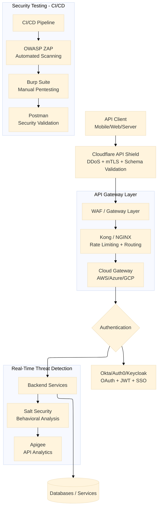

# Before diving into individual tools, it helps to u

```mermaid
---
config:
  layout: elk
  theme: base
---
flowchart TD
    Client[API Client\nMobile/Web/Server] --> CF[Cloudflare API Shield\nDDoS + mTLS + Schema Validation]
    
    CF --> WAF[WAF / Gateway Layer]
    
    subgraph Gateway_Layer [API Gateway Layer]
        WAF --> Kong[Kong / NGINX\nRate Limiting + Routing]
        Kong --> APIGW[Cloud Gateway\nAWS/Azure/GCP]
    end
    
    APIGW --> IdP{Authentication}
    IdP --> Okta[Okta/Auth0/Keycloak\nOAuth + JWT + SSO]
    IdP --> Backend[Backend Services]
    
    subgraph Threat_Detection [Real-Time Threat Detection]
        Backend --> Salt[Salt Security\nBehavioral Analysis]
        Salt --> Apigee[Apigee\nAPI Analytics]
    end
    
    subgraph Testing [Security Testing - CI/CD]
        Pipeline[CI/CD Pipeline] --> ZAP[OWASP ZAP\nAutomated Scanning]
        ZAP --> Burp[Burp Suite\nManual Pentesting]
        Burp --> Postman[Postman\nSecurity Validation]
    end
    
    Backend --> Data[(Databases / Services)]
```
