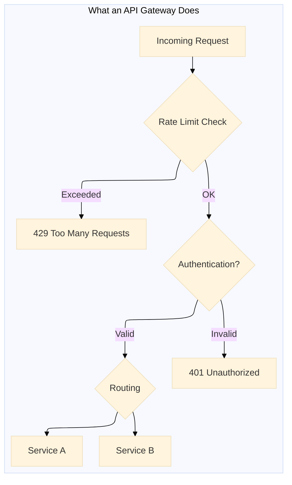

# API gateways are the bouncers of your API nightclu

```mermaid
---
config:
  layout: elk
  theme: base
---
flowchart LR
    subgraph Gateway_Functions [What an API Gateway Does]
        direction TB
        A[Incoming Request] --> B{Rate Limit Check}
        B -->|Exceeded| C[429 Too Many Requests]
        B -->|OK| D{Authentication?}
        D -->|Invalid| E[401 Unauthorized]
        D -->|Valid| F{Routing}
        F --> G[Service A]
        F --> H[Service B]
    end
```
