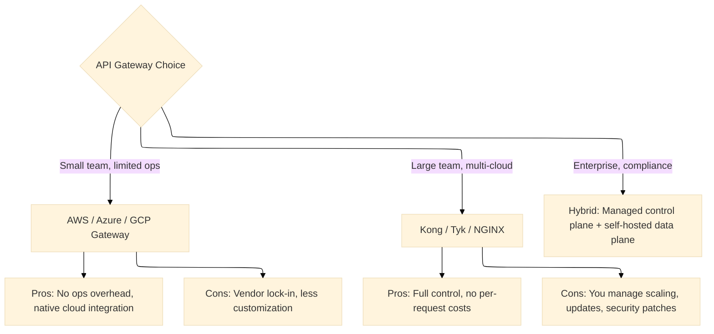

# **The open-source vs. managed trade-off:**

```mermaid
---
config:
  layout: elk
  theme: base
---
flowchart TD
    Decision{API Gateway Choice} -->|Small team, limited ops| Managed[AWS / Azure / GCP Gateway]
    Decision -->|Large team, multi-cloud| OpenSource[Kong / Tyk / NGINX]
    Decision -->|Enterprise, compliance| Hybrid[Hybrid: Managed control plane + self-hosted data plane]
    
    Managed --> ManagedPros[Pros: No ops overhead, native cloud integration]
    Managed --> ManagedCons[Cons: Vendor lock-in, less customization]
    
    OpenSource --> OpenPros[Pros: Full control, no per-request costs]
    OpenSource --> OpenCons[Cons: You manage scaling, updates, security patches]
```
