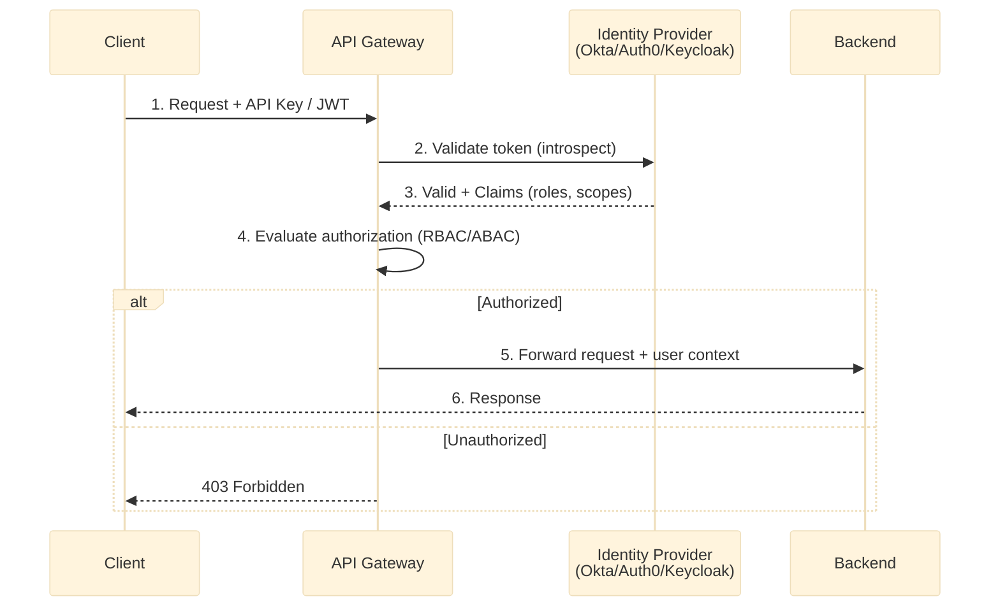

# Authentication answers "Who are you?" Authorizatio

```mermaid
---
config:
  layout: elk
  theme: base
---
sequenceDiagram
    participant Client
    participant API Gateway
    participant IdP as Identity Provider<br/>(Okta/Auth0/Keycloak)
    participant Backend
    
    Client->>API Gateway: 1. Request + API Key / JWT
    API Gateway->>IdP: 2. Validate token (introspect)
    IdP-->>API Gateway: 3. Valid + Claims (roles, scopes)
    API Gateway->>API Gateway: 4. Evaluate authorization (RBAC/ABAC)
    alt Authorized
        API Gateway->>Backend: 5. Forward request + user context
        Backend-->>Client: 6. Response
    else Unauthorized
        API Gateway-->>Client: 403 Forbidden
    end
```
