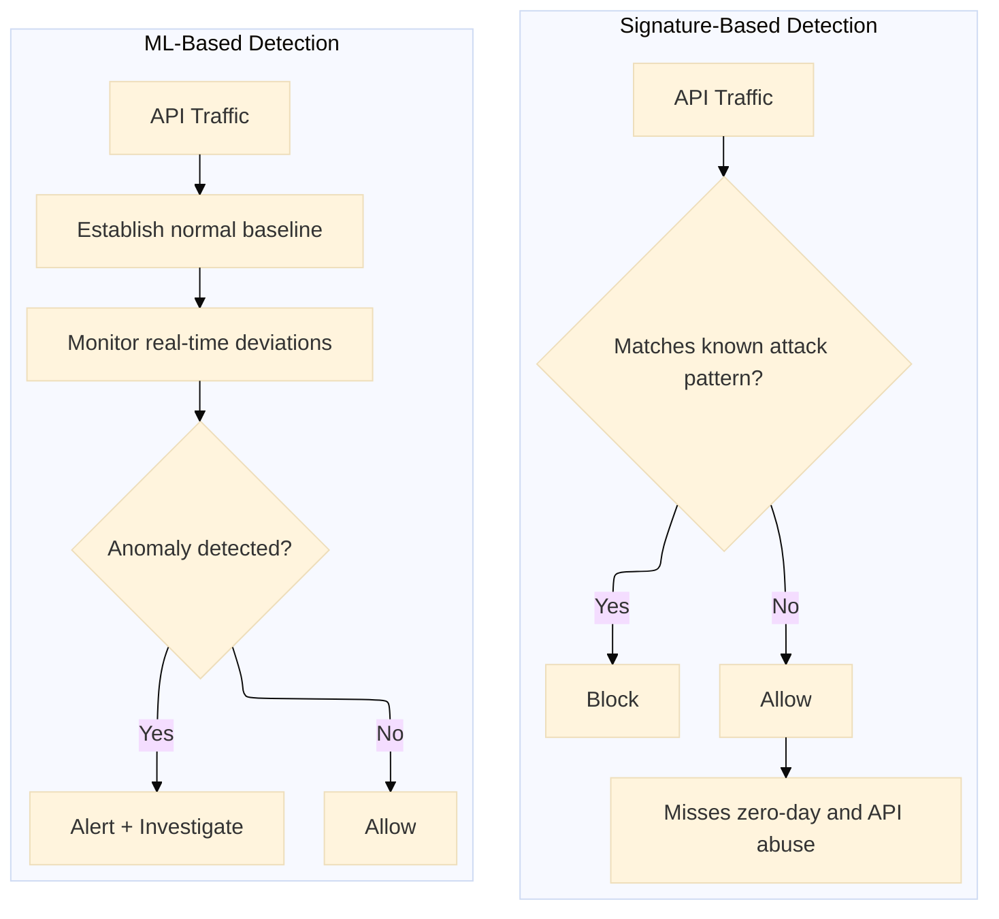

# Traditional security tools look for **known signat

```mermaid
---
config:
  layout: elk
  theme: base
---
flowchart TD
    subgraph Traditional_Approach [Signature-Based Detection]
        Traffic1[API Traffic] --> Rule{Matches known attack pattern?}
        Rule -->|Yes| Block[Block]
        Rule -->|No| Allow[Allow]
        Allow --> Miss[Misses zero-day and API abuse]
    end
    
    subgraph Behavioral_Approach [ML-Based Detection]
        Traffic2[API Traffic] --> Baseline[Establish normal baseline]
        Baseline --> Monitor[Monitor real-time deviations]
        Monitor --> Anomaly{Anomaly detected?}
        Anomaly -->|Yes| Investigate[Alert + Investigate]
        Anomaly -->|No| Allow2[Allow]
    end
```
