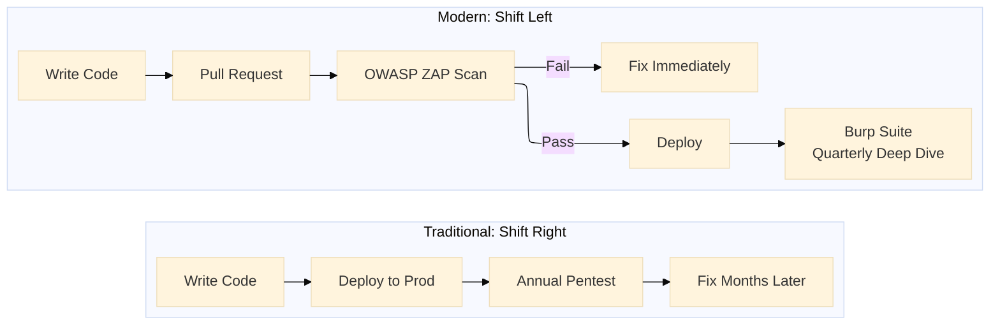

# "Shift left" means moving security testing earlier

```mermaid
---
config:
  layout: elk
  theme: base
---
flowchart LR
    subgraph Traditional_Security [Traditional: Shift Right]
        Code1[Write Code] --> Deploy1[Deploy to Prod]
        Deploy1 --> Pentest1[Annual Pentest]
        Pentest1 --> Fix1[Fix Months Later]
    end
    
    subgraph Modern_Security [Modern: Shift Left]
        Code2[Write Code] --> PR[Pull Request]
        PR --> ZAP[OWASP ZAP Scan]
        ZAP -->|Pass| Deploy2[Deploy]
        ZAP -->|Fail| Fix2[Fix Immediately]
        Deploy2 --> Periodic[Burp Suite\nQuarterly Deep Dive]
    end
```
