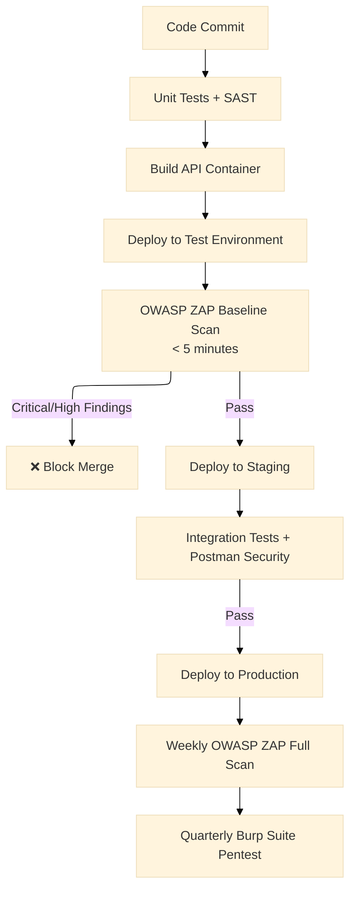

# **Minimum viable testing pipeline:**

```mermaid
---
config:
  layout: elk
  theme: base
---
flowchart TD
    Commit[Code Commit] --> Unit[Unit Tests + SAST]
    Unit --> Build[Build API Container]
    Build --> DeployTest[Deploy to Test Environment]
    DeployTest --> ZAP[OWASP ZAP Baseline Scan\n< 5 minutes]
    ZAP -->|Critical/High Findings| Fail[❌ Block Merge]
    ZAP -->|Pass| DeployStaging[Deploy to Staging]
    DeployStaging --> Integration[Integration Tests + Postman Security]
    Integration -->|Pass| DeployProd[Deploy to Production]
    DeployProd --> Weekly[Weekly OWASP ZAP Full Scan]
    Weekly --> Quarterly[Quarterly Burp Suite Pentest]
```
