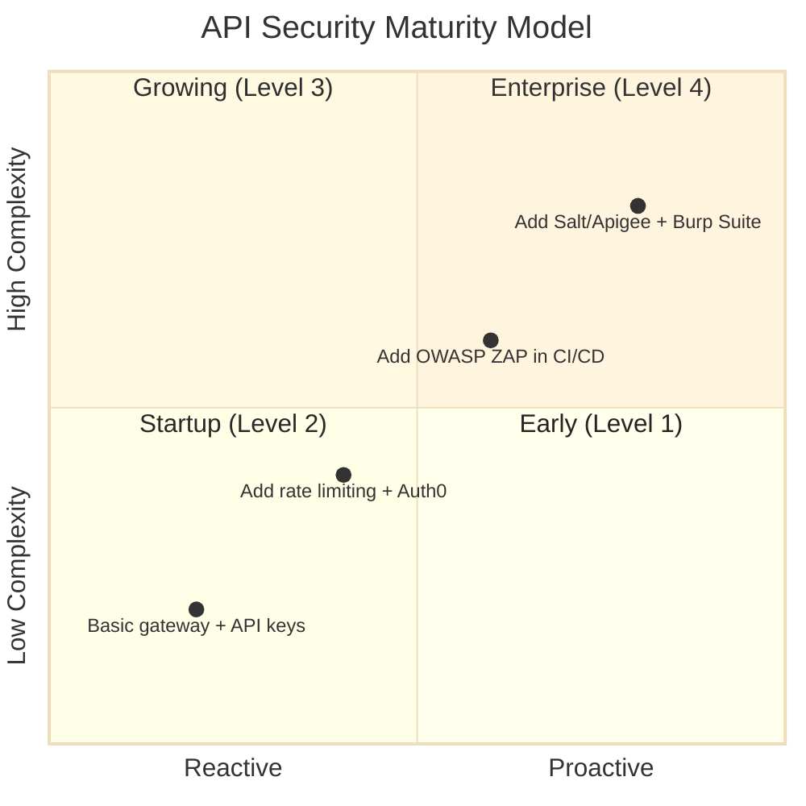

# Not every organization needs all 15 tools. Use thi

```mermaid
---
config:
  layout: elk
  theme: base
---
quadrantChart
    title API Security Maturity Model
    x-axis "Reactive" --> "Proactive"
    y-axis "Low Complexity" --> "High Complexity"
    quadrant-1 "Enterprise (Level 4)"
    quadrant-2 "Growing (Level 3)"
    quadrant-3 "Startup (Level 2)"
    quadrant-4 "Early (Level 1)"
    "Basic gateway + API keys": [0.2, 0.2]
    "Add rate limiting + Auth0": [0.4, 0.4]
    "Add OWASP ZAP in CI/CD": [0.6, 0.6]
    "Add Salt/Apigee + Burp Suite": [0.8, 0.8]
```
