# API Security Arsenal: Mastering Authentication with Okta, Auth0, and Keycloak

### Deep dive into API authentication and identity management with Okta (enterprise SSO, Universal Directory, adaptive MFA), Auth0 (passwordless, breached password detection, B2B organizations), and Keycloak (open-source, LDAP federation, fine-grained authorization). Learn OAuth 2.0 flows (Authorization Code, PKCE, Client Credentials, Device Flow), OIDC, JWT validation (signature, exp, iss, aud, nbf, revocation), authentication anti-patterns, and real breach examples from Uber, Okta, and major ride-sharing platforms.

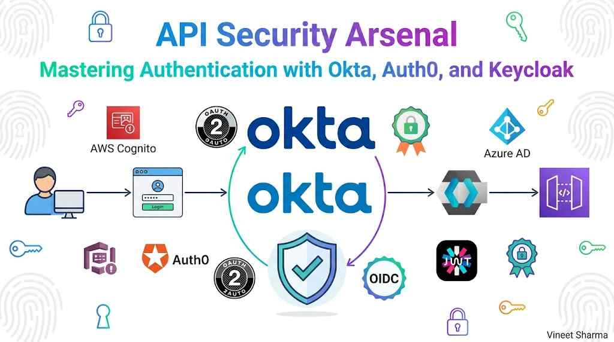

You have deployed your API gateway. Rate limiting is configured. IP whitelists are in place. But there is one critical question your gateway cannot answer on its own: *Who is calling your API?*

Authentication is the foundation of API security. Without it, you cannot enforce authorization, audit user actions, or prevent unauthorized access. Yet broken authentication remains the #1 cause of API breaches according to OWASP.

Consider this: A major ride-sharing company suffered a breach because an attacker found hardcoded service account credentials in internal scripts. A large telecom exposed millions of customer records because an API endpoint trusted any valid JWT — regardless of which user it belonged to. An identity provider itself was compromised because a service account had excessive privileges.

All of these breaches trace back to the same root cause: **broken authentication and authorization.**

This story is the second in a five-part series on API security tools. We will explore the three most important identity and access management (IAM) tools: Okta, Auth0, and Keycloak.

By the end of this story, you will understand:
- How OAuth 2.0, OIDC, and JWT work (and when to use each)
- The differences between Okta, Auth0, and Keycloak
- How to integrate these identity providers with your API gateway
- Real-world configuration examples with code snippets
- Common authentication anti-patterns and how to avoid them
- How to implement proper authorization (RBAC, ABAC, ReBAC)

Let us begin.

---

## 📚 Navigation: Stories in This Series


- 🔐 **[API Security Arsenal: 15 Essential Tools Every Engineer Should Know](https://medium.com/@mvineetsharma/api-security-arsenal-15-essential-tools-every-engineer-should-know-e055685f85f8)** — 
- 🔐 **1. [API Security Arsenal: Securing the Perimeter with Gateways & Ingress Controllers](https://medium.com/@mvineetsharma/api-security-arsenal-securing-the-perimeter-with-gateways-ingress-controllers-ce086e670612)** — *Complete*
- 🆔 **2. API Security Arsenal: Mastering Authentication with Okta, Auth0, and Keycloak** — *You are here*
- 🛡️ **3. API Security Arsenal: Real-Time Threat Detection with Apigee, Salt, and Cloudflare** — *Coming soon*
- 🧪 **4. API Security Arsenal: Breaking APIs Safely with OWASP ZAP, Burp Suite, and Postman** — *Coming soon*
- 🧠 **5. API Security Arsenal: How to Choose the Right Tools for Your Stack** — *Coming soon*

---

## The Authentication Landscape: Core Concepts

Before diving into specific tools, you need to understand three foundational technologies that every modern API authentication system uses.

### OAuth 2.0: Delegated Access

OAuth 2.0 is a framework that allows one application to access resources on behalf of a user without sharing credentials. Think of it as a "valet key" for your API.

```mermaid
```

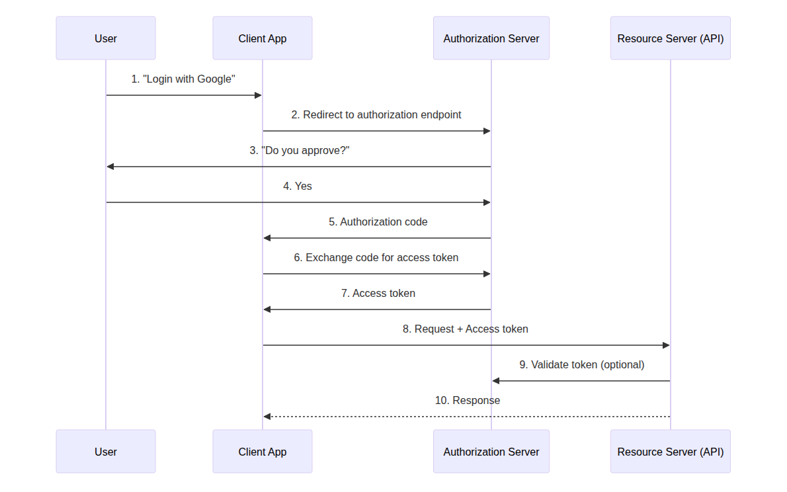

[View Source](https://github.com/Vineet-Sharma-Medium-Stories/Medium-Assets/blob/main/api-security-arsenal-mastering-authentication-with-okta-auth0-and-keycloak/diagram_01_oauth-20-is-a-framework-that-allows-one-applicati-cf46.md)


**OAuth 2.0 grant types (when to use each):**

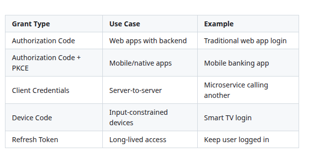

[View Source](https://github.com/Vineet-Sharma-Medium-Stories/Medium-Assets/blob/main/api-security-arsenal-mastering-authentication-with-okta-auth0-and-keycloak/table_01_oauth-20-grant-types-when-to-use-each-fdeb.md)


### OIDC (OpenID Connect): Identity on Top of OAuth

OAuth 2.0 handles *access* but not *identity*. OIDC adds an identity layer that tells you *who* the user is.

```mermaid
```


[View Source](https://github.com/Vineet-Sharma-Medium-Stories/Medium-Assets/blob/main/api-security-arsenal-mastering-authentication-with-okta-auth0-and-keycloak/diagram_02_oauth-20-handles-access-but-not-identity-oid-d35b.md)


**ID Token example (decoded JWT):**

```json
{
  "iss": "https://auth.example.com",
  "sub": "user_12345",
  "aud": "my-api-client",
  "exp": 1735689600,
  "iat": 1735686000,
  "email": "user@example.com",
  "email_verified": true,
  "name": "Jane Doe",
  "roles": ["admin", "editor"]
}
```

### JWT (JSON Web Tokens): The Token Format

JWTs are self-contained tokens that carry claims (user data) in a cryptographically signed package.

```mermaid
```

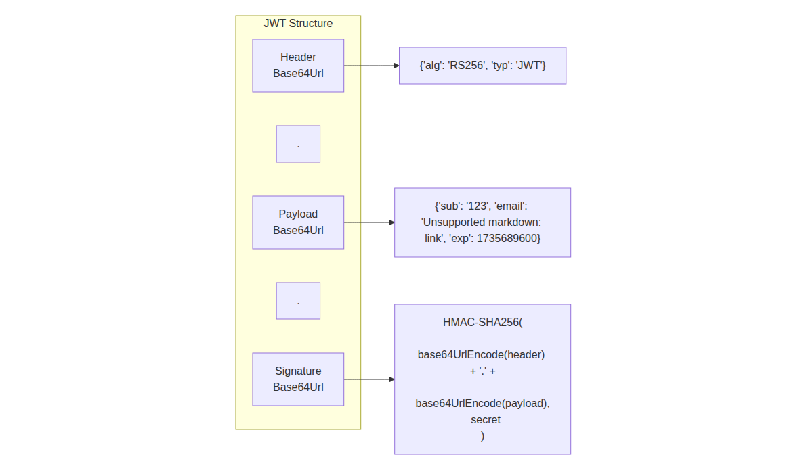

[View Source](https://github.com/Vineet-Sharma-Medium-Stories/Medium-Assets/blob/main/api-security-arsenal-mastering-authentication-with-okta-auth0-and-keycloak/diagram_03_jwts-are-self-contained-tokens-that-carry-claims-ba4e.md)


**JWT validation checklist (for your API):**

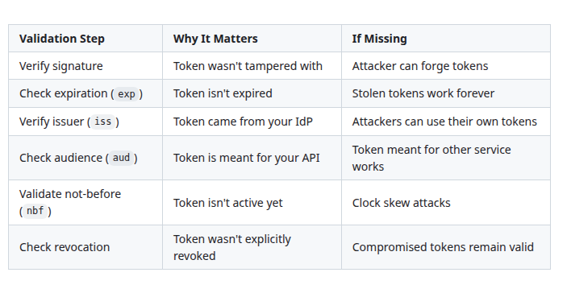

[View Source](https://github.com/Vineet-Sharma-Medium-Stories/Medium-Assets/blob/main/api-security-arsenal-mastering-authentication-with-okta-auth0-and-keycloak/table_02_jwt-validation-checklist-for-your-api-35f0.md)


---

## The Three Identity Providers at a Glance

Before diving into details, here is a quick comparison of the three tools covered in this story:

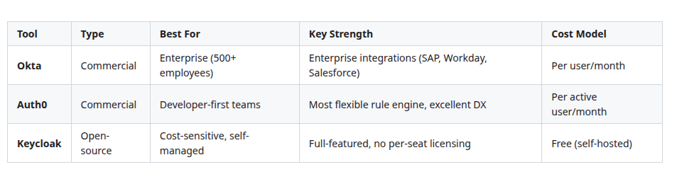

[View Source](https://github.com/Vineet-Sharma-Medium-Stories/Medium-Assets/blob/main/api-security-arsenal-mastering-authentication-with-okta-auth0-and-keycloak/table_03_before-diving-into-details-here-is-a-quick-compar-6370.md)


---

## Deep Dive: Each Identity Provider

### Okta: The Enterprise Standard

Okta is the market leader in enterprise identity management. It started as a single sign-on (SSO) provider and has expanded into a full identity platform with API access management, workforce identity, and customer identity (CIAM).

**Key security features:**
- Universal Directory (sync from HR systems, AD, LDAP)
- Adaptive MFA (risk-based authentication)
- OAuth 2.0 and OIDC support
- JWT and access token management
- API access management (fine-grained scopes)
- Workflow automation (no-code identity flows)
- SOC2, FedRAMP, HIPAA compliance

**Architecture diagram:**

```mermaid
```

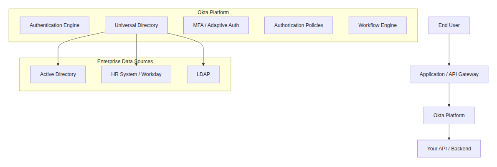

[View Source](https://github.com/Vineet-Sharma-Medium-Stories/Medium-Assets/blob/main/api-security-arsenal-mastering-authentication-with-okta-auth0-and-keycloak/diagram_04_architecture-diagram.md)


**OIDC configuration example (Okta application settings):**

```yaml
# Okta OIDC Application Configuration
application:
  name: "My API Service"
  type: "API Service"  # Machine-to-machine
  authentication:
    grant_types:
      - client_credentials
      - authorization_code
    response_types:
      - code
      - token
    
  # Token settings
  tokens:
    access_token:
      lifetime: 3600  # 1 hour
      format: "JWT"
    refresh_token:
      lifetime: 604800  # 7 days
      rotation: true
    
  # Custom claims (from Okta Expression Language)
  claims:
    - name: "roles"
      value: "getGroups(user.id).join(',')"
      include_in: ["access_token", "id_token"]
    - name: "department"
      value: "user.profile.department"
      include_in: ["access_token"]
    
  # Scopes
  scopes:
    - name: "read:users"
      description: "Read user profiles"
    - name: "write:users"
      description: "Create and update users"
    - name: "read:reports"
      description: "Access analytics reports"
    
  # Access policies
  policies:
    - name: "API Access Policy"
      rules:
        - name: "Allow internal IPs"
          conditions:
            ip_network: "10.0.0.0/8"
          actions:
            access: "ALLOW"
        - name: "Require MFA for write scopes"
          conditions:
            scope: "write:users"
          actions:
            mfa: "REQUIRED"
```

**Validating Okta JWT in your API (Node.js example):**

```javascript
// API-side JWT validation (using jose library)
const { jwtVerify, createRemoteJWKSet } = require('jose');

// Okta's JWKS endpoint
const oktaDomain = 'https://dev-123456.okta.com';
const jwksUri = `${oktaDomain}/oauth2/default/v1/keys`;
const jwksClient = createRemoteJWKSet(new URL(jwksUri));

async function validateOktaToken(token) {
  try {
    const { payload, protectedHeader } = await jwtVerify(token, jwksClient, {
      issuer: `${oktaDomain}/oauth2/default`,
      audience: 'api://default', // Your Okta audience
    });
    
    return {
      valid: true,
      userId: payload.sub,
      email: payload.email,
      roles: payload.roles?.split(',') || [],
      scopes: payload.scp || [],
      expiresAt: payload.exp
    };
  } catch (error) {
    console.error('Token validation failed:', error.message);
    return { valid: false, error: error.message };
  }
}

// Express middleware example
app.get('/api/users', async (req, res) => {
  const authHeader = req.headers.authorization;
  const token = authHeader?.replace('Bearer ', '');
  
  if (!token) {
    return res.status(401).json({ error: 'No token provided' });
  }
  
  const validation = await validateOktaToken(token);
  
  if (!validation.valid) {
    return res.status(401).json({ error: validation.error });
  }
  
  // Check scopes
  if (!validation.scopes.includes('read:users')) {
    return res.status(403).json({ error: 'Insufficient scope' });
  }
  
  // Return user data (only what this user is allowed to see)
  const users = await getUsers(validation.userId, validation.roles);
  res.json(users);
});
```

**When to choose Okta:**
- You need integration with enterprise systems (Active Directory, Workday, SAP)
- You require compliance certifications (SOC2, FedRAMP, HIPAA)
- You have complex identity workflows (onboarding, offboarding, role changes)
- You want a fully managed, highly available identity platform
- You have budget for per-user licensing

---

### Auth0: The Developer's Choice

Auth0 (acquired by Okta but operates independently) is designed for developers. It prioritizes developer experience, flexible rules, and extensive customization. It is particularly strong in customer identity (B2C and B2B) scenarios.

**Key security features:**
- Extensible rule engine (Node.js-based)
- Passwordless authentication (email, SMS, magic links)
- Breached password detection
- Anomaly detection (brute force, impossible travel)
- Custom database connections
- Social login providers (Google, Facebook, GitHub, 50+)
- Organizations (B2B multi-tenancy)

**Architecture diagram:**

```mermaid
```

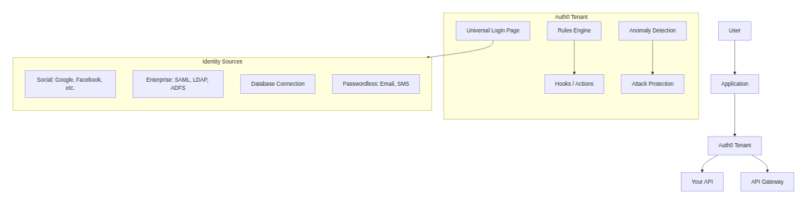

[View Source](https://github.com/Vineet-Sharma-Medium-Stories/Medium-Assets/blob/main/api-security-arsenal-mastering-authentication-with-okta-auth0-and-keycloak/diagram_05_architecture-diagram.md)


**Auth0 Action (replaces Rules) example:**

```javascript
// Auth0 Action - Runs during login flow
// This Action adds custom claims to the access token

exports.onExecutePostLogin = async (event, api) => {
  const user = event.user;
  const appMetadata = user.app_metadata || {};
  const roles = appMetadata.roles || ['user'];
  
  // Add custom claims to access token
  api.accessToken.setCustomClaim('https://api.example.com/roles', roles);
  api.accessToken.setCustomClaim('https://api.example.com/tenant_id', user.tenant_id);
  
  // Add user metadata to ID token
  api.idToken.setCustomClaim('preferred_language', user.user_metadata?.language || 'en');
  api.idToken.setCustomClaim('avatar_url', user.user_metadata?.avatar);
  
  // Check for breached password
  if (event.request.query.breached_password === 'true') {
    api.accessToken.setCustomClaim('force_password_change', true);
  }
  
  // Rate limiting per user (store in Redis via external call)
  const requestCount = await getRequestCount(user.user_id);
  if (requestCount > 100) {
    api.accessToken.setCustomClaim('rate_limited', true);
  }
};
```

**Auth0 Machine-to-Machine (Client Credentials) configuration:**

```yaml
# Auth0 M2M Application Configuration
application:
  name: "Backend Service"
  type: "Machine-to-Machine"
  
  authentication:
    grant_types:
      - client_credentials
    token_endpoint_auth_method: "client_secret_post"
    
  tokens:
    access_token:
      lifetime: 86400  # 24 hours for service accounts
      format: "JWT"
      
  # API permissions (scopes)
  api:
    identifier: "https://api.example.com"
    scopes:
      - name: "read:inventory"
        description: "Read inventory data"
      - name: "write:inventory"
        description: "Update inventory"
      - name: "read:orders"
        description: "Read customer orders"
      - name: "process:payments"
        description: "Process payment transactions"
        
  # Advanced settings
  advanced:
    oidc_conformant: true
    jwt_signature_algorithm: "RS256"
    require_signed_request_object: false
```

**Auth0 API Gateway integration (using custom authorizer):**

```javascript
// AWS Lambda Authorizer for Auth0 JWT
// Reusable across all APIs

const jwksClient = require('jwks-rsa');
const jwt = require('jsonwebtoken');

const client = jwksClient({
  jwksUri: 'https://your-domain.auth0.com/.well-known/jwks.json',
  cache: true,
  rateLimit: true,
  jwksRequestsPerMinute: 10
});

function getKey(header, callback) {
  client.getSigningKey(header.kid, (err, key) => {
    const signingKey = key.getPublicKey();
    callback(null, signingKey);
  });
}

exports.handler = async (event) => {
  const token = event.authorizationToken?.replace('Bearer ', '');
  
  if (!token) {
    return generatePolicy('user', 'Deny', event.methodArn);
  }
  
  try {
    const decoded = await new Promise((resolve, reject) => {
      jwt.verify(token, getKey, {
        issuer: 'https://your-domain.auth0.com/',
        audience: 'https://api.example.com',
        algorithms: ['RS256']
      }, (err, decoded) => {
        if (err) reject(err);
        else resolve(decoded);
      });
    });
    
    // Extract claims for downstream services
    const context = {
      userId: decoded.sub,
      email: decoded.email,
      roles: JSON.stringify(decoded['https://api.example.com/roles'] || []),
      tenantId: decoded['https://api.example.com/tenant_id'],
      scope: decoded.scope
    };
    
    return generatePolicy(decoded.sub, 'Allow', event.methodArn, context);
  } catch (error) {
    console.error('Auth failed:', error);
    return generatePolicy('user', 'Deny', event.methodArn);
  }
};

function generatePolicy(principalId, effect, resource, context = {}) {
  return {
    principalId: principalId,
    policyDocument: {
      Version: '2012-10-17',
      Statement: [{
        Action: 'execute-api:Invoke',
        Effect: effect,
        Resource: resource
      }]
    },
    context: context
  };
}
```

**When to choose Auth0:**
- Developer experience is your top priority
- You need B2B multi-tenancy (Organizations feature)
- You want passwordless and social login out of the box
- You need extensive customization (Actions, Hooks, Rules)
- You are building a customer-facing application (B2C)

---

### Keycloak: The Open-Source Powerhouse

Keycloak is an open-source identity and access management solution maintained by Red Hat. It offers enterprise-grade features without licensing costs — but you must host and manage it yourself.

**Key security features:**
- Single Sign-On (SAML 2.0, OIDC, OAuth 2.0)
- Social login (Google, Facebook, GitHub, etc.)
- User federation (LDAP, Active Directory, custom)
- Fine-grained authorization (RBAC, ABAC, ReBAC)
- Brute force detection
- OTP and WebAuthn support
- Admin console and account management console
- Docker/Kubernetes native deployment

**Architecture diagram:**

```mermaid
```

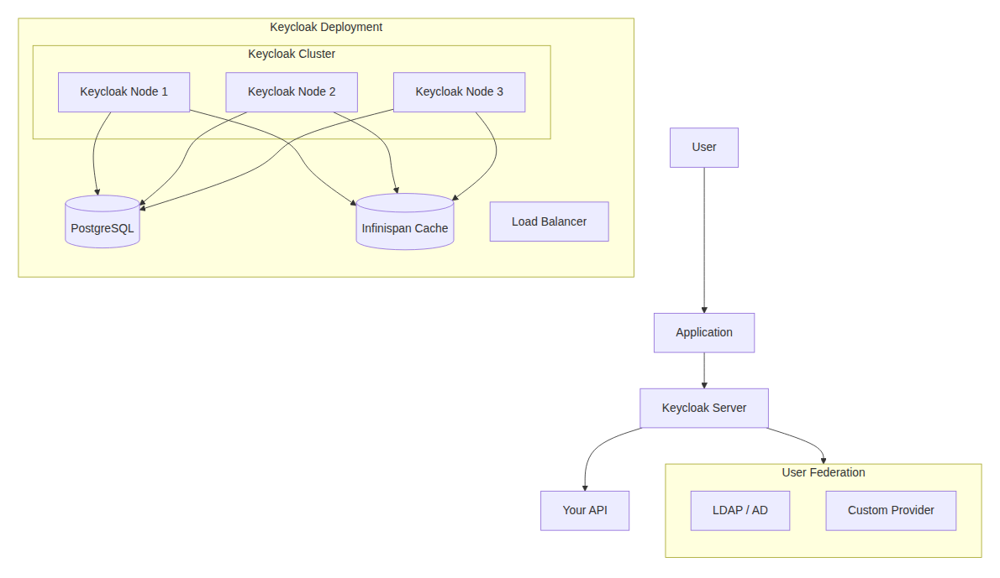

[View Source](https://github.com/Vineet-Sharma-Medium-Stories/Medium-Assets/blob/main/api-security-arsenal-mastering-authentication-with-okta-auth0-and-keycloak/diagram_06_architecture-diagram.md)


**Keycloak Docker Compose setup:**

```yaml
# docker-compose.yml
version: '3.8'

services:
  postgres:
    image: postgres:15
    environment:
      POSTGRES_DB: keycloak
      POSTGRES_USER: keycloak
      POSTGRES_PASSWORD: ${DB_PASSWORD}
    volumes:
      - postgres_data:/var/lib/postgresql/data
    healthcheck:
      test: ["CMD-SHELL", "pg_isready -U keycloak"]
      interval: 10s
      timeout: 5s
      retries: 5

  keycloak:
    image: quay.io/keycloak/keycloak:22.0
    command: start --optimized
    environment:
      KC_DB: postgres
      KC_DB_URL: jdbc:postgresql://postgres/keycloak
      KC_DB_USERNAME: keycloak
      KC_DB_PASSWORD: ${DB_PASSWORD}
      KC_HOSTNAME: auth.example.com
      KC_HTTP_ENABLED: "true"
      KC_HTTP_PORT: 8080
      KC_HOSTNAME_STRICT: "false"
      KEYCLOAK_ADMIN: admin
      KEYCLOAK_ADMIN_PASSWORD: ${ADMIN_PASSWORD}
    ports:
      - "8080:8080"
    depends_on:
      postgres:
        condition: service_healthy
    healthcheck:
      test: ["CMD", "curl", "-f", "http://localhost:8080/health/ready"]
      interval: 30s
      timeout: 5s
      retries: 3

  keycloak-init:
    image: quay.io/keycloak/keycloak:22.0
    command: "bin/kc.sh export --dir /tmp/export --realm demo --users realm_file"
    depends_on:
      keycloak:
        condition: service_healthy
    environment:
      KC_BOOTSTRAP_ADMIN_USERNAME: admin
      KC_BOOTSTRAP_ADMIN_PASSWORD: ${ADMIN_PASSWORD}
    volumes:
      - ./keycloak-export:/tmp/export

volumes:
  postgres_data:
```

**Keycloak realm configuration (JSON export):**

```json
{
  "realm": "api-security",
  "enabled": true,
  "displayName": "API Security Demo",
  "accessTokenLifespan": 3600,
  "accessTokenLifespanForImplicitFlow": 900,
  "ssoSessionIdleTimeout": 3600,
  "ssoSessionMaxLifespan": 86400,
  
  "clients": [
    {
      "clientId": "api-gateway",
      "enabled": true,
      "publicClient": false,
      "serviceAccountsEnabled": true,
      "standardFlowEnabled": true,
      "directAccessGrantsEnabled": true,
      "protocol": "openid-connect",
      "secret": "${CLIENT_SECRET}",
      "redirectUris": ["https://gateway.example.com/*"],
      "webOrigins": ["https://gateway.example.com"],
      "attributes": {
        "access.token.lifespan": "3600"
      }
    }
  ],
  
  "users": [
    {
      "username": "api-admin",
      "enabled": true,
      "email": "admin@example.com",
      "firstName": "API",
      "lastName": "Admin",
      "credentials": [
        {
          "type": "password",
          "value": "${ADMIN_PASSWORD}",
          "temporary": false
        }
      ],
      "realmRoles": ["admin"],
      "clientRoles": {
        "api-gateway": ["write:all", "read:all"]
      }
    },
    {
      "username": "api-reader",
      "enabled": true,
      "email": "reader@example.com",
      "credentials": [
        {
          "type": "password",
          "value": "${READER_PASSWORD}",
          "temporary": false
        }
      ],
      "realmRoles": ["user"],
      "clientRoles": {
        "api-gateway": ["read:users"]
      }
    }
  ],
  
  "roles": {
    "realm": [
      { "name": "admin" },
      { "name": "user" },
      { "name": "auditor" }
    ],
    "client": {
      "api-gateway": [
        { "name": "read:users" },
        { "name": "write:users" },
        { "name": "read:reports" },
        { "name": "write:reports" },
        { "name": "read:all" },
        { "name": "write:all" }
      ]
    }
  },
  
  "authorizationServices": {
    "policies": [
      {
        "name": "Admin Only",
        "type": "role",
        "logic": "POSITIVE",
        "roles": ["admin"]
      },
      {
        "name": "User Resource Owner",
        "type": "user",
        "logic": "POSITIVE",
        "users": ["${user.id}"]
      },
      {
        "name": "IP Whitelist",
        "type": "client-ip",
        "logic": "POSITIVE",
        "condition": "${client.ipAddress.startsWith('10.')}"
      }
    ],
    "permissions": [
      {
        "name": "Read User Permission",
        "type": "resource",
        "policies": ["Admin Only", "User Resource Owner"],
        "resources": ["User Resource"],
        "scopes": ["read"]
      }
    ]
  }
}
```

**Keycloak token validation in Python (FastAPI):**

```python
# FastAPI middleware for Keycloak JWT validation
from fastapi import FastAPI, Depends, HTTPException, status
from fastapi.security import HTTPBearer, HTTPAuthorizationCredentials
import jwt
from jwt import PyJWKClient
import os

app = FastAPI()
security = HTTPBearer()

# Keycloak configuration
KEYCLOAK_URL = "https://auth.example.com"
REALM = "api-security"
JWKS_URL = f"{KEYCLOAK_URL}/realms/{REALM}/protocol/openid-connect/certs"

# JWKS client for signature verification
jwks_client = PyJWKClient(JWKS_URL)

def verify_keycloak_token(credentials: HTTPAuthorizationCredentials = Depends(security)):
    token = credentials.credentials
    
    try:
        # Get signing key from JWKS
        signing_key = jwks_client.get_signing_key_from_jwt(token)
        
        # Verify and decode token
        payload = jwt.decode(
            token,
            signing_key.key,
            algorithms=["RS256"],
            audience="api-gateway",  # Your client ID
            issuer=f"{KEYCLOAK_URL}/realms/{REALM}"
        )
        
        return payload
    except jwt.ExpiredSignatureError:
        raise HTTPException(
            status_code=status.HTTP_401_UNAUTHORIZED,
            detail="Token has expired"
        )
    except jwt.InvalidTokenError as e:
        raise HTTPException(
            status_code=status.HTTP_401_UNAUTHORIZED,
            detail=f"Invalid token: {str(e)}"
        )

@app.get("/api/users")
async def get_users(token_data: dict = Depends(verify_keycloak_token)):
    # Extract user info from token
    user_id = token_data.get("sub")
    roles = token_data.get("realm_access", {}).get("roles", [])
    client_roles = token_data.get("resource_access", {}).get("api-gateway", {}).get("roles", [])
    
    # Authorization check
    if "read:users" not in client_roles and "admin" not in roles:
        raise HTTPException(
            status_code=status.HTTP_403_FORBIDDEN,
            detail="Insufficient permissions"
        )
    
    # Only return data this user is allowed to see
    if "admin" in roles:
        users = await get_all_users()
    else:
        users = await get_own_user(user_id)
    
    return {"users": users}

@app.post("/api/users")
async def create_user(user_data: dict, token_data: dict = Depends(verify_keycloak_token)):
    client_roles = token_data.get("resource_access", {}).get("api-gateway", {}).get("roles", [])
    
    if "write:users" not in client_roles:
        raise HTTPException(status_code=403, detail="Write permission required")
    
    # Create user
    new_user = await create_new_user(user_data)
    return {"user": new_user}
```

**When to choose Keycloak:**
- You need open-source, self-hosted identity
- You have the team to manage and operate Keycloak
- You are cost-sensitive (no per-user licensing)
- You require on-premise or air-gapped deployment
- You want full control over customizations and extensions

---

## OAuth 2.0 Flows: Which One Should You Use?

Choosing the wrong OAuth flow is a common security mistake. Here is a decision framework:

```mermaid
```

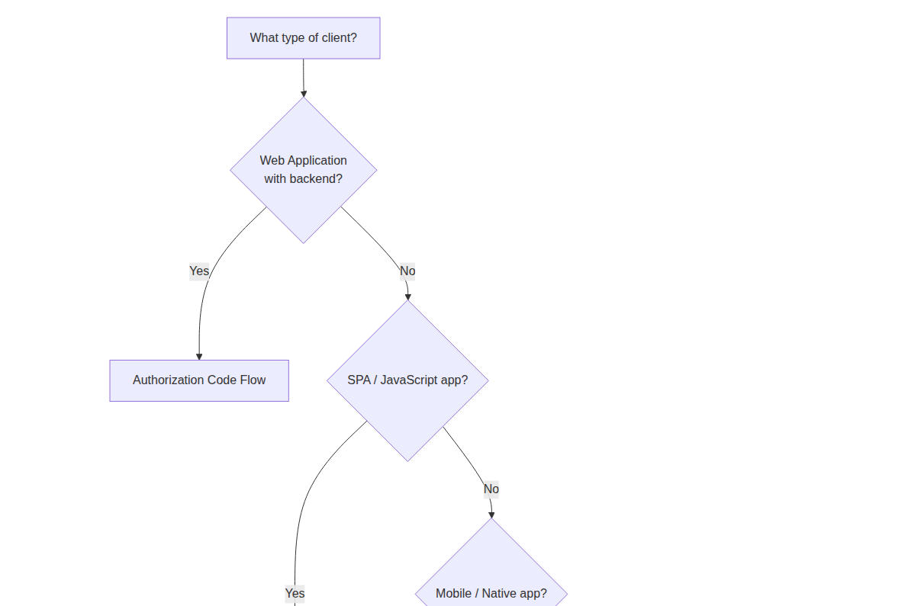

[View Source](https://github.com/Vineet-Sharma-Medium-Stories/Medium-Assets/blob/main/api-security-arsenal-mastering-authentication-with-okta-auth0-and-keycloak/diagram_07_choosing-the-wrong-oauth-flow-is-a-common-security-65c1.md)


**Flow comparison table:**

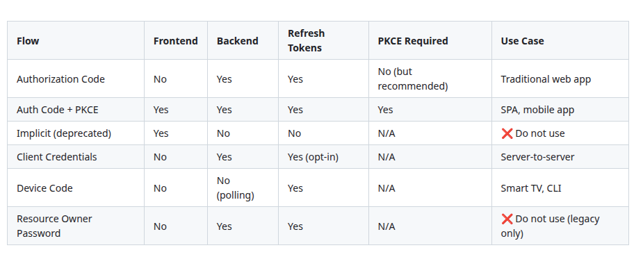

[View Source](https://github.com/Vineet-Sharma-Medium-Stories/Medium-Assets/blob/main/api-security-arsenal-mastering-authentication-with-okta-auth0-and-keycloak/table_04_flow-comparison-table.md)


**Critical warning:** The Implicit Flow and Resource Owner Password Flow are considered obsolete and should not be used for new applications.

---

## JWT Validation in Depth

Validating a JWT is not as simple as checking the signature. Here is the complete validation checklist with code examples.

```javascript
// Complete JWT validation function
const jwt = require('jsonwebtoken');
const jwksClient = require('jwks-rsa');

const client = jwksClient({
  jwksUri: 'https://your-issuer/.well-known/jwks.json',
  cache: true,
  rateLimit: true
});

async function validateJWT(token, options = {}) {
  const {
    issuer = 'https://your-issuer',
    audience = 'api://default',
    leeway = 60, // seconds clock skew
    checkRevocation = true
  } = options;
  
  try {
    // 1. Decode without verification to check structure
    const decoded = jwt.decode(token, { complete: true });
    if (!decoded || !decoded.header || !decoded.payload) {
      throw new Error('Invalid JWT structure');
    }
    
    // 2. Get signing key from JWKS
    const key = await client.getSigningKey(decoded.header.kid);
    const signingKey = key.getPublicKey();
    
    // 3. Verify signature, expiration, issuer, audience
    const verified = jwt.verify(token, signingKey, {
      issuer: issuer,
      audience: audience,
      algorithms: ['RS256', 'RS384', 'RS512'],
      clockTolerance: leeway,
      ignoreExpiration: false
    });
    
    // 4. Check additional claims
    if (verified.nbf && verified.nbf > Math.floor(Date.now() / 1000) + leeway) {
      throw new Error('Token not yet valid');
    }
    
    // 5. Check revocation (if enabled)
    if (checkRevocation) {
      const isRevoked = await checkTokenRevocation(verified.jti, verified.sub);
      if (isRevoked) {
        throw new Error('Token has been revoked');
      }
    }
    
    // 6. Check scope/roles (application-specific)
    const requiredScopes = options.requiredScopes || [];
    const tokenScopes = (verified.scope || '').split(' ');
    const missingScopes = requiredScopes.filter(s => !tokenScopes.includes(s));
    if (missingScopes.length > 0) {
      throw new Error(`Missing scopes: ${missingScopes.join(', ')}`);
    }
    
    return {
      valid: true,
      payload: verified,
      userId: verified.sub,
      scopes: tokenScopes,
      expiresAt: verified.exp
    };
    
  } catch (error) {
    return {
      valid: false,
      error: error.message
    };
  }
}

// Token revocation check (using Redis or database)
async function checkTokenRevocation(tokenId, userId) {
  // Store revoked tokens with TTL = token lifetime
  const redisKey = `revoked:${tokenId}`;
  const exists = await redis.exists(redisKey);
  return exists === 1;
}
```

---

## Authorization: Beyond Authentication

Authentication tells you *who* the user is. Authorization tells you *what* they can do. Many breaches happen because developers stop at authentication.

```mermaid
```

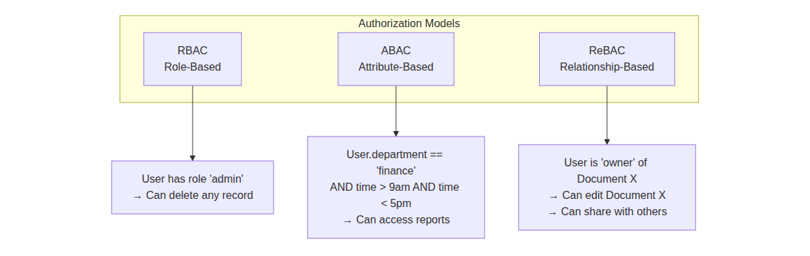

[View Source](https://github.com/Vineet-Sharma-Medium-Stories/Medium-Assets/blob/main/api-security-arsenal-mastering-authentication-with-okta-auth0-and-keycloak/diagram_08_authentication-tells-you-who-the-user-is-author-c4c4.md)


**Implementation examples:**

```python
# RBAC - Role Based Access Control
def check_rbac(user_roles: list, required_role: str) -> bool:
    return required_role in user_roles

# ABAC - Attribute Based Access Control
def check_abac(user: dict, resource: dict, action: str) -> bool:
    # Rule: Users can only access resources in their own region
    if user['region'] != resource['region']:
        return False
    
    # Rule: Finance data only during business hours
    if resource['type'] == 'finance' and not is_business_hours():
        return False
    
    # Rule: PII requires MFA within last hour
    if resource['contains_pii'] and not user['mfa_recent']:
        return False
    
    return True

# ReBAC - Relationship Based Access Control (Google Zanzibar style)
def check_rebac(user_id: str, resource_id: str, relation: str) -> bool:
    # Check direct relationship
    if has_direct_relationship(user_id, resource_id, relation):
        return True
    
    # Check through groups (transitive)
    groups = get_user_groups(user_id)
    for group in groups:
        if has_group_relationship(group, resource_id, relation):
            return True
    
    return False
```

---

## Common Authentication Mistakes and How to Fix Them

### ❌ Mistake #1: Validating JWTs locally without checking revocation
A compromised token remains valid until it expires — which could be hours or days.

**Fix:** Use token introspection or short-lived tokens (5-15 minutes) with refresh.

### ❌ Mistake #2: Storing tokens in localStorage (SPA security risk)
XSS attacks can steal tokens from localStorage.

**Fix:** Use HTTP-only cookies with `Secure`, `SameSite=Strict`, and short lifetimes.

### ❌ Mistake #3: Not validating the audience (`aud`) claim
A token meant for service A should not work for service B.

**Fix:** Always validate `aud` against your API's identifier.

### ❌ Mistake #4: Using symmetric signing (HS256) across services
If one service has the secret, it can forge tokens.

**Fix:** Use asymmetric signing (RS256/ES256) where services only have public keys.

### ❌ Mistake #5: Storing too much in the JWT
Large JWTs increase latency and expose sensitive data.

**Fix:** Keep JWTs small. Store user ID and roles only. Fetch other data from database.

### ❌ Mistake #6: No refresh token rotation
A stolen refresh token can be used indefinitely.

**Fix:** Implement refresh token rotation (each refresh issues a new refresh token, invalidating the old one).

### ❌ Mistake #7: Ignoring OAuth scope best practices
Coarse scopes (like `write`) give too much permission.

**Fix:** Use fine-grained scopes: `read:users`, `write:users`, `delete:users`, `read:reports`.

---

## Integration with API Gateway

Your identity provider and API gateway must work together. Here is the standard integration pattern:

```mermaid
```

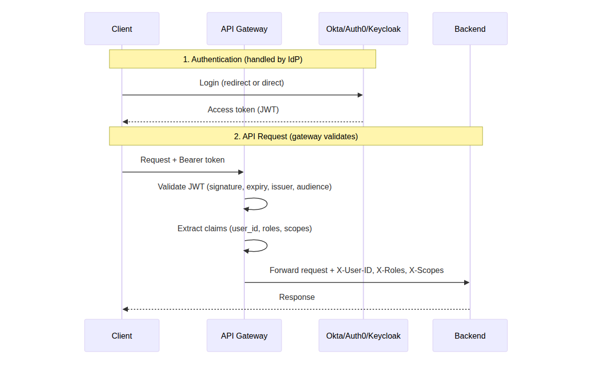

[View Source](https://github.com/Vineet-Sharma-Medium-Stories/Medium-Assets/blob/main/api-security-arsenal-mastering-authentication-with-okta-auth0-and-keycloak/diagram_09_your-identity-provider-and-api-gateway-must-work-t-d275.md)


**Gateway configuration snippets (from Story #1):**

```yaml
# Kong JWT plugin
plugins:
  - name: jwt
    config:
      secret_is_base64: false
      claims_to_verify:
        - exp
        - aud
      audience: "https://api.example.com"
      maximum_expiration: 86400

# AWS Gateway Lambda authorizer (calls IdP)
# NGINX JWT validation (NGINX Plus)
# Azure APIM validate-jwt policy
# Google Cloud Endpoints security definition
# Tyk JWT configuration
```

---

## Cost Comparison: Okta vs. Auth0 vs. Keycloak

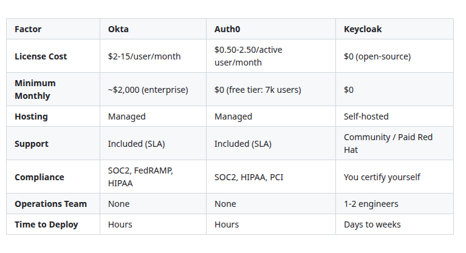

[View Source](https://github.com/Vineet-Sharma-Medium-Stories/Medium-Assets/blob/main/api-security-arsenal-mastering-authentication-with-okta-auth0-and-keycloak/table_05_cost-comparison-okta-vs-auth0-vs-keycloak-74c7.md)


**When self-hosting Keycloak saves money:**
- You have >10,000 active users
- You have existing operations team
- You can accept self-certified compliance
- You need air-gapped deployment

**When managed (Okta/Auth0) is worth the cost:**
- You have <10,000 active users
- You have no dedicated identity team
- You need compliance certifications out of the box
- You want developer velocity (less ops overhead)

---

## Real-World Breach Examples and Lessons

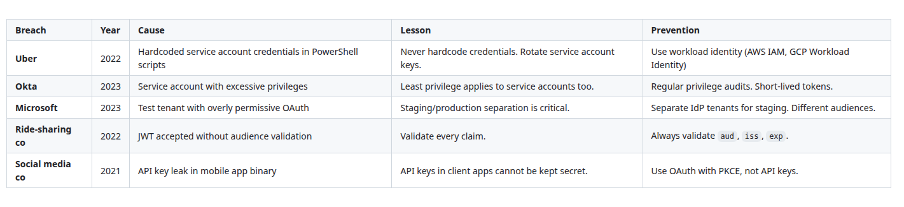

[View Source](https://github.com/Vineet-Sharma-Medium-Stories/Medium-Assets/blob/main/api-security-arsenal-mastering-authentication-with-okta-auth0-and-keycloak/table_06_real-world-breach-examples-and-lessons-cf19.md)


---

## What's Next?

You have now mastered authentication and identity management. Your API gateway knows who is calling, and your identity provider handles user credentials, MFA, and token issuance.

But authentication is not enough. What happens when an authenticated user behaves maliciously? What if they are a legitimate customer scraping your entire product catalog? What if they are using multiple accounts to hoard inventory during a flash sale?

**Story #3** picks up exactly where we left off: *API Security Arsenal: Real-Time Threat Detection with Apigee, Salt, and Cloudflare*

We will cover:
- Behavioral analysis and anomaly detection
- API abuse (scraping, credential stuffing, business logic attacks)
- Schema validation and mTLS
- How ML-based detection finds what gateways and authentication miss

---

## 📚 Navigation: Stories in This Series

- 🔐 **[API Security Arsenal: 15 Essential Tools Every Engineer Should Know](https://medium.com/@mvineetsharma/api-security-arsenal-15-essential-tools-every-engineer-should-know-e055685f85f8)** — 
- 🔐 **1. [API Security Arsenal: Securing the Perimeter with Gateways & Ingress Controllers](https://medium.com/@mvineetsharma/api-security-arsenal-securing-the-perimeter-with-gateways-ingress-controllers-ce086e670612)** — *Complete*
- 🆔 **2. API Security Arsenal: Mastering Authentication with Okta, Auth0, and Keycloak** — *You are here*
- 🛡️ **3. API Security Arsenal: Real-Time Threat Detection with Apigee, Salt, and Cloudflare** — *Coming soon*
- 🧪 **4. API Security Arsenal: Breaking APIs Safely with OWASP ZAP, Burp Suite, and Postman** — *Coming soon*
- 🧠 **5. API Security Arsenal: How to Choose the Right Tools for Your Stack** — *Coming soon*

---

*Found this guide useful? Clap 👏, comment, and follow for Story #3. If you have questions about implementing authentication for your specific use case, drop them in the responses — I will address them in future stories or updates.*

---

**Next story:** API Security Arsenal: Real-Time Threat Detection with Apigee, Salt, and Cloudflare *(Coming soon)*

---

---
Coming soon! Want it sooner? Let me know with a clap or comment below


*� Questions? Drop a response - I read and reply to every comment.*  
*📌 Save this story to your reading list - it helps other engineers discover it.*  
**🔗 Follow me →**

- **[Medium](mvineetsharma.medium.com)** - mvineetsharma.medium.com
- **[LinkedIn](www.linkedin.com/in/vineet-sharma-architect)** -  [www.linkedin.com/in/vineet-sharma-architect](http://www.linkedin.com/in/vineet-sharma-architect)

*In-depth .NET, Node.js, Python, Cloud Architecture, and System Design. New articles weekly*