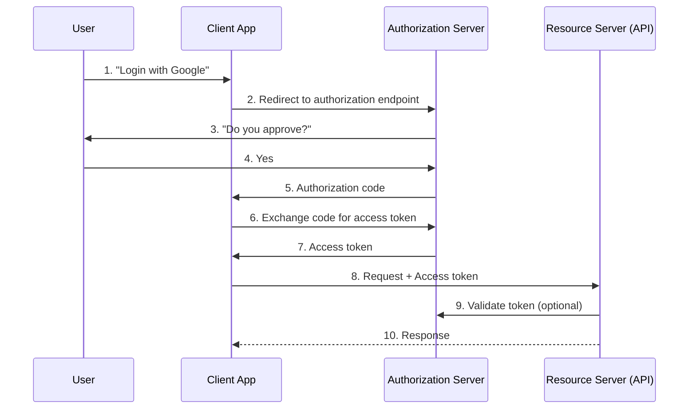

# OAuth 2.0 is a framework that allows one applicati

```mermaid
sequenceDiagram
    participant User
    participant Client as Client App
    participant Auth as Authorization Server
    participant API as Resource Server (API)
    
    User->>Client: 1. "Login with Google"
    Client->>Auth: 2. Redirect to authorization endpoint
    Auth->>User: 3. "Do you approve?"
    User->>Auth: 4. Yes
    Auth->>Client: 5. Authorization code
    Client->>Auth: 6. Exchange code for access token
    Auth->>Client: 7. Access token
    Client->>API: 8. Request + Access token
    API->>Auth: 9. Validate token (optional)
    API-->>Client: 10. Response
```
